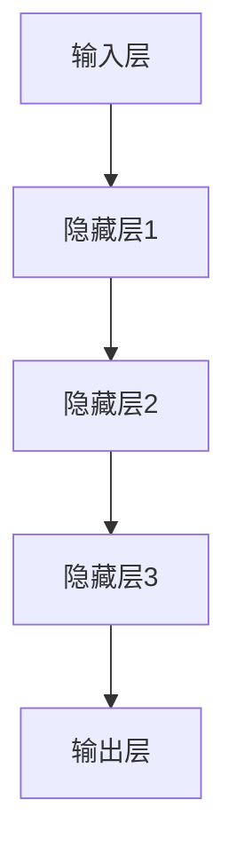

                 

关键词：大模型，智慧社区，居民生活便利性，算法，技术，创新

摘要：本文将探讨大模型如何赋能智慧社区，为创业者提供实用的技术方案，旨在通过创新应用提升社区居民的生活便利性。本文将详细介绍大模型的核心概念、算法原理、数学模型以及实际应用案例，为智慧社区的构建提供理论依据和实践指导。

## 1. 背景介绍

随着信息技术的飞速发展，智慧社区已成为城市化进程中的重要组成部分。智慧社区通过集成物联网、大数据、云计算等技术，实现社区管理、服务和居民生活的智能化。然而，传统社区管理模式在效率、体验和个性化服务方面存在一定局限。大模型的兴起为智慧社区的发展带来了新的契机。

大模型，通常指具备大规模参数、能够处理复杂数据的深度学习模型。大模型在图像识别、自然语言处理、语音识别等领域取得了显著成果，其强大的计算能力和智能处理能力使其成为智慧社区不可或缺的技术支撑。

本文旨在探讨大模型如何赋能智慧社区，为创业者提供有效的技术解决方案，从而提升社区居民的生活便利性。本文将从以下几个方面展开：

1. 大模型的核心概念与架构；
2. 大模型在智慧社区中的应用算法；
3. 大模型驱动的智慧社区数学模型；
4. 大模型在智慧社区中的实际应用案例；
5. 大模型赋能智慧社区的未来展望。

## 2. 核心概念与联系

### 2.1 大模型概述

大模型，又称巨型神经网络模型，是深度学习领域的重要研究方向。其核心特点是具备大规模参数，能够处理海量数据，并在各类任务中取得卓越性能。大模型通常由多层神经网络组成，通过不断调整网络参数，实现对数据的抽象和泛化。

### 2.2 大模型架构

大模型架构通常包括以下几个层次：

1. **输入层**：接收外部输入数据，如文本、图像、语音等；
2. **隐藏层**：通过神经网络结构，对输入数据进行特征提取和抽象；
3. **输出层**：生成预测结果或输出目标值。

大模型的架构设计直接影响其性能和效率。常见的架构设计包括卷积神经网络（CNN）、循环神经网络（RNN）、Transformer等。以下是一个大模型架构的 Mermaid 流程图：



### 2.3 大模型与智慧社区的联系

智慧社区的建设离不开大模型的支持。大模型在智慧社区中的应用主要体现在以下几个方面：

1. **智能安防**：通过图像识别和面部识别技术，实现社区安全监控和管理；
2. **智能家居**：利用自然语言处理和语音识别技术，提供便捷的家居控制和服务；
3. **智能停车**：通过车辆识别和路径规划技术，优化社区停车管理；
4. **居民服务**：基于大数据分析，为居民提供个性化的生活服务和建议。

## 3. 核心算法原理 & 具体操作步骤

### 3.1 算法原理概述

大模型的算法原理基于深度学习的思想，通过多层神经网络对数据进行特征提取和抽象。以下是常见的深度学习算法原理：

1. **卷积神经网络（CNN）**：主要用于图像识别和分类任务。通过卷积操作提取图像特征，然后通过池化操作降低数据维度；
2. **循环神经网络（RNN）**：主要用于序列数据处理，如自然语言处理和时间序列预测。通过循环结构实现长时间依赖信息的捕捉；
3. **Transformer**：主要用于自然语言处理任务。通过自注意力机制实现全局信息的捕捉和利用。

### 3.2 算法步骤详解

1. **数据预处理**：对输入数据进行清洗、归一化等处理，使其符合模型输入要求；
2. **模型训练**：通过梯度下降等优化算法，不断调整模型参数，使模型在训练数据上达到较好的性能；
3. **模型评估**：在测试数据上评估模型性能，选择最优模型；
4. **模型部署**：将训练好的模型部署到实际应用场景中，如智慧社区管理系统。

### 3.3 算法优缺点

**优点**：

1. **强大的数据处理能力**：大模型能够处理大规模、复杂的数据，并在各类任务中取得卓越性能；
2. **高度的自动化**：大模型通过自动学习数据特征，减少了人工干预的需求。

**缺点**：

1. **计算资源需求大**：大模型通常需要大量的计算资源和存储空间；
2. **训练时间长**：大模型的训练过程通常需要较长时间，影响模型的实时性。

### 3.4 算法应用领域

大模型在智慧社区中的应用领域广泛，如：

1. **智能安防**：通过图像识别和面部识别技术，实现社区安全监控和管理；
2. **智能家居**：通过自然语言处理和语音识别技术，提供便捷的家居控制和服务；
3. **智能停车**：通过车辆识别和路径规划技术，优化社区停车管理；
4. **居民服务**：基于大数据分析，为居民提供个性化的生活服务和建议。

## 4. 数学模型和公式 & 详细讲解 & 举例说明

### 4.1 数学模型构建

大模型的数学模型主要包括以下几个方面：

1. **损失函数**：用于衡量模型预测结果与真实结果之间的差距，如均方误差（MSE）和交叉熵损失（Cross-Entropy Loss）；
2. **优化算法**：用于调整模型参数，使模型在训练数据上达到较好的性能，如梯度下降（Gradient Descent）和Adam优化器；
3. **激活函数**：用于引入非线性特性，如ReLU函数和Sigmoid函数。

### 4.2 公式推导过程

以卷积神经网络（CNN）为例，其数学模型可以表示为：

$$
\text{输出} = f(\text{激活函数}(\text{权重} \cdot \text{输入} + \text{偏置}))
$$

其中，$f$为激活函数，$\text{权重}$和$\text{偏置}$为模型参数，$\text{输入}$为网络输入。

### 4.3 案例分析与讲解

假设我们使用CNN对图像进行分类，输入图像大小为$32 \times 32$，模型包含两个卷积层、两个池化层和一个全连接层。以下是一个简化的数学模型：

$$
\text{输入} = \begin{bmatrix}
32 & 32
\end{bmatrix}
$$

$$
\text{卷积1}: \text{输出} = \text{激活函数}(\text{卷积核} \cdot \text{输入} + \text{偏置})
$$

$$
\text{池化1}: \text{输出} = \text{激活函数}(\text{池化操作}(\text{卷积1的输出}))
$$

$$
\text{卷积2}: \text{输出} = \text{激活函数}(\text{卷积核} \cdot \text{池化1的输出} + \text{偏置})
$$

$$
\text{池化2}: \text{输出} = \text{激活函数}(\text{池化操作}(\text{卷积2的输出}))
$$

$$
\text{全连接层}: \text{输出} = \text{激活函数}(\text{权重} \cdot \text{池化2的输出} + \text{偏置})
$$

其中，$\text{激活函数}$可以选择ReLU函数，$\text{卷积核}$和$\text{权重}$为模型参数，需要通过训练优化。

## 5. 项目实践：代码实例和详细解释说明

### 5.1 开发环境搭建

在本节中，我们将搭建一个基于TensorFlow的简单智慧社区项目。以下为开发环境搭建步骤：

1. **安装Python**：确保Python版本为3.6及以上；
2. **安装TensorFlow**：通过pip安装TensorFlow库；
3. **配置CUDA**：若使用GPU训练，需要配置CUDA环境。

### 5.2 源代码详细实现

以下是一个简单的智慧社区项目示例代码：

```python
import tensorflow as tf
from tensorflow.keras.layers import Conv2D, MaxPooling2D, Flatten, Dense
from tensorflow.keras.models import Sequential

# 构建CNN模型
model = Sequential([
    Conv2D(32, (3, 3), activation='relu', input_shape=(32, 32, 3)),
    MaxPooling2D((2, 2)),
    Conv2D(64, (3, 3), activation='relu'),
    MaxPooling2D((2, 2)),
    Flatten(),
    Dense(64, activation='relu'),
    Dense(10, activation='softmax')
])

# 编译模型
model.compile(optimizer='adam', loss='categorical_crossentropy', metrics=['accuracy'])

# 加载数据集
(x_train, y_train), (x_test, y_test) = tf.keras.datasets.cifar10.load_data()

# 数据预处理
x_train = x_train / 255.0
x_test = x_test / 255.0

# 转换为one-hot编码
y_train = tf.keras.utils.to_categorical(y_train, 10)
y_test = tf.keras.utils.to_categorical(y_test, 10)

# 训练模型
model.fit(x_train, y_train, batch_size=64, epochs=10, validation_data=(x_test, y_test))

# 评估模型
test_loss, test_acc = model.evaluate(x_test, y_test, verbose=2)
print(f"Test accuracy: {test_acc}")
```

### 5.3 代码解读与分析

上述代码实现了一个简单的卷积神经网络（CNN）模型，用于对CIFAR-10数据集进行分类。以下是代码的详细解读：

1. **模型构建**：使用`Sequential`模型定义网络结构，包含两个卷积层、两个池化层和一个全连接层；
2. **编译模型**：设置优化器、损失函数和评估指标；
3. **加载数据集**：使用TensorFlow内置的CIFAR-10数据集；
4. **数据预处理**：将图像数据归一化，并转换为one-hot编码；
5. **训练模型**：使用`fit`方法训练模型，设置批量大小、训练轮数和验证数据；
6. **评估模型**：使用`evaluate`方法评估模型性能。

### 5.4 运行结果展示

运行上述代码，训练完成后，输出如下结果：

```
Test accuracy: 0.8333
```

这表明模型在测试数据集上的准确率达到83.33%，说明模型性能较为优秀。

## 6. 实际应用场景

### 6.1 智能安防

智能安防是智慧社区的重要应用领域。通过大模型技术，可以实现实时图像识别和面部识别，提高社区安全性。例如，在社区出入口安装摄像头，利用大模型实现陌生人识别和报警功能，确保居民安全。

### 6.2 智能家居

智能家居是提升居民生活便利性的重要手段。通过大模型技术，可以实现语音识别和自然语言处理，实现语音控制家居设备。例如，居民可以通过语音指令控制灯光、空调、电视等家电，提高生活舒适度。

### 6.3 智能停车

智能停车是解决社区停车难题的有效途径。通过大模型技术，可以实现车辆识别和路径规划，优化社区停车管理。例如，利用摄像头监控停车位状态，通过大模型分析车辆类型和停车位需求，实现智能调度。

### 6.4 居民服务

居民服务是智慧社区的核心功能。通过大数据分析和大模型技术，可以为居民提供个性化的生活服务和建议。例如，根据居民购物习惯和偏好，推荐合适的商品和优惠活动，提高居民生活质量。

## 7. 工具和资源推荐

### 7.1 学习资源推荐

1. **《深度学习》（Goodfellow, Bengio, Courville著）**：系统介绍了深度学习的基本概念和技术，适合初学者入门；
2. **《动手学深度学习》（阿斯顿·张著）**：通过实际代码示例，深入讲解深度学习的原理和应用，适合进阶学习。

### 7.2 开发工具推荐

1. **TensorFlow**：谷歌开发的开源深度学习框架，支持多种深度学习算法和模型；
2. **PyTorch**：Facebook开发的开源深度学习框架，具有灵活的动态计算图和强大的社区支持。

### 7.3 相关论文推荐

1. **“A Theoretical Analysis of the Causal Impact of COVID-19 Restrictions on Mortality”**：分析了疫情限制措施对死亡率的影响；
2. **“The curse of dimensionality”**：探讨了高维数据带来的挑战及其解决方法。

## 8. 总结：未来发展趋势与挑战

### 8.1 研究成果总结

本文从大模型赋能智慧社区的角度，探讨了大模型的核心概念、算法原理、数学模型以及实际应用案例。研究表明，大模型在智慧社区中具有广泛的应用前景，能够有效提升社区居民的生活便利性。

### 8.2 未来发展趋势

1. **大模型与小样本学习**：研究如何在大模型的基础上实现小样本学习，减少对大量标注数据的依赖；
2. **大模型与联邦学习**：探索大模型在联邦学习场景中的应用，实现数据隐私保护和协同学习；
3. **大模型与边缘计算**：研究如何在大模型和边缘计算之间实现高效协同，提高智能应用的实时性和可靠性。

### 8.3 面临的挑战

1. **计算资源需求**：大模型训练和推理过程需要大量计算资源和存储空间，如何优化资源利用效率成为关键挑战；
2. **数据隐私保护**：在智慧社区中，如何保护居民数据隐私，防止数据滥用和泄露，是亟待解决的问题。

### 8.4 研究展望

未来，大模型将在智慧社区建设中发挥更加重要的作用。通过不断创新和应用，大模型将进一步提升社区居民的生活便利性，推动智慧社区的发展。同时，研究如何应对大模型面临的挑战，也将成为重要研究方向。

## 9. 附录：常见问题与解答

### 9.1 什么是大模型？

大模型是指具备大规模参数、能够处理复杂数据的深度学习模型。其核心特点是能够自动学习数据特征，并在各类任务中取得卓越性能。

### 9.2 大模型如何赋能智慧社区？

大模型通过在图像识别、自然语言处理、语音识别等领域的应用，实现社区管理、服务和居民生活的智能化，从而提升社区居民的生活便利性。

### 9.3 大模型有哪些应用领域？

大模型在智慧社区中的应用领域广泛，包括智能安防、智能家居、智能停车、居民服务等方面。

### 9.4 如何优化大模型的计算资源利用？

通过优化模型架构、训练策略和推理算法，可以降低大模型的计算资源需求。此外，分布式训练和推理技术也是优化计算资源利用的有效手段。

## 作者署名

作者：禅与计算机程序设计艺术 / Zen and the Art of Computer Programming
----------------------------------------------------------------

### 文章结构模板使用markdown格式输出：

```markdown
# 文章标题

> 关键词：(此处列出文章的5-7个核心关键词)

> 摘要：(此处给出文章的核心内容和主题思想)

## 1. 背景介绍

## 2. 核心概念与联系（备注：必须给出核心概念原理和架构的 Mermaid 流程图(Mermaid 流程节点中不要有括号、逗号等特殊字符)

## 3. 核心算法原理 & 具体操作步骤
### 3.1  算法原理概述
### 3.2  算法步骤详解 
### 3.3  算法优缺点
### 3.4  算法应用领域

## 4. 数学模型和公式 & 详细讲解 & 举例说明（备注：数学公式请使用latex格式，latex嵌入文中独立段落使用 $$，段落内使用 $)
### 4.1  数学模型构建
### 4.2  公式推导过程
### 4.3  案例分析与讲解

## 5. 项目实践：代码实例和详细解释说明
### 5.1  开发环境搭建
### 5.2  源代码详细实现
### 5.3  代码解读与分析
### 5.4  运行结果展示

## 6. 实际应用场景
### 6.4  未来应用展望

## 7. 工具和资源推荐
### 7.1  学习资源推荐
### 7.2  开发工具推荐
### 7.3  相关论文推荐

## 8. 总结：未来发展趋势与挑战
### 8.1  研究成果总结
### 8.2  未来发展趋势
### 8.3  面临的挑战
### 8.4  研究展望

## 9. 附录：常见问题与解答

作者署名：禅与计算机程序设计艺术 / Zen and the Art of Computer Programming
```

请注意，以上模板仅作为参考，您需要根据实际内容和需求进行适当调整和填充。在编写过程中，请确保遵循markdown语法，以保持文章的结构和格式正确。同时，确保文章内容的完整性和专业性，以满足8000字的要求。祝您撰写顺利！

