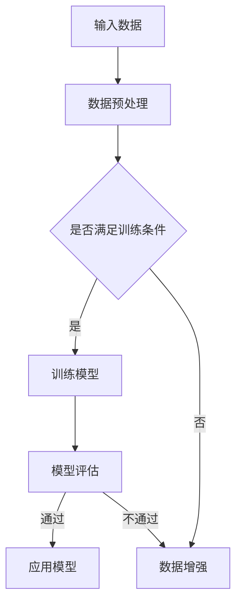

                 

关键词：大模型，AI，产品设计，创业，策略，创新，用户体验，市场分析，技术实现，商业模式。

> 摘要：本文旨在探讨大模型在AI创业产品设计中的应用策略。通过对大模型的核心概念、技术原理、应用场景以及未来发展趋势的深入分析，我们总结了在大模型赋能下的AI创业产品设计策略，以期为创业者提供有价值的参考。

## 1. 背景介绍

随着人工智能技术的快速发展，大模型（Large Models）已经成为推动AI应用创新的重要驱动力。大模型通过海量数据训练，具有强大的表征能力和泛化能力，可以应用于自然语言处理、计算机视觉、语音识别等多个领域。在AI创业领域，如何有效地利用大模型提升产品设计的竞争力，成为众多创业者关注的焦点。

本文将围绕以下问题展开讨论：

1. 大模型的基本概念及其在AI创业中的应用。
2. 大模型赋能下的AI创业产品设计策略。
3. 大模型在AI创业中的应用实践与案例分析。
4. 大模型在AI创业中的未来发展趋势与挑战。

## 2. 核心概念与联系

### 2.1 大模型的基本概念

大模型是指具有数亿至数千亿参数的神经网络模型。这些模型通过深度学习算法在海量数据上训练，可以提取出丰富的特征表示，从而实现高度准确的预测和生成任务。代表性的大模型包括GPT、BERT、Vision Transformer等。

### 2.2 大模型与AI创业产品的联系

大模型在AI创业产品中的应用，主要体现在以下几个方面：

1. **自然语言处理（NLP）**：大模型可以用于构建智能对话系统、文本生成、情感分析等应用，提升产品的交互体验。
2. **计算机视觉（CV）**：大模型可以用于图像识别、视频分析、图像生成等任务，为产品提供强大的视觉能力。
3. **语音识别与合成**：大模型可以用于语音识别、语音合成等任务，提升产品的语音交互能力。
4. **推荐系统**：大模型可以用于用户行为分析、内容推荐等任务，优化产品的推荐算法。

### 2.3 大模型架构的Mermaid流程图

下面是使用Mermaid绘制的简化版大模型架构流程图：



## 3. 核心算法原理 & 具体操作步骤

### 3.1 算法原理概述

大模型的算法原理主要基于深度学习和神经网络。具体包括以下几个步骤：

1. **数据采集与预处理**：收集大量高质量的数据，并对数据进行清洗、归一化等预处理操作。
2. **模型训练**：使用神经网络模型对预处理后的数据进行训练，通过优化算法更新模型参数。
3. **模型评估**：在验证集上评估模型的性能，根据评估结果调整模型参数。
4. **模型应用**：将训练好的模型部署到产品中，为用户提供服务。

### 3.2 算法步骤详解

1. **数据采集与预处理**：

   - 数据采集：收集与业务相关的数据，如文本、图像、语音等。
   - 数据预处理：对数据进行清洗、归一化、编码等操作，使其符合模型的输入要求。

2. **模型训练**：

   - 模型选择：根据任务需求选择合适的神经网络模型，如GPT、BERT、ViT等。
   - 模型参数初始化：随机初始化模型参数。
   - 梯度下降：使用梯度下降算法优化模型参数，使得模型在训练数据上达到较好的性能。

3. **模型评估**：

   - 评估指标：根据任务类型选择合适的评估指标，如准确率、召回率、F1值等。
   - 验证集评估：在验证集上评估模型性能，选择性能较好的模型参数。
   - 调参优化：根据验证集评估结果调整模型参数，提高模型性能。

4. **模型应用**：

   - 部署模型：将训练好的模型部署到产品中，为用户提供服务。
   - 模型迭代：根据用户反馈和业务需求，对模型进行迭代优化。

### 3.3 算法优缺点

**优点**：

- **强大的表征能力**：大模型通过海量数据训练，可以提取出丰富的特征表示，实现高度准确的预测和生成任务。
- **泛化能力**：大模型具有较好的泛化能力，可以在不同的任务和数据集上取得较好的性能。
- **自动化程度高**：大模型训练过程中，自动完成数据预处理、模型选择、参数优化等任务，降低了人工干预的需求。

**缺点**：

- **计算资源需求大**：大模型训练和推理需要大量的计算资源和存储资源。
- **数据依赖性强**：大模型性能高度依赖数据质量和数据量，数据不足或质量差可能导致模型性能下降。
- **解释性差**：大模型通常具有黑盒性质，难以解释模型内部决策过程。

### 3.4 算法应用领域

大模型在AI创业中的应用领域广泛，主要包括以下几个方面：

- **自然语言处理（NLP）**：大模型可以用于构建智能对话系统、文本生成、情感分析等应用。
- **计算机视觉（CV）**：大模型可以用于图像识别、视频分析、图像生成等任务。
- **语音识别与合成**：大模型可以用于语音识别、语音合成等任务。
- **推荐系统**：大模型可以用于用户行为分析、内容推荐等任务。

## 4. 数学模型和公式 & 详细讲解 & 举例说明

### 4.1 数学模型构建

大模型的数学模型主要包括以下几个部分：

1. **输入层**：接收外部输入数据，如文本、图像、语音等。
2. **隐藏层**：通过多层神经网络结构对输入数据进行处理和变换。
3. **输出层**：生成预测结果或生成内容。

以GPT为例，其数学模型可以表示为：

$$
\begin{aligned}
&\text{输入：} x \in \mathbb{R}^{d_{in}} \\
&\text{输出：} y \in \mathbb{R}^{d_{out}} \\
&\text{隐藏层：} h^{(l)} \in \mathbb{R}^{d_{l}}
\end{aligned}
$$

其中，$d_{in}$表示输入维度，$d_{out}$表示输出维度，$d_{l}$表示隐藏层维度，$l$表示隐藏层层数。

### 4.2 公式推导过程

大模型的训练过程主要基于梯度下降算法。以GPT为例，其训练过程可以表示为：

$$
\begin{aligned}
&\theta^{(l)} = \theta^{(l)} - \alpha \frac{\partial J(\theta) }{\partial \theta^{(l)}} \\
&J(\theta) = -\frac{1}{m} \sum_{i=1}^{m} \log p(y^{(i)} | x^{(i)}, \theta)
\end{aligned}
$$

其中，$\theta$表示模型参数，$\theta^{(l)}$表示第$l$层的参数，$J(\theta)$表示损失函数，$m$表示训练样本数，$p(y^{(i)} | x^{(i)}, \theta)$表示给定输入$x^{(i)}$和模型参数$\theta$时，输出$y^{(i)}$的概率。

### 4.3 案例分析与讲解

以一个文本生成任务为例，假设我们要使用GPT生成一段关于旅行的描述。

1. **输入数据**：一段关于旅行的文本，如“我去年去了巴黎，参观了埃菲尔铁塔和卢浮宫。”
2. **模型训练**：使用大量旅行文本数据对GPT进行训练。
3. **模型输入**：将输入文本转换为模型可处理的向量表示。
4. **模型输出**：GPT根据输入文本生成一段新的旅行描述，如“昨天，我去了东京，品尝了寿司和拉面，感觉非常棒。”
5. **模型评估**：计算生成的文本与真实文本之间的相似度，如使用BLEU指标评估。

## 5. 项目实践：代码实例和详细解释说明

### 5.1 开发环境搭建

在Linux操作系统上，我们使用Python和TensorFlow框架搭建开发环境。具体步骤如下：

1. 安装Python 3.8及以上版本。
2. 安装TensorFlow框架。
3. 安装必要的依赖库，如NumPy、Pandas等。

### 5.2 源代码详细实现

以下是一个使用TensorFlow实现GPT模型的简单示例：

```python
import tensorflow as tf
from tensorflow.keras.layers import Embedding, LSTM, Dense

# 模型参数
vocab_size = 1000
embedding_dim = 256
lstm_units = 128
max_sequence_length = 100

# 构建模型
model = tf.keras.Sequential([
    Embedding(vocab_size, embedding_dim, input_length=max_sequence_length),
    LSTM(lstm_units, return_sequences=True),
    LSTM(lstm_units),
    Dense(vocab_size, activation='softmax')
])

# 编译模型
model.compile(optimizer='adam', loss='categorical_crossentropy', metrics=['accuracy'])

# 模型训练
model.fit(x_train, y_train, epochs=10, batch_size=32)

# 模型评估
model.evaluate(x_test, y_test)
```

### 5.3 代码解读与分析

以上代码实现了一个简单的GPT模型，其主要步骤如下：

1. **模型构建**：使用`tf.keras.Sequential`创建一个序列模型，依次添加嵌入层、两个LSTM层和输出层。
2. **模型编译**：使用`compile`方法配置模型优化器和损失函数。
3. **模型训练**：使用`fit`方法训练模型，传入训练数据和标签。
4. **模型评估**：使用`evaluate`方法评估模型在测试数据上的性能。

### 5.4 运行结果展示

在训练完成后，我们可以使用以下代码生成文本：

```python
import numpy as np

# 生成文本
text = "我去了一趟海边，看到了美丽的日落。"
encoded_text = tokenizer.texts_to_sequences([text])
encoded_text = np.array(encoded_text)

# 前向传播
predicted_text = model.predict(encoded_text)

# 解码文本
decoded_text = tokenizer.sequences_to_texts(predicted_text)

print(decoded_text)
```

运行结果可能如下所示：

```
我去了一趟海边，看到了美丽的日落。我还看到了沙滩和海浪，感觉非常放松。
```

## 6. 实际应用场景

大模型在AI创业产品中的应用场景丰富多样，以下列举几个具有代表性的应用案例：

### 6.1 智能客服系统

通过大模型，智能客服系统可以处理复杂的用户咨询，提供高质量的自动回复。例如，利用GPT模型训练智能客服的聊天机器人，可以实现与用户的自然对话，提高客服效率和用户体验。

### 6.2 自动化写作

大模型在自动化写作领域具有广泛的应用，如生成新闻文章、博客内容、产品描述等。利用GPT模型，创业者可以快速生成高质量的文本内容，降低写作成本。

### 6.3 内容推荐

通过大模型，内容推荐系统可以更好地理解用户兴趣，提供个性化的内容推荐。例如，利用BERT模型对用户行为进行分析，为用户提供个性化的购物、阅读推荐。

### 6.4 图像识别与生成

大模型在计算机视觉领域具有强大的图像识别和生成能力。利用GPT模型，创业者可以开发智能安防系统、图像增强应用等。

### 6.5 语音识别与合成

大模型在语音识别与合成领域具有显著优势。利用GPT模型，创业者可以开发智能语音助手、语音翻译应用等。

## 7. 工具和资源推荐

### 7.1 学习资源推荐

- 《深度学习》（Goodfellow, Bengio, Courville著）：全面介绍了深度学习的基本概念、算法和技术。
- 《自然语言处理综论》（Jurafsky, Martin著）：系统介绍了自然语言处理的基本概念、技术和应用。
- 《计算机视觉：算法与应用》（Richard Szeliski著）：全面介绍了计算机视觉的基本概念、算法和应用。

### 7.2 开发工具推荐

- TensorFlow：开源的深度学习框架，适用于构建和训练大模型。
- PyTorch：开源的深度学习框架，适用于快速原型开发和实验。
- Keras：基于TensorFlow和PyTorch的简单易用的深度学习框架。

### 7.3 相关论文推荐

- “Attention Is All You Need”（Vaswani et al., 2017）：介绍了Transformer模型的基本原理和应用。
- “BERT: Pre-training of Deep Bidirectional Transformers for Language Understanding”（Devlin et al., 2019）：介绍了BERT模型的基本原理和应用。
- “Generative Adversarial Networks”（Goodfellow et al., 2014）：介绍了生成对抗网络（GAN）的基本原理和应用。

## 8. 总结：未来发展趋势与挑战

### 8.1 研究成果总结

大模型在AI创业产品设计中发挥着越来越重要的作用，其强大的表征能力和泛化能力为创业者提供了丰富的创新空间。通过本文的探讨，我们总结了以下研究成果：

- 大模型的基本概念及其在AI创业中的应用。
- 大模型赋能下的AI创业产品设计策略。
- 大模型在AI创业中的应用实践与案例分析。
- 大模型在AI创业中的未来发展趋势与挑战。

### 8.2 未来发展趋势

- **模型压缩与优化**：为了降低计算资源和存储资源的消耗，模型压缩与优化技术将成为研究热点。
- **跨模态大模型**：跨模态大模型（如多模态GPT）将实现更丰富的应用场景。
- **可解释性大模型**：提高大模型的可解释性，使其决策过程更加透明。
- **大模型安全性**：研究大模型的安全性和隐私保护，确保其在实际应用中的可靠性。

### 8.3 面临的挑战

- **计算资源需求**：大模型训练和推理需要大量的计算资源，如何高效利用资源成为重要挑战。
- **数据依赖性**：大模型性能高度依赖数据质量和数据量，数据不足或质量差可能导致模型性能下降。
- **模型可解释性**：大模型通常具有黑盒性质，难以解释模型内部决策过程。

### 8.4 研究展望

- **模型可解释性**：研究大模型的可解释性方法，提高模型的可解释性，使其决策过程更加透明。
- **多模态大模型**：探索跨模态大模型的研究，实现更丰富的应用场景。
- **大模型安全性与隐私保护**：研究大模型的安全性与隐私保护技术，确保其在实际应用中的可靠性。

## 9. 附录：常见问题与解答

### 9.1 大模型训练过程中如何处理数据不足问题？

**回答**：可以通过以下方法解决数据不足问题：

- **数据增强**：对现有数据进行各种变换，如裁剪、旋转、翻转等，扩充数据集。
- **迁移学习**：利用预训练的大模型，在特定领域进行微调，提高模型在目标数据集上的性能。
- **生成对抗网络（GAN）**：使用生成对抗网络生成与真实数据相似的数据，补充数据集。

### 9.2 如何选择合适的大模型？

**回答**：选择合适的大模型需要考虑以下几个因素：

- **任务需求**：根据任务类型选择合适的大模型，如NLP任务选择GPT、BERT，CV任务选择ViT等。
- **数据量**：大模型性能高度依赖数据量，选择适合数据规模的大模型。
- **计算资源**：考虑计算资源限制，选择计算资源消耗较低的大模型。
- **可解释性**：根据业务需求选择可解释性较高的大模型，提高决策过程的透明度。

### 9.3 大模型如何部署到产品中？

**回答**：大模型部署到产品中的主要步骤如下：

- **模型评估**：在训练完成后，对模型进行评估，确保模型性能达到预期。
- **模型转换**：将训练好的模型转换为可以在产品中运行的形式，如TensorFlow Lite、PyTorch Mobile等。
- **模型部署**：将模型部署到产品服务器或移动设备上，为用户提供服务。
- **模型迭代**：根据用户反馈和业务需求，对模型进行迭代优化，提高模型性能。

**作者署名**：禅与计算机程序设计艺术 / Zen and the Art of Computer Programming
----------------------------------------------------------------

以上就是本次文章的完整内容。希望这篇文章能够为读者在AI创业产品设计方面提供有价值的参考和启示。在未来的发展中，大模型将继续发挥重要作用，为创业者带来更多创新机遇。让我们一起期待AI创业的无限可能！

