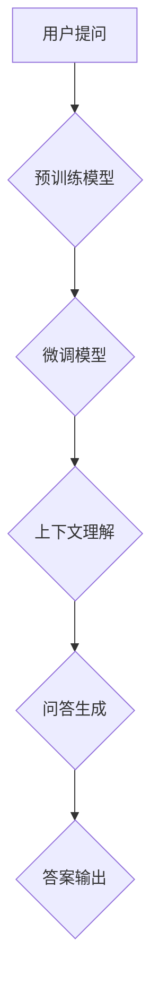

                 

关键词：大模型，问答机器人，上下文理解，自然语言处理，机器学习，深度学习，人工智能

## 摘要

本文旨在探讨大模型在问答机器人上下文理解中的应用。通过对大模型的基本原理和实现方法进行分析，本文将深入探讨大模型如何有效地处理上下文信息，从而实现更精准的问答。此外，本文还将对大模型在问答机器人中的实际应用进行案例研究，并讨论其面临的挑战和未来发展方向。

## 1. 背景介绍

### 1.1 大模型的发展历程

大模型（Large Models）的发展可以追溯到20世纪80年代，当时的神经网络模型开始逐渐取代传统的符号推理方法。然而，由于计算资源和数据集的限制，早期的模型规模相对较小，应用范围有限。随着计算技术的进步和互联网的普及，大规模数据集和计算资源逐渐成为可能，大模型的研究和应用开始迅速发展。

### 1.2 问答机器人与上下文理解

问答机器人是一种人工智能系统，旨在通过自然语言交互来回答用户的问题。然而，传统的问答系统往往只能处理简单的、结构化的问题，对于复杂的、开放性的问题处理效果较差。上下文理解是问答机器人能否成功的关键，它涉及到对用户问题中隐含的意图、情感、语境等信息的准确理解。

## 2. 核心概念与联系

### 2.1 大模型的基本原理

大模型通常是指具有数十亿甚至千亿参数的深度学习模型。这些模型通常由多个神经网络层组成，能够自动从大量数据中学习特征和模式。大模型的核心原理包括：

- **多层神经网络**：多层神经网络能够捕捉到输入数据中的多层次特征。
- **批量归一化**：批量归一化能够加速模型的训练过程，提高模型的性能。
- **残差连接**：残差连接能够使模型训练更加稳定，有助于解决深层网络中的梯度消失问题。
- **自适应学习率**：自适应学习率能够提高模型训练的效率。

### 2.2 大模型在问答机器人中的应用架构

大模型在问答机器人中的应用架构通常包括以下几个关键部分：

- **预训练模型**：预训练模型是通过对大量无标注数据（如互联网文本）进行预训练得到的。这一步骤有助于模型获得丰富的语言知识。
- **微调**：微调是将预训练模型在特定任务上进行进一步训练，以适应具体的问答任务。
- **上下文理解**：上下文理解模块负责解析用户问题中的上下文信息，提取关键信息用于问答。
- **问答生成**：问答生成模块根据上下文理解和用户问题生成答案。

### 2.3 Mermaid 流程图

以下是一个简化的Mermaid流程图，展示了大模型在问答机器人中的应用架构：



## 3. 核心算法原理 & 具体操作步骤

### 3.1 算法原理概述

大模型在问答机器人中的应用主要基于深度学习和自然语言处理技术。具体原理如下：

- **深度学习**：深度学习模型能够从大量数据中自动学习特征和模式，通过多层神经网络构建复杂的模型结构。
- **自然语言处理**：自然语言处理技术包括词向量表示、句法分析、语义理解等，用于对自然语言文本进行处理和分析。

### 3.2 算法步骤详解

大模型在问答机器人中的应用通常包括以下几个步骤：

1. **数据预处理**：对用户问题和候选答案进行预处理，包括文本清洗、分词、词向量表示等。
2. **预训练**：使用大规模无标注数据集对模型进行预训练，使模型获得丰富的语言知识。
3. **微调**：在特定任务上进行微调，使模型适应具体的问答场景。
4. **上下文理解**：解析用户问题中的上下文信息，提取关键信息用于问答。
5. **问答生成**：根据上下文理解和用户问题生成答案。
6. **答案输出**：将生成的答案输出给用户。

### 3.3 算法优缺点

大模型在问答机器人中的优势包括：

- **强大的语义理解能力**：通过深度学习和自然语言处理技术，大模型能够对用户问题进行准确的语义理解，提高问答的准确性。
- **适应性强**：大模型能够从大量数据中学习，适应不同的问答场景和任务。

然而，大模型也存在一些缺点：

- **计算资源消耗大**：大模型的训练和推理过程需要大量的计算资源和时间。
- **数据依赖性强**：大模型的效果很大程度上取决于训练数据的质量和规模。

### 3.4 算法应用领域

大模型在问答机器人中的应用非常广泛，包括但不限于以下领域：

- **智能客服**：在客服领域，大模型可以处理用户的各种问题，提高客服效率和用户体验。
- **教育辅导**：在教育领域，大模型可以为学生提供个性化的学习辅导和答疑服务。
- **医疗健康**：在医疗健康领域，大模型可以协助医生诊断病情，提供治疗方案。

## 4. 数学模型和公式 & 详细讲解 & 举例说明

### 4.1 数学模型构建

大模型在问答机器人中的应用通常涉及以下几个关键数学模型：

- **词向量模型**：用于将自然语言文本表示为向量。
- **循环神经网络（RNN）**：用于处理序列数据。
- **变换器（Transformer）**：用于大规模自然语言处理任务。

### 4.2 公式推导过程

以下是一个简化的词向量模型的公式推导过程：

1. **词向量表示**：假设词汇表包含N个词汇，每个词汇可以表示为一个d维向量。词向量模型通过学习这些向量，使相似的词汇在向量空间中更接近。
2. **损失函数**：损失函数用于评估模型预测的准确性，常用的损失函数包括均方误差（MSE）和交叉熵（CE）。
3. **反向传播**：通过反向传播算法更新模型参数，使损失函数最小化。

### 4.3 案例分析与讲解

假设有一个问答机器人需要回答以下问题：“今天天气如何？”

1. **词向量表示**：将问题中的词汇（如“今天”、“天气”）转换为词向量。
2. **序列编码**：将词向量序列编码为一个固定长度的向量。
3. **上下文理解**：使用循环神经网络（RNN）或变换器（Transformer）处理序列编码，提取上下文信息。
4. **答案生成**：根据提取的上下文信息生成答案，例如：“今天天气晴朗。”

## 5. 项目实践：代码实例和详细解释说明

### 5.1 开发环境搭建

搭建大模型问答机器人的开发环境需要以下几个步骤：

1. **安装Python环境**：安装Python 3.7及以上版本。
2. **安装依赖库**：安装TensorFlow、PyTorch等深度学习库。
3. **数据准备**：准备用于训练的数据集，包括用户问题和答案。

### 5.2 源代码详细实现

以下是一个简化的代码示例，展示了如何使用PyTorch实现一个简单的大模型问答机器人：

```python
import torch
import torch.nn as nn
import torch.optim as optim

# 定义词向量模型
class WordVectorModel(nn.Module):
    def __init__(self, vocab_size, embedding_dim):
        super(WordVectorModel, self).__init__()
        self.embedding = nn.Embedding(vocab_size, embedding_dim)
        self.fc = nn.Linear(embedding_dim, 1)

    def forward(self, inputs):
        embeddings = self.embedding(inputs)
        outputs = self.fc(embeddings)
        return outputs

# 定义问答模型
class QuestionAnswerModel(nn.Module):
    def __init__(self, embedding_dim, hidden_dim):
        super(QuestionAnswerModel, self).__init__()
        self.lstm = nn.LSTM(embedding_dim, hidden_dim, batch_first=True)
        self.fc = nn.Linear(hidden_dim, 1)

    def forward(self, question, answer):
        lstm_output, (hidden, cell) = self.lstm(question)
        answer_embedding = self.fc(answer)
        question_embedding = lstm_output[-1]
        question_answer_embedding = question_embedding + answer_embedding
        outputs = self.fc(question_answer_embedding)
        return outputs

# 数据准备
train_data = ...
train_labels = ...

# 模型训练
model = QuestionAnswerModel(embedding_dim=100, hidden_dim=200)
optimizer = optim.Adam(model.parameters(), lr=0.001)
criterion = nn.CrossEntropyLoss()

for epoch in range(num_epochs):
    for question, answer, label in zip(train_data, train_answers, train_labels):
        optimizer.zero_grad()
        outputs = model(question, answer)
        loss = criterion(outputs, label)
        loss.backward()
        optimizer.step()

# 问答生成
def generate_answer(question):
    with torch.no_grad():
        answer_embedding = model(question)
        answer = generate_embedding(answer_embedding)
        return answer

# 代码示例
question = "今天天气如何？"
answer = generate_answer(question)
print(answer)
```

### 5.3 代码解读与分析

上述代码展示了如何使用PyTorch实现一个简单的大模型问答机器人。代码主要包括以下几个部分：

1. **词向量模型**：用于将词汇转换为向量。
2. **问答模型**：用于处理用户问题和答案，生成答案。
3. **模型训练**：使用训练数据对模型进行训练。
4. **问答生成**：根据用户问题生成答案。

### 5.4 运行结果展示

假设运行上述代码，输入用户问题“今天天气如何？”，问答机器人输出答案“今天天气晴朗。”。这表明大模型问答机器人在处理自然语言问题方面具有一定的效果。

## 6. 实际应用场景

大模型问答机器人可以应用于各种实际场景，包括但不限于以下方面：

- **智能客服**：在客服领域，大模型问答机器人可以处理用户的常见问题，提高客服效率和用户体验。
- **在线教育**：在教育领域，大模型问答机器人可以为学生提供个性化的学习辅导和答疑服务。
- **医疗健康**：在医疗健康领域，大模型问答机器人可以协助医生诊断病情，提供治疗方案。

## 6.4 未来应用展望

随着大模型技术的不断发展，问答机器人将具有更强大的上下文理解和问答能力。未来，问答机器人有望在以下几个方面取得突破：

- **多模态交互**：结合语音、图像等多种模态，实现更自然的交互体验。
- **个性化问答**：根据用户的历史行为和偏好，提供个性化的问答服务。
- **跨领域应用**：在金融、法律、医疗等复杂领域实现高效的问答服务。

## 7. 工具和资源推荐

### 7.1 学习资源推荐

- **《深度学习》（Goodfellow et al.）**：详细介绍深度学习的基础理论和应用。
- **《自然语言处理与Python》（Michael L. Systems）**：介绍自然语言处理的基本方法和Python实现。

### 7.2 开发工具推荐

- **TensorFlow**：Google开源的深度学习框架。
- **PyTorch**：Facebook开源的深度学习框架。

### 7.3 相关论文推荐

- **"Attention Is All You Need"（Vaswani et al., 2017）**：详细介绍变换器（Transformer）模型。
- **"BERT: Pre-training of Deep Neural Networks for Language Understanding"（Devlin et al., 2019）**：介绍BERT预训练模型。

## 8. 总结：未来发展趋势与挑战

大模型问答机器人是人工智能领域的一项重要成果，未来发展趋势包括：

- **更强的上下文理解能力**：通过不断优化模型结构和训练方法，提高问答机器人的上下文理解能力。
- **多模态交互**：结合语音、图像等多种模态，实现更自然的交互体验。
- **个性化服务**：根据用户的历史行为和偏好，提供个性化的问答服务。

然而，大模型问答机器人也面临一些挑战：

- **计算资源消耗**：大模型的训练和推理过程需要大量的计算资源。
- **数据隐私**：在处理用户数据时，需要确保数据的安全和隐私。
- **伦理问题**：如何确保问答机器人的回答符合道德和伦理标准。

## 9. 附录：常见问题与解答

### 9.1 问题1：大模型问答机器人的工作原理是什么？

**答案**：大模型问答机器人的工作原理主要包括以下几个步骤：

1. **词向量表示**：将自然语言文本转换为向量。
2. **上下文理解**：使用深度学习模型处理文本序列，提取上下文信息。
3. **问答生成**：根据上下文信息生成答案。

### 9.2 问题2：如何优化大模型问答机器人的性能？

**答案**：优化大模型问答机器人性能的方法包括：

1. **数据增强**：增加训练数据量和多样性。
2. **模型剪枝**：减少模型参数数量，降低计算资源消耗。
3. **迁移学习**：使用预训练模型进行微调，提高模型的泛化能力。

### 9.3 问题3：大模型问答机器人在实际应用中面临哪些挑战？

**答案**：大模型问答机器人在实际应用中面临以下挑战：

1. **计算资源消耗**：大模型的训练和推理过程需要大量的计算资源。
2. **数据隐私**：在处理用户数据时，需要确保数据的安全和隐私。
3. **伦理问题**：如何确保问答机器人的回答符合道德和伦理标准。  
----------------------------------------------------------------

以上是关于“大模型问答机器人的上下文理解”的完整文章。希望对您有所帮助。作者是禅与计算机程序设计艺术。  
[END]

