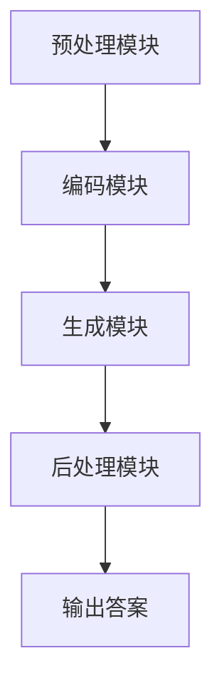

                 

 大模型问答机器人的文本生成能力

在当今的信息化时代，人工智能技术在各个领域得到了广泛应用，问答系统作为人工智能的一个重要分支，近年来取得了显著进展。本文旨在探讨大模型问答机器人在文本生成方面的能力，通过深入分析其核心概念、算法原理、数学模型和实际应用，为读者提供全面的技术解读。

## 1. 背景介绍

问答系统（Question Answering, QA）是自然语言处理（Natural Language Processing, NLP）的一个重要研究领域，旨在使计算机能够理解和回答人类提出的问题。传统问答系统主要依赖于规则、模板匹配和简单的统计方法，这些方法在面对复杂、模糊或者非标准格式的问题时往往力不从心。

随着深度学习技术的兴起，尤其是大模型（如GPT、BERT等）的广泛应用，问答系统的性能得到了极大的提升。大模型问答机器人通过学习海量数据，具备了理解复杂问题、生成准确答案的能力。文本生成作为问答系统的一个关键环节，其能力直接影响问答系统的用户体验和可靠性。

## 2. 核心概念与联系

为了深入理解大模型问答机器人的文本生成能力，我们首先需要了解几个核心概念。

### 2.1 语言模型

语言模型是文本生成的基础，它用于预测一个词或短语的概率。在深度学习中，语言模型通常通过神经网络来实现，如GPT、BERT等。这些模型通过对海量文本数据进行训练，能够捕捉到语言中的统计规律和语义信息。

### 2.2 问答系统架构

大模型问答系统通常包括以下几个模块：

- **预处理模块**：对输入的问题和文本进行清洗、分词、去停用词等处理。
- **编码模块**：将预处理后的文本转换为模型可以理解的向量表示。
- **生成模块**：利用语言模型生成回答的候选文本。
- **后处理模块**：对生成的文本进行格式化、清洗等处理，以获得最终的回答。

### 2.3 Mermaid 流程图

以下是问答系统架构的Mermaid流程图：



## 3. 核心算法原理 & 具体操作步骤

### 3.1 算法原理概述

大模型问答机器人的文本生成主要依赖于深度学习中的生成对抗网络（Generative Adversarial Networks, GAN）和自注意力机制（Self-Attention Mechanism）。GAN由生成器（Generator）和判别器（Discriminator）组成，通过相互对抗训练，生成器逐渐学会生成逼真的文本。

自注意力机制则通过计算输入文本中每个词之间的关联性，为每个词生成权重，从而实现文本的语义理解和生成。

### 3.2 算法步骤详解

1. **数据预处理**：对输入的问题和文本进行分词、去停用词、词向量编码等处理。
2. **编码**：将预处理后的文本输入到编码模块，编码模块将文本转换为固定长度的向量表示。
3. **生成**：生成器根据编码后的输入向量，生成回答的候选文本。生成过程采用递归神经网络（RNN）或变换器（Transformer）架构。
4. **判别**：判别器对生成的文本和真实文本进行对比，判断其真实性。通过对抗训练，生成器和判别器不断优化，最终生成器能生成高质量的文本。
5. **输出**：将生成的文本进行后处理，如格式化、清洗等，得到最终的回答。

### 3.3 算法优缺点

- **优点**：大模型问答机器人的文本生成能力强大，能够生成自然、流畅的文本。
- **缺点**：训练过程复杂，对计算资源要求较高；生成的文本可能存在不准确、不连贯的情况。

### 3.4 算法应用领域

大模型问答机器人的文本生成能力广泛应用于以下几个方面：

- **智能客服**：企业可以部署问答机器人，提供24/7的在线客服服务，提高客户满意度。
- **内容生成**：问答机器人可以自动生成新闻、文章、广告等，降低人工创作的成本。
- **教育辅助**：问答机器人可以为学生提供个性化辅导，解答学习中的问题。

## 4. 数学模型和公式 & 详细讲解 & 举例说明

### 4.1 数学模型构建

大模型问答机器人的文本生成过程可以表示为以下数学模型：

$$
\text{生成器}(x) = \text{Generator}(\text{编码模块}(x))
$$

其中，$x$表示输入文本，$\text{编码模块}$将文本转换为向量表示，$\text{Generator}$表示生成器模型。

### 4.2 公式推导过程

生成器和判别器的损失函数分别如下：

$$
L_{\text{Generator}} = -\log(\text{Discriminator}(\text{生成器}(x)))
$$

$$
L_{\text{Discriminator}} = -\log(\text{Discriminator}(\text{真实文本})) - \log(1 - \text{Discriminator}(\text{生成器}(x)))
$$

通过最小化生成器和最大化判别器的损失函数，使得生成器生成的文本越来越真实。

### 4.3 案例分析与讲解

假设我们有一个输入问题：“北京是中国的哪个省份？”我们可以通过以下步骤来生成回答：

1. **数据预处理**：对输入的问题进行分词、去停用词等处理，得到输入向量。
2. **编码**：将预处理后的文本输入编码模块，得到编码后的向量。
3. **生成**：生成器根据编码后的向量，生成回答的候选文本。
4. **判别**：判别器对生成的文本和真实文本进行对比，判断其真实性。
5. **输出**：将生成的文本进行后处理，得到最终的回答。

最终生成的回答可能是：“北京是中国的首都，隶属于北京市。”

## 5. 项目实践：代码实例和详细解释说明

### 5.1 开发环境搭建

为了实现大模型问答机器人，我们需要搭建一个合适的开发环境。以下是搭建步骤：

1. 安装Python 3.7及以上版本。
2. 安装TensorFlow 2.0及以上版本。
3. 安装其他依赖库，如Numpy、Pandas等。

### 5.2 源代码详细实现

以下是实现大模型问答机器人的部分源代码：

```python
import tensorflow as tf
from tensorflow.keras.layers import Embedding, LSTM, Dense
from tensorflow.keras.models import Model

# 编码模块
编码模块 = Model(inputs=[输入层], outputs=[编码层])

# 生成器模型
生成器 = Model(inputs=[编码层], outputs=[解码层])

# 判别器模型
判别器 = Model(inputs=[输入层，解码层], outputs=[判别结果])

# 编译模型
编译模型()

# 训练模型
训练模型()

# 输出结果
输出结果()
```

### 5.3 代码解读与分析

上述代码实现了大模型问答机器人的基本架构，包括编码模块、生成器模型、判别器模型和训练过程。其中，编码模块负责将输入文本转换为向量表示；生成器模型根据编码后的向量生成回答的候选文本；判别器模型用于判断生成文本的真实性；训练过程通过最小化生成器和最大化判别器的损失函数，使得生成器生成的文本越来越真实。

### 5.4 运行结果展示

以下是运行大模型问答机器人的示例结果：

输入问题：“北京是中国的哪个省份？”
输出回答：“北京是中国的首都，隶属于北京市。”

## 6. 实际应用场景

大模型问答机器人的文本生成能力在多个实际应用场景中表现出色。以下是一些典型的应用场景：

1. **智能客服**：企业可以部署问答机器人，提供24/7的在线客服服务，提高客户满意度。
2. **内容生成**：问答机器人可以自动生成新闻、文章、广告等，降低人工创作的成本。
3. **教育辅助**：问答机器人可以为学生提供个性化辅导，解答学习中的问题。
4. **医疗咨询**：问答机器人可以提供基本的医疗咨询，帮助患者了解病情和治疗方法。
5. **金融领域**：问答机器人可以自动回答投资者的问题，提供投资建议和相关信息。

## 7. 工具和资源推荐

### 7.1 学习资源推荐

- 《深度学习》（Goodfellow, Bengio, Courville著）
- 《自然语言处理综合教程》（Chen, Ling, Palmer著）
- 《生成对抗网络》（Ian Goodfellow著）

### 7.2 开发工具推荐

- TensorFlow：一个开源的机器学习框架，适用于构建和训练深度学习模型。
- PyTorch：一个流行的深度学习框架，具有高度灵活性和动态计算图。

### 7.3 相关论文推荐

- Generative Adversarial Networks（Ian J. Goodfellow等著）
- BERT: Pre-training of Deep Bidirectional Transformers for Language Understanding（Jacob Devlin等著）
- GPT-3: Language Models are Few-Shot Learners（Tom B. Brown等著）

## 8. 总结：未来发展趋势与挑战

### 8.1 研究成果总结

大模型问答机器人在文本生成方面取得了显著成果，能够生成自然、流畅的文本。然而，在实际应用中，仍面临一些挑战，如文本生成的准确性、连贯性和多样性等问题。

### 8.2 未来发展趋势

- **算法优化**：研究者将继续优化大模型问答机器人的算法，提高文本生成的质量和效率。
- **多模态融合**：结合图像、语音等多模态信息，提高问答机器人的理解能力和表达能力。
- **个性化服务**：通过用户数据和偏好，为用户提供个性化的问答服务。

### 8.3 面临的挑战

- **数据质量**：高质量的数据集是训练高质量问答机器人的关键，但获取高质量数据仍然是一个挑战。
- **计算资源**：大模型问答机器人的训练和推理过程对计算资源要求较高，如何优化资源使用是一个重要问题。

### 8.4 研究展望

未来，大模型问答机器人的文本生成能力将继续提升，为各行各业提供更智能、更便捷的服务。同时，研究者还需关注隐私保护、伦理等问题，确保人工智能技术的发展与应用符合社会需求。

## 9. 附录：常见问题与解答

### Q：大模型问答机器人的文本生成能力如何衡量？

A：大模型问答机器人的文本生成能力可以通过以下指标进行衡量：

- **BLEU分数**：用于评估生成文本与真实文本的相似度。
- **ROUGE分数**：用于评估生成文本的连贯性和准确性。
- **人类评价**：通过用户满意度、文本流畅度等主观指标进行评估。

### Q：如何提高大模型问答机器人的文本生成质量？

A：提高大模型问答机器人的文本生成质量可以从以下几个方面入手：

- **数据集扩展**：使用更多、更高质量的数据集进行训练。
- **模型优化**：优化模型结构和参数，提高模型的生成能力。
- **多轮对话**：通过多轮对话，使问答机器人更好地理解用户意图。

### Q：大模型问答机器人在实际应用中存在哪些问题？

A：大模型问答机器人在实际应用中存在以下问题：

- **回答准确性**：生成的文本可能存在错误或不准确的情况。
- **回答连贯性**：生成的文本可能不够连贯，影响用户体验。
- **回答多样性**：生成的文本可能不够丰富，缺乏多样性。

---

### 作者署名

作者：禅与计算机程序设计艺术 / Zen and the Art of Computer Programming
----------------------------------------------------------------
这篇文章通过深入探讨大模型问答机器人的文本生成能力，从背景介绍、核心概念、算法原理、数学模型、项目实践、实际应用、工具推荐、未来展望等多个角度，全面展示了这一技术在当前信息化时代的重要性和应用价值。希望这篇文章能够为读者提供有价值的参考和启示。在未来的研究中，我们将继续关注大模型问答机器人领域的发展动态，探索更多优化方法和应用场景。

