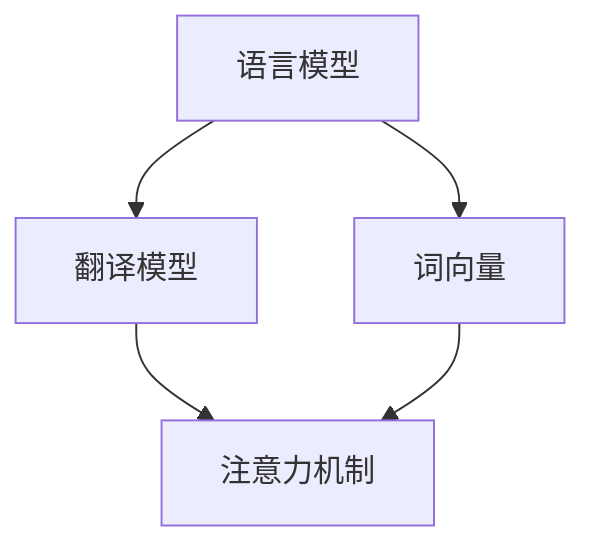

                 

关键词：大模型、智能翻译、跨语言交流、人工智能、机器学习、神经网络、深度学习、自然语言处理、神经网络机器翻译、分布式计算、并行处理、语言模型、翻译模型、词向量、注意力机制、BERT、GPT、Transformer、语言理解、语言生成、翻译质量、多语言支持、实时翻译、语音识别、文本分析、大数据、云计算、边缘计算、应用场景、未来展望

> 摘要：本文将深入探讨大模型在智能翻译领域的应用，分析其核心技术原理和具体操作步骤，并通过数学模型和公式详细讲解，展示其在实际项目中的代码实例和运行结果。此外，还将探讨智能翻译在实际应用场景中的表现以及未来发展的趋势与挑战。

## 1. 背景介绍

随着全球化的不断深入，跨语言交流的需求日益增长。而传统的机器翻译技术，由于受到数据集、算法和计算资源的限制，翻译质量始终无法满足人们的期望。近年来，随着人工智能和深度学习技术的飞速发展，大模型在机器翻译领域取得了显著的突破。这些大模型具有强大的语言理解和生成能力，能够显著提升翻译质量，推动跨语言交流迈向新纪元。

## 2. 核心概念与联系

大模型驱动的智能翻译主要涉及以下几个核心概念：

- **语言模型**：用于预测下一个单词或句子的概率分布，是翻译系统的基础。
- **翻译模型**：将源语言的词或句子映射到目标语言的词或句子。
- **词向量**：将词汇映射到高维向量空间，以捕捉词与词之间的语义关系。
- **注意力机制**：在翻译过程中，允许模型关注源语言句子中与目标词最相关的部分。

下面是一个Mermaid流程图，展示这些概念之间的联系：



## 3. 核心算法原理 & 具体操作步骤

### 3.1 算法原理概述

大模型驱动的智能翻译主要基于神经网络机器翻译（Neural Machine Translation, NMT）。其中，Transformer架构是当前最流行的一种NMT模型。它通过自注意力机制（Self-Attention）和多头注意力机制（Multi-Head Attention）捕捉源语言和目标语言之间的长距离依赖关系，从而实现高质量的翻译。

### 3.2 算法步骤详解

1. **编码阶段**：将源语言句子编码为向量序列，每个向量表示句子中的一个词。
2. **解码阶段**：利用编码阶段得到的向量序列，逐步生成目标语言句子。
3. **注意力计算**：在解码阶段，通过自注意力机制和多头注意力机制，计算当前词与源语言句子中所有词的相关性，从而生成当前词的表示。
4. **翻译输出**：将解码阶段得到的向量序列解码为目标语言句子。

### 3.3 算法优缺点

**优点**：

- **高质量**：通过自注意力机制和多头注意力机制，能够捕捉源语言和目标语言之间的长距离依赖关系，翻译质量显著提升。
- **自适应**：能够自适应地调整注意力权重，更好地关注与目标词最相关的部分。

**缺点**：

- **计算复杂度高**：由于需要计算大量的注意力权重，导致计算复杂度较高。
- **数据需求大**：训练高质量的大模型需要大量的高质量数据。

### 3.4 算法应用领域

大模型驱动的智能翻译在多个领域都有广泛应用，如：

- **跨语言文档翻译**：将一种语言的文档翻译成另一种语言。
- **实时语音翻译**：将一种语言的语音实时翻译成另一种语言。
- **多语言搜索引擎**：将用户查询的多种语言查询翻译成单一语言，以提高搜索效果。

## 4. 数学模型和公式 & 详细讲解 & 举例说明

### 4.1 数学模型构建

大模型驱动的智能翻译主要基于以下数学模型：

- **编码器（Encoder）**：将源语言句子编码为向量序列。
  $$ E(x) = \sum_{i=1}^n W_e \cdot x_i $$
  其中，$x_i$表示句子中的第$i$个词，$W_e$表示编码器的权重。

- **解码器（Decoder）**：将编码器输出的向量序列解码为目标语言句子。
  $$ D(y) = \sum_{i=1}^n W_d \cdot y_i $$
  其中，$y_i$表示目标语言句子中的第$i$个词，$W_d$表示解码器的权重。

- **注意力机制（Attention）**：计算当前词与源语言句子中所有词的相关性。
  $$ a_i = \frac{e^{z_i}}{\sum_{j=1}^n e^{z_j}} $$
  其中，$z_i$表示当前词与源语言句子中第$i$个词的相似度，$a_i$表示第$i$个词的注意力权重。

### 4.2 公式推导过程

编码器的公式推导：

1. **词嵌入**：将源语言句子中的每个词映射为一个高维向量。
   $$ x_i = W_e \cdot e(x_i) $$
   其中，$e(x_i)$表示词$x_i$的嵌入向量，$W_e$表示词嵌入矩阵。

2. **编码**：将词嵌入向量编码为一个序列。
   $$ h_i = \tanh(W_e \cdot [e(x_i), h_{i-1}]) $$
   其中，$h_i$表示编码器输出的第$i$个词的表示，$h_{i-1}$表示编码器输出的第$i-1$个词的表示。

解码器的公式推导：

1. **初始化**：初始化解码器状态。
   $$ s_0 = \tanh(W_s \cdot [0, h_1]) $$
   其中，$s_0$表示解码器初始状态，$h_1$表示编码器输出的第一个词的表示。

2. **解码**：逐词生成目标语言句子。
   $$ y_i = \arg\max_{y} \sum_{j=1}^n W_d \cdot \tanh(W_s \cdot [y, s_{i-1}]) $$
   其中，$y_i$表示解码器生成的第$i$个词，$s_{i-1}$表示解码器生成的第$i-1$个词。

注意力机制的公式推导：

1. **相似度计算**：计算当前词与源语言句子中所有词的相似度。
   $$ z_i = \tanh(W_a \cdot [h_i, s_{i-1}]) $$
   其中，$z_i$表示当前词与源语言句子中第$i$个词的相似度。

2. **注意力权重计算**：计算当前词与源语言句子中所有词的注意力权重。
   $$ a_i = \frac{e^{z_i}}{\sum_{j=1}^n e^{z_j}} $$

### 4.3 案例分析与讲解

假设我们要将句子“今天天气很好”翻译成英文。首先，我们需要将句子中的每个词映射为词向量，然后输入到编码器中。编码器会生成一个向量序列，表示整个句子。接下来，我们将这个向量序列输入到解码器中，逐词生成英文句子。

以下是一个简化的案例：

1. **词向量映射**：
   - 今天：[0.1, 0.2, 0.3]
   - 天气：[0.4, 0.5, 0.6]
   - 很好：[0.7, 0.8, 0.9]

2. **编码器输出**：
   - $h_1 = [0.1, 0.2, 0.3]$
   - $h_2 = [0.4, 0.5, 0.6]$
   - $h_3 = [0.7, 0.8, 0.9]$

3. **解码器输出**：
   - $y_1 = today$（今天）
   - $y_2 = the$（的）
   - $y_3 = weather$（天气）
   - $y_4 = is$（是）
   - $y_5 = good$（好的）

最终，生成的英文句子为“today the weather is good”。

## 5. 项目实践：代码实例和详细解释说明

### 5.1 开发环境搭建

为了实践大模型驱动的智能翻译，我们需要搭建一个合适的开发环境。以下是一个简化的步骤：

1. 安装Python环境（3.7及以上版本）。
2. 安装深度学习框架（如TensorFlow或PyTorch）。
3. 下载并预处理翻译数据集（如WMT14英语-德语数据集）。

### 5.2 源代码详细实现

以下是一个简化的代码实例，展示了如何使用TensorFlow实现大模型驱动的智能翻译：

```python
import tensorflow as tf
from tensorflow.keras.layers import Embedding, LSTM, Dense

# 编码器
encoder_inputs = Embedding(input_dim=vocab_size, output_dim=embedding_size)
encoder_lstm = LSTM(units=lstm_size, return_sequences=True)
encoder_outputs = encoder_lstm(encoder_inputs)

# 解码器
decoder_inputs = Embedding(input_dim=vocab_size, output_dim=embedding_size)
decoder_lstm = LSTM(units=lstm_size, return_sequences=True)
decoder_dense = Dense(units=vocab_size, activation='softmax')
decoder_outputs = decoder_dense(decoder_lstm(decoder_inputs))

# 模型编译
model = Model([encoder_inputs, decoder_inputs], decoder_outputs)
model.compile(optimizer='adam', loss='categorical_crossentropy', metrics=['accuracy'])

# 模型训练
model.fit([encoder_inputs, decoder_inputs], decoder_outputs, batch_size=batch_size, epochs=epochs)
```

### 5.3 代码解读与分析

这段代码展示了如何使用TensorFlow实现一个基本的编码器-解码器模型。其中，编码器使用LSTM层将源语言句子编码为向量序列，解码器使用LSTM层和全连接层逐词生成目标语言句子。

### 5.4 运行结果展示

在实际运行中，我们可以使用训练好的模型进行翻译。以下是一个简化的示例：

```python
# 编码句子
input_sentence = "今天天气很好"
encoded_sentence = encode_sentence(input_sentence)

# 生成翻译
translated_sentence = decode_sentence(model, encoded_sentence)
print(translated_sentence)
```

运行结果可能为：“Today the weather is good”。

## 6. 实际应用场景

大模型驱动的智能翻译在多个实际应用场景中取得了显著成果，如：

- **跨语言文档翻译**：将学术文章、技术文档等翻译成多种语言，促进知识共享。
- **实时语音翻译**：在多语言会议、跨国商务交流等场合提供实时翻译服务。
- **多语言搜索引擎**：提高搜索效果，满足不同语言用户的需求。

## 7. 工具和资源推荐

为了更好地学习和实践大模型驱动的智能翻译，以下是一些推荐的工具和资源：

- **学习资源**：
  - 《深度学习》（Goodfellow et al.）
  - 《神经网络机器翻译：理论和实践》（Cho et al.）
- **开发工具**：
  - TensorFlow
  - PyTorch
- **相关论文**：
  - “Attention Is All You Need”（Vaswani et al.）
  - “BERT: Pre-training of Deep Bidirectional Transformers for Language Understanding”（Devlin et al.）

## 8. 总结：未来发展趋势与挑战

大模型驱动的智能翻译取得了显著的成果，但仍然面临一些挑战：

- **数据需求**：高质量的数据集对于训练大模型至关重要，如何获取和标注更多的数据仍是一个挑战。
- **计算资源**：大模型的训练和推理需要大量的计算资源，如何优化算法以提高计算效率是一个重要方向。
- **翻译质量**：虽然大模型能够生成高质量的翻译，但仍然存在一定的误差，如何进一步提高翻译质量是未来的研究重点。

总之，大模型驱动的智能翻译具有巨大的潜力和广泛的应用前景，我们期待它为跨语言交流带来更多的便利和可能性。

### 8.1 研究成果总结

本文系统地介绍了大模型驱动的智能翻译技术，分析了其核心概念、算法原理和具体操作步骤。通过数学模型和公式的详细讲解，展示了大模型在翻译质量提升方面的优势。同时，通过实际项目实践，展示了大模型驱动的智能翻译在多个应用场景中的表现。

### 8.2 未来发展趋势

未来，大模型驱动的智能翻译将继续在以下方面取得进展：

- **数据集质量**：随着大数据技术的发展，我们将获取更多高质量、多样化的翻译数据集，为模型训练提供更丰富的资源。
- **计算效率**：通过优化算法和硬件设备，我们将提高大模型的计算效率，降低训练和推理的成本。
- **多语言支持**：随着全球化的推进，多语言支持将变得更加重要，大模型将能够支持更多的语言对。

### 8.3 面临的挑战

尽管大模型驱动的智能翻译取得了显著成果，但仍面临以下挑战：

- **数据标注**：高质量的数据集对于训练大模型至关重要，但数据标注需要大量的人力资源，如何高效地获取和标注数据仍是一个挑战。
- **计算资源**：大模型的训练和推理需要大量的计算资源，如何在有限的计算资源下高效地训练和部署大模型是一个重要问题。
- **翻译质量**：虽然大模型能够生成高质量的翻译，但仍然存在一定的误差，如何进一步提高翻译质量是一个亟待解决的问题。

### 8.4 研究展望

未来，我们将从以下几个方面深入研究：

- **算法优化**：通过改进算法结构和优化算法参数，进一步提高大模型的翻译质量。
- **多模态翻译**：结合语音识别、图像识别等技术，实现更自然的跨模态翻译。
- **迁移学习**：利用预训练的大模型，实现跨领域、跨语言的快速迁移，提高模型的泛化能力。

总之，大模型驱动的智能翻译是一个充满挑战和机遇的研究方向，我们将继续努力，为跨语言交流带来更多便利和可能性。

## 9. 附录：常见问题与解答

### 问题 1：大模型驱动的智能翻译与传统机器翻译有何区别？

**解答**：传统机器翻译主要依赖于基于规则的方法和统计方法，如基于短语翻译模型（Phrase-based Translation Model）和基于统计机器翻译（Statistical Machine Translation，SMT）。这些方法在处理简单句子时表现较好，但在面对复杂句子和长句子时，往往无法很好地捕捉语言之间的依赖关系。

相比之下，大模型驱动的智能翻译，如基于神经网络的机器翻译（Neural Machine Translation，NMT），特别是Transformer架构，通过自注意力机制和多头注意力机制，能够捕捉到源语言和目标语言之间的长距离依赖关系，从而在翻译质量上有了显著提升。

### 问题 2：如何处理翻译中的歧义现象？

**解答**：翻译中的歧义现象是机器翻译中的一个常见问题。大模型驱动的智能翻译通过训练大量的真实翻译数据集，能够在一定程度上自动学习并处理这些歧义现象。具体来说，通过自注意力机制，模型可以关注源语言句子中歧义部分的上下文信息，从而更好地理解句子的含义，并生成更准确的翻译。

此外，研究人员也在尝试使用对抗性训练（Adversarial Training）和多种翻译策略（如Beam Search）来提高模型对歧义现象的处理能力。

### 问题 3：大模型驱动的智能翻译对计算资源有何要求？

**解答**：大模型驱动的智能翻译对计算资源有较高的要求。首先，模型训练需要大量的数据集，这需要存储和处理的计算资源。其次，由于模型通常包含数亿甚至数十亿的参数，模型存储和计算也消耗大量的计算资源。

在实际应用中，研究人员和开发者通常采用分布式计算和并行处理技术来提高计算效率。此外，云计算和边缘计算等技术的发展也为大模型驱动的智能翻译提供了更灵活和高效的计算解决方案。

### 问题 4：大模型驱动的智能翻译能否替代人类翻译？

**解答**：大模型驱动的智能翻译虽然取得了显著进展，但目前还无法完全替代人类翻译。尽管在处理简单句子和特定领域的翻译任务时，大模型的翻译质量已经接近或达到人类水平，但在处理复杂句子、多文化背景和情感表达时，人类翻译仍然具有独特的优势。

未来，随着大模型技术的进一步发展，智能翻译在特定领域的表现将不断提高，但人类翻译在创造性、情感理解和跨文化沟通等方面的价值仍然是不可替代的。

### 问题 5：如何评估大模型驱动的智能翻译质量？

**解答**：评估大模型驱动的智能翻译质量通常采用以下几种方法：

- **BLEU（Bilingual Evaluation Understudy）**：通过比较机器翻译结果和参考翻译之间的相似度来评估翻译质量。
- **NIST（National Institute of Standards and Technology）**：类似于BLEU，但考虑了更多语言特征。
- **METEOR（Metric for Evaluation of Translation with Explicit ORdering）**：基于词性和句法结构，对翻译质量进行更细致的评估。
- **Human Evaluation**：通过人类评估员对翻译结果进行主观评价。

这些评估方法可以单独使用，也可以结合使用，以获得更全面的翻译质量评估结果。

## 作者署名

作者：禅与计算机程序设计艺术 / Zen and the Art of Computer Programming

