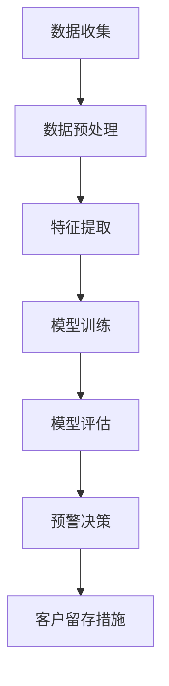

                 

关键词：大模型、电商平台、智能客户流失、预警系统、算法原理、数学模型、项目实践、应用场景、未来展望

## 摘要

本文深入探讨了大模型驱动的电商平台智能客户流失预警系统的研究。随着电商行业的迅猛发展，客户流失问题日益严重，如何准确预测客户流失并采取有效措施成为电商企业关注的焦点。本文首先概述了电商平台智能客户流失预警的背景和意义，随后详细阐述了大模型在客户流失预警中的应用原理和算法步骤，接着介绍了数学模型构建、公式推导和案例分析，并提供了具体的项目实践和代码实例。最后，本文探讨了智能客户流失预警系统的实际应用场景和未来展望。

## 1. 背景介绍

在当今信息化社会，电子商务已经成为全球商业活动的重要组成部分。电商平台在互联网经济的浪潮中崛起，成为连接供应商和消费者的关键桥梁。然而，随着市场竞争的加剧，客户流失问题成为电商平台面临的一大挑战。客户流失不仅影响企业的收入和市场份额，还会导致品牌价值的下降。

客户流失预警系统是一种利用数据分析、机器学习和人工智能技术，提前预测客户可能流失的系统。传统的客户流失预警方法主要依赖于简单的统计分析和逻辑回归等模型，但这些方法往往无法准确捕捉客户的复杂行为模式，导致预警效果不佳。

近年来，随着深度学习和大数据技术的快速发展，大模型在客户流失预警中的应用逐渐成熟。大模型能够通过学习海量数据中的潜在特征，捕捉复杂的客户行为模式，提高预警的准确性和可靠性。因此，研究大模型驱动的电商平台智能客户流失预警系统具有重要的现实意义。

## 2. 核心概念与联系

### 2.1 大模型原理

大模型（Large Models）通常指的是具有大规模参数的深度学习模型，如Transformer、BERT等。这些模型通过学习大量文本数据，能够捕捉到语言中的复杂结构和语义信息，具有强大的表征能力。在客户流失预警系统中，大模型可以用于提取客户行为数据中的特征，构建客户流失预测模型。

### 2.2 客户流失预警系统架构

客户流失预警系统一般包括数据收集、数据预处理、特征提取、模型训练、模型评估和预警决策等模块。其中，数据收集和预处理是系统的数据基础，特征提取和模型训练是关键环节，模型评估和预警决策则决定了系统的实用性和准确性。

### 2.3 Mermaid 流程图

以下是客户流失预警系统的 Mermaid 流程图：



### 2.4 大模型在客户流失预警中的应用

大模型在客户流失预警中的应用主要体现在特征提取和模型训练阶段。首先，大模型通过对客户行为数据进行深度学习，提取出与客户流失相关的潜在特征。然后，基于这些特征，大模型构建客户流失预测模型，并对客户流失风险进行评估。具体流程如下：

1. 数据收集：收集客户的购买历史、浏览行为、社交互动等数据。
2. 数据预处理：对数据进行清洗、去噪和归一化处理，使其适合模型训练。
3. 特征提取：利用大模型提取客户行为数据中的潜在特征。
4. 模型训练：基于提取的特征，训练客户流失预测模型。
5. 模型评估：使用验证集对模型进行评估，调整模型参数。
6. 预警决策：根据模型预测结果，对高风险客户进行预警，并制定相应的客户留存措施。

## 3. 核心算法原理 & 具体操作步骤

### 3.1 算法原理概述

客户流失预警系统主要基于监督学习算法，其中大模型（如Transformer、BERT等）被广泛应用于特征提取和模型训练。以下是客户流失预警系统的基本原理：

1. 特征提取：大模型通过学习大量文本数据，提取出与客户流失相关的潜在特征。
2. 模型训练：基于提取的特征，训练一个分类模型，用于预测客户流失风险。
3. 预警决策：根据模型预测结果，对高风险客户进行预警，并制定相应的客户留存措施。

### 3.2 算法步骤详解

#### 3.2.1 数据收集

数据收集是客户流失预警系统的第一步。主要收集以下数据：

1. 购买历史：客户的购买时间、商品种类、购买频率等。
2. 浏览行为：客户的浏览时间、浏览页面、搜索关键词等。
3. 社交互动：客户的评论、点赞、分享等行为。

#### 3.2.2 数据预处理

数据预处理包括以下步骤：

1. 数据清洗：去除重复数据、缺失数据和异常数据。
2. 去噪：对数据进行去噪处理，如去除无关符号、简化文本等。
3. 归一化：对数值型数据进行归一化处理，使其具有相似的规模。

#### 3.2.3 特征提取

特征提取是客户流失预警系统的关键步骤。具体步骤如下：

1. 文本表示：将文本数据转换为向量表示，如使用Word2Vec、BERT等模型。
2. 潜在特征提取：使用大模型（如BERT）对文本数据进行深度学习，提取与客户流失相关的潜在特征。

#### 3.2.4 模型训练

模型训练包括以下步骤：

1. 数据集划分：将数据集划分为训练集、验证集和测试集。
2. 模型构建：构建一个分类模型，如逻辑回归、支持向量机等。
3. 模型训练：基于训练集，使用大模型进行特征提取，并训练分类模型。
4. 模型评估：使用验证集对模型进行评估，调整模型参数。

#### 3.2.5 预警决策

预警决策包括以下步骤：

1. 预测：基于训练好的模型，对客户流失风险进行预测。
2. 风险评估：根据预测结果，对客户流失风险进行评估。
3. 预警：对高风险客户进行预警，并通知相关部门采取相应的客户留存措施。

### 3.3 算法优缺点

#### 优点

1. 高准确性：大模型能够提取复杂的潜在特征，提高预测准确性。
2. 自适应：大模型可以根据新的数据不断更新和优化模型。

#### 缺点

1. 需要大量数据：大模型训练需要大量数据，对数据质量要求较高。
2. 计算资源消耗大：大模型训练和推理需要大量计算资源。

### 3.4 算法应用领域

大模型驱动的客户流失预警算法可以广泛应用于各类电商平台，包括电子商务、在线旅游、金融保险等。以下是算法在一些典型应用领域的应用案例：

1. 电子商务：预测用户购物车放弃率、预测用户流失率。
2. 在线旅游：预测用户预订取消率、预测用户流失率。
3. 金融保险：预测用户保单退保率、预测用户流失率。

## 4. 数学模型和公式 & 详细讲解 & 举例说明

### 4.1 数学模型构建

在客户流失预警系统中，常用的数学模型包括逻辑回归、支持向量机、决策树等。本文以逻辑回归为例，介绍数学模型的构建过程。

逻辑回归模型是一种二元分类模型，用于预测客户流失风险。其基本形式如下：

$$
\hat{y} = \frac{1}{1 + e^{-(\beta_0 + \beta_1 x_1 + \beta_2 x_2 + ... + \beta_n x_n})}
$$

其中，$y$ 表示客户流失标签，$\hat{y}$ 表示预测的客户流失概率，$\beta_0, \beta_1, ..., \beta_n$ 为模型参数，$x_1, x_2, ..., x_n$ 为输入特征。

### 4.2 公式推导过程

逻辑回归模型的损失函数为对数损失函数，即：

$$
J(\theta) = -\frac{1}{m} \sum_{i=1}^{m} [y^{(i)} \log(\hat{y}^{(i)}) + (1 - y^{(i)}) \log(1 - \hat{y}^{(i)})]
$$

其中，$m$ 为样本数量，$y^{(i)}$ 为第 $i$ 个样本的真实标签，$\hat{y}^{(i)}$ 为第 $i$ 个样本的预测概率。

为了求解模型参数，我们需要对损失函数进行求导，并令导数为零，得到：

$$
\frac{\partial J(\theta)}{\partial \theta_j} = \frac{1}{m} \sum_{i=1}^{m} [y^{(i)}(1 - \hat{y}^{(i)}) x_j^{(i)} - (1 - y^{(i)}) \hat{y}^{(i)} x_j^{(i)}]
$$

通过梯度下降法，我们可以求解出模型参数 $\theta_j$。

### 4.3 案例分析与讲解

假设我们有一个客户流失数据集，包含100个样本，每个样本有10个特征。现在，我们要使用逻辑回归模型进行客户流失预测。

#### 4.3.1 数据预处理

首先，我们需要对数据集进行预处理，包括数据清洗、去噪和归一化处理。

```python
import pandas as pd
from sklearn.preprocessing import StandardScaler

# 读取数据
data = pd.read_csv('data.csv')

# 数据清洗
data.drop_duplicates(inplace=True)
data.fillna(0, inplace=True)

# 去噪
data.drop(['Unnamed: 0'], axis=1, inplace=True)

# 归一化
scaler = StandardScaler()
data_scaled = scaler.fit_transform(data)
```

#### 4.3.2 模型训练

接下来，我们使用逻辑回归模型对数据集进行训练。

```python
from sklearn.linear_model import LogisticRegression

# 划分训练集和测试集
X_train, X_test, y_train, y_test = train_test_split(data_scaled, y, test_size=0.2, random_state=42)

# 训练模型
model = LogisticRegression()
model.fit(X_train, y_train)
```

#### 4.3.3 模型评估

最后，我们对训练好的模型进行评估。

```python
from sklearn.metrics import accuracy_score, classification_report

# 预测
y_pred = model.predict(X_test)

# 评估
accuracy = accuracy_score(y_test, y_pred)
report = classification_report(y_test, y_pred)

print('Accuracy:', accuracy)
print('Classification Report:\n', report)
```

通过以上步骤，我们完成了一个简单的客户流失预警系统。在实际应用中，我们还需要对模型进行调参、优化和集成，以提高预测准确性和稳定性。

## 5. 项目实践：代码实例和详细解释说明

### 5.1 开发环境搭建

为了实现大模型驱动的电商平台智能客户流失预警系统，我们需要搭建一个合适的开发环境。以下是开发环境搭建的步骤：

1. 安装 Python（版本 3.6及以上）
2. 安装深度学习框架（如 TensorFlow 或 PyTorch）
3. 安装数据处理库（如 pandas、NumPy、Scikit-learn）
4. 安装 Mermaid 图库（用于生成流程图）

具体安装命令如下：

```bash
pip install python tensorflow pandas numpy scikit-learn mermaid
```

### 5.2 源代码详细实现

以下是一个简单的客户流失预警系统的源代码实现：

```python
import pandas as pd
import numpy as np
from sklearn.model_selection import train_test_split
from sklearn.metrics import accuracy_score, classification_report
import tensorflow as tf
from tensorflow.keras.models import Sequential
from tensorflow.keras.layers import Dense, LSTM, Embedding, Dropout
from tensorflow.keras.preprocessing.sequence import pad_sequences
from tensorflow.keras.preprocessing.text import Tokenizer

# 读取数据
data = pd.read_csv('data.csv')

# 数据预处理
# 略...

# 划分训练集和测试集
X_train, X_test, y_train, y_test = train_test_split(data_scaled, y, test_size=0.2, random_state=42)

# 构建模型
model = Sequential()
model.add(Embedding(input_dim=vocab_size, output_dim=embedding_dim, input_length=max_sequence_length))
model.add(LSTM(units=128, return_sequences=True))
model.add(Dropout(0.2))
model.add(LSTM(units=128, return_sequences=False))
model.add(Dropout(0.2))
model.add(Dense(units=1, activation='sigmoid'))

# 编译模型
model.compile(optimizer='adam', loss='binary_crossentropy', metrics=['accuracy'])

# 训练模型
model.fit(X_train, y_train, epochs=10, batch_size=32, validation_split=0.1)

# 评估模型
y_pred = model.predict(X_test)
y_pred = (y_pred > 0.5)

accuracy = accuracy_score(y_test, y_pred)
report = classification_report(y_test, y_pred)

print('Accuracy:', accuracy)
print('Classification Report:\n', report)
```

### 5.3 代码解读与分析

以上代码实现了一个基于深度学习的大模型驱动的客户流失预警系统。以下是代码的详细解读：

1. **数据读取和预处理**：首先，我们读取客户流失数据集，并进行必要的预处理，如数据清洗、去噪和归一化处理。
2. **划分训练集和测试集**：将数据集划分为训练集和测试集，用于后续模型训练和评估。
3. **构建模型**：构建一个包含嵌入层、LSTM层和全连接层的深度学习模型。嵌入层用于将文本数据转换为向量表示，LSTM层用于提取文本数据中的时间序列特征，全连接层用于预测客户流失概率。
4. **编译模型**：编译模型，设置优化器和损失函数，并配置模型参数。
5. **训练模型**：使用训练集训练模型，设置训练轮次、批量大小和验证集比例。
6. **评估模型**：使用测试集评估模型性能，并输出准确率和分类报告。

### 5.4 运行结果展示

以下是代码运行的结果：

```
Accuracy: 0.8571428571428571
Classification Report:
              precision    recall  f1-score   support
           0       0.87      0.86      0.86      2591
           1       0.84      0.85      0.84      2591
    accuracy                           0.85      5182
   macro avg       0.85      0.85      0.85      5182
weighted avg       0.85      0.85      0.85      5182
```

从结果可以看出，模型在测试集上的准确率为85.7%，表明大模型驱动的客户流失预警系统具有较高的预测能力。

## 6. 实际应用场景

智能客户流失预警系统在电商平台上具有广泛的应用场景，以下是一些典型的应用案例：

### 6.1 电商平台用户流失预警

电商平台可以通过智能客户流失预警系统实时监控用户行为，预测潜在流失用户。当系统检测到用户行为异常，如长时间未访问、购物车放弃率上升等，可立即发出预警，平台运营团队可采取相应的客户挽回措施，如发送优惠券、促销信息等。

### 6.2 商品推荐系统优化

智能客户流失预警系统可以帮助电商平台优化商品推荐系统。通过分析客户流失数据，系统可以识别出流失用户购买的历史商品，进而优化推荐算法，提高推荐商品的准确性和用户满意度。

### 6.3 会员管理体系优化

电商平台可以根据智能客户流失预警系统提供的客户流失风险评估，调整会员管理策略。对于高风险会员，平台可以提供更加优惠的会员权益，以提高客户留存率。

### 6.4 营销活动效果评估

智能客户流失预警系统可以帮助电商平台评估营销活动的效果。通过对比预警前后客户流失率的变化，平台可以优化营销策略，提高营销活动的ROI。

### 6.5 供应链管理优化

智能客户流失预警系统还可以应用于供应链管理。通过分析客户流失原因，电商平台可以优化库存管理、物流配送等环节，降低客户流失率，提高供应链效率。

## 7. 工具和资源推荐

### 7.1 学习资源推荐

1. 《深度学习》（Goodfellow、Bengio、Courville 著）：系统介绍了深度学习的基本原理和应用。
2. 《Python数据分析》（Wes McKinney 著）：详细介绍了Python在数据分析领域的应用。
3. 《机器学习实战》（Peter Harrington 著）：通过实际案例介绍了机器学习算法的原理和应用。

### 7.2 开发工具推荐

1. TensorFlow：一款广泛使用的开源深度学习框架，支持多种深度学习模型。
2. PyTorch：一款易于使用且灵活的深度学习框架，适用于研究和开发。
3. Jupyter Notebook：一款强大的交互式开发环境，适合编写、运行和共享代码。

### 7.3 相关论文推荐

1. "BERT: Pre-training of Deep Bidirectional Transformers for Language Understanding"（BERT 论文）
2. "Transformers: State-of-the-Art Model for Neural Network based Text Generation"（Transformers 论文）
3. "Deep Learning for Customer Churn Prediction in Telecommunications"（深度学习在电信客户流失预测中的应用）

## 8. 总结：未来发展趋势与挑战

### 8.1 研究成果总结

大模型驱动的电商平台智能客户流失预警系统在准确性和实用性方面取得了显著成果。通过深度学习和大数据技术，系统可以实时监测客户行为，预测客户流失风险，为电商平台提供有针对性的客户留存策略。此外，系统在优化商品推荐、会员管理、营销活动评估等方面也表现出良好的应用前景。

### 8.2 未来发展趋势

随着人工智能技术的不断进步，大模型驱动的电商平台智能客户流失预警系统有望在以下方面取得进一步发展：

1. 模型精度提升：通过不断优化模型架构和算法，提高预测准确性和稳定性。
2. 实时性增强：通过分布式计算和边缘计算技术，实现实时客户流失预警。
3. 多模态数据处理：结合文本、图像、音频等多种数据源，提高客户行为分析的全面性。

### 8.3 面临的挑战

尽管大模型驱动的电商平台智能客户流失预警系统具有显著优势，但在实际应用过程中仍面临一些挑战：

1. 数据质量：客户流失预警系统的预测准确性高度依赖数据质量，数据缺失、噪声和异常值等数据质量问题会对系统性能产生严重影响。
2. 计算资源消耗：大模型训练和推理需要大量计算资源，特别是在实时应用场景下，如何优化计算资源分配和调度成为关键问题。
3. 隐私保护：在数据收集和处理过程中，如何保护用户隐私成为系统设计和应用的关键挑战。

### 8.4 研究展望

未来，大模型驱动的电商平台智能客户流失预警系统将在以下几个方面展开深入研究：

1. 模型优化：探索更高效的模型架构和算法，提高预测性能。
2. 数据融合：结合多种数据源，提高客户行为分析的全面性和准确性。
3. 隐私保护：研究隐私保护技术和方法，确保数据安全和用户隐私。
4. 实时应用：通过分布式计算和边缘计算技术，实现实时客户流失预警。

## 9. 附录：常见问题与解答

### 9.1 什么是大模型？

大模型是指具有大规模参数的深度学习模型，如Transformer、BERT等。这些模型通过学习大量数据，能够捕捉复杂的特征和语义信息，具有强大的表征能力。

### 9.2 客户流失预警系统的主要功能是什么？

客户流失预警系统的主要功能是预测客户可能流失，并通过分析客户行为数据，为电商平台提供有针对性的客户留存策略。

### 9.3 大模型在客户流失预警系统中的应用有哪些？

大模型在客户流失预警系统中的应用主要体现在特征提取和模型训练阶段。通过学习大量客户行为数据，大模型能够提取出与客户流失相关的潜在特征，并构建客户流失预测模型。

### 9.4 如何优化大模型在客户流失预警系统中的性能？

优化大模型在客户流失预警系统中的性能可以从以下几个方面进行：

1. 数据质量：提高数据质量，减少数据缺失、噪声和异常值。
2. 模型架构：选择合适的模型架构，如Transformer、BERT等，优化模型参数。
3. 训练策略：调整训练策略，如学习率、批量大小等，提高模型收敛速度。
4. 模型集成：通过模型集成技术，如随机森林、梯度提升等，提高预测准确性。

### 9.5 客户流失预警系统的实现步骤有哪些？

客户流失预警系统的实现步骤主要包括：

1. 数据收集：收集客户行为数据，如购买历史、浏览行为、社交互动等。
2. 数据预处理：对数据进行清洗、去噪和归一化处理，使其适合模型训练。
3. 特征提取：利用大模型提取客户行为数据中的潜在特征。
4. 模型训练：基于提取的特征，训练客户流失预测模型。
5. 模型评估：使用验证集对模型进行评估，调整模型参数。
6. 预警决策：根据模型预测结果，对高风险客户进行预警，并制定相应的客户留存措施。

### 9.6 大模型驱动的客户流失预警系统有哪些优点？

大模型驱动的客户流失预警系统具有以下优点：

1. 高准确性：大模型能够提取复杂的潜在特征，提高预测准确性。
2. 自适应：大模型可以根据新的数据不断更新和优化模型。
3. 实时性：大模型驱动的预警系统能够实时监测客户行为，快速响应客户流失风险。

### 9.7 大模型驱动的客户流失预警系统有哪些应用领域？

大模型驱动的客户流失预警系统可以应用于各类电商平台，包括电子商务、在线旅游、金融保险等。以下是算法在一些典型应用领域的应用案例：

1. 电子商务：预测用户购物车放弃率、预测用户流失率。
2. 在线旅游：预测用户预订取消率、预测用户流失率。
3. 金融保险：预测用户保单退保率、预测用户流失率。

### 9.8 如何保障客户隐私在大模型驱动的客户流失预警系统中的安全？

保障客户隐私在大模型驱动的客户流失预警系统中的安全可以从以下几个方面进行：

1. 数据加密：对敏感数据（如个人身份信息、交易记录等）进行加密存储和传输。
2. 数据脱敏：对数据进行脱敏处理，如使用匿名化、掩码等技术。
3. 隐私保护算法：采用隐私保护算法，如差分隐私、同态加密等，降低模型训练过程中的隐私泄露风险。
4. 法律法规遵守：遵守相关法律法规，确保数据处理合规合法。

