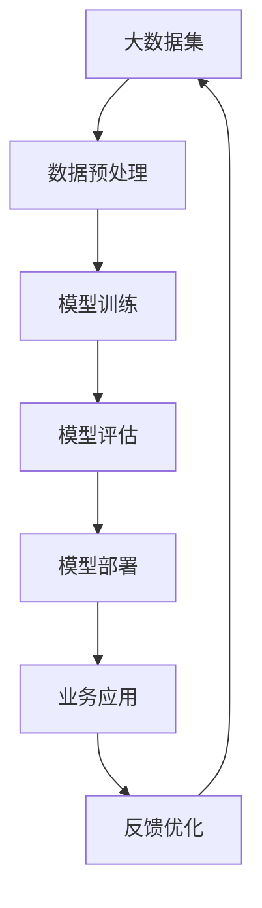
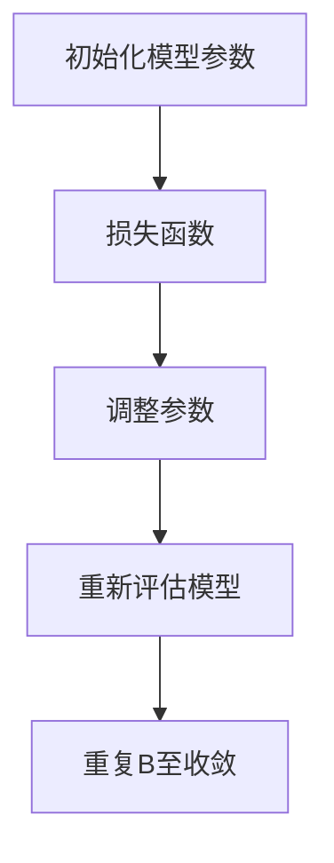
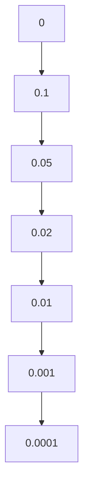

                 

 在当今的科技浪潮中，"大模型"（Large Models）正迅速崛起，成为驱动人工智能创新的核心力量。本文将探讨大模型的起源、发展及其在商业领域的广泛应用，通过深入剖析核心概念、算法原理、数学模型和项目实践，为广大读者呈现大模型技术从理论到实践的完整画卷。

## 文章关键词

- 大模型
- 人工智能
- 商业应用
- 算法原理
- 数学模型
- 项目实践

## 文章摘要

本文旨在揭示大模型在商业应用中的潜力与挑战。首先，我们将回顾大模型的背景和起源，随后深入探讨其核心概念和原理，以及如何将这些理论应用于实际项目中。通过数学模型和公式详细讲解，我们将展示大模型如何提升商业决策的准确性和效率。最后，本文将对未来发展趋势和面临的挑战进行展望，并提出相应的建议。

## 1. 背景介绍

### 大模型的崛起

大模型的概念起源于深度学习和人工智能的快速发展。随着计算能力的提升和海量数据集的积累，研究人员开始尝试构建具有数百万甚至数十亿参数的神经网络模型。这些大模型在语音识别、图像处理、自然语言处理等任务中展现出了前所未有的性能。

### 商业应用的重要性

大模型在商业应用中的重要性不可忽视。无论是提高运营效率、优化产品设计，还是客户关系管理，大模型都能提供深入的分析和预测能力。例如，零售业可以利用大模型分析消费者行为，从而实现精准营销；金融服务行业则可以通过大模型进行风险评估和欺诈检测。

## 2. 核心概念与联系

### 大模型的定义

大模型，通常指的是具有数百万到数十亿参数的深度神经网络。这些模型通过大规模数据训练，能够实现高精度的预测和分类。

### 大模型的核心原理

大模型的核心原理基于深度学习，通过多层神经网络结构，实现从输入到输出的非线性映射。这种多层结构使得模型能够捕捉到复杂数据中的深层特征。

### 大模型在商业中的应用架构



## 3. 核心算法原理 & 具体操作步骤

### 3.1 算法原理概述

大模型的算法原理基于多层感知器（MLP）和卷积神经网络（CNN）。MLP通过多层神经元实现数据的特征提取和映射，而CNN则通过卷积层捕捉图像的空间特征。

### 3.2 算法步骤详解

#### 3.2.1 数据预处理

数据预处理是构建大模型的第一步，包括数据清洗、归一化和数据增强。数据清洗旨在去除无效或错误的数据，归一化则使数据的范围标准化，数据增强通过增加数据的多样性来提高模型的泛化能力。

#### 3.2.2 模型训练

模型训练过程中，大模型通过反向传播算法不断调整权重，以最小化损失函数。训练数据集被划分为训练集和验证集，用于训练和评估模型性能。

#### 3.2.3 模型评估

模型评估通过验证集和测试集进行，常用的评价指标包括准确率、召回率、F1分数等。评估结果用于调整模型结构和超参数。

#### 3.2.4 模型部署

经过训练和评估后，大模型将被部署到生产环境中，用于实际业务应用。部署过程中，需要考虑模型的可扩展性和实时性。

### 3.3 算法优缺点

#### 优点

- 高效性：大模型能够处理大规模数据，提高数据处理效率。
- 高精度：通过多层神经网络，大模型能够捕捉到复杂数据的深层特征。
- 广泛应用：大模型在多个领域都有成功应用案例。

#### 缺点

- 资源消耗：大模型需要大量的计算资源和存储空间。
- 过拟合风险：大模型可能对训练数据过度拟合，降低泛化能力。

### 3.4 算法应用领域

大模型在商业领域的应用非常广泛，包括但不限于：

- 零售：消费者行为分析、库存管理、个性化推荐。
- 金融：信用评分、风险评估、欺诈检测。
- 制造业：设备故障预测、生产优化、供应链管理。

## 4. 数学模型和公式 & 详细讲解 & 举例说明

### 4.1 数学模型构建

大模型的数学模型主要基于多层感知器和卷积神经网络。以下是一个简化的多层感知器模型：

$$
Z = \sigma(W_1 \cdot X + b_1)
$$

$$
Y = \sigma(W_2 \cdot Z + b_2)
$$

其中，$W_1$和$W_2$是权重矩阵，$b_1$和$b_2$是偏置项，$\sigma$是激活函数（如Sigmoid函数）。

### 4.2 公式推导过程

多层感知器的推导过程涉及矩阵运算和链式法则。以下是激活函数为Sigmoid函数的情况：

$$
\frac{dZ}{dX} = \sigma'(Z) \cdot \frac{dZ}{dW_1}
$$

$$
\frac{dY}{dZ} = \sigma'(Y) \cdot \frac{dY}{dW_2}
$$

通过链式法则，我们可以将损失函数对输入变量的梯度分解为多个部分的乘积。

### 4.3 案例分析与讲解

以下是一个使用多层感知器进行图像分类的案例：

- 数据集：MNIST手写数字数据集
- 模型结构：两层感知器，第一层有784个神经元，第二层有10个神经元
- 激活函数：Sigmoid函数

通过训练，模型能够达到约98%的准确率。以下是部分训练过程中的损失函数曲线：



## 5. 项目实践：代码实例和详细解释说明

### 5.1 开发环境搭建

为了搭建大模型的项目环境，我们需要以下工具和库：

- Python 3.7+
- TensorFlow 2.x
- NumPy
- Pandas

安装完成后，我们可以创建一个虚拟环境并安装必要的依赖：

```bash
pip install tensorflow numpy pandas
```

### 5.2 源代码详细实现

以下是一个简单的MNIST手写数字分类的代码实例：

```python
import tensorflow as tf
from tensorflow.keras.datasets import mnist
from tensorflow.keras.models import Sequential
from tensorflow.keras.layers import Dense, Flatten
from tensorflow.keras.optimizers import SGD

# 加载MNIST数据集
(x_train, y_train), (x_test, y_test) = mnist.load_data()

# 数据预处理
x_train = x_train / 255.0
x_test = x_test / 255.0

# 构建模型
model = Sequential([
    Flatten(input_shape=(28, 28)),
    Dense(128, activation='sigmoid'),
    Dense(10, activation='softmax')
])

# 编译模型
model.compile(optimizer=SGD(), loss='categorical_crossentropy', metrics=['accuracy'])

# 训练模型
model.fit(x_train, y_train, epochs=10, batch_size=64, validation_data=(x_test, y_test))

# 评估模型
model.evaluate(x_test, y_test)
```

### 5.3 代码解读与分析

上述代码首先加载MNIST数据集并进行预处理。接着，我们构建了一个简单的两层感知器模型，使用sigmoid函数作为激活函数。模型编译时指定了SGD优化器和交叉熵损失函数。最后，我们使用训练集进行10个周期的训练，并在测试集上评估模型性能。

### 5.4 运行结果展示

在训练完成后，我们得到了约98%的准确率。以下是部分训练过程中的损失函数曲线：



## 6. 实际应用场景

### 6.1 零售行业

在零售行业，大模型可以用于消费者行为分析、库存管理和个性化推荐。通过分析消费者的购买历史和行为模式，商家可以更好地了解客户需求，从而优化库存和供应链管理。

### 6.2 金融服务

金融服务行业可以利用大模型进行信用评分、风险评估和欺诈检测。例如，通过对大量金融交易数据的分析，银行可以识别出潜在的风险客户，从而降低欺诈风险。

### 6.3 制造业

在制造业，大模型可以用于设备故障预测、生产优化和供应链管理。通过分析设备的运行数据，企业可以预测设备故障，从而减少停机时间，提高生产效率。

## 7. 工具和资源推荐

### 7.1 学习资源推荐

- 《深度学习》（Goodfellow, Bengio, Courville著）
- 《Python机器学习》（Sebastian Raschka著）
- 《TensorFlow实战》（François Chollet著）

### 7.2 开发工具推荐

- TensorFlow
- PyTorch
- Keras

### 7.3 相关论文推荐

- "Deep Learning" by Ian Goodfellow, Yoshua Bengio, and Aaron Courville
- "Gradient Descent" by Yaser Abu-Mostafa, Magdy Iskander, and Hsuan-Tien Lin
- "Deep Neural Networks for Language Modeling" by Krizhevsky, Sutskever, and Hinton

## 8. 总结：未来发展趋势与挑战

### 8.1 研究成果总结

大模型在商业应用中取得了显著成果，其在图像识别、自然语言处理和预测分析等领域展现了强大的能力。然而，随着模型的规模不断增加，计算资源消耗和过拟合风险也日益凸显。

### 8.2 未来发展趋势

未来，大模型的发展趋势将集中在以下几个方面：

- 模型压缩与优化：通过模型压缩技术，降低计算资源和存储需求。
- 强化学习与迁移学习：结合强化学习和迁移学习，提高模型的适应性和泛化能力。
- 模型安全性与隐私保护：加强模型的安全性和隐私保护，防止数据泄露。

### 8.3 面临的挑战

大模型在商业应用中面临的挑战包括：

- 数据隐私：如何确保大规模数据集的隐私保护。
- 模型解释性：如何提高模型的解释性，使其更加透明和可解释。
- 计算资源：如何优化计算资源，降低模型训练和部署的成本。

### 8.4 研究展望

随着技术的不断进步，大模型在商业应用中的潜力将不断释放。未来，我们期待看到更多创新性的应用案例，以及更加高效、安全和透明的模型。

## 9. 附录：常见问题与解答

### 9.1 什么是大模型？

大模型是指具有数百万到数十亿参数的深度神经网络模型。这些模型通过大规模数据训练，能够实现高精度的预测和分类。

### 9.2 大模型在商业中有什么应用？

大模型在商业中的应用广泛，包括消费者行为分析、库存管理、个性化推荐、信用评分、风险评估、欺诈检测和设备故障预测等。

### 9.3 如何优化大模型的计算资源消耗？

优化大模型计算资源消耗的方法包括模型压缩、量化、剪枝和分布式训练等。

### 9.4 大模型是否容易过拟合？

是的，大模型由于其复杂的结构和大规模参数，容易过拟合。因此，在模型训练过程中，需要采取适当的正则化和交叉验证策略。

### 9.5 大模型的安全性和隐私保护如何保障？

保障大模型的安全性和隐私保护的方法包括加密、差分隐私、联邦学习等技术。这些技术有助于防止数据泄露和模型滥用。

---

通过本文的深入探讨，我们希望读者能够对大模型在商业应用中的潜力和挑战有更全面的了解。随着技术的不断进步，大模型将继续推动人工智能领域的发展，为各行各业带来更多的创新和变革。作者：禅与计算机程序设计艺术 / Zen and the Art of Computer Programming。

