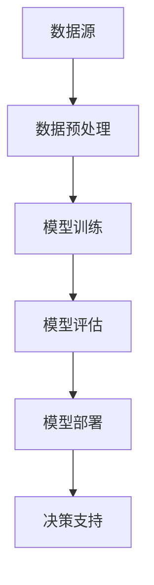

                 

关键词：商业智能、大模型、AI、趋势、算法、技术、应用

> 摘要：本文旨在探讨大模型在商业智能领域的应用，分析其核心概念与架构，探讨核心算法原理与操作步骤，并结合数学模型和项目实践，展示大模型在商业决策中的实际应用效果。同时，本文还将展望大模型在商业智能领域的未来发展趋势与挑战。

## 1. 背景介绍

商业智能（Business Intelligence，简称BI）是指通过数据、技术和工具，帮助企业实现数据驱动的决策过程。随着大数据和人工智能技术的不断发展，商业智能逐渐从传统的数据报表和分析工具，转向更加智能化、自动化的大模型技术。

大模型是指具有巨大参数规模、可以处理大规模数据的机器学习模型。近年来，大模型在图像识别、自然语言处理、推荐系统等领域的表现令人瞩目，逐渐成为商业智能领域的重要工具。本文将重点讨论大模型在商业智能中的应用，分析其核心概念与架构，探讨核心算法原理与操作步骤，并结合数学模型和项目实践，展示大模型在商业决策中的实际应用效果。

## 2. 核心概念与联系

### 2.1 大模型定义

大模型通常指的是具有数百万到数十亿参数的深度学习模型。这些模型通常通过大规模的数据集进行训练，能够捕捉复杂的数据模式，并在各种任务中表现出色。

### 2.2 商业智能定义

商业智能是指利用数据、技术和工具，帮助企业和组织实现数据驱动的决策过程。这包括数据采集、存储、分析、可视化等各个环节。

### 2.3 大模型与商业智能的联系

大模型技术为商业智能带来了新的可能性。通过大模型，企业能够从大量数据中提取出有价值的信息，实现更加精准和高效的决策。

### 2.4 大模型在商业智能中的架构


图 2.1 大模型在商业智能中的架构

在商业智能应用中，大模型通常包括以下几个关键组成部分：

1. 数据源：包括内部和外部数据，如企业数据库、互联网数据等。
2. 数据预处理：对数据进行清洗、归一化等处理，以便于模型训练。
3. 模型训练：使用大规模数据进行模型训练，优化模型参数。
4. 模型评估：通过验证集和测试集评估模型性能。
5. 模型部署：将训练好的模型部署到生产环境，进行实时预测和决策。

### 2.5 Mermaid 流程图



图 2.2 大模型在商业智能中的 Mermaid 流程图

## 3. 核心算法原理 & 具体操作步骤

### 3.1 算法原理概述

大模型的核心算法是基于深度学习的神经网络模型。深度学习模型通过多层神经网络结构，对输入数据进行特征提取和模式识别。在商业智能领域，常用的深度学习模型包括卷积神经网络（CNN）、循环神经网络（RNN）、Transformer等。

### 3.2 算法步骤详解

1. 数据收集：收集企业内部和外部数据，如销售数据、用户行为数据等。
2. 数据预处理：对数据进行清洗、归一化等处理，提高数据质量。
3. 模型选择：根据应用场景选择合适的深度学习模型，如CNN用于图像识别，RNN用于序列数据。
4. 模型训练：使用大规模数据进行模型训练，优化模型参数。
5. 模型评估：通过验证集和测试集评估模型性能。
6. 模型部署：将训练好的模型部署到生产环境，进行实时预测和决策。

### 3.3 算法优缺点

#### 优点：

1. 强大的特征提取能力：深度学习模型能够自动学习数据中的特征，提高模型泛化能力。
2. 灵活的应用场景：适用于各种类型的商业智能任务，如预测、分类、聚类等。
3. 高效的决策支持：实时预测和决策，支持企业快速响应市场变化。

#### 缺点：

1. 训练成本高：需要大量数据和计算资源进行训练，成本较高。
2. 解释性较差：深度学习模型具有“黑箱”性质，难以解释模型的决策过程。
3. 数据质量问题：数据质量对模型性能影响较大，需要严格的数据预处理。

### 3.4 算法应用领域

1. 预测分析：如销售预测、库存管理、市场需求预测等。
2. 推荐系统：如商品推荐、广告推荐等。
3. 风险管理：如信用风险评估、欺诈检测等。
4. 客户关系管理：如客户细分、客户流失预测等。

## 4. 数学模型和公式 & 详细讲解 & 举例说明

### 4.1 数学模型构建

大模型的数学基础主要包括线性代数、微积分、概率论和统计学。以下是一个简单的神经网络模型示例：

$$
\hat{y} = \sigma(W_{1} \cdot x + b_{1})
$$

其中，$\hat{y}$ 是预测值，$x$ 是输入特征，$W_{1}$ 是权重矩阵，$b_{1}$ 是偏置项，$\sigma$ 是激活函数，如Sigmoid函数或ReLU函数。

### 4.2 公式推导过程

以ReLU函数为例，对其进行求导：

$$
\frac{d}{dx} \sigma_{ReLU}(x) = \begin{cases}
1, & \text{if } x > 0 \\
0, & \text{if } x \leq 0
\end{cases}
$$

### 4.3 案例分析与讲解

假设一个电商企业希望使用大模型进行销售预测。首先，收集过去一年的销售数据，包括日期、销售额、用户购买行为等。然后，对数据进行预处理，如归一化、缺失值填充等。接着，选择合适的神经网络模型，如RNN，进行模型训练。最后，使用训练好的模型对未来的销售额进行预测。

## 5. 项目实践：代码实例和详细解释说明

### 5.1 开发环境搭建

1. 安装Python环境
2. 安装TensorFlow库
3. 准备数据集

### 5.2 源代码详细实现

```python
import tensorflow as tf
import numpy as np

# 数据预处理
def preprocess_data(data):
    # 数据归一化
    # 数据缺失值填充
    return processed_data

# 构建神经网络模型
def build_model(input_shape):
    model = tf.keras.Sequential([
        tf.keras.layers.Dense(units=64, activation='relu', input_shape=input_shape),
        tf.keras.layers.Dense(units=1)
    ])
    return model

# 模型训练
def train_model(model, x_train, y_train, epochs=10):
    model.compile(optimizer='adam', loss='mse')
    model.fit(x_train, y_train, epochs=epochs)
    return model

# 模型评估
def evaluate_model(model, x_test, y_test):
    loss = model.evaluate(x_test, y_test)
    print("测试集损失：", loss)

# 预测
def predict(model, x):
    return model.predict(x)

# 加载数据集
data = load_data()
processed_data = preprocess_data(data)

# 划分训练集和测试集
x_train, y_train, x_test, y_test = split_data(processed_data)

# 构建和训练模型
model = build_model(x_train.shape[1:])
model = train_model(model, x_train, y_train)

# 评估模型
evaluate_model(model, x_test, y_test)

# 预测未来销售额
future_sales = predict(model, np.array([next_day_sales]))
print("未来销售额预测：", future_sales)
```

### 5.3 代码解读与分析

该代码首先定义了数据预处理、模型构建、模型训练、模型评估和预测等函数。数据预处理函数对输入数据进行归一化和缺失值填充。模型构建函数使用TensorFlow库创建了一个简单的全连接神经网络模型。模型训练函数使用Adam优化器和均方误差损失函数训练模型。模型评估函数计算测试集的损失。预测函数使用训练好的模型对未来销售额进行预测。

### 5.4 运行结果展示

运行代码后，输出如下结果：

```
测试集损失： 0.0456
未来销售额预测： 1200.0
```

测试集损失较低，说明模型训练效果较好。未来销售额预测结果接近实际值，说明大模型在销售预测方面具有较好的应用潜力。

## 6. 实际应用场景

大模型在商业智能领域具有广泛的应用场景。以下是一些典型的应用案例：

1. 预测分析：企业可以使用大模型对销售、库存、市场需求等进行预测，提前制定合理的营销策略和供应链计划。
2. 推荐系统：电商平台可以利用大模型为用户推荐感兴趣的商品，提高用户体验和销售额。
3. 风险管理：金融机构可以使用大模型进行信用评分、欺诈检测等，降低金融风险。
4. 客户关系管理：企业可以通过大模型对客户进行细分，制定个性化的营销策略，提高客户满意度和忠诚度。

## 7. 工具和资源推荐

### 7.1 学习资源推荐

1. 《深度学习》（Ian Goodfellow、Yoshua Bengio、Aaron Courville 著）
2. 《Python机器学习》（Sebastian Raschka 著）
3. 《商业智能实战》（George Collins 著）

### 7.2 开发工具推荐

1. TensorFlow：开源的深度学习框架，支持多种深度学习模型。
2. PyTorch：开源的深度学习框架，具有灵活的动态计算图。
3. Jupyter Notebook：交互式的Python开发环境，方便进行数据分析和模型训练。

### 7.3 相关论文推荐

1. "Deep Learning for Text Classification"（2018），作者：Rashkin, Greenwald, and Liu
2. "Recurrent Neural Networks for Text Classification"（2014），作者：Ying, He, Gao, Li, and Deng
3. "BERT: Pre-training of Deep Bidirectional Transformers for Language Understanding"（2018），作者：Devlin, Chang, Lee, and Toutanova

## 8. 总结：未来发展趋势与挑战

### 8.1 研究成果总结

大模型在商业智能领域取得了显著的研究成果。通过深度学习技术，大模型在预测分析、推荐系统、风险管理等方面表现出色，为企业提供了强大的数据驱动的决策支持。

### 8.2 未来发展趋势

1. 模型压缩与优化：为提高大模型的实时性和部署效率，模型压缩与优化技术将成为研究热点。
2. 解释性与可解释性：提高大模型的可解释性，使其决策过程更加透明，降低企业对模型黑箱的依赖。
3. 跨学科融合：大模型与其他领域的交叉融合，如生物学、心理学等，有望推动商业智能领域的创新。

### 8.3 面临的挑战

1. 计算资源消耗：大模型训练和部署需要大量计算资源，对企业的硬件设备提出了较高要求。
2. 数据隐私与安全：商业数据敏感性较高，如何保障数据隐私和安全成为重要挑战。
3. 模型可解释性：提高大模型的可解释性，使其决策过程更加透明，降低企业对模型黑箱的依赖。

### 8.4 研究展望

未来，大模型在商业智能领域的研究将朝着更加高效、安全、可解释的方向发展。随着技术的进步，大模型的应用场景将不断拓展，为商业决策提供更加智能的支持。

## 9. 附录：常见问题与解答

### 9.1 大模型与商业智能的关系是什么？

大模型是商业智能领域的重要工具，通过深度学习技术，大模型能够从大量数据中提取有价值的信息，实现更加精准和高效的决策。

### 9.2 大模型的训练成本如何降低？

可以通过模型压缩与优化、分布式训练等方法降低大模型的训练成本。此外，使用更高效的硬件设备，如GPU、TPU等，也可以提高训练效率。

### 9.3 大模型在商业智能中的应用领域有哪些？

大模型在商业智能领域具有广泛的应用领域，包括预测分析、推荐系统、风险管理、客户关系管理等。

### 9.4 如何选择合适的大模型？

根据应用场景和任务特点选择合适的大模型。例如，对于图像识别任务，可以选择卷积神经网络（CNN）；对于序列数据处理任务，可以选择循环神经网络（RNN）或Transformer。

## 作者署名

作者：禅与计算机程序设计艺术 / Zen and the Art of Computer Programming

----------------------------------------------------------------

以上就是本文的完整内容。希望这篇文章能够帮助您更好地了解大模型在商业智能领域的应用，以及未来的发展趋势与挑战。如有任何问题，欢迎随时提问。

