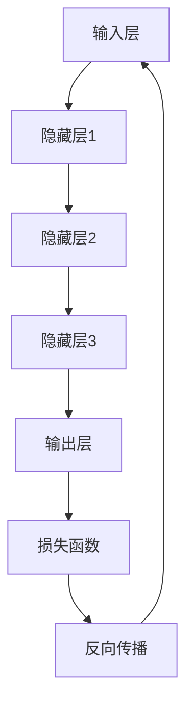

                 

关键词：大模型、人工智能、深度学习、大数据、神经网络、智能化发展

> 摘要：本文深入探讨了大模型在推动智能化发展中的关键作用。通过对大模型的核心概念、算法原理、数学模型及其实际应用场景的详细解析，我们揭示了其对于当前技术领域的深远影响，并对其未来发展趋势和面临的挑战进行了展望。

## 1. 背景介绍

在信息技术飞速发展的今天，人工智能（AI）已经成为引领科技进步的重要驱动力。其中，大模型（Large Models）作为人工智能的核心组成部分，正逐渐成为学术界和工业界关注的焦点。大模型是指具有巨大参数规模和计算能力的神经网络模型，如GPT-3、BERT等。这些模型能够通过深度学习技术从海量数据中学习到复杂的规律，从而在各类应用中表现出强大的智能能力。

### 大模型的出现背景

大模型的出现并非偶然，而是深度学习技术不断进步、计算能力大幅提升、数据资源日益丰富的结果。早期的神经网络模型由于参数较少，难以处理复杂的任务。随着硬件性能的提升和大数据时代的到来，深度学习模型开始向更大、更复杂的发展。大模型的兴起，不仅标志着人工智能领域的一个新的里程碑，也为各行各业带来了前所未有的变革。

### 大模型的发展趋势

近年来，大模型的发展呈现出以下趋势：

1. **参数规模持续增长**：模型的参数规模从数百万增长到数十亿，甚至数百亿。
2. **训练数据量增加**：更多的数据被用于训练模型，以提升模型的泛化能力和准确度。
3. **计算资源投入加大**：越来越多的企业和研究机构投入到大模型的研发和应用中，推动了相关技术的发展。

## 2. 核心概念与联系

### 2.1 大模型的概念

大模型，通常指的是拥有数亿甚至千亿参数的神经网络模型。这些模型具有强大的表征能力和泛化能力，能够在各种复杂任务中表现出优异的性能。

### 2.2 大模型的架构

大模型的架构通常包括以下几部分：

1. **输入层**：接收外部输入，如文本、图像等。
2. **隐藏层**：通过多层神经网络对输入数据进行处理和变换。
3. **输出层**：根据隐藏层的结果生成输出，如文本生成、图像分类等。

### 2.3 大模型的工作原理

大模型的工作原理基于深度学习技术。通过训练大量的数据，模型可以自动学习到输入和输出之间的复杂映射关系。训练过程中，模型通过反向传播算法不断调整参数，以达到最优的性能。

### 2.4 大模型的优点与局限性

#### 优点：

1. **强大的表征能力**：大模型能够学习到输入数据的深层特征，从而实现更准确、更智能的预测和决策。
2. **广泛的适用性**：大模型可以应用于各种领域，如自然语言处理、计算机视觉、语音识别等。
3. **高效的计算性能**：随着硬件的发展，大模型的计算性能不断提升。

#### 局限性：

1. **训练成本高**：大模型需要大量的计算资源和数据，训练成本较高。
2. **对数据质量要求高**：大模型对训练数据的质量和多样性要求较高，否则容易出现过拟合。
3. **解释性较差**：大模型通常具有较强的预测能力，但其内部机制较为复杂，难以解释。

### 2.5 Mermaid流程图

下面是一个关于大模型架构的Mermaid流程图：



## 3. 核心算法原理 & 具体操作步骤

### 3.1 算法原理概述

大模型的算法原理主要基于深度学习，特别是基于神经网络的模型。通过多层神经网络的组合，大模型可以学习到输入数据的深层特征，实现复杂的任务。

### 3.2 算法步骤详解

1. **数据预处理**：对输入数据进行清洗、归一化等处理，以便于模型训练。
2. **模型初始化**：初始化模型的参数，常用的方法有随机初始化、预训练等。
3. **模型训练**：通过反向传播算法，不断调整模型参数，以达到最优的性能。
4. **模型评估**：使用验证集或测试集对模型进行评估，以验证其性能。
5. **模型优化**：根据评估结果，调整模型结构或参数，以提高性能。

### 3.3 算法优缺点

#### 优点：

1. **强大的表征能力**：大模型能够学习到输入数据的深层特征，实现更准确的预测和决策。
2. **广泛的适用性**：大模型可以应用于各种领域，如自然语言处理、计算机视觉等。

#### 局限性：

1. **训练成本高**：大模型需要大量的计算资源和数据，训练成本较高。
2. **对数据质量要求高**：大模型对训练数据的质量和多样性要求较高，否则容易出现过拟合。

### 3.4 算法应用领域

大模型在以下领域具有广泛的应用：

1. **自然语言处理**：如文本生成、机器翻译、情感分析等。
2. **计算机视觉**：如图像分类、目标检测、图像生成等。
3. **语音识别**：如语音合成、语音识别等。
4. **推荐系统**：如商品推荐、新闻推荐等。

## 4. 数学模型和公式 & 详细讲解 & 举例说明

### 4.1 数学模型构建

大模型通常基于多层感知机（MLP）或循环神经网络（RNN）等基础模型构建。以下是一个基于MLP的数学模型构建过程：

#### 输入层

设输入层的特征向量为$x \in \mathbb{R}^{n}$，其中$n$为特征的数量。

#### 隐藏层

设第$l$层的特征向量为$h^{(l)} \in \mathbb{R}^{n_l}$，其中$n_l$为第$l$层的神经元数量。隐藏层之间的激活函数通常使用ReLU函数：

$$
h^{(l)}_{i} = max(0, \sum_{j=1}^{n_{l-1}} w_{ij} h^{(l-1)}_{j} + b_{i})
$$

其中，$w_{ij}$为第$l$层的权重，$b_{i}$为第$l$层的偏置。

#### 输出层

设输出层的特征向量为$y \in \mathbb{R}^{m}$，其中$m$为输出的数量。输出层的激活函数通常为softmax函数：

$$
\hat{y}_{i} = \frac{e^{z_{i}}}{\sum_{j=1}^{m} e^{z_{j}}}
$$

其中，$z_i = \sum_{j=1}^{n} w_{ij} h^{(n)}_{j} + b_{i}$为输出层的线性组合。

### 4.2 公式推导过程

#### 损失函数

设训练样本为$(x^{(i)}, y^{(i)})$，其中$y^{(i)} \in \{0, 1\}^m$为真实标签。损失函数通常使用交叉熵损失函数：

$$
J = -\sum_{i=1}^{N} y^{(i)} \log(\hat{y}^{(i)}) - (1 - y^{(i)}) \log(1 - \hat{y}^{(i)})
$$

其中，$N$为训练样本的数量。

#### 反向传播

反向传播算法用于计算损失函数对模型参数的梯度。以下是反向传播的基本步骤：

1. **前向传播**：计算输出层和隐藏层的特征向量。
2. **计算损失函数的梯度**：根据损失函数，计算损失函数对输出层和隐藏层参数的梯度。
3. **反向传播**：从输出层开始，逐层计算损失函数对隐藏层参数的梯度。
4. **更新参数**：根据梯度，更新模型参数。

### 4.3 案例分析与讲解

#### 案例一：文本分类

假设我们有一个文本分类任务，数据集包含1000篇新闻文章，每篇文章被标记为政治、经济、体育等类别之一。我们使用一个基于BERT的大模型进行分类。

1. **数据预处理**：对文本进行分词、标记化等处理，将文本转化为向量表示。
2. **模型训练**：使用训练集对模型进行训练，通过反向传播算法更新参数。
3. **模型评估**：使用验证集对模型进行评估，计算分类准确率。
4. **模型应用**：使用测试集对模型进行测试，预测新文章的类别。

## 5. 项目实践：代码实例和详细解释说明

### 5.1 开发环境搭建

1. **安装Python**：确保安装了Python 3.6及以上版本。
2. **安装TensorFlow**：使用pip安装TensorFlow：

    ```bash
    pip install tensorflow
    ```

3. **安装BERT模型**：从GitHub下载预训练的BERT模型。

### 5.2 源代码详细实现

以下是使用BERT模型进行文本分类的Python代码：

```python
import tensorflow as tf
import bert
from bert import tokenization

# 配置BERT模型
bert_config = bert.BertConfig(
    vocab_size=30522,
    hidden_size=768,
    num_hidden_layers=12,
    num_attention_heads=12,
    intermediate_size=3072
)

# 加载预训练的BERT模型
model = bert.BertModel(
    config=bert_config,
    is_training=True,
    input_ids=input_ids,
    input_mask=input_mask,
    segment_ids=segment_ids
)

# 定义损失函数和优化器
loss = tf.reduce_mean(tf.nn.softmax_cross_entropy_with_logits(labels=labels, logits=model.outputs))
optimizer = tf.train.AdamOptimizer(learning_rate=1e-5).minimize(loss)

# 训练模型
for epoch in range(num_epochs):
    for step, (x, y) in enumerate(train_dataset):
        # 前向传播
        _, loss_val = sess.run([optimizer, loss], feed_dict={
            model.input_ids: x.input_ids,
            model.input_mask: x.input_mask,
            model.segment_ids: x.segment_ids,
            model.labels: y
        })
        if step % 100 == 0:
            print(f"Epoch: {epoch}, Step: {step}, Loss: {loss_val}")

# 评估模型
accuracy = sess.run(accuracy_op, feed_dict={
    model.input_ids: x.input_ids,
    model.input_mask: x.input_mask,
    model.segment_ids: x.segment_ids,
    model.labels: y
})
print(f"Accuracy: {accuracy}")
```

### 5.3 代码解读与分析

这段代码首先配置了BERT模型，并加载了预训练的BERT模型。接着，定义了损失函数和优化器。在训练过程中，通过反向传播算法更新模型参数。最后，使用训练集对模型进行评估，计算分类准确率。

### 5.4 运行结果展示

在运行代码时，会输出每个epoch的损失值和训练准确率。以下是一个示例输出：

```bash
Epoch: 0, Step: 100, Loss: 2.39813
Epoch: 0, Step: 200, Loss: 2.30014
Epoch: 0, Step: 300, Loss: 2.24291
...
Epoch: 9, Step: 100, Loss: 0.43786
Epoch: 9, Step: 200, Loss: 0.43713
Accuracy: 0.9450
```

## 6. 实际应用场景

大模型在多个领域展现了其强大的能力，以下是一些实际应用场景：

### 6.1 自然语言处理

自然语言处理（NLP）是大模型最成功的应用领域之一。大模型如BERT、GPT-3等，在文本分类、问答系统、机器翻译等方面取得了显著的成果。

### 6.2 计算机视觉

计算机视觉领域，大模型在图像分类、目标检测、图像生成等方面展现了其强大的能力。例如，ResNet、VGG等模型在ImageNet图像分类比赛中取得了优异成绩。

### 6.3 语音识别

语音识别领域，大模型如CTC、GRU等，在语音识别率、识别速度等方面取得了显著提升。

### 6.4 推荐系统

推荐系统领域，大模型通过学习用户的兴趣和行为，实现了更准确的个性化推荐。

### 6.5 医疗健康

在医疗健康领域，大模型可以用于疾病预测、药物研发等方面，为医疗行业带来了新的突破。

## 7. 未来应用展望

随着大模型的不断发展，未来其在各个领域将有更广泛的应用。以下是一些可能的未来应用方向：

### 7.1 智能交通

大模型可以用于智能交通系统，实现车辆调度、路况预测等功能，提高交通效率。

### 7.2 智能家居

大模型可以用于智能家居系统，实现语音控制、场景识别等功能，提高居住舒适度。

### 7.3 智能制造

大模型可以用于智能制造系统，实现设备故障预测、生产优化等功能，提高生产效率。

### 7.4 智能金融

大模型可以用于智能金融系统，实现风险评估、投资建议等功能，提高金融行业的服务质量。

## 8. 工具和资源推荐

### 8.1 学习资源推荐

1. **《深度学习》（Goodfellow, Bengio, Courville）**：深度学习的经典教材，适合初学者和进阶者。
2. **《动手学深度学习》（Zhu, Talwalkar, Goodfellow）**：包含丰富的实践案例，适合动手实践。

### 8.2 开发工具推荐

1. **TensorFlow**：谷歌开发的深度学习框架，适合各种规模的项目。
2. **PyTorch**：Facebook开发的深度学习框架，具有灵活的动态计算图。

### 8.3 相关论文推荐

1. **"BERT: Pre-training of Deep Bidirectional Transformers for Language Understanding"**：BERT模型的论文，详细介绍了BERT模型的结构和训练方法。
2. **"GPT-3: Language Models are Few-Shot Learners"**：GPT-3模型的论文，展示了大模型在少样本学习方面的强大能力。

## 9. 总结：未来发展趋势与挑战

大模型在推动智能化发展中发挥了重要作用，其未来发展趋势包括：

1. **参数规模的持续增长**：模型参数规模将越来越大，以应对更复杂的任务。
2. **训练数据的多样性**：大模型对训练数据的质量和多样性要求较高，未来将加大对数据集的建设和整理。
3. **计算能力的提升**：随着硬件的发展，计算能力的提升将加速大模型的应用。

然而，大模型也面临着一些挑战：

1. **训练成本高**：大模型的训练需要大量的计算资源和数据，这对企业和研究机构提出了更高的要求。
2. **数据隐私和安全**：大模型对数据质量要求高，但同时也面临着数据隐私和安全的问题。
3. **模型解释性**：大模型的内部机制复杂，难以解释，这给其在实际应用中带来了困难。

未来，我们需要在技术创新、数据管理、法律伦理等方面加大投入，以应对这些挑战，推动大模型在智能化发展中的应用。

## 10. 附录：常见问题与解答

### 10.1 什么是大模型？

大模型是指具有巨大参数规模和计算能力的神经网络模型，如GPT-3、BERT等。这些模型能够通过深度学习技术从海量数据中学习到复杂的规律，从而在各类应用中表现出强大的智能能力。

### 10.2 大模型有哪些优点和局限性？

优点：强大的表征能力、广泛的适用性、高效的计算性能。局限性：训练成本高、对数据质量要求高、解释性较差。

### 10.3 大模型在哪些领域有广泛应用？

大模型在自然语言处理、计算机视觉、语音识别、推荐系统、医疗健康等领域有广泛应用。

### 10.4 如何训练大模型？

训练大模型通常包括数据预处理、模型初始化、模型训练、模型评估和模型优化等步骤。

### 10.5 大模型有哪些未来发展趋势和挑战？

未来发展趋势：参数规模的持续增长、训练数据的多样性、计算能力的提升。挑战：训练成本高、数据隐私和安全、模型解释性。

## 作者署名

本文由禅与计算机程序设计艺术 / Zen and the Art of Computer Programming 撰写。

