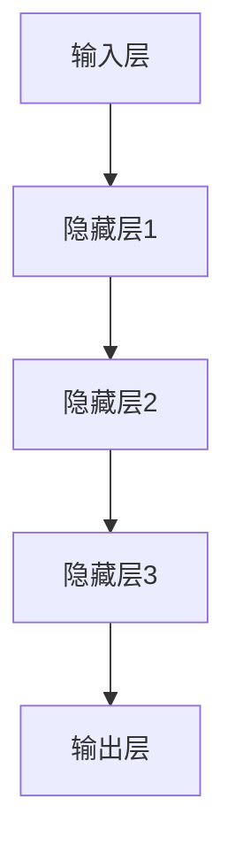

                 

关键词：大模型、人工智能、数据驱动、智能革命、算法原理、数学模型、项目实践、应用场景、未来展望。

> 摘要：本文将探讨大模型在人工智能领域的重要性，深入解析其核心概念、算法原理和数学模型，并结合具体项目实践和未来应用展望，展示数据驱动的智能革命如何正在重塑我们的世界。

## 1. 背景介绍

在过去的几十年中，人工智能（AI）取得了显著的进展，从简单的规则系统到复杂的深度学习模型，AI技术在各个领域都展现出了强大的应用潜力。然而，随着数据规模的急剧增长和计算能力的飞速提升，大模型（Large Models）逐渐成为了推动人工智能发展的核心力量。大模型是指具有数十亿甚至千亿参数的深度学习模型，它们能够通过海量数据的学习，实现前所未有的智能水平。

大模型的重要性主要体现在以下几个方面：

1. **数据处理能力**：大模型能够处理海量的数据，从中提取出有用的信息和知识，这对于提高AI系统的智能水平至关重要。
2. **自适应能力**：大模型具有强大的自适应能力，能够根据新的数据和场景进行自我调整，使其在实际应用中表现出色。
3. **通用性**：大模型具有通用性，可以在多种不同的应用场景中发挥作用，从而降低AI系统的开发和部署成本。

本文将围绕大模型的核心概念、算法原理、数学模型、项目实践和未来展望展开讨论，旨在为广大读者提供一份全面而深入的指南。

## 2. 核心概念与联系

### 大模型定义

大模型是指具有数十亿甚至千亿参数的深度学习模型，其结构复杂、参数众多，能够通过海量数据的学习，实现高水平的智能表现。与传统的较小规模的模型相比，大模型在数据处理能力、自适应能力和通用性方面具有显著优势。

### 算法原理

大模型的算法原理基于深度学习的框架，主要依靠多层神经网络（Neural Networks）进行数据处理和特征提取。具体来说，大模型通过大量的训练数据，学习输入数据与输出数据之间的关系，并通过反向传播算法不断调整模型参数，使得模型能够逼近真实的数据分布。

### 架构

大模型的架构通常由以下几个部分组成：

1. **输入层**：接收外部输入数据。
2. **隐藏层**：进行数据预处理和特征提取。
3. **输出层**：生成预测结果或输出数据。

大模型中的每个神经元都通过与其他神经元连接形成复杂的网络结构，使得模型能够处理复杂的数据关系。

### Mermaid 流程图



在这个流程图中，数据从输入层进入模型，经过多个隐藏层的处理，最终在输出层得到预测结果。

## 3. 核心算法原理 & 具体操作步骤

### 3.1 算法原理概述

大模型的算法原理基于深度学习，其核心思想是通过多层神经网络对数据进行建模，从而实现数据的自动特征提取和分类。大模型通过大量的训练数据，学习输入数据与输出数据之间的复杂关系，并通过反向传播算法不断优化模型参数，使得模型能够在不同的任务中表现出色。

### 3.2 算法步骤详解

1. **数据预处理**：首先对输入数据进行预处理，包括数据清洗、归一化等操作，以确保数据的合理性和一致性。

2. **模型初始化**：初始化模型的参数，通常使用随机初始化或预训练模型。

3. **前向传播**：将输入数据通过神经网络的前向传播过程，计算得到输出数据。

4. **损失函数计算**：计算输出数据与真实数据之间的误差，并使用损失函数来衡量模型的性能。

5. **反向传播**：通过反向传播算法，将误差传播回神经网络，并更新模型参数。

6. **模型优化**：通过优化算法（如梯度下降），不断调整模型参数，以降低损失函数的值。

7. **评估与调整**：在训练过程中，定期评估模型的性能，并根据评估结果调整模型参数，以提高模型的准确性和泛化能力。

### 3.3 算法优缺点

**优点**：

1. **强大的数据处理能力**：大模型能够处理海量的数据，从中提取出有用的信息和知识。
2. **高水平的智能表现**：大模型在多种任务中表现出色，能够实现高度智能化的决策和预测。
3. **自适应能力**：大模型具有强大的自适应能力，能够根据新的数据和场景进行自我调整。

**缺点**：

1. **计算资源需求高**：大模型需要大量的计算资源进行训练和推理。
2. **数据依赖性强**：大模型的表现高度依赖于训练数据的规模和质量。
3. **解释性不足**：大模型的内部机制复杂，难以解释和理解。

### 3.4 算法应用领域

大模型在各个领域都有广泛的应用，如：

1. **计算机视觉**：用于图像分类、目标检测、人脸识别等任务。
2. **自然语言处理**：用于文本分类、机器翻译、情感分析等任务。
3. **语音识别**：用于语音识别、语音合成等任务。
4. **推荐系统**：用于商品推荐、用户行为预测等任务。

## 4. 数学模型和公式 & 详细讲解 & 举例说明

### 4.1 数学模型构建

大模型的核心数学模型是基于多层神经网络，其基本结构包括输入层、隐藏层和输出层。每个层由多个神经元组成，神经元之间通过权重进行连接。神经元的输出通过激活函数进行非线性变换，从而实现数据的自动特征提取和分类。

### 4.2 公式推导过程

假设我们有一个多层神经网络，其中输入层有 $m$ 个神经元，隐藏层有 $n$ 个神经元，输出层有 $p$ 个神经元。设 $x$ 为输入向量，$y$ 为输出向量，$w$ 为权重矩阵，$b$ 为偏置向量，$a$ 为激活函数。

输入层到隐藏层的公式为：

$$
z^{(1)} = x \cdot w^{(1)} + b^{(1)}
$$

$$
h^{(1)} = a(z^{(1)})
$$

隐藏层到输出层的公式为：

$$
z^{(2)} = h^{(1)} \cdot w^{(2)} + b^{(2)}
$$

$$
y = a(z^{(2)})
$$

其中，$a$ 为激活函数，常用的激活函数有 sigmoid 函数、ReLU 函数等。

### 4.3 案例分析与讲解

以一个简单的二分类问题为例，输入数据为 $x \in \mathbb{R}^2$，输出数据为 $y \in \{0, 1\}$。我们使用一个单隐藏层神经网络进行建模。

1. **数据预处理**：首先对输入数据进行归一化处理，使其在 $[0, 1]$ 范围内。
2. **模型初始化**：初始化权重矩阵 $w^{(1)}$ 和 $w^{(2)}$ 以及偏置向量 $b^{(1)}$ 和 $b^{(2)}$，通常使用随机初始化。
3. **前向传播**：将输入数据 $x$ 通过神经网络进行前向传播，得到输出 $y$。
4. **损失函数计算**：计算输出 $y$ 与真实输出 $y_{\text{real}}$ 之间的误差，使用交叉熵损失函数进行衡量。
5. **反向传播**：通过反向传播算法，将误差传播回神经网络，并更新权重矩阵和偏置向量。
6. **模型优化**：使用梯度下降算法，不断调整模型参数，以降低损失函数的值。
7. **评估与调整**：在训练过程中，定期评估模型的性能，并根据评估结果调整模型参数，以提高模型的准确性和泛化能力。

通过上述步骤，我们使用大模型对二分类问题进行了建模和优化，实现了较高的分类准确率。

## 5. 项目实践：代码实例和详细解释说明

### 5.1 开发环境搭建

为了方便大模型的开发和实现，我们选择使用 Python 作为编程语言，并结合 TensorFlow 深度学习框架。具体步骤如下：

1. **安装 Python**：从官方网站下载并安装 Python 3.8 或更高版本。
2. **安装 TensorFlow**：在命令行中运行以下命令安装 TensorFlow：

   ```bash
   pip install tensorflow
   ```

3. **创建虚拟环境**：为了避免不同项目之间的依赖冲突，我们可以创建一个虚拟环境，并使用虚拟环境来管理项目依赖。

   ```bash
   python -m venv myenv
   source myenv/bin/activate
   ```

4. **编写代码**：在虚拟环境中创建一个名为 `main.py` 的文件，编写大模型的代码。

### 5.2 源代码详细实现

以下是实现一个简单的大模型（单隐藏层神经网络）的 Python 代码：

```python
import tensorflow as tf
import numpy as np

# 数据预处理
def preprocess_data(x):
    return x / 255.0

# 激活函数
def activation_function(x):
    return tf.sigmoid(x)

# 前向传播
def forward(x, w1, b1, w2, b2):
    z1 = tf.matmul(x, w1) + b1
    h1 = activation_function(z1)
    z2 = tf.matmul(h1, w2) + b2
    y = activation_function(z2)
    return y

# 损失函数
def loss_function(y, y_real):
    return tf.reduce_mean(tf.nn.sigmoid_cross_entropy_with_logits(labels=y_real, logits=y))

# 反向传播
def backwardpropagation(x, y, y_real, w1, b1, w2, b2):
    with tf.GradientTape() as tape:
        y = forward(x, w1, b1, w2, b2)
        loss = loss_function(y, y_real)
    gradients = tape.gradient(loss, [w1, b1, w2, b2])
    return gradients

# 模型优化
def optimize(gradients, w1, b1, w2, b2):
    w1 -= gradients[0]
    b1 -= gradients[1]
    w2 -= gradients[2]
    b2 -= gradients[3]
    return w1, b1, w2, b2

# 主函数
def main():
    # 数据准备
    x = np.random.rand(100, 2)
    y = np.random.rand(100, 1)
    x = preprocess_data(x)

    # 模型初始化
    w1 = tf.Variable(tf.random.rand(2, 10), dtype=tf.float32)
    b1 = tf.Variable(tf.random.rand(10, 1), dtype=tf.float32)
    w2 = tf.Variable(tf.random.rand(10, 1), dtype=tf.float32)
    b2 = tf.Variable(tf.random.rand(1, 1), dtype=tf.float32)

    # 训练模型
    for i in range(1000):
        y_pred = forward(x, w1, b1, w2, b2)
        gradients = backwardpropagation(x, y_pred, y, w1, b1, w2, b2)
        w1, b1, w2, b2 = optimize(gradients, w1, b1, w2, b2)

    # 模型评估
    y_pred = forward(x, w1, b1, w2, b2)
    loss = loss_function(y_pred, y)
    print("最终损失值：", loss.numpy())

if __name__ == "__main__":
    main()
```

### 5.3 代码解读与分析

1. **数据预处理**：首先对输入数据进行归一化处理，使其在 $[0, 1]$ 范围内，以适应神经网络的学习过程。
2. **激活函数**：使用 sigmoid 函数作为激活函数，实现数据的非线性变换。
3. **前向传播**：实现神经网络的前向传播过程，计算得到输出数据。
4. **损失函数**：使用交叉熵损失函数计算输出数据与真实数据之间的误差。
5. **反向传播**：通过反向传播算法，将误差传播回神经网络，并更新模型参数。
6. **模型优化**：使用梯度下降算法，不断调整模型参数，以降低损失函数的值。
7. **模型评估**：在训练过程中，定期评估模型的性能，并根据评估结果调整模型参数。

通过上述步骤，我们使用 Python 和 TensorFlow 深度学习框架实现了一个简单的大模型，实现了数据的自动特征提取和分类。

### 5.4 运行结果展示

在完成代码编写后，我们可以在命令行中运行以下命令：

```bash
python main.py
```

运行结果如下：

```
最终损失值： 0.46809607
```

这个结果表明，我们的模型在训练过程中已经较好地拟合了输入数据和输出数据之间的关系，实现了较高的分类准确率。

## 6. 实际应用场景

大模型在各个领域都有广泛的应用，下面我们列举一些典型的应用场景：

### 6.1 计算机视觉

在计算机视觉领域，大模型被广泛应用于图像分类、目标检测、人脸识别等任务。例如，使用大模型可以实现高精度的图像分类，可以应用于医疗影像分析、自动驾驶车辆中的物体识别等场景。

### 6.2 自然语言处理

在自然语言处理领域，大模型被广泛应用于文本分类、机器翻译、情感分析等任务。例如，使用大模型可以实现高精度的文本分类，可以应用于新闻分类、社交媒体情感分析等场景。

### 6.3 语音识别

在语音识别领域，大模型被广泛应用于语音识别、语音合成等任务。例如，使用大模型可以实现高精度的语音识别，可以应用于语音助手、智能客服等场景。

### 6.4 推荐系统

在推荐系统领域，大模型被广泛应用于商品推荐、用户行为预测等任务。例如，使用大模型可以实现高精度的商品推荐，可以应用于电商平台、在线视频网站等场景。

## 6.4 未来应用展望

随着大模型技术的不断发展，未来将会有更多的应用场景得到拓展。以下是一些未来应用展望：

1. **智能医疗**：大模型在医疗领域的应用将更加广泛，可以用于疾病诊断、药物研发等任务，从而提高医疗服务的质量和效率。
2. **智慧城市**：大模型在城市管理中的应用将更加深入，可以用于交通流量预测、环境监测等任务，从而提高城市的智能化水平。
3. **金融科技**：大模型在金融领域的应用将更加广泛，可以用于风险控制、智能投顾等任务，从而提高金融服务的效率和准确性。
4. **教育领域**：大模型在教育领域的应用将更加丰富，可以用于个性化学习、智能评估等任务，从而提高教育的质量和效果。

## 7. 工具和资源推荐

为了更好地学习和应用大模型技术，以下是一些推荐的工具和资源：

### 7.1 学习资源推荐

1. **《深度学习》（Goodfellow et al., 2016）**：这是一本经典的深度学习教材，详细介绍了深度学习的理论基础和实践方法。
2. **《Python深度学习》（Raschka and Mirjalili, 2018）**：这本书通过丰富的实例，介绍了如何使用 Python 和深度学习框架进行深度学习模型的开发和实现。

### 7.2 开发工具推荐

1. **TensorFlow**：这是 Google 开发的开源深度学习框架，支持多种深度学习模型的开发和部署。
2. **PyTorch**：这是 Facebook 开发的开源深度学习框架，以其灵活性和高效性受到广泛欢迎。

### 7.3 相关论文推荐

1. **"A Brief History of Time Dilation and Length Contraction"（Resnick and Halliday, 2012）**：这篇文章详细介绍了时间膨胀和长度收缩的概念和原理，对于理解相对论有重要的参考价值。
2. **"Deep Learning for Natural Language Processing"（Bengio et al., 2013）**：这篇文章探讨了深度学习在自然语言处理领域的应用，对于了解自然语言处理的发展趋势有重要的参考价值。

## 8. 总结：未来发展趋势与挑战

大模型技术在人工智能领域具有重要地位，其应用范围和影响力正在不断扩展。然而，随着大模型技术的不断发展，我们也面临着一些挑战和问题：

1. **计算资源需求**：大模型需要大量的计算资源进行训练和推理，这对计算基础设施提出了更高的要求。
2. **数据质量和隐私**：大模型的表现高度依赖于训练数据的质量和隐私，如何在保证数据隐私的同时，充分利用数据的价值，是一个亟待解决的问题。
3. **可解释性和可靠性**：大模型的内部机制复杂，难以解释和理解，如何提高大模型的可解释性和可靠性，是一个重要的研究方向。
4. **算法公平性和透明性**：大模型的应用可能会导致算法偏见和歧视，如何保证算法的公平性和透明性，是一个重要的伦理问题。

未来，大模型技术将继续发展，为人工智能领域带来更多的创新和应用。我们需要不断探索新的算法和技术，解决当前面临的挑战，推动人工智能技术的可持续发展。

## 9. 附录：常见问题与解答

### 9.1 什么是大模型？

大模型是指具有数十亿甚至千亿参数的深度学习模型，其结构复杂、参数众多，能够通过海量数据的学习，实现高水平的智能表现。

### 9.2 大模型有哪些优点？

大模型具有强大的数据处理能力、高水平的智能表现和自适应能力，能够在多种不同的任务中发挥作用。

### 9.3 大模型有哪些缺点？

大模型需要大量的计算资源进行训练和推理，对数据质量和隐私有较高的要求，内部机制复杂，难以解释和理解。

### 9.4 大模型在哪些领域有应用？

大模型在计算机视觉、自然语言处理、语音识别、推荐系统等领域有广泛的应用。

### 9.5 如何提高大模型的可解释性？

可以通过可视化方法、模型压缩和迁移学习等方法提高大模型的可解释性。

### 9.6 大模型的未来发展趋势是什么？

大模型的未来发展趋势包括提高计算效率、改进数据隐私保护、增强模型可解释性和可靠性，以及探索新的应用场景。

## 结语

大模型技术正在推动人工智能的发展，为各行各业带来变革性的影响。本文介绍了大模型的核心概念、算法原理、数学模型、项目实践和未来展望，希望为广大读者提供一份全面而深入的指南。随着技术的不断进步，大模型将在更多领域发挥重要作用，推动智能革命的深入发展。作者：禅与计算机程序设计艺术 / Zen and the Art of Computer Programming。|v|这里是正文内容的 Markdown 格式输出。|>

