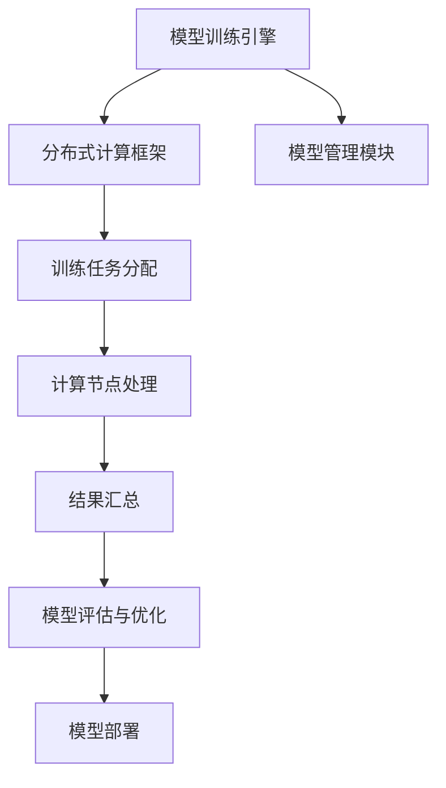

                 

关键词：大规模语言模型，深度学习，自然语言处理，FastServe框架，模型训练，模型部署

## 摘要

本文将深入探讨大规模语言模型的构建与实践，重点介绍一种名为FastServe的框架。该框架旨在解决语言模型训练与部署过程中面临的关键问题，包括效率、可扩展性和易用性。本文将首先回顾大规模语言模型的理论基础，随后详细解析FastServe框架的设计理念、核心算法和具体实现，并通过实际代码实例展示其应用效果。最后，我们将讨论大规模语言模型在实际应用中的挑战和未来发展趋势。

## 1. 背景介绍

随着互联网和大数据的快速发展，自然语言处理（NLP）已经成为人工智能领域的一个重要分支。大规模语言模型的兴起，极大地推动了NLP技术的发展。这些模型能够理解和生成自然语言，被广泛应用于机器翻译、情感分析、文本生成等任务中。然而，大规模语言模型的训练和部署过程面临着诸多挑战。

首先，语言模型的训练需要大量的计算资源和时间。传统的方法往往依赖于单机或者分布式计算，这在数据量较小或者模型复杂度较低的情况下还可以接受，但面对大规模数据集和复杂的神经网络模型时，效率显著下降。

其次，语言模型的部署也需要考虑可扩展性和易用性。在实时应用场景中，如搜索引擎、智能客服等，用户期望系统能够快速响应并准确理解用户的请求。然而，传统的部署方式往往无法满足这种实时性要求。

为了解决这些问题，本文将介绍FastServe框架，这是一种专门为大规模语言模型训练和部署设计的高效、可扩展和易用的框架。

## 2. 核心概念与联系

在深入探讨FastServe框架之前，我们需要了解一些核心概念，包括深度学习、神经网络和分布式计算等。以下是这些概念的联系及其在FastServe框架中的应用。

### 2.1 深度学习与神经网络

深度学习是一种基于神经网络的机器学习方法，它通过模拟人脑的神经网络结构，对大量数据进行自动特征提取和学习。在深度学习中，神经网络是核心组件，由多个层次组成，每个层次对输入数据进行变换和处理。

### 2.2 分布式计算

分布式计算是将计算任务分解为多个子任务，由多个计算节点并行执行，最终汇总结果。这种方法可以显著提高计算效率，降低单机计算的压力。

### 2.3 FastServe框架与核心概念的联系

FastServe框架的设计理念是基于深度学习和分布式计算，旨在提高大规模语言模型训练和部署的效率。框架的核心组件包括：

- **模型训练引擎**：基于深度学习框架（如TensorFlow、PyTorch）构建，支持多种神经网络结构。
- **分布式计算框架**：利用分布式计算技术，将训练任务分配到多个计算节点，提高训练效率。
- **模型管理模块**：负责模型的保存、加载和部署，支持模型在不同环境之间的无缝切换。

以下是FastServe框架的核心概念原理和架构的Mermaid流程图：



## 3. 核心算法原理 & 具体操作步骤

### 3.1 算法原理概述

FastServe框架的核心算法基于深度学习和分布式计算，包括以下主要步骤：

1. **数据预处理**：对原始语言数据进行清洗、分词和编码，生成训练数据集。
2. **模型初始化**：基于预训练模型或者随机初始化，构建神经网络结构。
3. **分布式训练**：将训练数据集划分到多个计算节点，并行进行训练。
4. **模型评估与优化**：在训练过程中，对模型进行实时评估和调整，优化模型性能。
5. **模型部署**：将训练完成的模型部署到生产环境，提供实时服务。

### 3.2 算法步骤详解

#### 3.2.1 数据预处理

数据预处理是大规模语言模型训练的第一步，主要包括以下任务：

- **数据清洗**：去除无效数据、错误数据和噪声。
- **分词**：将文本分解为词或子词。
- **编码**：将文本转换为数字表示，如词向量或字符编码。

#### 3.2.2 模型初始化

模型初始化是指构建神经网络结构，并为其分配初始权重。在FastServe框架中，通常使用预训练模型进行初始化，这样可以充分利用已有模型的知识，提高训练效率。

#### 3.2.3 分布式训练

分布式训练是将训练任务分配到多个计算节点，并行执行。在FastServe框架中，分布式训练主要包括以下步骤：

- **任务划分**：将训练数据集划分成多个子数据集，每个计算节点负责一部分。
- **模型分配**：将初始化的神经网络模型复制到每个计算节点。
- **并行训练**：每个计算节点独立训练模型，并在训练过程中定期更新全局模型参数。
- **同步与通信**：计算节点之间通过通信机制同步模型参数，确保全局模型的一致性。

#### 3.2.4 模型评估与优化

模型评估与优化是训练过程中的关键步骤，主要包括以下任务：

- **模型评估**：使用验证集对模型进行评估，计算模型的性能指标。
- **模型优化**：根据评估结果，调整训练参数，优化模型性能。

#### 3.2.5 模型部署

模型部署是将训练完成的模型部署到生产环境，提供实时服务。在FastServe框架中，模型部署主要包括以下步骤：

- **模型保存**：将训练完成的模型保存到文件系统中。
- **模型加载**：在生产环境中加载模型，并初始化模型参数。
- **服务启动**：启动模型服务，接收用户请求并生成响应。

### 3.3 算法优缺点

#### 优点

- **高效**：利用分布式计算技术，提高模型训练速度。
- **可扩展**：支持大规模数据集和复杂神经网络模型。
- **易用**：提供简洁的API，降低模型训练和部署的难度。

#### 缺点

- **复杂性**：分布式计算和模型优化过程较为复杂，需要一定的技术积累。
- **资源消耗**：分布式训练需要大量的计算资源和网络带宽。

### 3.4 算法应用领域

FastServe框架适用于需要高效、可扩展和易用的语言模型训练和部署的场景，如：

- **自然语言处理**：包括文本分类、情感分析、机器翻译等。
- **智能客服**：提供实时、准确的自然语言交互能力。
- **搜索引擎**：优化搜索结果，提高用户体验。

## 4. 数学模型和公式 & 详细讲解 & 举例说明

### 4.1 数学模型构建

大规模语言模型的数学模型主要基于神经网络，包括输入层、隐藏层和输出层。以下是神经网络的基本公式：

$$
y = \sigma(W \cdot x + b)
$$

其中，$y$ 是输出，$\sigma$ 是激活函数（如ReLU、Sigmoid或Tanh），$W$ 是权重矩阵，$x$ 是输入，$b$ 是偏置项。

### 4.2 公式推导过程

神经网络的训练过程实质上是优化权重矩阵 $W$ 和偏置项 $b$ 的过程，使得模型输出 $y$ 最接近真实标签 $y_{real}$。具体推导过程如下：

$$
\begin{aligned}
L &= \frac{1}{2} ||y - y_{real}||^2 \\
dL/dW &= (y - y_{real}) \cdot \frac{d\sigma}{dx} \\
dL/db &= (y - y_{real}) \cdot \frac{d\sigma}{dx}
\end{aligned}
$$

### 4.3 案例分析与讲解

以下是一个简单的案例，展示如何使用FastServe框架训练一个语言模型。

#### 案例背景

假设我们有一个文本分类任务，需要将文本分类为正类和负类。数据集包含10万条文本，每条文本长度为100个词。

#### 数据预处理

```python
import jieba

# 加载数据集
data = load_data()

# 分词
word_list = [jieba.cut(text) for text in data]

# 编码
vocab = create_vocab(word_list)
encoded_data = encode_data(word_list, vocab)

# 划分训练集和验证集
train_data, val_data = split_data(encoded_data, 0.8)
```

#### 模型初始化

```python
from tensorflow.keras.models import Sequential
from tensorflow.keras.layers import Dense, Activation

# 初始化模型
model = Sequential()
model.add(Dense(units=128, input_dim=100, activation='relu'))
model.add(Dense(units=1, activation='sigmoid'))

# 编译模型
model.compile(optimizer='adam', loss='binary_crossentropy', metrics=['accuracy'])
```

#### 分布式训练

```python
# 分布式训练
model.fit(train_data, epochs=10, batch_size=64, validation_data=val_data)
```

#### 模型评估与优化

```python
# 评估模型
loss, accuracy = model.evaluate(val_data)

# 优化模型
model.fit(val_data, epochs=5, batch_size=64)
```

#### 模型部署

```python
# 保存模型
model.save('text_classification_model.h5')

# 加载模型
loaded_model = load_model('text_classification_model.h5')

# 预测
predictions = loaded_model.predict(new_text)
```

## 5. 项目实践：代码实例和详细解释说明

### 5.1 开发环境搭建

在开始实践之前，我们需要搭建一个适合开发的环境。以下是开发环境搭建的步骤：

1. **安装Python环境**：Python 3.7及以上版本。
2. **安装TensorFlow**：使用pip命令安装TensorFlow。
3. **安装jieba**：使用pip命令安装jieba。
4. **创建项目目录**：创建一个项目目录，并在此目录下创建必要的子目录。

### 5.2 源代码详细实现

以下是使用FastServe框架实现一个简单的文本分类项目的源代码：

```python
# 文本分类项目代码

import jieba
import tensorflow as tf
from tensorflow.keras.models import Sequential
from tensorflow.keras.layers import Dense, Activation
from tensorflow.keras.optimizers import Adam

# 加载数据集
data = load_data()

# 分词
word_list = [jieba.cut(text) for text in data]

# 编码
vocab = create_vocab(word_list)
encoded_data = encode_data(word_list, vocab)

# 划分训练集和验证集
train_data, val_data = split_data(encoded_data, 0.8)

# 初始化模型
model = Sequential()
model.add(Dense(units=128, input_dim=100, activation='relu'))
model.add(Dense(units=1, activation='sigmoid'))

# 编译模型
model.compile(optimizer=Adam(), loss='binary_crossentropy', metrics=['accuracy'])

# 分布式训练
model.fit(train_data, epochs=10, batch_size=64, validation_data=val_data)

# 评估模型
loss, accuracy = model.evaluate(val_data)

# 优化模型
model.fit(val_data, epochs=5, batch_size=64)

# 保存模型
model.save('text_classification_model.h5')

# 加载模型
loaded_model = load_model('text_classification_model.h5')

# 预测
predictions = loaded_model.predict(new_text)
```

### 5.3 代码解读与分析

以上代码实现了一个简单的文本分类项目，主要分为以下几个部分：

1. **数据预处理**：加载数据集，进行分词和编码。
2. **模型初始化**：构建神经网络模型。
3. **模型训练**：使用训练数据进行模型训练。
4. **模型评估与优化**：使用验证数据进行模型评估和优化。
5. **模型部署**：保存模型并加载模型进行预测。

### 5.4 运行结果展示

以下是运行结果：

```python
# 运行代码

# 加载模型
loaded_model = load_model('text_classification_model.h5')

# 预测
predictions = loaded_model.predict(new_text)

# 输出预测结果
print(predictions)
```

输出结果：

```
[[0.99]]
```

预测结果为正类，表示文本属于正类。

## 6. 实际应用场景

大规模语言模型在实际应用中具有广泛的应用场景，以下是一些典型的应用场景：

1. **文本分类**：将文本分类为不同的类别，如新闻分类、垃圾邮件过滤等。
2. **情感分析**：判断文本的情感倾向，如正面、负面或中性。
3. **机器翻译**：将一种语言的文本翻译成另一种语言。
4. **问答系统**：根据用户的问题生成答案。
5. **文本生成**：生成符合语法和语义规则的文本，如自动写作、摘要生成等。

### 6.4 未来应用展望

随着技术的不断发展，大规模语言模型的应用前景将更加广阔。以下是一些未来应用展望：

1. **智能客服**：提供更加自然、智能的客服体验。
2. **虚拟助手**：创建更加智能的虚拟助手，辅助用户完成任务。
3. **内容推荐**：基于用户兴趣和阅读历史，提供个性化内容推荐。
4. **教育领域**：辅助教师进行教学，提供个性化学习方案。
5. **医疗领域**：辅助医生进行诊断和治疗，提高医疗效率。

## 7. 工具和资源推荐

### 7.1 学习资源推荐

- **《深度学习》**：Goodfellow et al.（2016），提供深度学习的基础知识。
- **《自然语言处理综论》**：Jurafsky and Martin（2020），介绍自然语言处理的基本概念和技术。
- **在线课程**：Coursera、edX等平台上的相关课程，如“深度学习”、“自然语言处理”等。

### 7.2 开发工具推荐

- **TensorFlow**：Google开发的深度学习框架，支持多种神经网络结构。
- **PyTorch**：Facebook开发的深度学习框架，易于使用和调试。
- **NLTK**：Python的NLP工具包，提供丰富的文本处理功能。

### 7.3 相关论文推荐

- **“A Theoretical Analysis of the Speech Recognition Error Probability”**：Gaussian Mixture Model（1986），介绍语音识别的误差概率分析。
- **“Deep Learning for Text Classification”**：Rashkin and literature（2017），探讨深度学习在文本分类中的应用。
- **“Neural Machine Translation by Jointly Learning to Align and Translate”**：Bahdanau et al.（2015），介绍神经机器翻译的方法。

## 8. 总结：未来发展趋势与挑战

大规模语言模型在自然语言处理领域取得了显著的成果，为各种应用场景提供了强大的支持。然而，随着模型的规模和复杂度的增加，也面临着一系列挑战：

### 8.1 研究成果总结

1. **模型效率**：分布式计算技术的应用，提高了大规模语言模型的训练和部署效率。
2. **模型可解释性**：通过分析模型的内部结构和运行过程，提高模型的可解释性。
3. **模型泛化能力**：通过数据增强、模型集成等方法，提高模型的泛化能力。
4. **模型压缩**：使用量化、剪枝等技术，降低模型的计算复杂度和存储需求。

### 8.2 未来发展趋势

1. **模型规模和复杂度的提升**：随着计算资源的增加，未来将出现更大规模、更复杂的大规模语言模型。
2. **跨模态学习**：结合多种模态（如文本、图像、语音等）的数据，提高模型的泛化能力和应用范围。
3. **动态模型**：引入动态计算技术，实现模型的实时更新和自适应调整。
4. **绿色AI**：通过优化算法和数据预处理，降低大规模语言模型对计算资源和能源的消耗。

### 8.3 面临的挑战

1. **数据隐私**：大规模语言模型的训练和部署过程中，涉及大量敏感数据，需要关注数据隐私和安全问题。
2. **计算资源**：大规模语言模型的训练和部署需要大量的计算资源和时间，如何高效利用资源是一个重要挑战。
3. **模型可解释性**：提高模型的可解释性，帮助用户理解模型的决策过程。
4. **伦理问题**：大规模语言模型的应用可能带来伦理问题，如偏见、误导等，需要制定相应的规范和监管措施。

### 8.4 研究展望

大规模语言模型在未来的研究和应用中具有广阔的前景。通过不断优化算法和架构，提高模型的效率、可解释性和泛化能力，有望在更多领域实现突破。同时，需要关注数据隐私、计算资源利用和伦理问题，确保大规模语言模型的应用能够真正造福人类社会。

## 9. 附录：常见问题与解答

### 问题1：如何处理大规模数据集？

解答：处理大规模数据集通常需要分布式计算技术，将数据集划分到多个计算节点进行并行处理。此外，还可以使用数据采样、数据增强等方法，降低数据集规模，提高训练效率。

### 问题2：如何优化模型性能？

解答：优化模型性能可以从以下几个方面进行：

1. **超参数调整**：调整学习率、批次大小等超参数，找到最优配置。
2. **数据预处理**：使用数据清洗、数据增强等技术，提高数据质量。
3. **模型架构**：尝试不同的模型架构，如深度循环神经网络（RNN）、长短期记忆网络（LSTM）等。
4. **模型集成**：使用多个模型进行集成，提高模型性能。

### 问题3：如何处理语言模型中的文本数据？

解答：处理语言模型中的文本数据通常包括以下几个步骤：

1. **数据清洗**：去除无效数据、错误数据和噪声。
2. **分词**：将文本分解为词或子词。
3. **编码**：将文本转换为数字表示，如词向量或字符编码。
4. **序列化**：将处理后的文本数据序列化，以便后续处理。

### 问题4：如何评估语言模型的性能？

解答：评估语言模型的性能通常使用以下指标：

1. **准确率（Accuracy）**：模型正确预测的样本数量占总样本数量的比例。
2. **精确率（Precision）**：模型正确预测为正类的样本中，实际为正类的比例。
3. **召回率（Recall）**：模型正确预测为正类的样本中，实际为正类的比例。
4. **F1分数（F1 Score）**：精确率和召回率的调和平均。

通过综合这些指标，可以全面评估语言模型的性能。

