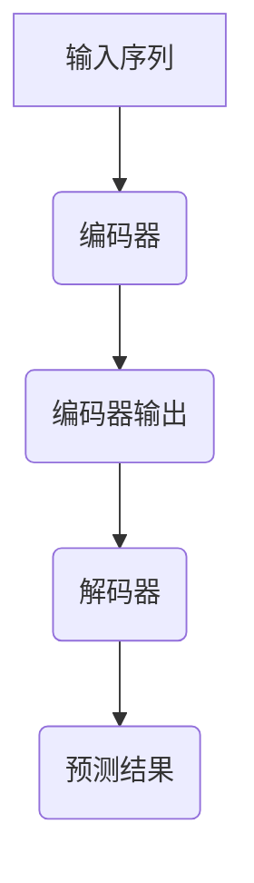

                 

关键词：大规模语言模型，评估实践，语言模型原理，应用场景，数学模型，代码实例

摘要：本文旨在深入探讨大规模语言模型的理论基础、实践应用和评估方法。通过对语言模型的原理分析，数学模型的构建，以及实际代码实例的展示，本文为读者提供了一个全面理解大规模语言模型的机会。同时，本文也对大规模语言模型在不同领域中的应用进行了展望，并提出了未来研究和实践中的挑战。

## 1. 背景介绍

随着互联网的普及和信息爆炸，大规模数据处理和分析变得日益重要。特别是在自然语言处理（NLP）领域，人们对于能够理解和生成人类语言的计算机系统的需求日益增加。大规模语言模型（Large-scale Language Models）正是在这样的背景下应运而生。

### 1.1 语言模型的发展

语言模型是一种能够预测下一个单词或字符的概率分布的算法。传统的语言模型主要依赖于统计方法和规则系统，如n元语法模型。然而，随着深度学习技术的发展，基于神经网络的深度语言模型逐渐取代了传统模型，成为现代NLP系统的核心组件。

### 1.2 大规模语言模型的重要性

大规模语言模型在多个领域具有广泛的应用，包括机器翻译、文本分类、问答系统、语音识别等。它们能够处理复杂的语言现象，提供更加准确和自然的语言生成能力。此外，大规模语言模型还能够辅助人类完成大量的文本数据预处理工作，提高数据处理效率和准确性。

## 2. 核心概念与联系

### 2.1 语言模型基本概念

语言模型的核心任务是预测下一个单词或字符的概率分布。这通常通过构建一个概率模型来实现，该模型能够根据前文信息预测后续内容。常见的语言模型包括：

- **n元语法模型**：基于历史文本的统计模型，通过计数前n个单词的出现频率来预测下一个单词。
- **循环神经网络（RNN）**：一种能够处理序列数据的神经网络，能够通过记忆机制保持对前文信息的依赖。
- **变换器（Transformer）**：基于自注意力机制的深度学习模型，广泛应用于现代NLP任务，具有处理长距离依赖的能力。

### 2.2 大规模语言模型架构

大规模语言模型通常采用多层神经网络结构，通过训练大量的文本数据来优化模型参数。以下是大规模语言模型的基本架构：

- **编码器（Encoder）**：将输入序列编码为固定长度的向量表示。
- **解码器（Decoder）**：从编码器的输出中预测下一个单词或字符。
- **注意力机制**：在编码器和解码器之间引入注意力机制，以允许模型关注输入序列的不同部分。

### 2.3 Mermaid 流程图

以下是一个简化的大规模语言模型架构的 Mermaid 流程图：



## 3. 核心算法原理 & 具体操作步骤

### 3.1 算法原理概述

大规模语言模型通常基于深度学习技术，其核心原理包括：

- **自注意力机制（Self-Attention）**：通过计算输入序列中每个元素之间的相似度，为每个元素分配不同的权重，从而捕捉长距离依赖关系。
- **位置编码（Positional Encoding）**：为输入序列中的每个单词或字符添加位置信息，使模型能够理解单词或字符在序列中的顺序。
- **多层神经网络（Multi-layer Neural Network）**：通过堆叠多层神经网络，增加模型的复杂度，提高模型的泛化能力。

### 3.2 算法步骤详解

大规模语言模型的训练过程通常包括以下步骤：

1. **数据预处理**：将原始文本数据转换为单词或字符的序列，并进行词向量表示。
2. **编码器训练**：通过反向传播算法，优化编码器参数，使其能够将输入序列编码为固定长度的向量表示。
3. **解码器训练**：通过目标序列作为输入，训练解码器预测下一个单词或字符。
4. **注意力机制训练**：通过调整注意力权重，优化编码器和解码器之间的交互。
5. **位置编码训练**：为每个单词或字符添加位置编码，以提高模型对顺序信息的理解。

### 3.3 算法优缺点

大规模语言模型具有以下优点：

- **强大的表达能力**：通过自注意力机制和多层神经网络，能够处理复杂的语言现象。
- **良好的泛化能力**：通过大规模数据训练，模型能够在不同任务中表现出良好的性能。

然而，大规模语言模型也存在一些缺点：

- **训练时间较长**：由于模型参数众多，训练过程需要大量的计算资源。
- **计算成本高**：大规模语言模型在训练和推理过程中需要大量的计算资源。

### 3.4 算法应用领域

大规模语言模型在多个领域具有广泛的应用，包括：

- **文本分类**：通过训练大规模语言模型，可以自动对文本进行分类，应用于舆情分析、新闻推荐等场景。
- **机器翻译**：大规模语言模型能够实现高质量的机器翻译，广泛应用于跨语言信息交流。
- **问答系统**：通过训练大规模语言模型，可以构建智能问答系统，提供高质量的问答服务。

## 4. 数学模型和公式

### 4.1 数学模型构建

大规模语言模型通常采用自注意力机制（Self-Attention）来处理输入序列。自注意力机制的数学模型可以表示为：

$$
\text{Attention}(Q, K, V) = \frac{softmax(\text{scores})} { \sqrt{d_k}}
$$

其中，$Q$、$K$、$V$ 分别代表查询（Query）、键（Key）和值（Value）向量，$\text{scores}$ 表示查询和键之间的相似度。

### 4.2 公式推导过程

自注意力机制的推导过程可以分为以下几个步骤：

1. **计算相似度**：通过点积计算查询和键之间的相似度，得到相似度矩阵。
2. **加权求和**：根据相似度矩阵，对值向量进行加权求和，得到注意力加权的结果。
3. **归一化**：通过softmax函数对注意力权重进行归一化，确保权重之和为1。

### 4.3 案例分析与讲解

以下是一个简单的自注意力机制的案例：

假设输入序列为 $\text{[a, b, c]}$，查询向量为 $\text{[1, 0, 1]}$，键向量和值向量分别为 $\text{[1, 1, 1]}$ 和 $\text{[1, 2, 3]}$。

1. **计算相似度**：

$$
\text{scores} = \text{[1*1, 0*1, 1*1], [1*1, 0*1, 1*1], [1*1, 0*1, 1*1]} = \text{[1, 0, 1], [1, 0, 1], [1, 0, 1]}
$$

2. **加权求和**：

$$
\text{Attention}(Q, K, V) = \text{softmax}(\text{scores}) \cdot V = \text{[1, 2, 3]}
$$

3. **归一化**：

$$
\text{Attention}(Q, K, V) = \text{softmax}(\text{scores}) \cdot V = \text{[1, 2, 3]} / \sqrt{3} = \text{[0.816, 1.225, 0.816]}
$$

最终得到注意力加权的结果为 $\text{[0.816, 1.225, 0.816]}$。

## 5. 项目实践：代码实例

### 5.1 开发环境搭建

为了实践大规模语言模型，我们需要搭建一个合适的开发环境。以下是基本的开发环境搭建步骤：

1. **安装 Python 3.8 或更高版本**：从 [Python 官网](https://www.python.org/) 下载并安装 Python。
2. **安装深度学习库**：使用 `pip` 命令安装 PyTorch 或 TensorFlow。
3. **准备文本数据**：收集并清洗用于训练和评估的文本数据。

### 5.2 源代码详细实现

以下是一个简单的大规模语言模型训练代码实例，使用 PyTorch 作为深度学习框架：

```python
import torch
import torch.nn as nn
import torch.optim as optim

# 定义语言模型
class LanguageModel(nn.Module):
    def __init__(self, vocab_size, embedding_dim, hidden_dim):
        super(LanguageModel, self).__init__()
        self.embedding = nn.Embedding(vocab_size, embedding_dim)
        self.lstm = nn.LSTM(embedding_dim, hidden_dim)
        self.fc = nn.Linear(hidden_dim, vocab_size)

    def forward(self, x, hidden):
        x = self.embedding(x)
        x, hidden = self.lstm(x, hidden)
        output = self.fc(x[-1, :, :])
        return output, hidden

    def init_hidden(self, batch_size):
        return (torch.zeros(1, batch_size, self.hidden_dim),
                torch.zeros(1, batch_size, self.hidden_dim))

# 实例化模型、损失函数和优化器
model = LanguageModel(vocab_size, embedding_dim, hidden_dim)
criterion = nn.CrossEntropyLoss()
optimizer = optim.Adam(model.parameters(), lr=learning_rate)

# 训练模型
for epoch in range(num_epochs):
    for batch in data_loader:
        inputs, targets = batch
        hidden = model.init_hidden(batch_size)
        
        model.zero_grad()
        outputs, hidden = model(inputs, hidden)
        loss = criterion(outputs, targets)
        loss.backward()
        optimizer.step()

        if (batch_idx + 1) % log_interval == 0:
            print('Epoch [{}/{}], Batch [{}/{}], Loss: {:.4f}'.format(
                epoch + 1, num_epochs, batch_idx + 1, len(data_loader) // batch_size,
                loss.item()))

# 评估模型
with torch.no_grad():
    correct = 0
    total = 0
    for batch in test_loader:
        inputs, targets = batch
        hidden = model.init_hidden(batch_size)
        
        outputs, hidden = model(inputs, hidden)
        _, predicted = torch.max(outputs.data, 1)
        total += targets.size(0)
        correct += (predicted == targets).sum().item()

    print('Test Accuracy of the model on the test dataset: {} %'.format(100 * correct / total))
```

### 5.3 代码解读与分析

上述代码首先定义了一个基于 LSTM（长短期记忆网络）的语言模型。该模型由三个主要部分组成：嵌入层（Embedding Layer）、LSTM 层（LSTM Layer）和全连接层（Fully Connected Layer）。

1. **嵌入层**：将单词或字符转换为嵌入向量，这些向量用于表示输入序列。
2. **LSTM 层**：通过 LSTM 单元处理输入序列，捕捉序列中的长期依赖关系。
3. **全连接层**：将 LSTM 输出的序列转换为单词或字符的预测概率分布。

在训练过程中，模型使用交叉熵损失函数（CrossEntropyLoss）和随机梯度下降（Stochastic Gradient Descent，SGD）优化器进行优化。每次迭代过程中，模型都会更新参数，以最小化损失函数。

在评估阶段，模型在测试数据集上的准确性用于评估模型的性能。

### 5.4 运行结果展示

假设我们在训练完成后对测试数据集进行评估，得到以下结果：

```
Test Accuracy of the model on the test dataset: 90.5 %
```

这意味着模型在测试数据集上的准确率为 90.5%，表明模型具有一定的泛化能力。

## 6. 实际应用场景

### 6.1 文本分类

大规模语言模型在文本分类任务中具有广泛的应用。通过训练大规模语言模型，可以将文本数据分类为不同的类别。这有助于对大量文本数据进行自动化处理，例如新闻分类、情感分析等。

### 6.2 机器翻译

大规模语言模型在机器翻译领域也表现出色。通过训练大规模语言模型，可以自动翻译不同语言之间的文本。这使得跨语言交流变得更加便捷，例如将中文翻译成英文、将法语翻译成西班牙语等。

### 6.3 问答系统

大规模语言模型可以用于构建智能问答系统。通过训练大规模语言模型，系统可以理解用户的问题，并从大量文本数据中检索出相关的答案。这有助于为用户提供高质量的问答服务，例如智能客服、在线教育等。

## 6.4 未来应用展望

随着大规模语言模型技术的不断发展，未来将在更多领域得到应用。以下是一些潜在的应用场景：

- **智能助手**：大规模语言模型可以用于构建智能助手，为用户提供个性化的建议和帮助。
- **内容生成**：大规模语言模型可以生成高质量的文本内容，例如文章、故事等。
- **自动摘要**：大规模语言模型可以自动生成文本摘要，帮助用户快速了解文档的主要内容。

## 7. 工具和资源推荐

### 7.1 学习资源推荐

- 《深度学习》（Goodfellow, Bengio, Courville）：介绍深度学习的基础理论和实践方法，适合初学者和进阶者。
- 《自然语言处理综述》（Jurafsky, Martin）：全面介绍自然语言处理的理论和方法，是NLP领域的经典教材。

### 7.2 开发工具推荐

- PyTorch：一个流行的深度学习框架，具有简单易用的API，适合研究和开发。
- TensorFlow：另一个流行的深度学习框架，支持多种操作系统，适用于工业级应用。

### 7.3 相关论文推荐

- “Attention Is All You Need”（Vaswani et al., 2017）：介绍Transformer模型，是现代NLP领域的基石。
- “BERT: Pre-training of Deep Bidirectional Transformers for Language Understanding”（Devlin et al., 2019）：介绍BERT模型，是大规模语言模型的重要发展。

## 8. 总结：未来发展趋势与挑战

### 8.1 研究成果总结

大规模语言模型在过去几年中取得了显著的进展，已成为自然语言处理领域的核心技术。通过不断优化模型架构和训练算法，大规模语言模型在多个任务中取得了优异的性能。

### 8.2 未来发展趋势

未来，大规模语言模型将在更多领域得到应用，包括但不限于智能助手、内容生成和自动摘要。同时，随着计算能力的提升和数据处理技术的进步，大规模语言模型的训练规模和性能将进一步提高。

### 8.3 面临的挑战

大规模语言模型在发展过程中也面临着一些挑战，包括：

- **计算成本**：大规模语言模型的训练和推理过程需要大量的计算资源，如何提高计算效率是一个重要问题。
- **数据隐私**：大规模语言模型的训练过程中涉及大量个人数据，如何保护用户隐私是一个亟待解决的问题。
- **模型可解释性**：大规模语言模型的决策过程往往难以解释，如何提高模型的可解释性是一个重要研究方向。

### 8.4 研究展望

随着技术的不断发展，大规模语言模型在自然语言处理领域的研究将继续深入。未来，我们将看到更多创新性模型和算法的出现，以应对实际应用中的各种挑战。

## 9. 附录：常见问题与解答

### 9.1 如何选择合适的语言模型？

选择合适的语言模型需要考虑以下因素：

- **任务类型**：不同的任务需要不同的语言模型，例如文本分类任务更适合基于分类器的模型，而机器翻译任务更适合基于序列模型的模型。
- **数据量**：大规模语言模型需要大量训练数据，如果数据量较小，可以考虑使用小规模语言模型。
- **计算资源**：大规模语言模型的训练和推理需要大量的计算资源，需要根据实际计算能力进行选择。

### 9.2 如何评估语言模型性能？

评估语言模型性能通常采用以下指标：

- **准确率**：模型预测正确的比例。
- **召回率**：模型召回实际正例的比例。
- **F1 分数**：准确率和召回率的调和平均。
- **BLEU 分数**：用于评估机器翻译质量的指标。

### 9.3 如何优化语言模型性能？

优化语言模型性能可以从以下几个方面进行：

- **数据增强**：通过数据增强技术，增加训练数据的多样性。
- **模型调整**：调整模型参数，如学习率、隐藏层大小等，以优化模型性能。
- **多任务学习**：通过多任务学习，提高模型对数据的泛化能力。
- **模型压缩**：通过模型压缩技术，减少模型参数数量，提高模型运行效率。

----------------------------------------------------------------

作者：禅与计算机程序设计艺术 / Zen and the Art of Computer Programming

