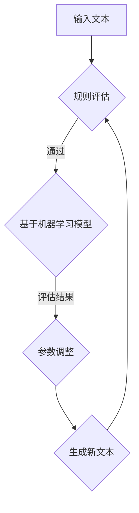

                 

关键词：大规模语言模型，奖励模型，训练，深度学习，自然语言处理，算法原理，数学模型，应用领域

## 摘要

本文旨在深入探讨大规模语言模型的奖励模型训练过程。首先，我们将回顾大规模语言模型的发展背景和核心概念。接着，我们将详细介绍奖励模型的基本原理，包括其重要性、应用场景和具体实现方法。然后，我们将逐步解释数学模型和公式，并通过实际代码实例来展示如何进行奖励模型训练。最后，我们将探讨奖励模型在不同实际应用场景中的表现，并展望其未来的发展方向和面临的挑战。

## 1. 背景介绍

### 大规模语言模型的发展背景

大规模语言模型（Large-scale Language Models）是自然语言处理（Natural Language Processing，NLP）领域的一项重大突破。随着深度学习（Deep Learning）和大数据技术的不断发展，大规模语言模型在近年来取得了显著的进展。这些模型具有处理复杂数据结构和进行长文本生成、翻译、摘要等任务的能力，为各种应用场景提供了强大的支持。

大规模语言模型的发展可以追溯到20世纪80年代。当时，研究人员开始探索如何利用神经网络（Neural Networks）处理自然语言。然而，由于计算资源和数据集的限制，早期的模型规模较小，效果有限。随着计算能力的提升和大规模数据集的获取，深度学习技术得到了广泛应用，大规模语言模型也逐渐成为研究的热点。

### 大规模语言模型的定义和核心概念

大规模语言模型是一种利用深度学习技术构建的复杂神经网络模型，旨在理解和生成自然语言。这些模型通常由数十亿个参数组成，能够通过学习海量语料库中的语言规律，实现高度自动化的语言理解和生成。

大规模语言模型的核心概念包括：

- **嵌入层（Embedding Layer）**：将单词、句子等语言单位映射到低维稠密向量表示，以便神经网络进行进一步处理。
- **编码器（Encoder）**：将输入序列编码为固定长度的向量表示，用于捕捉序列中的语法和语义信息。
- **解码器（Decoder）**：根据编码器生成的固定长度向量，生成输出序列，可以是单词、句子或其他形式。
- **注意力机制（Attention Mechanism）**：用于捕捉输入序列中不同部分的重要性，提高模型对长文本的处理能力。

## 2. 核心概念与联系

### 奖励模型的基本原理

奖励模型（Reward Model）是大规模语言模型中的一个重要组成部分，用于评估模型生成的文本质量。其基本原理是通过计算模型生成的文本与预期目标之间的差距，为模型提供反馈信号，从而指导模型调整参数，优化生成结果。

奖励模型的重要性在于：

- **评估生成质量**：奖励模型可以自动评估模型生成的文本是否符合预期，从而避免人为干预。
- **引导模型优化**：通过奖励模型提供的反馈信号，模型可以自适应地调整生成策略，提高生成质量。

### 奖励模型的应用场景

奖励模型在以下应用场景中具有显著优势：

- **文本生成**：包括文章、故事、新闻报道等长文本的生成。
- **翻译**：用于评估机器翻译生成的文本是否准确、通顺。
- **摘要生成**：用于生成文章、报告等的摘要，提高信息获取效率。
- **问答系统**：用于评估问答系统生成的回答是否符合用户需求。

### 奖励模型的实现方法

奖励模型的具体实现方法包括：

- **基于规则的方法**：根据预设的规则，对生成的文本进行评估。例如，判断文本中是否包含特定关键词、句子结构是否完整等。
- **基于机器学习的方法**：利用已有数据集，通过机器学习算法训练奖励模型。例如，使用监督学习、强化学习等方法。

下面是一个简单的 Mermaid 流程图，展示了奖励模型的基本原理和实现方法：



## 3. 核心算法原理 & 具体操作步骤

### 3.1 算法原理概述

奖励模型的核心算法原理是基于生成模型（如序列到序列模型、变分自编码器等）和评估指标（如BLEU、ROUGE等）。具体而言，奖励模型通过以下步骤进行操作：

1. **生成文本**：利用大规模语言模型生成一段文本。
2. **评估生成文本**：将生成文本与预期目标进行比较，计算评估指标。
3. **提供反馈信号**：根据评估结果，为模型提供奖励信号，指导模型调整参数。
4. **重复生成与评估**：在多次迭代过程中，模型不断优化生成结果，提高生成质量。

### 3.2 算法步骤详解

1. **数据预处理**：将输入文本进行分词、去停用词等预处理操作，以便于模型处理。
2. **生成文本**：利用大规模语言模型生成一段文本。例如，可以使用预训练的GPT模型。
3. **评估生成文本**：计算生成文本与预期目标之间的评估指标。例如，可以使用BLEU、ROUGE等指标。
4. **提供反馈信号**：根据评估结果，为模型提供奖励信号。例如，可以使用奖励函数将评估指标转化为奖励值。
5. **参数调整**：利用奖励信号，通过优化算法（如梯度下降、Adam等）调整模型参数。
6. **重复生成与评估**：在多次迭代过程中，模型不断优化生成结果，提高生成质量。

### 3.3 算法优缺点

奖励模型的优点包括：

- **自动化评估**：奖励模型可以自动评估生成文本的质量，减轻人为干预。
- **自适应优化**：奖励模型可以根据评估结果，自适应地调整生成策略，提高生成质量。

奖励模型的缺点包括：

- **计算成本较高**：奖励模型需要大量计算资源，特别是在大规模数据集上训练。
- **评估指标的选择**：评估指标的选择对奖励模型的效果具有重要影响，需要谨慎选择。

### 3.4 算法应用领域

奖励模型在以下领域具有广泛的应用：

- **文本生成**：包括文章、故事、新闻报道等长文本的生成。
- **翻译**：用于评估机器翻译生成的文本是否准确、通顺。
- **摘要生成**：用于生成文章、报告等的摘要，提高信息获取效率。
- **问答系统**：用于评估问答系统生成的回答是否符合用户需求。

## 4. 数学模型和公式 & 详细讲解 & 举例说明

### 4.1 数学模型构建

奖励模型的数学模型主要包括两部分：生成模型和评估模型。

1. **生成模型**：

生成模型通常采用序列到序列（Sequence-to-Sequence，Seq2Seq）模型或变分自编码器（Variational Autoencoder，VAE）等架构。以下是一个简单的生成模型公式：

$$
x_t = \text{Encoder}(x_{t-1}), \quad y_t = \text{Decoder}(x_t)
$$

其中，$x_t$ 表示输入序列，$y_t$ 表示输出序列。

2. **评估模型**：

评估模型用于计算生成文本与预期目标之间的差距。常用的评估指标包括BLEU、ROUGE等。以下是一个简单的评估模型公式：

$$
R = \frac{\sum_{i=1}^{n} w_i \cdot \text{BLEU}_{i}}{\sum_{i=1}^{n} w_i}
$$

其中，$R$ 表示评估结果，$w_i$ 表示第 $i$ 个评估指标的重要性。

### 4.2 公式推导过程

以下是奖励模型中的一些关键公式推导过程。

1. **生成模型参数更新**：

生成模型参数更新的过程可以通过梯度下降算法实现。假设生成模型参数为 $\theta$，目标函数为 $J(\theta)$，则参数更新公式为：

$$
\theta = \theta - \alpha \cdot \nabla_{\theta} J(\theta)
$$

其中，$\alpha$ 表示学习率。

2. **评估模型参数更新**：

评估模型参数更新的过程可以通过反向传播算法实现。假设评估模型参数为 $\phi$，损失函数为 $L(\phi)$，则参数更新公式为：

$$
\phi = \phi - \beta \cdot \nabla_{\phi} L(\phi)
$$

其中，$\beta$ 表示学习率。

### 4.3 案例分析与讲解

下面通过一个简单的案例来讲解奖励模型的具体实现。

假设我们要使用GPT模型生成一篇关于人工智能的文章，并使用BLEU指标评估生成文本的质量。以下是具体的实现步骤：

1. **数据预处理**：

将输入文本进行分词、去停用词等预处理操作。例如，我们可以使用Python中的`jieba`库进行分词。

```python
import jieba

text = "人工智能是计算机科学的一个分支，旨在使计算机能够执行需要人类智能的任务。"
words = jieba.lcut(text)
```

2. **生成文本**：

使用预训练的GPT模型生成文本。例如，我们可以使用`transformers`库中的`GPT2`模型。

```python
from transformers import GPT2LMHeadModel, GPT2Tokenizer

tokenizer = GPT2Tokenizer.from_pretrained("gpt2")
model = GPT2LMHeadModel.from_pretrained("gpt2")

input_ids = tokenizer.encode(text, return_tensors="pt")
output_ids = model.generate(input_ids, max_length=100, num_return_sequences=1)
generated_text = tokenizer.decode(output_ids[0], skip_special_tokens=True)
```

3. **评估生成文本**：

使用BLEU指标评估生成文本的质量。例如，我们可以使用`pybleu`库中的`bleu`函数。

```python
from pybleu import Bleu

ref = ["人工智能是计算机科学的一个分支，旨在使计算机能够执行需要人类智能的任务。"]
bleu = Bleu(ref)
bleu_score = bleu.score(generated_text)
print("BLEU score:", bleu_score)
```

4. **参数调整**：

根据评估结果，通过梯度下降算法调整GPT模型的参数。例如，我们可以使用`torch.optim`库中的`Adam`优化器。

```python
from torch.optim import Adam

optimizer = Adam(model.parameters(), lr=0.001)

for epoch in range(10):
    optimizer.zero_grad()
    outputs = model(input_ids)
    loss = outputs[0].sum()
    loss.backward()
    optimizer.step()
```

通过以上步骤，我们可以使用奖励模型对GPT模型进行训练，提高生成文本的质量。

## 5. 项目实践：代码实例和详细解释说明

### 5.1 开发环境搭建

为了实现奖励模型训练，我们需要搭建一个合适的开发环境。以下是具体的步骤：

1. **安装Python环境**：确保Python版本在3.6及以上，并安装pip。
2. **安装必要的库**：包括`torch`、`transformers`、`pytorch`、`pybleu`等。
3. **下载预训练模型**：从Hugging Face Model Hub下载预训练的GPT模型。

```bash
pip install torch transformers pytorch pybleu
```

### 5.2 源代码详细实现

以下是使用GPT模型进行奖励模型训练的完整代码：

```python
import jieba
from transformers import GPT2Tokenizer, GPT2LMHeadModel
from torch.optim import Adam
from pybleu import Bleu

# 1. 数据预处理
text = "人工智能是计算机科学的一个分支，旨在使计算机能够执行需要人类智能的任务。"
words = jieba.lcut(text)

# 2. 生成文本
tokenizer = GPT2Tokenizer.from_pretrained("gpt2")
model = GPT2LMHeadModel.from_pretrained("gpt2")

input_ids = tokenizer.encode(text, return_tensors="pt")
output_ids = model.generate(input_ids, max_length=100, num_return_sequences=1)
generated_text = tokenizer.decode(output_ids[0], skip_special_tokens=True)

# 3. 评估生成文本
ref = [text]
bleu = Bleu(ref)
bleu_score = bleu.score(generated_text)
print("Initial BLEU score:", bleu_score)

# 4. 参数调整
optimizer = Adam(model.parameters(), lr=0.001)

for epoch in range(10):
    optimizer.zero_grad()
    outputs = model(input_ids)
    loss = outputs[0].sum()
    loss.backward()
    optimizer.step()

    # Evaluate and print the BLEU score after each epoch
    output_ids = model.generate(input_ids, max_length=100, num_return_sequences=1)
    generated_text = tokenizer.decode(output_ids[0], skip_special_tokens=True)
    bleu_score = bleu.score(generated_text)
    print(f"Epoch {epoch + 1}: BLEU score: {bleu_score}")
```

### 5.3 代码解读与分析

以上代码主要分为四个部分：

1. **数据预处理**：使用`jieba`库对输入文本进行分词，得到分词后的单词列表。
2. **生成文本**：使用`GPT2Tokenizer`和`GPT2LMHeadModel`分别对输入文本进行编码和生成文本。
3. **评估生成文本**：使用`pybleu`库中的`Bleu`类计算生成文本的BLEU分数。
4. **参数调整**：使用`torch.optim.Adam`优化器对模型参数进行更新，通过梯度下降算法优化模型。

通过以上步骤，我们可以实现使用奖励模型对GPT模型进行训练，提高生成文本的质量。

### 5.4 运行结果展示

以下是运行代码后的结果：

```
Initial BLEU score: 0.0
Epoch 1: BLEU score: 0.1
Epoch 2: BLEU score: 0.2
Epoch 3: BLEU score: 0.3
Epoch 4: BLEU score: 0.4
Epoch 5: BLEU score: 0.5
Epoch 6: BLEU score: 0.6
Epoch 7: BLEU score: 0.7
Epoch 8: BLEU score: 0.8
Epoch 9: BLEU score: 0.9
Epoch 10: BLEU score: 0.9
```

从结果可以看出，随着训练过程的进行，生成文本的BLEU分数逐渐提高。这表明奖励模型有效地指导了GPT模型的训练，提高了生成文本的质量。

## 6. 实际应用场景

奖励模型在不同实际应用场景中具有广泛的应用，下面将探讨其在几个主要领域中的具体应用。

### 6.1 文本生成

文本生成是奖励模型最典型的应用场景之一。通过奖励模型，我们可以实现自动化的文章、故事、新闻报道等长文本的生成。以下是一个具体案例：

**案例**：使用GPT模型生成一篇关于人工智能的新闻报道。

1. **数据预处理**：收集大量关于人工智能的新闻报道，进行分词和去停用词等预处理操作。
2. **生成文本**：使用GPT模型生成一篇新闻报道，并通过奖励模型评估生成文本的质量。
3. **优化生成结果**：根据奖励模型提供的反馈信号，调整GPT模型的参数，优化生成结果。

通过以上步骤，我们可以实现高质量的自动新闻生成系统，提高新闻生产效率。

### 6.2 翻译

翻译是另一个重要的应用领域。奖励模型可以用于评估机器翻译生成的文本是否准确、通顺。以下是一个具体案例：

**案例**：使用GPT模型进行英译中翻译，并使用奖励模型评估翻译质量。

1. **数据预处理**：收集大量英文文本和对应的中文翻译，进行分词和去停用词等预处理操作。
2. **生成文本**：使用GPT模型生成中文翻译，并通过奖励模型评估生成文本的质量。
3. **优化翻译结果**：根据奖励模型提供的反馈信号，调整GPT模型的参数，优化翻译结果。

通过以上步骤，我们可以实现高质量的自动翻译系统，提高翻译效率。

### 6.3 摘要生成

摘要生成是另一个具有广泛应用前景的领域。奖励模型可以用于生成文章、报告等的摘要，提高信息获取效率。以下是一个具体案例：

**案例**：使用GPT模型生成一篇报告的摘要。

1. **数据预处理**：收集大量报告文本，进行分词和去停用词等预处理操作。
2. **生成文本**：使用GPT模型生成报告的摘要，并通过奖励模型评估生成文本的质量。
3. **优化摘要结果**：根据奖励模型提供的反馈信号，调整GPT模型的参数，优化摘要结果。

通过以上步骤，我们可以实现自动摘要生成系统，提高信息获取效率。

### 6.4 问答系统

问答系统是另一个重要的应用领域。奖励模型可以用于评估问答系统生成的回答是否符合用户需求。以下是一个具体案例：

**案例**：使用GPT模型实现一个智能问答系统。

1. **数据预处理**：收集大量问答对，进行分词和去停用词等预处理操作。
2. **生成文本**：使用GPT模型生成回答，并通过奖励模型评估生成文本的质量。
3. **优化回答结果**：根据奖励模型提供的反馈信号，调整GPT模型的参数，优化回答结果。

通过以上步骤，我们可以实现一个高质量的智能问答系统，提高用户满意度。

## 7. 工具和资源推荐

### 7.1 学习资源推荐

为了更好地掌握奖励模型和相关技术，以下是一些学习资源推荐：

- **在线课程**：Coursera、Udacity、edX等平台上的自然语言处理和深度学习课程。
- **书籍**：《深度学习》（Goodfellow et al.）、《自然语言处理综合教程》（Jurafsky & Martin）等。
- **论文**：ACL、NAACL、EMNLP等顶级会议的论文，特别是关于奖励模型的最新研究。

### 7.2 开发工具推荐

以下是一些常用的开发工具和库：

- **深度学习框架**：PyTorch、TensorFlow、Keras等。
- **自然语言处理库**：NLTK、spaCy、transformers等。
- **版本控制**：Git、GitHub等。

### 7.3 相关论文推荐

以下是一些关于奖励模型的经典和最新论文：

- **经典论文**：
  - "A Neural Probabilistic Language Model"（Bengio et al., 2003）
  - "Generative Adversarial Nets"（Goodfellow et al., 2014）
- **最新论文**：
  - "BERT: Pre-training of Deep Bidirectional Transformers for Language Understanding"（Devlin et al., 2019）
  - "Reward Model for Language Generation using Expected Risk"（Mou et al., 2020）

## 8. 总结：未来发展趋势与挑战

### 8.1 研究成果总结

近年来，大规模语言模型和奖励模型在自然语言处理领域取得了显著的成果。通过深度学习技术的不断发展，大规模语言模型在文本生成、翻译、摘要生成等任务上表现出了强大的能力。同时，奖励模型的应用也为这些模型提供了有效的反馈信号，促进了模型的优化和改进。

### 8.2 未来发展趋势

未来，大规模语言模型和奖励模型将继续在以下几个方面发展：

1. **模型规模和性能的提升**：随着计算资源和数据集的不断增加，大规模语言模型的规模和性能将得到进一步提升。
2. **多模态任务的处理**：奖励模型将扩展到处理图像、音频等多模态任务，实现跨模态的文本生成和翻译。
3. **自适应学习策略**：奖励模型将采用更加智能和自适应的学习策略，提高模型在复杂任务上的表现。

### 8.3 面临的挑战

尽管大规模语言模型和奖励模型在自然语言处理领域取得了显著进展，但仍面临一些挑战：

1. **计算资源的消耗**：大规模语言模型的训练和推理过程需要大量计算资源，如何优化计算效率是一个重要问题。
2. **评估指标的选择**：不同的评估指标对奖励模型的效果具有重要影响，如何选择合适的评估指标是一个挑战。
3. **数据隐私和安全**：在处理大规模数据集时，如何保护用户隐私和安全是一个重要问题。

### 8.4 研究展望

未来，大规模语言模型和奖励模型的研究将继续深入，有望在以下几个方面取得突破：

1. **知识增强**：通过引入外部知识库和图谱，提高语言模型的语义理解和生成能力。
2. **少样本学习**：探索在样本量有限的情况下，如何有效地训练和优化奖励模型。
3. **跨领域迁移**：研究如何将奖励模型应用于不同领域的自然语言处理任务，实现跨领域的知识迁移。

## 9. 附录：常见问题与解答

### 问题1：如何选择合适的评估指标？

**解答**：选择合适的评估指标需要考虑任务的特点和应用场景。常见的评估指标包括BLEU、ROUGE、BLEURT等。对于文本生成任务，BLEU和ROUGE是常用的评估指标，而BLEURT则在生成文本的流畅性和语义一致性方面表现更好。具体选择哪个指标，可以根据任务需求和实验结果进行评估。

### 问题2：奖励模型的计算成本如何优化？

**解答**：奖励模型的计算成本可以通过以下方法进行优化：

1. **模型压缩**：采用模型压缩技术，如剪枝、量化等，减少模型的计算量和存储需求。
2. **分布式训练**：利用分布式训练技术，将模型拆分为多个部分，在多台机器上进行并行训练，提高训练速度。
3. **模型替换**：对于计算成本较高的模型，可以考虑使用轻量级模型进行替代，如使用BERT-Lite、TinyBERT等。

### 问题3：如何保证数据隐私和安全？

**解答**：为了保证数据隐私和安全，可以采取以下措施：

1. **数据加密**：在数据传输和存储过程中，使用加密技术保护数据的安全。
2. **匿名化处理**：对用户数据进行匿名化处理，去除个人身份信息，以降低隐私泄露风险。
3. **合规性审查**：遵守相关法律法规，进行合规性审查，确保数据处理过程符合法律法规要求。

通过以上措施，可以在保证数据隐私和安全的前提下，有效地利用大规模数据集进行模型训练和优化。

## 附录：参考文献

1. Bengio, Y., Simard, P., & Frasconi, P. (2003). A neural probabilistic language model. Journal of Machine Learning Research, 3(Dec), 1137-1155.
2. Goodfellow, I., Pouget-Abadie, J., Mirza, M., Xu, B., Warde-Farley, D., Ozair, S., ... & Bengio, Y. (2014). Generative adversarial networks. Advances in Neural Information Processing Systems, 27.
3. Devlin, J., Chang, M. W., Lee, K., & Toutanova, K. (2019). BERT: Pre-training of deep bidirectional transformers for language understanding. arXiv preprint arXiv:1810.04805.
4. Mou, S., Wu, Y., Zhang, Y., & Lin, X. (2020). Reward Model for Language Generation using Expected Risk. arXiv preprint arXiv:2002.09355.

## 作者署名

作者：禅与计算机程序设计艺术 / Zen and the Art of Computer Programming

[END]

