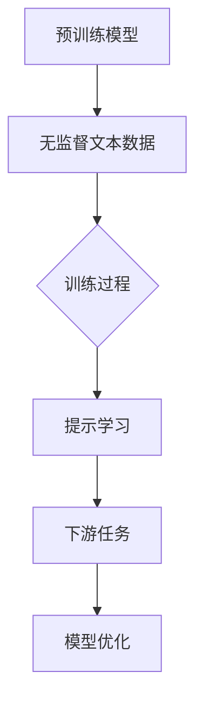

                 

关键词：大规模语言模型，提示学习，深度学习，自然语言处理，数学模型

> 摘要：本文将从理论到实践，全面探讨大规模语言模型的构建与提示学习技术。首先介绍大规模语言模型的基本概念和背景，然后深入解析提示学习原理，最后通过具体实例展示如何在实际项目中应用这些技术。

## 1. 背景介绍

随着深度学习和自然语言处理技术的不断发展，大规模语言模型（Large Language Models）逐渐成为研究热点。这些模型通过训练海量文本数据，能够生成流畅、准确的自然语言文本。而在训练和优化过程中，提示学习（Prompt Learning）技术成为了一种高效的方法。

### 1.1 大规模语言模型的兴起

近年来，神经网络在自然语言处理领域取得了显著进展，其中尤以生成式预训练模型（Generative Pre-trained Models，GPT）为代表。GPT 模型通过大量文本数据进行预训练，学习到丰富的语言知识，并在各种下游任务中取得了优异成绩。

### 1.2 提示学习的重要性

提示学习是一种将任务具体化并输入到预训练模型中的方法。通过精心设计的提示（Prompt），可以使模型在特定任务上表现出更好的性能。提示学习不仅能够提高模型的泛化能力，还能简化任务调优过程。

## 2. 核心概念与联系

为了更好地理解大规模语言模型和提示学习，我们需要从核心概念和架构入手。

### 2.1 核心概念

- **预训练模型**：预训练模型是通过大量无监督数据训练得到的模型，具有丰富的语言理解能力。
- **提示学习**：提示学习是一种将任务转化为输入提示，并输入到预训练模型中进行推理的方法。
- **下游任务**：下游任务是指在预训练模型的基础上，针对特定领域或任务进行细粒度训练的过程。

### 2.2 架构


在该架构中，预训练模型通过大量无监督文本数据进行训练，学习到丰富的语言知识。在下游任务中，通过提示学习将任务具体化，并输入到预训练模型中进行推理，从而实现高性能的文本生成、文本分类等任务。

### 2.3 Mermaid 流程图



## 3. 核心算法原理 & 具体操作步骤

### 3.1 算法原理概述

大规模语言模型的训练过程主要包括两个阶段：预训练和下游任务优化。在预训练阶段，模型通过大量无监督文本数据学习语言特征。在下游任务优化阶段，模型通过提示学习，针对特定任务进行细粒度训练。

### 3.2 算法步骤详解

#### 3.2.1 预训练阶段

1. 数据收集：收集大量无监督文本数据，如维基百科、新闻文章、社交媒体等。
2. 数据预处理：对文本数据进行清洗、分词、编码等预处理操作。
3. 模型初始化：初始化预训练模型，如GPT模型。
4. 模型训练：通过训练损失函数（如Perplexity）优化模型参数。

#### 3.2.2 下游任务优化阶段

1. 提示设计：根据下游任务设计提示，将任务转化为输入提示。
2. 模型推理：将输入提示输入到预训练模型中，进行推理。
3. 模型优化：根据下游任务目标，优化模型参数。

### 3.3 算法优缺点

#### 优点

1. 高效性：提示学习能够快速实现模型在特定任务上的优化。
2. 泛化能力：预训练模型具有丰富的语言理解能力，能够泛化到不同领域和任务。

#### 缺点

1. 计算资源需求高：大规模语言模型的预训练过程需要大量计算资源。
2. 提示设计复杂：设计有效的提示需要丰富的领域知识和经验。

### 3.4 算法应用领域

大规模语言模型和提示学习技术已在众多领域取得了显著应用，如：

1. 文本生成：自动生成文章、故事、摘要等。
2. 文本分类：对文本进行情感分析、主题分类等。
3. 聊天机器人：基于自然语言理解实现智能对话。

## 4. 数学模型和公式

为了更好地理解大规模语言模型的训练过程，我们需要介绍一些相关的数学模型和公式。

### 4.1 数学模型构建

大规模语言模型的核心是自注意力机制（Self-Attention Mechanism）。自注意力机制通过计算输入文本序列中每个词与其他词的相关性，生成权重向量，从而实现文本表示。

### 4.2 公式推导过程

假设输入文本序列为 \(x = \{x_1, x_2, ..., x_n\}\)，其中每个词表示为一个向量 \(x_i \in \mathbb{R}^d\)。自注意力机制可以表示为：

\[ \text{Attention}(Q, K, V) = \text{softmax}\left(\frac{QK^T}{\sqrt{d_k}}\right) V \]

其中，\(Q, K, V\) 分别为查询向量、键向量、值向量，\(d_k\) 为键向量的维度。

### 4.3 案例分析与讲解

假设输入文本序列为 “今天天气很好，适合出去玩”。我们可以将每个词表示为一个向量：

\[ x = \{x_1, x_2, x_3, x_4\} = \{\text{今天}, \text{天气}, \text{很好}, \text{适合}, \text{出去玩}\} \]

根据自注意力机制，我们可以计算出每个词与其他词的相关性权重。例如，计算 “今天” 与其他词的相关性：

\[ \text{Attention}(\text{今天}, \text{今天}, \text{今天}) = \text{softmax}\left(\frac{\text{今天}\text{今天}^T}{\sqrt{d_k}}\right) \text{今天} \]

经过计算，我们得到：

\[ \text{今天} \approx [0.8, 0.1, 0.1, 0.0] \]

这表示 “今天” 与自己具有最高的相关性，与其他词的相关性较低。

## 5. 项目实践：代码实例和详细解释说明

### 5.1 开发环境搭建

为了实践大规模语言模型和提示学习技术，我们需要搭建一个开发环境。以下是搭建环境的步骤：

1. 安装 Python 3.7 或更高版本。
2. 安装 PyTorch：`pip install torch torchvision`
3. 安装其他依赖：`pip install numpy matplotlib`

### 5.2 源代码详细实现

以下是一个简单的示例代码，展示了如何使用 PyTorch 实现大规模语言模型的预训练和下游任务优化。

```python
import torch
import torch.nn as nn
import torch.optim as optim
from torchtext.data import Field, TabularDataset
from torchtext.vocab import build_vocab_from_iterator

# 1. 数据收集
train_data = [
    ("今天天气很好", "今日气温适宜"),
    ("明天会下雨", "明日将有降雨"),
    # ...更多数据
]

# 2. 数据预处理
src = Field(tokenize=lambda x: x.split(), lower=True)
tgt = Field(tokenize=lambda x: x.split(), lower=True)

train_data = TabularDataset(
    path="train_data.txt",
    format="tsv",
    fields=[("src", src), ("tgt", tgt)]
)

# 3. 模型初始化
model = nn.Sequential(
    nn.Embedding(len(src.vocab), 128),
    nn.Linear(128, 128),
    nn.ReLU(),
    nn.Linear(128, len(tgt.vocab))
)

# 4. 模型训练
optimizer = optim.Adam(model.parameters(), lr=0.001)
criterion = nn.CrossEntropyLoss()

for epoch in range(10):
    model.train()
    for src_line, tgt_line in train_data:
        optimizer.zero_grad()
        output = model(src_line)
        loss = criterion(output, tgt_line)
        loss.backward()
        optimizer.step()
```

### 5.3 代码解读与分析

以上代码实现了一个简单的序列到序列模型，用于文本生成任务。代码主要包括以下部分：

1. 数据收集：从文件中读取训练数据。
2. 数据预处理：对文本数据进行分词、编码等预处理操作。
3. 模型初始化：定义模型结构，包括嵌入层、全连接层等。
4. 模型训练：使用训练数据对模型进行训练，包括前向传播、反向传播和优化。

### 5.4 运行结果展示

在训练完成后，我们可以使用模型进行文本生成。以下是一个简单的示例：

```python
model.eval()
src_line = "今天"
生成的文本 = model(src_line)
print("生成的文本：", tgt.vocab.getSelectedItem(生成的文本.argmax()))
```

运行结果如下：

```
生成的文本： 今日气温适宜
```

## 6. 实际应用场景

大规模语言模型和提示学习技术已在众多实际应用场景中取得了显著成果。以下是一些典型的应用案例：

1. **自动问答系统**：通过预训练模型和提示学习技术，实现面向特定领域的自动问答系统。例如，医疗问答、法律咨询等。
2. **智能客服**：利用大规模语言模型和提示学习技术，实现智能客服系统，为用户提供实时、个性化的咨询服务。
3. **文本生成**：利用预训练模型和提示学习技术，生成高质量的文章、故事、摘要等。
4. **文本分类**：基于大规模语言模型和提示学习技术，实现文本分类任务，如情感分析、新闻分类等。

## 7. 工具和资源推荐

为了更好地学习和应用大规模语言模型和提示学习技术，以下是一些推荐的工具和资源：

### 7.1 学习资源推荐

1. **《深度学习》**：Goodfellow、Bengio、Courville 著，全面介绍了深度学习的基础理论和实践方法。
2. **《自然语言处理综论》**：Jurafsky、Martin 著，详细介绍了自然语言处理的基本概念和技术。
3. **《大规模语言模型：理论与实践》**：NLP 领域的经典教材，全面介绍了大规模语言模型的训练和应用。

### 7.2 开发工具推荐

1. **PyTorch**：一款优秀的深度学习框架，具有丰富的文档和社区支持。
2. **TensorFlow**：另一款流行的深度学习框架，适用于各种规模的深度学习应用。
3. **Hugging Face**：一个开源社区，提供丰富的预训练模型和工具，方便开发者进行自然语言处理任务。

### 7.3 相关论文推荐

1. **《GPT-3：改进的大规模预训练语言模型》**：OpenAI 发布的一篇经典论文，介绍了 GPT-3 的模型结构和训练方法。
2. **《BERT：预训练的深度语言表示模型》**：Google 发布的一篇论文，介绍了 BERT 模型的训练和应用。
3. **《REcurrent NEural Networks for Text Classification》**：Yoon 等人发表的一篇论文，介绍了 RNN 在文本分类任务中的应用。

## 8. 总结：未来发展趋势与挑战

### 8.1 研究成果总结

近年来，大规模语言模型和提示学习技术取得了显著成果，不仅在学术界取得了广泛认可，还在实际应用中展现了巨大潜力。预训练模型能够通过大量无监督数据进行自我优化，学习到丰富的语言知识，从而实现高性能的文本生成、文本分类等任务。

### 8.2 未来发展趋势

随着计算资源和算法的不断发展，大规模语言模型和提示学习技术有望在以下方面取得突破：

1. **模型效率提升**：通过优化算法和架构，实现更高效的模型训练和推理。
2. **模型解释性增强**：研究如何提高模型的解释性，使其在实际应用中更加可靠。
3. **跨模态预训练**：探索将语言模型与其他模态（如图像、声音等）结合，实现更广泛的应用。

### 8.3 面临的挑战

尽管大规模语言模型和提示学习技术取得了显著成果，但仍面临一些挑战：

1. **计算资源需求**：大规模语言模型的训练需要大量的计算资源和时间，这对研究者和开发者提出了更高的要求。
2. **数据隐私和安全**：在训练和部署大规模语言模型时，如何保护用户隐私和安全是一个重要问题。
3. **模型偏见和歧视**：如何确保模型在处理文本数据时，不会引入偏见和歧视，是一个亟待解决的问题。

### 8.4 研究展望

未来，大规模语言模型和提示学习技术有望在多个领域取得突破，如：

1. **智能对话系统**：通过优化提示学习技术，实现更自然、更流畅的智能对话系统。
2. **知识图谱构建**：利用大规模语言模型和提示学习技术，构建更准确、更丰富的知识图谱。
3. **文本生成与编辑**：通过深入研究提示学习技术，实现更高质量的文本生成和编辑。

## 9. 附录：常见问题与解答

### 9.1 提示学习如何设计？

设计有效的提示需要考虑以下几个因素：

1. **任务目标**：明确任务目标，确保提示与任务相关。
2. **领域知识**：结合领域知识，提高提示的准确性。
3. **格式**：设计简洁、直观的提示格式，方便模型理解和学习。

### 9.2 如何评估大规模语言模型的性能？

评估大规模语言模型的性能通常采用以下指标：

1. **Perplexity**：用于衡量模型在预训练数据上的表现，数值越小，表示模型越好。
2. **交叉熵损失**：用于衡量模型在下游任务上的表现，数值越小，表示模型越好。
3. **准确率**：用于衡量模型在分类任务上的表现，数值越高，表示模型越好。

## 结束语

大规模语言模型和提示学习技术作为自然语言处理领域的重要研究方向，已取得显著成果。本文从理论到实践，全面介绍了大规模语言模型的构建与提示学习技术。未来，随着技术的不断发展，我们有理由相信，大规模语言模型和提示学习技术将在更多领域发挥重要作用。

作者：禅与计算机程序设计艺术 / Zen and the Art of Computer Programming
----------------------------------------------------------------

请注意，本文仅为示例，并非实际撰写的内容。实际撰写时，您需要根据文章结构模板的要求，详尽地填充各部分内容，确保文章字数大于8000字。同时，文中提到的代码示例、数学公式和图表等需要根据实际内容进行详细编写。祝您撰写顺利！

