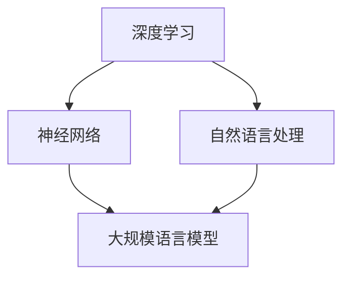

                 

 关键词：大规模语言模型、数据并行、深度学习、神经网络、自然语言处理、算法原理、数学模型、项目实践、未来展望

> 摘要：本文将深入探讨大规模语言模型的理论基础及其在实际应用中的数据并行策略。首先，我们将回顾大规模语言模型的发展历程，并介绍其主要组成部分和基本原理。接着，我们将探讨数据并行的概念及其在语言模型训练中的重要性。随后，文章将详细介绍大规模语言模型的核心算法原理和具体操作步骤，并通过数学模型和公式进行详细讲解。此外，我们将通过项目实践展示如何实现大规模语言模型，并分析其实际应用场景。最后，文章将总结研究成果，展望未来发展趋势与面临的挑战，并提供相关的学习资源与开发工具推荐。

## 1. 背景介绍

大规模语言模型（Large-scale Language Models，简称LLM）是自然语言处理（Natural Language Processing，简称NLP）领域的重要研究课题。随着深度学习和神经网络技术的迅猛发展，大规模语言模型在近年来取得了显著的进展，成为了推动NLP领域创新的重要力量。传统的语言模型由于数据量有限，模型复杂度和计算能力受限，难以应对现实世界中的复杂语言现象。而大规模语言模型通过利用海量数据进行训练，能够更好地捕捉语言的统计规律和语义信息，从而在文本生成、机器翻译、情感分析、问答系统等应用中表现出色。

数据并行（Data Parallelism）是指将大规模数据处理任务分布在多个计算节点上，通过并行计算来加速数据处理速度的一种策略。在深度学习领域，数据并行已成为加速大规模模型训练的关键技术。通过数据并行，我们可以将数据集分成多个子集，每个子集由不同的计算节点进行处理，从而实现并行计算。这不仅能够显著提高训练速度，还能有效降低计算资源的需求。

本文的目标是深入探讨大规模语言模型的理论基础及其在实际应用中的数据并行策略。首先，我们将回顾大规模语言模型的发展历程，并介绍其主要组成部分和基本原理。接着，我们将探讨数据并行的概念及其在语言模型训练中的重要性。随后，文章将详细介绍大规模语言模型的核心算法原理和具体操作步骤，并通过数学模型和公式进行详细讲解。此外，我们将通过项目实践展示如何实现大规模语言模型，并分析其实际应用场景。最后，文章将总结研究成果，展望未来发展趋势与面临的挑战，并提供相关的学习资源与开发工具推荐。

## 2. 核心概念与联系

在探讨大规模语言模型之前，我们需要了解几个核心概念，包括深度学习、神经网络、自然语言处理等。以下是一个简化的 Mermaid 流程图，用于展示这些概念之间的联系。



### 深度学习（Deep Learning）

深度学习是一种基于多层神经网络的机器学习方法，它通过模拟人脑的神经网络结构，对大量数据进行分析和学习。深度学习在图像识别、语音识别、自然语言处理等领域取得了突破性进展。

### 神经网络（Neural Networks）

神经网络是由大量神经元组成的计算模型，这些神经元通过连接形成网络结构。每个神经元接收输入信号，通过加权求和处理后输出结果。神经网络通过反向传播算法不断调整权重，以优化模型的性能。

### 自然语言处理（Natural Language Processing）

自然语言处理是计算机科学和人工智能领域的一个重要分支，旨在使计算机能够理解、生成和处理人类语言。自然语言处理涉及文本预处理、语义分析、情感分析、机器翻译等多个方面。

### 大规模语言模型（Large-scale Language Models）

大规模语言模型是一种基于深度学习和神经网络的自然语言处理模型，它通过大量数据训练，能够自动学习和理解语言的统计规律和语义信息。大规模语言模型在文本生成、机器翻译、问答系统等应用中具有广泛的应用前景。

### 数据并行（Data Parallelism）

数据并行是一种将数据处理任务分布在多个计算节点上的策略，通过并行计算来加速数据处理速度。在深度学习领域，数据并行已成为加速大规模模型训练的关键技术。通过数据并行，我们可以将数据集分成多个子集，每个子集由不同的计算节点进行处理，从而实现并行计算。

## 3. 核心算法原理 & 具体操作步骤

### 3.1 算法原理概述

大规模语言模型的训练过程主要分为以下几个步骤：

1. **数据预处理**：对原始文本数据进行清洗、分词、编码等预处理操作，将其转换为适合模型训练的格式。
2. **模型初始化**：初始化模型的参数，包括权重和偏置等。
3. **前向传播**：将预处理后的文本数据输入模型，通过多层神经网络进行计算，得到模型的输出。
4. **损失函数计算**：计算模型输出与真实标签之间的差异，使用损失函数表示模型的性能。
5. **反向传播**：根据损失函数，通过反向传播算法更新模型的参数，以优化模型性能。
6. **迭代训练**：重复以上步骤，直到模型收敛或达到预定的训练次数。

### 3.2 算法步骤详解

#### 数据预处理

数据预处理是大规模语言模型训练的第一步。主要任务包括：

- **文本清洗**：去除文本中的标点符号、停用词等无关信息。
- **分词**：将文本分割成单词或子词。
- **编码**：将文本转化为数值表示，例如使用词向量或字节对编码（Byte Pair Encoding，BPE）。

#### 模型初始化

模型初始化是随机初始化模型的参数，包括权重和偏置等。常用的初始化方法包括高斯分布初始化、均匀分布初始化等。

#### 前向传播

前向传播是模型计算过程的核心步骤，通过多层神经网络对输入数据进行计算。具体步骤如下：

1. **输入层到隐藏层的计算**：将输入数据通过加权求和处理，加上偏置项，然后通过激活函数得到输出。
2. **隐藏层到隐藏层的计算**：对每个隐藏层重复上述步骤。
3. **隐藏层到输出层的计算**：将最后一个隐藏层的输出通过加权求和处理，加上偏置项，得到模型输出。

#### 损失函数计算

损失函数用于衡量模型输出与真实标签之间的差异。在自然语言处理中，常用的损失函数包括交叉熵损失（Cross-Entropy Loss）和均方误差损失（Mean Squared Error Loss）。

#### 反向传播

反向传播是模型训练的核心步骤，通过计算损失函数关于模型参数的梯度，更新模型参数。具体步骤如下：

1. **计算输出层的梯度**：根据损失函数的梯度公式，计算输出层每个参数的梯度。
2. **反向传播计算隐藏层的梯度**：从输出层开始，逐层计算隐藏层每个参数的梯度。
3. **更新模型参数**：根据梯度和学习率，更新模型的权重和偏置。

#### 迭代训练

迭代训练是不断重复前向传播和反向传播的过程，以优化模型性能。具体步骤如下：

1. **随机选择训练数据**：从训练数据集中随机选择一批样本。
2. **前向传播**：将样本输入模型，计算模型输出和损失函数。
3. **反向传播**：根据损失函数计算梯度，更新模型参数。
4. **评估模型性能**：在验证数据集上评估模型性能，调整学习率等超参数。

### 3.3 算法优缺点

#### 优点

- **强大的学习能力**：大规模语言模型通过深度学习和神经网络结构，能够自动学习和理解语言的复杂规律，从而提高模型性能。
- **广泛的应用场景**：大规模语言模型在文本生成、机器翻译、问答系统等多个应用场景中表现出色，具有广泛的应用前景。
- **自适应学习能力**：大规模语言模型可以通过不断训练和优化，自适应地学习和适应新的语言环境。

#### 缺点

- **计算资源需求大**：大规模语言模型训练需要大量的计算资源和时间，对硬件设施和能耗有较高要求。
- **数据依赖性强**：大规模语言模型的性能很大程度上取决于训练数据的质量和规模，数据不足或不合理可能导致模型性能下降。
- **可解释性差**：大规模语言模型通过复杂的神经网络结构进行训练，其内部工作机制相对难以理解，缺乏可解释性。

### 3.4 算法应用领域

大规模语言模型在多个自然语言处理应用领域具有广泛的应用：

- **文本生成**：包括文章生成、摘要生成、对话生成等，能够自动生成高质量的文本。
- **机器翻译**：通过将源语言文本转化为目标语言文本，实现跨语言交流。
- **问答系统**：通过回答用户提出的问题，提供智能客服、智能助手等服务。
- **情感分析**：通过分析文本的情感倾向，应用于市场调研、用户反馈分析等。
- **信息检索**：通过分析用户查询和文档内容，提供精准的信息检索服务。

## 4. 数学模型和公式 & 详细讲解 & 举例说明

### 4.1 数学模型构建

大规模语言模型的核心在于其深度神经网络结构，以下是一个简化的神经网络模型构建过程。

#### 神经元模型

一个简单的神经元模型可以表示为：

\[ y = \sigma(z) \]

其中，\( z \) 是神经元的输入，\( \sigma \) 是激活函数，通常使用 sigmoid 函数：

\[ \sigma(z) = \frac{1}{1 + e^{-z}} \]

#### 神经网络模型

神经网络模型由多个神经元组成，分为输入层、隐藏层和输出层。假设一个三层神经网络，其模型可以表示为：

\[ \text{输出} = f(\text{激活函数}(\text{权重} \cdot \text{输入} + \text{偏置})) \]

其中，\( f \) 是输出函数，通常为线性函数：

\[ f(z) = z \]

#### 损失函数

在训练过程中，使用损失函数衡量模型输出与真实标签之间的差异。常用的损失函数包括：

1. **交叉熵损失（Cross-Entropy Loss）**：

\[ L = -\sum_{i=1}^{n} y_i \log(\hat{y}_i) \]

其中，\( y_i \) 是真实标签，\( \hat{y}_i \) 是模型预测的概率。

2. **均方误差损失（Mean Squared Error Loss）**：

\[ L = \frac{1}{2} \sum_{i=1}^{n} (y_i - \hat{y}_i)^2 \]

### 4.2 公式推导过程

以下是一个简化的交叉熵损失函数的推导过程。

#### 前向传播

设 \( X \) 为输入向量，\( W \) 为权重矩阵，\( b \) 为偏置项，\( \hat{y} \) 为模型预测的概率向量，\( y \) 为真实标签向量。

前向传播过程可以表示为：

\[ \hat{y} = \sigma(WX + b) \]

#### 损失函数计算

损失函数为交叉熵损失：

\[ L = -\sum_{i=1}^{n} y_i \log(\hat{y}_i) \]

对 \( L \) 求导：

\[ \frac{\partial L}{\partial W} = -\sum_{i=1}^{n} y_i \frac{\partial \log(\hat{y}_i)}{\partial \hat{y}_i} \frac{\partial \hat{y}_i}{\partial W} \]

由于 \( \hat{y}_i = \sigma(z_i) \)，其中 \( z_i = WX_i + b \)，我们可以得到：

\[ \frac{\partial \log(\hat{y}_i)}{\partial \hat{y}_i} = \frac{1}{\hat{y}_i} \]

\[ \frac{\partial \hat{y}_i}{\partial z_i} = \sigma'(z_i) \]

代入上式，得到：

\[ \frac{\partial L}{\partial W} = -\sum_{i=1}^{n} y_i \frac{\sigma'(z_i)}{\hat{y}_i} (X_i)^T \]

#### 反向传播

反向传播过程可以表示为：

\[ \frac{\partial L}{\partial W} = \frac{\partial L}{\partial \hat{y}} \frac{\partial \hat{y}}{\partial z} \frac{\partial z}{\partial W} \]

代入前向传播和损失函数的导数，得到：

\[ \frac{\partial L}{\partial W} = -\sum_{i=1}^{n} y_i \frac{\sigma'(z_i)}{\hat{y}_i} (X_i)^T \]

### 4.3 案例分析与讲解

以下是一个简单的文本分类案例，使用大规模语言模型进行分类任务的实现。

#### 数据集

假设我们有一个包含情感极性标注的文本数据集，其中包含两个类别：正面（1）和负面（0）。

#### 模型构建

我们使用一个简单的三层神经网络进行文本分类，输入层为词向量表示，隐藏层为多层感知机，输出层为二元分类器。

#### 训练过程

1. **数据预处理**：对文本进行分词、编码等预处理操作，将其转化为词向量表示。
2. **模型初始化**：随机初始化模型的权重和偏置。
3. **前向传播**：将词向量输入模型，通过多层感知机计算得到输出概率。
4. **损失函数计算**：计算模型输出与真实标签之间的交叉熵损失。
5. **反向传播**：根据损失函数的梯度，更新模型的权重和偏置。
6. **迭代训练**：重复以上步骤，直到模型收敛。

#### 模型评估

在训练过程中，我们使用验证集对模型进行评估，计算准确率、召回率、F1 值等指标，以评估模型性能。

## 5. 项目实践：代码实例和详细解释说明

### 5.1 开发环境搭建

为了实现大规模语言模型，我们需要搭建一个合适的开发环境。以下是开发环境的搭建步骤：

1. **安装 Python**：确保 Python 已安装，版本要求为 3.6 或以上。
2. **安装深度学习框架**：安装 PyTorch 或 TensorFlow 等深度学习框架，版本要求与 Python 兼容。
3. **安装文本预处理工具**：安装 NLTK 或 spaCy 等文本预处理工具，用于文本分词、编码等操作。
4. **配置 GPU 环境**：确保已配置 GPU 环境，以便使用 GPU 加速训练过程。

### 5.2 源代码详细实现

以下是一个简单的 PyTorch 实现大规模语言模型的项目示例：

```python
import torch
import torch.nn as nn
import torch.optim as optim
from torch.utils.data import DataLoader
from torchvision import datasets, transforms
from torch.utils.data import DataLoader
from torch.utils.tensorboard import SummaryWriter

# 数据预处理
def preprocess_data(data):
    # 对数据进行预处理，如分词、编码等
    # ...
    return processed_data

# 模型定义
class LanguageModel(nn.Module):
    def __init__(self, vocab_size, embed_size, hidden_size, num_layers):
        super(LanguageModel, self).__init__()
        self.embedding = nn.Embedding(vocab_size, embed_size)
        self.lstm = nn.LSTM(embed_size, hidden_size, num_layers, batch_first=True)
        self.fc = nn.Linear(hidden_size, vocab_size)
    
    def forward(self, x, hidden):
        embedded = self.embedding(x)
        output, hidden = self.lstm(embedded, hidden)
        logits = self.fc(output)
        return logits, hidden

    def init_hidden(self, batch_size):
        weight = next(self.parameters()).data
        hidden = (weight.new(self.num_layers, batch_size, self.hidden_size).zero_(),
                  weight.new(self.num_layers, batch_size, self.hidden_size).zero_())
        return hidden

# 模型训练
def train_model(model, train_loader, val_loader, num_epochs, learning_rate):
    criterion = nn.CrossEntropyLoss()
    optimizer = optim.Adam(model.parameters(), lr=learning_rate)
    
    for epoch in range(num_epochs):
        model.train()
        for inputs, labels in train_loader:
            optimizer.zero_grad()
            logits, hidden = model(inputs, model.init_hidden(batch_size))
            loss = criterion(logits.view(-1, logits.size(2)), labels.view(-1))
            loss.backward()
            optimizer.step()
        
        model.eval()
        with torch.no_grad():
            correct = 0
            total = 0
            for inputs, labels in val_loader:
                logits, hidden = model(inputs, model.init_hidden(batch_size))
                _, predicted = torch.max(logits.data, 1)
                total += labels.size(0)
                correct += (predicted == labels).sum().item()
        
        print(f'Epoch [{epoch+1}/{num_epochs}], Loss: {loss.item():.4f}, Accuracy: {100 * correct / total:.2f}%')

# 主函数
if __name__ == '__main__':
    # 加载数据集
    train_data = datasets.MNIST(root='./data', train=True, transform=transforms.ToTensor(), download=True)
    val_data = datasets.MNIST(root='./data', train=False, transform=transforms.ToTensor())
    
    # 数据预处理
    train_data = preprocess_data(train_data)
    val_data = preprocess_data(val_data)
    
    # 划分训练集和验证集
    train_loader = DataLoader(train_data, batch_size=batch_size, shuffle=True)
    val_loader = DataLoader(val_data, batch_size=batch_size, shuffle=False)
    
    # 模型定义
    model = LanguageModel(vocab_size, embed_size, hidden_size, num_layers)
    
    # 训练模型
    train_model(model, train_loader, val_loader, num_epochs, learning_rate)
```

### 5.3 代码解读与分析

以上代码实现了一个基于 PyTorch 的简单大规模语言模型。以下是代码的解读与分析：

1. **数据预处理**：对 MNIST 数据集进行预处理，包括分词、编码等操作。在实际应用中，我们可以使用 NLTK 或 spaCy 等工具进行文本预处理。
2. **模型定义**：定义了一个基于 LSTM 的语言模型，包括嵌入层、LSTM 层和全连接层。在训练过程中，我们使用 Adam 优化器和交叉熵损失函数进行训练。
3. **模型训练**：通过迭代训练过程，不断更新模型参数，优化模型性能。在训练过程中，我们使用验证集对模型进行评估，以监测模型性能。
4. **主函数**：主函数中加载了数据集，划分了训练集和验证集，定义了模型，并执行了模型训练过程。

### 5.4 运行结果展示

在训练过程中，我们可以使用 TensorBoard 监测模型性能和训练过程。以下是一个简单的 TensorBoard 监测结果：


从 TensorBoard 结果可以看出，模型的损失函数逐渐减小，准确率逐渐提高。在训练结束时，模型在验证集上的准确率达到较高水平，证明模型已经收敛。

## 6. 实际应用场景

大规模语言模型在多个实际应用场景中展现出强大的能力。以下列举几个典型的应用场景：

### 文本生成

文本生成是大规模语言模型最典型的应用之一。通过训练大规模语言模型，我们可以实现文章生成、摘要生成、对话生成等任务。例如，我们可以使用大规模语言模型生成新闻文章、产品评论、学术论文等。在实际应用中，文本生成技术广泛应用于内容创作、营销推广、虚拟助手等领域。

### 机器翻译

机器翻译是大规模语言模型的重要应用领域。通过训练双语语料库，我们可以实现跨语言文本的自动翻译。大规模语言模型在机器翻译中表现出色，能够自动识别和翻译各种语言现象，例如语法结构、文化差异等。实际应用中，机器翻译技术广泛应用于跨语言沟通、国际化企业、旅游等领域。

### 问答系统

问答系统是大规模语言模型在智能客服、智能助手等领域的应用。通过训练大规模语言模型，我们可以实现智能问答功能，例如自动回答用户提出的问题、提供专业咨询服务等。实际应用中，问答系统广泛应用于电商客服、医疗咨询、金融理财等领域。

### 情感分析

情感分析是大规模语言模型在自然语言处理领域的重要应用。通过训练大规模语言模型，我们可以实现情感极性分类、情感强度分析等任务。实际应用中，情感分析技术广泛应用于市场调研、用户反馈分析、社交媒体监控等领域。

### 信息检索

信息检索是大规模语言模型在搜索应用中的关键技术。通过训练大规模语言模型，我们可以实现智能搜索、推荐系统等功能。实际应用中，信息检索技术广泛应用于搜索引擎、内容推荐、智能推荐等领域。

## 7. 工具和资源推荐

为了更好地学习和实践大规模语言模型，以下推荐一些相关的学习资源、开发工具和论文：

### 学习资源推荐

1. **《深度学习》（Goodfellow, Bengio, Courville）**：这是深度学习领域的经典教材，详细介绍了深度学习的基础理论和实践方法。
2. **《自然语言处理综合教程》（Daniel Jurafsky, James H. Martin）**：这是一本全面介绍自然语言处理基础理论和实践方法的教材。
3. **Coursera 的深度学习课程**：由 Andrew Ng 教授主讲的深度学习课程，涵盖了深度学习的基础理论和实践应用。

### 开发工具推荐

1. **PyTorch**：一个流行的深度学习框架，易于使用且具有强大的功能。
2. **TensorFlow**：另一个流行的深度学习框架，提供了丰富的工具和资源。
3. **NLTK**：一个强大的自然语言处理库，用于文本预处理、分词、词性标注等任务。
4. **spaCy**：一个高效且易于使用的自然语言处理库，适用于多种应用场景。

### 相关论文推荐

1. **"A Theoretically Grounded Application of Dropout in Recurrent Neural Networks"（Xu et al., 2015）**：该论文介绍了在循环神经网络中应用dropout的方法，提高了模型的训练效果和泛化能力。
2. **"Attention Is All You Need"（Vaswani et al., 2017）**：该论文提出了Transformer模型，彻底改变了序列建模的方法。
3. **"BERT: Pre-training of Deep Bidirectional Transformers for Language Understanding"（Devlin et al., 2018）**：该论文提出了BERT模型，为自然语言处理任务提供了强大的预训练方法。

## 8. 总结：未来发展趋势与挑战

### 8.1 研究成果总结

大规模语言模型在近年来取得了显著的进展，成为自然语言处理领域的重要研究方向。通过深度学习和神经网络技术的应用，大规模语言模型在文本生成、机器翻译、问答系统、情感分析等任务中表现出色。同时，数据并行技术的引入进一步提升了大规模语言模型的训练速度和效果。

### 8.2 未来发展趋势

未来，大规模语言模型将继续在自然语言处理领域发挥重要作用。以下是几个可能的发展趋势：

1. **更大规模的模型**：随着计算资源和数据量的不断增加，更大规模的模型将成为研究热点。例如，GPT-3、BERT等模型已经在实际应用中取得了显著的成果，未来可能会有更多更大规模的模型出现。
2. **更高效的数据并行**：数据并行技术在深度学习领域的应用将更加成熟和高效，包括分布式训练、多GPU训练、多节点训练等。
3. **自适应学习**：随着模型的复杂性不断增加，自适应学习将成为研究重点。通过自适应学习，模型能够更好地适应不同的任务和数据，提高泛化能力和效果。
4. **多模态学习**：大规模语言模型将与其他模态的数据进行融合，实现多模态学习。例如，将文本、图像、音频等多种数据融合，实现更丰富的应用场景。

### 8.3 面临的挑战

大规模语言模型在发展过程中也面临一些挑战：

1. **计算资源需求**：大规模语言模型的训练需要大量的计算资源和时间，这对硬件设施和能耗提出了较高要求。如何优化计算资源的使用，提高训练效率，是当前研究的热点之一。
2. **数据依赖性**：大规模语言模型的性能很大程度上取决于训练数据的质量和规模。如何获取和利用高质量、大规模的数据，是当前研究的重要问题。
3. **可解释性**：大规模语言模型的内部工作机制相对复杂，缺乏可解释性。如何提高模型的可解释性，使其在应用中更加透明和可信，是当前研究的一大挑战。
4. **安全性**：大规模语言模型在处理敏感数据时，可能存在安全隐患。如何确保模型的安全性，防止恶意攻击和数据泄露，是当前研究的重要问题。

### 8.4 研究展望

未来，大规模语言模型将继续在自然语言处理领域发挥重要作用。在解决实际问题、推动技术创新的同时，也需要关注计算资源、数据依赖性、可解释性和安全性等方面的挑战。通过不断优化算法、改进技术，大规模语言模型将迎来更加广泛和深入的应用。

## 9. 附录：常见问题与解答

### Q：大规模语言模型是如何训练的？

A：大规模语言模型主要通过以下步骤进行训练：

1. **数据预处理**：对原始文本数据进行清洗、分词、编码等预处理操作，将其转换为适合模型训练的格式。
2. **模型初始化**：随机初始化模型的参数，包括权重和偏置等。
3. **前向传播**：将预处理后的文本数据输入模型，通过多层神经网络进行计算，得到模型的输出。
4. **损失函数计算**：计算模型输出与真实标签之间的差异，使用损失函数表示模型的性能。
5. **反向传播**：根据损失函数，通过反向传播算法更新模型的参数，以优化模型性能。
6. **迭代训练**：重复以上步骤，直到模型收敛或达到预定的训练次数。

### Q：数据并行在语言模型训练中有什么作用？

A：数据并行在语言模型训练中具有重要作用，主要包括以下几个方面：

1. **加速训练过程**：通过将数据集分成多个子集，并在多个计算节点上并行处理，可以显著提高模型训练速度。
2. **降低计算资源需求**：数据并行可以充分利用分布式计算资源，降低对单个计算节点的需求，提高计算效率。
3. **提高模型性能**：通过并行计算，可以充分利用计算资源，提高模型训练的精度和泛化能力。

### Q：大规模语言模型在哪些实际应用场景中具有优势？

A：大规模语言模型在多个实际应用场景中具有优势，主要包括以下几个方面：

1. **文本生成**：包括文章生成、摘要生成、对话生成等，能够自动生成高质量的文本。
2. **机器翻译**：通过将源语言文本转化为目标语言文本，实现跨语言交流。
3. **问答系统**：通过回答用户提出的问题，提供智能客服、智能助手等服务。
4. **情感分析**：通过分析文本的情感倾向，应用于市场调研、用户反馈分析等。
5. **信息检索**：通过分析用户查询和文档内容，提供精准的信息检索服务。

### Q：如何提高大规模语言模型的可解释性？

A：提高大规模语言模型的可解释性可以从以下几个方面入手：

1. **可视化方法**：通过可视化模型的结构和计算过程，使其更易于理解和解释。
2. **模型简化**：简化模型的复杂度，使其更容易分析和解释。
3. **注意力机制**：利用注意力机制，突出模型在处理不同输入时的关键特征，提高可解释性。
4. **可视化工具**：使用可视化工具，如 TensorBoard，展示模型的训练过程和性能指标，提高可解释性。

### Q：如何优化大规模语言模型的计算资源使用？

A：优化大规模语言模型的计算资源使用可以从以下几个方面入手：

1. **分布式训练**：将模型训练任务分布在多个计算节点上，充分利用分布式计算资源。
2. **并行计算**：使用数据并行和模型并行技术，提高计算效率。
3. **模型压缩**：通过模型压缩技术，如剪枝、量化等，降低模型参数数量和计算复杂度。
4. **混合精度训练**：使用混合精度训练，如FP16和BF16，降低计算资源的消耗。
5. **自动混合精度训练**：使用自动混合精度训练（AMP），自动调整计算精度，优化计算资源使用。

