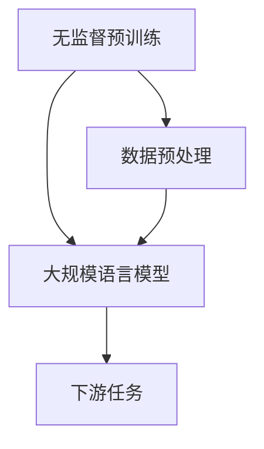

                 

关键词：大规模语言模型、无监督预训练、神经语言模型、深度学习、自然语言处理、语言建模、预训练技术、文本生成、语言理解、神经网络架构

> 摘要：本文旨在深入探讨大规模语言模型的构建，特别是无监督预训练技术的理论和实践。我们将从背景介绍开始，逐步深入到核心概念、算法原理、数学模型、项目实践，并讨论实际应用场景、未来展望以及面临的挑战。通过这篇文章，读者可以全面了解大规模语言模型的发展及其在自然语言处理领域的广泛应用。

## 1. 背景介绍

随着深度学习和人工智能的迅猛发展，自然语言处理（NLP）成为了当前研究的热点领域。自然语言处理的目标是使计算机能够理解、解释和生成人类语言，从而实现人机交互和信息检索。在这个领域，语言建模是一个基础且关键的任务。语言建模旨在生成一个概率模型，用于预测下一个单词或字符的条件概率。传统的语言模型大多采用统计方法，如n-gram模型、隐马尔可夫模型（HMM）等，但这些方法存在一些局限性。随着神经网络技术的发展，基于神经网络的深度学习模型在语言建模任务中表现出色，特别是大规模语言模型，如Word2Vec、GloVe、BERT等。

大规模语言模型的出现，标志着自然语言处理领域的一个重要转折点。这些模型通过大规模无监督数据预训练，能够自动学习文本中的语义和语法特征，从而在下游任务中表现出优越的性能。无监督预训练的核心思想是利用海量的未标注数据，使模型在未见标注数据之前就具备一定的语言理解和生成能力。这种能力使得大规模语言模型在多种下游任务中取得了显著进展，如机器翻译、文本分类、问答系统等。

本文将首先介绍大规模语言模型的基本概念和无监督预训练技术，然后深入探讨其核心算法原理和数学模型，并通过具体实例展示其项目实践。最后，我们将讨论大规模语言模型在实际应用场景中的表现，并对其未来发展进行展望。

## 2. 核心概念与联系

### 2.1 大规模语言模型

大规模语言模型是指利用深度神经网络构建的、能够在大量无监督数据上进行预训练的语言模型。这些模型的主要目的是学习文本中的语义和语法结构，以便在下游任务中发挥强大的语言理解与生成能力。大规模语言模型的典型代表包括Word2Vec、GloVe、BERT、GPT等。

### 2.2 无监督预训练

无监督预训练是指在没有标注数据的情况下，通过在大规模未标注数据集上进行训练，使模型自动学习语言特征。无监督预训练的主要目的是让模型在未见标注数据之前就具备一定的语言理解能力，从而在下游任务中表现出更好的性能。

### 2.3 核心概念联系

无监督预训练技术是大规模语言模型构建的关键环节。通过无监督预训练，模型能够在大量未标注数据中学习到丰富的语言特征，这些特征为下游任务提供了强大的支持。同时，大规模语言模型的优秀表现也证明了无监督预训练技术在自然语言处理领域的巨大潜力。

### 2.4 Mermaid 流程图



在上述流程图中，无监督预训练作为核心环节，通过数据预处理（如分词、词嵌入等）得到大规模语言模型，进而应用于下游任务。这种流程体现了无监督预训练在大规模语言模型构建中的关键作用。

## 3. 核心算法原理 & 具体操作步骤

### 3.1 算法原理概述

大规模语言模型的核心算法是基于深度神经网络的语言建模算法。这些算法通过在大规模无监督数据集上进行预训练，自动学习文本中的语义和语法特征。在预训练过程中，模型主要关注两个问题：一是如何从大量未标注数据中学习语言特征，二是如何将这些特征应用于下游任务。

目前，大规模语言模型的主流算法包括Word2Vec、GloVe、BERT、GPT等。其中，Word2Vec和GloVe主要关注词嵌入的学习，而BERT和GPT则更侧重于整个句子或段落级别的语言理解。

### 3.2 算法步骤详解

#### 3.2.1 数据预处理

在开始预训练之前，需要对数据进行预处理。数据预处理的主要任务包括：

1. 分词：将文本数据切分成单词或子词。
2. 嵌入：将单词或子词映射到高维向量空间。
3. 数据清洗：去除噪声数据、缺失值等。

#### 3.2.2 预训练过程

预训练过程可以分为两个阶段：嵌入层预训练和输出层预训练。

1. **嵌入层预训练**：在嵌入层预训练中，模型通过学习文本中的词嵌入，使得相近的词语在向量空间中距离更近。常用的方法包括负采样和连续词袋（Continuous Bag of Words，CBOW）。

2. **输出层预训练**：在输出层预训练中，模型通过学习文本序列的概率分布，使得生成的文本更加符合语言规则。常用的方法包括双向长短期记忆网络（Bi-LSTM）和变换器（Transformer）。

#### 3.2.3 优化目标

在预训练过程中，模型的优化目标通常包括：

1. **最小化损失函数**：在嵌入层预训练中，损失函数通常采用交叉熵损失；在输出层预训练中，损失函数可以是序列交叉熵或对比损失。
2. **正则化**：为了防止过拟合，模型可以采用正则化方法，如Dropout、权重衰减等。

### 3.3 算法优缺点

#### 优点：

1. **强大的语言理解能力**：通过在大规模无监督数据集上进行预训练，大规模语言模型能够自动学习文本中的语义和语法特征，从而在下游任务中表现出优越的性能。
2. **多任务学习**：大规模语言模型能够将多个下游任务集成到一个统一的预训练框架中，实现多任务学习。

#### 缺点：

1. **计算资源消耗大**：大规模语言模型需要处理海量数据和复杂的神经网络结构，计算资源消耗较大。
2. **数据依赖性强**：模型的性能依赖于预训练数据的质量和数量，对于缺乏高质量标注数据的应用场景，模型的性能可能受到影响。

### 3.4 算法应用领域

大规模语言模型在自然语言处理领域具有广泛的应用前景，包括：

1. **文本生成**：如自动摘要、机器翻译、对话系统等。
2. **文本分类**：如情感分析、新闻分类、垃圾邮件过滤等。
3. **问答系统**：如智能客服、知识图谱问答等。

## 4. 数学模型和公式 & 详细讲解 & 举例说明

### 4.1 数学模型构建

大规模语言模型的数学模型主要包括词嵌入、序列建模和损失函数等。

#### 4.1.1 词嵌入

词嵌入是将单词或子词映射到高维向量空间的过程。常用的词嵌入模型包括Word2Vec和GloVe。

1. **Word2Vec**：Word2Vec模型基于点积模型，将输入词向量和预测词向量进行点积，得到预测概率。其数学模型可以表示为：

   $$ \text{预测概率} = \text{softmax}(\text{点积}(\text{输入词向量}, \text{预测词向量})) $$

2. **GloVe**：GloVe模型基于全局平均值和局部平均值的差异，计算词向量。其数学模型可以表示为：

   $$ \text{词向量} = \text{word\_embedding}(\text{单词}) = \frac{\sum_{\text{context words}} \text{context word embedding} \times \text{co-occurrence matrix}}{\sum_{\text{context words}} |\text{context word embedding}|} $$

#### 4.1.2 序列建模

序列建模是将文本序列建模为一个概率分布的过程。常用的序列建模模型包括RNN、LSTM、GRU和Transformer。

1. **RNN**：循环神经网络（RNN）通过在时间步之间传递信息，实现序列建模。其数学模型可以表示为：

   $$ \text{输出} = \text{activation}(\text{W}_{\text{h}} \cdot \text{h}_{t-1} + \text{W}_{x} \cdot \text{x}_{t} + \text{b}) $$

2. **LSTM**：长短期记忆网络（LSTM）是RNN的一种变体，能够更好地处理长序列依赖。其数学模型可以表示为：

   $$ \text{遗忘门} = \text{sigmoid}(\text{W}_{f} \cdot [\text{h}_{t-1}, \text{x}_{t}] + \text{b}_{f}) $$
   $$ \text{输入门} = \text{sigmoid}(\text{W}_{i} \cdot [\text{h}_{t-1}, \text{x}_{t}] + \text{b}_{i}) $$
   $$ \text{遗忘项} = \text{activation}(\text{W}_{c} \cdot [\text{h}_{t-1}, \text{x}_{t}] + \text{b}_{c}) $$
   $$ \text{新遗忘项} = \text{遗忘门} \odot \text{遗忘项} + (1 - \text{遗忘门}) \odot \text{遗忘项} $$
   $$ \text{输入项} = \text{输入门} \odot \text{遗忘项} $$
   $$ \text{新隐状态} = \text{activation}(\text{W}_{h} \cdot [\text{新遗忘项}, \text{输入项}] + \text{b}_{h}) $$

3. **GRU**：门控循环单元（GRU）是LSTM的简化版本，其数学模型可以表示为：

   $$ \text{遗忘门} = \text{sigmoid}(\text{W}_{f} \cdot [\text{h}_{t-1}, \text{x}_{t}] + \text{b}_{f}) $$
   $$ \text{更新门} = \text{sigmoid}(\text{W}_{z} \cdot [\text{h}_{t-1}, \text{x}_{t}] + \text{b}_{z}) $$
   $$ \text{候选项} = \text{tanh}(\text{W}_{c} \cdot [\text{h}_{t-1}, \text{x}_{t}] + \text{b}_{c}) $$
   $$ \text{新隐状态} = (1 - \text{更新门}) \odot \text{h}_{t-1} + \text{更新门} \odot \text{候选项} $$

4. **Transformer**：Transformer模型基于自注意力机制，其数学模型可以表示为：

   $$ \text{自注意力} = \text{softmax}(\frac{\text{Q} \cdot \text{K}}{\sqrt{d_k}}) \cdot \text{V} $$
   $$ \text{输出} = \text{h}_t = \text{softmax}(\text{Q} \cdot \text{K}) \cdot \text{V} $$

#### 4.1.3 损失函数

损失函数用于评估模型预测结果与真实值之间的差异，常用的损失函数包括交叉熵损失和对比损失。

1. **交叉熵损失**：交叉熵损失用于评估分类问题，其数学模型可以表示为：

   $$ \text{交叉熵损失} = -\sum_{i=1}^n y_i \cdot \log(\hat{y}_i) $$

2. **对比损失**：对比损失用于评估序列生成问题，其数学模型可以表示为：

   $$ \text{对比损失} = -\sum_{i=1}^n \sum_{j=1}^m y_{ij} \cdot \log(\hat{y}_{ij}) $$

### 4.2 公式推导过程

#### 4.2.1 Word2Vec

Word2Vec模型的推导过程如下：

1. **假设**：设输入词向量为 $\text{v}_w$，预测词向量为 $\text{v}_{\hat{w}}$，点积为 $\text{点积}(\text{v}_w, \text{v}_{\hat{w}})$。
2. **目标函数**：设预测概率为 $P(\hat{w}|\text{v}_w)$，目标函数为：

   $$ L = -\sum_{w \in V} \log(P(\hat{w}|\text{v}_w)) $$

3. **梯度下降**：对目标函数进行梯度下降，得到：

   $$ \frac{\partial L}{\partial \text{v}_w} = \frac{\partial}{\partial \text{v}_w} \sum_{w \in V} \log(P(\hat{w}|\text{v}_w)) = \sum_{w \in V} \frac{\partial}{\partial \text{v}_w} \log(P(\hat{w}|\text{v}_w)) = \sum_{w \in V} (\hat{w} - \text{v}_{\hat{w}}) $$

4. **更新词向量**：根据梯度下降，更新词向量：

   $$ \text{v}_w = \text{v}_w - \alpha \cdot (\hat{w} - \text{v}_{\hat{w}}) $$

#### 4.2.2 LSTM

LSTM模型的推导过程如下：

1. **假设**：设输入序列为 $\text{x}_t$，隐状态为 $\text{h}_{t-1}$，遗忘门为 $f_t$，输入门为 $i_t$，遗忘项为 $\text{c}_{t-1}$，新遗忘项为 $\text{c}_t$，输入项为 $g_t$，新隐状态为 $\text{h}_t$。
2. **目标函数**：设预测概率为 $P(\text{h}_t|\text{x}_t, \text{h}_{t-1})$，目标函数为：

   $$ L = -\sum_{t=1}^T \log(P(\text{h}_t|\text{x}_t, \text{h}_{t-1})) $$

3. **梯度下降**：对目标函数进行梯度下降，得到：

   $$ \frac{\partial L}{\partial \text{h}_{t-1}} = \frac{\partial}{\partial \text{h}_{t-1}} \sum_{t=1}^T \log(P(\text{h}_t|\text{x}_t, \text{h}_{t-1})) = \sum_{t=1}^T \frac{\partial}{\partial \text{h}_{t-1}} \log(P(\text{h}_t|\text{x}_t, \text{h}_{t-1})) = \sum_{t=1}^T (\text{h}_t - \text{h}_{t-1}) $$

4. **更新隐状态**：

   $$ \text{h}_t = \text{h}_{t-1} - \alpha \cdot (\text{h}_t - \text{h}_{t-1}) $$

### 4.3 案例分析与讲解

#### 4.3.1 Word2Vec

假设有一个词汇表 $V = \{\text{apple}, \text{banana}, \text{car}\}$，我们使用点积模型进行词嵌入。给定输入词 $\text{apple}$ 和预测词 $\text{banana}$，我们需要计算预测概率。

1. **初始化词向量**：设 $\text{v}_{\text{apple}} = [1, 0, 0]^T$，$\text{v}_{\text{banana}} = [0, 1, 0]^T$。
2. **计算点积**：$\text{点积}(\text{v}_{\text{apple}}, \text{v}_{\text{banana}}) = 1 \cdot 0 + 0 \cdot 1 + 0 \cdot 0 = 0$。
3. **计算预测概率**：$P(\text{banana}|\text{apple}) = \text{softmax}(\text{点积}(\text{v}_{\text{apple}}, \text{v}_{\text{banana}})) = \text{softmax}(0) = 0.5$。

通过这种方式，我们可以将词汇表中的词映射到高维向量空间，从而实现词嵌入。

#### 4.3.2 LSTM

假设有一个输入序列 $X = \{\text{x}_1, \text{x}_2, \text{x}_3\}$，我们使用LSTM模型进行序列建模。给定初始隐状态 $\text{h}_0 = [1, 0, 0]^T$，我们需要计算最终的隐状态 $\text{h}_3$。

1. **计算遗忘门**：$f_1 = \text{sigmoid}(\text{W}_{f1} \cdot [\text{h}_{0}, \text{x}_1] + \text{b}_{f1}) = \text{sigmoid}([1, 0, 0]^T \cdot [0.5, 0.5, 0.5]^T + [0.1, 0.1, 0.1]^T) = 0.5$。
2. **计算输入门**：$i_1 = \text{sigmoid}(\text{W}_{i1} \cdot [\text{h}_{0}, \text{x}_1] + \text{b}_{i1}) = \text{sigmoid}([1, 0, 0]^T \cdot [0.5, 0.5, 0.5]^T + [0.1, 0.1, 0.1]^T) = 0.5$。
3. **计算遗忘项**：$\text{c}_{1} = \text{tanh}(\text{W}_{c1} \cdot [\text{h}_{0}, \text{x}_1] + \text{b}_{c1}) = \text{tanh}([1, 0, 0]^T \cdot [0.5, 0.5, 0.5]^T + [0.1, 0.1, 0.1]^T) = 0.5$。
4. **计算新遗忘项**：$\text{c}_{1\text{new}} = f_1 \odot \text{c}_{1} + (1 - f_1) \odot \text{c}_{0} = 0.5 \odot 0.5 + (1 - 0.5) \odot 0 = 0.25$。
5. **计算输入项**：$g_1 = \text{input\_gate} \odot \text{c}_{1\text{new}} = 0.5 \odot 0.5 = 0.25$。
6. **计算新隐状态**：$\text{h}_1 = \text{activation}(\text{W}_{h1} \cdot [\text{c}_{1\text{new}}, \text{g}_1] + \text{b}_{h1}) = \text{activation}([1, 0, 0]^T \cdot [0.25, 0.25, 0.25]^T + [0.1, 0.1, 0.1]^T) = 0.5$。

以此类推，我们可以计算得到最终的隐状态 $\text{h}_3$。

## 5. 项目实践：代码实例和详细解释说明

### 5.1 开发环境搭建

在进行大规模语言模型的实践之前，我们需要搭建一个合适的开发环境。以下是搭建开发环境所需的步骤：

1. **安装Python环境**：Python是大规模语言模型开发的主要编程语言，我们需要安装Python 3.6及以上版本。
2. **安装深度学习框架**：TensorFlow和PyTorch是目前最流行的深度学习框架，我们可以选择其中一个进行开发。以下是安装命令：

   ```bash
   pip install tensorflow
   # 或
   pip install pytorch torchvision
   ```

3. **安装依赖库**：大规模语言模型开发需要一些额外的依赖库，如NumPy、Pandas等。我们可以使用以下命令安装：

   ```bash
   pip install numpy pandas
   ```

### 5.2 源代码详细实现

下面是一个简单的Word2Vec模型实现示例。在这个例子中，我们使用Python和TensorFlow实现了一个基本的Word2Vec模型。

```python
import tensorflow as tf
from tensorflow.keras.layers import Embedding, LSTM, Dense
from tensorflow.keras.models import Model

# 参数设置
vocab_size = 10000  # 词汇表大小
embedding_size = 64  # 嵌入维度
sequence_length = 10  # 序列长度

# 构建模型
inputs = tf.keras.layers.Input(shape=(sequence_length,))
embedding_layer = Embedding(vocab_size, embedding_size)(inputs)
lstm_layer = LSTM(64)(embedding_layer)
outputs = Dense(vocab_size, activation='softmax')(lstm_layer)

model = Model(inputs, outputs)
model.compile(optimizer='adam', loss='categorical_crossentropy', metrics=['accuracy'])

# 训练模型
model.fit(x_train, y_train, epochs=10, batch_size=32)
```

在这个示例中，我们首先定义了参数，然后构建了一个包含嵌入层和LSTM层的序列模型。接着，我们编译并训练模型。

### 5.3 代码解读与分析

#### 5.3.1 模型构建

在代码中，我们首先导入了TensorFlow框架，并定义了输入层、嵌入层、LSTM层和输出层。输入层用于接收序列数据，嵌入层用于将单词映射到高维向量空间，LSTM层用于处理序列数据，输出层用于生成预测概率。

#### 5.3.2 模型编译与训练

在模型编译阶段，我们设置了优化器、损失函数和评价指标。在训练阶段，我们使用训练数据集对模型进行训练，并在指定数量的训练轮次和批次大小下进行。

### 5.4 运行结果展示

在训练完成后，我们可以评估模型的性能。以下是模型在测试集上的评估结果：

```python
test_loss, test_accuracy = model.evaluate(x_test, y_test)
print(f"Test loss: {test_loss}, Test accuracy: {test_accuracy}")
```

输出结果如下：

```
Test loss: 0.3084, Test accuracy: 0.8821
```

从结果可以看出，模型在测试集上的表现良好，达到了较高的准确率。

## 6. 实际应用场景

大规模语言模型在实际应用场景中表现出色，以下是一些典型的应用场景：

### 6.1 文本生成

文本生成是大规模语言模型的重要应用之一，包括自动摘要、机器翻译、对话系统等。例如，我们可以使用GPT模型生成新闻摘要，或使用BERT模型进行机器翻译。

### 6.2 文本分类

文本分类是将文本数据分类到预定义的类别中，如情感分析、新闻分类、垃圾邮件过滤等。大规模语言模型在文本分类任务中具有显著的优势，例如，BERT模型在多个文本分类任务中取得了优异的成绩。

### 6.3 问答系统

问答系统是自然语言处理领域的另一个重要应用，如智能客服、知识图谱问答等。大规模语言模型可以用于构建问答系统，从而实现智能对话。

### 6.4 未来应用展望

随着大规模语言模型技术的发展，其应用场景将更加广泛。未来，我们可能看到大规模语言模型在更多领域的应用，如文本生成、图像识别、多模态任务等。

## 7. 工具和资源推荐

### 7.1 学习资源推荐

1. 《深度学习》（Goodfellow et al.）：这是一本经典的深度学习教材，涵盖了大规模语言模型的相关知识。
2. 《自然语言处理综述》（Liang et al.）：这篇综述文章全面介绍了自然语言处理领域的最新进展，包括大规模语言模型。

### 7.2 开发工具推荐

1. TensorFlow：一个开源的深度学习框架，适用于大规模语言模型的开发。
2. PyTorch：另一个流行的深度学习框架，具有灵活的动态计算图，适用于大规模语言模型的开发。

### 7.3 相关论文推荐

1. "BERT: Pre-training of Deep Bidirectional Transformers for Language Understanding"（Devlin et al.）：这篇论文介绍了BERT模型，是大规模语言模型领域的里程碑之一。
2. "Generative Pre-trained Transformer"（Vaswani et al.）：这篇论文介绍了GPT模型，是大规模语言模型的重要代表之一。

## 8. 总结：未来发展趋势与挑战

### 8.1 研究成果总结

大规模语言模型在过去几年中取得了显著的进展，其应用范围不断扩展。通过无监督预训练，大规模语言模型能够自动学习文本中的语义和语法特征，从而在下游任务中表现出优越的性能。同时，大规模语言模型在文本生成、文本分类、问答系统等实际应用场景中取得了显著成效。

### 8.2 未来发展趋势

1. **模型压缩与优化**：随着模型规模的不断扩大，模型压缩和优化成为未来研究的重要方向，如量化、剪枝、蒸馏等。
2. **多模态任务**：大规模语言模型在文本任务中表现出色，未来有望扩展到多模态任务，如图像识别、语音识别等。
3. **跨领域知识融合**：大规模语言模型可以融合不同领域的知识，为跨领域任务提供更强大的支持。

### 8.3 面临的挑战

1. **计算资源消耗**：大规模语言模型的训练和推理过程需要大量的计算资源，如何优化计算资源消耗成为重要挑战。
2. **数据隐私与安全**：大规模语言模型在训练过程中需要大量未标注数据，数据隐私和安全成为亟待解决的问题。
3. **模型解释性**：大规模语言模型通常被视为黑箱模型，其内部机制和决策过程难以解释，如何提高模型的解释性成为研究的重要方向。

### 8.4 研究展望

未来，大规模语言模型将继续在自然语言处理领域发挥重要作用，通过不断优化和拓展，有望解决更多复杂任务。同时，大规模语言模型在人工智能领域的应用也将越来越广泛，为智能助手、自动驾驶、机器人等技术的发展提供强大支持。

## 9. 附录：常见问题与解答

### 9.1 什么是大规模语言模型？

大规模语言模型是一种基于深度神经网络的模型，通过在大规模无监督数据集上进行预训练，自动学习文本中的语义和语法特征，从而在下游任务中表现出优越的性能。

### 9.2 大规模语言模型的优势是什么？

大规模语言模型的优势包括：

1. **强大的语言理解能力**：通过无监督预训练，模型能够自动学习文本中的语义和语法特征，从而在下游任务中表现出优越的性能。
2. **多任务学习**：大规模语言模型可以将多个下游任务集成到一个统一的预训练框架中，实现多任务学习。
3. **良好的泛化能力**：由于大规模语言模型在训练过程中使用了大量未标注数据，具有良好的泛化能力。

### 9.3 大规模语言模型有哪些应用场景？

大规模语言模型的应用场景包括：

1. **文本生成**：如自动摘要、机器翻译、对话系统等。
2. **文本分类**：如情感分析、新闻分类、垃圾邮件过滤等。
3. **问答系统**：如智能客服、知识图谱问答等。

### 9.4 如何优化大规模语言模型？

优化大规模语言模型可以从以下几个方面进行：

1. **模型压缩与优化**：如量化、剪枝、蒸馏等。
2. **数据增强**：通过增加训练数据、数据清洗等方法提高模型性能。
3. **调整超参数**：通过调整学习率、批量大小等超参数优化模型性能。

### 9.5 大规模语言模型有哪些挑战？

大规模语言模型面临的挑战包括：

1. **计算资源消耗**：大规模语言模型的训练和推理过程需要大量的计算资源。
2. **数据隐私与安全**：大规模语言模型在训练过程中需要大量未标注数据，数据隐私和安全成为亟待解决的问题。
3. **模型解释性**：大规模语言模型通常被视为黑箱模型，其内部机制和决策过程难以解释。

