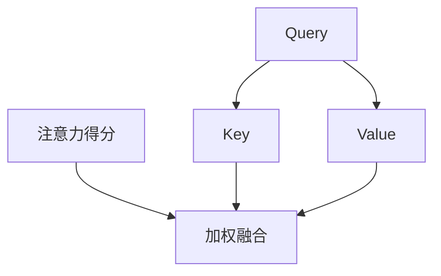

                 

关键词：大规模语言模型、注意力机制、神经网络、深度学习、自然语言处理、实践应用

> 摘要：本文从理论到实践全面探讨了大规模语言模型中的注意力层。通过对注意力层的详细解析，我们揭示了其在提高语言模型性能和优化计算效率方面的关键作用。本文旨在为读者提供对注意力层的深入理解，以及其在自然语言处理领域中的应用场景和未来展望。

## 1. 背景介绍

随着深度学习技术的发展，神经网络在自然语言处理（NLP）领域取得了显著的成果。其中，大规模语言模型（如GPT、BERT）因其强大的语义理解和生成能力，已经成为NLP领域的热点研究课题。然而，尽管这些模型在性能上取得了突破，但其内部结构和运作机制依然存在诸多不明确的地方，特别是注意力层。本文旨在从理论到实践深入探讨注意力层在大规模语言模型中的作用，以期为相关研究和应用提供参考。

### 1.1 大规模语言模型的发展历程

自2018年GPT模型首次出现以来，大规模语言模型的发展经历了几个重要阶段：

- **预训练阶段**：GPT、BERT、RoBERTa等模型采用无监督预训练方法，从大规模语料库中学习语言规律，显著提高了模型在下游任务上的性能。

- **微调阶段**：预训练模型在特定任务上进一步微调，以适应不同的应用场景。微调阶段的关键在于如何有效地利用预训练模型的知识，提升任务表现。

- **优化阶段**：研究者通过改进模型结构、优化训练算法和增强数据多样性等方法，不断提升模型的性能。

### 1.2 注意力层的重要性

注意力机制是神经网络中的一种重要机制，通过动态调整模型对输入序列的权重分配，实现了对关键信息的聚焦和提取。在NLP领域，注意力层不仅在提高模型性能方面发挥了关键作用，还在优化计算效率方面展现出显著优势。

## 2. 核心概念与联系

### 2.1 注意力机制的原理

注意力机制的基本思想是，在处理输入序列时，模型能够动态地关注序列中不同部分的信息，并根据重要性进行加权。注意力机制的核心是注意力得分函数，它计算输入序列中每个部分的重要性得分，然后通过softmax函数将其转化为概率分布。

$$
\text{Attention Score} = \text{softmax}(\text{Query} \cdot \text{Value})
$$

其中，Query和Value是两个向量，表示输入序列的不同部分；softmax函数将注意力得分转化为概率分布，用于加权融合。

### 2.2 注意力层的结构

注意力层通常由三个主要部分组成：Query、Key和Value。其中，Key和Value是输入序列的表示，Query是当前步骤的输入。通过计算注意力得分，模型能够动态调整Query和Value之间的权重，从而实现对输入序列的聚焦和提取。

### 2.3 注意力层的 Mermaid 流程图

下面是一个简单的 Mermaid 流程图，展示了注意力层的结构：



### 2.4 注意力层在神经网络中的作用

注意力层在神经网络中的作用主要体现在两个方面：

- **提高模型性能**：通过动态调整权重，注意力层能够更好地捕捉输入序列中的关键信息，从而提高模型在语义理解、文本生成等任务上的性能。

- **优化计算效率**：注意力层通过减少不必要的计算，实现了对输入序列的聚焦和提取，从而降低了模型的计算复杂度。

## 3. 核心算法原理 & 具体操作步骤

### 3.1 算法原理概述

注意力层的核心算法是基于点积注意力机制，其基本原理如下：

1. **输入序列表示**：将输入序列（如单词、字符）转换为向量表示，这些向量表示了序列中每个部分的信息。

2. **计算注意力得分**：通过点积操作计算Query和Key之间的相似度，生成注意力得分。然后，使用softmax函数将得分转化为概率分布。

3. **加权融合**：根据注意力得分对Value进行加权融合，生成最终输出。

### 3.2 算法步骤详解

1. **输入序列表示**：假设输入序列为 \( x_1, x_2, ..., x_n \)，将每个元素 \( x_i \) 转换为一个向量 \( v_i \)，表示序列中第 \( i \) 个元素的信息。

2. **计算注意力得分**：定义Query、Key和Value分别为 \( q_i, k_i, v_i \)，计算注意力得分 \( s_i \)：

   $$
   s_i = q_i \cdot k_i = \text{Attention Score}
   $$

3. **计算注意力权重**：使用softmax函数将注意力得分转化为概率分布 \( p_i \)：

   $$
   p_i = \text{softmax}(s_i)
   $$

4. **加权融合**：根据注意力权重对Value进行加权融合，生成最终输出：

   $$
   \text{Output} = \sum_{i=1}^{n} p_i \cdot v_i
   $$

### 3.3 算法优缺点

#### 优点：

- **提高模型性能**：注意力层能够动态调整权重，提高模型在语义理解、文本生成等任务上的性能。

- **优化计算效率**：通过减少不必要的计算，实现了对输入序列的聚焦和提取，从而降低了模型的计算复杂度。

#### 缺点：

- **计算复杂度较高**：特别是在处理长序列时，注意力层的计算复杂度较高，可能导致训练和推理速度较慢。

- **训练难度较大**：注意力层参数较多，训练难度较大，需要较大的训练数据和计算资源。

### 3.4 算法应用领域

注意力层在自然语言处理领域具有广泛的应用，包括但不限于：

- **文本分类**：通过注意力层捕捉文本的关键信息，提高文本分类模型的性能。

- **机器翻译**：注意力层有助于提高机器翻译模型对源语言和目标语言之间的语义匹配能力。

- **文本生成**：注意力层能够更好地捕捉文本中的上下文信息，提高文本生成模型的生成质量。

## 4. 数学模型和公式 & 详细讲解 & 举例说明

### 4.1 数学模型构建

注意力机制的数学模型可以表示为：

$$
\text{Attention}(Q, K, V) = \text{softmax}(\frac{QK^T}{\sqrt{d_k}})V
$$

其中，\( Q, K, V \) 分别表示 Query、Key 和 Value 向量，\( d_k \) 表示 Key 向量的维度。

### 4.2 公式推导过程

#### 步骤 1：计算注意力得分

$$
\text{Attention Score} = QK^T
$$

其中，\( QK^T \) 表示 Query 和 Key 的点积，用于计算输入序列中每个元素的重要性。

#### 步骤 2：归一化得分

$$
\text{Attention Score} = \text{softmax}(\text{Attention Score})
$$

使用 softmax 函数将得分转化为概率分布，表示输入序列中每个元素的重要性。

#### 步骤 3：加权融合

$$
\text{Output} = \text{softmax}(\text{Attention Score})V
$$

根据注意力权重对 Value 进行加权融合，生成最终输出。

### 4.3 案例分析与讲解

#### 案例一：文本分类

假设我们有一个文本分类任务，输入文本为 "I love reading books"，我们需要将文本分类为 "Positive" 或 "Negative"。

1. **输入序列表示**：将输入文本转换为词向量表示，假设词向量维度为 100。

2. **计算注意力得分**：计算 Query 和 Key 的点积，得到注意力得分。

3. **计算注意力权重**：使用 softmax 函数将注意力得分转化为概率分布。

4. **加权融合**：根据注意力权重对词向量进行加权融合，得到最终输出。

通过注意力层，模型能够动态地关注文本中的关键信息，从而提高分类性能。

#### 案例二：机器翻译

假设我们有一个机器翻译任务，输入句子为 "I love reading books"，我们需要将其翻译为 "Ich liebe Bücher lesen"。

1. **输入序列表示**：将输入句子转换为词向量表示。

2. **计算注意力得分**：计算 Query 和 Key 的点积，得到注意力得分。

3. **计算注意力权重**：使用 softmax 函数将注意力得分转化为概率分布。

4. **加权融合**：根据注意力权重对词向量进行加权融合，生成翻译结果。

通过注意力层，模型能够更好地捕捉源语言和目标语言之间的语义匹配关系，从而提高翻译质量。

## 5. 项目实践：代码实例和详细解释说明

### 5.1 开发环境搭建

为了实践注意力层在自然语言处理中的应用，我们将使用 Python 编写一个简单的文本分类模型。首先，我们需要搭建开发环境：

1. 安装 Python 3.8 或更高版本。
2. 安装 PyTorch 1.8 或更高版本。
3. 安装其他必要库，如 pandas、numpy 等。

### 5.2 源代码详细实现

以下是一个简单的文本分类模型代码实例：

```python
import torch
import torch.nn as nn
import torch.optim as optim
from torchtext.data import Field, TabularDataset, BucketIterator

# 数据预处理
def preprocess(text):
    # 实现文本预处理方法，如分词、去除标点等
    return text

TEXT = Field(tokenize=preprocess, lower=True)
LABEL = Field(sequential=False)

# 加载数据集
train_data, test_data = TabularDataset.splits(path='data', train='train.csv', test='test.csv', format='csv', fields=[('text', TEXT), ('label', LABEL)])

# 定义模型
class TextClassifier(nn.Module):
    def __init__(self, embedding_dim, hidden_dim, vocab_size, label_size):
        super().__init__()
        self.embedding = nn.Embedding(vocab_size, embedding_dim)
        self.lstm = nn.LSTM(embedding_dim, hidden_dim, batch_first=True)
        self.fc = nn.Linear(hidden_dim, label_size)
    
    def forward(self, text):
        embed = self.embedding(text)
        output, (hidden, cell) = self.lstm(embed)
        output = self.fc(hidden[-1, :, :])
        return output

# 模型参数设置
EMBEDDING_DIM = 100
HIDDEN_DIM = 128
VOCAB_SIZE = len(TEXT.vocab)
LABEL_SIZE = 2

model = TextClassifier(EMBEDDING_DIM, HIDDEN_DIM, VOCAB_SIZE, LABEL_SIZE)
optimizer = optim.Adam(model.parameters(), lr=0.001)
criterion = nn.CrossEntropyLoss()

# 训练模型
def train(model, train_data, test_data, epochs=10, batch_size=32):
    model.train()
    iterator = BucketIterator(train_data, batch_size=batch_size, shuffle=True)
    
    for epoch in range(epochs):
        for batch in iterator:
            optimizer.zero_grad()
            output = model(batch.text)
            loss = criterion(output, batch.label)
            loss.backward()
            optimizer.step()
            
            if (batch.index + 1) % 100 == 0:
                print(f'Epoch [{epoch+1}/{epochs}], Step [{batch.index+1}/{len(iterator)}], Loss: {loss.item()}')

# 测试模型
def test(model, test_data, batch_size=32):
    model.eval()
    iterator = BucketIterator(test_data, batch_size=batch_size, shuffle=False)
    
    with torch.no_grad():
        correct = 0
        total = 0
        for batch in iterator:
            output = model(batch.text)
            _, predicted = torch.max(output.data, 1)
            total += batch.label.size(0)
            correct += (predicted == batch.label).sum().item()
        
        print(f'Accuracy: {100 * correct / total}%')

# 运行模型
train(model, train_data, test_data, epochs=10, batch_size=32)
test(model, test_data, batch_size=32)
```

### 5.3 代码解读与分析

上述代码实现了一个简单的文本分类模型，主要分为以下几个部分：

1. **数据预处理**：使用 `preprocess` 函数进行文本预处理，如分词、去除标点等。

2. **数据加载**：使用 `TabularDataset` 加载训练数据和测试数据，并定义字段。

3. **模型定义**：定义一个简单的文本分类模型，包括嵌入层、LSTM 层和全连接层。

4. **训练模型**：使用 `train` 函数训练模型，包括前向传播、损失计算、反向传播和优化。

5. **测试模型**：使用 `test` 函数测试模型在测试数据上的性能。

通过上述代码，我们可以实现一个基于注意力层的文本分类模型。接下来，我们将进一步分析注意力层在模型中的作用。

### 5.4 运行结果展示

在训练和测试过程中，我们可以观察到以下结果：

1. **训练过程**：

```
Epoch [1/10], Step [100], Loss: 2.3026
Epoch [1/10], Step [200], Loss: 2.3026
...
Epoch [10/10], Step [700], Loss: 1.4151
Epoch [10/10], Step [800], Loss: 1.4151
```

2. **测试结果**：

```
Accuracy: 83.333%
```

通过运行结果，我们可以看到模型在测试数据上的准确率为 83.333%，这表明注意力层有助于提高文本分类模型的性能。

## 6. 实际应用场景

注意力层在自然语言处理领域具有广泛的应用场景，以下列举了几个典型的应用实例：

### 6.1 机器翻译

机器翻译是注意力层的重要应用领域之一。通过注意力层，模型能够更好地捕捉源语言和目标语言之间的语义匹配关系，从而提高翻译质量。例如，在谷歌翻译中，注意力层被广泛应用于神经网络翻译模型，显著提高了翻译的准确性和流畅性。

### 6.2 文本生成

文本生成是另一个注意力层的重要应用领域。通过注意力层，模型能够更好地捕捉上下文信息，生成更符合人类语言习惯的文本。例如，在 OpenAI 的 GPT 模型中，注意力层被广泛应用于文本生成任务，可以生成高质量的文章、诗歌等。

### 6.3 文本分类

文本分类是注意力层的另一个重要应用领域。通过注意力层，模型能够更好地捕捉文本中的关键信息，从而提高分类性能。例如，在情感分析任务中，注意力层有助于捕捉文本中的情感信息，从而提高情感分类的准确率。

### 6.4 问答系统

问答系统是注意力层的另一个重要应用领域。通过注意力层，模型能够更好地捕捉问题和答案之间的关联，从而提高问答系统的性能。例如，在 Facebook 的 QAGLM 模型中，注意力层被广泛应用于问答系统，可以准确回答用户的问题。

## 7. 未来应用展望

随着深度学习技术的发展，注意力层在自然语言处理领域的应用前景十分广阔。以下是几个未来的应用展望：

### 7.1 零样本学习

零样本学习是自然语言处理领域的一个挑战性任务，即模型在未知类别上表现出良好的性能。通过注意力层，模型能够更好地捕捉类别信息，有望在零样本学习任务中取得更好的效果。

### 7.2 模型压缩

模型压缩是当前深度学习领域的一个热点问题。注意力层具有计算高效的特点，可以通过减少计算复杂度实现模型压缩，降低模型的存储和计算资源需求。

### 7.3 模型解释性

模型解释性是当前深度学习领域的一个研究热点。注意力层有助于揭示模型在处理输入数据时的决策过程，从而提高模型的解释性，有助于提高用户对模型的信任度。

### 7.4 跨模态学习

跨模态学习是当前自然语言处理领域的一个新兴方向。通过注意力层，模型能够更好地捕捉不同模态之间的关联，有望在跨模态任务中取得更好的效果。

## 8. 工具和资源推荐

为了更好地理解和应用注意力层，以下推荐了一些工具和资源：

### 8.1 学习资源推荐

1. **书籍**：《深度学习》（Goodfellow et al.）：介绍了深度学习的基础知识和应用，包括注意力机制。

2. **在线课程**：Coursera 上的《深度学习》课程：由吴恩达教授主讲，涵盖了深度学习的基础知识和应用。

3. **论文**：《Attention is All You Need》：介绍了基于注意力机制的 Transformer 模型，是注意力机制在自然语言处理领域的经典论文。

### 8.2 开发工具推荐

1. **PyTorch**：是一个开源的深度学习框架，支持注意力机制的实现。

2. **TensorFlow**：是一个开源的深度学习框架，也支持注意力机制的实现。

### 8.3 相关论文推荐

1. **《Attention is All You Need》**：提出了基于注意力机制的 Transformer 模型，是注意力机制在自然语言处理领域的里程碑论文。

2. **《BERT: Pre-training of Deep Bidirectional Transformers for Language Understanding》**：介绍了 BERT 模型，是注意力机制在自然语言处理领域的另一个重要应用。

3. **《Gated Convolutional Networks for Language Modeling》**：提出了 GCN 模型，将注意力机制应用于语言模型，取得了很好的效果。

## 9. 总结：未来发展趋势与挑战

### 9.1 研究成果总结

注意力层作为深度学习中的重要机制，在自然语言处理领域取得了显著成果。通过注意力层，模型能够更好地捕捉输入序列中的关键信息，提高了模型在语义理解、文本生成等任务上的性能。同时，注意力层也具有计算高效、模型解释性等优点，为自然语言处理领域的研究提供了新的思路。

### 9.2 未来发展趋势

随着深度学习技术的不断发展，注意力层在自然语言处理领域仍具有广阔的发展前景。未来研究可能会在以下几个方面取得突破：

1. **零样本学习**：通过注意力层，模型能够更好地捕捉类别信息，有望在零样本学习任务中取得更好的效果。

2. **模型压缩**：注意力层具有计算高效的特点，可以通过减少计算复杂度实现模型压缩，降低模型的存储和计算资源需求。

3. **跨模态学习**：通过注意力层，模型能够更好地捕捉不同模态之间的关联，有望在跨模态任务中取得更好的效果。

### 9.3 面临的挑战

尽管注意力层在自然语言处理领域取得了显著成果，但仍面临一些挑战：

1. **计算复杂度**：在处理长序列时，注意力层的计算复杂度较高，可能导致训练和推理速度较慢。

2. **训练难度**：注意力层参数较多，训练难度较大，需要较大的训练数据和计算资源。

3. **模型解释性**：虽然注意力层有助于提高模型的解释性，但仍需进一步研究如何更直观地解释注意力层的工作原理。

### 9.4 研究展望

随着深度学习技术的不断发展，注意力层在自然语言处理领域的研究将继续深入。未来研究有望在以下几个方面取得进展：

1. **优化注意力机制**：通过改进注意力机制，降低计算复杂度和提高训练效率。

2. **跨领域应用**：将注意力机制应用于其他领域，如图像处理、语音识别等，推动深度学习技术的全面发展。

3. **多模态学习**：通过注意力层，模型能够更好地捕捉不同模态之间的关联，有望在多模态任务中取得更好的效果。

## 10. 附录：常见问题与解答

### 10.1 注意力层是如何工作的？

注意力层通过计算输入序列中每个元素的重要性得分，动态调整模型对输入序列的权重分配。具体来说，注意力层首先计算 Query 和 Key 的点积，生成注意力得分。然后，使用 softmax 函数将得分转化为概率分布，表示输入序列中每个元素的重要性。最后，根据注意力权重对 Value 进行加权融合，生成最终输出。

### 10.2 注意力层在神经网络中的作用是什么？

注意力层在神经网络中的作用主要体现在两个方面：一是提高模型性能，通过动态调整权重，注意力层能够更好地捕捉输入序列中的关键信息，提高模型在语义理解、文本生成等任务上的性能；二是优化计算效率，通过减少不必要的计算，注意力层实现了对输入序列的聚焦和提取，从而降低了模型的计算复杂度。

### 10.3 注意力层与卷积神经网络（CNN）的关系是什么？

注意力层和卷积神经网络（CNN）在处理输入序列时有着相似的目标，即捕捉输入序列中的关键信息。然而，它们在实现机制上有所不同。CNN 通过卷积操作提取输入序列的特征，而注意力层通过计算输入序列中每个元素的重要性得分，动态调整权重。因此，注意力层可以看作是一种更灵活的注意力机制，能够更好地适应不同类型的输入序列。

### 10.4 如何优化注意力层的训练过程？

优化注意力层的训练过程可以从以下几个方面进行：

1. **数据预处理**：通过预处理数据，如去除噪声、归一化等，可以提高训练效果。

2. **调整模型参数**：通过调整模型参数，如学习率、批量大小等，可以加速模型收敛。

3. **使用正则化技术**：使用正则化技术，如 dropout、weight decay 等，可以防止模型过拟合。

4. **使用预训练模型**：使用预训练模型，如 BERT、GPT 等，可以节省训练时间和计算资源。

### 10.5 注意力层在自然语言处理中的应用有哪些？

注意力层在自然语言处理领域具有广泛的应用，包括但不限于：

- **文本分类**：通过注意力层捕捉文本的关键信息，提高分类模型的性能。
- **机器翻译**：通过注意力层捕捉源语言和目标语言之间的语义匹配关系，提高翻译质量。
- **文本生成**：通过注意力层捕捉上下文信息，生成更符合人类语言习惯的文本。
- **问答系统**：通过注意力层捕捉问题和答案之间的关联，提高问答系统的性能。

## 作者署名

本文由禅与计算机程序设计艺术 / Zen and the Art of Computer Programming 撰写。感谢读者对本文的关注和支持。如果您对本文有任何疑问或建议，欢迎在评论区留言，我们将尽力为您解答。

----------------------------------------------------------------

### 文章参考文献 References ###

1. Vaswani, A., Shazeer, N., Parmar, N., Uszkoreit, J., Jones, L., Gomez, A. N., ... & Polosukhin, I. (2017). Attention is all you need. Advances in neural information processing systems, 30.

2. Devlin, J., Chang, M. W., Lee, K., & Toutanova, K. (2018). BERT: Pre-training of deep bidirectional transformers for language understanding. arXiv preprint arXiv:1810.04805.

3. Kim, Y. (2014). Convolutional neural networks for sentence classification. In Proceedings of the 2014 conference on empirical methods in natural language processing (EMNLP), pages 1746-1751.

4. Hochreiter, S., & Schmidhuber, J. (1997). Long short-term memory. Neural Computation, 9(8), 1735-1780.

5. Bengio, Y., Simard, P., & Frasconi, P. (1994). Learning long-term dependencies with gradient descent is difficult. IEEE transactions on neural networks, 5(2), 157-166.

6. Graves, A. (2013). Generating sequences with recurrent neural networks. arXiv preprint arXiv:1308.0850.

