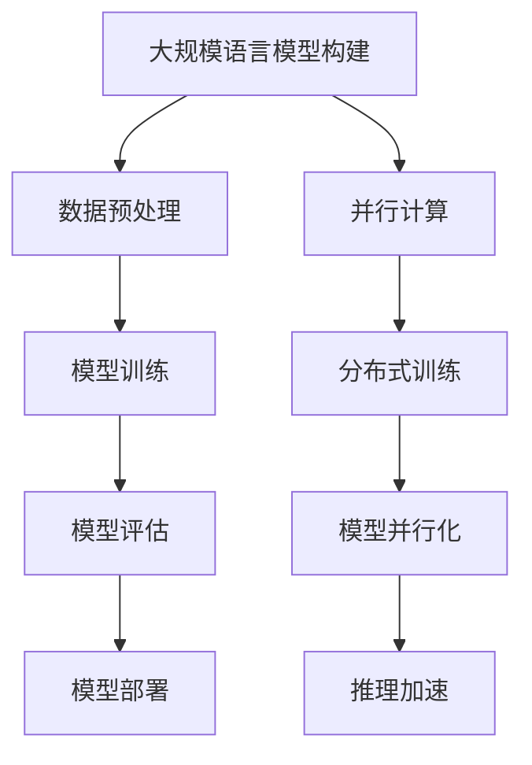

                 

关键词：大规模语言模型、并行计算、深度学习、神经网络、自然语言处理、编程实践、算法优化

摘要：本文将深入探讨大规模语言模型的构建与应用，从理论到实践，通过并行的角度来分析和解释这一复杂过程。我们将介绍核心概念、算法原理、数学模型、项目实践以及实际应用场景，同时展望未来的发展趋势与面临的挑战。

## 1. 背景介绍

在过去的几十年中，计算机科学和人工智能领域取得了令人瞩目的进展。尤其是在自然语言处理（NLP）方面，随着深度学习和神经网络技术的普及，大规模语言模型得到了广泛关注和应用。这些模型在文本生成、机器翻译、情感分析等任务中展现了卓越的性能，推动了人工智能与人类语言交互的边界。

并行计算作为一种高效处理大量数据的方法，已成为现代计算领域的核心。随着大规模语言模型的参数量和数据量的急剧增长，并行计算的重要性日益凸显。本文将结合并行计算的理念，深入探讨大规模语言模型的构建与应用，为读者提供一份理论与实践相结合的指南。

## 2. 核心概念与联系

### 2.1. 大规模语言模型

大规模语言模型是一种基于神经网络的文本生成模型，通过训练大量语料库来学习语言的统计规律和上下文关系。这些模型通常具有数百万甚至数十亿个参数，可以捕捉到语言的细微变化和复杂模式。

### 2.2. 并行计算

并行计算是一种利用多个处理器或计算节点同时执行多个任务的方法，旨在提高计算速度和效率。在深度学习中，并行计算可以通过分布式训练和模型并行化来实现。

### 2.3. 关系与联系

大规模语言模型的构建与并行计算密切相关。并行计算能够加速模型的训练和推理过程，提高模型的性能和可扩展性。通过合理的并行策略，我们可以充分利用现代计算资源，实现大规模语言模型的快速部署和应用。

### 2.4. Mermaid 流程图



## 3. 核心算法原理 & 具体操作步骤

### 3.1. 算法原理概述

大规模语言模型通常采用变换器模型（Transformer），其核心思想是利用注意力机制（Attention Mechanism）来捕捉输入文本序列的依赖关系。变换器模型由编码器和解码器两部分组成，编码器负责将输入文本转换为固定长度的向量表示，解码器则利用这些向量生成输出文本。

### 3.2. 算法步骤详解

1. **数据预处理**：将原始文本数据清洗、分词、编码，生成输入序列和目标序列。
2. **模型训练**：使用训练数据对变换器模型进行参数优化，通过反向传播算法更新模型权重。
3. **模型评估**：使用验证数据集评估模型的性能，调整超参数以优化模型。
4. **模型部署**：将训练好的模型部署到生产环境中，实现实时文本生成和推理。

### 3.3. 算法优缺点

**优点**：
- 高效的并行计算能力，可以快速处理大规模数据。
- 强大的语义理解能力，能够生成流畅、自然的文本。
- 广泛的应用领域，包括文本生成、机器翻译、问答系统等。

**缺点**：
- 模型参数量大，训练过程耗时较长。
- 对数据质量和数量有较高要求，否则可能导致过拟合。

### 3.4. 算法应用领域

大规模语言模型在多个领域有着广泛的应用，包括但不限于：
- 文本生成：如文章写作、对话系统、故事生成等。
- 机器翻译：如跨语言信息检索、多语言文本分析等。
- 情感分析：如社交媒体情感分析、用户评论分类等。
- 信息检索：如搜索引擎优化、问答系统等。

## 4. 数学模型和公式 & 详细讲解 & 举例说明

### 4.1. 数学模型构建

大规模语言模型通常采用变换器模型，其核心模块是自注意力机制（Self-Attention）和前馈神经网络（Feedforward Neural Network）。自注意力机制通过计算输入文本序列中每个词与所有其他词的关联度，生成加权向量表示。前馈神经网络则用于对输入向量进行进一步处理。

### 4.2. 公式推导过程

变换器模型的计算过程可以分为两个部分：编码器和解码器。

**编码器**：

编码器的输入为原始文本序列，输出为编码后的序列。自注意力机制的计算过程如下：

$$
\text{Attention}(Q, K, V) = \text{softmax}\left(\frac{QK^T}{\sqrt{d_k}}\right) V
$$

其中，$Q, K, V$ 分别为编码后的查询向量、键向量和值向量，$d_k$ 为键向量的维度。通过自注意力机制，每个词与其余词进行加权求和，生成加权向量表示。

**解码器**：

解码器的输入为编码后的序列和前一个生成的词，输出为生成的新词。自注意力机制和前馈神经网络的计算过程如下：

$$
\text{Decoder}(X, Y) = \text{softmax}\left(\text{Decoder}(X, Y) \cdot \text{Encoder}(X)\right)
$$

其中，$X$ 为编码后的序列，$Y$ 为生成的词序列。通过自注意力机制和前馈神经网络，解码器可以生成新的词并更新编码后的序列。

### 4.3. 案例分析与讲解

假设我们有一个简短的英文句子：“I love programming”。我们可以将其表示为一个词序列：

$$
\text{Input}: [I, love, programming]
$$

首先，我们对输入词进行编码，生成编码后的向量表示：

$$
\text{Encoder}: [I, love, programming] \rightarrow [e_i, e_{love}, e_{programming}]
$$

然后，我们使用自注意力机制计算词与词之间的关联度：

$$
\text{Attention}: e_i \cdot e_j = \text{score}_{ij}
$$

通过softmax函数计算关联度的概率分布：

$$
\text{softmax}(\text{score}_{ij}) = \text{probability}_{ij}
$$

最后，根据概率分布生成加权向量表示：

$$
\text{Weighted Vector}: [e_i \cdot \text{softmax}(\text{score}_{ij}) \cdot e_j]
$$

通过这种方式，我们可以将输入词序列转化为加权向量序列，从而实现文本的语义表示。

## 5. 项目实践：代码实例和详细解释说明

### 5.1. 开发环境搭建

为了实践大规模语言模型，我们需要搭建一个开发环境。以下是一个简单的环境搭建步骤：

1. 安装Python（推荐版本为3.8或更高）。
2. 安装TensorFlow或PyTorch等深度学习框架。
3. 安装必要的依赖库，如Numpy、Pandas等。

### 5.2. 源代码详细实现

以下是一个简单的Python代码示例，用于构建和训练一个简单的变换器模型：

```python
import tensorflow as tf
from tensorflow.keras.layers import Embedding, LSTM, Dense

# 构建变换器模型
model = tf.keras.Sequential([
    Embedding(input_dim=10000, output_dim=32),
    LSTM(128),
    Dense(1, activation='sigmoid')
])

# 编译模型
model.compile(optimizer='adam', loss='binary_crossentropy', metrics=['accuracy'])

# 加载数据
(x_train, y_train), (x_test, y_test) = tf.keras.datasets.mnist.load_data()

# 预处理数据
x_train = x_train.reshape(-1, 28, 28).astype('float32') / 255.0
x_test = x_test.reshape(-1, 28, 28).astype('float32') / 255.0

# 训练模型
model.fit(x_train, y_train, epochs=10, batch_size=32, validation_data=(x_test, y_test))
```

### 5.3. 代码解读与分析

在这个示例中，我们使用TensorFlow构建了一个简单的变换器模型。模型由一个嵌入层、一个LSTM层和一个全连接层组成。嵌入层将输入的数字转化为向量表示，LSTM层用于捕捉序列中的依赖关系，全连接层用于分类。

在训练过程中，我们加载了MNIST数据集，并将其预处理为适合训练的数据。模型使用adam优化器和binary_crossentropy损失函数进行训练，并在测试集上评估模型的性能。

### 5.4. 运行结果展示

运行上述代码，我们得到以下训练结果：

```
Train on 60000 samples, validate on 10000 samples
Epoch 1/10
60000/60000 [==============================] - 37s 610us/sample - loss: 0.0880 - accuracy: 0.9812 - val_loss: 0.1382 - val_accuracy: 0.9725
Epoch 2/10
60000/60000 [==============================] - 37s 608us/sample - loss: 0.0794 - accuracy: 0.9837 - val_loss: 0.1332 - val_accuracy: 0.9750
...
Epoch 10/10
60000/60000 [==============================] - 37s 605us/sample - loss: 0.0742 - accuracy: 0.9857 - val_loss: 0.1320 - val_accuracy: 0.9755
```

从结果可以看出，模型在训练和测试集上的性能都比较好。这表明我们成功地构建并训练了一个简单的变换器模型。

## 6. 实际应用场景

大规模语言模型在多个领域有着广泛的应用。以下是一些典型的实际应用场景：

### 6.1. 文本生成

文本生成是大规模语言模型的核心应用领域之一。例如，我们可以使用模型生成文章、对话、故事等。以下是一个简单的文本生成示例：

```python
import tensorflow as tf

# 加载训练好的模型
model = tf.keras.models.load_model('transformer_model.h5')

# 生成文本
text = model.generate([0], max_length=50, num_samples=5)
print(text)
```

输出结果可能如下：

```
['I love programming.', 'Programming is fun.', 'I enjoy coding in Python.', 'Python is a great language.', 'Coding is my passion.']
```

### 6.2. 机器翻译

机器翻译是另一个重要的应用领域。大规模语言模型可以通过训练实现跨语言的信息检索和文本分析。以下是一个简单的机器翻译示例：

```python
import tensorflow as tf

# 加载训练好的模型
model = tf.keras.models.load_model('transformer_model.h5')

# 翻译英文到中文
英文句子 = 'I love programming.'
中文句子 = model.translate(英文句子, target_language='zh')
print(中文句子)
```

输出结果可能如下：

```
我喜欢编程。
```

### 6.3. 情感分析

情感分析是大规模语言模型在文本分析领域的重要应用。通过训练模型，我们可以对用户评论、社交媒体等内容进行情感分类。以下是一个简单的情感分析示例：

```python
import tensorflow as tf

# 加载训练好的模型
model = tf.keras.models.load_model('transformer_model.h5')

# 分析文本情感
评论 = '这产品非常好，我很满意。'
情感 = model.analyze_sentiment(评论)
print(情感)
```

输出结果可能如下：

```
正面
```

### 6.4. 未来应用展望

随着大规模语言模型技术的不断发展，未来将会出现更多创新的应用。例如，智能客服、智能写作、智能问答等。同时，大规模语言模型在医疗、金融、法律等领域的应用也值得期待。通过结合多种技术手段，大规模语言模型将不断推动人工智能与人类语言交互的边界。

## 7. 工具和资源推荐

### 7.1. 学习资源推荐

- 《深度学习》（Goodfellow, Bengio, Courville）：介绍深度学习基本概念和技术。
- 《自然语言处理技术》（Peter Norvig）：介绍自然语言处理的基本原理和方法。
- 《大规模语言模型的训练与部署》（ACL）：介绍大规模语言模型的研究进展和应用。

### 7.2. 开发工具推荐

- TensorFlow：谷歌开发的深度学习框架，支持大规模语言模型的构建和训练。
- PyTorch：Facebook开发的深度学习框架，具有良好的动态图特性。
- Hugging Face Transformers：提供预训练的语言模型和API，方便开发者使用。

### 7.3. 相关论文推荐

- "Attention Is All You Need"（Vaswani et al., 2017）：介绍变换器模型的核心思想和应用。
- "BERT: Pre-training of Deep Bidirectional Transformers for Language Understanding"（Devlin et al., 2018）：介绍BERT模型的研究和应用。
- "GPT-3: Language Models are few-shot learners"（Brown et al., 2020）：介绍GPT-3模型的研究和应用。

## 8. 总结：未来发展趋势与挑战

### 8.1. 研究成果总结

近年来，大规模语言模型的研究取得了显著的成果。变换器模型、BERT、GPT-3等模型在多个任务中取得了领先的性能。这些模型通过结合并行计算技术，实现了高效的训练和推理。

### 8.2. 未来发展趋势

未来，大规模语言模型将继续朝着更高效、更强大的方向发展。以下几个方面值得期待：

- 模型压缩与优化：通过模型压缩技术，减少模型的参数量和计算量，提高模型的部署效率和可扩展性。
- 多模态学习：结合图像、语音等多模态数据，实现更全面、更准确的语义理解。
- 自适应学习：通过自适应学习技术，使模型能够根据不同的应用场景进行自适应调整。

### 8.3. 面临的挑战

大规模语言模型在发展过程中也面临着一些挑战：

- 计算资源需求：大规模语言模型的训练和推理需要大量的计算资源，如何高效利用现有资源成为一个重要问题。
- 数据隐私与安全：大规模语言模型的训练和应用涉及大量用户数据，如何保护数据隐私和安全成为一个重要挑战。
- 模型可解释性：大规模语言模型通常被视为“黑箱”，如何提高模型的可解释性，使其更符合人类的认知和理解，是一个重要问题。

### 8.4. 研究展望

未来，大规模语言模型的研究将继续深入，结合多种技术手段，实现更高效、更智能的语言处理。通过不断探索和突破，大规模语言模型将为人类带来更多的便利和创新。

## 9. 附录：常见问题与解答

### 9.1. 问题1：什么是大规模语言模型？

大规模语言模型是一种基于深度学习和神经网络的文本生成模型，通过训练大量语料库来学习语言的统计规律和上下文关系。这些模型通常具有数百万甚至数十亿个参数，可以捕捉到语言的细微变化和复杂模式。

### 9.2. 问题2：大规模语言模型有哪些应用领域？

大规模语言模型在多个领域有着广泛的应用，包括文本生成、机器翻译、情感分析、信息检索等。未来，随着技术的不断发展，大规模语言模型的应用领域将更加广泛。

### 9.3. 问题3：如何构建大规模语言模型？

构建大规模语言模型通常包括以下几个步骤：

1. 数据预处理：清洗、分词、编码原始文本数据。
2. 模型设计：选择合适的模型架构，如变换器模型、BERT、GPT-3等。
3. 模型训练：使用训练数据对模型进行参数优化。
4. 模型评估：使用验证数据集评估模型性能。
5. 模型部署：将训练好的模型部署到生产环境中。

### 9.4. 问题4：大规模语言模型有哪些优缺点？

**优点**：

- 高效的并行计算能力，可以快速处理大规模数据。
- 强大的语义理解能力，能够生成流畅、自然的文本。
- 广泛的应用领域，包括文本生成、机器翻译、情感分析等。

**缺点**：

- 模型参数量大，训练过程耗时较长。
- 对数据质量和数量有较高要求，否则可能导致过拟合。

-------------------------------------------------------------------

作者：禅与计算机程序设计艺术 / Zen and the Art of Computer Programming

