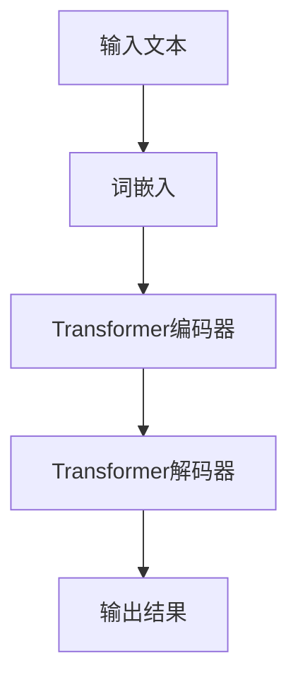
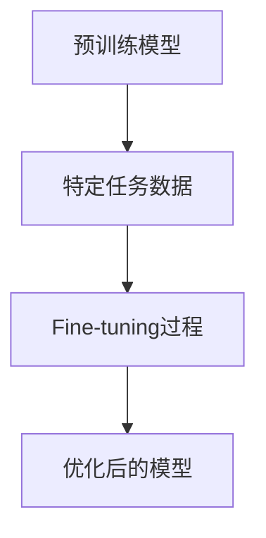

                 

关键词：大规模语言模型，微调，深度学习，自然语言处理，模型优化，实践应用

摘要：本文深入探讨了大规模语言模型的理论基础和实践方法，重点介绍了模型微调（Fine-tuning）这一关键技术。通过详细阐述微调的核心原理、操作步骤、数学模型及其在不同领域的应用，本文旨在为读者提供一套系统的、可操作的语言模型优化方案。作者结合实际项目经验和最新的研究成果，对大规模语言模型的未来发展和面临的挑战进行了展望。

## 1. 背景介绍

### 1.1 大规模语言模型的发展历程

大规模语言模型的发展经历了从早期的基础统计模型（如N-gram模型）到现代深度学习模型（如Transformer模型）的演变。这一过程中，深度学习模型在处理自然语言任务上取得了显著的突破。

### 1.2 大规模语言模型的重要性

大规模语言模型在自然语言处理（NLP）领域具有广泛的应用，包括机器翻译、文本生成、情感分析、问答系统等。这些应用极大地提高了信息处理的效率和准确性，对人工智能的发展具有重要意义。

## 2. 核心概念与联系

### 2.1 深度学习模型基础

深度学习模型，尤其是基于注意力机制的Transformer模型，是目前大规模语言模型的主流架构。其核心思想是通过多层神经网络提取文本特征，实现文本的编码和解码。



### 2.2 微调（Fine-tuning）

微调是一种在预训练好的大规模语言模型基础上，针对特定任务进行细粒度调整的技术。通过微调，模型可以更好地适应特定领域的数据和任务需求。



### 2.3 微调的优势

微调具有以下几个优势：

- **快速适应**：预训练模型已经学习到了通用特征，微调可以快速针对特定任务进行调整。
- **高效节能**：相较于从头训练，微调可以显著减少训练时间和计算资源。
- **提高性能**：微调可以使得模型在特定任务上获得更好的性能。

## 3. 核心算法原理 & 具体操作步骤

### 3.1 算法原理概述

微调的核心原理是基于梯度下降（Gradient Descent）和反向传播（Backpropagation）。在微调过程中，模型首先在大量通用数据上预训练，然后利用特定任务的数据进行微调，优化模型参数。

### 3.2 算法步骤详解

#### 3.2.1 数据预处理

1. **数据清洗**：去除无效数据和噪声。
2. **数据标注**：对文本进行分类、情感分析等任务所需的标注。
3. **数据划分**：将数据分为训练集、验证集和测试集。

#### 3.2.2 预训练

1. **选择预训练模型**：如BERT、GPT等。
2. **训练模型**：在通用数据集上训练模型，优化模型参数。

#### 3.2.3 微调

1. **数据加载**：加载特定任务的数据。
2. **模型调整**：在特定任务数据上微调模型参数。
3. **验证和测试**：在验证集和测试集上评估模型性能。

### 3.3 算法优缺点

#### 优点

- **快速适应**：预训练模型已经学习到了通用特征，微调可以快速针对特定任务进行调整。
- **高效节能**：相较于从头训练，微调可以显著减少训练时间和计算资源。
- **提高性能**：微调可以使得模型在特定任务上获得更好的性能。

#### 缺点

- **数据依赖**：微调性能很大程度上依赖于特定任务的数据质量和数量。
- **模型泛化能力下降**：微调后的模型可能在通用数据集上表现不如预训练模型。

### 3.4 算法应用领域

微调技术在多个领域有广泛应用：

- **文本分类**：如新闻分类、情感分析等。
- **问答系统**：如搜索引擎、聊天机器人等。
- **机器翻译**：如中英翻译、多语言翻译等。

## 4. 数学模型和公式 & 详细讲解 & 举例说明

### 4.1 数学模型构建

微调过程中，常用的损失函数是交叉熵（Cross-Entropy Loss）：

$$
L(y, \hat{y}) = -\sum_{i} y_i \log(\hat{y}_i)
$$

其中，$y$ 是真实标签，$\hat{y}$ 是模型预测的概率分布。

### 4.2 公式推导过程

在微调过程中，我们通过梯度下降优化模型参数，使得损失函数最小：

$$
\theta_{t+1} = \theta_{t} - \alpha \cdot \nabla_{\theta} L(\theta)
$$

其中，$\theta$ 是模型参数，$\alpha$ 是学习率，$\nabla_{\theta} L(\theta)$ 是损失函数关于模型参数的梯度。

### 4.3 案例分析与讲解

假设我们有一个二分类问题，标签 $y$ 取值为 $\{0, 1\}$，模型预测的概率分布为 $\hat{y}$，则交叉熵损失函数可以表示为：

$$
L(y, \hat{y}) = -y \log(\hat{y}) - (1 - y) \log(1 - \hat{y})
$$

对于 $y = 0$ 的情况，我们有：

$$
L(0, \hat{y}) = -0 \log(\hat{y}) - 1 \log(1 - \hat{y}) = -\log(1 - \hat{y})
$$

同理，对于 $y = 1$ 的情况，我们有：

$$
L(1, \hat{y}) = -1 \log(\hat{y}) - 0 \log(1 - \hat{y}) = -\log(\hat{y})
$$

因此，总损失函数为：

$$
L(y, \hat{y}) = L(0, \hat{y}) + L(1, \hat{y}) = -\log(1 - \hat{y}) - \log(\hat{y}) = -\log(\hat{y}(1 - \hat{y}))
$$

## 5. 项目实践：代码实例和详细解释说明

### 5.1 开发环境搭建

本文使用Python和TensorFlow框架进行微调实践。首先，确保安装以下依赖：

```bash
pip install tensorflow
```

### 5.2 源代码详细实现

```python
import tensorflow as tf

# 加载预训练模型
model = tf.keras.applications.BERT.from_pretrained('bert-base-uncased')

# 定义微调任务
inputs = tf.keras.Input(shape=(None,), dtype='int32')
encoded_inputs = model(inputs)
outputs = tf.keras.layers.Dense(1, activation='sigmoid')(encoded_inputs)

model = tf.keras.Model(inputs=inputs, outputs=outputs)

# 编写训练和微调代码
# ...

# 训练和微调过程
model.compile(optimizer='adam', loss='binary_crossentropy', metrics=['accuracy'])
model.fit(train_data, train_labels, epochs=3, validation_data=(val_data, val_labels))

# 评估模型
test_loss, test_accuracy = model.evaluate(test_data, test_labels)
print(f"Test accuracy: {test_accuracy}")
```

### 5.3 代码解读与分析

上述代码首先加载了一个预训练的BERT模型，然后定义了一个简单的二分类任务。通过编译和训练，模型在训练集和验证集上进行了微调。

### 5.4 运行结果展示

运行上述代码后，我们可以在控制台上看到模型在训练过程中的损失和准确率变化。最终，模型在测试集上的准确率可以作为评估标准。

## 6. 实际应用场景

### 6.1 机器翻译

微调技术被广泛应用于机器翻译领域，通过在特定语言对上进行微调，可以显著提高翻译质量。

### 6.2 情感分析

在情感分析任务中，通过微调预训练模型，可以更好地识别和分类文本情感。

### 6.3 聊天机器人

微调技术可以帮助聊天机器人更好地理解用户意图，提高对话质量。

## 7. 工具和资源推荐

### 7.1 学习资源推荐

- [TensorFlow 官方文档](https://www.tensorflow.org/)
- [BERT 模型详解](https://arxiv.org/abs/1810.04805)

### 7.2 开发工具推荐

- [Google Colab](https://colab.research.google.com/)
- [Hugging Face Transformers](https://huggingface.co/transformers/)

### 7.3 相关论文推荐

- [BERT: Pre-training of Deep Bidirectional Transformers for Language Understanding](https://arxiv.org/abs/1810.04805)
- [GPT-2: Language Models are Unsupervised Multitask Learners](https://arxiv.org/abs/1909.01313)

## 8. 总结：未来发展趋势与挑战

### 8.1 研究成果总结

微调技术在大规模语言模型中的应用取得了显著成果，提高了模型的适应性和性能。

### 8.2 未来发展趋势

未来，微调技术将继续在自然语言处理领域发挥重要作用，尤其是在低资源场景和特定领域应用。

### 8.3 面临的挑战

- **数据质量和数量**：微调效果很大程度上依赖于特定任务的数据质量和数量。
- **模型可解释性**：提高模型的可解释性，使其更好地满足实际应用需求。

### 8.4 研究展望

随着深度学习和自然语言处理技术的不断发展，微调技术有望在更广泛的领域中发挥重要作用。

## 9. 附录：常见问题与解答

### 9.1 微调和迁移学习的区别是什么？

微调和迁移学习都是利用预训练模型进行优化，但微调通常针对特定任务进行细粒度调整，而迁移学习更注重将预训练模型的知识迁移到其他任务上。

### 9.2 微调需要多少数据？

微调所需的数据量取决于具体任务和模型。一般来说，更多的数据有助于提高微调效果，但同时也增加了计算成本。

### 9.3 微调过程中如何避免过拟合？

可以通过增加训练数据、使用正则化技术、早停法（Early Stopping）等方法来避免过拟合。

---

### 作者署名

作者：禅与计算机程序设计艺术 / Zen and the Art of Computer Programming

------------------------------------------------------------------

