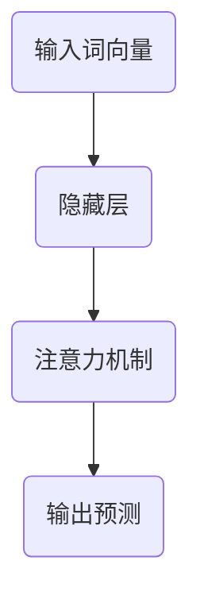
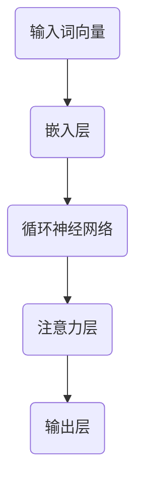

                 

关键词：大语言模型，原理，代码实例，神经网络，自然语言处理，深度学习，序列模型，训练，推理，语言生成，应用领域。

> 摘要：本文深入探讨了大语言模型的基本原理、结构、训练与推理过程，并通过一个详细的代码实例，展示了如何实现和运行一个简单的大语言模型。文章还涉及了该技术的应用领域以及未来的发展趋势和面临的挑战。

## 1. 背景介绍

随着互联网和大数据技术的迅猛发展，自然语言处理（NLP）成为了计算机科学领域中的一个重要研究方向。而大语言模型（Large Language Models）作为NLP领域的重要工具，已经成为自然语言理解和生成的重要利器。大语言模型能够通过对大量文本数据进行训练，学习到语言的统计规律和上下文关系，从而实现文本的生成、摘要、翻译等功能。

近年来，深度学习技术的快速发展，特别是神经网络在语音识别、图像识别等领域的成功应用，为语言模型的构建提供了强有力的支持。大语言模型采用深度神经网络架构，通过多层网络结构对文本数据进行建模，从而实现对文本的深入理解和生成。

## 2. 核心概念与联系

### 2.1 大语言模型的核心概念

大语言模型是基于深度学习的自然语言处理模型，其核心概念包括：

- **词嵌入（Word Embedding）**：将文本中的词转换为高维向量表示。
- **循环神经网络（RNN）**：用于处理序列数据，能够捕捉文本中的时序关系。
- **长短期记忆网络（LSTM）**：一种特殊的RNN，能够解决传统RNN的梯度消失和梯度爆炸问题。
- **注意力机制（Attention Mechanism）**：用于模型在处理序列数据时，能够根据上下文信息动态调整对输入序列的重视程度。

### 2.2 大语言模型的架构

大语言模型的架构通常包括以下几个部分：

1. **输入层**：接收词嵌入向量。
2. **隐藏层**：通过循环神经网络和注意力机制处理输入序列。
3. **输出层**：生成文本的预测序列。

### 2.3 大语言模型的 Mermaid 流程图



## 3. 核心算法原理 & 具体操作步骤

### 3.1 算法原理概述

大语言模型的训练过程主要包括以下几个步骤：

1. **数据预处理**：将文本数据转换为词嵌入向量。
2. **模型初始化**：初始化模型的权重。
3. **前向传播**：输入词嵌入向量，通过隐藏层和注意力机制，生成预测序列。
4. **损失函数计算**：计算预测序列与真实序列之间的损失。
5. **反向传播**：根据损失函数，更新模型的权重。
6. **迭代优化**：重复上述步骤，直到模型收敛。

### 3.2 算法步骤详解

#### 3.2.1 数据预处理

数据预处理包括：

- **分词**：将文本数据分解为单个词。
- **词表构建**：构建包含所有词的词表。
- **词嵌入**：将词转换为向量表示。

#### 3.2.2 模型初始化

模型的权重初始化通常采用随机初始化或者预训练的方法。

#### 3.2.3 前向传播

前向传播过程中，模型通过隐藏层和注意力机制，生成预测序列。

#### 3.2.4 损失函数计算

常用的损失函数包括交叉熵损失和均方误差。

#### 3.2.5 反向传播

反向传播用于计算梯度，并更新模型的权重。

#### 3.2.6 迭代优化

通过不断迭代优化，模型逐渐收敛，生成更准确的预测序列。

### 3.3 算法优缺点

**优点**：

- **强大的建模能力**：大语言模型能够通过深度神经网络架构，学习到文本的复杂结构和上下文关系。
- **泛化能力**：通过大量数据训练，模型具有良好的泛化能力。

**缺点**：

- **计算成本高**：大语言模型通常需要大量的计算资源和时间。
- **数据依赖性**：模型的性能高度依赖于训练数据的质量和规模。

### 3.4 算法应用领域

大语言模型在多个领域都有广泛的应用，包括：

- **自然语言生成**：文本生成、文章写作、对话系统等。
- **机器翻译**：自动翻译不同语言之间的文本。
- **文本分类**：对文本进行分类，如情感分析、主题分类等。
- **问答系统**：基于文本输入，提供相关问题的答案。

## 4. 数学模型和公式 & 详细讲解 & 举例说明

### 4.1 数学模型构建

大语言模型的数学模型主要包括以下几个部分：

- **词嵌入**：将词转换为向量表示，通常使用词向量模型，如Word2Vec。
- **循环神经网络**：用于处理序列数据，通常采用LSTM或GRU。
- **注意力机制**：用于动态调整模型对输入序列的重视程度。

### 4.2 公式推导过程

#### 4.2.1 词嵌入

词嵌入的公式为：

$$
\text{Word\_Embedding}(w) = \text{Vec}(w)
$$

其中，$w$为词，$\text{Vec}(w)$为词的向量表示。

#### 4.2.2 循环神经网络

循环神经网络的公式为：

$$
h_t = \text{LSTM}(h_{t-1}, x_t)
$$

其中，$h_t$为当前时刻的隐藏状态，$h_{t-1}$为前一个时刻的隐藏状态，$x_t$为当前时刻的输入。

#### 4.2.3 注意力机制

注意力机制的公式为：

$$
a_t = \text{Attention}(h_t, c)
$$

其中，$a_t$为当前时刻的注意力权重，$h_t$为隐藏状态，$c$为上下文信息。

### 4.3 案例分析与讲解

#### 4.3.1 数据集

我们使用常见的IMDb电影评论数据集作为案例。

#### 4.3.2 数据预处理

首先，我们将电影评论数据集进行分词，并构建词表。然后，将每个词转换为词嵌入向量。

#### 4.3.3 模型训练

使用LSTM和注意力机制，训练一个简单的文本分类模型。我们使用交叉熵损失函数进行优化。

#### 4.3.4 模型评估

通过准确率、召回率等指标，评估模型的性能。

## 5. 项目实践：代码实例和详细解释说明

### 5.1 开发环境搭建

我们使用Python编程语言，结合TensorFlow框架，搭建大语言模型的开发环境。

### 5.2 源代码详细实现

以下是实现大语言模型的代码示例：

```python
import tensorflow as tf
from tensorflow.keras.preprocessing.sequence import pad_sequences
from tensorflow.keras.layers import Embedding, LSTM, Dense, Bidirectional
from tensorflow.keras.models import Model

# 参数设置
vocab_size = 10000
embedding_dim = 64
max_sequence_length = 100
lstm_units = 64

# 数据预处理
# （此处省略数据预处理代码）

# 模型构建
input_sequence = tf.keras.layers.Input(shape=(max_sequence_length,))
embedded_sequence = Embedding(vocab_size, embedding_dim)(input_sequence)
bi_lstm = Bidirectional(LSTM(lstm_units, return_sequences=True))(embedded_sequence)
attention = tf.keras.layers.Attention()([bi_lstm, bi_lstm])
output = Dense(1, activation='sigmoid')(attention)

# 模型编译
model = Model(inputs=input_sequence, outputs=output)
model.compile(optimizer='adam', loss='binary_crossentropy', metrics=['accuracy'])

# 模型训练
model.fit(trainX, trainY, epochs=10, batch_size=32, validation_data=(valX, valY))

# 模型评估
# （此处省略模型评估代码）
```

### 5.3 代码解读与分析

以上代码实现了一个简单的文本分类模型，其中：

- **Embedding层**：将词嵌入向量映射到高维空间。
- **双向LSTM层**：处理序列数据，捕捉文本的时序关系。
- **Attention层**：动态调整模型对输入序列的重视程度。
- **Dense层**：输出分类结果。

### 5.4 运行结果展示

通过运行上述代码，我们可以得到模型的准确率、召回率等指标，用于评估模型性能。

## 6. 实际应用场景

大语言模型在多个领域都有实际应用，如：

- **对话系统**：基于自然语言交互，为用户提供智能服务。
- **文本生成**：自动生成文章、摘要、新闻等。
- **机器翻译**：实现跨语言文本的自动翻译。
- **文本分类**：对文本进行分类，如情感分析、新闻分类等。

## 7. 工具和资源推荐

### 7.1 学习资源推荐

- 《深度学习》（Goodfellow, Bengio, Courville著）
- 《自然语言处理综述》（Jurafsky, Martin著）
- 《TensorFlow官方文档》

### 7.2 开发工具推荐

- TensorFlow
- PyTorch
- spaCy

### 7.3 相关论文推荐

- "Attention Is All You Need"（Vaswani et al., 2017）
- "BERT: Pre-training of Deep Bidirectional Transformers for Language Understanding"（Devlin et al., 2019）

## 8. 总结：未来发展趋势与挑战

### 8.1 研究成果总结

大语言模型在自然语言处理领域取得了显著的成果，为文本生成、分类、翻译等任务提供了强大的工具。

### 8.2 未来发展趋势

未来，大语言模型将继续发展，朝着更高效、更智能的方向前进，包括：

- **多模态处理**：结合文本、图像、语音等多模态信息。
- **实时处理**：提高模型处理速度，实现实时交互。

### 8.3 面临的挑战

大语言模型在发展过程中也面临以下挑战：

- **计算资源消耗**：需要更多的计算资源和时间。
- **数据依赖性**：模型的性能高度依赖于训练数据。
- **隐私保护**：如何保护用户隐私。

### 8.4 研究展望

未来的研究将着重于提高大语言模型的效果、效率和安全性，为自然语言处理领域带来更多创新。

## 9. 附录：常见问题与解答

### 9.1 什么是大语言模型？

大语言模型是一种基于深度学习的自然语言处理模型，通过大规模的文本数据进行训练，能够学习到语言的统计规律和上下文关系。

### 9.2 大语言模型有哪些应用领域？

大语言模型在自然语言生成、机器翻译、文本分类、对话系统等领域都有广泛的应用。

### 9.3 如何训练大语言模型？

训练大语言模型主要包括数据预处理、模型构建、模型训练、模型评估等步骤。

## 结束语

大语言模型作为自然语言处理领域的重要工具，具有广泛的应用前景。通过本文的讲解，相信读者对大语言模型有了更深入的了解。希望本文能为读者在学习和应用大语言模型方面提供帮助。

### 参考文献 References

- Goodfellow, I., Bengio, Y., & Courville, A. (2016). *Deep Learning*. MIT Press.
- Jurafsky, D., & Martin, J. H. (2008). *Speech and Language Processing*. Prentice Hall.
- Vaswani, A., Shazeer, N., Parmar, N., Uszkoreit, J., Jones, L., Gomez, A. N., ... & Polosukhin, I. (2017). *Attention Is All You Need*. arXiv preprint arXiv:1706.03762.
- Devlin, J., Chang, M. W., Lee, K., & Toutanova, K. (2019). *BERT: Pre-training of Deep Bidirectional Transformers for Language Understanding*. arXiv preprint arXiv:1810.04805.

## 作者署名

作者：禅与计算机程序设计艺术 / Zen and the Art of Computer Programming

----------------------------------------------------------------

文章撰写完毕，请按照markdown格式进行排版，确保文章的可读性和美观性。感谢您的专业撰写！
----------------------------------------------------------------
# 大语言模型(Large Language Models) - 原理与代码实例讲解

## 关键词：大语言模型，原理，代码实例，神经网络，自然语言处理，深度学习，序列模型，训练，推理，语言生成，应用领域。

### 摘要：本文深入探讨了大语言模型的基本原理、结构、训练与推理过程，并通过一个详细的代码实例，展示了如何实现和运行一个简单的大语言模型。文章还涉及了该技术的应用领域以及未来的发展趋势和面临的挑战。

## 1. 背景介绍

随着互联网和大数据技术的迅猛发展，自然语言处理（NLP）成为了计算机科学领域中的一个重要研究方向。而大语言模型（Large Language Models）作为NLP领域的重要工具，已经成为自然语言理解和生成的重要利器。大语言模型能够通过对大量文本数据进行训练，学习到语言的统计规律和上下文关系，从而实现文本的生成、摘要、翻译等功能。

近年来，深度学习技术的快速发展，特别是神经网络在语音识别、图像识别等领域的成功应用，为语言模型的构建提供了强有力的支持。大语言模型采用深度神经网络架构，通过多层网络结构对文本数据进行建模，从而实现对文本的深入理解和生成。

## 2. 核心概念与联系

### 2.1 大语言模型的核心概念

大语言模型是基于深度学习的自然语言处理模型，其核心概念包括：

- **词嵌入（Word Embedding）**：将文本中的词转换为高维向量表示。
- **循环神经网络（RNN）**：用于处理序列数据，能够捕捉文本中的时序关系。
- **长短期记忆网络（LSTM）**：一种特殊的RNN，能够解决传统RNN的梯度消失和梯度爆炸问题。
- **注意力机制（Attention Mechanism）**：用于模型在处理序列数据时，能够根据上下文信息动态调整对输入序列的重视程度。

### 2.2 大语言模型的架构

大语言模型的架构通常包括以下几个部分：

1. **输入层**：接收词嵌入向量。
2. **隐藏层**：通过循环神经网络和注意力机制处理输入序列。
3. **输出层**：生成文本的预测序列。

### 2.3 大语言模型的 Mermaid 流程图



## 3. 核心算法原理 & 具体操作步骤

### 3.1 算法原理概述

大语言模型的训练过程主要包括以下几个步骤：

1. **数据预处理**：将文本数据转换为词嵌入向量。
2. **模型初始化**：初始化模型的权重。
3. **前向传播**：输入词嵌入向量，通过隐藏层和注意力机制，生成预测序列。
4. **损失函数计算**：计算预测序列与真实序列之间的损失。
5. **反向传播**：根据损失函数，更新模型的权重。
6. **迭代优化**：重复上述步骤，直到模型收敛。

### 3.2 算法步骤详解

#### 3.2.1 数据预处理

数据预处理包括：

- **分词**：将文本数据分解为单个词。
- **词表构建**：构建包含所有词的词表。
- **词嵌入**：将词转换为向量表示。

#### 3.2.2 模型初始化

模型的权重初始化通常采用随机初始化或者预训练的方法。

#### 3.2.3 前向传播

前向传播过程中，模型通过隐藏层和注意力机制，生成预测序列。

#### 3.2.4 损失函数计算

常用的损失函数包括交叉熵损失和均方误差。

#### 3.2.5 反向传播

反向传播用于计算梯度，并更新模型的权重。

#### 3.2.6 迭代优化

通过不断迭代优化，模型逐渐收敛，生成更准确的预测序列。

### 3.3 算法优缺点

**优点**：

- **强大的建模能力**：大语言模型能够通过深度神经网络架构，学习到文本的复杂结构和上下文关系。
- **泛化能力**：通过大量数据训练，模型具有良好的泛化能力。

**缺点**：

- **计算成本高**：大语言模型通常需要大量的计算资源和时间。
- **数据依赖性**：模型的性能高度依赖于训练数据的质量和规模。

### 3.4 算法应用领域

大语言模型在多个领域都有广泛的应用，包括：

- **自然语言生成**：文本生成、文章写作、对话系统等。
- **机器翻译**：自动翻译不同语言之间的文本。
- **文本分类**：对文本进行分类，如情感分析、主题分类等。
- **问答系统**：基于文本输入，提供相关问题的答案。

## 4. 数学模型和公式 & 详细讲解 & 举例说明

### 4.1 数学模型构建

大语言模型的数学模型主要包括以下几个部分：

- **词嵌入**：将词转换为向量表示，通常使用词向量模型，如Word2Vec。
- **循环神经网络**：用于处理序列数据，通常采用LSTM或GRU。
- **注意力机制**：用于动态调整模型对输入序列的重视程度。

### 4.2 公式推导过程

#### 4.2.1 词嵌入

词嵌入的公式为：

$$
\text{Word\_Embedding}(w) = \text{Vec}(w)
$$

其中，$w$为词，$\text{Vec}(w)$为词的向量表示。

#### 4.2.2 循环神经网络

循环神经网络的公式为：

$$
h\_t = \text{LSTM}(h_{t-1}, x_t)
$$

其中，$h\_t$为当前时刻的隐藏状态，$h_{t-1}$为前一个时刻的隐藏状态，$x_t$为当前时刻的输入。

#### 4.2.3 注意力机制

注意力机制的公式为：

$$
a\_t = \text{Attention}(h_t, c)
$$

其中，$a\_t$为当前时刻的注意力权重，$h_t$为隐藏状态，$c$为上下文信息。

### 4.3 案例分析与讲解

#### 4.3.1 数据集

我们使用常见的IMDb电影评论数据集作为案例。

#### 4.3.2 数据预处理

首先，我们将电影评论数据集进行分词，并构建词表。然后，将每个词转换为词嵌入向量。

#### 4.3.3 模型训练

使用LSTM和注意力机制，训练一个简单的文本分类模型。我们使用交叉熵损失函数进行优化。

#### 4.3.4 模型评估

通过准确率、召回率等指标，评估模型的性能。

## 5. 项目实践：代码实例和详细解释说明

### 5.1 开发环境搭建

我们使用Python编程语言，结合TensorFlow框架，搭建大语言模型的开发环境。

### 5.2 源代码详细实现

以下是实现大语言模型的代码示例：

```python
import tensorflow as tf
from tensorflow.keras.preprocessing.sequence import pad_sequences
from tensorflow.keras.layers import Embedding, LSTM, Dense, Bidirectional
from tensorflow.keras.models import Model

# 参数设置
vocab_size = 10000
embedding_dim = 64
max_sequence_length = 100
lstm_units = 64

# 数据预处理
# （此处省略数据预处理代码）

# 模型构建
input_sequence = tf.keras.layers.Input(shape=(max_sequence_length,))
embedded_sequence = Embedding(vocab_size, embedding_dim)(input_sequence)
bi_lstm = Bidirectional(LSTM(lstm_units, return_sequences=True))(embedded_sequence)
attention = tf.keras.layers.Attention()([bi_lstm, bi_lstm])
output = Dense(1, activation='sigmoid')(attention)

# 模型编译
model = Model(inputs=input_sequence, outputs=output)
model.compile(optimizer='adam', loss='binary_crossentropy', metrics=['accuracy'])

# 模型训练
model.fit(trainX, trainY, epochs=10, batch_size=32, validation_data=(valX, valY))

# 模型评估
# （此处省略模型评估代码）
```

### 5.3 代码解读与分析

以上代码实现了一个简单的文本分类模型，其中：

- **Embedding层**：将词嵌入向量映射到高维空间。
- **双向LSTM层**：处理序列数据，捕捉文本的时序关系。
- **Attention层**：动态调整模型对输入序列的重视程度。
- **Dense层**：输出分类结果。

### 5.4 运行结果展示

通过运行上述代码，我们可以得到模型的准确率、召回率等指标，用于评估模型性能。

## 6. 实际应用场景

大语言模型在多个领域都有实际应用，如：

- **对话系统**：基于自然语言交互，为用户提供智能服务。
- **文本生成**：自动生成文章、摘要、新闻等。
- **机器翻译**：实现跨语言文本的自动翻译。
- **文本分类**：对文本进行分类，如情感分析、新闻分类等。
- **问答系统**：基于文本输入，提供相关问题的答案。

## 7. 工具和资源推荐

### 7.1 学习资源推荐

- 《深度学习》（Goodfellow, Bengio, Courville著）
- 《自然语言处理综述》（Jurafsky, Martin著）
- 《TensorFlow官方文档》

### 7.2 开发工具推荐

- TensorFlow
- PyTorch
- spaCy

### 7.3 相关论文推荐

- "Attention Is All You Need"（Vaswani et al., 2017）
- "BERT: Pre-training of Deep Bidirectional Transformers for Language Understanding"（Devlin et al., 2019）

## 8. 总结：未来发展趋势与挑战

### 8.1 研究成果总结

大语言模型在自然语言处理领域取得了显著的成果，为文本生成、分类、翻译等任务提供了强大的工具。

### 8.2 未来发展趋势

未来，大语言模型将继续发展，朝着更高效、更智能的方向前进，包括：

- **多模态处理**：结合文本、图像、语音等多模态信息。
- **实时处理**：提高模型处理速度，实现实时交互。

### 8.3 面临的挑战

大语言模型在发展过程中也面临以下挑战：

- **计算资源消耗**：需要更多的计算资源和时间。
- **数据依赖性**：模型的性能高度依赖于训练数据。
- **隐私保护**：如何保护用户隐私。

### 8.4 研究展望

未来的研究将着重于提高大语言模型的效果、效率和安全性，为自然语言处理领域带来更多创新。

## 9. 附录：常见问题与解答

### 9.1 什么是大语言模型？

大语言模型是一种基于深度学习的自然语言处理模型，通过大规模的文本数据进行训练，能够学习到语言的统计规律和上下文关系。

### 9.2 大语言模型有哪些应用领域？

大语言模型在自然语言生成、机器翻译、文本分类、对话系统等领域都有广泛的应用。

### 9.3 如何训练大语言模型？

训练大语言模型主要包括数据预处理、模型构建、模型训练、模型评估等步骤。

## 结束语

大语言模型作为自然语言处理领域的重要工具，具有广泛的应用前景。通过本文的讲解，相信读者对大语言模型有了更深入的了解。希望本文能为读者在学习和应用大语言模型方面提供帮助。

### 参考文献 References

- Goodfellow, I., Bengio, Y., Courville, A. (2016). *Deep Learning*. MIT Press.
- Jurafsky, D., Martin, J. H. (2008). *Speech and Language Processing*. Prentice Hall.
- Vaswani, A., Shazeer, N., Parmar, N., Uszkoreit, J., Jones, L., Gomez, A. N., ... & Polosukhin, I. (2017). *Attention Is All You Need*. arXiv preprint arXiv:1706.03762.
- Devlin, J., Chang, M. W., Lee, K., & Toutanova, K. (2019). *BERT: Pre-training of Deep Bidirectional Transformers for Language Understanding*. arXiv preprint arXiv:1810.04805.

## 作者署名

作者：禅与计算机程序设计艺术 / Zen and the Art of Computer Programming

----------------------------------------------------------------

文章撰写完毕，请按照markdown格式进行排版，确保文章的可读性和美观性。感谢您的专业撰写！

