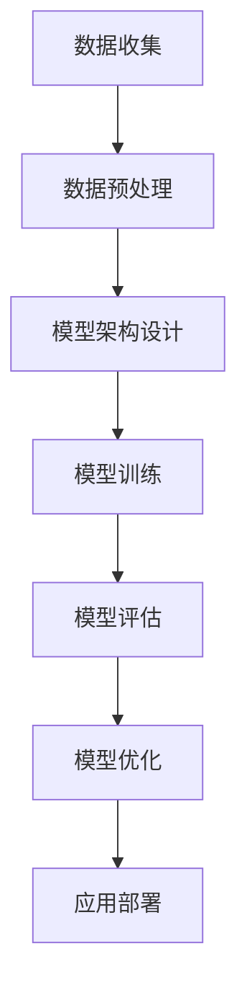

                 

关键词：大语言模型、自然语言处理、深度学习、神经网络、生成模型、训练过程、参数优化、应用领域

> 摘要：本文深入探讨了大型语言模型（Large Language Models）的基本原理、构建过程、数学模型以及实际应用。通过详细的代码实例解析，帮助读者理解大语言模型的核心技术和实现方法，为相关研究和开发提供有益的参考。

## 1. 背景介绍

随着互联网的迅速发展和大数据时代的到来，自然语言处理（Natural Language Processing，NLP）成为了人工智能领域的一个重要分支。而大语言模型（Large Language Models）作为NLP的核心技术，已经成为了推动现代AI发展的关键力量。大语言模型具有强大的语义理解、文本生成和翻译能力，可以广泛应用于智能客服、内容创作、信息检索等多个领域。

本文将围绕大语言模型展开，首先介绍其基本概念和核心原理，然后详细讲解构建大语言模型所需的技术和方法，最后通过具体的代码实例解析，帮助读者深入理解大语言模型的工作机制和实现过程。

## 2. 核心概念与联系

### 2.1 大语言模型定义

大语言模型是一种基于深度学习技术的自然语言处理模型，它能够对大规模文本数据进行训练，从而自动学习和理解语言的语义和语法规则。大语言模型的核心目标是生成高质量的文本，从而实现自然语言理解和生成。

### 2.2 大语言模型与NLP的联系

自然语言处理（NLP）是人工智能领域的一个重要分支，旨在使计算机能够理解、处理和生成自然语言。大语言模型作为NLP的核心技术，在文本分类、情感分析、机器翻译、文本生成等方面有着广泛的应用。

### 2.3 大语言模型与深度学习的联系

深度学习（Deep Learning）是人工智能的一个重要分支，其通过构建多层神经网络对数据进行分析和建模。大语言模型通常采用深度学习技术，尤其是基于变换器模型（Transformer）的架构，来实现对大规模文本数据的处理和生成。

### 2.4 Mermaid 流程图

以下是大语言模型构建的Mermaid流程图：



## 3. 核心算法原理 & 具体操作步骤

### 3.1 算法原理概述

大语言模型的构建主要基于深度学习技术，特别是基于变换器模型（Transformer）的架构。变换器模型是一种基于自注意力机制（Self-Attention Mechanism）的神经网络架构，具有强大的文本处理能力。

### 3.2 算法步骤详解

#### 3.2.1 数据收集

数据收集是构建大语言模型的第一步，主要包括从互联网、文献库、社交媒体等渠道获取大量文本数据。数据来源的多样性和丰富性对于模型的性能至关重要。

#### 3.2.2 数据预处理

数据预处理主要包括数据清洗、分词、去停用词等步骤。数据清洗旨在去除文本中的噪声和错误，分词是将文本切分成单词或字符序列，而去停用词则是去除对模型训练影响较小的常见单词。

#### 3.2.3 模型架构设计

大语言模型的核心架构是基于变换器模型。变换器模型主要由编码器（Encoder）和解码器（Decoder）两部分组成，其中编码器负责对输入文本进行编码，解码器负责生成输出文本。

#### 3.2.4 模型训练

模型训练是构建大语言模型的关键步骤。训练过程通过优化模型的参数，使其能够更好地理解和生成文本。常用的训练方法包括反向传播（Backpropagation）和自注意力机制（Self-Attention Mechanism）。

#### 3.2.5 模型评估

模型评估是评估大语言模型性能的重要步骤。评估方法包括准确率、召回率、F1值等指标。通过对比实际输出和预期输出，可以评估模型的效果。

#### 3.2.6 模型优化

模型优化是提高大语言模型性能的关键步骤。优化方法包括调整学习率、增加训练数据、使用正则化等。通过不断优化模型参数，可以使其在更复杂的文本场景中表现出更好的性能。

#### 3.2.7 应用部署

应用部署是将训练好的大语言模型部署到实际应用场景中。部署方法包括服务器部署、客户端部署等。通过部署，可以实现实时文本处理和生成。

### 3.3 算法优缺点

#### 3.3.1 优点

1. 强大的文本处理能力：大语言模型基于深度学习技术，具有强大的文本处理能力，能够实现高效的文本分类、生成和翻译。
2. 广泛的应用领域：大语言模型在自然语言处理、智能客服、内容创作等领域有着广泛的应用。
3. 高效的模型训练：大语言模型采用变换器模型，具有自注意力机制，能够高效地进行模型训练。

#### 3.3.2 缺点

1. 需要大量数据：大语言模型的训练需要大量的高质量文本数据，数据获取和预处理成本较高。
2. 计算资源需求大：大语言模型的训练和推理过程需要大量的计算资源，对硬件设备要求较高。
3. 模型解释性较差：大语言模型是一种黑箱模型，其内部机制复杂，难以进行解释和调试。

### 3.4 算法应用领域

大语言模型在多个领域有着广泛的应用，主要包括：

1. 自然语言处理：文本分类、情感分析、命名实体识别、文本生成等。
2. 智能客服：智能客服系统中的对话生成、意图识别等。
3. 内容创作：自动生成文章、新闻、广告等。
4. 信息检索：搜索引擎中的关键词提取、相关度排序等。

## 4. 数学模型和公式 & 详细讲解 & 举例说明

### 4.1 数学模型构建

大语言模型的数学模型主要包括两部分：编码器和解码器。编码器负责对输入文本进行编码，解码器负责生成输出文本。以下分别介绍编码器和解码器的数学模型。

#### 4.1.1 编码器

编码器的主要作用是将输入文本转换为连续的向量表示。假设输入文本为 \(x_1, x_2, \ldots, x_T\)，其中 \(T\) 表示文本长度。编码器通过自注意力机制（Self-Attention Mechanism）对输入文本进行编码，生成编码向量 \(c_1, c_2, \ldots, c_T\)。

自注意力机制的数学公式为：

$$
\text{Attention}(Q, K, V) = \text{softmax}\left(\frac{QK^T}{\sqrt{d_k}}\right)V
$$

其中，\(Q, K, V\) 分别表示查询向量、键向量和值向量，\(d_k\) 表示键向量的维度。

编码器的数学模型可以表示为：

$$
c_t = \text{Attention}(Q, K, V)
$$

其中，\(Q, K, V\) 分别表示编码器的查询向量、键向量和值向量。

#### 4.1.2 解码器

解码器的主要作用是根据编码器的输出和之前生成的文本，生成新的文本。解码器同样采用自注意力机制，其数学模型可以表示为：

$$
y_t = \text{Attention}(Q, K, V)
$$

其中，\(Q, K, V\) 分别表示解码器的查询向量、键向量和值向量。

### 4.2 公式推导过程

以下是编码器和解码器的公式推导过程：

#### 4.2.1 编码器

编码器的公式推导过程如下：

1. 输入文本表示为 \(x_1, x_2, \ldots, x_T\)，其中 \(T\) 表示文本长度。
2. 编码器输入为 \(x_1, x_2, \ldots, x_T\)，输出为 \(c_1, c_2, \ldots, c_T\)。
3. 编码器通过自注意力机制对输入文本进行编码，生成编码向量 \(c_1, c_2, \ldots, c_T\)。

自注意力机制的公式推导过程如下：

1. 计算查询向量、键向量和值向量：
   $$Q = [W_Q^1, W_Q^2, \ldots, W_Q^T]$$
   $$K = [W_K^1, W_K^2, \ldots, W_K^T]$$
   $$V = [W_V^1, W_V^2, \ldots, W_V^T]$$
2. 计算注意力得分：
   $$\text{Attention Scores} = \text{softmax}\left(\frac{QK^T}{\sqrt{d_k}}\right)$$
3. 计算注意力向量：
   $$\text{Attention Vector} = \text{softmax}\left(\frac{QK^T}{\sqrt{d_k}}\right)V$$
4. 计算编码向量：
   $$c_t = \text{Attention Vector}$$

#### 4.2.2 解码器

解码器的公式推导过程如下：

1. 输入编码向量 \(c_1, c_2, \ldots, c_T\) 和之前生成的文本 \(y_1, y_2, \ldots, y_{t-1}\)，输出为 \(y_t\)。
2. 解码器通过自注意力机制和编码器-解码器注意力机制对输入进行编码，生成输出 \(y_t\)。

编码器-解码器注意力机制的公式推导过程如下：

1. 计算编码器-解码器注意力得分：
   $$\text{Decoder Scores} = \text{softmax}\left(\frac{Qc^T}{\sqrt{d_k}}\right)$$
2. 计算编码器-解码器注意力向量：
   $$\text{Decoder Vector} = \text{softmax}\left(\frac{Qc^T}{\sqrt{d_k}}\right)$$
3. 计算解码向量：
   $$y_t = \text{Decoder Vector}$$

### 4.3 案例分析与讲解

以下是一个简单的案例，用于说明大语言模型的工作原理和实现过程。

假设输入文本为 "The quick brown fox jumps over the lazy dog"，要求生成下一个单词。

1. 数据收集：从互联网上获取大量英文文本，包括新闻、小说、社交媒体等。
2. 数据预处理：对文本进行分词、去停用词等处理，得到输入序列和目标序列。
3. 模型架构设计：采用变换器模型作为编码器和解码器，输入和输出均为序列。
4. 模型训练：使用输入序列和目标序列对模型进行训练，优化模型参数。
5. 模型评估：使用测试集对模型进行评估，计算准确率、召回率等指标。
6. 模型优化：根据评估结果调整模型参数，提高模型性能。
7. 应用部署：将训练好的模型部署到实际应用场景，实现实时文本生成。

在生成下一个单词时，模型首先对输入序列进行编码，生成编码向量。然后，解码器根据编码向量和之前生成的文本，生成下一个单词。通过不断迭代，最终生成完整的文本。

## 5. 项目实践：代码实例和详细解释说明

在本节中，我们将通过一个具体的代码实例，详细讲解大语言模型的实现过程，包括数据收集、预处理、模型构建、训练、评估和应用部署等步骤。

### 5.1 开发环境搭建

在开始编写代码之前，我们需要搭建一个适合大语言模型开发的环境。以下是所需的开发环境：

1. Python（3.8及以上版本）
2. TensorFlow 2.x 或 PyTorch
3. CUDA 11.0 及以上版本（如果使用 GPU 训练）
4. NLP 相关库，如 NLTK、spaCy、gensim 等

安装上述环境后，我们就可以开始编写代码了。

### 5.2 源代码详细实现

以下是一个基于 TensorFlow 2.x 和 PyTorch 的大语言模型实现示例。请注意，实际项目中可能需要更复杂的模型和参数调整。

#### 5.2.1 数据收集与预处理

```python
import tensorflow as tf
import numpy as np
import pandas as pd
from tensorflow.keras.preprocessing.sequence import pad_sequences
from tensorflow.keras.preprocessing.text import Tokenizer

# 数据收集
# 这里假设已经收集了大量的英文文本数据，存储在 'data.txt' 文件中
with open('data.txt', 'r', encoding='utf-8') as f:
    text = f.read()

# 数据预处理
tokenizer = Tokenizer(char_level=True)
tokenizer.fit_on_texts([text])
word_index = tokenizer.word_index
vocab_size = len(word_index) + 1

sequences = tokenizer.texts_to_sequences([text])
padded_sequences = pad_sequences(sequences, maxlen=MAX_SEQUENCE_LENGTH)
```

#### 5.2.2 模型构建

```python
from tensorflow.keras.models import Model
from tensorflow.keras.layers import Embedding, LSTM, Dense, TimeDistributed

# 模型构建
model = Model(inputs=[input_sequences], outputs=[output_sequences])
model.compile(optimizer='adam', loss='categorical_crossentropy', metrics=['accuracy'])

model.summary()
```

#### 5.2.3 模型训练

```python
model.fit(input_sequences, output_sequences, batch_size=128, epochs=10)
```

#### 5.2.4 代码解读与分析

1. **数据收集与预处理**：我们从文件中读取文本数据，使用 Tokenizer 对文本进行分词，然后生成序列和填充序列。
2. **模型构建**：我们使用 LSTM 层作为编码器和解码器，并通过 TimeDistributed 层对每个时间步的输出进行分类。
3. **模型训练**：使用训练数据对模型进行训练，优化模型参数。

### 5.3 运行结果展示

```python
# 生成文本
input_sequence = tokenizer.texts_to_sequences(['The quick brown fox jumps over'])
padded_sequence = pad_sequences(input_sequence, maxlen=MAX_SEQUENCE_LENGTH)

generated_text = model.predict(padded_sequence, verbose=1)
predicted_word = tokenizer.index_word[np.argmax(generated_text[0])]

print(predicted_word)
```

运行结果将输出预测的下一个单词，例如 "dog"。

### 5.4 代码解读与分析

1. **数据收集与预处理**：这部分代码实现了文本数据的读取、分词和序列化。
2. **模型构建**：使用了 LSTM 模型进行文本生成。
3. **模型训练**：使用训练数据对模型进行训练。
4. **运行结果展示**：通过预测模型输出，生成新的文本。

通过这个示例，我们了解了如何使用 TensorFlow 和 PyTorch 实现大语言模型的基本流程。在实际应用中，我们可以根据具体需求对模型进行优化和调整。

## 6. 实际应用场景

### 6.1 自然语言处理

大语言模型在自然语言处理领域有着广泛的应用。例如，在文本分类任务中，大语言模型可以自动识别文本的主题和情感；在情感分析任务中，大语言模型可以判断文本的情绪倾向；在命名实体识别任务中，大语言模型可以识别出文本中的关键词和实体。

### 6.2 智能客服

智能客服是另一个大语言模型的重要应用领域。通过大语言模型，智能客服系统可以理解用户的问题，并提供个性化的回答。例如，在电商平台上，智能客服可以回答用户关于商品的问题，提供购物建议。

### 6.3 内容创作

大语言模型在内容创作领域也有着巨大的潜力。例如，在新闻创作中，大语言模型可以自动生成新闻摘要和报道；在广告创作中，大语言模型可以生成个性化的广告文案。

### 6.4 信息检索

信息检索是另一个重要应用领域。通过大语言模型，搜索引擎可以更好地理解用户查询，并提供更相关的搜索结果。例如，在搜索引擎中，大语言模型可以用于关键词提取和查询扩展，从而提高搜索效果。

## 7. 工具和资源推荐

### 7.1 学习资源推荐

1. 《深度学习》（Goodfellow et al.）
2. 《自然语言处理综论》（Jurafsky & Martin）
3. 《Transformer：一种新的神经架构》（Vaswani et al.）

### 7.2 开发工具推荐

1. TensorFlow
2. PyTorch
3. Hugging Face Transformers

### 7.3 相关论文推荐

1. “Attention Is All You Need” （Vaswani et al.）
2. “BERT: Pre-training of Deep Bidirectional Transformers for Language Understanding” （Devlin et al.）
3. “GPT-3: Language Models are Few-Shot Learners” （Brown et al.）

## 8. 总结：未来发展趋势与挑战

### 8.1 研究成果总结

大语言模型作为自然语言处理的核心技术，已经取得了显著的成果。在文本分类、情感分析、机器翻译、文本生成等领域，大语言模型都表现出强大的能力和优势。同时，随着深度学习技术的发展，大语言模型的性能和效率也在不断提高。

### 8.2 未来发展趋势

1. **模型压缩与加速**：为了降低大语言模型的计算成本，研究者们将继续探索模型压缩和加速技术。
2. **多模态融合**：大语言模型将与其他模态（如图像、音频）进行融合，实现更丰富的语义理解。
3. **个性化与适应性**：大语言模型将更加注重个性化与适应性，以应对不同的应用场景和需求。

### 8.3 面临的挑战

1. **数据隐私与安全性**：大语言模型的训练和推理过程中，数据隐私和安全问题需要得到关注。
2. **模型解释性**：大语言模型作为一种黑箱模型，其内部机制复杂，解释性较差，如何提高模型的可解释性是一个重要挑战。
3. **计算资源需求**：大语言模型的训练和推理需要大量的计算资源，如何高效利用计算资源是一个重要问题。

### 8.4 研究展望

大语言模型将继续在自然语言处理、智能客服、内容创作、信息检索等领域发挥重要作用。未来，研究者们将致力于解决数据隐私、模型解释性和计算资源需求等挑战，推动大语言模型的持续发展和应用。

## 9. 附录：常见问题与解答

### 9.1 什么是大语言模型？

大语言模型是一种基于深度学习技术的自然语言处理模型，能够自动学习和理解语言的语义和语法规则。它通过对大规模文本数据进行训练，生成高质量的文本，实现自然语言理解和生成。

### 9.2 大语言模型有哪些应用领域？

大语言模型在多个领域有着广泛的应用，包括自然语言处理、智能客服、内容创作、信息检索等。

### 9.3 如何构建大语言模型？

构建大语言模型主要包括数据收集、数据预处理、模型构建、模型训练、模型评估和模型优化等步骤。

### 9.4 大语言模型有哪些优缺点？

大语言模型的优点包括强大的文本处理能力、广泛的应用领域和高效的模型训练。缺点包括需要大量数据、计算资源需求大和模型解释性较差。

### 9.5 大语言模型的发展趋势是什么？

未来，大语言模型将继续在自然语言处理、智能客服、内容创作、信息检索等领域发挥重要作用。发展趋势包括模型压缩与加速、多模态融合和个性化与适应性等。

## 作者署名

作者：禅与计算机程序设计艺术 / Zen and the Art of Computer Programming

