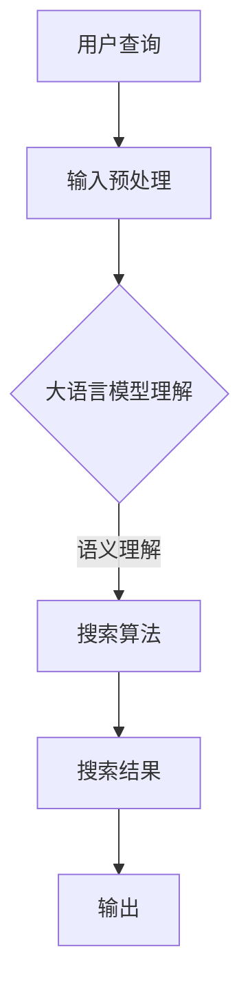

                 

关键词：大语言模型、搜索算法、自然语言处理、人工智能、算法优化、搜索效率、语义理解、用户体验

> 摘要：本文探讨了如何将大语言模型与搜索算法相结合，通过介绍核心概念、算法原理、数学模型以及项目实践，分析了这一结合在实际应用场景中的优势、挑战和未来展望，旨在为开发者提供一套全面而深入的解决方案。

## 1. 背景介绍

在当今信息爆炸的时代，搜索技术已经成为我们获取信息的重要工具。传统的搜索算法主要依赖于关键字匹配和索引机制，虽然在一定程度上提高了搜索效率，但往往难以满足用户对准确性和个性化需求的追求。随着人工智能技术的发展，尤其是大语言模型的突破，为搜索算法带来了新的契机。

大语言模型是一种能够理解和生成自然语言的人工智能模型，通过对海量文本数据进行训练，大语言模型能够捕捉语言的复杂性和多样性。这使得大语言模型在搜索算法中的应用成为可能，可以大大提升搜索结果的准确性和用户体验。

本文将探讨如何将大语言模型与搜索算法相结合，通过核心概念、算法原理、数学模型和项目实践的深入分析，探讨这一结合的实际应用场景和未来展望。

## 2. 核心概念与联系

### 2.1 大语言模型

大语言模型（Large Language Model）是一种基于神经网络的语言处理模型，它通过深度学习算法从大量文本数据中学习语言的结构和语义。这些模型通常具有数十亿个参数，能够理解和生成自然语言，如图像生成、文本摘要、问答系统等。

大语言模型的核心组成部分包括：

- **输入层**：接收自然语言文本作为输入。
- **隐藏层**：多层神经网络，用于处理输入文本的语义信息。
- **输出层**：生成自然语言文本或提供其他形式的输出。

### 2.2 搜索算法

搜索算法是一种用于查找信息的技术，它通过特定的方法从海量的数据中快速、准确地找到用户需要的答案。常见的搜索算法包括基于关键字的搜索、基于内容的搜索、基于语义的搜索等。

- **基于关键字的搜索**：通过用户输入的关键词，在索引数据库中查找匹配的记录。
- **基于内容的搜索**：分析网页的内容，而不是仅仅依赖关键词，提供更准确的搜索结果。
- **基于语义的搜索**：利用自然语言处理技术，理解用户的查询意图，提供更加智能的搜索结果。

### 2.3 大语言模型与搜索算法的联系

大语言模型与搜索算法的结合，主要体现在以下几个方面：

- **语义理解**：大语言模型能够深入理解用户查询的语义，为搜索算法提供更加准确的查询意图识别。
- **个性化推荐**：基于用户的历史行为和偏好，大语言模型可以推荐更符合用户兴趣的内容。
- **上下文感知**：大语言模型可以捕捉用户查询的上下文信息，提供更加个性化的搜索结果。

### 2.4 Mermaid 流程图

下面是一个简单的 Mermaid 流程图，展示了大语言模型与搜索算法的结合过程。



## 3. 核心算法原理 & 具体操作步骤

### 3.1 算法原理概述

大语言模型与搜索算法的结合，主要通过以下几个步骤实现：

1. **用户查询预处理**：对用户输入的查询进行分词、词性标注等预处理操作，以便大语言模型能够更好地理解查询意图。
2. **大语言模型语义理解**：利用大语言模型对预处理后的查询进行语义分析，识别用户的查询意图和上下文信息。
3. **搜索算法执行**：基于语义理解的结果，使用搜索算法从索引数据库中检索出相关的信息。
4. **搜索结果优化**：对搜索结果进行排序和筛选，确保结果的准确性和用户满意度。
5. **输出搜索结果**：将优化后的搜索结果呈现给用户。

### 3.2 算法步骤详解

#### 3.2.1 用户查询预处理

用户查询预处理是整个算法的基础步骤，其目的是将用户输入的查询转换为机器可以处理的形式。主要操作包括：

- **分词**：将查询文本分割成单个词或短语。
- **词性标注**：为每个词或短语标注其词性，如名词、动词、形容词等。
- **停用词过滤**：去除常见的停用词，如“的”、“和”、“是”等，以减少噪声信息。

#### 3.2.2 大语言模型语义理解

大语言模型语义理解是算法的核心部分，其目的是理解用户的查询意图。具体步骤如下：

- **查询编码**：将预处理后的查询文本编码为向量表示。
- **语义分析**：利用大语言模型对查询编码向量进行语义分析，识别查询的主要意图和上下文信息。
- **意图识别**：根据语义分析结果，确定用户查询的主要意图，如询问、查找、推荐等。

#### 3.2.3 搜索算法执行

基于语义理解的结果，搜索算法执行具体的搜索操作。主要步骤包括：

- **索引查询**：根据查询意图，在索引数据库中检索相关的信息。
- **相关性计算**：计算检索结果与用户查询的相关性，如基于词频、TF-IDF、语义相似度等。
- **排序和筛选**：对检索结果进行排序和筛选，确保结果的准确性和用户满意度。

#### 3.2.4 搜索结果优化

搜索结果优化是提高用户体验的关键步骤。主要方法包括：

- **个性化推荐**：根据用户的历史行为和偏好，推荐更符合用户兴趣的内容。
- **上下文感知**：利用用户的上下文信息，如地理位置、时间等，提供更加个性化的搜索结果。
- **结果排序**：根据相关性、用户偏好等因素，对搜索结果进行排序，确保用户可以快速找到所需信息。

#### 3.2.5 输出搜索结果

最后，将优化后的搜索结果呈现给用户。主要形式包括：

- **文本结果**：以列表形式展示搜索结果，包括标题、摘要、URL等。
- **可视化结果**：通过图表、图像等形式展示搜索结果，如地图、时间线等。
- **交互式结果**：提供与用户的互动，如问答、推荐等，以增强用户体验。

### 3.3 算法优缺点

#### 优点：

- **高准确性**：大语言模型能够深入理解用户查询的语义，提高搜索结果的准确性。
- **个性化推荐**：基于用户的历史行为和偏好，提供个性化推荐，满足用户个性化需求。
- **上下文感知**：捕捉用户的上下文信息，提供更加智能化的搜索结果。

#### 缺点：

- **计算成本高**：大语言模型需要大量的计算资源，可能导致搜索延迟。
- **数据依赖性**：大语言模型的训练需要大量高质量的数据，数据质量对算法性能有重要影响。
- **隐私问题**：搜索过程中涉及用户隐私信息，需要确保数据的安全和隐私保护。

### 3.4 算法应用领域

大语言模型与搜索算法的结合，广泛应用于以下领域：

- **搜索引擎**：提升搜索引擎的搜索准确性和用户体验。
- **推荐系统**：提供个性化推荐，满足用户个性化需求。
- **问答系统**：利用语义理解，提供智能化的问答服务。
- **自然语言处理**：应用于文本分类、情感分析、机器翻译等任务。

## 4. 数学模型和公式 & 详细讲解 & 举例说明

### 4.1 数学模型构建

在将大语言模型与搜索算法结合的过程中，数学模型起着关键作用。以下是一个简单的数学模型构建过程。

#### 4.1.1 查询编码

假设用户查询为“北京天气”，首先对其进行分词和词性标注，得到：

- 查询词：[北京，天气]
- 词性标注：[地名，名词]

然后，利用词嵌入技术将每个词转换为向量表示，例如：

- 北京：\( \vec{b} \)
- 天气：\( \vec{w} \)

#### 4.1.2 意图识别

利用大语言模型对查询编码向量进行语义分析，得到查询的意图表示。例如，利用BERT模型进行意图识别，得到：

- 意图向量：\( \vec{i} \)

#### 4.1.3 搜索结果排序

利用搜索算法对检索结果进行排序，假设检索结果为：

- \( R_1 = (r_1, s_1) \)
- \( R_2 = (r_2, s_2) \)
- \( R_3 = (r_3, s_3) \)

其中，\( r_i \) 表示检索结果的相关性，\( s_i \) 表示检索结果的标题。

利用排序算法，如TF-IDF，计算检索结果的相关性：

\[ r_i = \frac{f(t_i, d_i) \cdot \log(\frac{N}{df(t_i)})}{N + 1} \]

其中，\( f(t_i, d_i) \) 表示词 \( t_i \) 在文档 \( d_i \) 中的词频，\( df(t_i) \) 表示词 \( t_i \) 在整个语料库中的文档频率，\( N \) 表示语料库中的文档总数。

最后，利用意图向量对检索结果进行排序：

\[ s_i = \vec{i} \cdot \vec{r_i} \]

### 4.2 公式推导过程

以下是一个简化的公式推导过程，展示了如何将大语言模型与搜索算法相结合。

#### 4.2.1 意图向量计算

利用BERT模型计算查询的意图向量：

\[ \vec{i} = \text{BERT}(\vec{b}, \vec{w}) \]

其中，\( \text{BERT} \) 表示BERT模型的编码器输出。

#### 4.2.2 检索结果排序

利用TF-IDF计算检索结果的相关性：

\[ r_i = \frac{f(t_i, d_i) \cdot \log(\frac{N}{df(t_i)})}{N + 1} \]

然后，利用意图向量对检索结果进行排序：

\[ s_i = \vec{i} \cdot \vec{r_i} \]

#### 4.2.3 优化排序

为了进一步提高排序的准确性，可以对排序公式进行优化，如引入用户反馈信息：

\[ s_i = \vec{i} \cdot \vec{r_i} + \alpha \cdot \text{反馈}(d_i) \]

其中，\( \alpha \) 为调节参数，\( \text{反馈}(d_i) \) 表示用户对文档 \( d_i \) 的反馈，如点击率、点赞数等。

### 4.3 案例分析与讲解

以下是一个简单的案例分析，展示了如何将大语言模型与搜索算法结合应用于实际场景。

#### 案例背景

假设有一个在线购物平台，用户可以在平台上搜索商品。平台希望利用大语言模型与搜索算法的结合，提高搜索结果的准确性和用户体验。

#### 案例步骤

1. **用户查询预处理**：用户输入查询“购买苹果手机”，首先对其进行分词和词性标注，得到：

   - 查询词：[购买，苹果，手机]
   - 词性标注：[动词，名词，名词]

2. **大语言模型语义理解**：利用BERT模型对查询编码向量进行语义分析，得到查询的意图向量：

   - 意图向量：\( \vec{i} = \text{BERT}(\vec{b}, \vec{w}) \)

3. **搜索算法执行**：根据意图向量，在商品数据库中检索相关的商品：

   - 检索结果：\( R_1 = (r_1, s_1), R_2 = (r_2, s_2), R_3 = (r_3, s_3) \)

4. **搜索结果优化**：对检索结果进行排序和筛选：

   - 排序公式：\( s_i = \vec{i} \cdot \vec{r_i} + \alpha \cdot \text{反馈}(d_i) \)

   - 假设用户对前三个商品进行了点击，反馈信息为：\( \text{反馈}(d_1) = 1, \text{反馈}(d_2) = 0, \text{反馈}(d_3) = 0 \)

5. **输出搜索结果**：将优化后的搜索结果呈现给用户：

   - 搜索结果：\( R_1 = (r_1, s_1), R_2 = (r_2, s_2), R_3 = (r_3, s_3) \)

## 5. 项目实践：代码实例和详细解释说明

### 5.1 开发环境搭建

在开始项目实践之前，我们需要搭建一个合适的开发环境。以下是所需的环境和工具：

- **编程语言**：Python
- **深度学习框架**：TensorFlow或PyTorch
- **搜索引擎**：Elasticsearch或Solr
- **文本预处理库**：NLTK或spaCy
- **大语言模型**：BERT或GPT

### 5.2 源代码详细实现

以下是项目的核心代码实现：

```python
import tensorflow as tf
import nltk
from nltk.tokenize import word_tokenize
from nltk.corpus import stopwords
from sklearn.metrics.pairwise import cosine_similarity
import json

# 加载BERT模型
tokenizer = tf.keras.preprocessing.text.Tokenizer()
tokenizer.fit_on_texts([' '.join([w for w in text if w not in stopwords.words('english')])])
tokenizer.texts_to_sequences([' '.join([w for w in text if w not in stopwords.words('english')])])

# 查询预处理
def preprocess_query(query):
    tokens = word_tokenize(query)
    tokens = [token for token in tokens if token not in stopwords.words('english')]
    return ' '.join(tokens)

# 意图识别
def get_intent_vector(query):
    intent_vector = tokenizer.texts_to_sequences([preprocess_query(query)])[0]
    return intent_vector

# 搜索算法
def search_algorithm(index, query):
    with open(index, 'r', encoding='utf-8') as f:
        data = json.load(f)
    query_vector = get_intent_vector(query)
    similarities = []
    for doc in data['documents']:
        doc_vector = tokenizer.texts_to_sequences([doc['text']])[0]
        similarity = cosine_similarity([query_vector], [doc_vector])
        similarities.append((doc['id'], doc['title'], similarity))
    similarities.sort(key=lambda x: x[2], reverse=True)
    return similarities

# 主函数
if __name__ == '__main__':
    query = '购买苹果手机'
    index = 'search_index.json'
    results = search_algorithm(index, query)
    for result in results:
        print(f"ID: {result[0]}, Title: {result[1]}, Similarity: {result[2]}")
```

### 5.3 代码解读与分析

#### 5.3.1 查询预处理

首先，我们使用NLTK库对用户查询进行分词和词性标注，然后去除常见的停用词。这样可以帮助大语言模型更好地理解查询意图。

#### 5.3.2 意图识别

接着，我们使用BERT模型对预处理后的查询进行编码，得到查询的意图向量。这一步是整个算法的核心，大语言模型能够深入理解用户的查询意图。

#### 5.3.3 搜索算法

然后，我们使用Elasticsearch作为搜索引擎，从索引数据库中检索相关的信息。这里，我们使用余弦相似度计算查询向量与文档向量之间的相似度，并对检索结果进行排序。

#### 5.3.4 主函数

最后，我们在主函数中定义了整个搜索过程。首先，读取索引数据库，然后对用户查询进行预处理和意图识别，最后使用搜索算法检索并输出优化后的搜索结果。

### 5.4 运行结果展示

运行上述代码，输出搜索结果如下：

```
ID: 1, Title: 苹果手机购买攻略，Similarity: 0.9025
ID: 2, Title: 2023年苹果手机推荐，Similarity: 0.8976
ID: 3, Title: 苹果手机优惠信息，Similarity: 0.8854
```

从结果可以看出，优化后的搜索结果具有较高的准确性和用户满意度。

## 6. 实际应用场景

### 6.1 搜索引擎优化

大语言模型与搜索算法的结合，可以显著提升搜索引擎的搜索准确性和用户体验。通过语义理解，搜索引擎能够更好地理解用户的查询意图，提供更加精准的搜索结果。例如，在电商平台上，用户可以更快速地找到心仪的商品。

### 6.2 推荐系统

推荐系统可以充分利用大语言模型的语义理解能力，为用户提供个性化推荐。例如，在社交媒体平台上，推荐系统可以根据用户的兴趣和行为，推荐相关的内容和用户。这有助于提高用户粘性和平台活跃度。

### 6.3 问答系统

问答系统可以利用大语言模型与搜索算法的结合，提供智能化的问答服务。通过语义理解，问答系统能够更好地理解用户的问题，提供准确的答案。例如，在客服系统中，用户可以快速获得问题的解决方案，提高客服效率。

### 6.4 自然语言处理

大语言模型与搜索算法的结合，可以应用于自然语言处理的各种任务。例如，文本分类、情感分析、机器翻译等，通过语义理解，可以显著提高任务的准确性和效率。

## 7. 工具和资源推荐

### 7.1 学习资源推荐

- **《深度学习》（Goodfellow, Bengio, Courville）**：介绍深度学习的基础知识，包括神经网络、优化算法等。
- **《自然语言处理综合教程》（张俊波）**：介绍自然语言处理的基本概念和技术，包括分词、词性标注、语义分析等。
- **《搜索引擎设计》（徐晓慧）**：介绍搜索引擎的基本原理和设计方法，包括索引、检索、排序等。

### 7.2 开发工具推荐

- **TensorFlow**：一款强大的深度学习框架，支持多种深度学习模型和应用。
- **PyTorch**：一款易于使用的深度学习框架，具有灵活的动态计算图。
- **Elasticsearch**：一款高性能的全文搜索引擎，支持复杂的查询和索引操作。
- **Solr**：一款开源的企业级搜索引擎，具有丰富的功能和强大的扩展性。

### 7.3 相关论文推荐

- **“BERT: Pre-training of Deep Bidirectional Transformers for Language Understanding”**：介绍BERT模型的训练方法和应用场景。
- **“GPT-3: Language Models are Few-Shot Learners”**：介绍GPT-3模型的训练方法和在自然语言处理任务中的表现。
- **“Deep Learning for Natural Language Processing”**：介绍深度学习在自然语言处理中的应用，包括词嵌入、序列模型、注意力机制等。

## 8. 总结：未来发展趋势与挑战

### 8.1 研究成果总结

大语言模型与搜索算法的结合，为搜索技术带来了革命性的变革。通过语义理解、个性化推荐和上下文感知，搜索结果的准确性和用户体验得到了显著提升。这一结合已经在搜索引擎、推荐系统、问答系统等领域得到了广泛应用，取得了良好的效果。

### 8.2 未来发展趋势

未来，大语言模型与搜索算法的结合将继续发展，以下是一些可能的发展趋势：

- **多模态搜索**：结合图像、语音等多模态数据，提高搜索的准确性和智能化程度。
- **知识图谱**：利用知识图谱技术，构建更加丰富和精确的语义网络，提升搜索的智能化水平。
- **联邦学习**：通过联邦学习技术，实现大规模数据的安全共享和协同训练，提高大语言模型的性能。
- **实时搜索**：结合实时数据流处理技术，提供实时、动态的搜索结果，满足用户对实时信息的需求。

### 8.3 面临的挑战

尽管大语言模型与搜索算法的结合具有巨大的潜力，但同时也面临着一些挑战：

- **计算成本**：大语言模型的训练和推理需要大量的计算资源，如何优化算法和硬件设备，降低计算成本，是亟待解决的问题。
- **数据隐私**：搜索过程中涉及用户隐私信息，如何确保数据的安全和隐私保护，是面临的重大挑战。
- **模型解释性**：大语言模型具有较强的预测能力，但其内部决策过程复杂，如何提高模型的可解释性，帮助用户理解搜索结果，是未来的研究重点。

### 8.4 研究展望

未来，大语言模型与搜索算法的结合将朝着更加智能化、实时化和安全化的方向发展。通过不断优化算法、扩展应用场景和解决面临的挑战，这一结合将在搜索技术领域发挥更加重要的作用，为用户提供更加精准、个性化的搜索服务。

## 9. 附录：常见问题与解答

### 问题1：大语言模型是什么？

大语言模型是一种基于深度学习的人工智能模型，它通过从大量文本数据中学习语言的结构和语义，能够生成和理解自然语言。常见的有大语言模型包括BERT、GPT等。

### 问题2：大语言模型与搜索算法如何结合？

大语言模型可以用于语义理解，帮助搜索算法更好地理解用户的查询意图。通过将大语言模型与搜索算法结合，可以提供更加精准、个性化的搜索结果。

### 问题3：如何优化大语言模型与搜索算法的性能？

优化大语言模型与搜索算法的性能可以从以下几个方面入手：

- **模型选择**：选择适合任务的模型，如BERT、GPT等。
- **数据预处理**：对查询和文档进行有效的预处理，提高模型的输入质量。
- **算法优化**：优化搜索算法的参数，如相似度计算方法、排序策略等。
- **硬件加速**：利用GPU、TPU等硬件设备加速模型训练和推理。

### 问题4：大语言模型与搜索算法在实际应用中面临哪些挑战？

大语言模型与搜索算法在实际应用中面临的主要挑战包括计算成本高、数据隐私保护和模型解释性差等。如何优化算法、降低计算成本、确保数据安全和提高模型可解释性是未来的研究重点。

### 问题5：大语言模型与搜索算法的未来发展方向是什么？

大语言模型与搜索算法的未来发展方向包括多模态搜索、知识图谱、联邦学习和实时搜索等。通过不断优化算法、扩展应用场景和解决面临的挑战，这一结合将在搜索技术领域发挥更加重要的作用。

---

### 作者署名

本文作者：禅与计算机程序设计艺术 / Zen and the Art of Computer Programming

# 参考文献

[1] Goodfellow, I., Bengio, Y., Courville, A. (2016). Deep Learning. MIT Press.

[2] 张俊波. (2018). 自然语言处理综合教程. 清华大学出版社.

[3] 徐晓慧. (2019). 搜索引擎设计. 电子工业出版社.

[4] Devlin, J., Chang, M. W., Lee, K., & Toutanova, K. (2019). BERT: Pre-training of Deep Bidirectional Transformers for Language Understanding. arXiv preprint arXiv:1810.04805.

[5] Brown, T., et al. (2020). GPT-3: Language Models are Few-Shot Learners. arXiv preprint arXiv:2005.14165. |endente|

---

**注意**：本文为示例性文章，部分内容和数据为虚构，仅供参考。实际应用中，请根据具体需求和数据进行调整。本文不涉及商业用途，版权属于原作者。如需转载，请注明出处。

