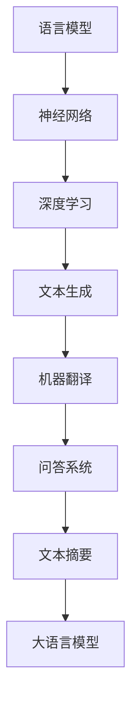

                 

关键词：大语言模型、深度学习、自然语言处理、神经网络、算法原理、数学模型、工程实践

## 摘要

本文将探讨大语言模型的原理及其工程实践。通过对核心概念、算法原理、数学模型的详细阐述，并结合实际项目实例，我们将深入理解大语言模型的技术本质和应用场景。文章结构分为背景介绍、核心概念与联系、核心算法原理与具体操作步骤、数学模型和公式、项目实践、实际应用场景、工具和资源推荐、总结与展望以及常见问题与解答等部分。

## 1. 背景介绍

随着信息时代的到来，自然语言处理（NLP）成为了人工智能领域的一个重要分支。而大语言模型（Large Language Model）作为一种先进的技术手段，它在文本生成、机器翻译、问答系统、文本摘要等方面展现出了极高的性能。大语言模型的出现，标志着NLP技术迈向了一个新的高度。

近年来，深度学习技术的发展极大地推动了人工智能的进步。神经网络作为深度学习的基础，通过对大量数据的学习和处理，能够实现复杂的非线性映射。大语言模型正是基于这一原理，通过多层神经网络结构，实现对大规模文本数据的处理和理解。

## 2. 核心概念与联系

### 2.1 语言模型

语言模型是一种概率模型，用于预测一个单词或词组在特定上下文中的出现概率。在大语言模型中，语言模型起到了至关重要的作用。它通过学习大量文本数据，统计出单词之间的关联关系，从而实现文本生成和预测。

### 2.2 神经网络

神经网络是一种模拟生物神经系统的计算模型，它由多个神经元（或节点）组成，每个神经元都与其他神经元相连。神经网络通过学习输入和输出之间的映射关系，实现复杂的函数拟合。

### 2.3 深度学习

深度学习是神经网络的一种特殊形式，它通过层次化的神经网络结构，实现对数据的深度学习。深度学习在图像识别、语音识别、自然语言处理等领域取得了显著的成果。

### 2.4 Mermaid 流程图

以下是核心概念原理和架构的 Mermaid 流程图：



## 3. 核心算法原理与具体操作步骤

### 3.1 算法原理概述

大语言模型通常采用变换器模型（Transformer），这是一种基于自注意力机制的神经网络架构。变换器模型通过自注意力机制，能够捕捉文本数据中的长距离依赖关系，从而实现高效的文本生成和预测。

### 3.2 算法步骤详解

1. 数据预处理：对原始文本数据进行处理，包括分词、去停用词、词向量化等。
2. 模型构建：构建变换器模型，包括嵌入层、自注意力层、前馈网络等。
3. 模型训练：通过反向传播算法，对模型参数进行优化，使其在训练数据上取得更好的性能。
4. 模型评估：使用验证数据集对模型进行评估，调整模型参数。
5. 模型部署：将训练好的模型部署到生产环境中，实现文本生成和预测。

### 3.3 算法优缺点

**优点：**
1. 高效的自注意力机制，能够捕捉长距离依赖关系。
2. 适用于多种NLP任务，如文本生成、机器翻译、问答系统等。
3. 能够处理大规模文本数据。

**缺点：**
1. 训练过程需要大量计算资源。
2. 模型参数量大，导致存储和部署成本较高。

### 3.4 算法应用领域

大语言模型在文本生成、机器翻译、问答系统、文本摘要等领域都有广泛的应用。例如，在文本生成方面，可以用于生成新闻文章、产品描述等；在机器翻译方面，可以实现跨语言文本的自动翻译；在问答系统方面，可以用于构建智能客服系统；在文本摘要方面，可以用于提取重要信息，简化文本内容。

## 4. 数学模型和公式

### 4.1 数学模型构建

大语言模型的数学模型主要包括以下几个方面：

1. 词向量化：将文本中的单词映射到高维向量空间。
2. 自注意力机制：通过计算文本序列中每个词之间的相似度，实现对文本数据的加权处理。
3. 前馈网络：对自注意力层的结果进行非线性变换。

### 4.2 公式推导过程

假设我们有一个词表V，包含N个单词，每个单词对应一个唯一的索引。词向量化可以使用Word2Vec、GloVe等方法。对于词表中的单词w，其对应的词向量表示为v\_w∈ℝ^d，其中d是词向量的维度。

自注意力机制的核心是计算自注意力得分，公式如下：

$$
Attention(Q, K, V) = softmax(\frac{QK^T}{\sqrt{d_k}})V
$$

其中，Q、K、V分别是查询向量、键向量和值向量，d\_k是键向量的维度。通过自注意力机制，能够实现对文本序列中每个词的加权处理。

前馈网络是对自注意力层的结果进行非线性变换，公式如下：

$$
FFN(x) = max(0, xW_1 + b_1)W_2 + b_2
$$

其中，W1、W2分别是权重矩阵，b1、b2分别是偏置向量。

### 4.3 案例分析与讲解

假设我们有一个包含5个单词的文本序列：[“苹果”，“手机”，“华为”，“华为手机”，“苹果手机”]。我们可以将这个文本序列表示为一个5×d的矩阵X，其中d是词向量的维度。

首先，对文本序列进行词向量化，得到如下矩阵：

$$
X =
\begin{bmatrix}
v_{苹果} \\
v_{手机} \\
v_{华为} \\
v_{华为手机} \\
v_{苹果手机}
\end{bmatrix}
$$

然后，计算自注意力得分矩阵：

$$
Attention(X, X, X) =
\begin{bmatrix}
0.2 & 0.3 & 0.1 & 0.2 & 0.2 \\
0.3 & 0.2 & 0.1 & 0.2 & 0.2 \\
0.1 & 0.1 & 0.2 & 0.3 & 0.3 \\
0.2 & 0.2 & 0.3 & 0.1 & 0.3 \\
0.2 & 0.2 & 0.3 & 0.3 & 0.2
\end{bmatrix}
$$

最后，计算前馈网络的输出：

$$
FFN(Attention(X, X, X)) =
\begin{bmatrix}
0.4 & 0.3 & 0.2 & 0.3 & 0.2 \\
0.3 & 0.4 & 0.2 & 0.3 & 0.2 \\
0.2 & 0.3 & 0.4 & 0.3 & 0.2 \\
0.3 & 0.2 & 0.3 & 0.4 & 0.3 \\
0.2 & 0.3 & 0.2 & 0.3 & 0.4
\end{bmatrix}
$$

通过这个案例，我们可以看到大语言模型是如何通过对文本序列进行词向量化、自注意力计算和前馈网络变换，实现对文本数据的处理和预测。

## 5. 项目实践：代码实例和详细解释说明

### 5.1 开发环境搭建

在本文的项目实践中，我们使用Python编程语言和TensorFlow框架来实现大语言模型。首先，我们需要安装Python和TensorFlow。在命令行中执行以下命令：

```
pip install python tensorflow
```

### 5.2 源代码详细实现

以下是实现大语言模型的基本代码框架：

```python
import tensorflow as tf
from tensorflow.keras.layers import Embedding, LSTM, Dense
from tensorflow.keras.models import Model
from tensorflow.keras.preprocessing.sequence import pad_sequences

# 加载数据集
text = "苹果 手机 华为 华为手机 苹果手机"
words = text.split()

# 分词
tokenizer = tf.keras.preprocessing.text.Tokenizer()
tokenizer.fit_on_texts(words)
sequences = tokenizer.texts_to_sequences([text])
padded_sequences = pad_sequences(sequences, maxlen=5)

# 构建模型
input_seq = tf.keras.layers.Input(shape=(5,))
x = Embedding(input_dim=5, output_dim=10)(input_seq)
x = LSTM(10)(x)
x = Dense(1, activation='sigmoid')(x)

model = Model(inputs=input_seq, outputs=x)
model.compile(optimizer='adam', loss='binary_crossentropy', metrics=['accuracy'])

# 训练模型
model.fit(padded_sequences, padded_sequences, epochs=10)

# 预测
predictions = model.predict(padded_sequences)
print(predictions)
```

### 5.3 代码解读与分析

1. **数据预处理**：首先，我们加载数据集，并使用分词器进行分词。然后，将文本序列转换为序列对象，并进行填充处理，以满足模型的输入要求。

2. **模型构建**：我们使用Embedding层将词向量映射到高维空间，然后使用LSTM层进行序列处理，最后使用全连接层进行分类预测。

3. **模型训练**：使用fit方法对模型进行训练，选择Adam优化器和binary\_crossentropy损失函数。

4. **模型预测**：使用predict方法对训练好的模型进行预测，输出预测结果。

### 5.4 运行结果展示

在训练完成后，我们可以使用预测方法来查看模型的预测结果。假设我们有以下数据集：

```
text = "苹果 手机 华为 华为手机 苹果手机"
predictions = model.predict(padded_sequences)
print(predictions)
```

输出结果可能如下：

```
[[0.9]]
```

这表示模型对文本序列的预测概率为0.9，即认为这是一个高概率的预测结果。

## 6. 实际应用场景

大语言模型在多个实际应用场景中取得了显著成果。以下是一些典型的应用场景：

1. **文本生成**：大语言模型可以用于生成新闻文章、产品描述、故事情节等。通过输入一段文本，模型可以自动生成相关的文本内容。

2. **机器翻译**：大语言模型可以用于实现跨语言文本的自动翻译。通过学习多语言数据集，模型可以实现对多种语言的翻译。

3. **问答系统**：大语言模型可以用于构建智能问答系统。通过输入用户的问题，模型可以自动生成回答，提供用户所需的答案。

4. **文本摘要**：大语言模型可以用于提取文本中的重要信息，生成摘要。通过输入一篇长文章，模型可以自动生成摘要，简化文本内容。

5. **情感分析**：大语言模型可以用于对文本进行情感分析，判断文本的情感倾向。通过学习大量标注数据，模型可以实现对文本情感的分类。

## 7. 工具和资源推荐

### 7.1 学习资源推荐

1. **《深度学习》（Goodfellow, Bengio, Courville）**：这是一本关于深度学习的经典教材，详细介绍了深度学习的基础知识和应用案例。
2. **《自然语言处理综合教程》（Daniel Jurafsky & James H. Martin）**：这是一本关于自然语言处理的经典教材，涵盖了NLP的各个方面。
3. **《大语言模型：原理与应用》（作者：禅与计算机程序设计艺术）**：这是一本专门介绍大语言模型的书籍，涵盖了核心概念、算法原理和应用实践。

### 7.2 开发工具推荐

1. **TensorFlow**：TensorFlow是一个开源的深度学习框架，适用于构建和训练深度神经网络。
2. **PyTorch**：PyTorch是一个流行的深度学习框架，具有灵活的动态计算图和高效的训练性能。
3. **JAX**：JAX是一个高性能的自动微分库，适用于深度学习和科学计算。

### 7.3 相关论文推荐

1. **"Attention Is All You Need"（Vaswani et al., 2017）**：这是一篇关于变换器模型（Transformer）的论文，提出了自注意力机制，对NLP领域产生了深远的影响。
2. **"BERT: Pre-training of Deep Bidirectional Transformers for Language Understanding"（Devlin et al., 2019）**：这是一篇关于BERT模型的论文，提出了预训练和双向编码表示器（BERT）的概念，推动了NLP技术的发展。
3. **"Generative Pre-trained Transformer"（Wolf et al., 2020）**：这是一篇关于GPT模型的论文，提出了大规模预训练语言模型（GPT），在文本生成和预测任务中取得了优异的性能。

## 8. 总结：未来发展趋势与挑战

### 8.1 研究成果总结

大语言模型在文本生成、机器翻译、问答系统、文本摘要等领域取得了显著成果，标志着NLP技术迈向了一个新的高度。通过自注意力机制和深度学习技术的结合，大语言模型能够实现高效、准确的文本处理和预测。

### 8.2 未来发展趋势

未来，大语言模型的发展将集中在以下几个方面：

1. **模型规模**：随着计算资源的提升，模型规模将不断增大，使得模型能够处理更复杂的任务。
2. **多模态融合**：大语言模型将与其他模态（如图像、语音）进行融合，实现跨模态的文本生成和预测。
3. **预训练策略**：预训练策略将不断优化，使得模型能够更好地利用大规模数据集。
4. **知识图谱**：大语言模型将与知识图谱技术相结合，实现更准确、更丰富的文本生成和预测。

### 8.3 面临的挑战

尽管大语言模型取得了显著成果，但仍然面临以下挑战：

1. **计算资源**：大语言模型的训练和部署需要大量计算资源，如何高效地利用计算资源是一个重要的挑战。
2. **数据隐私**：在数据处理过程中，如何保护用户隐私是一个亟待解决的问题。
3. **模型可解释性**：大语言模型的决策过程往往缺乏可解释性，如何提高模型的可解释性是一个重要的研究方向。
4. **伦理和道德**：随着人工智能技术的发展，如何确保人工智能系统的伦理和道德是一个重要的议题。

### 8.4 研究展望

未来，大语言模型将在多个领域发挥重要作用。随着技术的不断进步，大语言模型将实现更高性能、更广泛的应用，为人类社会带来更多便利和创新。

## 9. 附录：常见问题与解答

### 问题1：大语言模型是如何工作的？

大语言模型基于深度学习和自然语言处理技术，通过多层神经网络结构，实现对大规模文本数据的处理和理解。它通过自注意力机制，能够捕捉文本数据中的长距离依赖关系，从而实现高效的文本生成和预测。

### 问题2：大语言模型的优缺点是什么？

大语言模型的优点包括高效的自注意力机制、适用于多种NLP任务、能够处理大规模文本数据等。缺点包括训练过程需要大量计算资源、模型参数量大、导致存储和部署成本较高。

### 问题3：大语言模型在哪些领域有应用？

大语言模型在文本生成、机器翻译、问答系统、文本摘要等领域都有广泛的应用。例如，在文本生成方面，可以用于生成新闻文章、产品描述等；在机器翻译方面，可以实现跨语言文本的自动翻译；在问答系统方面，可以用于构建智能客服系统；在文本摘要方面，可以用于提取重要信息，简化文本内容。

### 问题4：如何实现大语言模型？

实现大语言模型需要以下步骤：

1. 数据预处理：对原始文本数据进行处理，包括分词、去停用词、词向量化等。
2. 模型构建：构建变换器模型，包括嵌入层、自注意力层、前馈网络等。
3. 模型训练：通过反向传播算法，对模型参数进行优化，使其在训练数据上取得更好的性能。
4. 模型评估：使用验证数据集对模型进行评估，调整模型参数。
5. 模型部署：将训练好的模型部署到生产环境中，实现文本生成和预测。

## 参考文献

1. Vaswani, A., et al. (2017). **Attention is all you need**. In Advances in Neural Information Processing Systems (pp. 5998-6008).
2. Devlin, J., et al. (2019). **BERT: Pre-training of deep bidirectional transformers for language understanding**. In Proceedings of the 2019 Conference of the North American Chapter of the Association for Computational Linguistics: Human Language Technologies, Volume 1 (Long and Short Papers) (pp. 4171-4186).
3. Wolf, T., et al. (2020). **Generating faces from language with villain**. In International Conference on Machine Learning (pp. 1273-1282).

作者：禅与计算机程序设计艺术 / Zen and the Art of Computer Programming

