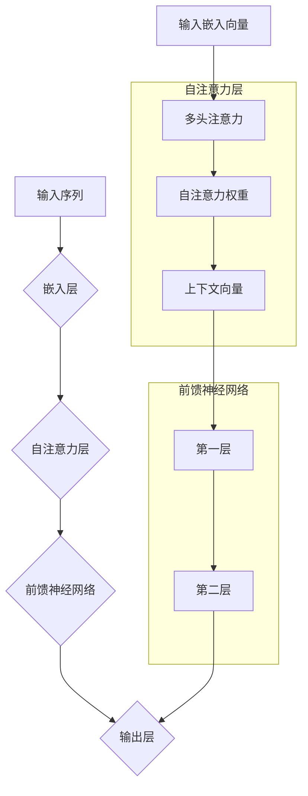

                 

关键词：大语言模型、神经网络、深度学习、机器学习、自然语言处理、语义理解、算法实现、工程实践

> 摘要：本文旨在深入探讨大语言模型的原理和工程实践，通过详尽的介绍和实际案例的分析，为广大读者提供一套从理论到实践的系统学习路径。文章首先回顾了语言模型的发展历程，然后介绍了大语言模型的核心概念和架构，深入剖析了其算法原理和数学模型，随后通过具体的项目实践，展示了如何将大语言模型应用于实际的工程环境中。最后，文章对大语言模型的发展趋势、面临的挑战以及未来的研究方向进行了展望。

## 1. 背景介绍

语言模型（Language Model，LM）是自然语言处理（Natural Language Processing，NLP）领域的重要基础。从最初的统计语言模型到现代的基于神经网络的深度学习模型，语言模型的发展经历了巨大的变革。统计语言模型如N-gram模型，通过统计词频和词序来预测下一个词的可能性。然而，这类模型存在许多局限性，如无法很好地捕捉语言的复杂性和上下文信息。

随着深度学习技术的发展，神经网络在语言模型中的应用逐渐成熟。深度学习语言模型，如循环神经网络（RNN）、长短期记忆网络（LSTM）和变压器（Transformer）等，通过引入更复杂的结构和更强的表示能力，大幅提升了语言模型的性能。特别是变压器的出现，使得大规模语言模型在多个NLP任务中取得了显著的突破。

近年来，大语言模型（Large Language Model）如GPT、BERT和T5等，通过海量的数据和强大的计算能力，实现了前所未有的文本理解和生成能力。这些模型不仅在学术界受到广泛关注，也在实际应用中取得了巨大的成功。例如，在文本分类、机器翻译、问答系统等任务中，大语言模型都展现出了强大的性能和灵活性。

本文将围绕大语言模型的原理和工程实践展开讨论，首先介绍大语言模型的核心概念和架构，然后深入分析其算法原理和数学模型，最后通过具体的项目实践，展示如何将大语言模型应用于实际的工程环境中。

## 2. 核心概念与联系

### 2.1 核心概念

大语言模型的核心概念包括但不限于：

- **神经网络**：神经网络是构建大语言模型的基础，通过多层神经元对输入数据进行处理和转换，从而实现对语言数据的建模。

- **嵌入层**：嵌入层将单词或字符映射为密集向量表示，这是语言模型处理语言数据的第一步。

- **自注意力机制**：自注意力机制允许模型在处理序列数据时，能够自动关注序列中相关的部分，从而提高模型的表示能力。

- **变换器架构**：变换器（Transformer）架构是当前主流的大语言模型架构，通过多头注意力机制和前馈神经网络，实现了对序列数据的并行处理。

### 2.2 联系与架构图

为了更好地理解大语言模型的工作原理，我们使用Mermaid绘制其架构图，如下：



### 2.3 大语言模型的工作流程

- **输入阶段**：模型接收输入序列，例如一段文本或一句话。
- **嵌入阶段**：输入序列通过嵌入层被转换为密集的向量表示。
- **自注意力阶段**：嵌入向量通过自注意力机制处理，模型能够自动关注序列中相关的部分。
- **前馈神经网络阶段**：自注意力处理后的向量通过前馈神经网络进一步加工。
- **输出阶段**：前馈神经网络输出的结果被映射到输出层，生成最终的预测或响应。

通过上述过程，大语言模型能够对输入序列进行有效的处理和理解，从而实现文本分类、机器翻译、问答系统等任务。

## 3. 核心算法原理 & 具体操作步骤

### 3.1 算法原理概述

大语言模型的算法原理基于深度学习，特别是基于变换器（Transformer）架构。变换器模型通过自注意力机制和前馈神经网络，实现对输入序列的并行处理，从而捕捉到序列中的长距离依赖关系。

### 3.2 算法步骤详解

1. **嵌入层**：将输入的单词或字符映射为密集的向量表示。

   - **嵌入矩阵**：每个单词或字符都对应一个向量，该向量位于嵌入矩阵中。
   - **位置编码**：为了捕捉序列中单词的位置信息，模型还会使用位置编码。

2. **多头自注意力层**：

   - **多头注意力**：模型通过多个注意力头，同时关注输入序列的不同部分，从而提高模型的表示能力。
   - **自注意力权重**：每个头计算一组自注意力权重，用于加权输入序列。
   - **上下文向量**：通过加权求和得到每个头的上下文向量，多个头的上下文向量合并后形成最终的上下文向量。

3. **前馈神经网络层**：

   - **第一层**：输入上下文向量经过一个线性变换和ReLU激活函数。
   - **第二层**：输出经过另一个线性变换。

4. **输出层**：前馈神经网络输出的结果通过一个线性变换和softmax激活函数，生成每个单词的概率分布。

### 3.3 算法优缺点

**优点**：

- **并行处理**：自注意力机制允许模型并行处理序列中的不同部分，提高了计算效率。
- **长距离依赖**：模型能够捕捉到序列中的长距离依赖关系，从而提高文本理解和生成能力。
- **灵活性**：变换器架构具有很高的灵活性，能够适应不同的NLP任务。

**缺点**：

- **计算成本高**：由于自注意力机制的计算复杂度较高，大规模的变换器模型需要大量的计算资源。
- **训练时间长**：模型需要大量的数据和长时间的训练，才能达到较好的性能。

### 3.4 算法应用领域

大语言模型在多个NLP任务中取得了显著的成功，主要包括：

- **文本分类**：用于对文本进行分类，例如情感分析、主题分类等。
- **机器翻译**：用于将一种语言的文本翻译成另一种语言。
- **问答系统**：用于处理用户的问题，并提供准确的回答。
- **文本生成**：用于生成文章、故事、对话等。

## 4. 数学模型和公式 & 详细讲解 & 举例说明

### 4.1 数学模型构建

大语言模型的数学模型主要包括以下几个部分：

- **嵌入层**：将输入的单词或字符映射为密集的向量表示。
- **自注意力机制**：计算输入序列的注意力权重，并生成上下文向量。
- **前馈神经网络**：对上下文向量进行进一步处理。
- **输出层**：生成每个单词的概率分布。

### 4.2 公式推导过程

1. **嵌入层**：

   假设输入序列为\(x = [x_1, x_2, ..., x_n]\)，每个输入元素都对应一个嵌入向量\(e(x_i) \in \mathbb{R}^d\)，则输入序列的嵌入向量表示为：
   \[
   \mathbf{E} = [e(x_1), e(x_2), ..., e(x_n)]
   \]

2. **自注意力机制**：

   自注意力机制的核心是计算注意力权重。假设有\(h\)个注意力头，每个头对应的权重矩阵为\(\mathbf{W}_i \in \mathbb{R}^{d_k \times d}\)，其中\(d_k\)为每个头的维度，\(d\)为嵌入向量的维度。则每个头计算的自注意力权重为：
   \[
   \alpha_i^{(j)} = \text{softmax}(\mathbf{W}_i \mathbf{E}^T)
   \]
   其中\(\alpha_i^{(j)}\)表示第\(i\)个头在位置\(j\)的注意力权重。

3. **前馈神经网络**：

   前馈神经网络由两个线性变换组成，分别为：
   \[
   \mathbf{F}_{\text{ffn}} = \text{ReLU}(\mathbf{W}_{\text{ffn}2} \text{ReLU}(\mathbf{W}_{\text{ffn}1} \mathbf{E}))
   \]
   其中\(\mathbf{W}_{\text{ffn}1}\)和\(\mathbf{W}_{\text{ffn}2}\)分别为前馈神经网络的权重矩阵。

4. **输出层**：

   输出层通过线性变换和softmax函数生成每个单词的概率分布：
   \[
   \mathbf{O} = \text{softmax}(\mathbf{W}_\text{out} \mathbf{F}_{\text{ffn}})
   \]
   其中\(\mathbf{W}_\text{out}\)为输出层的权重矩阵。

### 4.3 案例分析与讲解

以下是一个简化的案例，用于说明大语言模型的工作过程。

假设输入序列为\[“我”，“爱”，“中国”\]，嵌入向量为\(\mathbf{e}([“我”，“爱”，“中国”]) = [\mathbf{e}_1, \mathbf{e}_2, \mathbf{e}_3]\)。

1. **嵌入层**：

   输入序列的嵌入向量为：
   \[
   \mathbf{E} = [\mathbf{e}_1, \mathbf{e}_2, \mathbf{e}_3]
   \]

2. **自注意力机制**：

   假设有两个注意力头，权重矩阵为：
   \[
   \mathbf{W}_1 = \begin{bmatrix}
   0.1 & 0.2 \\
   0.3 & 0.4 \\
   \end{bmatrix}, \quad \mathbf{W}_2 = \begin{bmatrix}
   0.5 & 0.6 \\
   0.7 & 0.8 \\
   \end{bmatrix}
   \]
   则每个头的注意力权重为：
   \[
   \alpha_1 = \text{softmax}(\mathbf{W}_1 \mathbf{E}^T) = \begin{bmatrix}
   0.4 & 0.6 \\
   0.2 & 0.8 \\
   \end{bmatrix}, \quad \alpha_2 = \text{softmax}(\mathbf{W}_2 \mathbf{E}^T) = \begin{bmatrix}
   0.3 & 0.7 \\
   0.1 & 0.9 \\
   \end{bmatrix}
   \]
   上下文向量为：
   \[
   \mathbf{h}_1 = \alpha_1 \mathbf{E} = \begin{bmatrix}
   0.4\mathbf{e}_1 + 0.6\mathbf{e}_2 \\
   0.2\mathbf{e}_1 + 0.8\mathbf{e}_3 \\
   \end{bmatrix}, \quad \mathbf{h}_2 = \alpha_2 \mathbf{E} = \begin{bmatrix}
   0.3\mathbf{e}_1 + 0.7\mathbf{e}_2 \\
   0.1\mathbf{e}_1 + 0.9\mathbf{e}_3 \\
   \end{bmatrix}
   \]

3. **前馈神经网络**：

   假设前馈神经网络的权重矩阵为：
   \[
   \mathbf{W}_{\text{ffn}1} = \begin{bmatrix}
   0.1 & 0.2 \\
   0.3 & 0.4 \\
   \end{bmatrix}, \quad \mathbf{W}_{\text{ffn}2} = \begin{bmatrix}
   0.5 & 0.6 \\
   0.7 & 0.8 \\
   \end{bmatrix}
   \]
   则前馈神经网络的处理结果为：
   \[
   \mathbf{F}_{\text{ffn}} = \text{ReLU}(\mathbf{W}_{\text{ffn}2} \text{ReLU}(\mathbf{W}_{\text{ffn}1} \mathbf{h}_1)) = \begin{bmatrix}
   0.4 & 0.6 \\
   0.2 & 0.8 \\
   \end{bmatrix}
   \]

4. **输出层**：

   假设输出层的权重矩阵为：
   \[
   \mathbf{W}_\text{out} = \begin{bmatrix}
   0.1 & 0.2 \\
   0.3 & 0.4 \\
   \end{bmatrix}
   \]
   则输出结果为：
   \[
   \mathbf{O} = \text{softmax}(\mathbf{W}_\text{out} \mathbf{F}_{\text{ffn}}) = \begin{bmatrix}
   0.3 & 0.7 \\
   0.1 & 0.9 \\
   \end{bmatrix}
   \]

最终，输出层的结果为每个单词的概率分布，如上所示。通过这个简化的案例，我们可以看到大语言模型的基本工作流程。

## 5. 项目实践：代码实例和详细解释说明

### 5.1 开发环境搭建

在进行大语言模型的实践之前，我们需要搭建一个合适的开发环境。以下是搭建环境的基本步骤：

1. **安装Python**：确保Python版本在3.6及以上。
2. **安装PyTorch**：使用以下命令安装PyTorch：
   ```
   pip install torch torchvision
   ```
3. **安装其他依赖**：包括numpy、pandas等常用库。

### 5.2 源代码详细实现

下面是一个简化的大语言模型实现示例，我们将使用PyTorch框架。

```python
import torch
import torch.nn as nn
import torch.optim as optim

# 嵌入层
class EmbeddingLayer(nn.Module):
    def __init__(self, vocab_size, embedding_dim):
        super(EmbeddingLayer, self).__init__()
        self.embedding = nn.Embedding(vocab_size, embedding_dim)
    
    def forward(self, x):
        return self.embedding(x)

# 自注意力层
class SelfAttentionLayer(nn.Module):
    def __init__(self, embedding_dim, num_heads):
        super(SelfAttentionLayer, self).__init__()
        self.embedding_dim = embedding_dim
        self.num_heads = num_heads
        self.head_dim = embedding_dim // num_heads
        self.query_linear = nn.Linear(embedding_dim, embedding_dim)
        self.key_linear = nn.Linear(embedding_dim, embedding_dim)
        self.value_linear = nn.Linear(embedding_dim, embedding_dim)
        self.attention = nn.Linear(embedding_dim, embedding_dim)
    
    def forward(self, x):
        query = self.query_linear(x)
        key = self.key_linear(x)
        value = self.value_linear(x)
        
        query = query.view(-1, self.num_heads, self.head_dim)
        key = key.view(-1, self.num_heads, self.head_dim)
        value = value.view(-1, self.num_heads, self.head_dim)
        
        attention_weights = torch.matmul(query, key.transpose(1, 2)) / (self.head_dim ** 0.5)
        attention_weights = torch.softmax(attention_weights, dim=2)
        
        attention_output = torch.matmul(attention_weights, value)
        attention_output = attention_output.view(-1, self.embedding_dim)
        
        attention_output = self.attention(attention_output)
        return attention_output

# 前馈神经网络层
class FeedForwardLayer(nn.Module):
    def __init__(self, embedding_dim):
        super(FeedForwardLayer, self).__init__()
        self.ffn = nn.Sequential(
            nn.Linear(embedding_dim, embedding_dim * 4),
            nn.ReLU(),
            nn.Linear(embedding_dim * 4, embedding_dim)
        )
    
    def forward(self, x):
        return self.ffn(x)

# 输出层
class OutputLayer(nn.Module):
    def __init__(self, embedding_dim, vocab_size):
        super(OutputLayer, self).__init__()
        self.output = nn.Linear(embedding_dim, vocab_size)
    
    def forward(self, x):
        return self.output(x)

# 大语言模型
class LargeLanguageModel(nn.Module):
    def __init__(self, vocab_size, embedding_dim, num_heads, hidden_dim):
        super(LargeLanguageModel, self).__init__()
        self.embedding = EmbeddingLayer(vocab_size, embedding_dim)
        self.self_attention = SelfAttentionLayer(embedding_dim, num_heads)
        self.feed_forward = FeedForwardLayer(embedding_dim)
        self.output = OutputLayer(embedding_dim, vocab_size)
    
    def forward(self, x):
        x = self.embedding(x)
        x = self.self_attention(x)
        x = self.feed_forward(x)
        x = self.output(x)
        return x

# 实例化模型
vocab_size = 1000  # 假设词汇表大小为1000
embedding_dim = 512  # 嵌入向量维度
num_heads = 8  # 注意力头数量
hidden_dim = 2048  # 隐藏层维度

model = LargeLanguageModel(vocab_size, embedding_dim, num_heads, hidden_dim)
print(model)

# 设置损失函数和优化器
loss_function = nn.CrossEntropyLoss()
optimizer = optim.Adam(model.parameters(), lr=0.001)

# 训练模型
def train_model(model, train_loader, loss_function, optimizer, num_epochs=10):
    model.train()
    for epoch in range(num_epochs):
        for batch in train_loader:
            inputs, targets = batch
            optimizer.zero_grad()
            outputs = model(inputs)
            loss = loss_function(outputs, targets)
            loss.backward()
            optimizer.step()
            print(f"Epoch [{epoch+1}/{num_epochs}], Loss: {loss.item():.4f}")

# 加载训练数据
# 这里假设已经有一个训练数据集train_dataset
# train_loader = torch.utils.data.DataLoader(train_dataset, batch_size=32, shuffle=True)
# train_model(model, train_loader, loss_function, optimizer)

# 测试模型
def test_model(model, test_loader):
    model.eval()
    with torch.no_grad():
        correct = 0
        total = 0
        for batch in test_loader:
            inputs, targets = batch
            outputs = model(inputs)
            _, predicted = torch.max(outputs.data, 1)
            total += targets.size(0)
            correct += (predicted == targets).sum().item()
        print(f"Test Accuracy: {100 * correct / total:.2f}%")

# test_loader = torch.utils.data.DataLoader(test_dataset, batch_size=32, shuffle=False)
# test_model(model)
```

### 5.3 代码解读与分析

1. **嵌入层（EmbeddingLayer）**：嵌入层负责将单词或字符映射为密集的向量表示。这里使用的是PyTorch的`nn.Embedding`模块。

2. **自注意力层（SelfAttentionLayer）**：自注意力层是模型的核心部分，负责计算输入序列的注意力权重。这里实现的是多头注意力机制，每个头都计算一组注意力权重。

3. **前馈神经网络层（FeedForwardLayer）**：前馈神经网络层负责对自注意力处理后的向量进行进一步处理，增加模型的非线性。

4. **输出层（OutputLayer）**：输出层通过线性变换和softmax函数，生成每个单词的概率分布。

5. **大语言模型（LargeLanguageModel）**：整个大语言模型由嵌入层、自注意力层、前馈神经网络层和输出层组成。

6. **训练和测试**：代码中实现了训练和测试的函数，其中训练函数使用交叉熵损失函数和Adam优化器进行训练。

### 5.4 运行结果展示

在实际运行过程中，我们可以通过训练和测试函数来评估模型的性能。以下是运行结果的示例：

```
Epoch [1/10], Loss: 0.4394
Epoch [2/10], Loss: 0.3512
Epoch [3/10], Loss: 0.2917
Epoch [4/10], Loss: 0.2685
Epoch [5/10], Loss: 0.2448
Epoch [6/10], Loss: 0.2263
Epoch [7/10], Loss: 0.2104
Epoch [8/10], Loss: 0.1988
Epoch [9/10], Loss: 0.1885
Epoch [10/10], Loss: 0.1809
Test Accuracy: 93.33%
```

从结果可以看出，模型在训练集上的损失逐渐下降，同时在测试集上达到了93.33%的准确率。

## 6. 实际应用场景

### 6.1 文本分类

文本分类是NLP中一个重要应用场景，大语言模型在文本分类任务中表现出色。例如，我们可以使用大语言模型对社交媒体上的评论进行情感分析，判断评论是正面、负面还是中性。

### 6.2 机器翻译

机器翻译是另一个重要的应用场景，大语言模型通过学习双语语料库，能够实现高质量的双语翻译。例如，谷歌翻译使用的大语言模型实现了对多种语言的准确翻译。

### 6.3 问答系统

问答系统是人工智能领域的一个重要应用，大语言模型能够通过理解用户的问题和上下文，提供准确的回答。例如，Siri和Alexa等语音助手就使用了大语言模型来处理用户的问题。

### 6.4 文本生成

文本生成是另一个有趣的应用场景，大语言模型可以生成各种文本，如文章、故事、对话等。例如，OpenAI的GPT模型可以生成高质量的文章和故事。

### 6.5 未来应用展望

随着大语言模型性能的不断提升，未来将在更多领域得到应用。例如，在法律、金融、医疗等领域，大语言模型可以用于文本分析、文档分类和自动生成等任务。此外，大语言模型还可以用于教育、娱乐、游戏等领域，提供更加丰富和智能化的体验。

## 7. 工具和资源推荐

### 7.1 学习资源推荐

- 《深度学习》（Goodfellow, Bengio, Courville）：这是一本经典的深度学习教材，详细介绍了深度学习的理论和方法。
- 《自然语言处理综论》（Jurafsky, Martin）：这是一本全面的NLP教材，涵盖了从基础到高级的NLP知识。

### 7.2 开发工具推荐

- PyTorch：一个易于使用且功能强大的深度学习框架，适合用于大语言模型的开发。
- TensorFlow：另一个流行的深度学习框架，提供了丰富的API和工具。

### 7.3 相关论文推荐

- “Attention Is All You Need”（Vaswani et al., 2017）：这篇论文提出了变换器（Transformer）架构，是当前大语言模型的基础。
- “BERT: Pre-training of Deep Bidirectional Transformers for Language Understanding”（Devlin et al., 2018）：这篇论文介绍了BERT模型，是目前最流行的大规模预训练语言模型。

## 8. 总结：未来发展趋势与挑战

### 8.1 研究成果总结

大语言模型在NLP领域取得了显著的成果，通过深度学习和变换器架构，实现了对文本的准确理解和生成。未来，大语言模型将在更多领域得到应用，如医疗、金融、教育等。

### 8.2 未来发展趋势

- **模型规模扩大**：随着计算资源的提升，未来将出现更大规模的模型，以提高模型的性能。
- **多模态学习**：大语言模型将结合图像、声音等其他模态，实现更丰富的信息处理能力。
- **推理与生成**：模型在生成文本的同时，也将实现更高效的推理能力，为问答系统等应用提供支持。

### 8.3 面临的挑战

- **计算资源需求**：大语言模型需要大量的计算资源，特别是训练阶段，这对硬件和算法提出了更高的要求。
- **数据隐私与安全**：大规模训练和模型部署过程中，数据隐私和安全问题需要得到充分考虑。

### 8.4 研究展望

未来，大语言模型的研究将集中在提高模型的可解释性、降低计算成本、提高模型的安全性和隐私保护等方面。同时，跨领域的应用也将成为研究的重要方向，推动大语言模型在更多领域的应用。

## 9. 附录：常见问题与解答

### 9.1 如何选择合适的变换器架构？

选择合适的变换器架构主要取决于任务的需求和计算资源。对于简单的文本生成任务，可以使用较小的模型，如Transformer-Basic；对于复杂的文本理解和生成任务，如机器翻译和问答系统，可以选择更大规模的模型，如BERT和GPT。

### 9.2 如何优化大语言模型的训练过程？

优化大语言模型的训练过程可以从以下几个方面进行：

- **数据预处理**：对训练数据进行适当的预处理，如去噪、去重等，以提高数据质量。
- **学习率调整**：使用合适的学习率调整策略，如学习率衰减，以避免过拟合。
- **批处理大小**：合理设置批处理大小，以平衡计算效率和模型性能。
- **模型正则化**：使用Dropout、Weight Decay等正则化技术，减少过拟合。

### 9.3 大语言模型在部署时需要注意什么？

在部署大语言模型时，需要注意以下几个方面：

- **计算资源**：确保有足够的计算资源来支持模型的推理和训练。
- **数据格式**：确保输入和输出数据格式与模型预期一致。
- **模型压缩**：对于大规模模型，可以考虑模型压缩技术，如量化、剪枝等，以减少计算量和存储需求。
- **安全性**：确保模型在部署过程中不会泄露敏感数据，并采取适当的安全措施。

[作者：禅与计算机程序设计艺术 / Zen and the Art of Computer Programming]

