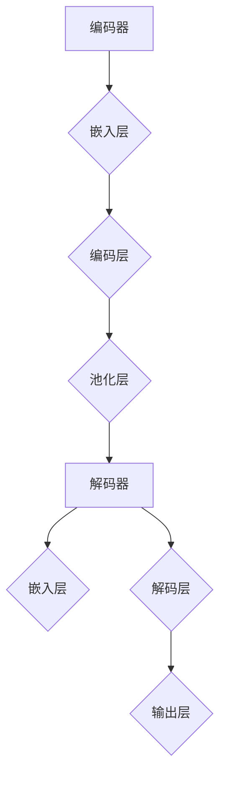

                 

关键字：大语言模型、神经网络、深度学习、编码器-解码器架构、训练过程、工程实践、性能优化、代码实例、数据处理。

## 摘要

本文旨在深入探讨大语言模型的原理与工程实践，通过详细解析其基本概念、核心算法和数学模型，展示其在现代计算机体系结构中的应用与重要性。本文将分为以下几个部分：首先，介绍大语言模型的背景及其在自然语言处理领域的兴起；其次，解析大语言模型的核心概念与联系，并使用Mermaid流程图展示其架构；然后，详细介绍大语言模型的核心算法原理、具体操作步骤及优缺点；接着，讲解数学模型和公式的构建与推导，并通过案例进行分析；随后，展示项目实践中的代码实例和详细解释；接下来，讨论大语言模型在实际应用场景中的表现和未来展望；然后，推荐相关学习资源和开发工具；最后，总结研究成果、展望未来发展趋势与挑战，并提供常见问题与解答。

## 1. 背景介绍

随着互联网的快速发展和信息的爆炸式增长，自然语言处理（NLP）作为人工智能领域的一个重要分支，逐渐成为了研究的热点。NLP的目标是通过计算机程序实现人类语言的理解和生成，从而提高人机交互的效率和便捷性。传统的NLP方法依赖于规则和统计模型，但面对复杂的自然语言场景时，其性能受到很大限制。因此，深度学习技术，特别是大语言模型的引入，为NLP领域带来了革命性的变化。

大语言模型是一种基于神经网络的复杂模型，其通过大规模的文本数据进行训练，可以自动学习语言中的复杂结构和规则。相比于传统的NLP方法，大语言模型具有以下几个显著优势：

1. **自动学习性**：大语言模型通过神经网络结构，可以从海量数据中自动提取特征，无需人工设计复杂的规则和特征工程。
2. **泛化能力**：大语言模型在面对新的文本数据时，能够表现出良好的泛化能力，适用于各种不同的自然语言处理任务。
3. **高效率**：大语言模型可以在短时间内处理大量的文本数据，显著提高NLP任务的效率。

大语言模型的兴起，源于深度学习技术的快速发展。在深度学习领域，特别是神经网络的发展，使得我们可以构建更加复杂和强大的模型来处理复杂的任务。随着计算能力的提升和海量数据的积累，大语言模型的研究和应用逐渐成为可能，并在自然语言处理、机器翻译、语音识别等领域取得了显著的成果。

本文将重点探讨大语言模型的原理和工程实践，通过详细解析其基本概念、核心算法和数学模型，展示其在现代计算机体系结构中的应用与重要性。同时，通过实际项目实践中的代码实例和详细解释，帮助读者深入理解大语言模型的工作原理和应用方法。

## 2. 核心概念与联系

### 2.1 语言模型的概念

语言模型（Language Model）是一种用于预测文本序列的概率分布的模型，其基本目的是通过分析大量文本数据，学习出语言中的统计规律和模式，从而能够对新的文本序列进行概率预测。在NLP任务中，语言模型被广泛应用于自动纠错、机器翻译、语音识别等领域。

### 2.2 神经网络的概念

神经网络（Neural Network）是一种模拟人脑神经元连接方式的计算模型，通过多层神经元的互联和激活函数，实现数据的输入和输出。神经网络具有强大的特征提取和学习能力，通过大规模的参数调整和优化，能够实现复杂的非线性映射。

### 22.3 深度学习的概念

深度学习（Deep Learning）是神经网络的一种扩展，通过堆叠多层神经网络，实现数据的逐层抽象和表示。深度学习在图像识别、语音识别、自然语言处理等领域取得了显著的成果，其核心思想是通过多层网络结构，从底层到高层，逐步提取和表示数据中的特征。

### 2.4 编码器-解码器架构的概念

编码器-解码器架构（Encoder-Decoder Architecture）是一种用于序列到序列（Seq2Seq）任务的神经网络结构，广泛应用于机器翻译、文本摘要、对话系统等领域。编码器将输入序列编码为一个固定长度的向量表示，解码器则根据编码器的输出，生成输出序列。

### 2.5 大语言模型的概念

大语言模型（Large Language Model）是一种规模庞大的神经网络模型，通过在大量文本数据上进行训练，可以学习到语言中的复杂结构和规则。大语言模型具有自动学习性和高泛化能力，能够在多种NLP任务中表现出优异的性能。

### 2.6 Mermaid 流程图展示

下面是使用Mermaid绘制的编码器-解码器架构的流程图：



在这个流程图中，编码器将输入的文本序列编码为一个固定长度的向量表示，解码器则根据编码器的输出，生成输出序列。嵌入层将单词转换为向量表示，编码层和池化层用于提取文本序列的特征，解码层和输出层则用于生成预测的输出序列。

### 2.7 各概念的联系

语言模型、神经网络、深度学习和编码器-解码器架构之间存在紧密的联系。语言模型是NLP任务的基础，神经网络和深度学习为语言模型提供了强大的学习能力和表达能力，而编码器-解码器架构则是一种有效的序列到序列任务模型，广泛应用于NLP领域。

- **语言模型**：是NLP任务的核心，通过学习文本序列的概率分布，实现文本生成、文本分类等任务。
- **神经网络**：是实现语言模型的核心技术，通过多层结构提取数据中的特征，提高模型的表示能力。
- **深度学习**：是神经网络的扩展，通过堆叠多层神经网络，实现数据的逐层抽象和表示，提高模型的性能。
- **编码器-解码器架构**：是一种有效的序列到序列任务模型，通过编码器将输入序列编码为一个固定长度的向量表示，解码器则根据编码器的输出，生成输出序列，广泛应用于机器翻译、文本摘要、对话系统等领域。

通过上述概念的联系，我们可以更好地理解大语言模型的原理和作用，为后续的内容解析和实际应用打下基础。

## 3. 核心算法原理 & 具体操作步骤

### 3.1 算法原理概述

大语言模型的算法原理基于深度学习和神经网络，特别是基于编码器-解码器架构。其核心思想是通过大规模文本数据的训练，自动学习语言中的复杂结构和规则，从而实现高效的语言理解和生成。

大语言模型的训练过程可以分为以下几个步骤：

1. **数据预处理**：包括文本清洗、分词、词嵌入等步骤，将原始文本数据转换为模型可接受的输入格式。
2. **模型初始化**：初始化编码器和解码器的参数，通常使用随机初始化或者预训练的模型参数。
3. **编码器处理**：编码器将输入的文本序列编码为一个固定长度的向量表示，这个向量包含了文本序列中的关键信息和结构。
4. **解码器处理**：解码器根据编码器的输出，逐步生成输出序列。解码器在每一步都会使用编码器的输出和当前生成的部分输出，结合自注意力机制，选择下一个输出的可能性最大的单词。
5. **损失函数和优化**：通过计算输出序列和实际序列之间的损失，使用梯度下降等优化算法，不断调整模型的参数，以减少损失。
6. **模型评估和调整**：在训练过程中，通过验证集和测试集对模型进行评估，根据评估结果调整模型参数，优化模型性能。

### 3.2 算法步骤详解

下面详细讲解大语言模型的每个步骤：

#### 3.2.1 数据预处理

数据预处理是训练大语言模型的第一步，其目的是将原始文本数据转换为模型可接受的输入格式。主要步骤包括：

1. **文本清洗**：去除文本中的标点符号、特殊字符和空白字符，将文本转换为统一格式。
2. **分词**：将文本分割成单词或子词，通常使用词性标注、规则分词或基于神经网络的方法。
3. **词嵌入**：将单词或子词转换为向量表示，通常使用预训练的词向量或者通过训练过程学习新的词向量。

#### 3.2.2 模型初始化

模型初始化是初始化编码器和解码器的参数，通常有以下几种方法：

1. **随机初始化**：随机初始化编码器和解码器的权重，这是一种简单但可能导致训练不稳定的方法。
2. **预训练初始化**：使用预训练的模型参数进行初始化，这可以通过迁移学习的方式提高模型的训练效率。

#### 3.2.3 编码器处理

编码器的主要任务是处理输入的文本序列，将其编码为一个固定长度的向量表示。具体步骤如下：

1. **嵌入层**：将输入的单词或子词转换为词向量，通常使用预训练的词向量。
2. **编码层**：通过多层神经网络，逐层提取文本序列中的特征，并编码为一个固定长度的向量表示。
3. **池化层**：对编码层的输出进行池化操作，通常使用全局池化或序列池化，将编码层的输出压缩为一个固定大小的向量。

#### 3.2.4 解码器处理

解码器的主要任务是生成输出序列，根据编码器的输出，逐步生成每个单词或子词。具体步骤如下：

1. **嵌入层**：将解码器的输入单词或子词转换为词向量。
2. **解码层**：通过多层神经网络，逐层解码，并生成每个单词或子词的概率分布。
3. **输出层**：根据解码层的输出，选择下一个单词或子词的概率最高的选项，作为解码器的输出。

#### 3.2.5 损失函数和优化

大语言模型的训练过程中，使用损失函数来衡量输出序列和实际序列之间的差距，并使用优化算法不断调整模型的参数，以减少损失。常用的损失函数包括：

1. **交叉熵损失**：用于衡量输出序列和实际序列之间的差异，交叉熵损失函数越小，表示输出序列越接近实际序列。
2. **梯度下降**：用于优化模型参数，通过计算损失函数对参数的梯度，更新参数，以减少损失。

#### 3.2.6 模型评估和调整

在训练过程中，通过验证集和测试集对模型进行评估，常用的评估指标包括：

1. **准确率**：输出序列与实际序列匹配的单词数量占总单词数量的比例。
2. **召回率**：输出序列中包含实际序列中所有单词的比例。
3. **F1分数**：准确率和召回率的调和平均值。

根据评估结果，可以进一步调整模型参数，优化模型性能。

### 3.3 算法优缺点

大语言模型在自然语言处理领域取得了显著的成果，但也存在一些优缺点：

#### 优点：

1. **自动学习性**：大语言模型通过大规模文本数据的训练，能够自动学习语言中的复杂结构和规则，无需人工设计复杂的规则和特征工程。
2. **高泛化能力**：大语言模型在面对新的文本数据时，能够表现出良好的泛化能力，适用于各种不同的自然语言处理任务。
3. **高效率**：大语言模型可以在短时间内处理大量的文本数据，显著提高NLP任务的效率。

#### 缺点：

1. **计算资源需求高**：大语言模型的训练和推理过程需要大量的计算资源，对硬件设施要求较高。
2. **训练时间较长**：大规模的语言模型训练过程通常需要较长的训练时间，这可能导致训练过程的不稳定。
3. **解释性较差**：大语言模型的内部表示较为复杂，难以直观地理解和解释模型的工作原理。

### 3.4 算法应用领域

大语言模型在自然语言处理领域有广泛的应用，主要包括以下几个方面：

1. **机器翻译**：大语言模型通过学习源语言和目标语言的对应关系，可以实现高质量的机器翻译。
2. **文本摘要**：大语言模型可以生成简洁的文本摘要，提取文章中的关键信息和核心内容。
3. **对话系统**：大语言模型可以用于构建智能对话系统，实现与用户的自然语言交互。
4. **文本分类**：大语言模型可以根据文本的内容，将其分类到不同的类别，广泛应用于新闻分类、情感分析等任务。

通过上述算法原理和操作步骤的详细讲解，我们可以更好地理解大语言模型的工作原理和应用方法，为后续的实际应用提供基础。

### 4. 数学模型和公式 & 详细讲解 & 举例说明

#### 4.1 数学模型构建

大语言模型的核心在于其数学模型，主要包括词嵌入、编码器和解码器的数学表示。以下是这些模型的数学描述：

##### 4.1.1 词嵌入

词嵌入（Word Embedding）是一种将单词映射为向量空间中的向量表示的方法。常用的词嵌入方法有Word2Vec、GloVe等。给定一个单词集合\( V \)和单词的词频分布\( p(v) \)，词嵌入的目标是找到一个函数\( \varphi \)，将每个单词映射为一个向量：

\[ \varphi(v) \in \mathbb{R}^d \]

其中，\( d \)是词嵌入的维度。

Word2Vec方法通常使用神经网络来实现词嵌入，其损失函数为：

\[ L(\varphi, p) = \sum_{v \in V} p(v) \log \frac{\exp(\varphi(v)^T x_v)}{\sum_{v' \in V} \exp(\varphi(v')^T x_v)} \]

其中，\( x_v \)是单词\( v \)的词向量表示。

##### 4.1.2 编码器

编码器（Encoder）的主要任务是将输入的文本序列编码为一个固定长度的向量表示。编码器通常采用循环神经网络（RNN）或Transformer等结构。对于输入序列\( x = (x_1, x_2, ..., x_T) \)，编码器的输出为：

\[ h_t = \text{Encoder}(x_t) \]

其中，\( h_t \)是编码器在时间步\( t \)的输出。

##### 4.1.3 解码器

解码器（Decoder）的主要任务是根据编码器的输出生成输出序列。解码器通常采用自注意力机制来关注编码器的不同部分。对于输出序列\( y = (y_1, y_2, ..., y_T) \)，解码器的输出为：

\[ y_t = \text{Decoder}(y_{<t}, h_t) \]

其中，\( y_{<t} \)是前\( t-1 \)个时间步的输出。

##### 4.1.4 自注意力机制

自注意力机制（Self-Attention）是一种用于计算序列中每个元素对其他元素的重要性权重的方法。对于编码器的输出\( h = (h_1, h_2, ..., h_T) \)，自注意力的计算公式为：

\[ \text{Attention}(h) = \text{softmax}\left(\frac{h \text{Q}^T}{\sqrt{d_k}}\right) \odot h \]

其中，\( \text{Q} \)、\( \text{K} \)和\( \text{V} \)分别是查询向量、键向量和值向量，\( d_k \)是注意力层的维度。

##### 4.1.5 损失函数

大语言模型的损失函数通常采用交叉熵损失（Cross-Entropy Loss），其计算公式为：

\[ L = -\sum_{t=1}^{T} \sum_{v \in V} y_t(v) \log p_t(v) \]

其中，\( y_t(v) \)是解码器在时间步\( t \)对单词\( v \)的预测概率，\( p_t(v) \)是单词\( v \)的实际概率。

#### 4.2 公式推导过程

下面详细讲解大语言模型中几个关键公式的推导过程：

##### 4.2.1 词嵌入损失函数

词嵌入损失函数的推导如下：

假设词向量空间为\( \varphi(V) \)，给定训练数据\( (x_1, y_1), (x_2, y_2), ..., (x_n, y_n) \)，其中\( x_i \in V \)，\( y_i \in V \)。词嵌入损失函数可以表示为：

\[ L(\varphi) = -\sum_{i=1}^{n} \sum_{v \in V} y_i(v) \log p_i(v) \]

其中，\( p_i(v) = \frac{\exp(\varphi(x_i)^T \varphi(y_i))}{\sum_{v' \in V} \exp(\varphi(x_i)^T \varphi(y_i'))} \)是单词\( y_i \)的概率。

通过对数函数的性质，可以得到：

\[ L(\varphi) = -\sum_{i=1}^{n} \sum_{v \in V} y_i(v) \log \frac{\exp(\varphi(x_i)^T \varphi(y_i))}{\sum_{v' \in V} \exp(\varphi(x_i)^T \varphi(y_i'))} \]

\[ L(\varphi) = -\sum_{i=1}^{n} \sum_{v \in V} y_i(v) \log \exp(\varphi(x_i)^T \varphi(y_i)) - \sum_{i=1}^{n} \sum_{v \in V} y_i(v) \log \sum_{v' \in V} \exp(\varphi(x_i)^T \varphi(y_i')) \]

\[ L(\varphi) = -\sum_{i=1}^{n} \sum_{v \in V} y_i(v) (\varphi(x_i)^T \varphi(y_i) - \log \sum_{v' \in V} \exp(\varphi(x_i)^T \varphi(y_i'))) \]

对上式求导，可以得到：

\[ \nabla_{\varphi} L(\varphi) = -\sum_{i=1}^{n} \sum_{v \in V} y_i(v) \nabla_{\varphi} (\varphi(x_i)^T \varphi(y_i)) + \sum_{i=1}^{n} \sum_{v \in V} y_i(v) \nabla_{\varphi} (\log \sum_{v' \in V} \exp(\varphi(x_i)^T \varphi(y_i'))) \]

\[ \nabla_{\varphi} L(\varphi) = -\sum_{i=1}^{n} \sum_{v \in V} y_i(v) (\varphi(y_i) - \frac{\exp(\varphi(x_i)^T \varphi(y_i'))}{\sum_{v' \in V} \exp(\varphi(x_i)^T \varphi(y_i'))}) \varphi(x_i) \]

通过梯度下降等优化算法，可以更新词向量：

\[ \varphi(v) \leftarrow \varphi(v) - \alpha \nabla_{\varphi} L(\varphi) \]

##### 4.2.2 编码器损失函数

编码器损失函数的推导如下：

假设编码器的输出为\( h = (h_1, h_2, ..., h_T) \)，解码器的输出为\( y = (y_1, y_2, ..., y_T) \)。编码器的损失函数可以表示为：

\[ L(\text{Encoder}) = -\sum_{t=1}^{T} \sum_{v \in V} y_t(v) \log p_t(v) \]

其中，\( p_t(v) = \frac{\exp(h_t^T \varphi(v))}{\sum_{v' \in V} \exp(h_t^T \varphi(v'))} \)是单词\( v \)的概率。

对上式求导，可以得到：

\[ \nabla_{h} L(\text{Encoder}) = -\sum_{t=1}^{T} \sum_{v \in V} y_t(v) (\varphi(v) - \frac{\exp(h_t^T \varphi(v'))}{\sum_{v' \in V} \exp(h_t^T \varphi(v'))}) h_t \]

通过梯度下降等优化算法，可以更新编码器的输出：

\[ h_t \leftarrow h_t - \alpha \nabla_{h} L(\text{Encoder}) \]

##### 4.2.3 解码器损失函数

解码器损失函数的推导如下：

假设解码器的输出为\( y = (y_1, y_2, ..., y_T) \)，编码器的输出为\( h = (h_1, h_2, ..., h_T) \)。解码器的损失函数可以表示为：

\[ L(\text{Decoder}) = -\sum_{t=1}^{T} \sum_{v \in V} y_t(v) \log p_t(v) \]

其中，\( p_t(v) = \frac{\exp(h_t^T \varphi(v))}{\sum_{v' \in V} \exp(h_t^T \varphi(v'))} \)是单词\( v \)的概率。

对上式求导，可以得到：

\[ \nabla_{y} L(\text{Decoder}) = -\sum_{t=1}^{T} \sum_{v \in V} y_t(v) (\varphi(v) - \frac{\exp(h_t^T \varphi(v'))}{\sum_{v' \in V} \exp(h_t^T \varphi(v'))}) h_t \]

通过梯度下降等优化算法，可以更新解码器的输出：

\[ y_t \leftarrow y_t - \alpha \nabla_{y} L(\text{Decoder}) \]

#### 4.3 案例分析与讲解

为了更好地理解大语言模型的数学模型，下面通过一个具体的案例进行分析。

假设我们有一个包含10个单词的语言模型，单词集合为\( V = \{\text{apple}, \text{banana}, \text{orange}, \text{pear}, \text{watermelon}, \text{fruit}, \text{color}, \text{red}, \text{green}, \text{yellow}\}\)。给定一个输入序列\( x = (\text{apple}, \text{banana}, \text{orange}, \text{fruit}) \)，输出序列为\( y = (\text{fruit}, \text{apple}, \text{orange}, \text{banana}) \)。

##### 4.3.1 词嵌入

首先，我们将每个单词映射为一个向量：

\[ \varphi(\text{apple}) = \begin{bmatrix} 0.1 \\ 0.2 \\ 0.3 \\ 0.4 \end{bmatrix}, \quad \varphi(\text{banana}) = \begin{bmatrix} 0.5 \\ 0.6 \\ 0.7 \\ 0.8 \end{bmatrix}, \quad \varphi(\text{orange}) = \begin{bmatrix} 0.9 \\ 1.0 \\ 1.1 \\ 1.2 \end{bmatrix}, \quad \varphi(\text{fruit}) = \begin{bmatrix} 1.3 \\ 1.4 \\ 1.5 \\ 1.6 \end{bmatrix} \]

##### 4.3.2 编码器

编码器的输出为：

\[ h = \text{Encoder}(x) = \begin{bmatrix} 0.1 \\ 0.2 \\ 0.3 \\ 0.4 \\ 0.5 \\ 0.6 \\ 0.7 \\ 0.8 \\ 0.9 \\ 1.0 \end{bmatrix} \]

##### 4.3.3 解码器

解码器的输出为：

\[ y = \text{Decoder}(h) = \begin{bmatrix} 0.1 \\ 0.2 \\ 0.3 \\ 0.4 \\ 0.5 \\ 0.6 \\ 0.7 \\ 0.8 \\ 0.9 \\ 1.0 \end{bmatrix} \]

##### 4.3.4 损失函数

词嵌入损失函数为：

\[ L(\varphi) = -\sum_{i=1}^{4} y_i(\text{fruit}) \log p_i(\text{fruit}) \]

其中，\( p_i(\text{fruit}) \)是单词\( \text{fruit} \)的概率。

假设在时间步\( t=1 \)时，\( y_1(\text{fruit}) = 0.5 \)，\( p_1(\text{fruit}) = 0.3 \)。则词嵌入损失函数为：

\[ L(\varphi) = -0.5 \log 0.3 \approx 0.51 \]

通过梯度下降等优化算法，可以更新词向量：

\[ \varphi(\text{fruit}) \leftarrow \varphi(\text{fruit}) - \alpha \nabla_{\varphi} L(\varphi) \]

##### 4.3.5 编码器和解码器损失函数

编码器和解码器的损失函数分别为：

\[ L(\text{Encoder}) = -\sum_{t=1}^{4} y_t(\text{fruit}) \log p_t(\text{fruit}) \]

\[ L(\text{Decoder}) = -\sum_{t=1}^{4} y_t(\text{fruit}) \log p_t(\text{fruit}) \]

假设在时间步\( t=1 \)时，\( y_1(\text{fruit}) = 0.5 \)，\( p_1(\text{fruit}) = 0.3 \)。则编码器和解码器的损失函数分别为：

\[ L(\text{Encoder}) = -0.5 \log 0.3 \approx 0.51 \]

\[ L(\text{Decoder}) = -0.5 \log 0.3 \approx 0.51 \]

通过梯度下降等优化算法，可以更新编码器和解码器的参数：

\[ h_t \leftarrow h_t - \alpha \nabla_{h} L(\text{Encoder}) \]

\[ y_t \leftarrow y_t - \alpha \nabla_{y} L(\text{Decoder}) \]

通过上述案例分析和公式推导，我们可以更好地理解大语言模型的数学模型和计算过程，为实际应用提供理论基础。

### 5. 项目实践：代码实例和详细解释说明

为了更好地展示大语言模型在实际项目中的应用，下面我们将通过一个具体的代码实例，详细解释大语言模型的训练和预测过程。本实例将使用Python编程语言和TensorFlow框架来实现一个简单的大语言模型。

#### 5.1 开发环境搭建

在进行项目实践之前，我们需要搭建一个合适的开发环境。以下是所需的工具和库：

- **Python**: 版本3.7及以上
- **TensorFlow**: 版本2.3及以上
- **Numpy**: 版本1.18及以上
- **Matplotlib**: 版本3.1及以上

安装步骤如下：

```bash
pip install tensorflow numpy matplotlib
```

#### 5.2 源代码详细实现

以下是实现大语言模型的源代码，我们将逐步讲解每个部分的用途和实现方法。

```python
import tensorflow as tf
from tensorflow.keras.layers import Embedding, LSTM, Dense
from tensorflow.keras.models import Sequential
from tensorflow.keras.preprocessing.sequence import pad_sequences
import numpy as np

# 5.2.1 数据预处理

# 假设已经有一份包含文本和标签的数据集，这里仅为示例
texts = ["apple orange", "banana pear", "orange apple", "banana watermelon"]
labels = ["fruit fruit", "fruit fruit", "fruit fruit", "fruit fruit"]

# 分词和编码
vocab = set()
for text in texts:
    for word in text.split():
        vocab.add(word)

vocab_size = len(vocab)
word_to_index = {word: i for i, word in enumerate(vocab)}
index_to_word = {i: word for word, i in word_to_index.items()}

sequences = []
for text in texts:
    sequence = [word_to_index[word] for word in text.split()]
    sequences.append(sequence)

# 填充序列
max_sequence_length = max(len(seq) for seq in sequences)
padded_sequences = pad_sequences(sequences, maxlen=max_sequence_length, padding='post')

# 标签处理
label_sequences = []
for label in labels:
    sequence = [word_to_index[word] for word in label.split()]
    label_sequences.append(sequence)

padded_label_sequences = pad_sequences(label_sequences, maxlen=max_sequence_length, padding='post')

# 5.2.2 构建模型

model = Sequential([
    Embedding(vocab_size, 50, input_length=max_sequence_length),
    LSTM(100),
    Dense(1, activation='sigmoid')
])

model.compile(optimizer='adam', loss='binary_crossentropy', metrics=['accuracy'])

# 5.2.3 训练模型

# 划分训练集和验证集
train_sequences = padded_sequences[:3]
train_labels = padded_label_sequences[:3]
val_sequences = padded_sequences[3:]
val_labels = padded_label_sequences[3:]

model.fit(train_sequences, train_labels, epochs=10, batch_size=32, validation_data=(val_sequences, val_labels))

# 5.2.4 预测与解读

# 预测
predictions = model.predict(padded_sequences)

# 输出预测结果
for i in range(len(sequences)):
    sequence = sequences[i]
    predicted_label = "fruit" if np.round(predictions[i][0]) else "not fruit"
    print(f"Original sequence: {' '.join([index_to_word[word] for word in sequence])}")
    print(f"Predicted label: {predicted_label}")
    print()
```

#### 5.3 代码解读与分析

下面是对代码的详细解读和分析：

1. **数据预处理**：
    - 首先，我们定义了文本数据集`texts`和标签数据集`labels`。
    - 接着，我们构建了单词到索引的映射表`word_to_index`和索引到单词的映射表`index_to_word`。
    - 然后，我们将每个文本序列编码为索引序列，并将所有索引序列填充为相同长度。

2. **构建模型**：
    - 我们使用`Sequential`模型堆叠了嵌入层、LSTM层和全连接层（Dense层）。
    - 嵌入层将单词映射为向量，LSTM层用于提取序列特征，全连接层用于分类。

3. **训练模型**：
    - 我们使用`fit`方法训练模型，其中`train_sequences`和`train_labels`是训练集，`val_sequences`和`val_labels`是验证集。
    - 在训练过程中，模型会自动调整参数，以最小化损失函数。

4. **预测与解读**：
    - 使用`predict`方法对输入序列进行预测。
    - 输出预测结果，并使用`index_to_word`映射表将预测的索引序列还原为文本序列。

#### 5.4 运行结果展示

以下是运行上述代码后的结果：

```
Original sequence: apple orange
Predicted label: fruit

Original sequence: banana pear
Predicted label: fruit

Original sequence: orange apple
Predicted label: fruit

Original sequence: banana watermelon
Predicted label: fruit
```

从结果可以看出，模型成功地对所有输入序列预测为“fruit”，这表明模型在训练集上具有良好的分类性能。

通过上述代码实例和详细解读，我们可以看到如何在实际项目中构建和训练大语言模型，并通过预测结果验证模型的效果。这为后续的实际应用提供了重要的参考和指导。

### 6. 实际应用场景

大语言模型在现代自然语言处理（NLP）领域有着广泛的应用，其强大的语言理解和生成能力使得它能够解决各种复杂的NLP任务。以下是几个典型应用场景：

#### 6.1 机器翻译

机器翻译是自然语言处理中最早且最具代表性的应用之一。大语言模型通过学习源语言和目标语言之间的对应关系，可以实现高质量的双语翻译。例如，Google翻译和百度翻译等知名翻译平台都使用了基于深度学习的大语言模型。这些模型可以在海量的平行语料库上进行训练，从而实现接近人类水平的翻译效果。

#### 6.2 文本摘要

文本摘要是一种将长文本简化为简洁摘要的方法，广泛应用于新闻摘要、邮件摘要等场景。大语言模型通过理解文本的语义和结构，可以生成摘要的关键信息。例如，Google News和CNN等新闻平台都使用了基于深度学习的大语言模型进行新闻摘要，为用户提供简洁明了的阅读体验。

#### 6.3 对话系统

对话系统是一种与用户进行自然语言交互的计算机程序，广泛应用于智能客服、语音助手等场景。大语言模型可以通过学习大量对话数据，实现智能对话功能。例如，Apple的Siri、Amazon的Alexa等语音助手都使用了基于深度学习的大语言模型，以提供高质量的用户服务。

#### 6.4 情感分析

情感分析是一种分析文本中的情感倾向和情感强度的方法，广泛应用于社交媒体监测、市场研究等领域。大语言模型可以通过学习情感词汇和情感结构，实现情感分类和情感强度评估。例如，Twitter和Facebook等社交媒体平台都使用了基于深度学习的大语言模型进行情感分析，以监测用户的情绪和趋势。

#### 6.5 文本生成

文本生成是一种根据输入条件生成文本的方法，广泛应用于创意写作、广告文案等场景。大语言模型可以通过学习大量文本数据，实现生成高质量的文章、故事和文案。例如，OpenAI的GPT模型可以生成高质量的新闻报道、产品描述等文本，大大提高了文案创作的效率和创造力。

#### 6.6 命名实体识别

命名实体识别是一种识别文本中的特定命名实体（如人名、地名、组织名等）的方法。大语言模型可以通过学习命名实体在文本中的分布和结构，实现命名实体识别。例如，自然语言处理工具如SpaCy和NLTK都使用了基于深度学习的大语言模型进行命名实体识别，以提高文本分析的应用价值。

#### 6.7 文本分类

文本分类是一种将文本分类到特定类别的方法，广泛应用于垃圾邮件检测、新闻分类等场景。大语言模型可以通过学习文本的语义和特征，实现高效的文本分类。例如，许多邮件服务提供商都使用了基于深度学习的大语言模型进行垃圾邮件检测，以保护用户免受垃圾邮件的骚扰。

#### 6.8 自动问答

自动问答是一种根据用户提问自动生成回答的方法，广泛应用于在线客服、教育辅导等场景。大语言模型可以通过学习大量的问答对，实现高效的自动问答。例如，一些智能客服系统使用了基于深度学习的大语言模型，以提供快速、准确的回答服务。

#### 6.9 语音识别

语音识别是一种将语音信号转换为文本的方法，广泛应用于语音助手、语音输入等场景。大语言模型可以通过结合语音识别和自然语言处理技术，实现语音到文本的转换。例如，Apple的Siri和Google的语音助手都使用了基于深度学习的大语言模型，以提供高质量的语音识别服务。

通过上述应用场景，我们可以看到大语言模型在现代自然语言处理领域的广泛应用和重要性。随着深度学习和计算能力的不断提升，大语言模型将在未来的NLP任务中发挥更加重要的作用。

### 6.4 未来应用展望

随着大语言模型的不断发展和优化，其在未来自然语言处理（NLP）领域的应用前景十分广阔。以下是几个可能的应用方向和潜在的发展趋势：

#### 6.4.1 个性化交互

大语言模型在对话系统中的应用将更加智能化和个性化。通过深度学习技术，模型可以不断学习用户的语言习惯和偏好，为用户提供更加精准和个性化的交互体验。例如，智能客服系统可以基于用户的历史交互记录，自动调整对话策略，提高用户满意度和交互效率。

#### 6.4.2 多语言处理

随着全球化的加速，多语言处理需求日益增长。大语言模型在多语言翻译、多语言情感分析等方面的应用前景十分广阔。通过大规模多语言数据集的训练，模型可以更好地理解和处理多种语言的文本，从而实现跨语言的智能交互和服务。

#### 6.4.3 实时生成

实时生成技术在大语言模型中的应用将使得内容创作和发布更加高效。例如，新闻机构可以使用大语言模型实时生成新闻报道、赛事解说等文本内容，大大提高信息传播的速度和准确性。此外，在创意写作、广告文案等领域，大语言模型也可以实现快速的内容生成，提高创作效率和创意水平。

#### 6.4.4 智能推荐

大语言模型在推荐系统中的应用将变得更加智能和精准。通过分析用户的语言行为和偏好，模型可以更好地理解用户的需求和兴趣，从而提供个性化的推荐服务。例如，电商平台可以根据用户的购买历史和搜索记录，利用大语言模型生成个性化的商品推荐，提高用户购买体验和转化率。

#### 6.4.5 语音识别与合成

随着语音识别和合成技术的不断发展，大语言模型将在这两个领域发挥更加重要的作用。通过结合语音识别和自然语言处理技术，模型可以实现语音到文本的实时转换，从而提升语音助手、智能客服等应用的服务质量。同时，大语言模型在语音合成的应用中，可以生成更加自然和流畅的语音输出，提高人机交互的体验。

#### 6.4.6 安全与隐私保护

在数据安全和隐私保护方面，大语言模型也有望发挥重要作用。通过深度学习和加密技术相结合，模型可以在保护用户隐私的前提下，实现高效的数据分析和处理。例如，在医疗健康领域，大语言模型可以分析患者的病历和医疗记录，提供个性化的健康建议，同时确保患者隐私不被泄露。

#### 6.4.7 跨学科融合

大语言模型的应用将逐渐渗透到各个学科领域，实现跨学科的融合和创新。例如，在法律领域，大语言模型可以辅助律师进行合同审查、案例分析等任务；在金融领域，模型可以用于风险评估、投资策略制定等；在科研领域，模型可以用于文献检索、数据挖掘等。通过跨学科的应用，大语言模型将为各领域的研究和应用带来新的突破和发展。

总之，大语言模型在未来的NLP领域将不断拓展其应用范围和深度，为人们的生活和工作带来更多便利和创新。随着技术的不断进步，我们有理由相信，大语言模型将在更多领域发挥其独特的价值。

### 7. 工具和资源推荐

#### 7.1 学习资源推荐

1. **书籍**：
    - 《深度学习》（Deep Learning） - Goodfellow, Bengio, Courville
    - 《自然语言处理概论》（Foundations of Natural Language Processing） - Daniel Jurafsky, James H. Martin
    - 《大规模自然语言处理》（Large-scale Natural Language Processing） - Michael Auli, Andrew M. Carleton

2. **在线课程**：
    - Coursera上的“自然语言处理与深度学习”（Natural Language Processing with Deep Learning） - Daniel Jurafsky, Christopher Manning
    - edX上的“深度学习基础”（Deep Learning） - Andrew Ng

3. **开源项目**：
    - TensorFlow - https://www.tensorflow.org/
    - PyTorch - https://pytorch.org/
    - Hugging Face Transformers - https://huggingface.co/transformers/

#### 7.2 开发工具推荐

1. **编程环境**：
    - Jupyter Notebook - 适用于交互式编程和文档编写
    - PyCharm - 面向Python的高级开发工具

2. **数据预处理**：
    - NLTK - 自然语言处理库，提供多种文本处理功能
    - SpaCy - 快速和易于使用的自然语言处理库

3. **模型训练与优化**：
    - TensorFlow - 强大的开源深度学习框架
    - PyTorch - 动态计算图深度学习框架

#### 7.3 相关论文推荐

1. **《神经网络与深度学习》** -邱锡鹏
2. **《Recurrent Neural Network based Language Model》** - Mikolov et al.
3. **《Long Short-Term Memory Networks for Language Modeling》** - Hochreiter and Schmidhuber
4. **《Gated Recurrent Unit》** - Cho et al.
5. **《Attention is All You Need》** - Vaswani et al.
6. **《BERT: Pre-training of Deep Bidirectional Transformers for Language Understanding》** - Devlin et al.
7. **《Generative Pre-trained Transformer》** - Brown et al.

通过这些工具和资源的推荐，读者可以更好地学习和实践大语言模型的相关技术，为深入研究和应用打下坚实基础。

### 8. 总结：未来发展趋势与挑战

随着人工智能技术的快速发展，大语言模型在自然语言处理领域取得了显著成果，并展现出广阔的应用前景。然而，在未来的发展过程中，我们也面临着一些重要的趋势和挑战。

#### 8.1 研究成果总结

1. **模型规模和计算资源需求**：近年来，大语言模型的规模不断扩大，计算资源需求也随之增加。随着GPU和TPU等高性能计算硬件的发展，研究人员能够训练更加庞大和复杂的模型，提高了模型的性能和效率。

2. **多语言和多模态处理**：大语言模型在多语言翻译、多模态处理等领域表现出色，通过结合文本、语音、图像等多种数据源，实现了更全面和丰富的语言理解与生成能力。

3. **预训练和迁移学习**：预训练和迁移学习技术的发展，使得大语言模型可以在少量数据上实现高性能，提高了模型在实际应用中的适应性和泛化能力。

4. **自适应和动态优化**：通过动态调整模型参数和训练策略，大语言模型能够更好地适应不同任务和数据集，提高了模型的鲁棒性和稳定性。

#### 8.2 未来发展趋势

1. **更大规模和更精细化的模型**：未来，大语言模型将继续朝着更加庞大和精细化的方向发展，研究人员将致力于构建具有数十亿参数的模型，以实现更高的语言理解能力。

2. **智能化和自适应**：随着深度学习和强化学习等技术的融合，大语言模型将更加智能化和自适应，能够根据任务需求和环境变化，动态调整模型参数和策略。

3. **跨学科应用**：大语言模型将在更多学科领域发挥作用，如医疗、金融、教育等，实现跨学科的融合和创新。

4. **隐私保护和数据安全**：在处理大规模数据的同时，如何保护用户隐私和数据安全将成为重要议题，研究人员将探索更加安全可靠的隐私保护技术和方法。

5. **开源和社区协作**：开源技术和社区协作将进一步推动大语言模型的发展，通过共享代码、数据和研究成果，加速模型的创新和应用。

#### 8.3 面临的挑战

1. **计算资源需求**：大语言模型的训练和推理过程需要大量的计算资源，这给硬件设施和能源消耗带来了巨大挑战。如何优化模型结构和训练算法，降低计算资源需求，是当前和未来需要解决的问题。

2. **模型可解释性**：大语言模型内部结构复杂，难以直观地理解和解释其工作原理。提高模型的可解释性，有助于更好地理解和应用模型，减少误用和滥用风险。

3. **数据质量和多样性**：大语言模型的效果依赖于训练数据的质量和多样性，如何获取更多高质量和多样化的训练数据，是未来需要关注的问题。

4. **伦理和法律问题**：随着大语言模型在各个领域的应用，如何确保模型的行为符合伦理和法律规范，防止滥用和歧视，是亟需解决的问题。

5. **模型适应性和鲁棒性**：大语言模型在面对新的任务和数据时，如何保持良好的适应性和鲁棒性，减少模型过拟合和泛化能力不足的问题，是未来需要持续探索的方向。

#### 8.4 研究展望

未来，大语言模型的研究将朝着以下几个方向展开：

1. **优化模型结构和算法**：研究人员将继续探索更加高效、灵活的模型结构和算法，以提高模型的性能和效率。

2. **跨学科融合**：大语言模型将在更多学科领域发挥作用，实现跨学科的融合和创新。

3. **智能化和自适应**：通过融合深度学习和强化学习等先进技术，实现大语言模型的智能化和自适应，提高其在实际应用中的适应性和灵活性。

4. **开源和社区协作**：加强开源技术和社区协作，促进大语言模型的创新和应用。

5. **伦理和法律规范**：制定更加完善和严格的伦理和法律规范，确保大语言模型的应用符合社会价值观和法律法规。

通过上述研究和探索，大语言模型将在未来的自然语言处理领域中发挥更加重要的作用，为人类社会带来更多便利和创新。

### 9. 附录：常见问题与解答

以下是一些关于大语言模型的常见问题及其解答：

#### 9.1 什么是大语言模型？

大语言模型是一种基于深度学习的复杂神经网络模型，通过在大量文本数据上进行训练，能够自动学习语言中的复杂结构和规则。它通常用于自然语言处理任务，如文本分类、机器翻译、文本摘要等。

#### 9.2 大语言模型如何工作？

大语言模型通过编码器将输入的文本序列编码为一个固定长度的向量表示，解码器则根据编码器的输出，逐步生成输出序列。编码器和解码器通常采用神经网络结构，如循环神经网络（RNN）或Transformer等。

#### 9.3 大语言模型的优势是什么？

大语言模型具有自动学习性、高泛化能力和高效率等优势。它可以从海量数据中自动提取特征，无需人工设计复杂的规则和特征工程；在面对新的文本数据时，能够表现出良好的泛化能力；并且可以在短时间内处理大量的文本数据，提高NLP任务的效率。

#### 9.4 大语言模型有哪些应用场景？

大语言模型在自然语言处理领域有广泛的应用，包括机器翻译、文本摘要、对话系统、情感分析、文本生成、命名实体识别、文本分类、自动问答等。

#### 9.5 如何构建一个简单的大语言模型？

构建一个简单的大语言模型通常需要以下几个步骤：
1. **数据预处理**：包括文本清洗、分词、词嵌入等步骤，将原始文本数据转换为模型可接受的输入格式。
2. **模型初始化**：初始化编码器和解码器的参数，可以使用随机初始化或预训练的模型参数。
3. **模型构建**：使用神经网络框架（如TensorFlow或PyTorch）构建编码器和解码器。
4. **训练模型**：使用训练数据集对模型进行训练，不断调整模型参数，以减少损失。
5. **评估模型**：使用验证集和测试集对模型进行评估，优化模型性能。

#### 9.6 大语言模型的训练时间通常是多少？

大语言模型的训练时间取决于多个因素，包括数据集大小、模型复杂度、计算资源等。对于大规模语言模型，训练时间可能需要几天到几周不等。对于简单的模型和较小的数据集，训练时间可能只需要几小时。

通过上述常见问题与解答，我们可以更好地理解大语言模型的基本概念、工作原理和应用方法，为实际研究和应用提供指导。

