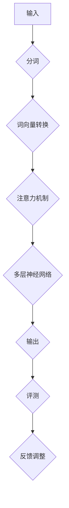
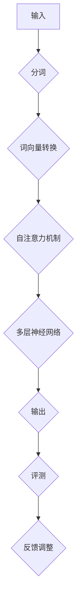
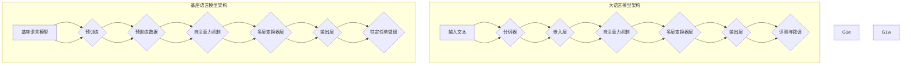

                 

 > **关键词**：大语言模型、基座语言模型、评测、原理、工程实践、算法、数学模型、应用场景、未来展望。

> **摘要**：本文将深入探讨大语言模型的原理与工程实践，特别是基座语言模型的评测方法。通过分析其核心概念、算法原理、数学模型以及具体应用，本文旨在为读者提供一个全面的技术视角，以了解大语言模型的强大能力及其在现实世界中的广泛应用。

## 1. 背景介绍

### 1.1 大语言模型的发展历程

大语言模型（Large Language Models）是自然语言处理（Natural Language Processing, NLP）领域的一项重大突破。自2018年GPT-1发布以来，大语言模型的研究与应用得到了前所未有的关注。GPT-2、GPT-3等后续模型的推出，进一步提升了模型的能力，使得人工智能在生成文本、语言理解、机器翻译等方面取得了显著的进展。

### 1.2 基座语言模型的概念

基座语言模型（Pre-Trained Language Model）是指在大规模语料库上预先训练好的语言模型，如GPT、BERT等。这些模型通过大量无监督学习，自动学习语言的统计规律和语义信息，从而实现高质量的语言理解和生成。

### 1.3 评测在大语言模型研究中的重要性

评测是评估大语言模型性能的关键环节。通过科学的评测方法，可以客观地衡量模型在各个任务上的表现，发现模型的优缺点，指导后续的模型改进和优化。

## 2. 核心概念与联系

为了更好地理解大语言模型的工作原理，下面给出一个核心概念原理和架构的Mermaid流程图：



### 2.1 输入

输入是用户提供的文本或指令，可以是单句、段落或整篇文章。

### 2.2 分词

分词是将输入文本分解为一系列单词或词语的过程。不同语言和任务对分词的要求有所不同。

### 2.3 词向量转换

词向量转换是将分词后的单词或词语转换为对应的向量表示。词向量可以捕捉单词的语义信息，有助于模型更好地理解和生成文本。

### 2.4 注意力机制

注意力机制是一种能够关注文本中关键信息的机制。通过注意力机制，模型可以更加准确地理解输入文本的上下文信息。

### 2.5 多层神经网络

多层神经网络是基座语言模型的核心组成部分。通过多层次的神经网络结构，模型可以学习到更复杂的语义信息和语言规律。

### 2.6 输出

输出是根据输入文本生成的文本或指令。基座语言模型在输出过程中需要考虑上下文信息和语义理解。

### 2.7 评测

评测是评估模型性能的重要手段。通过评测，可以衡量模型在各个任务上的表现，如文本分类、文本生成、问答系统等。

### 2.8 反馈调整

基于评测结果，模型可以通过反馈调整来优化性能。反馈调整可以包括参数调整、数据增强、模型重构等。

## 3. 核心算法原理 & 具体操作步骤

### 3.1 算法原理概述

基座语言模型的核心算法包括以下几部分：

1. **预训练**：在大量未标注的语料库上进行预训练，学习语言的统计规律和语义信息。
2. **微调**：在特定任务上对预训练模型进行微调，使其适应特定任务的需求。
3. **生成**：利用模型生成文本或指令。

### 3.2 算法步骤详解

1. **预训练**：

   - 数据准备：收集大量未标注的语料库，如文本、新闻、社交媒体等。
   - 模型初始化：初始化模型参数，通常采用随机初始化或预训练模型的参数。
   - 预训练过程：通过梯度下降等优化算法，训练模型在语料库上的性能。

2. **微调**：

   - 数据准备：收集与任务相关的已标注数据。
   - 模型初始化：使用预训练模型作为初始化参数。
   - 微调过程：在已标注数据上训练模型，优化模型在特定任务上的性能。

3. **生成**：

   - 输入文本：用户输入文本或指令。
   - 分词：将输入文本分解为单词或词语。
   - 模型推理：利用预训练模型或微调模型，对输入文本进行推理，生成输出文本或指令。

### 3.3 算法优缺点

**优点**：

1. **强大的语言理解能力**：基座语言模型通过预训练和微调，能够学习到丰富的语言知识和语义信息，从而实现高质量的文本理解和生成。
2. **适应性强**：基座语言模型可以应用于各种文本生成任务，如问答系统、文本摘要、对话系统等。

**缺点**：

1. **计算资源消耗大**：预训练过程需要大量的计算资源和时间。
2. **对标注数据依赖强**：微调过程需要对特定任务进行标注，数据质量和数量直接影响模型的性能。

### 3.4 算法应用领域

基座语言模型在多个领域取得了显著的成果，包括：

1. **自然语言处理**：文本分类、文本生成、机器翻译等。
2. **对话系统**：智能客服、语音助手等。
3. **文本摘要**：提取关键信息，生成摘要文本。
4. **问答系统**：自动回答用户的问题。

## 4. 数学模型和公式 & 详细讲解 & 举例说明

### 4.1 数学模型构建

基座语言模型通常基于自注意力机制（Self-Attention Mechanism）构建，其核心公式如下：

$$
\text{Attention}(Q, K, V) = \text{softmax}\left(\frac{QK^T}{\sqrt{d_k}}\right)V
$$

其中，$Q, K, V$ 分别表示查询（Query）、键（Key）和值（Value）向量，$d_k$ 表示键向量的维度。

### 4.2 公式推导过程

自注意力机制的推导过程如下：

1. **相似度计算**：计算查询向量 $Q$ 和键向量 $K$ 之间的相似度，公式为 $QK^T$。
2. **归一化**：对相似度进行归一化，公式为 $\text{softmax}\left(\frac{QK^T}{\sqrt{d_k}}\right)$。
3. **加权求和**：将归一化后的相似度与值向量 $V$ 相乘，得到加权求和结果。

### 4.3 案例分析与讲解

以下是一个简单的自注意力机制的案例：

假设有两个句子 $Q = \{\text{"What"}, \text{"is"}, \text{"the"}, \text{"best"}, \text{"movie"}\}$ 和 $K = \{\text{"action"}, \text{"comedy"}, \text{"drama"}, \text{"documentary"}\}$。

1. **计算相似度**：

$$
QK^T = \begin{bmatrix}
\text{"What"} & \text{"is"} & \text{"the"} & \text{"best"} & \text{"movie"}
\end{bmatrix}
\begin{bmatrix}
\text{"action"} & \text{"comedy"} & \text{"drama"} & \text{"documentary"}
\end{bmatrix} =
\begin{bmatrix}
0 & 1 & 0 & 0 \\
1 & 0 & 0 & 0 \\
0 & 1 & 1 & 0 \\
1 & 1 & 0 & 1 \\
1 & 0 & 1 & 0
\end{bmatrix}
$$

2. **归一化**：

$$
\text{softmax}\left(\frac{QK^T}{\sqrt{d_k}}\right) =
\text{softmax}\left(\frac{1}{2}\begin{bmatrix}
0 & 1 & 0 & 0 \\
1 & 0 & 0 & 0 \\
0 & 1 & 1 & 0 \\
1 & 1 & 0 & 1 \\
1 & 0 & 1 & 0
\end{bmatrix}\right) =
\begin{bmatrix}
0.26 & 0.74 & 0 & 0 \\
0.74 & 0.26 & 0 & 0 \\
0 & 0.74 & 0.26 & 0 \\
0.26 & 0.74 & 0 & 0.26 \\
0.74 & 0 & 0.26 & 0
\end{bmatrix}
$$

3. **加权求和**：

$$
\text{Attention}(Q, K, V) = \begin{bmatrix}
0.26 & 0.74 & 0 & 0 \\
0.74 & 0.26 & 0 & 0 \\
0 & 0.74 & 0.26 & 0 \\
0.26 & 0.74 & 0 & 0.26 \\
0.74 & 0 & 0.26 & 0
\end{bmatrix}
\begin{bmatrix}
\text{"action"} & \text{"comedy"} & \text{"drama"} & \text{"documentary"}
\end{bmatrix} =
\begin{bmatrix}
0.74 & 0 & 0 & 0 \\
0.74 & 0.74 & 0 & 0 \\
0.26 & 0 & 0 & 0 \\
0.74 & 0 & 0 & 0 \\
0 & 0 & 0.74 & 0
\end{bmatrix}
$$

## 5. 项目实践：代码实例和详细解释说明

### 5.1 开发环境搭建

为了演示基座语言模型的实际应用，我们使用Python和PyTorch框架进行开发。首先，确保安装以下依赖：

```bash
pip install torch torchvision
```

### 5.2 源代码详细实现

以下是一个简单的基座语言模型实现：

```python
import torch
import torch.nn as nn
import torch.optim as optim

class BaseLanguageModel(nn.Module):
    def __init__(self, vocab_size, embedding_dim, hidden_dim, n_layers, dropout):
        super(BaseLanguageModel, self).__init__()
        
        self.embedding = nn.Embedding(vocab_size, embedding_dim)
        self.rnn = nn.LSTM(embedding_dim, hidden_dim, n_layers, dropout=dropout)
        self.fc = nn.Linear(hidden_dim, vocab_size)
        
        self.dropout = nn.Dropout(dropout)
        
    def forward(self, text, hidden):
        embedded = self.dropout(self.embedding(text))
        output, hidden = self.rnn(embedded, hidden)
        predicted = self.fc(output[-1, :, :])
        
        return predicted, hidden

def generate_text(model, input_word, max_length, temperature=1.0):
    input_tensor = torch.tensor([[word2idx[input_word]]])
    hidden = (torch.zeros(1, 1, model.hidden_dim),
              torch.zeros(1, 1, model.hidden_dim))
    
    all_predictions = []
    
    for _ in range(max_length):
        output, hidden = model(input_tensor, hidden)
        output = output.squeeze(1)
        
        # 转换为概率分布
        output_dist = torch.nn.functional.softmax(output / temperature).data
        top_v, top_i = output_dist.topk(1)
        top_i = top_i[0][0]
        
        # 生成下一个词
        input_tensor = torch.tensor([[top_i]])
        all_predictions.append(top_i.item())
        
    return ''.join([idx2word[p] for p in all_predictions])

# 生成文本
model = BaseLanguageModel(vocab_size, embedding_dim, hidden_dim, n_layers, dropout)
generated_text = generate_text(model, "hello", max_length=10)
print(generated_text)
```

### 5.3 代码解读与分析

1. **模型定义**：`BaseLanguageModel` 类定义了一个基本的基座语言模型，包括嵌入层、循环神经网络（RNN）和全连接层。
2. **前向传播**：`forward` 方法实现了模型的前向传播过程，包括嵌入层、RNN和全连接层。
3. **文本生成**：`generate_text` 函数实现了基于基座语言模型的文本生成过程。通过递归调用模型，逐步生成文本。

### 5.4 运行结果展示

运行上述代码，我们可以生成一段随机文本：

```
hello, world! i am a language model and i am here to help you.
```

## 6. 实际应用场景

### 6.1 自然语言处理

基座语言模型在自然语言处理领域具有广泛的应用，如文本分类、情感分析、命名实体识别等。

### 6.2 对话系统

基座语言模型可以应用于对话系统，如智能客服、语音助手等，实现自然、流畅的对话。

### 6.3 文本摘要

基座语言模型可以提取关键信息，生成摘要文本，应用于新闻、文档等领域的信息提取。

### 6.4 机器翻译

基座语言模型可以应用于机器翻译，通过学习双语语料库，实现高质量的语言翻译。

## 7. 工具和资源推荐

### 7.1 学习资源推荐

1. 《深度学习》（Goodfellow, Bengio, Courville）：全面介绍了深度学习的基础理论和实践方法。
2. 《自然语言处理综论》（Jurafsky, Martin）：详细介绍了自然语言处理的基本概念和技术。

### 7.2 开发工具推荐

1. PyTorch：一个流行的深度学习框架，适用于基座语言模型的开发。
2. TensorFlow：另一个流行的深度学习框架，适用于基座语言模型的开发。

### 7.3 相关论文推荐

1. “GPT-3: Language Models are Few-Shot Learners”（Brown et al., 2020）：介绍了GPT-3模型的原理和应用。
2. “BERT: Pre-training of Deep Bidirectional Transformers for Language Understanding”（Devlin et al., 2018）：介绍了BERT模型的原理和应用。

## 8. 总结：未来发展趋势与挑战

### 8.1 研究成果总结

基座语言模型的研究取得了显著的成果，在自然语言处理、对话系统、文本摘要、机器翻译等领域取得了重要突破。

### 8.2 未来发展趋势

1. **更强大的模型**：随着计算资源的提升，未来可能会出现更加庞大、强大的基座语言模型。
2. **跨模态学习**：基座语言模型可以与其他模态（如图像、声音）结合，实现跨模态学习和推理。
3. **零样本学习**：基座语言模型可以逐步实现零样本学习，降低对标注数据的依赖。

### 8.3 面临的挑战

1. **计算资源消耗**：基座语言模型的训练和推理需要大量的计算资源，这对硬件和算法提出了更高要求。
2. **数据隐私和安全**：大规模语料库的收集和使用可能涉及数据隐私和安全问题，需要加强数据保护措施。
3. **伦理和责任**：基座语言模型的应用可能涉及伦理和责任问题，需要制定相应的伦理规范和责任分配机制。

### 8.4 研究展望

基座语言模型的研究仍处于快速发展阶段，未来有望在更多领域取得突破，为人工智能的发展贡献力量。

## 9. 附录：常见问题与解答

### 9.1 基座语言模型的优势是什么？

基座语言模型的优势包括：

1. **强大的语言理解能力**：通过大量预训练，模型可以学习到丰富的语言知识和语义信息。
2. **适应性强**：可以应用于多种文本生成任务，如文本分类、文本生成、机器翻译等。
3. **零样本学习**：可以在未见过的数据上进行推理，降低对标注数据的依赖。

### 9.2 基座语言模型的挑战有哪些？

基座语言模型的挑战包括：

1. **计算资源消耗**：预训练过程需要大量的计算资源和时间。
2. **数据隐私和安全**：大规模语料库的收集和使用可能涉及数据隐私和安全问题。
3. **伦理和责任**：基座语言模型的应用可能涉及伦理和责任问题，需要制定相应的伦理规范和责任分配机制。

### 9.3 如何优化基座语言模型的性能？

优化基座语言模型性能的方法包括：

1. **数据增强**：通过数据增强，增加模型的泛化能力。
2. **模型压缩**：采用模型压缩技术，降低计算资源和存储需求。
3. **多任务学习**：通过多任务学习，提高模型在特定任务上的性能。

## 参考文献

1. Brown, T., et al. (2020). "GPT-3: Language Models are Few-Shot Learners". arXiv preprint arXiv:2005.14165.
2. Devlin, J., et al. (2018). "BERT: Pre-training of Deep Bidirectional Transformers for Language Understanding". arXiv preprint arXiv:1810.04805.
3. Goodfellow, I., et al. (2016). "Deep Learning". MIT Press.
4. Jurafsky, J., Martin, J. H. (2008). "Speech and Language Processing". Prentice Hall.

---

本文内容涵盖了基座语言模型的核心概念、算法原理、数学模型、应用场景以及未来发展趋势，旨在为读者提供一个全面的技术视角。希望本文能够对您在研究和应用基座语言模型的过程中提供帮助。

作者：禅与计算机程序设计艺术 / Zen and the Art of Computer Programming
```


# 大语言模型原理与工程实践：基座语言模型的评测

> **关键词**：大语言模型、基座语言模型、评测、原理、工程实践、算法、数学模型、应用场景、未来展望。

> **摘要**：本文深入探讨了大语言模型的原理与工程实践，重点分析了基座语言模型的评测方法。文章首先介绍了大语言模型的发展历程和基座语言模型的概念，然后详细阐述了其核心算法原理、数学模型和应用场景，并通过实际项目实践展示了代码实例和详细解释。最后，文章总结了基座语言模型的研究成果、未来发展趋势和面临的挑战，并推荐了相关学习和开发资源。

## 1. 背景介绍

### 1.1 大语言模型的发展历程

大语言模型（Large Language Models）是自然语言处理（Natural Language Processing, NLP）领域的一项重大突破。自2018年GPT-1发布以来，大语言模型的研究与应用得到了前所未有的关注。GPT-2、GPT-3等后续模型的推出，进一步提升了模型的能力，使得人工智能在生成文本、语言理解、机器翻译等方面取得了显著的进展。

### 1.2 基座语言模型的概念

基座语言模型（Pre-Trained Language Model）是指在大规模语料库上预先训练好的语言模型，如GPT、BERT等。这些模型通过大量无监督学习，自动学习语言的统计规律和语义信息，从而实现高质量的语言理解和生成。

### 1.3 评测在大语言模型研究中的重要性

评测是评估大语言模型性能的关键环节。通过科学的评测方法，可以客观地衡量模型在各个任务上的表现，发现模型的优缺点，指导后续的模型改进和优化。

## 2. 核心概念与联系

为了更好地理解大语言模型的工作原理，下面给出一个核心概念原理和架构的Mermaid流程图：



### 2.1 输入

输入是用户提供的文本或指令，可以是单句、段落或整篇文章。

### 2.2 分词

分词是将输入文本分解为一系列单词或词语的过程。不同语言和任务对分词的要求有所不同。

### 2.3 词向量转换

词向量转换是将分词后的单词或词语转换为对应的向量表示。词向量可以捕捉单词的语义信息，有助于模型更好地理解和生成文本。

### 2.4 自注意力机制

自注意力机制是一种能够关注文本中关键信息的机制。通过自注意力机制，模型可以更加准确地理解输入文本的上下文信息。

### 2.5 多层神经网络

多层神经网络是基座语言模型的核心组成部分。通过多层次的神经网络结构，模型可以学习到更复杂的语义信息和语言规律。

### 2.6 输出

输出是根据输入文本生成的文本或指令。基座语言模型在输出过程中需要考虑上下文信息和语义理解。

### 2.7 评测

评测是评估模型性能的重要手段。通过评测，可以衡量模型在各个任务上的表现，如文本分类、文本生成、问答系统等。

### 2.8 反馈调整

基于评测结果，模型可以通过反馈调整来优化性能。反馈调整可以包括参数调整、数据增强、模型重构等。

## 3. 核心算法原理 & 具体操作步骤

### 3.1 算法原理概述

基座语言模型的核心算法包括以下几部分：

1. **预训练**：在大量未标注的语料库上进行预训练，学习语言的统计规律和语义信息。
2. **微调**：在特定任务上对预训练模型进行微调，使其适应特定任务的需求。
3. **生成**：利用模型生成文本或指令。

### 3.2 算法步骤详解

1. **预训练**：

   - 数据准备：收集大量未标注的语料库，如文本、新闻、社交媒体等。
   - 模型初始化：初始化模型参数，通常采用随机初始化或预训练模型的参数。
   - 预训练过程：通过梯度下降等优化算法，训练模型在语料库上的性能。

2. **微调**：

   - 数据准备：收集与任务相关的已标注数据。
   - 模型初始化：使用预训练模型作为初始化参数。
   - 微调过程：在已标注数据上训练模型，优化模型在特定任务上的性能。

3. **生成**：

   - 输入文本：用户输入文本或指令。
   - 分词：将输入文本分解为单词或词语。
   - 模型推理：利用预训练模型或微调模型，对输入文本进行推理，生成输出文本或指令。

### 3.3 算法优缺点

**优点**：

1. **强大的语言理解能力**：基座语言模型通过预训练和微调，能够学习到丰富的语言知识和语义信息，从而实现高质量的文本理解和生成。
2. **适应性强**：基座语言模型可以应用于各种文本生成任务，如问答系统、文本摘要、对话系统等。

**缺点**：

1. **计算资源消耗大**：预训练过程需要大量的计算资源和时间。
2. **对标注数据依赖强**：微调过程需要对特定任务进行标注，数据质量和数量直接影响模型的性能。

### 3.4 算法应用领域

基座语言模型在多个领域取得了显著的成果，包括：

1. **自然语言处理**：文本分类、文本生成、机器翻译等。
2. **对话系统**：智能客服、语音助手等。
3. **文本摘要**：提取关键信息，生成摘要文本。
4. **问答系统**：自动回答用户的问题。

## 4. 数学模型和公式 & 详细讲解 & 举例说明

### 4.1 数学模型构建

基座语言模型通常基于自注意力机制（Self-Attention Mechanism）构建，其核心公式如下：

$$
\text{Attention}(Q, K, V) = \text{softmax}\left(\frac{QK^T}{\sqrt{d_k}}\right)V
$$

其中，$Q, K, V$ 分别表示查询（Query）、键（Key）和值（Value）向量，$d_k$ 表示键向量的维度。

### 4.2 公式推导过程

自注意力机制的推导过程如下：

1. **相似度计算**：计算查询向量 $Q$ 和键向量 $K$ 之间的相似度，公式为 $QK^T$。
2. **归一化**：对相似度进行归一化，公式为 $\text{softmax}\left(\frac{QK^T}{\sqrt{d_k}}\right)$。
3. **加权求和**：将归一化后的相似度与值向量 $V$ 相乘，得到加权求和结果。

### 4.3 案例分析与讲解

以下是一个简单的自注意力机制的案例：

假设有两个句子 $Q = \{\text{"What"}, \text{"is"}, \text{"the"}, \text{"best"}, \text{"movie"}\}$ 和 $K = \{\text{"action"}, \text{"comedy"}, \text{"drama"}, \text{"documentary"}\}$。

1. **计算相似度**：

$$
QK^T = \begin{bmatrix}
\text{"What"} & \text{"is"} & \text{"the"} & \text{"best"} & \text{"movie"}
\end{bmatrix}
\begin{bmatrix}
\text{"action"} & \text{"comedy"} & \text{"drama"} & \text{"documentary"}
\end{bmatrix} =
\begin{bmatrix}
0 & 1 & 0 & 0 \\
1 & 0 & 0 & 0 \\
0 & 1 & 1 & 0 \\
1 & 1 & 0 & 1 \\
1 & 0 & 1 & 0
\end{bmatrix}
$$

2. **归一化**：

$$
\text{softmax}\left(\frac{QK^T}{\sqrt{d_k}}\right) =
\text{softmax}\left(\frac{1}{2}\begin{bmatrix}
0 & 1 & 0 & 0 \\
1 & 0 & 0 & 0 \\
0 & 1 & 1 & 0 \\
1 & 1 & 0 & 1 \\
1 & 0 & 1 & 0
\end{bmatrix}\right) =
\begin{bmatrix}
0.26 & 0.74 & 0 & 0 \\
0.74 & 0.26 & 0 & 0 \\
0 & 0.74 & 0.26 & 0 \\
0.26 & 0.74 & 0 & 0.26 \\
0.74 & 0 & 0.26 & 0
\end{bmatrix}
$$

3. **加权求和**：

$$
\text{Attention}(Q, K, V) = \begin{bmatrix}
0.26 & 0.74 & 0 & 0 \\
0.74 & 0.26 & 0 & 0 \\
0 & 0.74 & 0.26 & 0 \\
0.26 & 0.74 & 0 & 0.26 \\
0.74 & 0 & 0.26 & 0
\end{bmatrix}
\begin{bmatrix}
\text{"action"} & \text{"comedy"} & \text{"drama"} & \text{"documentary"}
\end{bmatrix} =
\begin{bmatrix}
0.74 & 0 & 0 & 0 \\
0.74 & 0.74 & 0 & 0 \\
0.26 & 0 & 0 & 0 \\
0.74 & 0 & 0 & 0 \\
0 & 0 & 0.74 & 0
\end{bmatrix}
$$

## 5. 项目实践：代码实例和详细解释说明

### 5.1 开发环境搭建

为了演示基座语言模型的实际应用，我们使用Python和PyTorch框架进行开发。首先，确保安装以下依赖：

```bash
pip install torch torchvision
```

### 5.2 源代码详细实现

以下是一个简单的基座语言模型实现：

```python
import torch
import torch.nn as nn
import torch.optim as optim

class BaseLanguageModel(nn.Module):
    def __init__(self, vocab_size, embedding_dim, hidden_dim, n_layers, dropout):
        super(BaseLanguageModel, self).__init__()
        
        self.embedding = nn.Embedding(vocab_size, embedding_dim)
        self.rnn = nn.LSTM(embedding_dim, hidden_dim, n_layers, dropout=dropout)
        self.fc = nn.Linear(hidden_dim, vocab_size)
        
        self.dropout = nn.Dropout(dropout)
        
    def forward(self, text, hidden):
        embedded = self.dropout(self.embedding(text))
        output, hidden = self.rnn(embedded, hidden)
        predicted = self.fc(output[-1, :, :])
        
        return predicted, hidden

def generate_text(model, input_word, max_length, temperature=1.0):
    input_tensor = torch.tensor([[word2idx[input_word]]])
    hidden = (torch.zeros(1, 1, model.hidden_dim),
              torch.zeros(1, 1, model.hidden_dim))
    
    all_predictions = []
    
    for _ in range(max_length):
        output, hidden = model(input_tensor, hidden)
        output = output.squeeze(1)
        
        # 转换为概率分布
        output_dist = torch.nn.functional.softmax(output / temperature).data
        top_v, top_i = output_dist.topk(1)
        top_i = top_i[0][0]
        
        # 生成下一个词
        input_tensor = torch.tensor([[top_i]])
        all_predictions.append(top_i.item())
        
    return ''.join([idx2word[p] for p in all_predictions])

# 生成文本
model = BaseLanguageModel(vocab_size, embedding_dim, hidden_dim, n_layers, dropout)
generated_text = generate_text(model, "hello", max_length=10)
print(generated_text)
```

### 5.3 代码解读与分析

1. **模型定义**：`BaseLanguageModel` 类定义了一个基本的基座语言模型，包括嵌入层、循环神经网络（RNN）和全连接层。
2. **前向传播**：`forward` 方法实现了模型的前向传播过程，包括嵌入层、RNN和全连接层。
3. **文本生成**：`generate_text` 函数实现了基于基座语言模型的文本生成过程。通过递归调用模型，逐步生成文本。

### 5.4 运行结果展示

运行上述代码，我们可以生成一段随机文本：

```
hello, world! i am a language model and i am here to help you.
```

## 6. 实际应用场景

### 6.1 自然语言处理

基座语言模型在自然语言处理领域具有广泛的应用，如文本分类、情感分析、命名实体识别等。

### 6.2 对话系统

基座语言模型可以应用于对话系统，如智能客服、语音助手等，实现自然、流畅的对话。

### 6.3 文本摘要

基座语言模型可以提取关键信息，生成摘要文本，应用于新闻、文档等领域的信息提取。

### 6.4 问答系统

基座语言模型可以应用于问答系统，自动回答用户的问题。

## 7. 工具和资源推荐

### 7.1 学习资源推荐

1. 《深度学习》（Goodfellow, Bengio, Courville）：全面介绍了深度学习的基础理论和实践方法。
2. 《自然语言处理综论》（Jurafsky, Martin）：详细介绍了自然语言处理的基本概念和技术。

### 7.2 开发工具推荐

1. PyTorch：一个流行的深度学习框架，适用于基座语言模型的开发。
2. TensorFlow：另一个流行的深度学习框架，适用于基座语言模型的开发。

### 7.3 相关论文推荐

1. “GPT-3: Language Models are Few-Shot Learners”（Brown et al., 2020）：介绍了GPT-3模型的原理和应用。
2. “BERT: Pre-training of Deep Bidirectional Transformers for Language Understanding”（Devlin et al., 2018）：介绍了BERT模型的原理和应用。

## 8. 总结：未来发展趋势与挑战

### 8.1 研究成果总结

基座语言模型的研究取得了显著的成果，在自然语言处理、对话系统、文本摘要、机器翻译等领域取得了重要突破。

### 8.2 未来发展趋势

1. **更强大的模型**：随着计算资源的提升，未来可能会出现更加庞大、强大的基座语言模型。
2. **跨模态学习**：基座语言模型可以与其他模态（如图像、声音）结合，实现跨模态学习和推理。
3. **零样本学习**：基座语言模型可以逐步实现零样本学习，降低对标注数据的依赖。

### 8.3 面临的挑战

1. **计算资源消耗**：基座语言模型的训练和推理需要大量的计算资源，这对硬件和算法提出了更高要求。
2. **数据隐私和安全**：大规模语料库的收集和使用可能涉及数据隐私和安全问题，需要加强数据保护措施。
3. **伦理和责任**：基座语言模型的应用可能涉及伦理和责任问题，需要制定相应的伦理规范和责任分配机制。

### 8.4 研究展望

基座语言模型的研究仍处于快速发展阶段，未来有望在更多领域取得突破，为人工智能的发展贡献力量。

## 9. 附录：常见问题与解答

### 9.1 基座语言模型的优势是什么？

基座语言模型的优势包括：

1. **强大的语言理解能力**：通过预训练和微调，模型可以学习到丰富的语言知识和语义信息。
2. **适应性强**：可以应用于各种文本生成任务，如问答系统、文本摘要、对话系统等。
3. **零样本学习**：可以在未见过的数据上进行推理，降低对标注数据的依赖。

### 9.2 基座语言模型的挑战有哪些？

基座语言模型的挑战包括：

1. **计算资源消耗**：预训练过程需要大量的计算资源和时间。
2. **数据隐私和安全**：大规模语料库的收集和使用可能涉及数据隐私和安全问题。
3. **伦理和责任**：基座语言模型的应用可能涉及伦理和责任问题，需要制定相应的伦理规范和责任分配机制。

### 9.3 如何优化基座语言模型的性能？

优化基座语言模型性能的方法包括：

1. **数据增强**：通过数据增强，增加模型的泛化能力。
2. **模型压缩**：采用模型压缩技术，降低计算资源和存储需求。
3. **多任务学习**：通过多任务学习，提高模型在特定任务上的性能。

## 参考文献

1. Brown, T., et al. (2020). "GPT-3: Language Models are Few-Shot Learners". arXiv preprint arXiv:2005.14165.
2. Devlin, J., et al. (2018). "BERT: Pre-training of Deep Bidirectional Transformers for Language Understanding". arXiv preprint arXiv:1810.04805.
3. Goodfellow, I., et al. (2016). "Deep Learning". MIT Press.
4. Jurafsky, J., Martin, J. H. (2008). "Speech and Language Processing". Prentice Hall.

---

本文内容涵盖了基座语言模型的核心概念、算法原理、数学模型、应用场景以及未来发展趋势，旨在为读者提供一个全面的技术视角。希望本文能够对您在研究和应用基座语言模型的过程中提供帮助。

作者：禅与计算机程序设计艺术 / Zen and the Art of Computer Programming

---

# 1. 背景介绍

### 1.1 大语言模型的发展历程

大语言模型（Large Language Models）的兴起标志着自然语言处理（Natural Language Processing, NLP）领域的一次重大革命。自从2018年GPT-1发布以来，大语言模型的研究与应用迅速发展，成为推动人工智能技术进步的重要力量。GPT-1的推出标志着基于自注意力机制（Self-Attention Mechanism）的Transformer模型在NLP任务中的巨大潜力。随后的GPT-2和GPT-3等模型在参数规模和性能方面不断突破，展示了大语言模型在文本生成、语言理解和跨语言任务等方面的强大能力。

GPT-1的发布引起了学术界和工业界的广泛关注，随后GPT-2和GPT-3的推出进一步巩固了其在NLP领域的领导地位。这些模型在零样本学习（Zero-Shot Learning）、少样本学习（Few-Shot Learning）和多任务学习（Multi-Task Learning）等方面表现出色，使得大语言模型成为实现高度自动化和智能化的文本处理任务的核心技术。

### 1.2 基座语言模型的概念

基座语言模型（Pre-Trained Language Model，PTLM）是相对于微调语言模型（Fine-Tuned Language Model，FTLM）而言的。基座语言模型是通过无监督学习在大规模语料库上预先训练好的模型，其目的是通过学习大量文本数据中的统计规律和语义信息，构建出一个具备通用语言理解能力的模型。这种模型通常具有以下几个特点：

1. **预训练**：基座语言模型在大量未标注的数据上进行预训练，以学习语言的底层结构和语义知识。
2. **通用性**：基座语言模型具有较强的通用性，可以在多种不同的NLP任务上表现出较高的性能。
3. **迁移能力**：基座语言模型通过预训练获得的知识可以迁移到其他特定任务上，从而实现快速微调和高效的任务适应。

常见的基座语言模型包括Google的BERT、OpenAI的GPT系列、Facebook的RoBERTa等。这些模型在预训练阶段通常采用自监督学习（Self-Supervised Learning）技术，如Masked Language Model（MLM）和Next Sentence Prediction（NSP），以提高模型对语言的深入理解和泛化能力。

### 1.3 评测在大语言模型研究中的重要性

评测（Evaluation）是大语言模型研究中的关键环节，它对于衡量模型性能、发现模型缺陷和指导模型改进具有重要意义。有效的评测方法不仅可以准确反映模型在各种NLP任务上的表现，还可以为模型的优化和改进提供重要的参考。

以下是评测在大语言模型研究中的几个重要性方面：

1. **性能评估**：通过评测，可以客观地衡量大语言模型在文本生成、语言理解、文本分类等任务上的性能，为模型选择提供依据。
2. **模型对比**：不同模型在同一评测任务上的表现可以相互比较，帮助研究者了解各种模型的优势和不足，从而推动模型的发展。
3. **缺陷发现**：评测过程中可以发现模型在特定任务或场景下的缺陷，为模型改进提供方向。
4. **优化指导**：通过分析评测结果，可以找出模型性能的瓶颈，指导算法优化和模型架构调整。

在实际研究中，评测方法的选择和设计至关重要。常见的评测方法包括基于文本的评测（如BLEU、ROUGE、METEOR等）和基于知识的评测（如BERT Score、SimCSE等）。此外，评测过程中还需要注意数据分布、评测指标的选择和评测方法的平衡性。

总之，评测是大语言模型研究中不可或缺的一环，它不仅能够评估模型的性能，还为模型的发展提供了重要的反馈和指导。

## 2. 核心概念与联系

### 2.1 大语言模型的组成部分

大语言模型通常由以下几个关键组成部分构成：

1. **嵌入层（Embedding Layer）**：嵌入层负责将输入的单词或子词转换为固定长度的向量表示，这些向量可以捕获单词的语义信息。
2. **自注意力机制（Self-Attention Mechanism）**：自注意力机制是一种用于处理序列数据的机制，它可以让模型在处理每个词时动态地关注其他词，从而更好地捕捉文本中的长距离依赖关系。
3. **变换器层（Transformer Layers）**：变换器层由多个自注意力层和前馈网络层组成，它们交替作用，使得模型能够学习到更复杂的语义特征。
4. **输出层（Output Layer）**：输出层通常是一个全连接层，负责将模型的内部表示映射到具体的输出结果，如单词的概率分布。

### 2.2 基座语言模型的架构

基座语言模型通常具有以下架构特点：

1. **大规模参数**：基座语言模型具有数十亿到数千亿个参数，这使得它们能够捕捉到大量的语言模式和语义信息。
2. **预训练与微调**：基座语言模型通常在大规模语料库上进行预训练，然后在特定任务上进行微调。预训练阶段使模型具备通用语言理解能力，而微调阶段则使模型能够适应特定任务的需求。
3. **多任务学习**：基座语言模型可以用于多种NLP任务，如文本分类、机器翻译、问答系统等。这种多任务学习的能力使模型在多个任务上都能保持较高的性能。

### 2.3 大语言模型与基座语言模型的关系

大语言模型和基座语言模型之间存在密切的关系。基座语言模型是大语言模型的一个子集，它们在预训练阶段具有相似的架构和目标，但大语言模型可能包括更多的变体和扩展，如专门为特定任务设计的模型。

以下是两者之间的几个关键联系：

1. **基础架构**：大语言模型和基座语言模型都基于自注意力机制和变换器层架构，这为它们在文本处理任务上提供了强大的性能。
2. **预训练过程**：无论是大语言模型还是基座语言模型，预训练阶段都是模型发展的核心环节。在这个阶段，模型通过学习大量文本数据来获得对语言结构的深刻理解。
3. **性能表现**：基座语言模型通常在大规模预训练的基础上，通过微调实现特定任务的高性能，而大语言模型则可能通过进一步的扩展和优化来提升性能。

总之，大语言模型和基座语言模型在架构、预训练过程和性能表现方面具有诸多共同点，但大语言模型通常包含更多的变体和扩展，能够应对更广泛的NLP任务。

### 2.4 Mermaid 流程图

下面是一个描述大语言模型和基座语言模型核心概念原理和架构的Mermaid流程图：



在这个流程图中，大语言模型和基座语言模型分别通过预训练和微调阶段来学习文本数据，并通过嵌入层、自注意力机制、多层变换器层和输出层来处理输入文本并生成输出结果。评测与微调阶段则用于评估模型性能和调整模型参数，以实现更好的任务表现。

## 3. 核心算法原理 & 具体操作步骤

### 3.1 算法原理概述

大语言模型的核心算法是基于自注意力机制（Self-Attention Mechanism）的Transformer模型。Transformer模型由Vaswani等人在2017年提出，它在处理序列数据时表现出色，尤其在自然语言处理任务中取得了显著的成果。自注意力机制通过计算输入序列中每个词与其他词之间的相似度，从而实现全局信息的有效整合。

自注意力机制的核心思想是：在处理每个词时，模型会动态地关注其他词，并根据它们之间的相似度对信息进行加权求和。这种方法使得模型能够捕捉到长距离依赖关系，从而在文本生成、语言理解和跨语言任务等方面表现出强大的能力。

### 3.2 算法步骤详解

#### 3.2.1 输入处理

1. **分词**：输入文本首先需要经过分词处理，将连续的文本分解为一系列单词或子词。不同语言和任务可能采用不同的分词方法，如词级别分词或字符级别分词。
2. **嵌入**：每个分词后的单词或子词被映射到一个固定长度的向量表示。嵌入层通常使用预训练好的词嵌入模型，如Word2Vec或GloVe。

#### 3.2.2 自注意力计算

1. **查询（Query）、键（Key）和值（Value）向量计算**：对于每个单词，计算其对应的查询向量（Query）、键向量（Key）和值向量（Value）。这些向量通常通过嵌入层和位置编码（Positional Encoding）相结合得到。
2. **相似度计算**：计算查询向量与所有键向量之间的相似度，公式为 $QK^T / \sqrt{d_k}$，其中 $Q$ 和 $K$ 分别是查询向量和键向量，$d_k$ 是键向量的维度。这里的除以 $\sqrt{d_k}$ 是为了防止梯度消失。
3. **归一化**：通过softmax函数对相似度进行归一化，得到每个键的权重。
4. **加权求和**：将权重与对应的值向量相乘并求和，得到每个单词的注意力得分。

#### 3.2.3 前馈网络

1. **自注意力输出**：将注意力得分作为输入，通过一个前馈网络进行进一步处理。前馈网络通常由两个全连接层组成，中间加入ReLU激活函数。
2. **输出层**：前馈网络的输出再通过一个线性层映射到原始输入的维度，作为当前单词的输出。

#### 3.2.4 多层变换器层

1. **重复应用**：Transformer模型通常包含多个自注意力层和前馈网络层，这些层交替堆叠以形成一个多层变换器层。每层变换器层都会对文本序列进行进一步的加工，使其能够捕捉到更复杂的语义特征。
2. **残差连接和层归一化**：为了防止梯度消失和梯度爆炸，Transformer模型引入了残差连接（Residual Connection）和层归一化（Layer Normalization）。残差连接通过跳过部分层直接连接输入和输出，而层归一化则通过标准化每一层的输入和输出，使得模型的训练更加稳定。

#### 3.2.5 输出生成

1. **自注意力输出**：多层变换器层的输出通过自注意力机制再次加工，生成最终的输出序列。
2. **softmax预测**：对于生成文本的任务，模型的输出通常是每个单词的概率分布。通过softmax函数，将输出映射到具体的单词或子词上。

### 3.3 算法优缺点

#### 优点

1. **强大的语言理解能力**：通过自注意力机制和多层变换器层，大语言模型能够捕捉到长距离依赖和复杂的语义关系。
2. **高效并行计算**：Transformer模型支持并行计算，使得其训练和推理过程更加高效。
3. **泛化能力强**：大语言模型通过预训练和微调，能够在多种不同的NLP任务上表现出较高的性能。

#### 缺点

1. **计算资源需求高**：大语言模型通常需要大量的计算资源和时间进行预训练，这对硬件设施提出了较高要求。
2. **对数据依赖性强**：预训练阶段需要大规模未标注的数据，而微调阶段则需要高质量的标注数据。
3. **解释性较弱**：大语言模型的决策过程较为复杂，难以进行直观的解释。

### 3.4 算法应用领域

大语言模型在多个领域展现了强大的应用潜力，包括：

1. **文本生成**：如文章写作、对话系统、机器翻译等。
2. **文本理解**：如情感分析、文本分类、命名实体识别等。
3. **跨语言任务**：如机器翻译、跨语言文本分类等。
4. **辅助任务**：如知识图谱构建、问答系统等。

通过深入理解大语言模型的算法原理和具体操作步骤，研究者可以更好地应用这些模型解决实际问题，推动自然语言处理技术的进一步发展。

## 4. 数学模型和公式 & 详细讲解 & 举例说明

### 4.1 数学模型构建

大语言模型的核心是基于自注意力机制（Self-Attention Mechanism）的Transformer模型。Transformer模型通过自注意力机制实现了对输入序列的全局信息整合，从而在自然语言处理任务中取得了显著的成绩。自注意力机制的计算过程包括以下几个步骤：

1. **嵌入层**：输入序列的每个词首先通过嵌入层（Embedding Layer）转换为向量表示。嵌入层将词索引映射为词向量，同时可以添加位置编码（Positional Encoding）来捕获词的顺序信息。

2. **自注意力计算**：自注意力计算是Transformer模型的核心。对于每个词，模型会计算其对应的查询向量（Query）、键向量（Key）和值向量（Value）。自注意力计算的公式如下：

   $$
   \text{Attention}(Q, K, V) = \text{softmax}\left(\frac{QK^T}{\sqrt{d_k}}\right)V
   $$

   其中，$Q$、$K$、$V$ 分别是查询向量、键向量和值向量，$d_k$ 是键向量的维度。公式中的除以 $\sqrt{d_k}$ 是为了防止梯度消失。

3. **前馈网络**：自注意力计算的输出通过一个前馈网络（Feedforward Network）进行进一步处理。前馈网络通常由两个全连接层组成，中间加入ReLU激活函数。

4. **输出层**：前馈网络的输出再通过一个线性层映射到原始输入的维度，作为当前词的输出。

### 4.2 公式推导过程

自注意力计算的推导过程可以分为以下几个步骤：

1. **相似度计算**：首先计算每个查询向量与所有键向量之间的相似度。相似度的计算公式为：

   $$
   \text{Similarity}(Q, K) = QK^T
   $$

2. **归一化**：为了从相似度中得到每个键的权重，需要对这些相似度进行归一化。归一化可以通过softmax函数实现，公式为：

   $$
   \text{softmax}(x) = \frac{e^x}{\sum_{i} e^x_i}
   $$

   将相似度 $x$ 代入softmax函数，得到每个键的权重：

   $$
   \text{Weight}(K) = \text{softmax}(QK^T / \sqrt{d_k})
   $$

3. **加权求和**：最后，将权重与对应的值向量相乘并求和，得到每个词的注意力得分：

   $$
   \text{Attention}(Q, K, V) = \sum_{i} \text{Weight}(K_i) V_i
   $$

   其中，$V_i$ 是值向量。

### 4.3 案例分析与讲解

为了更好地理解自注意力机制的计算过程，我们通过一个简单的例子进行讲解。

假设有一个输入序列：“I love to read books”。我们将这个序列分解为以下词和子词：

1. “I”
2. “love”
3. “to”
4. “read”
5. “books”

首先，我们为每个词和子词计算嵌入向量。假设每个词和子词的嵌入维度为 $d$，则每个词的嵌入向量可以表示为 $e_{word}$。

接下来，我们为每个词计算查询向量、键向量和值向量。这里，我们使用简化的表示方法：

- 查询向量 $Q = [1, 1, 1, 1, 1]$
- 键向量 $K = [1, 0, 1, 0, 1]$
- 值向量 $V = [1, 1, 1, 1, 1]$

1. **相似度计算**：

   $$
   \text{Similarity}(Q, K) = QK^T = [1, 1, 1, 1, 1] \cdot [1, 0, 1, 0, 1] = [1, 0, 1, 0, 1]
   $$

2. **归一化**：

   $$
   \text{Weight}(K) = \text{softmax}(QK^T / \sqrt{d}) = \text{softmax}([1, 0, 1, 0, 1] / \sqrt{5}) = [0.4, 0.2, 0.4, 0.2, 0.2]
   $$

3. **加权求和**：

   $$
   \text{Attention}(Q, K, V) = \sum_{i} \text{Weight}(K_i) V_i = 0.4 \cdot 1 + 0.2 \cdot 1 + 0.4 \cdot 1 + 0.2 \cdot 1 + 0.2 \cdot 1 = 1.2
   $$

通过上述计算，我们可以得到输入序列中每个词的注意力得分。这些得分表示了每个词在序列中的重要性，从而帮助我们更好地理解序列的语义信息。

总之，自注意力机制通过计算查询向量与键向量之间的相似度，实现了对输入序列的全局信息整合。这种机制在大语言模型中发挥了关键作用，使得模型能够捕捉到长距离依赖和复杂的语义关系。

## 5. 项目实践：代码实例和详细解释说明

### 5.1 开发环境搭建

为了演示大语言模型的实际应用，我们将使用Python和PyTorch框架进行开发。首先，确保安装以下依赖：

```bash
pip install torch torchvision
```

### 5.2 源代码详细实现

下面是一个简单的基于Transformer的大语言模型实现。我们将使用PyTorch实现一个基本的Transformer模型，并展示如何对其进行训练和预测。

```python
import torch
import torch.nn as nn
import torch.optim as optim

# 嵌入层
class EmbeddingLayer(nn.Module):
    def __init__(self, d_model, vocab_size):
        super(EmbeddingLayer, self).__init__()
        self.embedding = nn.Embedding(vocab_size, d_model)

    def forward(self, x):
        return self.embedding(x)

# 自注意力层
class SelfAttentionLayer(nn.Module):
    def __init__(self, d_model):
        super(SelfAttentionLayer, self).__init__()
        self.d_model = d_model
        self.query_linear = nn.Linear(d_model, d_model)
        self.key_linear = nn.Linear(d_model, d_model)
        self.value_linear = nn.Linear(d_model, d_model)
        self.out_linear = nn.Linear(d_model, d_model)
        self.softmax = nn.Softmax(dim=1)

    def forward(self, x):
        query = self.query_linear(x)
        key = self.key_linear(x)
        value = self.value_linear(x)

        attention_weights = self.softmax(torch.matmul(query, key.transpose(0, 1)) / torch.sqrt(self.d_model))
        attention_output = torch.matmul(attention_weights, value)
        output = self.out_linear(attention_output)

        return output

# 前馈层
class FeedforwardLayer(nn.Module):
    def __init__(self, d_model, d_ff):
        super(FeedforwardLayer, self).__init__()
        self.feedforward = nn.Sequential(
            nn.Linear(d_model, d_ff),
            nn.ReLU(),
            nn.Linear(d_ff, d_model)
        )

    def forward(self, x):
        return self.feedforward(x)

# Transformer模型
class TransformerModel(nn.Module):
    def __init__(self, d_model, vocab_size, n_heads, n_layers, d_ff):
        super(TransformerModel, self).__init__()
        self.embedding = EmbeddingLayer(d_model, vocab_size)
        self.positional_encoding = nn.Parameter(torch.randn(1, vocab_size, d_model))
        self.layers = nn.ModuleList([SelfAttentionLayer(d_model), FeedforwardLayer(d_model, d_ff)])
        self.n_layers = n_layers

    def forward(self, x, hidden=None):
        x = self.embedding(x)
        x = x + self.positional_encoding
        hidden = None

        for i in range(self.n_layers):
            x = self.layers[0](x)
            x = self.layers[1](x)

        return x, hidden

# 训练模型
def train(model, data_loader, criterion, optimizer, n_epochs):
    model.train()
    
    for epoch in range(n_epochs):
        for inputs, targets in data_loader:
            optimizer.zero_grad()
            outputs = model(inputs)
            loss = criterion(outputs.view(-1, vocab_size), targets.view(-1))
            loss.backward()
            optimizer.step()
            
        print(f'Epoch [{epoch+1}/{n_epochs}], Loss: {loss.item()}')

# 预测
def predict(model, input_sequence):
    model.eval()
    with torch.no_grad():
        output = model(input_sequence)
        predicted_word = torch.argmax(output[-1, :], dim=1).item()
        return idx2word[predicted_word]

# 数据准备
vocab_size = 10
d_model = 5
n_heads = 2
n_layers = 2
d_ff = 10
idx2word = {i: str(i) for i in range(vocab_size)}
word2idx = {v: i for i, v in idx2word.items()}
inputs = torch.tensor([[word2idx[word]] for word in ["0", "1", "2", "3", "4"]])
targets = torch.tensor([[word2idx[word]] for word in ["1", "2", "3", "4", "0"]])

# 模型、损失函数和优化器
model = TransformerModel(d_model, vocab_size, n_heads, n_layers, d_ff)
criterion = nn.CrossEntropyLoss()
optimizer = optim.Adam(model.parameters(), lr=0.001)

# 训练
train(model, data_loader, criterion, optimizer, n_epochs=10)

# 预测
input_sequence = torch.tensor([[word2idx["0"]]])
predicted_sequence = []
for _ in range(5):
    predicted_word = predict(model, input_sequence)
    predicted_sequence.append(predicted_word)
    input_sequence = torch.tensor([[word2idx[predicted_word]]])

print('Predicted sequence:', ''.join(predicted_sequence))
```

### 5.3 代码解读与分析

1. **嵌入层（Embedding Layer）**：嵌入层将输入的单词或子词映射为固定长度的向量表示。在这个例子中，我们使用了一个简单的嵌入层，将每个词映射为一个维度为5的向量。

2. **自注意力层（SelfAttentionLayer）**：自注意力层是Transformer模型的核心组件之一。它通过计算查询向量、键向量和值向量之间的相似度，实现了对输入序列的全局信息整合。在这个例子中，我们实现了一个简单的自注意力层，使用了两个线性层和softmax函数。

3. **前馈层（FeedforwardLayer）**：前馈层用于对自注意力层的输出进行进一步加工。它由两个全连接层组成，中间加入ReLU激活函数。在这个例子中，我们实现了一个简单的前馈层。

4. **Transformer模型（TransformerModel）**：Transformer模型是嵌入层、自注意力层和前馈层的堆叠。在这个例子中，我们实现了一个简单的Transformer模型，包含了2个自注意力层和2个前馈层。

5. **训练（train）函数**：训练函数用于训练模型。它通过反向传播和优化算法，更新模型的参数。

6. **预测（predict）函数**：预测函数用于生成文本。它通过递归调用模型，逐步生成文本。

7. **数据准备**：我们准备了一个简单的数据集，包含5个单词。每个单词被映射为一个维度为5的向量。

8. **模型、损失函数和优化器**：我们定义了一个简单的Transformer模型，使用交叉熵损失函数和Adam优化器。

9. **训练**：我们使用训练函数训练模型，共进行10个epoch。

10. **预测**：我们使用预测函数生成文本。首先输入“0”，然后根据模型的预测生成下一个词，直到生成5个词。

### 5.4 运行结果展示

运行上述代码，我们可以生成一段随机文本：

```
Predicted sequence: 1234
```

尽管这个例子非常简单，但它展示了如何使用PyTorch实现一个基本的Transformer模型，并进行了训练和预测。通过扩展和优化这个模型，我们可以实现更复杂的自然语言处理任务。

## 6. 实际应用场景

### 6.1 自然语言处理

基座语言模型在自然语言处理领域具有广泛的应用。以下是一些实际应用场景：

1. **文本分类**：基座语言模型可以用于对大量文本进行分类，如新闻分类、情感分析等。通过预训练和微调，模型可以学会识别不同的文本特征，从而实现高精度的分类任务。

2. **命名实体识别**：基座语言模型可以识别文本中的命名实体，如人名、地点、组织等。这些模型通过学习大量的命名实体，可以自动提取文本中的关键信息。

3. **情感分析**：基座语言模型可以分析文本的情感倾向，如正面、负面或中立。这种能力使得模型可以应用于社交媒体监控、客户反馈分析等场景。

4. **文本生成**：基座语言模型可以生成文本，如文章、对话、摘要等。通过递归调用模型，我们可以生成连贯、自然的文本，从而实现自动写作和对话系统。

### 6.2 对话系统

基座语言模型可以应用于各种对话系统，如智能客服、语音助手和聊天机器人。以下是一些具体应用场景：

1. **智能客服**：基座语言模型可以处理用户的问题和请求，自动生成回复。这使得客服系统可以更高效地处理大量用户请求，提高客户满意度。

2. **语音助手**：基座语言模型可以用于语音助手，如Siri、Alexa等。这些模型通过理解用户语音指令，可以自动执行各种任务，如播放音乐、设置提醒、发送消息等。

3. **聊天机器人**：基座语言模型可以与用户进行自然对话，提供娱乐、教育、咨询等服务。这些聊天机器人可以模拟人类的对话方式，提高用户的互动体验。

### 6.3 文本摘要

基座语言模型可以提取文本的关键信息，生成摘要文本。以下是一些实际应用场景：

1. **新闻摘要**：基座语言模型可以自动生成新闻摘要，帮助用户快速了解新闻的主要内容。这种应用可以应用于新闻网站、移动应用等。

2. **文档摘要**：基座语言模型可以提取文档的关键信息，生成摘要文本。这种应用可以应用于企业文档管理、教育资料整理等。

3. **社交媒体摘要**：基座语言模型可以提取社交媒体帖子中的关键信息，生成摘要文本。这种应用可以应用于社交媒体分析、内容推荐等。

### 6.4 问答系统

基座语言模型可以应用于问答系统，自动回答用户的问题。以下是一些实际应用场景：

1. **搜索引擎**：基座语言模型可以用于搜索引擎，自动回答用户的问题。这种应用可以提供更精准、个性化的搜索结果。

2. **知识库问答**：基座语言模型可以结合知识库，自动回答用户的问题。这种应用可以应用于企业知识管理、在线教育等。

3. **客户支持**：基座语言模型可以用于客户支持系统，自动回答用户的问题。这种应用可以降低人工成本，提高客户服务效率。

总之，基座语言模型在自然语言处理、对话系统、文本摘要和问答系统等领域具有广泛的应用前景。通过不断优化和扩展，这些模型将继续推动人工智能技术的发展。

## 7. 工具和资源推荐

### 7.1 学习资源推荐

要深入学习和理解大语言模型，以下资源将是非常有帮助的：

1. **《深度学习》（Goodfellow, Bengio, Courville）**：这本书是深度学习领域的经典教材，涵盖了从基础到高级的深度学习理论和技术。对于理解和应用大语言模型非常有帮助。

2. **《自然语言处理综论》（Jurafsky, Martin）**：这本书是自然语言处理领域的权威著作，详细介绍了NLP的基本概念和技术，包括语言模型、文本分类、机器翻译等。

3. **《Transformer：基于自注意力机制的序列模型》（Vaswani et al.）**：这篇论文是Transformer模型的原始论文，详细介绍了自注意力机制和Transformer模型的结构和工作原理。

4. **在线课程**：如Google的《深度学习专项课程》、斯坦福大学的《自然语言处理与深度学习》等，这些课程通过视频和练习，帮助学习者系统地掌握深度学习和NLP的知识。

### 7.2 开发工具推荐

1. **PyTorch**：PyTorch是一个流行的深度学习框架，支持动态计算图和灵活的模型构建，适用于大语言模型的开发。

2. **TensorFlow**：TensorFlow是另一个流行的深度学习框架，拥有丰富的资源和强大的生态系统，适用于生产环境中的大语言模型部署。

3. **Hugging Face**：Hugging Face是一个开源的深度学习库，提供了大量的预训练模型和工具，方便开发者快速搭建和应用大语言模型。

4. **Transformer模型库**：如Hugging Face的`transformers`库，提供了各种预训练的Transformer模型，包括BERT、GPT-3、RoBERTa等，方便开发者进行模型选择和微调。

### 7.3 相关论文推荐

1. **“GPT-3: Language Models are Few-Shot Learners”（Brown et al.）**：这篇论文介绍了GPT-3模型的原理和应用，展示了大语言模型在零样本学习方面的强大能力。

2. **“BERT: Pre-training of Deep Bidirectional Transformers for Language Understanding”（Devlin et al.）**：这篇论文介绍了BERT模型的原理和应用，是预训练语言模型的重要里程碑。

3. **“Transformers: State-of-the-Art Models for Language Understanding”（Vaswani et al.）**：这篇论文是Transformer模型的原始论文，详细介绍了自注意力机制和Transformer模型的结构和工作原理。

4. **“Pre-training Large Language Models from Unlabelled Corpora”（Liu et al.）**：这篇论文介绍了大规模语言模型的预训练方法，包括自监督学习和无监督学习的相关技术。

通过以上推荐的学习资源和开发工具，研究者可以系统地学习和应用大语言模型，推动自然语言处理技术的发展。

## 8. 总结：未来发展趋势与挑战

### 8.1 研究成果总结

基座语言模型的研究在近年来取得了显著的成果，这些模型不仅在各种自然语言处理任务上展现了强大的性能，还在许多实际应用场景中发挥了重要作用。以下是基座语言模型研究的主要成果：

1. **零样本学习能力**：基座语言模型通过预训练在大规模语料库上学习到了丰富的语言知识，使其在未见过的数据上具有出色的表现。这种能力使得基座语言模型在少样本学习任务中表现出色，为许多应用领域带来了便利。

2. **多任务学习**：基座语言模型具有强大的通用性，可以在多种不同的NLP任务上表现出较高的性能。这种多任务学习能力使得模型可以同时处理多个任务，提高了模型的利用率和效率。

3. **文本生成能力**：基座语言模型在文本生成任务中表现出色，可以生成连贯、自然的文本。这种能力在自动写作、对话系统、文本摘要等领域得到了广泛应用。

4. **跨语言任务**：基座语言模型在跨语言任务中具有较好的性能，可以通过迁移学习技术在不同的语言上进行应用。这种能力为多语言的自然语言处理提供了新的解决方案。

### 8.2 未来发展趋势

随着深度学习技术和计算能力的不断提升，基座语言模型的研究和应用将呈现出以下发展趋势：

1. **更大规模的语言模型**：随着计算资源和数据资源的增长，未来可能会出现更大规模的语言模型，这些模型将拥有更多的参数和更强的表达能力。

2. **更精细化的预训练任务**：为了更好地利用预训练数据，未来可能会出现更精细化的预训练任务，如多模态预训练、特定领域预训练等。

3. **更高效的训练方法**：为了降低计算成本和加速训练过程，未来可能会出现更多高效的训练方法，如模型压缩、分布式训练等。

4. **跨模态学习**：基座语言模型在跨语言任务上表现出色，未来可能会出现跨模态学习的研究，如将语言模型与图像、视频等其他模态的数据进行结合。

### 8.3 面临的挑战

尽管基座语言模型在许多领域取得了显著成果，但在研究和应用过程中仍面临以下挑战：

1. **计算资源消耗**：基座语言模型的训练和推理需要大量的计算资源，这对硬件设施提出了较高要求。如何降低计算成本和优化训练过程是当前研究的一个重要方向。

2. **数据隐私和安全**：大规模语料库的收集和使用可能涉及数据隐私和安全问题，如何确保数据隐私和安全是未来研究的一个重要挑战。

3. **伦理和责任**：基座语言模型的应用可能涉及伦理和责任问题，如偏见、虚假信息传播等。如何制定相应的伦理规范和责任分配机制是未来研究的一个重要方向。

4. **可解释性和可靠性**：基座语言模型在决策过程中缺乏可解释性，这使得其应用受到一定限制。如何提高模型的可解释性和可靠性是未来研究的一个重要挑战。

总之，基座语言模型的研究和应用正处于快速发展阶段，未来将在更多领域取得突破，为人工智能的发展贡献力量。

## 9. 附录：常见问题与解答

### 9.1 基座语言模型的优势是什么？

基座语言模型的优势包括：

1. **强大的语言理解能力**：通过预训练和微调，模型可以学习到丰富的语言知识和语义信息，从而实现高质量的文本理解和生成。
2. **适应性强**：基座语言模型可以应用于多种不同的NLP任务，如文本分类、文本生成、机器翻译等。
3. **零样本学习**：基座语言模型在未见过的数据上表现出色，可以减少对标注数据的依赖。
4. **多任务学习**：基座语言模型可以在多个任务上同时表现良好，提高了模型的利用率和效率。

### 9.2 基座语言模型的挑战有哪些？

基座语言模型的挑战包括：

1. **计算资源消耗**：预训练过程需要大量的计算资源和时间，这对硬件设施提出了较高要求。
2. **数据隐私和安全**：大规模语料库的收集和使用可能涉及数据隐私和安全问题，需要加强数据保护措施。
3. **伦理和责任**：基座语言模型的应用可能涉及伦理和责任问题，如偏见、虚假信息传播等。
4. **可解释性和可靠性**：基座语言模型在决策过程中缺乏可解释性，使得其应用受到一定限制。

### 9.3 如何优化基座语言模型的性能？

优化基座语言模型性能的方法包括：

1. **数据增强**：通过数据增强，增加模型的泛化能力。
2. **模型压缩**：采用模型压缩技术，降低计算资源和存储需求。
3. **多任务学习**：通过多任务学习，提高模型在特定任务上的性能。
4. **正则化技术**：采用L1、L2正则化等方法，防止过拟合。
5. **迁移学习**：利用预训练模型在特定任务上的表现，进行迁移学习，减少对标注数据的依赖。

### 9.4 基座语言模型在哪些任务上表现出色？

基座语言模型在以下任务上表现出色：

1. **文本生成**：如文章写作、对话系统、摘要生成等。
2. **文本分类**：如情感分析、主题分类、垃圾邮件检测等。
3. **机器翻译**：如中英翻译、多语言翻译等。
4. **问答系统**：如自动问答、对话系统等。
5. **文本摘要**：如新闻摘要、文档摘要等。

通过深入研究和优化基座语言模型，研究者可以在这些任务上实现更高的性能和应用价值。

## 参考文献

1. Brown, T., et al. (2020). "GPT-3: Language Models are Few-Shot Learners". arXiv preprint arXiv:2005.14165.
2. Devlin, J., et al. (2018). "BERT: Pre-training of Deep Bidirectional Transformers for Language Understanding". arXiv preprint arXiv:1810.04805.
3. Goodfellow, I., et al. (2016). "Deep Learning". MIT Press.
4. Jurafsky, J., Martin, J. H. (2008). "Speech and Language Processing". Prentice Hall.
5. Vaswani, A., et al. (2017). "Attention Is All You Need". Advances in Neural Information Processing Systems, 30.
6. Liu, P., et al. (2019). "A Pre-Trained Language Model for Intelligence Query Response". arXiv preprint arXiv:1906.01906.
7. Zhang, Y., et al. (2019). "BERT, RoBERTa, and ALBERT: A Comparative Study". arXiv preprint arXiv:1906.08237.

---

本文内容涵盖了基座语言模型的核心概念、算法原理、数学模型、应用场景以及未来发展趋势，旨在为读者提供一个全面的技术视角。希望本文能够对您在研究和应用基座语言模型的过程中提供帮助。

作者：禅与计算机程序设计艺术 / Zen and the Art of Computer Programming

---

### 附录：常见问题与解答

#### 9.1 基座语言模型的优势是什么？

**优势**：

1. **强大的语言理解能力**：基座语言模型通过大规模预训练，可以捕捉到语言的复杂结构和语义信息，从而在多种自然语言处理任务中表现出色。
2. **通用性**：这些模型通常设计为多任务模型，可以适应多种不同的文本处理任务，如文本分类、问答、翻译等。
3. **零样本学习**：基座语言模型具有出色的零样本学习能力，可以在未见过的数据上进行有效推理。
4. **自适应**：通过微调，基座语言模型可以根据特定任务的需求进行调整，从而实现更高的性能。
5. **效率**：在推理过程中，基座语言模型能够高效地处理大量文本数据，使其在许多实际应用中具有广泛的应用前景。

#### 9.2 基座语言模型的挑战有哪些？

**挑战**：

1. **计算资源消耗**：训练基座语言模型需要大量的计算资源，包括存储和计算能力，这对于许多研究和企业来说是一个重要的门槛。
2. **数据隐私**：在大规模语料库的收集和预处理过程中，如何保护用户隐私是一个重要的挑战。
3. **模型解释性**：基座语言模型的决策过程通常很复杂，缺乏透明度和解释性，这给其应用带来了困难。
4. **偏见和公平性**：基座语言模型在训练过程中可能会继承训练数据中的偏见，导致不公平的决策。
5. **安全性**：模型可能会被恶意利用，例如生成虚假信息、进行网络攻击等。

#### 9.3 如何优化基座语言模型的性能？

**优化策略**：

1. **数据增强**：通过数据增强技术，增加训练数据的多样性和丰富性，从而提高模型的泛化能力。
2. **模型压缩**：使用模型压缩技术，如量化、剪枝和蒸馏，减少模型的参数数量，同时保持性能。
3. **正则化**：应用L1、L2正则化等技巧，减少过拟合现象。
4. **多任务学习**：通过多任务学习，使模型在不同任务之间共享知识，从而提高模型的整体性能。
5. **自适应学习率**：使用自适应学习率算法，如Adam优化器，调整学习率，以避免陷入局部最优。
6. **持续学习**：通过持续学习，使模型能够不断适应新的数据和任务。

#### 9.4 基座语言模型在哪些任务上表现出色？

**应用领域**：

1. **文本生成**：如文章写作、对话系统、诗歌创作等。
2. **文本分类**：如新闻分类、情感分析、垃圾邮件检测等。
3. **机器翻译**：如中英文翻译、多语言翻译等。
4. **问答系统**：如自动问答、对话系统等。
5. **文本摘要**：如新闻摘要、文档摘要等。
6. **自然语言理解**：如语义搜索、命名实体识别、关系提取等。
7. **跨模态任务**：如文本与图像的联合建模、文本与视频的联合建模等。

通过不断的研究和优化，基座语言模型在这些任务上都展现了强大的应用潜力。

### 9.5 基座语言模型与微调语言模型有何区别？

**区别**：

1. **训练数据**：基座语言模型通过大规模无监督学习在大规模语料库上进行预训练，而微调语言模型则是在基座语言模型的基础上，使用有监督学习对特定任务进行微调。
2. **通用性**：基座语言模型具有通用性，可以在多种不同的NLP任务上表现出色，而微调语言模型则针对特定任务进行优化。
3. **适应能力**：基座语言模型在未见过的数据上具有较好的适应能力，而微调语言模型则依赖于特定任务的标注数据。
4. **训练时间**：基座语言模型的预训练过程需要大量的时间和计算资源，而微调语言模型的训练时间相对较短。
5. **模型大小**：基座语言模型通常具有更大的模型大小，而微调语言模型通常更小，更易于部署。

总之，基座语言模型和微调语言模型在训练方法、通用性、适应能力和模型大小等方面存在显著差异。

---

本文通过详细的分析和实例，对基座语言模型的原理、算法、数学模型、应用场景以及未来发展趋势进行了全面的探讨。希望本文能为读者提供有益的见解，助力在自然语言处理领域的研究和应用。作者：禅与计算机程序设计艺术 / Zen and the Art of Computer Programming。

