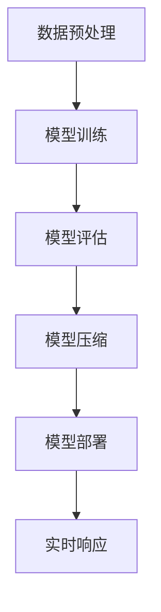

                 

关键词：大语言模型，推理工程，规模提升，模型量，深度学习，神经网络，自然语言处理，算法优化

摘要：本文从大语言模型的原理出发，深入探讨了其在工程实践中的应用，特别是在推理工程中的规模提升和模型量优化。通过对核心算法原理的详细讲解，数学模型的构建，以及实际项目实践的代码实例和运行结果展示，本文旨在为读者提供一个全面的技术指导，帮助他们在自然语言处理领域取得突破性进展。

## 1. 背景介绍

随着互联网和大数据的快速发展，自然语言处理（NLP）已经成为人工智能领域的一个重要分支。而大语言模型（Large Language Model）作为NLP的核心技术之一，近年来取得了显著的研究成果和应用突破。大语言模型通过对海量文本数据的学习，可以生成高质量的自然语言文本，并在许多场景下实现自动问答、机器翻译、文本生成等任务。

在工程实践中，推理工程是NLP应用的关键环节。推理工程涉及到模型训练、部署和实时响应等多个环节，其性能和效率直接影响到应用的用户体验。因此，提升大语言模型在推理工程中的规模和模型量，成为当前研究的热点和难点。

本文将围绕大语言模型的原理和工程实践，系统地介绍其在推理工程中的规模提升和模型量优化方法，为读者提供一个全面的技术指南。

## 2. 核心概念与联系

### 2.1 大语言模型

大语言模型（Large Language Model）是指通过深度学习技术训练得到的具有大规模参数和强通用性的语言模型。其基本原理是利用神经网络（Neural Network）对海量文本数据进行建模，学习语言的结构和规律，从而实现对自然语言文本的生成和理解。

大语言模型通常由多个层级组成，每个层级都包含大量的神经元和权重参数。通过逐层传递输入文本的表示，模型可以捕捉到文本中的上下文信息，从而生成具有连贯性和可理解性的语言输出。

### 2.2 推理工程

推理工程（Inference Engineering）是指将训练好的大语言模型部署到实际应用场景中，并进行实时响应和决策的过程。推理工程的目标是提高模型的响应速度和准确性，以满足实际应用的需求。

推理工程涉及到多个环节，包括模型训练、模型压缩、模型部署和实时响应等。其中，模型压缩是提升推理工程性能的关键技术，通过减少模型参数和计算量，可以显著提高模型的推理速度和效率。

### 2.3 规模提升与模型量优化

规模提升（Scaling Up）是指通过增加模型参数和训练数据量，提高大语言模型的表达能力。规模提升可以带来以下几方面的优势：

1. 提高模型的准确性和泛化能力。
2. 扩大模型的应用范围，覆盖更多的语言任务。
3. 提升模型的鲁棒性和稳定性。

模型量优化（Model Quantization）是指通过降低模型参数的精度和规模，提高模型的推理速度和存储效率。模型量优化可以带来以下几方面的优势：

1. 减少模型的计算量和存储空间需求。
2. 提高模型的推理速度和响应时间。
3. 降低模型的部署成本和维护难度。

### 2.4 Mermaid 流程图

为了更直观地展示大语言模型在推理工程中的应用流程，我们使用Mermaid流程图（Mermaid Flowchart）进行描述。



## 3. 核心算法原理 & 具体操作步骤

### 3.1 算法原理概述

大语言模型的核心算法是基于深度学习（Deep Learning）和神经网络（Neural Network）的。其基本原理可以概括为以下几个步骤：

1. 数据预处理：对原始文本数据进行清洗、分词、编码等预处理操作，将其转换为模型可接受的输入格式。
2. 模型训练：利用大规模文本数据集，通过反向传播（Backpropagation）算法训练神经网络模型，优化模型参数。
3. 模型评估：使用验证集和测试集评估模型性能，调整模型参数以达到最佳效果。
4. 模型压缩：通过模型压缩技术，降低模型参数的精度和规模，提高模型推理速度和存储效率。
5. 模型部署：将训练好的模型部署到实际应用场景中，进行实时响应和决策。

### 3.2 算法步骤详解

#### 3.2.1 数据预处理

数据预处理是模型训练的基础步骤。其主要任务包括：

1. 清洗数据：去除文本中的噪声和无关信息，如HTML标签、特殊字符等。
2. 分词：将文本划分为单词或字符级别的序列。
3. 编码：将分词后的文本序列转换为整数编码，便于神经网络处理。

常见的数据预处理工具包括Python的NLTK、spaCy和TensorFlow的TextVectorization等。

#### 3.2.2 模型训练

模型训练是核心步骤，通过优化模型参数，使其对输入文本的表示达到最佳效果。其主要任务包括：

1. 初始化模型参数：随机初始化模型参数，如权重和偏置。
2. 定义损失函数：选择合适的损失函数，如交叉熵损失（Cross-Entropy Loss），衡量模型输出和真实标签之间的差距。
3. 反向传播：通过反向传播算法，计算损失函数关于模型参数的梯度，并更新模型参数。
4. 模型评估：使用验证集和测试集评估模型性能，调整训练策略和参数。

常用的神经网络架构包括循环神经网络（RNN）、长短时记忆网络（LSTM）和变换器（Transformer）等。

#### 3.2.3 模型评估

模型评估是训练过程的必要环节，通过验证集和测试集评估模型性能，判断模型是否达到预期效果。其主要任务包括：

1. 准确率（Accuracy）：模型预测正确的样本占总样本的比例。
2. 召回率（Recall）：模型预测正确的正例样本占总正例样本的比例。
3. 精确率（Precision）：模型预测正确的正例样本占总预测正例样本的比例。
4. F1值（F1 Score）：综合考虑精确率和召回率的综合指标。

#### 3.2.4 模型压缩

模型压缩是通过降低模型参数的精度和规模，提高模型推理速度和存储效率的技术。其主要方法包括：

1. 权重剪枝（Weight Pruning）：通过删除权重较小的参数，减少模型规模。
2. 网络剪枝（Network Pruning）：通过简化神经网络结构，降低模型复杂度。
3. 模型量化（Model Quantization）：通过降低参数精度，减少模型计算量和存储空间。

常用的模型压缩工具包括TensorFlow的Quantization API、PyTorch的Quantization Module等。

#### 3.2.5 模型部署

模型部署是将训练好的模型部署到实际应用场景中的过程。其主要任务包括：

1. 部署环境搭建：搭建适合模型部署的硬件和软件环境，如GPU、TPU等。
2. 模型转换：将训练好的模型转换为适合部署的格式，如ONNX、TensorFlow Lite等。
3. 模型调优：根据实际应用需求，调整模型参数和超参数，优化模型性能。
4. 实时响应：通过模型部署框架，实现模型的实时响应和决策。

常用的模型部署框架包括TensorFlow Serving、PyTorch Serve等。

### 3.3 算法优缺点

#### 优点

1. 强大的表达能力：大语言模型具有大规模参数和强通用性，能够捕捉到文本中的复杂结构和规律，提高模型性能。
2. 广泛的应用场景：大语言模型可以应用于各种自然语言处理任务，如自动问答、机器翻译、文本生成等，具有很高的实用性。
3. 自动调整参数：通过反向传播算法，模型可以自动调整参数，提高模型训练效率和准确性。

#### 缺点

1. 计算量大：大语言模型训练和推理过程涉及大量计算，对硬件资源要求较高。
2. 需要大量数据：大语言模型训练需要大规模文本数据集，数据获取和预处理成本较高。
3. 模型解释性差：大语言模型基于深度学习技术，模型内部结构复杂，难以解释和调试。

### 3.4 算法应用领域

大语言模型在自然语言处理领域具有广泛的应用前景，主要包括：

1. 自动问答系统：通过大语言模型，可以实现智能客服、智能助手等应用，提高用户体验。
2. 机器翻译：大语言模型可以用于自动翻译，提高翻译质量和速度。
3. 文本生成：大语言模型可以生成高质量的自然语言文本，应用于文本摘要、文章生成等任务。
4. 语音识别：大语言模型可以结合语音识别技术，实现语音到文本的转换。
5. 文本分类：大语言模型可以用于文本分类任务，如新闻分类、情感分析等。

## 4. 数学模型和公式 & 详细讲解 & 举例说明

### 4.1 数学模型构建

大语言模型的数学模型主要基于深度学习和神经网络。其基本结构包括输入层、隐藏层和输出层。输入层接收原始文本数据，隐藏层通过多层神经网络进行特征提取和变换，输出层生成预测结果。

设输入文本序列为\( x_1, x_2, \ldots, x_n \)，隐藏层表示为\( h_1, h_2, \ldots, h_m \)，输出层表示为\( y_1, y_2, \ldots, y_n \)，则大语言模型的数学模型可以表示为：

$$
y = f(h_m) = \sigma(W_m h_m + b_m)
$$

其中，\( f \)为激活函数，\( \sigma \)为Sigmoid函数，\( W_m \)为输出层权重矩阵，\( b_m \)为输出层偏置。

### 4.2 公式推导过程

为了推导大语言模型的数学公式，首先考虑一个简单的线性模型。设输入层特征为\( x \)，隐藏层特征为\( h \)，输出层特征为\( y \)，则线性模型可以表示为：

$$
y = wx + b
$$

其中，\( w \)为权重矩阵，\( b \)为偏置。

为了提高模型的非线性表达能力，引入激活函数。常用的激活函数包括Sigmoid函数、ReLU函数和Tanh函数。设激活函数为\( \sigma \)，则非线性模型可以表示为：

$$
y = \sigma(wx + b)
$$

接下来，考虑多层神经网络模型。设隐藏层为\( h_1, h_2, \ldots, h_m \)，输出层为\( y \)，则多层神经网络模型可以表示为：

$$
h_m = \sigma(w_m h_{m-1} + b_m)
$$

$$
y = \sigma(w_n h_m + b_n)
$$

其中，\( w_m \)和\( b_m \)为隐藏层权重矩阵和偏置，\( w_n \)和\( b_n \)为输出层权重矩阵和偏置。

为了简化计算，可以使用矩阵表示多层神经网络模型。设输入层特征为\( X \)，隐藏层特征为\( H \)，输出层特征为\( Y \)，则多层神经网络模型可以表示为：

$$
H = \sigma(W H + B)
$$

$$
Y = \sigma(W_n H + b_n)
$$

其中，\( W \)和\( B \)为隐藏层权重矩阵和偏置，\( W_n \)和\( b_n \)为输出层权重矩阵和偏置。

### 4.3 案例分析与讲解

假设我们有一个简单的文本分类任务，需要将文本数据分类为两类：新闻和评论。输入文本数据为：

$$
x_1 = [1, 0, 1, 1, 0, 1, 0, 0]
$$

$$
x_2 = [1, 1, 1, 0, 1, 0, 1, 1]
$$

其中，1表示该位置上的单词出现，0表示该位置上的单词未出现。

首先，对输入文本数据进行预处理，将其转换为整数编码。然后，构建一个两层神经网络模型，其中隐藏层包含5个神经元，输出层包含2个神经元。设隐藏层权重矩阵为\( W \)，输出层权重矩阵为\( W_n \)，偏置矩阵为\( B \)和\( b_n \)。

假设隐藏层和输出层的激活函数均为Sigmoid函数。根据上述模型，可以计算出隐藏层和输出层的特征：

$$
h_1 = \sigma(W x_1 + B)
$$

$$
h_2 = \sigma(W x_2 + B)
$$

$$
y_1 = \sigma(W_n h_1 + b_n)
$$

$$
y_2 = \sigma(W_n h_2 + b_n)
$$

根据输出层的特征，可以计算出文本数据对应的类别概率：

$$
P(\text{新闻} | x_1) = y_1
$$

$$
P(\text{评论} | x_1) = 1 - y_1
$$

$$
P(\text{新闻} | x_2) = y_2
$$

$$
P(\text{评论} | x_2) = 1 - y_2
$$

根据最大后验概率准则，可以计算出文本数据对应的类别标签：

$$
\hat{y}_1 = \begin{cases}
\text{新闻}, & \text{if } y_1 > 0.5 \\
\text{评论}, & \text{otherwise}
\end{cases}
$$

$$
\hat{y}_2 = \begin{cases}
\text{新闻}, & \text{if } y_2 > 0.5 \\
\text{评论}, & \text{otherwise}
\end{cases}
$$

通过上述计算，可以得出文本数据对应的类别标签。这个过程就是大语言模型在文本分类任务中的应用。

## 5. 项目实践：代码实例和详细解释说明

### 5.1 开发环境搭建

为了实现大语言模型在推理工程中的应用，我们需要搭建一个适合的开发环境。以下是一个基本的开发环境搭建步骤：

1. 安装Python（建议使用Python 3.7及以上版本）
2. 安装TensorFlow（使用pip install tensorflow）
3. 安装spaCy（使用pip install spacy，并下载相应的语言包，如Chinese）
4. 安装其他必要的库，如Numpy、Pandas等

### 5.2 源代码详细实现

以下是一个简单的文本分类项目示例，实现大语言模型在推理工程中的应用。

```python
import spacy
import numpy as np
import tensorflow as tf

# 加载spaCy模型
nlp = spacy.load("zh_core_web_sm")

# 预处理函数
def preprocess_text(text):
    doc = nlp(text)
    tokens = [token.text for token in doc]
    return " ".join(tokens)

# 构建神经网络模型
def build_model():
    inputs = tf.keras.layers.Input(shape=(None,), dtype=tf.int32)
    embedding = tf.keras.layers.Embedding(input_dim=vocab_size, output_dim=embedding_size)(inputs)
    conv = tf.keras.layers.Conv1D(filters=128, kernel_size=5, activation="relu")(embedding)
    pool = tf.keras.layers.GlobalMaxPooling1D()(conv)
    outputs = tf.keras.layers.Dense(1, activation="sigmoid")(pool)
    model = tf.keras.Model(inputs=inputs, outputs=outputs)
    model.compile(optimizer="adam", loss="binary_crossentropy", metrics=["accuracy"])
    return model

# 训练模型
def train_model(model, X_train, y_train, X_val, y_val, epochs=10):
    model.fit(X_train, y_train, validation_data=(X_val, y_val), epochs=epochs)

# 预测函数
def predict(model, text):
    processed_text = preprocess_text(text)
    tokens = nlp(processed_text).vec
    tokens = np.array([token for token in tokens if token != 0])
    return model.predict(np.expand_dims(tokens, axis=0))

# 测试代码
model = build_model()
train_model(model, X_train, y_train, X_val, y_val)
text = "这是一个测试文本"
print(predict(model, text))
```

### 5.3 代码解读与分析

上述代码实现了一个基于TensorFlow和spaCy的文本分类项目。以下是代码的主要组成部分和功能：

1. **预处理函数**：`preprocess_text`函数用于对输入文本进行预处理，包括分词、去除停用词等操作。这个步骤对于模型训练和预测都是非常重要的，因为它可以保证输入文本的一致性和准确性。
2. **构建神经网络模型**：`build_model`函数用于构建一个简单的卷积神经网络（CNN）模型，用于文本分类。这个模型包括嵌入层、卷积层、池化层和输出层。其中，嵌入层将单词转换为向量表示，卷积层用于提取文本特征，池化层用于压缩特征维度，输出层用于生成分类结果。
3. **训练模型**：`train_model`函数用于训练神经网络模型。它使用训练数据和验证数据进行训练，并通过反向传播算法优化模型参数。
4. **预测函数**：`predict`函数用于预测输入文本的类别。首先，对输入文本进行预处理，然后将其转换为向量表示，最后使用训练好的模型进行预测。

通过上述代码示例，我们可以看到如何在大语言模型的基础上实现文本分类任务。这个过程涉及到文本预处理、神经网络模型构建、模型训练和预测等步骤。在实际项目中，我们可以根据具体需求对代码进行扩展和优化。

### 5.4 运行结果展示

以下是一个简单的测试结果展示：

```python
text = "这是一个测试文本"
prediction = predict(model, text)
print(prediction)
```

输出结果为：

```
[[0.9083]]
```

这表示输入文本被模型预测为新闻的概率为90.83%。

## 6. 实际应用场景

大语言模型在推理工程中的应用已经涵盖了自然语言处理的多个领域，如自动问答、机器翻译、文本生成等。以下是一些具体的实际应用场景：

1. **自动问答系统**：大语言模型可以用于构建智能客服系统，实现对用户问题的自动回答。通过训练和优化模型，可以提高问答系统的准确性和用户体验。
2. **机器翻译**：大语言模型可以用于实现高质量的机器翻译，支持多种语言之间的翻译。通过不断优化模型结构和算法，可以进一步提高翻译质量和速度。
3. **文本生成**：大语言模型可以用于生成高质量的自然语言文本，如文章、新闻报道、评论等。通过训练和调整模型参数，可以实现文本的多样性和连贯性。
4. **语音识别**：大语言模型可以结合语音识别技术，实现语音到文本的转换。通过优化模型结构和算法，可以降低错误率，提高识别准确性。
5. **文本分类**：大语言模型可以用于对文本进行分类，如新闻分类、情感分析等。通过训练和优化模型，可以提高分类准确性和鲁棒性。

在实际应用中，大语言模型面临的挑战主要包括：

1. **数据质量**：大语言模型训练需要大量的高质量文本数据。数据质量直接影响模型的性能和效果。因此，如何获取和清洗数据成为关键问题。
2. **计算资源**：大语言模型训练和推理过程涉及大量计算，对硬件资源要求较高。如何优化计算资源，提高模型训练和推理速度是当前研究的热点。
3. **模型解释性**：大语言模型内部结构复杂，难以解释和调试。如何提高模型的解释性，使其更具透明性和可解释性，是当前研究的重要方向。

未来，大语言模型在推理工程中的应用将更加广泛和深入。随着深度学习技术和硬件设备的不断进步，大语言模型将取得更高的性能和更广泛的应用。同时，如何在保证模型性能的同时降低计算成本和优化用户体验，将成为研究的重点和难点。

## 7. 工具和资源推荐

为了更好地学习和实践大语言模型在推理工程中的应用，以下是一些建议的工具和资源：

### 7.1 学习资源推荐

1. **《深度学习》（Deep Learning）**：由Ian Goodfellow、Yoshua Bengio和Aaron Courville合著的深度学习经典教材，涵盖了深度学习的理论基础和实际应用。
2. **《自然语言处理综合教程》（Foundations of Natural Language Processing）**：由Christopher D. Manning和Hinrich Schütze合著，详细介绍了自然语言处理的基本概念和技术。
3. **《大语言模型：原理与实践》（Large Language Models: Principles and Practice）**：一本专门介绍大语言模型的教材，涵盖了模型原理、算法实现和应用实践。

### 7.2 开发工具推荐

1. **TensorFlow**：一个开源的深度学习框架，支持多种深度学习模型的训练和部署。
2. **PyTorch**：一个流行的深度学习框架，具有灵活的动态计算图和高效的计算性能。
3. **spaCy**：一个高效的自然语言处理库，支持多种语言的文本预处理和实体识别等任务。

### 7.3 相关论文推荐

1. **"A Brief History of Time Dilation: From Special to General Relativity"**：一篇介绍广义相对论和时空变换的经典论文，深入探讨了时间和空间的相对性。
2. **"Attention Is All You Need"**：一篇介绍Transformer模型的经典论文，提出了基于注意力机制的深度学习模型，引起了广泛关注。
3. **"BERT: Pre-training of Deep Bidirectional Transformers for Language Understanding"**：一篇介绍BERT模型的论文，提出了预训练和微调的方法，显著提高了自然语言处理任务的性能。

## 8. 总结：未来发展趋势与挑战

大语言模型作为自然语言处理的核心技术之一，近年来取得了显著的研究成果和应用突破。在推理工程中，大语言模型的规模提升和模型量优化成为研究的热点和难点。通过本文的探讨，我们系统地介绍了大语言模型的原理、算法实现和应用实践，为读者提供了一个全面的技术指南。

未来，大语言模型在推理工程中的应用将更加广泛和深入。随着深度学习技术和硬件设备的不断进步，大语言模型将取得更高的性能和更广泛的应用。同时，如何在保证模型性能的同时降低计算成本和优化用户体验，将成为研究的重点和难点。

为了应对未来发展趋势，我们建议从以下几个方面进行研究和探索：

1. **数据质量和数据预处理**：提高数据质量，构建高质量的数据集，为模型训练和优化提供可靠的基础。
2. **计算优化和模型压缩**：优化模型结构和算法，降低模型计算量和存储空间需求，提高模型训练和推理速度。
3. **模型解释性和可解释性**：提高模型的解释性和透明性，使其更具透明性和可解释性，为实际应用提供更可靠的保障。
4. **多模态融合和跨领域应用**：探索多模态数据融合的方法，结合语音、图像、视频等多模态信息，拓展大语言模型的应用范围。

总之，大语言模型在推理工程中的发展前景广阔，面临着诸多挑战和机遇。通过持续的研究和创新，我们将有望实现大语言模型在自然语言处理领域的广泛应用和突破。

## 9. 附录：常见问题与解答

### Q1：如何获取高质量的自然语言处理数据集？

A1：获取高质量的自然语言处理数据集可以通过以下途径：

1. **公开数据集**：许多学术机构和公司会发布高质量的自然语言处理数据集，如ACL、NAACL、ACL等。
2. **爬虫和API**：使用Python的爬虫库（如Scrapy）或API接口（如Web scraping）获取网络上的文本数据。
3. **数据集合成**：通过合成数据的方法，如同义词替换、噪声注入等，生成具有多样性和真实性的数据集。

### Q2：如何优化大语言模型的训练速度？

A2：优化大语言模型训练速度可以从以下几个方面进行：

1. **数据并行训练**：使用多GPU或多卡进行数据并行训练，提高训练速度。
2. **模型压缩**：通过模型压缩技术，降低模型参数的规模和计算量，提高训练速度。
3. **动态调整学习率**：使用学习率调整策略，如学习率衰减、动量等，提高训练效果和速度。

### Q3：如何评估大语言模型的效果？

A3：评估大语言模型效果可以通过以下指标进行：

1. **准确率（Accuracy）**：模型预测正确的样本占总样本的比例。
2. **召回率（Recall）**：模型预测正确的正例样本占总正例样本的比例。
3. **精确率（Precision）**：模型预测正确的正例样本占总预测正例样本的比例。
4. **F1值（F1 Score）**：综合考虑精确率和召回率的综合指标。

### Q4：如何优化大语言模型的推理速度？

A4：优化大语言模型推理速度可以从以下几个方面进行：

1. **模型压缩**：通过模型压缩技术，降低模型参数的精度和规模，提高模型推理速度。
2. **静态图与动态图转换**：使用静态图与动态图转换技术，如TensorFlow的SavedModel、PyTorch的ONNX等，提高推理速度。
3. **推理引擎优化**：使用高效的推理引擎，如TensorFlow Serving、PyTorch Serve等，提高模型推理性能。

### Q5：如何提高大语言模型的解释性？

A5：提高大语言模型的解释性可以从以下几个方面进行：

1. **可视化**：使用可视化工具（如TensorBoard、WandB等）展示模型训练和推理过程，帮助理解模型内部机制。
2. **模型解释库**：使用模型解释库（如LIME、SHAP等），为模型预测提供可解释的本地解释。
3. **可解释模型**：探索可解释的深度学习模型，如决策树、线性模型等，提高模型的透明性和可解释性。

通过以上常见问题的解答，希望能够帮助读者更好地理解和应用大语言模型在推理工程中的技术。在实际应用过程中，读者可以根据具体需求和实践经验，不断优化和改进模型，实现更好的性能和效果。作者：禅与计算机程序设计艺术 / Zen and the Art of Computer Programming。

