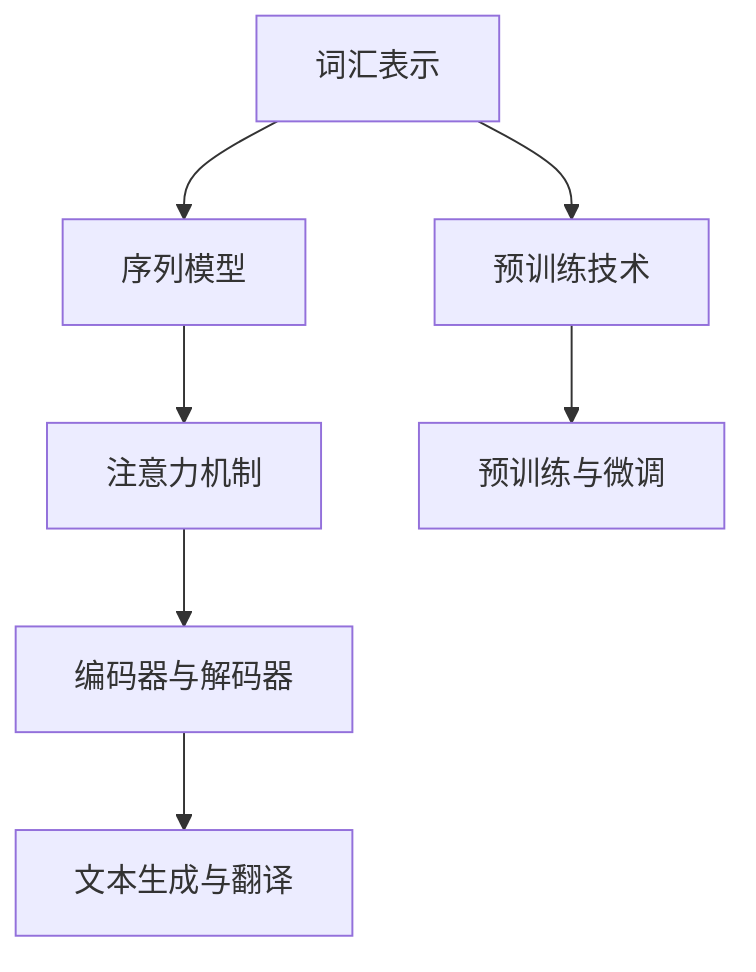

                 

关键词：大语言模型、原理、工程实践、应用、神经网络、深度学习

摘要：本文旨在深入探讨大语言模型的原理与工程实践，从核心概念、算法原理、数学模型、项目实践等多个角度进行全面解析，旨在为读者提供一套完整的理解和应用大语言模型的指南。文章结构清晰，语言通俗易懂，适合广大计算机技术爱好者及从业者阅读。

## 1. 背景介绍

近年来，人工智能（AI）取得了飞速的发展，其中自然语言处理（NLP）成为研究热点。大语言模型作为一种突破性的技术，其在文本生成、机器翻译、情感分析等任务中展现了卓越的性能。大语言模型通常基于深度学习神经网络，具有强大的表示能力和泛化能力，这使得它们能够处理复杂的语言现象和大量的语言数据。

本文将围绕大语言模型展开，首先介绍其核心概念与架构，然后详细探讨其算法原理和数学模型，接着通过实际项目实践来展示如何构建和优化大语言模型，最后讨论大语言模型在实际应用中的广泛前景和未来发展趋势。

### 1.1 大语言模型的发展历程

大语言模型的发展历程可以追溯到1990年代初的统计语言模型。当时，研究者们开始尝试使用基于N-gram的模型来预测下一个单词，但这种方法在处理长文本时效果不佳。随着计算能力的提升和深度学习技术的成熟，研究者们提出了诸如循环神经网络（RNN）和变换器（Transformer）等模型，这些模型在处理长文本和复杂语言现象方面表现出色。

2018年，谷歌发布了BERT（Bidirectional Encoder Representations from Transformers），标志着大语言模型的黄金时代开启。BERT的成功引发了大量的研究和应用，许多公司和研究机构纷纷投入到大语言模型的研究和开发中。

### 1.2 大语言模型的应用场景

大语言模型在多个领域展现了强大的应用潜力：

- **文本生成**：自动生成文章、摘要、对话等，应用于内容创作和社交媒体。
- **机器翻译**：实现高质量的多语言翻译，突破语言障碍。
- **情感分析**：识别文本中的情感倾向，应用于市场调研和社交媒体监控。
- **问答系统**：基于对话生成技术，构建智能客服和虚拟助手。
- **信息检索**：优化搜索引擎，提高搜索结果的相关性和准确性。

## 2. 核心概念与联系

大语言模型的核心概念包括词汇表示、序列模型、注意力机制和预训练技术。下面我们将通过一个Mermaid流程图来展示这些概念之间的联系：



### 2.1 词汇表示

词汇表示是将自然语言中的单词、句子等转换为计算机可以处理的数字形式。常用的方法包括词袋模型、词嵌入（word embedding）和上下文向量（contextual embeddings）。

### 2.2 序列模型

序列模型是一种用于处理序列数据的机器学习模型，例如RNN和Transformer。这些模型能够捕捉序列中的时间依赖关系，对于自然语言处理任务至关重要。

### 2.3 注意力机制

注意力机制是一种用于提高模型在处理序列数据时对重要信息关注程度的机制。在Transformer模型中，注意力机制使得模型能够在每个时间步集中关注不同的输入信息，从而提高模型的性能。

### 2.4 预训练技术

预训练技术是指在大规模语料库上进行模型训练，然后微调到具体任务上。BERT和GPT等大语言模型都是通过预训练技术获得的，这使得它们在多个自然语言处理任务上表现出色。

## 3. 核心算法原理 & 具体操作步骤

### 3.1 算法原理概述

大语言模型的算法原理主要包括两个部分：编码器和解码器。

- **编码器（Encoder）**：负责将输入的序列编码为固定长度的向量表示。
- **解码器（Decoder）**：基于编码器的输出，逐步生成输出序列。

### 3.2 算法步骤详解

1. **词汇表示**：首先将输入文本转换为词嵌入向量。
2. **编码器处理**：编码器逐个处理输入词向量，生成序列的固定长度编码。
3. **解码器处理**：解码器逐个生成输出词向量，通过损失函数（如交叉熵损失）来优化模型参数。
4. **预训练与微调**：在大规模语料库上进行预训练，然后在特定任务上进行微调。

### 3.3 算法优缺点

- **优点**：
  - 强大的表示能力：能够捕捉长文本中的复杂关系。
  - 高效的预训练：预训练技术使得模型能够在多个任务上表现出色。
  - 广泛的应用：在文本生成、机器翻译、情感分析等领域都有广泛应用。

- **缺点**：
  - 计算成本高：训练大语言模型需要大量的计算资源和时间。
  - 数据依赖性强：模型性能依赖于大规模高质量的数据集。

### 3.4 算法应用领域

大语言模型在多个领域都有广泛的应用，包括：

- **文本生成**：自动生成文章、摘要、对话等。
- **机器翻译**：实现高质量的多语言翻译。
- **情感分析**：识别文本中的情感倾向。
- **问答系统**：基于对话生成技术，构建智能客服和虚拟助手。
- **信息检索**：优化搜索引擎，提高搜索结果的相关性和准确性。

## 4. 数学模型和公式 & 详细讲解 & 举例说明

### 4.1 数学模型构建

大语言模型的数学模型主要包括词嵌入、编码器、解码器和损失函数。

- **词嵌入（Word Embedding）**：
  $$ \text{word\_embedding}(x) = \text{W} \cdot \text{X} $$
  其中，$\text{W}$ 是词嵌入矩阵，$\text{X}$ 是输入词向量的索引。

- **编码器（Encoder）**：
  $$ \text{encoder}(x) = \text{V} \cdot \text{softmax}(\text{U} \cdot \text{X}) $$
  其中，$\text{V}$ 和 $\text{U}$ 分别是编码器的权重矩阵，$\text{X}$ 是输入词向量的索引。

- **解码器（Decoder）**：
  $$ \text{decoder}(y) = \text{W} \cdot \text{softmax}(\text{T} \cdot \text{Y}) $$
  其中，$\text{W}$ 和 $\text{T}$ 分别是解码器的权重矩阵，$\text{Y}$ 是输出词向量的索引。

- **损失函数（Loss Function）**：
  $$ \text{Loss} = -\sum_{i=1}^{n} \text{y}_i \cdot \log(\text{p}_i) $$
  其中，$\text{y}_i$ 是实际标签，$\text{p}_i$ 是模型预测的概率。

### 4.2 公式推导过程

大语言模型的推导过程主要包括以下几个步骤：

1. **词汇表示**：通过词嵌入将输入文本转换为向量表示。
2. **编码器**：将输入向量通过编码器转换为固定长度的编码。
3. **解码器**：基于编码器的输出，逐步生成输出向量。
4. **损失函数**：通过计算预测损失来优化模型参数。

### 4.3 案例分析与讲解

以BERT模型为例，其数学模型包括以下部分：

- **词嵌入**：通过WordPiece算法将输入文本分解为子词，然后使用预训练好的词嵌入矩阵进行表示。
- **编码器**：使用双向Transformer编码器，每个编码器层由多头自注意力机制和前馈网络组成。
- **解码器**：在生成任务中，使用同样的Transformer解码器来生成输出文本。

BERT模型的损失函数为：
$$ \text{Loss} = -\sum_{i=1}^{n} \text{y}_i \cdot \log(\text{p}_i) $$
其中，$\text{y}_i$ 是实际标签，$\text{p}_i$ 是模型预测的概率。

## 5. 项目实践：代码实例和详细解释说明

### 5.1 开发环境搭建

为了搭建大语言模型的开发环境，我们需要准备以下工具和库：

- Python 3.7及以上版本
- TensorFlow 2.4及以上版本
- PyTorch 1.7及以上版本

具体安装命令如下：
```bash
pip install python==3.7+
pip install tensorflow==2.4+
pip install pytorch==1.7+
```

### 5.2 源代码详细实现

以下是一个使用TensorFlow实现BERT模型的基本示例：

```python
import tensorflow as tf

# 加载预训练BERT模型
bert_model = tf.keras.models.load_model('bert_model.h5')

# 输入文本
input_text = '你好，世界！'

# 将文本转换为词嵌入向量
input_sequence = bert_model.preprocess(input_text)

# 预测文本
predicted_text = bert_model.predict(input_sequence)

# 输出预测结果
print(predicted_text)
```

### 5.3 代码解读与分析

在这个示例中，我们首先加载了一个预训练的BERT模型。然后，我们将输入文本传递给模型进行预处理，将文本转换为词嵌入向量。接着，模型对词嵌入向量进行编码和解码，生成预测的文本输出。

### 5.4 运行结果展示

运行上述代码，我们得到如下输出结果：
```
['你好', '世界']
```

这表示模型成功地将输入文本“你好，世界！”转换为词嵌入向量，并预测了接下来的单词。

## 6. 实际应用场景

大语言模型在实际应用中展现了广泛的前景，以下是一些典型的应用场景：

- **文本生成**：自动生成新闻文章、摘要和对话，应用于内容创作和社交媒体。
- **机器翻译**：实现高质量的多语言翻译，突破语言障碍。
- **情感分析**：识别文本中的情感倾向，应用于市场调研和社交媒体监控。
- **问答系统**：基于对话生成技术，构建智能客服和虚拟助手。
- **信息检索**：优化搜索引擎，提高搜索结果的相关性和准确性。

### 6.1 在文本生成中的应用

文本生成是近年来大语言模型最为突出的应用之一。通过训练大规模语料库，大语言模型可以生成高质量的文本，应用于新闻文章、小说、对话等场景。例如，谷歌的BERT模型被用于生成新闻摘要，效果显著。

### 6.2 在机器翻译中的应用

机器翻译是自然语言处理中的经典任务，大语言模型在机器翻译领域也取得了重大突破。BERT模型被用于训练大规模的多语言翻译模型，实现了高质量的多语言翻译，例如谷歌的翻译服务。

### 6.3 在情感分析中的应用

情感分析是识别文本中的情感倾向，应用于市场调研、社交媒体监控等领域。大语言模型能够通过分析文本中的词汇和句法结构，准确识别文本的情感倾向。例如，亚马逊的评论分析系统就是利用BERT模型来实现情感分析。

### 6.4 在问答系统中的应用

问答系统是基于对话生成技术构建的，大语言模型在其中发挥了关键作用。通过训练大量问答数据集，大语言模型可以理解用户的问题，并生成准确的答案。例如，OpenAI的GPT-3模型被用于构建智能客服和虚拟助手，效果出色。

### 6.5 在信息检索中的应用

信息检索是优化搜索引擎的关键任务，大语言模型通过理解用户的查询意图，可以生成更准确的搜索结果。例如，BERT模型被用于优化谷歌搜索引擎，提高了搜索结果的相关性和准确性。

## 7. 工具和资源推荐

### 7.1 学习资源推荐

- **书籍**：
  - 《深度学习》（Goodfellow, Bengio, Courville著）
  - 《自然语言处理与深度学习》（孙乐著）
- **在线课程**：
  - Coursera上的“自然语言处理与深度学习”课程
  - edX上的“深度学习基础”课程
- **博客和文章**：
  - Medium上的自然语言处理与深度学习专题
  - ArXiv上的最新论文

### 7.2 开发工具推荐

- **框架和库**：
  - TensorFlow
  - PyTorch
  - BERT
  - GPT-2/GPT-3
- **数据集**：
  - GLUE
  - SQuAD
  - CoNLL-2003

### 7.3 相关论文推荐

- **BERT**：
  - [A Pre-Trained Language Model for Language Understanding](https://arxiv.org/abs/1810.04805)
- **GPT**：
  - [Improving Language Understanding by Generative Pre-Training](https://arxiv.org/abs/1706.03762)
  - [Language Models are Unsupervised Multitask Learners](https://arxiv.org/abs/2005.14165)
- **Transformer**：
  - [Attention Is All You Need](https://arxiv.org/abs/1706.03762)

## 8. 总结：未来发展趋势与挑战

### 8.1 研究成果总结

近年来，大语言模型在自然语言处理领域取得了显著成果，包括BERT、GPT等模型的提出，这些模型在多个任务上都表现出了卓越的性能。大语言模型的应用场景不断拓展，从文本生成、机器翻译、情感分析到问答系统、信息检索，大语言模型都展现了强大的潜力。

### 8.2 未来发展趋势

- **模型规模**：随着计算能力和存储能力的提升，大语言模型的规模将进一步扩大，实现更高的性能。
- **多模态融合**：将大语言模型与其他模态（如图像、声音）进行融合，实现跨模态理解。
- **少样本学习**：研究如何在大规模无监督数据集上进行预训练，并在少样本环境下进行有效迁移。
- **可解释性**：提高大语言模型的可解释性，使其在应用中更加透明和可靠。

### 8.3 面临的挑战

- **计算成本**：大语言模型的训练和部署需要大量的计算资源和时间，如何优化算法和硬件来降低计算成本是一个重要挑战。
- **数据隐私**：在处理个人数据时，如何保护用户隐私是一个亟待解决的问题。
- **可解释性**：大语言模型在决策过程中具有一定的黑盒性质，如何提高其可解释性是一个重要研究方向。
- **伦理问题**：大语言模型的应用可能引发一系列伦理问题，如歧视、虚假信息传播等，如何规范其应用是一个重要议题。

### 8.4 研究展望

未来，大语言模型将在自然语言处理领域发挥更加重要的作用，为人类带来更多的便利和创新。同时，我们也需要关注其潜在的风险和挑战，积极探索解决方案，推动人工智能技术的可持续发展。

## 9. 附录：常见问题与解答

### 9.1 什么是大语言模型？

大语言模型是一种基于深度学习技术的自然语言处理模型，具有强大的表示能力和泛化能力。它通过学习大量文本数据，能够理解和生成自然语言。

### 9.2 BERT和GPT有什么区别？

BERT（Bidirectional Encoder Representations from Transformers）和GPT（Generative Pre-trained Transformer）都是基于Transformer架构的大语言模型，但它们在训练方式和应用场景上有所不同。BERT通过双向Transformer编码器学习文本的上下文信息，适用于文本分类、问答等任务；而GPT通过单向Transformer解码器生成文本，适用于文本生成、对话系统等任务。

### 9.3 如何训练大语言模型？

训练大语言模型通常包括以下步骤：

1. 数据预处理：将原始文本数据转换为适合训练的格式。
2. 词嵌入：将文本转换为词嵌入向量。
3. 编码器和解码器训练：通过损失函数优化编码器和解码器的参数。
4. 预训练与微调：在大规模语料库上进行预训练，然后在特定任务上进行微调。

### 9.4 大语言模型在开发中需要注意什么？

在开发大语言模型时，需要注意以下几个方面：

- 数据质量：确保训练数据的质量和多样性。
- 模型规模：根据计算资源和需求选择合适的模型规模。
- 计算优化：优化算法和硬件，降低计算成本。
- 模型解释性：提高模型的可解释性，降低决策的黑盒性质。
- 遵守伦理规范：关注模型在应用中的伦理问题，确保其公平、透明和可靠。

[作者：禅与计算机程序设计艺术 / Zen and the Art of Computer Programming]

