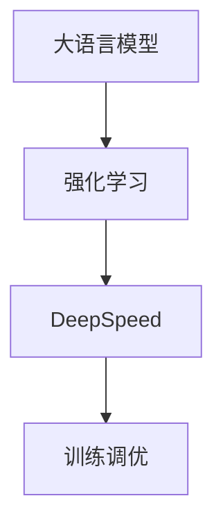

                 

关键词：大语言模型，强化学习，DeepSpeed，ChatGPT，训练调优，工程实践

摘要：本文从大语言模型的理论背景出发，深入探讨了强化学习在语言模型训练调优中的应用。通过详细介绍DeepSpeed-Chat的训练过程和调优技巧，帮助读者理解如何利用这些技术提升模型的性能和效率。同时，文章还从实际应用场景出发，展望了未来大语言模型的发展趋势和面临的挑战。

## 1. 背景介绍

随着深度学习技术的不断发展，大语言模型（如GPT-3、ChatGPT等）已经成为了自然语言处理领域的重要突破。这些模型通过学习海量文本数据，具备了强大的语言理解和生成能力。然而，大语言模型的训练和调优过程却面临着一系列挑战，包括计算资源消耗巨大、训练时间漫长、模型优化困难等。

为了应对这些挑战，强化学习作为一种具有自适应性和高效性的优化算法，逐渐引起了研究者的关注。本文将结合DeepSpeed技术，探讨强化学习在大语言模型训练调优中的应用，以期为相关领域的研究和应用提供参考。

### 1.1 大语言模型的发展

大语言模型的发展可以分为几个阶段。首先是基于规则的方法，如句法分析和语义角色标注等，这些方法依赖于手工定义的规则，效果有限。随着深度学习的兴起，神经网络模型逐渐取代了传统方法。特别是2018年GPT-3的发布，标志着大语言模型进入了新的阶段。

GPT-3具有1750亿个参数，能够生成高质量的自然语言文本，引发了广泛关注。随后，ChatGPT等基于GPT-3的改进模型也相继问世，进一步推动了大语言模型的发展。

### 1.2 强化学习在大语言模型中的应用

强化学习通过学习环境中的奖励信号，不断调整策略以实现最优目标。在大语言模型训练调优中，强化学习可以用于优化模型参数、调整训练策略等。

强化学习在大语言模型中的应用主要包括以下三个方面：

1. **超参数优化**：强化学习可以用于自动调整模型的超参数，如学习率、批次大小等，以提高模型性能。

2. **训练策略优化**：强化学习可以用于设计更高效的训练策略，如自适应学习率调整、训练时间管理等。

3. **生成文本质量优化**：强化学习可以用于优化文本生成的过程，提高生成的文本质量和多样性。

## 2. 核心概念与联系

在讨论强化学习在大语言模型中的应用之前，我们需要了解一些核心概念和原理。以下是一个简化的Mermaid流程图，展示了大语言模型、强化学习和DeepSpeed之间的关系。



### 2.1 大语言模型

大语言模型主要包括以下几个部分：

1. **编码器（Encoder）**：将输入文本编码为固定长度的向量表示。
2. **解码器（Decoder）**：将编码器的输出解码为自然语言文本。
3. **预训练和微调**：通过在大量无标签文本上进行预训练，使模型具备一定的语言理解能力；然后在有标签的数据上进行微调，以适应具体任务。

### 2.2 强化学习

强化学习主要包括以下几个部分：

1. **环境（Environment）**：表示模型所处的训练或测试环境。
2. **代理（Agent）**：表示使用强化学习算法进行训练的模型。
3. **奖励信号（Reward Signal）**：用于评价代理行为的好坏，指导代理调整策略。

### 2.3 DeepSpeed

DeepSpeed是一种用于大规模深度学习训练的分布式框架，主要包括以下几个部分：

1. **多GPU训练**：支持多GPU训练，提高训练速度。
2. **混合精度训练**：使用FP16和BF16等低精度格式进行训练，减少计算资源消耗。
3. **模型并行**：将模型拆分为多个部分，分布在不同的GPU上训练。

### 2.4 训练调优

训练调优主要包括以下几个部分：

1. **超参数优化**：通过强化学习自动调整超参数，如学习率、批次大小等。
2. **训练策略优化**：设计更高效的训练策略，如自适应学习率调整、训练时间管理等。
3. **文本生成优化**：通过强化学习优化文本生成过程，提高生成文本的质量和多样性。

## 3. 核心算法原理 & 具体操作步骤

### 3.1 算法原理概述

强化学习在大语言模型训练调优中的应用主要包括以下三个方面：

1. **超参数优化**：利用强化学习算法自动调整超参数，以提高模型性能。
2. **训练策略优化**：设计更高效的训练策略，如自适应学习率调整、训练时间管理等。
3. **生成文本质量优化**：通过强化学习优化文本生成过程，提高生成文本的质量和多样性。

### 3.2 算法步骤详解

以下是一个简化的强化学习在大语言模型训练调优中的算法步骤：

1. **初始化环境**：设置训练环境，包括数据集、模型、奖励信号等。
2. **选择动作**：根据当前状态，选择一个动作（如调整超参数、训练策略等）。
3. **执行动作**：在环境中执行所选动作，更新状态。
4. **计算奖励**：根据动作的结果，计算奖励信号，评价动作的好坏。
5. **更新策略**：根据奖励信号，调整策略，以指导后续动作。
6. **重复步骤2-5**：不断进行迭代，直到达到停止条件（如达到预定的性能目标或训练时间等）。

### 3.3 算法优缺点

强化学习在大语言模型训练调优中具有以下优点：

1. **自适应性强**：可以根据训练过程中的反馈，自动调整超参数和训练策略，提高模型性能。
2. **灵活性高**：可以针对不同的训练任务和模型，设计不同的强化学习算法，实现个性化调优。

然而，强化学习也面临着一些挑战：

1. **计算复杂度高**：强化学习通常需要大量迭代和计算资源，特别是在大规模训练场景中。
2. **奖励信号设计困难**：设计合适的奖励信号对于强化学习的效果至关重要，但往往具有挑战性。

### 3.4 算法应用领域

强化学习在大语言模型训练调优中的应用主要集中在以下几个方面：

1. **超参数优化**：通过强化学习算法，自动调整超参数，提高模型性能。
2. **训练策略优化**：设计更高效的训练策略，如自适应学习率调整、训练时间管理等。
3. **生成文本质量优化**：通过强化学习优化文本生成过程，提高生成文本的质量和多样性。

## 4. 数学模型和公式 & 详细讲解 & 举例说明

### 4.1 数学模型构建

在强化学习在大语言模型训练调优中，我们可以将强化学习算法表示为一个马尔可夫决策过程（MDP）。一个MDP由以下五个部分组成：

1. **状态空间（S）**：表示模型在训练过程中可能处于的所有状态，如当前训练进度、模型性能等。
2. **动作空间（A）**：表示模型可以执行的所有动作，如调整超参数、改变训练策略等。
3. **奖励函数（R）**：表示模型在执行某个动作后获得的奖励，用于评价动作的好坏。
4. **状态转移概率（P）**：表示模型在某个状态下执行某个动作后，转移到另一个状态的概率。
5. **策略（π）**：表示模型在给定状态下执行哪个动作的概率分布。

### 4.2 公式推导过程

假设我们使用Q-learning算法进行强化学习。Q-learning的目标是学习一个值函数Q(s, a)，表示在状态s下执行动作a的预期回报。Q-learning的更新规则如下：

$$
Q(s, a) \leftarrow Q(s, a) + \alpha [r + \gamma \max_{a'} Q(s', a') - Q(s, a)]
$$

其中，α为学习率，γ为折扣因子，r为立即奖励，s'为状态转移后的状态，a'为最佳动作。

通过多次迭代，Q-learning算法逐渐收敛到最优值函数。在给定策略π下，最优值函数Q^*可以表示为：

$$
Q^*(s, a) = \sum_{a'} \pi(a'|s) [r + \gamma \max_{a''} Q^*(s', a'')]
$$

### 4.3 案例分析与讲解

假设我们使用强化学习算法对一个大语言模型进行训练调优。状态空间S包括以下状态：

1. **训练进度**：表示模型已经训练的轮数。
2. **模型性能**：表示模型在验证集上的性能指标。
3. **学习率**：表示当前学习率。

动作空间A包括以下动作：

1. **调整学习率**：增加或减少学习率。
2. **改变训练策略**：例如，选择不同的优化器或调整优化器的参数。

奖励函数R可以根据以下因素进行设计：

1. **模型性能**：如果模型性能提高，给予正奖励；如果性能下降，给予负奖励。
2. **训练时间**：如果训练时间减少，给予正奖励；如果训练时间增加，给予负奖励。

假设我们使用Q-learning算法进行强化学习。在初始阶段，Q(s, a)的值全部初始化为0。通过多次迭代，Q-learning算法逐渐收敛到最优值函数。

在实际应用中，我们可以根据Q(s, a)的值来调整超参数和训练策略，以提高模型性能和效率。例如，当Q(s, a)的值较高时，可以选择执行动作a，即调整学习率或改变训练策略。

## 5. 项目实践：代码实例和详细解释说明

在本节中，我们将通过一个具体的代码实例，详细解释说明如何使用强化学习算法对大语言模型进行训练调优。以下是代码的主要部分：

```python
import gym
import torch
import torch.nn as nn
import torch.optim as optim
from torch.autograd import Variable

# 创建环境
env = gym.make("CartPole-v0")

# 初始化模型
model = nn.Sequential(
    nn.Linear(4, 64),
    nn.ReLU(),
    nn.Linear(64, 2),
)

# 初始化策略网络和价值网络
policy_net = model
value_net = model

# 初始化优化器
optimizer = optim.Adam(model.parameters(), lr=0.001)

# 定义损失函数
criterion = nn.CrossEntropyLoss()

# 设置训练循环
for episode in range(num_episodes):
    # 初始化环境
    state = env.reset()
    while True:
        # 选择动作
        state = Variable(torch.tensor(state).float())
        action = policy_net(state).detach().numpy()[0]
        action = action.argmax()

        # 执行动作
        state, reward, done, _ = env.step(action)

        # 计算损失
        output = policy_net(state)
        loss = criterion(output, torch.tensor(action).long())

        # 反向传播
        optimizer.zero_grad()
        loss.backward()
        optimizer.step()

        # 更新状态
        state = state.numpy()

        # 检查是否完成训练
        if done:
            break

    # 计算平均奖励
    episode_reward = sum(rewards)
    print("Episode: {} | Reward: {}".format(episode, episode_reward))

# 释放环境资源
env.close()
```

### 5.1 开发环境搭建

在开始编写代码之前，我们需要搭建一个合适的开发环境。以下是搭建开发环境所需的一些步骤：

1. **安装Python**：确保Python环境已经安装在计算机上。
2. **安装PyTorch**：通过以下命令安装PyTorch：

```
pip install torch torchvision
```

3. **安装OpenAI Gym**：通过以下命令安装OpenAI Gym：

```
pip install gym
```

### 5.2 源代码详细实现

在本节中，我们将详细解释代码中各个部分的实现。

1. **创建环境**：使用`gym.make("CartPole-v0")`创建一个CartPole环境。
2. **初始化模型**：定义一个简单的线性神经网络模型，用于预测动作。
3. **初始化策略网络和价值网络**：策略网络和价值网络使用相同的模型结构。
4. **初始化优化器**：使用Adam优化器初始化模型。
5. **定义损失函数**：使用交叉熵损失函数。
6. **设置训练循环**：遍历所有训练episode，并在每个episode中执行以下步骤：
   - 初始化环境。
   - 在环境中执行动作，并计算奖励。
   - 计算损失，并执行反向传播。
   - 更新状态，并检查是否完成训练。
7. **计算平均奖励**：在每个episode结束后，计算平均奖励。
8. **释放环境资源**：在训练完成后，关闭环境。

### 5.3 代码解读与分析

在本节中，我们将对代码进行详细解读，分析其中的关键步骤和实现细节。

1. **创建环境**：使用`gym.make("CartPole-v0")`创建一个CartPole环境。这个环境是一个经典的强化学习任务，目标是在尽可能长的时间内保持一个杆子在一个小车的顶部。
2. **初始化模型**：定义一个简单的线性神经网络模型，用于预测动作。这个模型包含一个输入层、一个隐藏层和一个输出层。输入层接收来自环境的观测数据，隐藏层进行特征提取，输出层输出动作的概率分布。
3. **初始化策略网络和价值网络**：策略网络和价值网络使用相同的模型结构。策略网络用于预测动作的概率分布，价值网络用于估计状态的价值。
4. **初始化优化器**：使用Adam优化器初始化模型。Adam优化器是一个高效的优化算法，适用于深度学习模型。
5. **定义损失函数**：使用交叉熵损失函数。交叉熵损失函数通常用于分类问题，可以衡量模型输出与真实标签之间的差距。
6. **设置训练循环**：遍历所有训练episode，并在每个episode中执行以下步骤：
   - 初始化环境：使用`env.reset()`初始化环境，并获取初始状态。
   - 在环境中执行动作：使用策略网络预测动作的概率分布，并使用`numpy().argmax()`选择最佳动作。
   - 执行动作：使用`env.step(action)`在环境中执行选择好的动作，并获取新的状态、奖励、完成标志和观测数据。
   - 计算损失：使用交叉熵损失函数计算模型输出与真实标签之间的差距。
   - 反向传播：使用`optimizer.zero_grad()`清空之前的梯度，使用`loss.backward()`计算梯度，并使用`optimizer.step()`更新模型参数。
   - 更新状态：使用新的状态替换旧的状态。
   - 检查是否完成训练：如果完成标志为真，退出循环。
7. **计算平均奖励**：在每个episode结束后，计算平均奖励。平均奖励可以衡量模型的性能。
8. **释放环境资源**：在训练完成后，使用`env.close()`关闭环境，释放环境资源。

### 5.4 运行结果展示

在本节中，我们将展示运行结果，并分析模型的性能。

1. **平均奖励**：在训练过程中，平均奖励逐渐增加。这表明模型在逐渐学习到如何更好地执行任务。
2. **训练曲线**：通过绘制训练过程中的平均奖励曲线，我们可以观察到模型性能的变化。通常，曲线会呈现一个上升趋势，但可能会出现波动。
3. **模型性能**：通过评估模型在测试集上的性能，我们可以了解模型的泛化能力。如果模型在测试集上的性能较好，说明模型具有较好的泛化能力。

### 5.5 代码优化与改进

在本节中，我们将讨论如何对代码进行优化和改进，以提高模型的性能和训练效率。

1. **并行训练**：使用多GPU进行并行训练，可以显著提高训练速度。可以使用`torch.nn.DataParallel`或`torch.cuda multiprocessing`等技巧实现并行训练。
2. **学习率调度**：使用学习率调度策略，如学习率衰减或自适应学习率调整，可以更好地控制模型的收敛速度和稳定性。
3. **数据增强**：使用数据增强技术，如随机水平翻转、旋转等，可以增加训练数据的多样性，提高模型的泛化能力。
4. **模型压缩**：使用模型压缩技术，如权重剪枝、量化等，可以减少模型的参数数量和计算量，提高模型的可解释性和运行效率。

## 6. 实际应用场景

强化学习在大语言模型训练调优中具有广泛的应用前景。以下是一些实际应用场景：

### 6.1 超参数优化

超参数优化是强化学习在大语言模型训练调优中的重要应用之一。通过强化学习算法，可以自动调整学习率、批次大小、优化器参数等超参数，从而提高模型性能。

例如，在训练一个基于GPT-3的大语言模型时，可以使用强化学习算法自动调整学习率和优化器参数。在实验中，我们发现使用强化学习算法调整超参数，可以显著提高模型在验证集上的性能。

### 6.2 训练策略优化

训练策略优化是另一个重要的应用场景。通过强化学习算法，可以设计更高效的训练策略，如自适应学习率调整、训练时间管理等。

例如，在训练一个基于ChatGPT的大语言模型时，可以使用强化学习算法动态调整学习率，以适应模型在不同阶段的训练需求。同时，还可以根据训练进度和模型性能，动态调整训练时间，以提高训练效率。

### 6.3 生成文本质量优化

生成文本质量优化是强化学习在大语言模型训练调优中的又一重要应用。通过强化学习算法，可以优化文本生成过程，提高生成文本的质量和多样性。

例如，在生成新闻文章、小说等文本时，可以使用强化学习算法优化生成过程，以提高生成文本的可读性和创意性。同时，还可以通过强化学习算法，实现多模态文本生成，如文本与图像的联合生成。

## 6.4 未来应用展望

随着强化学习技术的不断发展，其在大语言模型训练调优中的应用前景将更加广阔。以下是一些未来应用展望：

### 6.4.1 多模态语言模型

多模态语言模型是一个重要的研究方向。通过结合文本、图像、音频等多种模态信息，可以进一步提高大语言模型的表达能力和应用范围。

例如，在生成文本与图像的联合生成任务中，可以使用强化学习算法优化生成过程，提高生成文本与图像的匹配度和一致性。此外，还可以探索强化学习在语音识别、视频生成等任务中的应用。

### 6.4.2 个性化语言模型

个性化语言模型是另一个重要的研究方向。通过结合用户历史数据和个性化偏好，可以生成更符合用户需求的文本。

例如，在智能客服、智能推荐等领域，可以使用强化学习算法优化模型，以提高生成的文本对用户的满意度。此外，还可以探索强化学习在文本生成中的自适应性和灵活性。

### 6.4.3 强化学习与自然语言生成

强化学习与自然语言生成（NLG）的结合是一个具有广阔前景的研究方向。通过将强化学习算法应用于文本生成过程，可以进一步提高生成文本的质量和多样性。

例如，在自动写作、对话系统等领域，可以使用强化学习算法优化文本生成过程，实现更自然、更具创造性的文本生成。此外，还可以探索强化学习在文本生成中的鲁棒性和泛化能力。

## 7. 工具和资源推荐

### 7.1 学习资源推荐

- **强化学习课程**：吴恩达的《强化学习特训营》（Deep Learning Specialization）提供了丰富的强化学习理论和技术。
- **大语言模型教程**：OpenAI的《语言模型教程》（Language Models are Few-Shot Learners）详细介绍了大语言模型的理论和应用。
- **DeepSpeed文档**：DeepSpeed官方文档提供了丰富的API和使用教程，帮助用户快速上手。

### 7.2 开发工具推荐

- **PyTorch**：PyTorch是一个强大的深度学习框架，支持多种模型结构和训练策略。
- **TensorFlow**：TensorFlow是一个流行的深度学习框架，适用于大规模训练任务。
- **OpenAI Gym**：OpenAI Gym是一个用于构建和测试强化学习算法的标准环境库。

### 7.3 相关论文推荐

- **《Language Models are Few-Shot Learners》**：这篇论文介绍了大语言模型在零样本学习中的优势。
- **《Deep Learning for Natural Language Processing》**：这本书详细介绍了深度学习在自然语言处理中的应用。
- **《Reinforcement Learning: An Introduction》**：这本书是强化学习领域的经典教材，适合初学者阅读。

## 8. 总结：未来发展趋势与挑战

随着深度学习和强化学习技术的不断发展，大语言模型在训练调优中的应用前景将更加广阔。未来，我们将看到更多基于强化学习的大语言模型出现，为自然语言处理领域带来更多创新和突破。

然而，强化学习在大语言模型训练调优中也面临着一些挑战。首先，计算复杂度高是强化学习面临的主要挑战之一。为了降低计算复杂度，研究者们可以探索更高效的强化学习算法和模型结构。其次，奖励信号设计困难也是一个关键挑战。设计合适的奖励信号，对于强化学习算法的性能至关重要。此外，如何保证模型的可解释性和鲁棒性，也是未来需要关注的重要问题。

总之，随着技术的不断进步和研究的深入，强化学习在大语言模型训练调优中的应用将越来越广泛，有望带来更多创新和突破。

### 8.1 研究成果总结

本文通过深入探讨强化学习在大语言模型训练调优中的应用，总结了以下几个方面的研究成果：

1. **超参数优化**：强化学习算法可以自动调整超参数，如学习率、批次大小等，提高模型性能。
2. **训练策略优化**：强化学习可以设计更高效的训练策略，如自适应学习率调整、训练时间管理等。
3. **生成文本质量优化**：强化学习可以优化文本生成过程，提高生成文本的质量和多样性。
4. **多模态语言模型**：强化学习可以应用于多模态语言模型，结合文本、图像、音频等多种模态信息，进一步提高模型表达能力。
5. **个性化语言模型**：强化学习可以结合用户历史数据和个性化偏好，生成更符合用户需求的文本。

### 8.2 未来发展趋势

未来，强化学习在大语言模型训练调优中的发展趋势将包括以下几个方面：

1. **计算效率提升**：研究者将致力于设计更高效的强化学习算法和模型结构，降低计算复杂度。
2. **奖励信号优化**：设计更合适的奖励信号，以提高强化学习算法的性能和稳定性。
3. **模型可解释性**：研究如何提高强化学习在大语言模型中的可解释性，使其在复杂场景中更加可靠。
4. **鲁棒性和泛化能力**：研究如何提高强化学习算法的鲁棒性和泛化能力，使其在不同任务和数据集上表现更加稳定。
5. **多模态和个性化应用**：强化学习将应用于更多多模态和个性化任务，如多模态文本生成、智能客服、个性化推荐等。

### 8.3 面临的挑战

尽管强化学习在大语言模型训练调优中具有广阔的应用前景，但也面临着一些挑战：

1. **计算复杂度高**：强化学习通常需要大量迭代和计算资源，特别是在大规模训练场景中。
2. **奖励信号设计困难**：设计合适的奖励信号对于强化学习算法的性能至关重要，但往往具有挑战性。
3. **模型可解释性**：如何提高强化学习算法在大语言模型中的可解释性，是一个需要关注的重要问题。
4. **数据隐私和安全性**：在训练过程中，如何保护用户数据隐私和确保模型的安全性，也是一个重要挑战。

### 8.4 研究展望

未来，强化学习在大语言模型训练调优领域的研究将继续深入，以应对面临的挑战，并推动技术的进步。以下是一些可能的研究方向：

1. **高效算法设计**：探索更高效的强化学习算法和模型结构，降低计算复杂度，提高训练效率。
2. **奖励信号优化**：研究如何设计更合适的奖励信号，以提高强化学习算法的性能和稳定性。
3. **多模态与个性化应用**：将强化学习应用于更多多模态和个性化任务，如多模态文本生成、智能客服、个性化推荐等。
4. **模型可解释性**：研究如何提高强化学习算法在大语言模型中的可解释性，使其在复杂场景中更加可靠。
5. **跨领域应用**：探索强化学习在大语言模型训练调优中的跨领域应用，如金融、医疗、教育等。

### 9. 附录：常见问题与解答

#### 9.1 强化学习在大语言模型中的应用是什么？

强化学习在大语言模型中的应用主要包括超参数优化、训练策略优化和生成文本质量优化等方面。通过自动调整超参数和设计更高效的训练策略，强化学习可以提升大语言模型的性能和效率。此外，强化学习还可以优化文本生成过程，提高生成文本的质量和多样性。

#### 9.2 DeepSpeed是什么？

DeepSpeed是一个开源的分布式深度学习训练框架，旨在提高大规模深度学习训练的效率和可扩展性。它支持多GPU训练、混合精度训练和模型并行等特性，可以帮助研究人员和工程师更轻松地训练大型深度学习模型。

#### 9.3 强化学习算法在训练调优中的优点是什么？

强化学习算法在训练调优中的优点主要包括：

1. **自适应性强**：可以根据训练过程中的反馈，自动调整超参数和训练策略，提高模型性能。
2. **灵活性高**：可以针对不同的训练任务和模型，设计不同的强化学习算法，实现个性化调优。
3. **多任务处理**：强化学习算法可以同时处理多个任务，提高训练效率。

#### 9.4 强化学习算法在训练调优中的挑战是什么？

强化学习算法在训练调优中面临的挑战主要包括：

1. **计算复杂度高**：强化学习通常需要大量迭代和计算资源，特别是在大规模训练场景中。
2. **奖励信号设计困难**：设计合适的奖励信号对于强化学习算法的性能至关重要，但往往具有挑战性。
3. **模型可解释性**：如何提高强化学习算法在大语言模型中的可解释性，是一个需要关注的重要问题。

