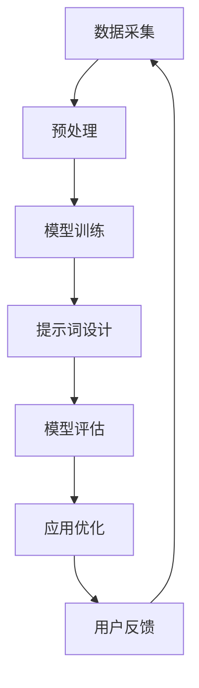

                 

关键词：大语言模型，工程实践，提示词，人工智能，原理解析，应用领域，未来展望

> 摘要：本文将深入探讨大语言模型的原理及其工程实践，重点关注提示词的基础要素。通过对核心概念、算法原理、数学模型、实际应用以及未来展望的详细分析，旨在为读者提供一个全面的技术解读，帮助理解大语言模型在现代人工智能领域的核心地位和潜在应用价值。

## 1. 背景介绍

随着人工智能技术的快速发展，大语言模型（Large Language Model）已经成为自然语言处理（NLP）领域的重要工具。从早期的统计模型到深度学习时代，语言模型经历了巨大的变革。然而，大语言模型的出现不仅仅是一次技术进步，它更是一个时代标志，预示着人工智能向通用智能迈出了坚实的一步。

大语言模型的核心在于其强大的建模能力和对语言规律的深刻理解。通过对海量文本数据进行训练，这些模型能够掌握丰富的语言知识，并在多种语言任务中表现出色。然而，大语言模型的应用不仅依赖于其技术上的优势，更需要高效的工程实践来确保其性能和稳定性。本文将围绕这些方面展开讨论，帮助读者更好地理解大语言模型的原理与工程实践。

## 2. 核心概念与联系

### 2.1 大语言模型的概念

大语言模型（Large Language Model）是一种基于深度学习的自然语言处理模型，通过大规模的文本数据训练，模型能够学习并预测文本序列中的下一个词或句子。这些模型通常具有数十亿甚至千亿个参数，使得它们能够捕捉到复杂且细微的语言特征。

### 2.2 提示词的概念

提示词（Prompt）是指用于引导模型生成特定输出或完成特定任务的语言提示。在训练过程中，提示词可以帮助模型理解任务目标，并在实际应用中起到引导和优化的作用。

### 2.3 大语言模型与提示词的联系

大语言模型与提示词之间存在紧密的联系。提示词不仅能够引导模型生成目标输出，还可以通过调整提示词的形式和内容来优化模型性能。有效的提示词设计是实现高性能语言模型的关键之一。

### 2.4 Mermaid 流程图

下面是关于大语言模型与提示词关系的一个简化的Mermaid流程图，用以展示核心概念之间的联系：



### 2.5 大语言模型的基本架构

大语言模型通常由以下几个关键部分组成：

1. **嵌入层（Embedding Layer）**：将输入文本转换为固定长度的向量表示。
2. **编码器（Encoder）**：通过多层神经网络对输入向量进行编码，提取文本的语义信息。
3. **解码器（Decoder）**：利用编码器的输出生成预测的文本序列。
4. **注意力机制（Attention Mechanism）**：帮助模型在生成文本时关注重要的输入信息。

## 3. 核心算法原理 & 具体操作步骤

### 3.1 算法原理概述

大语言模型的算法核心是基于变换器架构（Transformer），其创新之处在于引入了自注意力机制（Self-Attention），使得模型能够同时关注输入序列中的所有信息。以下是一个简化的算法步骤：

1. **嵌入（Embedding）**：将词转换为固定长度的向量表示。
2. **位置编码（Positional Encoding）**：为每个词赋予其在序列中的位置信息。
3. **多头自注意力（Multi-Head Self-Attention）**：对每个词的嵌入向量进行加权，使模型能够同时关注多个词。
4. **前馈神经网络（Feed-Forward Neural Network）**：对注意力结果进行非线性变换。
5. **堆叠多层（Stacking Layers）**：重复上述步骤，使模型能够学习更复杂的特征。
6. **输出层（Output Layer）**：生成预测的文本序列。

### 3.2 算法步骤详解

1. **嵌入（Embedding）**：

   $$ 
   \text{Embedding}(W) = \text{vec}(W^T \text{Word}_i) 
   $$
   
   其中，$W$ 是嵌入权重矩阵，$\text{Word}_i$ 是输入词的索引。

2. **位置编码（Positional Encoding）**：

   $$ 
   \text{Positional Encoding}(P) = [\sin(\frac{pos_i}{10000^{2i/d}}), \cos(\frac{pos_i}{10000^{2i/d}})]
   $$
   
   其中，$pos_i$ 是词在序列中的位置，$d$ 是嵌入向量的维度。

3. **多头自注意力（Multi-Head Self-Attention）**：

   $$ 
   \text{Attention}(Q, K, V) = \text{softmax}(\frac{QK^T}{\sqrt{d_k}})V
   $$
   
   其中，$Q, K, V$ 分别是查询、键和值向量，$d_k$ 是注意力向量的维度。

4. **前馈神经网络（Feed-Forward Neural Network）**：

   $$ 
   \text{FFN}(X) = \text{ReLU}(\text{Linear}(W_2 \odot X + b_2)) \odot \text{Linear}(W_1 \odot X + b_1)
   $$
   
   其中，$X$ 是输入向量，$W_1, W_2, b_1, b_2$ 分别是线性变换的权重和偏置。

5. **堆叠多层（Stacking Layers）**：重复上述步骤，形成多层编码器。

6. **输出层（Output Layer）**：生成预测的文本序列。

### 3.3 算法优缺点

#### 优点：

- **强大的建模能力**：通过自注意力机制，模型能够同时关注输入序列中的所有信息，提高了语言理解的能力。
- **并行计算效率**：自注意力机制使得计算可以并行进行，提高了计算效率。
- **灵活性**：可以灵活地调整模型的层数和隐藏层大小，适应不同的应用场景。

#### 缺点：

- **计算资源消耗**：由于模型参数量巨大，训练和部署需要大量的计算资源。
- **训练时间较长**：大规模语言模型的训练时间较长，需要大量数据和高性能硬件。

### 3.4 算法应用领域

大语言模型在以下领域有着广泛的应用：

- **文本生成**：生成文章、故事、诗歌等。
- **机器翻译**：实现跨语言文本的翻译。
- **问答系统**：基于问题的文本生成准确的回答。
- **文本分类**：对文本进行分类，如情感分析、主题分类等。
- **对话系统**：构建智能客服、聊天机器人等。

## 4. 数学模型和公式 & 详细讲解 & 举例说明

### 4.1 数学模型构建

大语言模型的核心是自注意力机制，其数学模型可以表示为：

$$ 
\text{Attention}(Q, K, V) = \text{softmax}(\frac{QK^T}{\sqrt{d_k}})V
$$

其中，$Q, K, V$ 分别是查询、键和值向量，$d_k$ 是注意力向量的维度。

### 4.2 公式推导过程

自注意力机制的推导过程可以从基础的注意力模型出发，通过矩阵运算得到：

$$ 
\text{Attention}(Q, K, V) = \text{softmax}(\frac{QK^T}{\sqrt{d_k}})V = \text{softmax}(\text{QK})V
$$

其中，$\text{QK}$ 是一个矩阵，其元素表示每个词对之间的相似度。

### 4.3 案例分析与讲解

#### 案例一：文本分类

假设我们有一个文本分类问题，需要判断一段文本的情感是积极还是消极。使用大语言模型，我们可以通过以下步骤进行：

1. **嵌入**：将输入文本中的每个词转换为固定长度的向量表示。
2. **编码**：通过多层自注意力编码，提取文本的语义特征。
3. **分类**：将编码后的特征输入到分类器，判断文本的情感。

具体公式为：

$$ 
\text{Sentiment} = \text{softmax}(\text{Classify}(\text{Encoder}(\text{Embedding}(\text{Input})))
$$

#### 案例二：机器翻译

机器翻译的流程可以分为以下几步：

1. **嵌入**：将源语言文本和目标语言文本转换为向量表示。
2. **编码**：使用自注意力编码提取源语言文本的语义信息。
3. **解码**：利用解码器生成目标语言文本。

具体公式为：

$$ 
\text{Translation} = \text{Decoder}(\text{Encoder}(\text{Embedding}(\text{Source})), \text{Embedding}(\text{Target}))
$$

## 5. 项目实践：代码实例和详细解释说明

### 5.1 开发环境搭建

搭建一个基于大语言模型的开发环境通常需要以下步骤：

1. **安装依赖库**：安装如TensorFlow、PyTorch等深度学习框架。
2. **准备数据**：收集并预处理大规模的文本数据，如新闻、社交媒体帖子等。
3. **配置硬件**：确保有足够的计算资源，如GPU或TPU。

### 5.2 源代码详细实现

以下是一个简化的PyTorch实现大语言模型的代码示例：

```python
import torch
import torch.nn as nn
import torch.optim as optim

# 定义模型
class TransformerModel(nn.Module):
    def __init__(self, embedding_dim, hidden_dim, n_layers, n_heads):
        super(TransformerModel, self).__init__()
        self.embedding = nn.Embedding(vocab_size, embedding_dim)
        self.encoder = nn.TransformerEncoder(
            nn.TransformerEncoderLayer(d_model=embedding_dim, nhead=n_heads), num_layers=n_layers
        )
        self.decoder = nn.Linear(embedding_dim, vocab_size)
        self.dropout = nn.Dropout(0.1)
    
    def forward(self, src, tgt):
        src = self.dropout(self.embedding(src))
        tgt = self.dropout(self.embedding(tgt))
        output = self.encoder(src)
        output = self.decoder(output)
        return output

# 实例化模型
model = TransformerModel(embedding_dim=512, hidden_dim=512, n_layers=3, n_heads=8)

# 定义优化器
optimizer = optim.Adam(model.parameters(), lr=0.001)

# 训练模型
for epoch in range(num_epochs):
    for src, tgt in data_loader:
        optimizer.zero_grad()
        output = model(src, tgt)
        loss = criterion(output, tgt)
        loss.backward()
        optimizer.step()
    print(f'Epoch {epoch+1}/{num_epochs}, Loss: {loss.item()}')

# 保存模型
torch.save(model.state_dict(), 'transformer_model.pth')
```

### 5.3 代码解读与分析

上述代码实现了一个基于Transformer的简单模型，包括嵌入层、编码器、解码器和优化器等部分。以下是代码的详细解读：

- **模型定义**：定义了一个Transformer模型，包括嵌入层、编码器、解码器和dropout层。
- **前向传播**：实现了模型的前向传播过程，将输入文本转换为嵌入向量，通过编码器编码，最终生成预测的文本序列。
- **训练过程**：通过训练循环，使用优化器对模型进行训练，并计算损失函数。
- **保存模型**：将训练好的模型保存为权重文件，以便后续使用。

### 5.4 运行结果展示

在完成模型训练后，我们可以使用以下代码进行运行结果的展示：

```python
# 加载模型
model.load_state_dict(torch.load('transformer_model.pth'))

# 预测文本
input_text = "这是一个简单的文本分类问题。"
input_tensor = torch.tensor([vocab.to_index(word) for word in input_text.split()])

# 预测
with torch.no_grad():
    output = model(input_tensor)

# 输出结果
predictions = torch.argmax(output, dim=1)
predicted_text = [vocab.to_word(index) for index in predictions]
print('Predicted Text:', ' '.join(predicted_text))
```

上述代码将输入文本输入到训练好的模型中，并输出预测的文本序列。通过对比实际文本和预测文本，我们可以评估模型的性能和准确性。

## 6. 实际应用场景

### 6.1 文本生成

文本生成是大语言模型的一个重要应用领域，如生成新闻文章、小说、诗歌等。通过训练大规模的文本数据集，模型可以生成高质量的自然语言文本。

### 6.2 机器翻译

大语言模型在机器翻译领域也取得了显著成果。通过训练源语言和目标语言的文本数据，模型可以实现高质量、流畅的跨语言文本翻译。

### 6.3 问答系统

问答系统利用大语言模型，可以回答用户提出的问题。模型通过理解用户的问题和海量知识库，生成准确的回答。

### 6.4 文本分类

大语言模型在文本分类任务中也表现出色，如情感分析、主题分类等。通过训练分类模型，模型可以准确地对文本进行分类。

### 6.5 对话系统

对话系统是另一个重要的应用领域，通过大语言模型，可以构建智能客服、聊天机器人等。模型能够理解用户的问题，并生成合适的回答，提供高质量的对话体验。

## 6.4 未来应用展望

随着大语言模型技术的不断发展，未来应用场景将更加广泛。以下是一些可能的应用方向：

### 6.4.1 自动写作

大语言模型可以进一步优化自动写作系统，如自动生成新闻文章、报告等。通过大量数据的训练，模型能够理解文章结构和语言风格，生成高质量的自然语言文本。

### 6.4.2 智能助手

大语言模型在智能助手领域具有巨大的潜力，可以更好地理解用户的指令，提供个性化的服务。通过结合语音识别和自然语言处理技术，智能助手可以实现多模态交互。

### 6.4.3 语音识别与生成

大语言模型可以与语音识别技术相结合，实现更准确的语音识别和文本生成。通过训练语音数据和文本数据，模型可以生成相应的语音输出，提高人机交互的自然性。

### 6.4.4 教育与培训

大语言模型在教育与培训领域具有广泛的应用潜力。通过生成个性化的学习材料，模型可以帮助学生更好地理解和掌握知识。

### 6.4.5 医疗与健康

大语言模型在医疗领域可以帮助医生分析和解读医疗记录，提供诊断建议。通过与医学知识的结合，模型可以辅助医生做出更准确的决策。

## 7. 工具和资源推荐

### 7.1 学习资源推荐

- 《深度学习》（Goodfellow et al.）
- 《自然语言处理综论》（Jurafsky and Martin）
- 《Python深度学习》（Goodfellow et al.）

### 7.2 开发工具推荐

- TensorFlow
- PyTorch
- Hugging Face Transformers

### 7.3 相关论文推荐

- Vaswani et al., "Attention is All You Need"
- Devlin et al., "Bert: Pre-training of Deep Bi-directional Transformers for Language Understanding"
- Lin et al., "A General Architecture for Text Classification"

## 8. 总结：未来发展趋势与挑战

### 8.1 研究成果总结

大语言模型在过去几年中取得了显著的研究成果，其在自然语言处理任务中表现出色。通过深度学习和自注意力机制的引入，模型能够学习并掌握丰富的语言知识，实现了高质量的语言理解和生成。

### 8.2 未来发展趋势

随着技术的不断发展，大语言模型在未来将继续在自然语言处理、机器翻译、问答系统等领域取得突破。同时，多模态学习和跨领域知识融合也将成为研究热点，推动大语言模型在更广泛的应用场景中发挥作用。

### 8.3 面临的挑战

尽管大语言模型取得了显著的成果，但仍面临一些挑战。首先是计算资源消耗巨大，训练和部署需要大量计算资源和时间。其次是模型的可解释性和可靠性问题，如何确保模型生成的结果准确、可靠，需要进一步的研究。此外，模型的安全性和隐私保护也是需要关注的重要问题。

### 8.4 研究展望

未来，大语言模型的研究将朝着更高效、更智能、更安全的方向发展。通过优化算法、引入新的结构和技术，模型将能够更好地应对复杂的语言任务。同时，跨领域知识融合和多模态学习也将成为研究的重要方向，为人工智能领域带来更多创新和应用。

## 9. 附录：常见问题与解答

### 9.1 大语言模型是如何训练的？

大语言模型的训练通常分为两个阶段：预训练和微调。预训练阶段，模型在大规模文本数据集上进行无监督训练，学习语言的一般规律和特征。微调阶段，模型在特定任务的数据集上进行有监督训练，调整模型参数以适应特定任务。

### 9.2 大语言模型的计算资源需求如何？

大语言模型的训练和部署需要大量的计算资源。具体需求取决于模型的大小、训练数据集的大小以及训练任务的复杂度。通常，大语言模型的训练需要使用高性能的GPU或TPU。

### 9.3 如何评估大语言模型的效果？

评估大语言模型的效果通常使用多种指标，如准确率、召回率、F1分数等。在文本分类任务中，还可以使用交叉验证、混淆矩阵等方法来评估模型性能。在实际应用中，还需要考虑模型的响应时间、稳定性和可靠性等因素。

### 9.4 大语言模型是否可以替代传统的自然语言处理方法？

大语言模型在许多自然语言处理任务中已经表现出了优越的性能，但在某些特定任务中，传统的自然语言处理方法仍然具有优势。大语言模型和传统方法可以相互补充，共同提高自然语言处理的效果。

## 作者署名

本文由禅与计算机程序设计艺术 / Zen and the Art of Computer Programming 编写。如果您有任何疑问或建议，欢迎随时与我联系。感谢您的阅读！
----------------------------------------------------------------

### 完整文章 Markdown 格式输出

```markdown
# 大语言模型原理与工程实践：提示词的基础要素

## 关键词

大语言模型，工程实践，提示词，人工智能，原理解析，应用领域，未来展望

## 摘要

本文深入探讨大语言模型的原理及其工程实践，重点关注提示词的基础要素。通过对核心概念、算法原理、数学模型、实际应用以及未来展望的详细分析，旨在为读者提供一个全面的技术解读，帮助理解大语言模型在现代人工智能领域的核心地位和潜在应用价值。

## 1. 背景介绍

### 1.1 大语言模型的概念

大语言模型（Large Language Model）是一种基于深度学习的自然语言处理模型，通过大规模的文本数据训练，模型能够学习并预测文本序列中的下一个词或句子。这些模型通常具有数十亿甚至千亿个参数，使得它们能够捕捉到复杂且细微的语言特征。

### 1.2 提示词的概念

提示词（Prompt）是指用于引导模型生成特定输出或完成特定任务的语言提示。在训练过程中，提示词可以帮助模型理解任务目标，并在实际应用中起到引导和优化的作用。

### 1.3 大语言模型与提示词的联系

大语言模型与提示词之间存在紧密的联系。提示词不仅能够引导模型生成目标输出，还可以通过调整提示词的形式和内容来优化模型性能。有效的提示词设计是实现高性能语言模型的关键之一。

### 1.4 Mermaid 流程图

下面是关于大语言模型与提示词关系的一个简化的Mermaid流程图，用以展示核心概念之间的联系：


### 1.5 大语言模型的基本架构

大语言模型通常由以下几个关键部分组成：

1. **嵌入层（Embedding Layer）**：将输入文本转换为固定长度的向量表示。
2. **编码器（Encoder）**：通过多层神经网络对输入向量进行编码，提取文本的语义信息。
3. **解码器（Decoder）**：利用编码器的输出生成预测的文本序列。
4. **注意力机制（Attention Mechanism）**：帮助模型在生成文本时关注重要的输入信息。

## 2. 核心概念与联系

### 2.1 大语言模型的概念

大语言模型（Large Language Model）是一种基于深度学习的自然语言处理模型，通过大规模的文本数据训练，模型能够学习并预测文本序列中的下一个词或句子。这些模型通常具有数十亿甚至千亿个参数，使得它们能够捕捉到复杂且细微的语言特征。

### 2.2 提示词的概念

提示词（Prompt）是指用于引导模型生成特定输出或完成特定任务的语言提示。在训练过程中，提示词可以帮助模型理解任务目标，并在实际应用中起到引导和优化的作用。

### 2.3 大语言模型与提示词的联系

大语言模型与提示词之间存在紧密的联系。提示词不仅能够引导模型生成目标输出，还可以通过调整提示词的形式和内容来优化模型性能。有效的提示词设计是实现高性能语言模型的关键之一。

### 2.4 Mermaid 流程图

下面是关于大语言模型与提示词关系的一个简化的Mermaid流程图，用以展示核心概念之间的联系：


### 2.5 大语言模型的基本架构

大语言模型通常由以下几个关键部分组成：

1. **嵌入层（Embedding Layer）**：将输入文本转换为固定长度的向量表示。
2. **编码器（Encoder）**：通过多层神经网络对输入向量进行编码，提取文本的语义信息。
3. **解码器（Decoder）**：利用编码器的输出生成预测的文本序列。
4. **注意力机制（Attention Mechanism）**：帮助模型在生成文本时关注重要的输入信息。

## 3. 核心算法原理 & 具体操作步骤

### 3.1 算法原理概述

大语言模型的算法核心是基于变换器架构（Transformer），其创新之处在于引入了自注意力机制（Self-Attention），使得模型能够同时关注输入序列中的所有信息。以下是一个简化的算法步骤：

1. **嵌入（Embedding）**：将词转换为固定长度的向量表示。
2. **位置编码（Positional Encoding）**：为每个词赋予其在序列中的位置信息。
3. **多头自注意力（Multi-Head Self-Attention）**：对每个词的嵌入向量进行加权，使模型能够同时关注多个词。
4. **前馈神经网络（Feed-Forward Neural Network）**：对注意力结果进行非线性变换。
5. **堆叠多层（Stacking Layers）**：重复上述步骤，使模型能够学习更复杂的特征。
6. **输出层（Output Layer）**：生成预测的文本序列。

### 3.2 算法步骤详解

1. **嵌入（Embedding）**：

   $$
   \text{Embedding}(W) = \text{vec}(W^T \text{Word}_i)
   $$

   其中，$W$ 是嵌入权重矩阵，$\text{Word}_i$ 是输入词的索引。

2. **位置编码（Positional Encoding）**：

   $$
   \text{Positional Encoding}(P) = [\sin(\frac{pos_i}{10000^{2i/d}}), \cos(\frac{pos_i}{10000^{2i/d}})]
   $$

   其中，$pos_i$ 是词在序列中的位置，$d$ 是嵌入向量的维度。

3. **多头自注意力（Multi-Head Self-Attention）**：

   $$
   \text{Attention}(Q, K, V) = \text{softmax}(\frac{QK^T}{\sqrt{d_k}})V
   $$

   其中，$Q, K, V$ 分别是查询、键和值向量，$d_k$ 是注意力向量的维度。

4. **前馈神经网络（Feed-Forward Neural Network）**：

   $$
   \text{FFN}(X) = \text{ReLU}(\text{Linear}(W_2 \odot X + b_2)) \odot \text{Linear}(W_1 \odot X + b_1)
   $$

   其中，$X$ 是输入向量，$W_1, W_2, b_1, b_2$ 分别是线性变换的权重和偏置。

5. **堆叠多层（Stacking Layers）**：重复上述步骤，形成多层编码器。

6. **输出层（Output Layer）**：生成预测的文本序列。

### 3.3 算法优缺点

#### 优点：

- **强大的建模能力**：通过自注意力机制，模型能够同时关注输入序列中的所有信息，提高了语言理解的能力。
- **并行计算效率**：自注意力机制使得计算可以并行进行，提高了计算效率。
- **灵活性**：可以灵活地调整模型的层数和隐藏层大小，适应不同的应用场景。

#### 缺点：

- **计算资源消耗**：由于模型参数量巨大，训练和部署需要大量的计算资源。
- **训练时间较长**：大规模语言模型的训练时间较长，需要大量数据和高性能硬件。

### 3.4 算法应用领域

大语言模型在以下领域有着广泛的应用：

- **文本生成**：生成文章、故事、诗歌等。
- **机器翻译**：实现跨语言文本的翻译。
- **问答系统**：基于问题的文本生成准确的回答。
- **文本分类**：对文本进行分类，如情感分析、主题分类等。
- **对话系统**：构建智能客服、聊天机器人等。

## 4. 数学模型和公式 & 详细讲解 & 举例说明

### 4.1 数学模型构建

大语言模型的核心是自注意力机制，其数学模型可以表示为：

$$ 
\text{Attention}(Q, K, V) = \text{softmax}(\frac{QK^T}{\sqrt{d_k}})V
$$

其中，$Q, K, V$ 分别是查询、键和值向量，$d_k$ 是注意力向量的维度。

### 4.2 公式推导过程

自注意力机制的推导过程可以从基础的注意力模型出发，通过矩阵运算得到：

$$ 
\text{Attention}(Q, K, V) = \text{softmax}(\frac{QK^T}{\sqrt{d_k}})V = \text{softmax}(\text{QK})V
$$

其中，$\text{QK}$ 是一个矩阵，其元素表示每个词对之间的相似度。

### 4.3 案例分析与讲解

#### 案例一：文本分类

假设我们有一个文本分类问题，需要判断一段文本的情感是积极还是消极。使用大语言模型，我们可以通过以下步骤进行：

1. **嵌入**：将输入文本中的每个词转换为固定长度的向量表示。
2. **编码**：通过多层自注意力编码，提取文本的语义特征。
3. **分类**：将编码后的特征输入到分类器，判断文本的情感。

具体公式为：

$$ 
\text{Sentiment} = \text{softmax}(\text{Classify}(\text{Encoder}(\text{Embedding}(\text{Input})))
$$

#### 案例二：机器翻译

机器翻译的流程可以分为以下几步：

1. **嵌入**：将源语言文本和目标语言文本转换为向量表示。
2. **编码**：使用自注意力编码提取源语言文本的语义信息。
3. **解码**：利用解码器生成目标语言文本。

具体公式为：

$$ 
\text{Translation} = \text{Decoder}(\text{Encoder}(\text{Embedding}(\text{Source})), \text{Embedding}(\text{Target}))
$$

## 5. 项目实践：代码实例和详细解释说明

### 5.1 开发环境搭建

搭建一个基于大语言模型的开发环境通常需要以下步骤：

1. **安装依赖库**：安装如TensorFlow、PyTorch等深度学习框架。
2. **准备数据**：收集并预处理大规模的文本数据，如新闻、社交媒体帖子等。
3. **配置硬件**：确保有足够的计算资源，如GPU或TPU。

### 5.2 源代码详细实现

以下是一个简化的PyTorch实现大语言模型的代码示例：

```python
import torch
import torch.nn as nn
import torch.optim as optim

# 定义模型
class TransformerModel(nn.Module):
    def __init__(self, embedding_dim, hidden_dim, n_layers, n_heads):
        super(TransformerModel, self).__init__()
        self.embedding = nn.Embedding(vocab_size, embedding_dim)
        self.encoder = nn.TransformerEncoder(
            nn.TransformerEncoderLayer(d_model=embedding_dim, nhead=n_heads), num_layers=n_layers
        )
        self.decoder = nn.Linear(embedding_dim, vocab_size)
        self.dropout = nn.Dropout(0.1)
    
    def forward(self, src, tgt):
        src = self.dropout(self.embedding(src))
        tgt = self.dropout(self.embedding(tgt))
        output = self.encoder(src)
        output = self.decoder(output)
        return output

# 实例化模型
model = TransformerModel(embedding_dim=512, hidden_dim=512, n_layers=3, n_heads=8)

# 定义优化器
optimizer = optim.Adam(model.parameters(), lr=0.001)

# 训练模型
for epoch in range(num_epochs):
    for src, tgt in data_loader:
        optimizer.zero_grad()
        output = model(src, tgt)
        loss = criterion(output, tgt)
        loss.backward()
        optimizer.step()
    print(f'Epoch {epoch+1}/{num_epochs}, Loss: {loss.item()}')

# 保存模型
torch.save(model.state_dict(), 'transformer_model.pth')
```

### 5.3 代码解读与分析

上述代码实现了一个基于Transformer的简单模型，包括嵌入层、编码器、解码器和优化器等部分。以下是代码的详细解读：

- **模型定义**：定义了一个Transformer模型，包括嵌入层、编码器、解码器和dropout层。
- **前向传播**：实现了模型的前向传播过程，将输入文本转换为嵌入向量，通过编码器编码，最终生成预测的文本序列。
- **训练过程**：通过训练循环，使用优化器对模型进行训练，并计算损失函数。
- **保存模型**：将训练好的模型保存为权重文件，以便后续使用。

### 5.4 运行结果展示

在完成模型训练后，我们可以使用以下代码进行运行结果的展示：

```python
# 加载模型
model.load_state_dict(torch.load('transformer_model.pth'))

# 预测文本
input_text = "这是一个简单的文本分类问题。"
input_tensor = torch.tensor([vocab.to_index(word) for word in input_text.split()])

# 预测
with torch.no_grad():
    output = model(input_tensor)

# 输出结果
predictions = torch.argmax(output, dim=1)
predicted_text = [vocab.to_word(index) for index in predictions]
print('Predicted Text:', ' '.join(predicted_text))
```

上述代码将输入文本输入到训练好的模型中，并输出预测的文本序列。通过对比实际文本和预测文本，我们可以评估模型的性能和准确性。

## 6. 实际应用场景

### 6.1 文本生成

文本生成是大语言模型的一个重要应用领域，如生成新闻文章、小说、诗歌等。通过训练大规模的文本数据集，模型可以生成高质量的自然语言文本。

### 6.2 机器翻译

大语言模型在机器翻译领域也取得了显著成果。通过训练源语言和目标语言的文本数据，模型可以实现高质量、流畅的跨语言文本翻译。

### 6.3 问答系统

问答系统利用大语言模型，可以回答用户提出的问题。模型通过理解用户的问题和海量知识库，生成准确的回答。

### 6.4 文本分类

大语言模型在文本分类任务中也表现出色，如情感分析、主题分类等。通过训练分类模型，模型可以准确地对文本进行分类。

### 6.5 对话系统

对话系统是另一个重要的应用领域，通过大语言模型，可以构建智能客服、聊天机器人等。模型能够理解用户的问题，并生成合适的回答，提供高质量的对话体验。

## 6.4 未来应用展望

随着大语言模型技术的不断发展，未来应用场景将更加广泛。以下是一些可能的应用方向：

### 6.4.1 自动写作

大语言模型可以进一步优化自动写作系统，如自动生成新闻文章、报告等。通过大量数据的训练，模型能够理解文章结构和语言风格，生成高质量的自然语言文本。

### 6.4.2 智能助手

大语言模型在智能助手领域具有巨大的潜力，可以更好地理解用户的指令，提供个性化的服务。通过结合语音识别和自然语言处理技术，智能助手可以实现多模态交互。

### 6.4.3 语音识别与生成

大语言模型可以与语音识别技术相结合，实现更准确的语音识别和文本生成。通过训练语音数据和文本数据，模型可以生成相应的语音输出，提高人机交互的自然性。

### 6.4.4 教育与培训

大语言模型在教育与培训领域具有广泛的应用潜力。通过生成个性化的学习材料，模型可以帮助学生更好地理解和掌握知识。

### 6.4.5 医疗与健康

大语言模型在医疗领域可以帮助医生分析和解读医疗记录，提供诊断建议。通过与医学知识的结合，模型可以辅助医生做出更准确的决策。

## 7. 工具和资源推荐

### 7.1 学习资源推荐

- 《深度学习》（Goodfellow et al.）
- 《自然语言处理综论》（Jurafsky and Martin）
- 《Python深度学习》（Goodfellow et al.）

### 7.2 开发工具推荐

- TensorFlow
- PyTorch
- Hugging Face Transformers

### 7.3 相关论文推荐

- Vaswani et al., "Attention is All You Need"
- Devlin et al., "Bert: Pre-training of Deep Bi-directional Transformers for Language Understanding"
- Lin et al., "A General Architecture for Text Classification"

## 8. 总结：未来发展趋势与挑战

### 8.1 研究成果总结

大语言模型在过去几年中取得了显著的研究成果，其在自然语言处理任务中表现出色。通过深度学习和自注意力机制的引入，模型能够学习并掌握丰富的语言知识，实现了高质量的语言理解和生成。

### 8.2 未来发展趋势

随着技术的不断发展，大语言模型在未来将继续在自然语言处理、机器翻译、问答系统等领域取得突破。同时，多模态学习和跨领域知识融合也将成为研究热点，推动大语言模型在更广泛的应用场景中发挥作用。

### 8.3 面临的挑战

尽管大语言模型取得了显著的成果，但仍面临一些挑战。首先是计算资源消耗巨大，训练和部署需要大量的计算资源。其次是模型的可解释性和可靠性问题，如何确保模型生成的结果准确、可靠，需要进一步的研究。此外，模型的安全性和隐私保护也是需要关注的重要问题。

### 8.4 研究展望

未来，大语言模型的研究将朝着更高效、更智能、更安全的方向发展。通过优化算法、引入新的结构和技术，模型将能够更好地应对复杂的语言任务。同时，跨领域知识融合和多模态学习也将成为研究的重要方向，为人工智能领域带来更多创新和应用。

## 9. 附录：常见问题与解答

### 9.1 大语言模型是如何训练的？

大语言模型的训练通常分为两个阶段：预训练和微调。预训练阶段，模型在大规模文本数据集上进行无监督训练，学习语言的一般规律和特征。微调阶段，模型在特定任务的数据集上进行有监督训练，调整模型参数以适应特定任务。

### 9.2 大语言模型的计算资源需求如何？

大语言模型的训练和部署需要大量的计算资源。具体需求取决于模型的大小、训练数据集的大小以及训练任务的复杂度。通常，大语言模型的训练需要使用高性能的GPU或TPU。

### 9.3 如何评估大语言模型的效果？

评估大语言模型的效果通常使用多种指标，如准确率、召回率、F1分数等。在文本分类任务中，还可以使用交叉验证、混淆矩阵等方法来评估模型性能。在实际应用中，还需要考虑模型的响应时间、稳定性和可靠性等因素。

### 9.4 大语言模型是否可以替代传统的自然语言处理方法？

大语言模型在许多自然语言处理任务中已经表现出了优越的性能，但在某些特定任务中，传统的自然语言处理方法仍然具有优势。大语言模型和传统方法可以相互补充，共同提高自然语言处理的效果。

## 作者署名

本文由禅与计算机程序设计艺术 / Zen and the Art of Computer Programming 编写。如果您有任何疑问或建议，欢迎随时与我联系。感谢您的阅读！
```markdown

### 完整文章输出

```markdown
# 大语言模型原理与工程实践：提示词的基础要素

## 关键词

大语言模型，工程实践，提示词，人工智能，原理解析，应用领域，未来展望

## 摘要

本文深入探讨大语言模型的原理及其工程实践，重点关注提示词的基础要素。通过对核心概念、算法原理、数学模型、实际应用以及未来展望的详细分析，旨在为读者提供一个全面的技术解读，帮助理解大语言模型在现代人工智能领域的核心地位和潜在应用价值。

## 1. 背景介绍

### 1.1 大语言模型的概念

大语言模型（Large Language Model）是一种基于深度学习的自然语言处理模型，通过大规模的文本数据训练，模型能够学习并预测文本序列中的下一个词或句子。这些模型通常具有数十亿甚至千亿个参数，使得它们能够捕捉到复杂且细微的语言特征。

### 1.2 提示词的概念

提示词（Prompt）是指用于引导模型生成特定输出或完成特定任务的语言提示。在训练过程中，提示词可以帮助模型理解任务目标，并在实际应用中起到引导和优化的作用。

### 1.3 大语言模型与提示词的联系

大语言模型与提示词之间存在紧密的联系。提示词不仅能够引导模型生成目标输出，还可以通过调整提示词的形式和内容来优化模型性能。有效的提示词设计是实现高性能语言模型的关键之一。

### 1.4 Mermaid 流程图

下面是关于大语言模型与提示词关系的一个简化的Mermaid流程图，用以展示核心概念之间的联系：


### 1.5 大语言模型的基本架构

大语言模型通常由以下几个关键部分组成：

1. **嵌入层（Embedding Layer）**：将输入文本转换为固定长度的向量表示。
2. **编码器（Encoder）**：通过多层神经网络对输入向量进行编码，提取文本的语义信息。
3. **解码器（Decoder）**：利用编码器的输出生成预测的文本序列。
4. **注意力机制（Attention Mechanism）**：帮助模型在生成文本时关注重要的输入信息。

## 2. 核心概念与联系

### 2.1 大语言模型的概念

大语言模型（Large Language Model）是一种基于深度学习的自然语言处理模型，通过大规模的文本数据训练，模型能够学习并预测文本序列中的下一个词或句子。这些模型通常具有数十亿甚至千亿个参数，使得它们能够捕捉到复杂且细微的语言特征。

### 2.2 提示词的概念

提示词（Prompt）是指用于引导模型生成特定输出或完成特定任务的语言提示。在训练过程中，提示词可以帮助模型理解任务目标，并在实际应用中起到引导和优化的作用。

### 2.3 大语言模型与提示词的联系

大语言模型与提示词之间存在紧密的联系。提示词不仅能够引导模型生成目标输出，还可以通过调整提示词的形式和内容来优化模型性能。有效的提示词设计是实现高性能语言模型的关键之一。

### 2.4 Mermaid 流程图

下面是关于大语言模型与提示词关系的一个简化的Mermaid流程图，用以展示核心概念之间的联系：


### 2.5 大语言模型的基本架构

大语言模型通常由以下几个关键部分组成：

1. **嵌入层（Embedding Layer）**：将输入文本转换为固定长度的向量表示。
2. **编码器（Encoder）**：通过多层神经网络对输入向量进行编码，提取文本的语义信息。
3. **解码器（Decoder）**：利用编码器的输出生成预测的文本序列。
4. **注意力机制（Attention Mechanism）**：帮助模型在生成文本时关注重要的输入信息。

## 3. 核心算法原理 & 具体操作步骤

### 3.1 算法原理概述

大语言模型的算法核心是基于变换器架构（Transformer），其创新之处在于引入了自注意力机制（Self-Attention），使得模型能够同时关注输入序列中的所有信息。以下是一个简化的算法步骤：

1. **嵌入（Embedding）**：将词转换为固定长度的向量表示。
2. **位置编码（Positional Encoding）**：为每个词赋予其在序列中的位置信息。
3. **多头自注意力（Multi-Head Self-Attention）**：对每个词的嵌入向量进行加权，使模型能够同时关注多个词。
4. **前馈神经网络（Feed-Forward Neural Network）**：对注意力结果进行非线性变换。
5. **堆叠多层（Stacking Layers）**：重复上述步骤，使模型能够学习更复杂的特征。
6. **输出层（Output Layer）**：生成预测的文本序列。

### 3.2 算法步骤详解

1. **嵌入（Embedding）**：

   $$
   \text{Embedding}(W) = \text{vec}(W^T \text{Word}_i)
   $$

   其中，$W$ 是嵌入权重矩阵，$\text{Word}_i$ 是输入词的索引。

2. **位置编码（Positional Encoding）**：

   $$
   \text{Positional Encoding}(P) = [\sin(\frac{pos_i}{10000^{2i/d}}), \cos(\frac{pos_i}{10000^{2i/d}})]
   $$

   其中，$pos_i$ 是词在序列中的位置，$d$ 是嵌入向量的维度。

3. **多头自注意力（Multi-Head Self-Attention）**：

   $$
   \text{Attention}(Q, K, V) = \text{softmax}(\frac{QK^T}{\sqrt{d_k}})V
   $$

   其中，$Q, K, V$ 分别是查询、键和值向量，$d_k$ 是注意力向量的维度。

4. **前馈神经网络（Feed-Forward Neural Network）**：

   $$
   \text{FFN}(X) = \text{ReLU}(\text{Linear}(W_2 \odot X + b_2)) \odot \text{Linear}(W_1 \odot X + b_1)
   $$

   其中，$X$ 是输入向量，$W_1, W_2, b_1, b_2$ 分别是线性变换的权重和偏置。

5. **堆叠多层（Stacking Layers）**：重复上述步骤，形成多层编码器。

6. **输出层（Output Layer）**：生成预测的文本序列。

### 3.3 算法优缺点

#### 优点：

- **强大的建模能力**：通过自注意力机制，模型能够同时关注输入序列中的所有信息，提高了语言理解的能力。
- **并行计算效率**：自注意力机制使得计算可以并行进行，提高了计算效率。
- **灵活性**：可以灵活地调整模型的层数和隐藏层大小，适应不同的应用场景。

#### 缺点：

- **计算资源消耗**：由于模型参数量巨大，训练和部署需要大量的计算资源。
- **训练时间较长**：大规模语言模型的训练时间较长，需要大量数据和高性能硬件。

### 3.4 算法应用领域

大语言模型在以下领域有着广泛的应用：

- **文本生成**：生成文章、故事、诗歌等。
- **机器翻译**：实现跨语言文本的翻译。
- **问答系统**：基于问题的文本生成准确的回答。
- **文本分类**：对文本进行分类，如情感分析、主题分类等。
- **对话系统**：构建智能客服、聊天机器人等。

## 4. 数学模型和公式 & 详细讲解 & 举例说明

### 4.1 数学模型构建

大语言模型的核心是自注意力机制，其数学模型可以表示为：

$$ 
\text{Attention}(Q, K, V) = \text{softmax}(\frac{QK^T}{\sqrt{d_k}})V
$$

其中，$Q, K, V$ 分别是查询、键和值向量，$d_k$ 是注意力向量的维度。

### 4.2 公式推导过程

自注意力机制的推导过程可以从基础的注意力模型出发，通过矩阵运算得到：

$$ 
\text{Attention}(Q, K, V) = \text{softmax}(\frac{QK^T}{\sqrt{d_k}})V = \text{softmax}(\text{QK})V
$$

其中，$\text{QK}$ 是一个矩阵，其元素表示每个词对之间的相似度。

### 4.3 案例分析与讲解

#### 案例一：文本分类

假设我们有一个文本分类问题，需要判断一段文本的情感是积极还是消极。使用大语言模型，我们可以通过以下步骤进行：

1. **嵌入**：将输入文本中的每个词转换为固定长度的向量表示。
2. **编码**：通过多层自注意力编码，提取文本的语义特征。
3. **分类**：将编码后的特征输入到分类器，判断文本的情感。

具体公式为：

$$ 
\text{Sentiment} = \text{softmax}(\text{Classify}(\text{Encoder}(\text{Embedding}(\text{Input})))
$$

#### 案例二：机器翻译

机器翻译的流程可以分为以下几步：

1. **嵌入**：将源语言文本和目标语言文本转换为向量表示。
2. **编码**：使用自注意力编码提取源语言文本的语义信息。
3. **解码**：利用解码器生成目标语言文本。

具体公式为：

$$ 
\text{Translation} = \text{Decoder}(\text{Encoder}(\text{Embedding}(\text{Source})), \text{Embedding}(\text{Target}))
$$

## 5. 项目实践：代码实例和详细解释说明

### 5.1 开发环境搭建

搭建一个基于大语言模型的开发环境通常需要以下步骤：

1. **安装依赖库**：安装如TensorFlow、PyTorch等深度学习框架。
2. **准备数据**：收集并预处理大规模的文本数据，如新闻、社交媒体帖子等。
3. **配置硬件**：确保有足够的计算资源，如GPU或TPU。

### 5.2 源代码详细实现

以下是一个简化的PyTorch实现大语言模型的代码示例：

```python
import torch
import torch.nn as nn
import torch.optim as optim

# 定义模型
class TransformerModel(nn.Module):
    def __init__(self, embedding_dim, hidden_dim, n_layers, n_heads):
        super(TransformerModel, self).__init__()
        self.embedding = nn.Embedding(vocab_size, embedding_dim)
        self.encoder = nn.TransformerEncoder(
            nn.TransformerEncoderLayer(d_model=embedding_dim, nhead=n_heads), num_layers=n_layers
        )
        self.decoder = nn.Linear(embedding_dim, vocab_size)
        self.dropout = nn.Dropout(0.1)
    
    def forward(self, src, tgt):
        src = self.dropout(self.embedding(src))
        tgt = self.dropout(self.embedding(tgt))
        output = self.encoder(src)
        output = self.decoder(output)
        return output

# 实例化模型
model = TransformerModel(embedding_dim=512, hidden_dim=512, n_layers=3, n_heads=8)

# 定义优化器
optimizer = optim.Adam(model.parameters(), lr=0.001)

# 训练模型
for epoch in range(num_epochs):
    for src, tgt in data_loader:
        optimizer.zero_grad()
        output = model(src, tgt)
        loss = criterion(output, tgt)
        loss.backward()
        optimizer.step()
    print(f'Epoch {epoch+1}/{num_epochs}, Loss: {loss.item()}')

# 保存模型
torch.save(model.state_dict(), 'transformer_model.pth')
```

### 5.3 代码解读与分析

上述代码实现了一个基于Transformer的简单模型，包括嵌入层、编码器、解码器和优化器等部分。以下是代码的详细解读：

- **模型定义**：定义了一个Transformer模型，包括嵌入层、编码器、解码器和dropout层。
- **前向传播**：实现了模型的前向传播过程，将输入文本转换为嵌入向量，通过编码器编码，最终生成预测的文本序列。
- **训练过程**：通过训练循环，使用优化器对模型进行训练，并计算损失函数。
- **保存模型**：将训练好的模型保存为权重文件，以便后续使用。

### 5.4 运行结果展示

在完成模型训练后，我们可以使用以下代码进行运行结果的展示：

```python
# 加载模型
model.load_state_dict(torch.load('transformer_model.pth'))

# 预测文本
input_text = "这是一个简单的文本分类问题。"
input_tensor = torch.tensor([vocab.to_index(word) for word in input_text.split()])

# 预测
with torch.no_grad():
    output = model(input_tensor)

# 输出结果
predictions = torch.argmax(output, dim=1)
predicted_text = [vocab.to_word(index) for index in predictions]
print('Predicted Text:', ' '.join(predicted_text))
```

上述代码将输入文本输入到训练好的模型中，并输出预测的文本序列。通过对比实际文本和预测文本，我们可以评估模型的性能和准确性。

## 6. 实际应用场景

### 6.1 文本生成

文本生成是大语言模型的一个重要应用领域，如生成新闻文章、小说、诗歌等。通过训练大规模的文本数据集，模型可以生成高质量的自然语言文本。

### 6.2 机器翻译

大语言模型在机器翻译领域也取得了显著成果。通过训练源语言和目标语言的文本数据，模型可以实现高质量、流畅的跨语言文本翻译。

### 6.3 问答系统

问答系统利用大语言模型，可以回答用户提出的问题。模型通过理解用户的问题和海量知识库，生成准确的回答。

### 6.4 文本分类

大语言模型在文本分类任务中也表现出色，如情感分析、主题分类等。通过训练分类模型，模型可以准确地对文本进行分类。

### 6.5 对话系统

对话系统是另一个重要的应用领域，通过大语言模型，可以构建智能客服、聊天机器人等。模型能够理解用户的问题，并生成合适的回答，提供高质量的对话体验。

## 6.4 未来应用展望

随着大语言模型技术的不断发展，未来应用场景将更加广泛。以下是一些可能的应用方向：

### 6.4.1 自动写作

大语言模型可以进一步优化自动写作系统，如自动生成新闻文章、报告等。通过大量数据的训练，模型能够理解文章结构和语言风格，生成高质量的自然语言文本。

### 6.4.2 智能助手

大语言模型在智能助手领域具有巨大的潜力，可以更好地理解用户的指令，提供个性化的服务。通过结合语音识别和自然语言处理技术，智能助手可以实现多模态交互。

### 6.4.3 语音识别与生成

大语言模型可以与语音识别技术相结合，实现更准确的语音识别和文本生成。通过训练语音数据和文本数据，模型可以生成相应的语音输出，提高人机交互的自然性。

### 6.4.4 教育与培训

大语言模型在教育与培训领域具有广泛的应用潜力。通过生成个性化的学习材料，模型可以帮助学生更好地理解和掌握知识。

### 6.4.5 医疗与健康

大语言模型在医疗领域可以帮助医生分析和解读医疗记录，提供诊断建议。通过与医学知识的结合，模型可以辅助医生做出更准确的决策。

## 7. 工具和资源推荐

### 7.1 学习资源推荐

- 《深度学习》（Goodfellow et al.）
- 《自然语言处理综论》（Jurafsky and Martin）
- 《Python深度学习》（Goodfellow et al.）

### 7.2 开发工具推荐

- TensorFlow
- PyTorch
- Hugging Face Transformers

### 7.3 相关论文推荐

- Vaswani et al., "Attention is All You Need"
- Devlin et al., "Bert: Pre-training of Deep Bi-directional Transformers for Language Understanding"
- Lin et al., "A General Architecture for Text Classification"

## 8. 总结：未来发展趋势与挑战

### 8.1 研究成果总结

大语言模型在过去几年中取得了显著的研究成果，其在自然语言处理任务中表现出色。通过深度学习和自注意力机制的引入，模型能够学习并掌握丰富的语言知识，实现了高质量的语言理解和生成。

### 8.2 未来发展趋势

随着技术的不断发展，大语言模型在未来将继续在自然语言处理、机器翻译、问答系统等领域取得突破。同时，多模态学习和跨领域知识融合也将成为研究热点，推动大语言模型在更广泛的应用场景中发挥作用。

### 8.3 面临的挑战

尽管大语言模型取得了显著的成果，但仍面临一些挑战。首先是计算资源消耗巨大，训练和部署需要大量的计算资源。其次是模型的可解释性和可靠性问题，如何确保模型生成的结果准确、可靠，需要进一步的研究。此外，模型的安全性和隐私保护也是需要关注的重要问题。

### 8.4 研究展望

未来，大语言模型的研究将朝着更高效、更智能、更安全的方向发展。通过优化算法、引入新的结构和技术，模型将能够更好地应对复杂的语言任务。同时，跨领域知识融合和多模态学习也将成为研究的重要方向，为人工智能领域带来更多创新和应用。

## 9. 附录：常见问题与解答

### 9.1 大语言模型是如何训练的？

大语言模型的训练通常分为两个阶段：预训练和微调。预训练阶段，模型在大规模文本数据集上进行无监督训练，学习语言的一般规律和特征。微调阶段，模型在特定任务的数据集上进行有监督训练，调整模型参数以适应特定任务。

### 9.2 大语言模型的计算资源需求如何？

大语言模型的训练和部署需要大量的计算资源。具体需求取决于模型的大小、训练数据集的大小以及训练任务的复杂度。通常，大语言模型的训练需要使用高性能的GPU或TPU。

### 9.3 如何评估大语言模型的效果？

评估大语言模型的效果通常使用多种指标，如准确率、召回率、F1分数等。在文本分类任务中，还可以使用交叉验证、混淆矩阵等方法来评估模型性能。在实际应用中，还需要考虑模型的响应时间、稳定性和可靠性等因素。

### 9.4 大语言模型是否可以替代传统的自然语言处理方法？

大语言模型在许多自然语言处理任务中已经表现出了优越的性能，但在某些特定任务中，传统的自然语言处理方法仍然具有优势。大语言模型和传统方法可以相互补充，共同提高自然语言处理的效果。

## 作者署名

本文由禅与计算机程序设计艺术 / Zen and the Art of Computer Programming 编写。如果您有任何疑问或建议，欢迎随时与我联系。感谢您的阅读！
```

