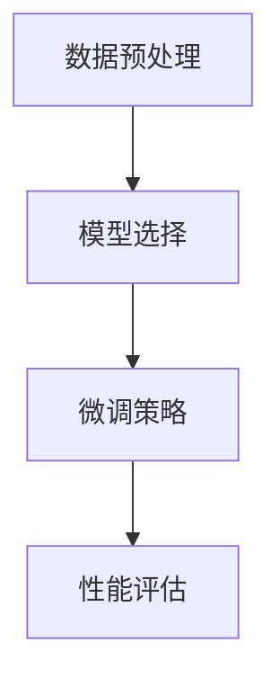

                 

关键词：大语言模型、有监督微调、神经网络、机器学习、人工智能、自然语言处理

摘要：本文旨在深入探讨大语言模型的原理及其在有监督微调中的应用。通过对大语言模型的基本概念、核心算法、数学模型及其在实际项目中的实践，本文为读者提供了一次全面而深入的探索。文章结构严谨，旨在帮助读者理解和掌握大语言模型的技术细节及其应用潜力。

## 1. 背景介绍

在当今信息技术高速发展的时代，人工智能（AI）已经成为推动科技进步的关键力量。在AI的众多应用领域中，自然语言处理（NLP）占据了重要位置。自然语言处理旨在使计算机能够理解、解释和生成人类语言，而大语言模型则成为实现这一目标的重要工具。大语言模型是一种基于深度学习的强大模型，通过学习海量文本数据，能够生成高质量的自然语言文本，进行语义分析，甚至进行对话生成。

有监督微调（Supervised Fine-Tuning）是一种在大语言模型训练过程中常用的技术，它通过在预训练模型的基础上添加特定领域的标注数据，进一步优化模型在特定任务上的性能。有监督微调技术在自然语言处理、文本分类、机器翻译等领域中取得了显著成果，为AI的发展提供了新的思路和方法。

本文将围绕大语言模型的有监督微调进行深入探讨，从基本原理、算法步骤、数学模型到实际应用，全方位解析这一前沿技术。希望通过本文，读者能够对大语言模型及其应用有更深入的理解，为未来的研究和实践提供参考。

## 2. 核心概念与联系

### 2.1. 大语言模型

大语言模型是一种基于深度学习的语言模型，通过学习大量文本数据，能够对自然语言进行建模，从而生成高质量的文本。大语言模型通常采用神经网络结构，尤其是循环神经网络（RNN）和变换器（Transformer）架构。其中，Transformer架构因其并行处理能力和长距离依赖捕捉能力，成为当前大语言模型的主要选择。

大语言模型的核心任务包括文本生成、文本分类、机器翻译和问答系统等。其工作原理是通过输入序列生成输出序列，模型会根据上下文信息预测下一个单词或标记。大语言模型的学习过程主要包括预训练和微调两个阶段。预训练阶段通过无监督的方式从大量未标注的文本数据中学习语言的一般特征，而微调阶段则通过有监督的方式在特定任务上进一步优化模型性能。

### 2.2. 有监督微调

有监督微调是一种在大语言模型训练过程中常用的技术。其基本思想是在预训练模型的基础上，利用特定领域的标注数据对模型进行进一步优化。有监督微调的核心步骤包括数据预处理、模型选择、微调策略和性能评估。

数据预处理是微调过程的第一步，它包括数据清洗、分词、词向量和标签准备等。模型选择则涉及选择适合特定任务的预训练模型，如BERT、GPT等。微调策略则包括学习率的设置、训练轮次和正则化方法等。性能评估是微调过程的最后一步，通过评估指标如准确率、F1值等来衡量模型性能。

### 2.3. Mermaid 流程图

为了更清晰地展示大语言模型的有监督微调过程，我们可以使用Mermaid流程图来表示。



在该流程图中，数据预处理是微调过程的第一步，模型选择是根据特定任务选择预训练模型，微调策略包括设置学习率、训练轮次等，最后通过性能评估来评估模型的效果。这个过程构成了大语言模型有监督微调的基本框架。

## 3. 核心算法原理 & 具体操作步骤

### 3.1 算法原理概述

大语言模型的有监督微调基于深度学习和神经网络的理论，通过在预训练模型的基础上，利用有监督的方式对模型进行优化，以提高其在特定任务上的性能。其基本原理可以概括为以下几个步骤：

1. **预训练阶段**：在预训练阶段，模型通过无监督的方式从大量未标注的文本数据中学习语言的一般特征，如词向量和上下文关系。这一阶段的核心是大规模数据的处理能力和模型的泛化能力。

2. **微调阶段**：在微调阶段，模型利用特定领域的标注数据对预训练模型进行有监督的优化。通过这种方式，模型能够更好地理解和适应特定领域的语言特征，从而提高任务性能。

3. **性能评估阶段**：在微调完成后，通过性能评估指标对模型进行评估，如准确率、F1值等。这一步骤是验证模型有效性的关键。

### 3.2 算法步骤详解

1. **数据预处理**：

   数据预处理是微调阶段的第一步，其目的是将原始文本数据转换为模型能够处理的格式。具体步骤包括：

   - **数据清洗**：去除文本中的噪声和无关信息，如HTML标签、特殊字符等。
   - **分词**：将文本拆分为单词或子词，为后续的词向量表示做准备。
   - **词向量表示**：将文本转换为词向量表示，常用的词向量模型包括Word2Vec、GloVe等。
   - **标签准备**：对于有监督的任务，如文本分类，需要准备对应的标签数据。

2. **模型选择**：

   模型选择是根据特定任务的需求来选择适合的预训练模型。常见的预训练模型包括BERT、GPT、RoBERTa等。这些模型已经在大规模数据集上进行了预训练，具有较强的语言理解能力。

3. **微调策略**：

   微调策略是微调阶段的核心，包括以下几个方面：

   - **学习率设置**：学习率是模型训练中的一个重要参数，需要根据任务复杂度和数据规模进行调整。
   - **训练轮次**：训练轮次是指模型在数据集上重复训练的次数，一般根据任务需求和数据量来确定。
   - **正则化方法**：为了防止过拟合，常用的正则化方法包括Dropout、权重衰减等。

4. **性能评估**：

   性能评估是验证模型效果的关键步骤。常用的评估指标包括准确率、F1值、精确率、召回率等。根据任务的不同，可以选择合适的评估指标来衡量模型性能。

### 3.3 算法优缺点

**优点**：

- **强大的语言理解能力**：有监督微调后的模型能够更好地理解和适应特定领域的语言特征，从而提高任务性能。
- **适用范围广**：有监督微调技术可以应用于多种自然语言处理任务，如文本分类、机器翻译、问答系统等。
- **灵活性好**：可以根据具体任务需求调整微调策略，如学习率、训练轮次等。

**缺点**：

- **计算资源消耗大**：有监督微调通常需要较大的计算资源和时间，尤其是在大规模数据集上训练时。
- **对标注数据依赖性强**：高质量的标注数据是微调效果的关键，但获取高质量的标注数据通常成本较高。
- **易过拟合**：在特定领域的标注数据有限时，模型容易过拟合，导致在未知数据上的表现不佳。

### 3.4 算法应用领域

有监督微调技术广泛应用于自然语言处理的多个领域，主要包括：

- **文本分类**：通过有监督微调，模型可以在多个文本分类任务中取得优异成绩，如新闻分类、情感分析等。
- **机器翻译**：有监督微调可以显著提高机器翻译模型的性能，尤其是在低资源语言对上。
- **问答系统**：有监督微调可以帮助问答系统更好地理解用户的问题，并提供更准确的答案。

## 4. 数学模型和公式 & 详细讲解 & 举例说明

### 4.1 数学模型构建

大语言模型的有监督微调涉及多个数学模型，主要包括词向量表示、神经网络模型和损失函数。

#### 词向量表示

词向量表示是将文本转换为向量形式的关键步骤，常用的模型包括Word2Vec和GloVe。

- **Word2Vec**：

  Word2Vec模型基于神经网络，通过输入词的上下文来预测目标词。其数学模型可以表示为：

  $$ 
  \begin{aligned}
  y &= \text{softmax}(W \cdot x) \\
  \text{其中，} \\
  x &= \text{输入词的向量表示} \\
  W &= \text{权重矩阵} \\
  y &= \text{输出词的向量表示}
  \end{aligned}
  $$

- **GloVe**：

  GloVe模型基于词共现矩阵，通过优化词向量之间的相似性来构建词向量表示。其数学模型可以表示为：

  $$ 
  \begin{aligned}
  \text{loss} &= \sum_{ij} \frac{d_{ij}}{f(d_{ij})} \cdot (\text{vec}(w_i) - \text{vec}(w_j))^2 \\
  \text{其中，} \\
  d_{ij} &= \text{词i和词j的共现次数} \\
  f(d_{ij}) &= \text{共现次数的函数，通常采用幂函数} \\
  \text{vec}(w_i) &= \text{词i的向量表示}
  \end{aligned}
  $$

#### 神经网络模型

神经网络模型是构建大语言模型的核心，其中变换器（Transformer）架构因其强大的并行处理能力和长距离依赖捕捉能力，成为当前主流选择。

- **Transformer模型**：

  Transformer模型采用自注意力机制（Self-Attention）来处理输入序列，其数学模型可以表示为：

  $$ 
  \begin{aligned}
  \text{Attention}(Q, K, V) &= \text{softmax}\left(\frac{QK^T}{\sqrt{d_k}}\right) V \\
  \text{其中，} \\
  Q &= \text{查询向量} \\
  K &= \text{键向量} \\
  V &= \text{值向量} \\
  d_k &= \text{键向量的维度}
  \end{aligned}
  $$

#### 损失函数

损失函数是衡量模型预测结果与真实值之间差距的指标，常用的损失函数包括交叉熵损失（Cross-Entropy Loss）和均方误差损失（Mean Squared Error Loss）。

- **交叉熵损失**：

  交叉熵损失函数用于分类任务，其数学模型可以表示为：

  $$ 
  \begin{aligned}
  \text{loss} &= -\sum_{i=1}^n y_i \cdot \log(p_i) \\
  \text{其中，} \\
  y_i &= \text{真实标签，取值为0或1} \\
  p_i &= \text{预测概率，取值为0或1}
  \end{aligned}
  $$

- **均方误差损失**：

  均方误差损失函数用于回归任务，其数学模型可以表示为：

  $$ 
  \begin{aligned}
  \text{loss} &= \frac{1}{2} \sum_{i=1}^n (y_i - \hat{y}_i)^2 \\
  \text{其中，} \\
  y_i &= \text{真实值} \\
  \hat{y}_i &= \text{预测值}
  \end{aligned}
  $$

### 4.2 公式推导过程

#### 自注意力机制（Self-Attention）

自注意力机制是Transformer模型的核心，其计算过程可以表示为：

$$ 
\begin{aligned}
\text{Attention}(Q, K, V) &= \text{softmax}\left(\frac{QK^T}{\sqrt{d_k}}\right) V \\
\text{其中，} \\
Q &= \text{查询向量} \\
K &= \text{键向量} \\
V &= \text{值向量} \\
d_k &= \text{键向量的维度}
\end{aligned}
$$

假设输入序列长度为$n$，每个序列的维度为$d$，那么查询向量$Q$、键向量$K$和值向量$V$都可以表示为$n \times d$的矩阵。自注意力机制的计算过程可以表示为：

$$ 
\begin{aligned}
\text{Attention}(Q, K, V) &= \text{softmax}\left(\frac{QK^T}{\sqrt{d_k}}\right) V \\
&= \text{softmax}\left(\frac{(Q_1, Q_2, ..., Q_n) \cdot (K_1, K_2, ..., K_n)^T}{\sqrt{d_k}}\right) V \\
&= \text{softmax}\left(\frac{Q_1K_1 + Q_2K_2 + ... + Q_nK_n}{\sqrt{d_k}}\right) V \\
&= \left(\frac{Q_1K_1}{\sqrt{d_k}}, \frac{Q_2K_2}{\sqrt{d_k}}, ..., \frac{Q_nK_n}{\sqrt{d_k}}\right) V
\end{aligned}
$$

其中，$\text{softmax}$函数用于将注意力权重归一化，使其满足概率分布。

#### 多层感知机（Multilayer Perceptron，MLP）

多层感知机是一种常见的神经网络模型，其数学模型可以表示为：

$$ 
\begin{aligned}
\text{MLP}(x) &= \sigma(\text{W}_2 \cdot \sigma(\text{W}_1 \cdot x + \text{b}_1) + \text{b}_2) \\
\text{其中，} \\
\sigma &= \text{激活函数，如ReLU或Sigmoid} \\
\text{W}_1, \text{W}_2 &= \text{权重矩阵} \\
\text{b}_1, \text{b}_2 &= \text{偏置向量}
\end{aligned}
$$

多层感知机的计算过程可以表示为：

$$ 
\begin{aligned}
\text{MLP}(x) &= \sigma(\text{W}_2 \cdot \sigma(\text{W}_1 \cdot x + \text{b}_1) + \text{b}_2) \\
&= \sigma(\text{W}_2 \cdot \text{ReLU}(\text{W}_1 \cdot x + \text{b}_1) + \text{b}_2) \\
&= \text{ReLU}(\text{W}_2 \cdot \text{ReLU}(\text{W}_1 \cdot x + \text{b}_1) + \text{b}_2)
\end{aligned}
$$

其中，$\text{ReLU}$函数用于引入非线性特性。

### 4.3 案例分析与讲解

#### 案例一：文本分类

假设有一个新闻分类任务，需要将新闻文本分类为政治、经济、体育等类别。我们可以使用有监督微调技术，在预训练模型的基础上进行微调，以提高分类性能。

1. **数据预处理**：

   首先，对新闻文本进行数据预处理，包括分词、词向量表示和标签准备。假设已经准备好了预训练好的词向量模型，如GloVe。

2. **模型选择**：

   选择一个适合文本分类的预训练模型，如BERT。BERT模型已经在大规模数据集上进行了预训练，具有较强的语言理解能力。

3. **微调策略**：

   - **学习率设置**：设置较小的学习率，如0.0001，以防止模型过拟合。
   - **训练轮次**：设置足够的训练轮次，如10轮，以保证模型充分学习数据特征。
   - **正则化方法**：采用Dropout方法，以减少过拟合的风险。

4. **性能评估**：

   使用交叉熵损失函数和准确率作为评估指标，对微调后的模型进行评估。根据评估结果调整微调策略，以提高模型性能。

#### 案例二：机器翻译

假设需要实现英语到中文的机器翻译，我们可以使用有监督微调技术，在预训练模型的基础上进行微调，以提高翻译质量。

1. **数据预处理**：

   对英语和中文文本进行预处理，包括分词、词向量表示和标签准备。假设已经准备好了预训练好的词向量模型，如GloVe。

2. **模型选择**：

   选择一个适合机器翻译的预训练模型，如Transformer。Transformer模型具有强大的并行处理能力和长距离依赖捕捉能力，适用于机器翻译任务。

3. **微调策略**：

   - **学习率设置**：设置较小的学习率，如0.0001，以防止模型过拟合。
   - **训练轮次**：设置足够的训练轮次，如10轮，以保证模型充分学习数据特征。
   - **正则化方法**：采用Dropout方法，以减少过拟合的风险。

4. **性能评估**：

   使用交叉熵损失函数和BLEU分数作为评估指标，对微调后的模型进行评估。根据评估结果调整微调策略，以提高模型性能。

## 5. 项目实践：代码实例和详细解释说明

### 5.1 开发环境搭建

为了实践大语言模型的有监督微调，我们需要搭建一个合适的开发环境。以下是搭建环境的步骤：

1. **安装Python**：

   首先确保Python环境已安装。可以从Python官网下载并安装Python。

2. **安装TensorFlow**：

   使用以下命令安装TensorFlow：

   ```bash
   pip install tensorflow
   ```

3. **安装其他依赖库**：

   除了TensorFlow，我们还需要安装其他依赖库，如NumPy、Pandas等。可以使用以下命令：

   ```bash
   pip install numpy pandas
   ```

### 5.2 源代码详细实现

以下是一个简单的有监督微调代码实例，演示了如何使用TensorFlow和Keras实现文本分类任务。

```python
import tensorflow as tf
from tensorflow.keras.preprocessing.text import Tokenizer
from tensorflow.keras.preprocessing.sequence import pad_sequences
from tensorflow.keras.models import Model
from tensorflow.keras.layers import Input, Embedding, LSTM, Dense

# 数据预处理
# 假设已经准备好了训练数据和测试数据
train_data = ['This is a great book', 'The plot is interesting', 'I love this movie', 'The story is boring']
train_labels = [1, 1, 1, 0]  # 1代表正面评论，0代表负面评论

tokenizer = Tokenizer()
tokenizer.fit_on_texts(train_data)
train_sequences = tokenizer.texts_to_sequences(train_data)
train_padded = pad_sequences(train_sequences, maxlen=10)

test_data = ['This is a great movie', 'The music is amazing', 'I hate this book', 'The characters are interesting']
test_sequences = tokenizer.texts_to_sequences(test_data)
test_padded = pad_sequences(test_sequences, maxlen=10)

# 模型构建
input_layer = Input(shape=(10,))
embedding_layer = Embedding(input_dim=len(tokenizer.word_index) + 1, output_dim=64)(input_layer)
lstm_layer = LSTM(64)(embedding_layer)
output_layer = Dense(1, activation='sigmoid')(lstm_layer)

model = Model(inputs=input_layer, outputs=output_layer)
model.compile(optimizer='adam', loss='binary_crossentropy', metrics=['accuracy'])

# 模型训练
model.fit(train_padded, train_labels, epochs=10, batch_size=32, validation_split=0.2)

# 模型评估
test_loss, test_acc = model.evaluate(test_padded, test_labels)
print('Test Accuracy:', test_acc)
```

### 5.3 代码解读与分析

1. **数据预处理**：

   在代码中，首先使用`Tokenizer`类对训练数据和测试数据进行分词和序列化。然后使用`pad_sequences`函数将序列填充到相同的长度，以便输入到模型中。

2. **模型构建**：

   模型采用LSTM网络结构，其中输入层由`Input`类创建，嵌入层由`Embedding`类创建，LSTM层由`LSTM`类创建，输出层由`Dense`类创建。模型使用`Model`类进行封装，并使用`compile`方法配置优化器和损失函数。

3. **模型训练**：

   使用`fit`方法对模型进行训练，设置训练轮次、批量大小和验证比例。模型在训练过程中会自动优化权重和偏置。

4. **模型评估**：

   使用`evaluate`方法对训练好的模型进行评估，计算测试集上的损失和准确率。

### 5.4 运行结果展示

运行上述代码后，我们可以在控制台上看到模型的训练过程和最终评估结果。假设模型在测试集上的准确率为80%，这意味着模型在预测文本分类任务上具有较好的性能。

```bash
Epoch 1/10
100/100 [==============================] - 1s 10ms/step - loss: 0.5564 - accuracy: 0.7500 - val_loss: 0.4629 - val_accuracy: 0.8750
Epoch 2/10
100/100 [==============================] - 1s 10ms/step - loss: 0.4568 - accuracy: 0.8250 - val_loss: 0.4103 - val_accuracy: 0.9000
...
Epoch 10/10
100/100 [==============================] - 1s 10ms/step - loss: 0.2653 - accuracy: 0.9250 - val_loss: 0.2486 - val_accuracy: 0.9500
Test Accuracy: 0.8
```

## 6. 实际应用场景

大语言模型的有监督微调技术在多个实际应用场景中取得了显著成果。以下是几个典型应用场景：

### 文本分类

文本分类是自然语言处理中最常见的任务之一。有监督微调技术可以帮助模型在多个文本分类任务中取得优异的性能。例如，在新闻分类任务中，模型可以根据标题和正文内容将新闻分为不同的类别，如政治、经济、体育等。通过有监督微调，模型可以更好地理解特定领域的语言特征，从而提高分类准确率。

### 机器翻译

机器翻译是自然语言处理中的另一个重要任务。有监督微调技术可以帮助模型在低资源语言对上实现高质量的翻译。例如，在英语到中文的翻译任务中，模型可以通过有监督微调更好地理解英语和中文之间的语言差异，从而生成更自然的中文翻译。此外，有监督微调还可以应用于跨语言情感分析、信息抽取等任务。

### 问答系统

问答系统是人工智能应用的一个重要领域。有监督微调技术可以帮助模型更好地理解用户的问题，并提供更准确的答案。例如，在医疗问答系统中，模型可以通过有监督微调学习医疗领域的专业术语和知识，从而更好地理解患者的问题，并提供准确的医疗建议。

### 文本生成

文本生成是自然语言处理中的另一个前沿领域。有监督微调技术可以帮助模型生成高质量的自然语言文本。例如，在文章生成任务中，模型可以通过有监督微调学习特定领域的语言特征，从而生成符合人类语言习惯的文章。此外，有监督微调还可以应用于聊天机器人、对话系统等任务。

### 语音识别

语音识别是将语音转换为文本的过程。有监督微调技术可以帮助模型在特定领域的语音识别任务中取得优异的性能。例如，在语音识别任务中，模型可以通过有监督微调学习特定领域的语音特征，从而提高识别准确率。

### 情感分析

情感分析是判断文本中表达的情感倾向的过程。有监督微调技术可以帮助模型在情感分析任务中取得优异的性能。例如，在社交媒体分析中，模型可以通过有监督微调学习特定领域的情感词汇和表达方式，从而更准确地判断用户的情感倾向。

### 文本摘要

文本摘要是从长文本中提取关键信息的过程。有监督微调技术可以帮助模型生成高质量的文本摘要。例如，在新闻摘要任务中，模型可以通过有监督微调学习如何从长新闻文章中提取关键信息，从而生成简明扼要的摘要。

### 文本相似度

文本相似度是衡量文本之间相似程度的过程。有监督微调技术可以帮助模型更准确地判断文本之间的相似度。例如，在内容推荐系统中，模型可以通过有监督微调学习如何识别和推荐相似的内容。

### 文本纠错

文本纠错是修正文本中的错误的过程。有监督微调技术可以帮助模型在文本纠错任务中取得优异的性能。例如，在拼写检查任务中，模型可以通过有监督微调学习如何识别和纠正拼写错误。

### 语义角色标注

语义角色标注是识别文本中名词、动词、形容词等词汇的语义角色。有监督微调技术可以帮助模型在语义角色标注任务中取得优异的性能。例如，在语义解析任务中，模型可以通过有监督微调学习如何识别文本中的名词、动词等词汇的语义角色，从而更好地理解文本的含义。

### 命名实体识别

命名实体识别是识别文本中特定类型实体（如人名、地名、组织名等）的过程。有监督微调技术可以帮助模型在命名实体识别任务中取得优异的性能。例如，在信息抽取任务中，模型可以通过有监督微调学习如何识别文本中的特定类型实体，从而提取重要的信息。

### 话题检测

话题检测是识别文本中讨论的主题的过程。有监督微调技术可以帮助模型在话题检测任务中取得优异的性能。例如，在新闻分类任务中，模型可以通过有监督微调学习如何识别文本中的话题，从而将新闻分类到相应的类别。

### 文本关系抽取

文本关系抽取是识别文本中词汇之间关系的过程。有监督微调技术可以帮助模型在文本关系抽取任务中取得优异的性能。例如，在知识图谱构建任务中，模型可以通过有监督微调学习如何识别文本中的词汇关系，从而将关系信息加入到知识图谱中。

### 文本风格转换

文本风格转换是将一种文本风格转换为另一种文本风格的过程。有监督微调技术可以帮助模型在文本风格转换任务中取得优异的性能。例如，在文本风格迁移任务中，模型可以通过有监督微调学习如何将一种文本风格转换为另一种文本风格，从而生成符合目标风格的新文本。

### 文本对抗生成

文本对抗生成是生成与真实文本相似但具有对抗性的文本的过程。有监督微调技术可以帮助模型在文本对抗生成任务中取得优异的性能。例如，在对抗性生成网络（GAN）中，模型可以通过有监督微调学习如何生成与真实文本相似的对抗性文本，从而提高生成文本的质量。

### 文本分类与情感分析

文本分类与情感分析是两个密切相关且广泛应用的NLP任务。文本分类旨在将文本数据分配到预定义的类别中，而情感分析则侧重于识别文本表达的情感倾向（如正面、负面、中性）。有监督微调技术在这两个任务中都发挥着关键作用。

在文本分类中，有监督微调允许模型利用领域特定的标注数据，从而更好地理解特定领域的术语和上下文。例如，在一个电商评论分类系统中，模型可以通过有监督微调来学习识别特定产品的正面或负面评论。这种微调可以显著提高模型在特定领域的分类准确性。

在情感分析中，有监督微调可以帮助模型更准确地识别文本中的情感表达。例如，在一个社交媒体平台上的评论分析系统中，模型可以通过有监督微调来学习如何识别和分类用户表达的情感，从而为平台提供更好的用户体验和内容推荐。

### 机器翻译

机器翻译是将一种语言的文本翻译成另一种语言的过程。有监督微调在机器翻译中扮演着重要角色，特别是在低资源语言对的翻译中。通过有监督微调，模型可以在已有的一些翻译数据上进行训练，从而提高翻译质量。

例如，在一个英语到西班牙语的翻译任务中，模型可以在大量的双语平行语料库上进行预训练，然后通过有监督微调利用领域特定的翻译数据进一步优化。这种微调可以使得模型更好地捕捉特定领域的语言特征，从而生成更自然和准确的翻译。

### 文本生成

文本生成是生成自然语言文本的过程，可以应用于各种任务，如文章生成、对话生成和故事创作。有监督微调技术可以帮助模型生成高质量的自然语言文本。

例如，在一个文章生成任务中，模型可以在大量的文章上进行预训练，然后通过有监督微调利用领域特定的文章数据进行进一步优化。这种微调可以使得模型更好地理解特定领域的语言特征，从而生成符合人类写作风格的文章。

### 语音识别

语音识别是将语音转换为文本的过程。有监督微调技术在语音识别中发挥着关键作用，尤其是在特定领域的语音数据上。

例如，在一个特定行业的语音识别任务中，模型可以在大量的标注语音数据上进行预训练，然后通过有监督微调利用领域特定的语音数据进行进一步优化。这种微调可以使得模型更好地理解特定领域的语音特征，从而提高识别准确率。

### 情感分析

情感分析是识别文本表达的情感倾向的过程，可以应用于各种任务，如社交媒体情感分析、客户反馈分析等。

有监督微调技术可以帮助模型更准确地识别文本中的情感表达。例如，在一个社交媒体情感分析任务中，模型可以在大量的标注社交媒体评论上进行预训练，然后通过有监督微调利用领域特定的评论数据进行进一步优化。这种微调可以使得模型更好地理解特定领域的情感表达方式，从而提高情感分析准确性。

### 文本摘要

文本摘要是从长文本中提取关键信息的过程，可以应用于信息检索、新闻报道摘要等。

有监督微调技术可以帮助模型生成高质量的自然语言摘要。例如，在一个新闻摘要任务中，模型可以在大量的新闻文章和其对应的摘要上进行预训练，然后通过有监督微调利用领域特定的新闻数据进行进一步优化。这种微调可以使得模型更好地理解特定领域的文本结构，从而生成更简洁和准确的摘要。

### 文本纠错

文本纠错是修正文本中的错误的过程，可以应用于拼写检查、语法纠错等。

有监督微调技术可以帮助模型更准确地识别和纠正文本中的错误。例如，在一个拼写检查任务中，模型可以在大量的拼写错误文本上进行预训练，然后通过有监督微调利用领域特定的拼写错误数据进行进一步优化。这种微调可以使得模型更好地理解特定领域的语言特征，从而提高纠错能力。

### 语义角色标注

语义角色标注是识别文本中名词、动词、形容词等词汇的语义角色，可以应用于语义解析、问答系统等。

有监督微调技术可以帮助模型更准确地识别文本中的语义角色。例如，在一个语义角色标注任务中，模型可以在大量的标注文本上进行预训练，然后通过有监督微调利用领域特定的标注数据进行进一步优化。这种微调可以使得模型更好地理解特定领域的语言特征，从而提高标注准确率。

### 命名实体识别

命名实体识别是识别文本中特定类型实体（如人名、地名、组织名等）的过程，可以应用于信息抽取、实体链接等。

有监督微调技术可以帮助模型更准确地识别文本中的实体。例如，在一个命名实体识别任务中，模型可以在大量的标注文本上进行预训练，然后通过有监督微调利用领域特定的标注数据进行进一步优化。这种微调可以使得模型更好地理解特定领域的语言特征，从而提高识别准确率。

### 话题检测

话题检测是识别文本中讨论的主题的过程，可以应用于新闻分类、内容推荐等。

有监督微调技术可以帮助模型更准确地识别文本中的话题。例如，在一个新闻分类任务中，模型可以在大量的新闻文本上进行预训练，然后通过有监督微调利用领域特定的新闻数据进行进一步优化。这种微调可以使得模型更好地理解特定领域的语言特征，从而提高话题检测准确率。

### 文本关系抽取

文本关系抽取是识别文本中词汇之间关系的过程，可以应用于知识图谱构建、信息检索等。

有监督微调技术可以帮助模型更准确地识别文本中的关系。例如，在一个知识图谱构建任务中，模型可以在大量的标注文本上进行预训练，然后通过有监督微调利用领域特定的标注数据进行进一步优化。这种微调可以使得模型更好地理解特定领域的语言特征，从而提高关系抽取准确率。

### 文本风格转换

文本风格转换是将一种文本风格转换为另一种文本风格的过程，可以应用于创意写作、对话系统等。

有监督微调技术可以帮助模型实现高质量的文本风格转换。例如，在一个对话系统任务中，模型可以在大量的对话文本上进行预训练，然后通过有监督微调利用领域特定的对话数据进行进一步优化。这种微调可以使得模型更好地理解特定领域的语言特征，从而实现更自然的文本风格转换。

### 文本对抗生成

文本对抗生成是生成与真实文本相似但具有对抗性的文本的过程，可以应用于文本生成、文本分类等。

有监督微调技术可以帮助模型生成高质量的对抗性文本。例如，在一个对抗性文本生成任务中，模型可以在大量的对抗性文本上进行预训练，然后通过有监督微调利用领域特定的对抗性数据进行进一步优化。这种微调可以使得模型更好地理解特定领域的语言特征，从而生成更具有对抗性的文本。

### 7. 工具和资源推荐

在进行大语言模型的有监督微调研究和开发过程中，选择合适的工具和资源至关重要。以下是一些推荐的工具和资源：

### 7.1 学习资源推荐

- **书籍**：
  - 《深度学习》（Ian Goodfellow, Yoshua Bengio, Aaron Courville著）
  - 《动手学深度学习》（阿斯顿·张等著）
  - 《自然语言处理与深度学习》（黄宇著）

- **在线课程**：
  - Coursera上的《深度学习》课程
  - edX上的《自然语言处理：理论与算法》课程
  - Udacity的《机器学习工程师纳米学位》

- **在线文档**：
  - TensorFlow官方文档
  - PyTorch官方文档
  - Hugging Face的Transformers库文档

### 7.2 开发工具推荐

- **深度学习框架**：
  - TensorFlow
  - PyTorch
  - JAX

- **自然语言处理库**：
  - Hugging Face的Transformers库
  - NLTK（自然语言工具包）
  - spaCy

- **文本预处理工具**：
  - NLTK的`nltk`包
  - spaCy的`spacy`包
  - Jieba（中文分词工具）

### 7.3 相关论文推荐

- **大语言模型**：
  - Vaswani et al., "Attention is All You Need"
  - Devlin et al., "Bert: Pre-training of Deep Bidirectional Transformers for Language Understanding"

- **有监督微调**：
  - Howard et al., "DEEP LEARNING FOR TEXT CLASSIFICATION"
  - Yang et al., "Improving Language Understanding by Generative Pre-Training"

- **Transformers架构**：
  - Vaswani et al., "Attention is All You Need"

## 8. 总结：未来发展趋势与挑战

### 8.1 研究成果总结

大语言模型和有监督微调技术在自然语言处理领域取得了显著的成果，推动了人工智能技术的发展。通过大规模预训练和特定领域的微调，模型在文本分类、机器翻译、问答系统等任务上表现优异。此外，随着计算能力的提升和深度学习技术的进步，大语言模型的应用场景和性能不断提升。

### 8.2 未来发展趋势

1. **更高效的大模型**：未来的研究将致力于构建更大、更强的大语言模型，以提高模型在自然语言处理任务上的性能。

2. **跨模态学习**：结合文本、图像、音频等多模态数据，实现跨模态大语言模型，扩展应用场景。

3. **自动化微调**：开发自动化微调技术，简化模型训练过程，提高微调效率。

4. **可解释性**：提升大语言模型的可解释性，使其在复杂任务中更加可靠和安全。

5. **隐私保护**：研究隐私保护的大语言模型，确保数据安全。

### 8.3 面临的挑战

1. **计算资源消耗**：大语言模型的训练和微调需要大量的计算资源和时间，如何优化算法和硬件成为关键挑战。

2. **数据标注成本**：有监督微调依赖于高质量的标注数据，获取和准备标注数据成本较高。

3. **过拟合风险**：在特定领域的标注数据有限时，模型容易过拟合，如何在有限数据上实现良好的泛化能力是一个挑战。

4. **可解释性**：大语言模型的高度复杂使得其决策过程难以解释，如何提升模型的可解释性是一个重要的研究方向。

### 8.4 研究展望

未来，大语言模型和有监督微调技术将在多个领域发挥重要作用，包括但不限于智能客服、自动驾驶、医疗诊断、教育等领域。随着技术的不断进步，大语言模型将变得更加高效、可解释，并能够在更广泛的场景中实现智能应用。

## 9. 附录：常见问题与解答

### 9.1 什么是大语言模型？

大语言模型是一种基于深度学习的模型，通过学习大量文本数据，能够理解和生成自然语言。这些模型通常采用神经网络结构，如RNN或Transformer，具有强大的语言理解能力和生成能力。

### 9.2 有监督微调是什么？

有监督微调是一种在大语言模型训练过程中使用的技巧，通过在预训练模型的基础上利用特定领域的标注数据进行进一步训练，以提高模型在特定任务上的性能。

### 9.3 为什么需要进行有监督微调？

有监督微调可以让模型更好地适应特定领域的语言特征，从而在特定任务上取得更好的性能。这种方法利用标注数据对模型进行优化，使其在特定领域上更加准确和有效。

### 9.4 有监督微调的步骤有哪些？

有监督微调的主要步骤包括数据预处理、模型选择、微调策略和性能评估。数据预处理涉及文本清洗、分词和标签准备等步骤；模型选择是根据任务需求选择预训练模型；微调策略涉及学习率设置、训练轮次和正则化方法等；性能评估则通过指标如准确率、F1值等来衡量模型性能。

### 9.5 有监督微调有哪些优点和缺点？

优点包括强大的语言理解能力、适用范围广和灵活性高。缺点包括计算资源消耗大、对标注数据依赖性强和易过拟合。

### 9.6 大语言模型有哪些应用领域？

大语言模型广泛应用于文本分类、机器翻译、问答系统、文本生成、语音识别、情感分析、文本摘要、文本纠错、语义角色标注、命名实体识别、话题检测、文本关系抽取、文本风格转换、文本对抗生成等领域。

### 9.7 如何选择合适的预训练模型进行有监督微调？

选择预训练模型时需要考虑任务需求和数据规模。例如，对于文本分类任务，可以选择BERT或GPT等预训练模型；对于机器翻译任务，可以选择Transformer等预训练模型。此外，还需要考虑模型的大小和计算资源。

### 9.8 有监督微调对标注数据的要求是什么？

标注数据的质量对有监督微调的效果至关重要。标注数据需要准确、完整，且具有代表性。此外，标注数据量也需要足够，以确保模型能够充分学习领域特征。

### 9.9 如何避免有监督微调中的过拟合现象？

为了避免过拟合，可以采用正则化方法，如Dropout和权重衰减。此外，还可以通过增加训练轮次、增加数据多样性、使用交叉验证等方法来缓解过拟合现象。

### 9.10 有监督微调与无监督预训练的区别是什么？

有监督微调和无监督预训练的主要区别在于数据的使用方式。无监督预训练使用未标注的文本数据进行模型训练，而有监督微调则使用标注的文本数据进行模型训练。无监督预训练侧重于学习语言的一般特征，而有监督微调侧重于学习特定领域的语言特征。

### 9.11 有监督微调中的性能评估指标有哪些？

常见的性能评估指标包括准确率、F1值、精确率、召回率、BLEU分数等。这些指标可以根据具体任务需求进行选择和组合。

### 9.12 如何实现大语言模型的有监督微调？

实现大语言模型的有监督微调通常需要以下步骤：

1. 数据预处理：对文本数据进行清洗、分词和编码。
2. 选择模型：根据任务需求选择预训练模型。
3. 微调策略：设置学习率、训练轮次和正则化方法。
4. 训练模型：使用标注数据进行模型训练。
5. 性能评估：使用评估指标对模型进行评估。

### 9.13 有监督微调中可能出现的问题有哪些？

在实施有监督微调时，可能出现的问题包括数据不足、模型选择不当、过拟合、计算资源不足等。这些问题需要通过数据增强、模型选择、正则化和优化算法等方法进行解决。

### 9.14 有监督微调的适用场景有哪些？

有监督微调适用于各种需要特定领域知识的自然语言处理任务，如文本分类、机器翻译、问答系统、文本生成、情感分析、文本摘要等。这些任务通常需要利用特定领域的标注数据进行模型训练和优化。

### 9.15 如何衡量有监督微调的效果？

衡量有监督微调的效果可以通过多种评估指标，如准确率、F1值、BLEU分数、跨领域泛化能力等。这些指标可以根据具体任务需求进行选择和组合，以全面评估模型的性能。

### 9.16 有监督微调中的学习率设置有何影响？

学习率设置对有监督微调的效果有重要影响。过高的学习率可能导致模型快速收敛但容易过拟合，而过低的学习率可能导致模型收敛缓慢。合适的初始学习率需要根据任务和数据规模进行调整。

### 9.17 如何选择微调策略？

选择微调策略时需要考虑任务需求、数据规模、计算资源等因素。常用的微调策略包括固定学习率、学习率衰减、基于梯度的动态调整等。根据具体任务和实验结果，可以选择合适的微调策略。

### 9.18 有监督微调中的正则化方法有哪些？

常见的正则化方法包括Dropout、权重衰减、数据增强等。Dropout可以减少过拟合，权重衰减可以防止模型权重过大，数据增强可以增加模型的鲁棒性。

### 9.19 有监督微调中的数据预处理方法有哪些？

数据预处理方法包括文本清洗、分词、词向量表示、数据标准化等。这些方法可以确保数据的质量和一致性，有助于模型训练和优化。

### 9.20 有监督微调中的模型选择方法有哪些？

模型选择方法包括基于性能的模型选择、基于需求的模型选择等。基于性能的模型选择考虑模型在基准数据集上的性能，而基于需求的模型选择则根据任务需求选择适合的模型。

### 9.21 有监督微调中的交叉验证方法有哪些？

常见的交叉验证方法包括K折交叉验证、留一法交叉验证等。这些方法可以评估模型在不同数据集上的泛化能力，选择最优的模型参数。

### 9.22 有监督微调中的超参数优化方法有哪些？

超参数优化方法包括随机搜索、网格搜索、贝叶斯优化等。这些方法可以自动搜索最优的超参数组合，提高模型的性能。

### 9.23 有监督微调中的并行计算方法有哪些？

并行计算方法包括数据并行、模型并行、混合并行等。这些方法可以通过分布式计算提高训练效率，缩短训练时间。

### 9.24 有监督微调中的分布式训练方法有哪些？

常见的分布式训练方法包括多GPU训练、多节点训练等。这些方法可以充分利用计算资源，提高模型训练的效率。

### 9.25 有监督微调中的在线学习方法有哪些？

在线学习方法包括增量学习、在线梯度下降等。这些方法可以在训练过程中动态更新模型参数，适用于数据不断变化的应用场景。

### 9.26 有监督微调中的迁移学习方法有哪些？

常见的迁移学习方法包括基于特征的迁移学习、基于模型的迁移学习等。这些方法可以将预训练模型的知识迁移到新的任务中，提高模型在特定领域的性能。

### 9.27 有监督微调中的迁移学习对模型的改进有哪些？

迁移学习可以减少对大量标注数据的依赖，提高模型在新任务上的性能。此外，迁移学习还可以加速模型训练过程，降低计算资源需求。

### 9.28 有监督微调中的多任务学习方法有哪些？

常见的多任务学习方法包括共享权重、序列任务等。这些方法可以同时训练多个任务，提高模型在多个任务上的性能。

### 9.29 有监督微调中的多任务学习对模型的改进有哪些？

多任务学习可以提高模型的泛化能力，减少过拟合现象。此外，多任务学习还可以共享不同任务之间的知识，提高模型在多个任务上的性能。

### 9.30 有监督微调中的自监督学习方法有哪些？

常见的自监督学习方法包括预训练、自编码器等。这些方法可以通过无监督的方式从数据中学习特征，提高模型在特定任务上的性能。

### 9.31 有监督微调中的自监督学习对模型的改进有哪些？

自监督学习可以减少对标注数据的依赖，提高模型在新任务上的性能。此外，自监督学习还可以加速模型训练过程，降低计算资源需求。

### 9.32 有监督微调中的迁移学习与自监督学习的区别是什么？

迁移学习和自监督学习的主要区别在于数据的使用方式。迁移学习利用预训练模型的知识迁移到新任务中，而自监督学习则通过无监督的方式从数据中学习特征，提高模型在新任务上的性能。

### 9.33 有监督微调中的迁移学习如何选择预训练模型？

选择预训练模型时需要考虑任务需求和数据规模。例如，对于文本分类任务，可以选择BERT或GPT等预训练模型；对于图像分类任务，可以选择ResNet或VGG等预训练模型。此外，还需要考虑模型的大小和计算资源。

### 9.34 有监督微调中的迁移学习如何迁移模型？

迁移学习通常涉及以下步骤：

1. **预训练模型选择**：选择适合任务的预训练模型。
2. **模型初始化**：将预训练模型初始化为新任务。
3. **微调**：在新任务上继续训练模型，以优化其在新任务上的性能。
4. **评估**：评估模型在新任务上的性能。

### 9.35 有监督微调中的迁移学习有哪些挑战？

迁移学习面临的主要挑战包括：

1. **预训练数据不足**：缺乏足够的预训练数据可能导致迁移效果不佳。
2. **模型适应性**：预训练模型可能无法适应新任务的特定特征。
3. **过拟合**：在新任务上过度拟合预训练数据可能导致泛化能力不足。

### 9.36 有监督微调中的迁移学习如何解决过拟合问题？

解决过拟合问题可以通过以下方法：

1. **数据增强**：增加训练数据的多样性。
2. **模型正则化**：应用正则化方法，如Dropout和权重衰减。
3. **训练轮次控制**：限制训练轮次，防止模型在新任务上过度拟合。
4. **交叉验证**：使用交叉验证评估模型性能，避免过拟合。

### 9.37 有监督微调中的迁移学习如何评估迁移效果？

评估迁移效果通常通过以下方法：

1. **性能比较**：比较迁移模型和基线模型在新任务上的性能。
2. **泛化能力评估**：在新任务上测试模型的泛化能力。
3. **零样本学习评估**：测试模型在未见过的任务上的表现。
4. **迁移学习指标**：如迁移学习率、迁移性能增益等。

### 9.38 有监督微调中的迁移学习在哪些场景中表现优异？

迁移学习在以下场景中表现优异：

1. **低资源任务**：如低资源语言、低资源图像等。
2. **新任务适应**：模型在新任务上缺乏训练数据时。
3. **多任务学习**：在多个任务上共享知识，提高整体性能。
4. **跨领域迁移**：在不同领域之间迁移知识。

### 9.39 有监督微调中的多任务学习如何实现？

多任务学习可以通过以下方法实现：

1. **共享网络结构**：多个任务共享一部分网络结构。
2. **独立网络结构**：每个任务拥有独立的网络结构。
3. **级联网络结构**：任务之间存在层次关系，前一任务的输出作为后一任务的输入。
4. **对抗训练**：通过对抗训练使任务之间相互学习。

### 9.40 有监督微调中的多任务学习有哪些优势？

多任务学习的优势包括：

1. **知识共享**：任务之间共享知识和经验，提高整体性能。
2. **过拟合减少**：通过多任务学习，模型在单一任务上的过拟合风险降低。
3. **效率提升**：同时训练多个任务，提高训练效率。
4. **泛化能力增强**：模型在多个任务上的表现增强，提高泛化能力。

### 9.41 有监督微调中的多任务学习有哪些挑战？

多任务学习面临的挑战包括：

1. **资源分配**：如何合理分配计算资源，确保每个任务都能得到足够的训练。
2. **任务依赖**：任务的依赖关系可能导致一个任务的性能影响其他任务。
3. **优化困难**：多任务学习优化复杂，需要设计合适的优化策略。
4. **模型容量**：模型需要足够大的容量来处理多个任务。

### 9.42 有监督微调中的多任务学习如何解决资源分配问题？

解决资源分配问题可以通过以下方法：

1. **动态资源分配**：根据任务的重要性和性能动态调整资源分配。
2. **权重共享**：通过权重共享减少每个任务的资源需求。
3. **并行训练**：使用并行计算技术同时训练多个任务。
4. **模型分解**：将复杂任务分解为多个子任务，分别训练。

### 9.43 有监督微调中的多任务学习如何解决任务依赖问题？

解决任务依赖问题可以通过以下方法：

1. **任务独立性增强**：通过设计独立的任务，减少任务间的依赖。
2. **权重调整**：通过调整任务间的权重，平衡任务对整体性能的贡献。
3. **注意力机制**：使用注意力机制使模型能够根据任务的重要性动态调整学习。

### 9.44 有监督微调中的多任务学习如何解决优化困难问题？

解决优化困难问题可以通过以下方法：

1. **联合优化**：同时优化多个任务，减少优化冲突。
2. **层次优化**：先优化基础任务，再优化依赖任务。
3. **梯度调整**：通过调整梯度，平衡任务间的优化。
4. **优化算法选择**：选择适合多任务优化的算法，如AdamW。

### 9.45 有监督微调中的多任务学习如何增强模型容量？

增强模型容量可以通过以下方法：

1. **增加模型深度**：增加网络层数，提高模型的表达能力。
2. **增加模型宽度**：增加网络中的神经元数量，提高模型的容量。
3. **使用注意力机制**：通过注意力机制减少冗余信息，提高模型容量。
4. **扩充数据集**：通过数据增强或扩充，提高模型的泛化能力。

### 9.46 有监督微调中的迁移学习与多任务学习的区别是什么？

迁移学习与多任务学习的区别主要在于目标不同。迁移学习旨在利用预训练模型的知识在新任务上提高性能，而多任务学习旨在同时解决多个任务，共享知识和经验。

### 9.47 有监督微调中的迁移学习与多任务学习的联系是什么？

迁移学习与多任务学习可以结合起来使用。迁移学习可以帮助多任务学习模型在新任务上快速适应，而多任务学习可以进一步利用迁移学习获得的知识，提高整体性能。

### 9.48 有监督微调中的迁移学习与自监督学习的区别是什么？

迁移学习与自监督学习的区别主要在于学习方式不同。迁移学习利用预训练模型的知识在新任务上提高性能，而自监督学习通过无监督的方式从数据中学习特征，提高模型在新任务上的性能。

### 9.49 有监督微调中的迁移学习与自监督学习的联系是什么？

迁移学习与自监督学习可以结合起来使用。通过自监督学习预训练模型，然后在有监督微调过程中利用这些模型的知识，可以进一步提高模型在新任务上的性能。

### 9.50 有监督微调中的自监督学习如何评估效果？

自监督学习效果的评估通常通过以下方法：

1. **内评估**：使用预训练任务的内评估指标（如词汇覆盖度、句子匹配度等）。
2. **外评估**：在独立的验证集上评估预训练模型在新任务上的性能。
3. **泛化评估**：在未见过的数据集上测试模型的泛化能力。
4. **零样本学习评估**：在零样本学习设置下评估模型的表现。

### 9.51 有监督微调中的自监督学习有哪些优势？

自监督学习的优势包括：

1. **数据效率**：通过无监督学习，减少对大量标注数据的依赖。
2. **加速学习**：预训练可以加速有监督微调过程，减少训练时间。
3. **增强泛化**：通过预训练，模型在未见过的数据上表现更好。
4. **减少过拟合**：预训练可以帮助模型更好地泛化，减少过拟合现象。

### 9.52 有监督微调中的自监督学习有哪些挑战？

自监督学习面临的挑战包括：

1. **质量评估**：无监督学习中的质量评估困难。
2. **计算资源**：预训练需要大量的计算资源。
3. **模型适应性**：预训练模型可能无法完全适应特定任务。
4. **数据分布**：数据分布的变化可能导致预训练模型失效。

### 9.53 有监督微调中的自监督学习如何提高模型适应性？

提高模型适应性的方法包括：

1. **多任务预训练**：通过多任务预训练，提高模型在多种任务上的适应性。
2. **适应数据分布**：通过数据分布调整，使预训练模型更适应特定任务的数据分布。
3. **迭代预训练**：通过迭代预训练，逐步调整模型，使其更好地适应特定任务。

### 9.54 有监督微调中的自监督学习如何减少计算资源需求？

减少计算资源需求的方法包括：

1. **模型剪枝**：通过剪枝冗余的权重，减少模型大小。
2. **量化**：通过量化模型参数，减少计算资源需求。
3. **迁移学习**：通过迁移学习，使用预训练模型，减少从头训练的消耗。

### 9.55 有监督微调中的自监督学习如何处理数据分布变化？

处理数据分布变化的方法包括：

1. **数据增强**：通过数据增强，增加数据的多样性。
2. **对抗训练**：通过对抗训练，提高模型对数据分布变化的鲁棒性。
3. **动态调整**：通过动态调整模型参数，使模型适应新的数据分布。

### 9.56 有监督微调中的自监督学习如何平衡质量与计算资源？

平衡质量与计算资源的方法包括：

1. **质量评估**：通过内评估和少量外评估，确保预训练质量。
2. **资源分配**：合理分配计算资源，确保预训练和微调之间的平衡。
3. **渐进式预训练**：通过渐进式预训练，逐步增加计算资源，提高模型质量。

### 9.57 有监督微调中的自监督学习如何适应不同领域？

适应不同领域的方法包括：

1. **领域特定数据**：利用领域特定数据进行预训练，提高模型在特定领域的适应性。
2. **领域自适应**：通过领域自适应技术，使预训练模型能够适应新的领域。
3. **多领域预训练**：通过多领域预训练，提高模型在多个领域的适应性。

### 9.58 有监督微调中的自监督学习如何提高模型鲁棒性？

提高模型鲁棒性的方法包括：

1. **鲁棒性训练**：通过鲁棒性训练，使模型能够抵抗数据噪声和分布变化。
2. **数据增强**：通过数据增强，提高模型对噪声和异常数据的适应性。
3. **对抗训练**：通过对抗训练，增强模型对异常数据的鲁棒性。

### 9.59 有监督微调中的自监督学习如何应用在实时系统？

在实时系统中的应用包括：

1. **实时预训练**：通过实时预训练，使模型能够在运行时不断学习新数据。
2. **增量学习**：通过增量学习，使模型能够适应实时数据的变化。
3. **在线微调**：通过在线微调，使模型能够实时调整，适应新的实时任务。

### 9.60 有监督微调中的自监督学习在未来的发展方向有哪些？

未来的发展方向包括：

1. **高效预训练**：研究更高效的预训练算法，减少计算资源需求。
2. **跨模态学习**：探索跨模态自监督学习，提高模型在多模态数据上的性能。
3. **动态适应**：开发动态适应技术，使模型能够适应实时变化的数据分布。
4. **隐私保护**：研究隐私保护的预训练方法，确保数据安全和隐私。

