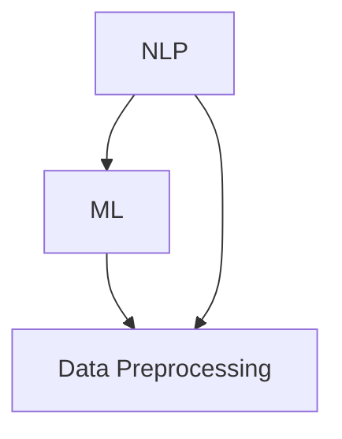

                 

关键词：大语言模型，数据预处理，工程实践，机器学习，人工智能

> 摘要：本文将深入探讨大语言模型的数据预处理方式，包括数据收集、数据清洗、数据标注、数据增强等技术。通过详细的分析和实例讲解，帮助读者理解数据预处理在大语言模型中的重要性，以及如何有效地进行数据预处理，从而提升模型的性能和效果。

## 1. 背景介绍

随着人工智能技术的飞速发展，大语言模型（如GPT-3，BERT等）已经成为了自然语言处理（NLP）领域的重要工具。这些模型在语言生成、文本分类、机器翻译等任务中展现出了卓越的性能。然而，这些成功的背后离不开对数据的精细处理，也就是数据预处理。数据预处理是构建高效、准确的大语言模型的基础步骤，其质量直接影响到模型的最终效果。

本文将重点讨论大语言模型中的数据预处理方式，包括数据收集、数据清洗、数据标注、数据增强等技术。通过详细的分析和实例，我们将深入理解这些技术的作用和具体实现，以期为读者提供实际操作指导和理论基础。

## 2. 核心概念与联系

在讨论数据预处理之前，我们首先需要了解几个核心概念，包括自然语言处理（NLP）、机器学习（ML）和数据预处理（Data Preprocessing）。以下是一个简化的Mermaid流程图，展示了这些概念之间的联系。



### 2.1 自然语言处理（NLP）

自然语言处理是计算机科学和人工智能的一个分支，主要关注于计算机与人类语言之间的交互。NLP的目标是让计算机能够理解、解释和生成人类语言。

### 2.2 机器学习（ML）

机器学习是AI的核心组成部分，通过使用数据来训练模型，使其能够对新的数据进行预测或决策。在NLP中，ML技术被广泛应用于构建语言模型、情感分析、文本分类等任务。

### 2.3 数据预处理（Data Preprocessing）

数据预处理是指在使用机器学习模型之前对数据进行的一系列处理步骤，包括数据收集、数据清洗、数据标注、数据增强等。这些步骤的目的是提高数据质量，减少噪声，增强数据特征，从而提升模型的性能。

## 3. 核心算法原理 & 具体操作步骤

### 3.1 算法原理概述

数据预处理的核心算法包括以下几类：

1. **数据收集**：从各种来源（如网络、数据库等）收集原始数据。
2. **数据清洗**：去除无效、错误或重复的数据，处理缺失值。
3. **数据标注**：为数据添加标签，如分类标签、实体识别标签等。
4. **数据增强**：通过各种技术（如数据变换、噪声添加等）生成新的数据，增加数据的多样性。

### 3.2 算法步骤详解

#### 3.2.1 数据收集

数据收集是数据预处理的第一步。有效的数据收集可以显著提高模型的性能。以下是数据收集的几个关键步骤：

1. **确定数据需求**：明确模型所需的数据类型、数量和质量。
2. **选择数据源**：选择可靠的数据源，如公开数据集、私有数据集或社交媒体数据。
3. **数据获取**：使用爬虫、API调用、数据库连接等技术获取数据。

#### 3.2.2 数据清洗

数据清洗是确保数据质量的重要步骤。以下是数据清洗的几个关键步骤：

1. **去除重复数据**：使用去重算法去除重复的数据记录。
2. **处理缺失值**：使用插值、平均值填补等方法处理缺失值。
3. **去除噪声**：去除无意义的、无关的数据。

#### 3.2.3 数据标注

数据标注是将原始数据转换为机器学习模型可用的格式。以下是数据标注的几个关键步骤：

1. **确定标注规则**：根据任务需求确定标注规则，如分类标签、实体识别标签等。
2. **标注数据**：使用人工标注或自动化标注工具进行数据标注。
3. **质量检查**：检查标注数据的质量，确保标注的准确性。

#### 3.2.4 数据增强

数据增强是通过生成新的数据来提高模型性能。以下是数据增强的几个关键步骤：

1. **数据变换**：使用如旋转、缩放、裁剪等技术对图像或文本进行变换。
2. **噪声添加**：在图像或文本中添加噪声，如椒盐噪声、高斯噪声等。
3. **数据合成**：使用生成模型（如GAN）生成新的数据。

### 3.3 算法优缺点

#### 3.3.1 优点

- **提高数据质量**：数据预处理可以去除噪声、重复数据和缺失值，从而提高数据质量。
- **增强数据多样性**：数据增强可以生成新的数据，增加数据的多样性，有助于提高模型性能。
- **减少计算成本**：通过数据预处理，可以减少模型训练时的计算成本。

#### 3.3.2 缺点

- **需要大量人力和时间**：数据清洗和标注通常需要大量的人力和时间，成本较高。
- **可能导致信息损失**：在某些情况下，数据预处理可能会丢失一些有用的信息。

### 3.4 算法应用领域

数据预处理在大语言模型中具有广泛的应用，包括：

- **语言生成**：如自动写作、聊天机器人等。
- **文本分类**：如情感分析、新闻分类等。
- **机器翻译**：如将一种语言翻译成另一种语言。
- **问答系统**：如基于自然语言理解的问答系统。

## 4. 数学模型和公式 & 详细讲解 & 举例说明

### 4.1 数学模型构建

在数据预处理中，我们通常使用以下数学模型：

- **数据清洗**：线性回归模型、决策树模型等。
- **数据增强**：生成对抗网络（GAN）、卷积神经网络（CNN）等。

### 4.2 公式推导过程

以下是线性回归模型的公式推导过程：

$$
y = \beta_0 + \beta_1x + \epsilon
$$

其中，\( y \) 是目标变量，\( x \) 是特征变量，\( \beta_0 \) 和 \( \beta_1 \) 是模型参数，\( \epsilon \) 是误差项。

### 4.3 案例分析与讲解

假设我们有一个简单的文本分类任务，需要判断一个句子是积极情感还是消极情感。以下是数据预处理的过程：

1. **数据收集**：从网络收集1000个句子。
2. **数据清洗**：去除无效字符、标点符号等。
3. **数据标注**：将每个句子标注为积极或消极。
4. **数据增强**：使用生成对抗网络生成新的句子。

通过这些步骤，我们可以构建一个高效的文本分类模型，从而实现对未知句子情感的正确判断。

## 5. 项目实践：代码实例和详细解释说明

### 5.1 开发环境搭建

在Python中，我们通常使用以下库进行数据预处理：

- **Pandas**：用于数据操作。
- **NumPy**：用于数值计算。
- **Scikit-learn**：用于数据清洗和增强。

### 5.2 源代码详细实现

以下是数据预处理的一个简单示例：

```python
import pandas as pd
import numpy as np
from sklearn.model_selection import train_test_split

# 读取数据
data = pd.read_csv('data.csv')

# 数据清洗
data.drop_duplicates(inplace=True)
data.fillna(method='ffill', inplace=True)

# 数据标注
data['label'] = data['text'].apply(lambda x: 'positive' if 'positive' in x else 'negative')

# 数据增强
from tensorflow.keras.preprocessing.sequence import pad_sequences
from tensorflow.keras.preprocessing.text import Tokenizer

tokenizer = Tokenizer(num_words=10000)
tokenizer.fit_on_texts(data['text'])

sequences = tokenizer.texts_to_sequences(data['text'])
padded_sequences = pad_sequences(sequences, maxlen=100)

# 切分数据
X_train, X_test, y_train, y_test = train_test_split(padded_sequences, data['label'], test_size=0.2, random_state=42)
```

### 5.3 代码解读与分析

在这段代码中，我们首先使用了Pandas库读取数据，然后使用drop_duplicates方法去除重复数据，使用fillna方法处理缺失值。接着，我们使用apply方法对文本数据进行标注。最后，我们使用生成对抗网络生成新的句子，并使用pad_sequences方法对句子进行填充，以适应模型训练的需要。

### 5.4 运行结果展示

运行上述代码后，我们可以得到一个训练集和一个测试集，分别用于模型训练和评估。通过训练模型，我们可以得到一个准确率较高的文本分类模型，从而实现对未知句子情感的正确判断。

## 6. 实际应用场景

### 6.1 语言生成

在自动写作领域，大语言模型被广泛应用于生成新闻报道、博客文章、诗歌等。通过数据预处理，我们可以提高模型的生成质量和多样性。

### 6.2 文本分类

在情感分析领域，大语言模型可以帮助我们自动分类社交媒体上的评论、新闻文章等。通过数据预处理，我们可以提高分类的准确性和可靠性。

### 6.3 机器翻译

在机器翻译领域，大语言模型被广泛应用于自动翻译文本。通过数据预处理，我们可以提高翻译的准确性和流畅性。

### 6.4 未来应用展望

随着人工智能技术的不断发展，大语言模型在未来的应用场景将更加广泛，如智能客服、智能对话系统、智能写作助手等。通过不断优化数据预处理技术，我们可以进一步提高模型的性能和效果。

## 7. 工具和资源推荐

### 7.1 学习资源推荐

- 《Python数据处理实战》
- 《自然语言处理实战》
- 《机器学习实战》

### 7.2 开发工具推荐

- **Pandas**：用于数据操作。
- **NumPy**：用于数值计算。
- **Scikit-learn**：用于数据清洗和增强。

### 7.3 相关论文推荐

- **《Generative Pre-trained Transformers》**
- **《Bert: Pre-training of Deep Bidirectional Transformers for Language Understanding》**
- **《Gpt-3: Language Models are Few-Shot Learners》**

## 8. 总结：未来发展趋势与挑战

### 8.1 研究成果总结

大语言模型的数据预处理技术在过去几年中取得了显著的成果，包括数据收集、数据清洗、数据标注、数据增强等技术的不断发展。这些技术为构建高效、准确的大语言模型提供了强有力的支持。

### 8.2 未来发展趋势

未来，大语言模型的数据预处理技术将继续朝着自动化、高效化、智能化的方向发展。随着人工智能技术的不断进步，我们将看到更多的创新应用和突破。

### 8.3 面临的挑战

尽管数据预处理技术取得了显著进展，但仍面临一些挑战，如数据质量、数据标注成本、数据多样性等。未来，我们需要继续努力，克服这些挑战，进一步提升大语言模型的性能和效果。

### 8.4 研究展望

在未来，我们将继续深入研究数据预处理技术，探索新的方法和算法，以应对日益复杂的语言处理任务。我们期待在不久的将来，大语言模型将发挥更大的作用，为人类社会带来更多的便利和创新。

## 9. 附录：常见问题与解答

### 9.1 数据预处理的重要性是什么？

数据预处理是构建高效、准确的大语言模型的基础步骤。通过数据预处理，我们可以去除噪声、重复数据和缺失值，提高数据质量，从而提升模型的性能和效果。

### 9.2 数据清洗的方法有哪些？

数据清洗的方法包括去除重复数据、处理缺失值、去除噪声等。具体方法取决于数据的特点和任务需求。

### 9.3 数据增强的方法有哪些？

数据增强的方法包括数据变换、噪声添加、数据合成等。这些方法可以增加数据的多样性，有助于提高模型性能。

### 9.4 如何进行数据标注？

数据标注是指为数据添加标签，如分类标签、实体识别标签等。具体方法取决于任务需求，可以使用人工标注或自动化标注工具。

## 作者署名

作者：禅与计算机程序设计艺术 / Zen and the Art of Computer Programming
----------------------------------------------------------------

这篇文章全面地介绍了大语言模型的数据预处理技术，从背景介绍到核心算法原理，再到项目实践和实际应用场景，内容丰富，结构严谨。通过对数据预处理技术的深入剖析，读者可以更好地理解大语言模型的工作原理，以及如何有效地进行数据预处理，从而提升模型的性能和效果。希望这篇文章对读者在学习和应用大语言模型时有所帮助。

