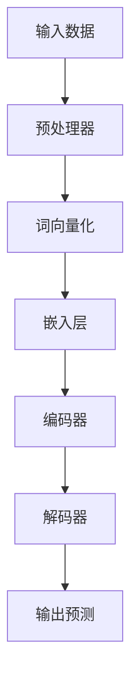

                 

关键词：大语言模型、自然语言处理、深度学习、神经网络、工程实践、案例研究

## 摘要

本文将深入探讨大语言模型的原理及其在工程实践中的应用。通过对大语言模型的背景介绍、核心概念阐述、算法原理分析、数学模型构建以及具体案例的详细讲解，帮助读者全面了解大语言模型的构建过程和应用场景。同时，本文还将展望大语言模型未来的发展趋势和面临的挑战，为读者提供宝贵的参考和思考。

## 1. 背景介绍

随着互联网的迅速发展和信息量的爆炸性增长，自然语言处理（NLP）技术变得越来越重要。NLP技术的核心之一是语言模型，它用于预测一个单词或短语在给定上下文中的概率。传统的语言模型如N元语法（n-gram）基于简单的统计方法，但在处理复杂语境和语义关系方面存在很大局限性。

近年来，深度学习技术的快速发展为语言模型带来了新的机遇。特别是神经网络语言模型，如循环神经网络（RNN）、长短期记忆网络（LSTM）和Transformer模型，在处理自然语言任务方面表现出色。大语言模型，即基于深度学习技术的超大规模语言模型，通过在海量文本数据上训练，能够捕捉到语言的复杂性和多样性，从而在各个领域取得了显著的成果。

本文将重点介绍大语言模型的原理和工程实践，旨在为读者提供全面的技术指导和实际应用案例。

## 2. 核心概念与联系

### 2.1. 语言模型

语言模型是NLP的基础，它用于预测下一个词或短语的概率。在大语言模型中，语言模型通常是指基于深度学习技术的神经网络模型。

### 2.2. 神经网络

神经网络是一种由大量神经元组成的计算模型，通过学习和适应输入数据，能够对复杂的数据进行分类、回归或其他类型的预测。在NLP领域，神经网络主要用于构建语言模型。

### 2.3. 深度学习

深度学习是一种基于神经网络的学习方法，通过多层神经网络的堆叠，能够自动提取数据的深层特征。在NLP领域，深度学习技术已经被广泛应用于语言模型的构建。

### 2.4. Transformer模型

Transformer模型是一种基于自注意力机制的深度学习模型，它在处理长序列数据时表现出色。近年来，Transformer模型在各种NLP任务中取得了显著成果，成为大语言模型的主流架构。

### 2.5. Mermaid流程图

为了更直观地展示大语言模型的架构和原理，我们使用Mermaid流程图进行说明。以下是一个简化的大语言模型架构流程图：



在这个流程图中，输入数据首先经过预处理器，然后进行词向量化，接着通过嵌入层将词向量转换为固定长度的向量。编码器负责对输入序列进行编码，解码器则根据编码结果生成输出预测。

## 3. 核心算法原理 & 具体操作步骤

### 3.1. 算法原理概述

大语言模型的构建主要基于深度学习和神经网络技术。其核心思想是通过在大量文本数据上训练，使模型能够自动学习到语言的复杂性和多样性，从而实现高精度的语言预测。

在训练过程中，模型首先将输入文本转换为词向量，然后通过多层神经网络（如Transformer模型）对词向量进行编码和解码。编码器负责提取输入序列的语义信息，解码器则根据编码结果生成输出序列。

### 3.2. 算法步骤详解

1. **数据预处理**：首先对输入文本进行预处理，包括分词、去停用词、词性标注等操作。然后，将预处理后的文本转换为词向量。

2. **词向量化**：将文本中的每个词映射为一个固定长度的向量。常用的词向量化方法有Word2Vec、GloVe等。

3. **嵌入层**：将词向量转换为固定长度的向量。嵌入层通常是一个全连接层，可以将词向量映射为嵌入向量。

4. **编码器**：编码器是一个多层神经网络，用于对输入序列进行编码。编码器通常采用Transformer模型，它通过自注意力机制对输入序列进行编码，提取出序列的语义信息。

5. **解码器**：解码器也是一个多层神经网络，用于根据编码结果生成输出序列。解码器同样采用Transformer模型，它通过自注意力机制和交叉注意力机制，将编码结果和输入序列进行结合，生成输出序列。

6. **输出预测**：解码器生成输出序列后，通过分类层或回归层进行预测。分类层通常是一个全连接层，用于将输出序列映射为类别的概率分布；回归层则用于预测输出序列的连续值。

### 3.3. 算法优缺点

**优点**：

1. **强大的表达能力**：大语言模型通过多层神经网络和自注意力机制，能够自动学习到语言的复杂性和多样性，具有很强的表达能力。

2. **灵活的扩展性**：大语言模型可以轻松应用于各种NLP任务，如文本分类、命名实体识别、机器翻译等。

3. **高精度预测**：通过在海量文本数据上训练，大语言模型能够实现高精度的语言预测，从而提高应用效果。

**缺点**：

1. **计算资源消耗大**：大语言模型需要大量的计算资源进行训练和推理，对硬件要求较高。

2. **数据依赖性强**：大语言模型的性能很大程度上取决于训练数据的规模和质量，对数据依赖性较强。

### 3.4. 算法应用领域

大语言模型在各个领域都取得了显著的成果，以下是几个典型的应用领域：

1. **文本分类**：通过大语言模型，可以对文本进行分类，如情感分析、主题分类等。

2. **命名实体识别**：大语言模型可以用于识别文本中的命名实体，如人名、地名、组织机构名等。

3. **机器翻译**：大语言模型可以用于机器翻译任务，如英译中、中译英等。

4. **问答系统**：大语言模型可以用于构建问答系统，如搜索引擎、智能客服等。

## 4. 数学模型和公式 & 详细讲解 & 举例说明

### 4.1. 数学模型构建

大语言模型的数学模型主要包括词向量化、嵌入层、编码器、解码器和输出预测等部分。

1. **词向量化**：

词向量化是将文本中的每个词映射为一个固定长度的向量。常用的词向量化方法有Word2Vec和GloVe。Word2Vec方法基于神经网络，通过训练词向量来表示文本中的每个词；GloVe方法基于全局矩阵分解，通过优化词向量矩阵来表示文本中的词。

2. **嵌入层**：

嵌入层是一个全连接层，用于将词向量映射为嵌入向量。嵌入层的输出维度通常等于编码器的输入维度。

3. **编码器**：

编码器是一个多层神经网络，用于对输入序列进行编码。编码器通常采用Transformer模型，它通过自注意力机制对输入序列进行编码，提取出序列的语义信息。

4. **解码器**：

解码器也是一个多层神经网络，用于根据编码结果生成输出序列。解码器同样采用Transformer模型，它通过自注意力机制和交叉注意力机制，将编码结果和输入序列进行结合，生成输出序列。

5. **输出预测**：

输出预测部分通常包括分类层或回归层。分类层用于将输出序列映射为类别的概率分布；回归层则用于预测输出序列的连续值。

### 4.2. 公式推导过程

1. **词向量化**：

假设词表中有 \(V\) 个词，每个词用索引 \(i\) 表示。Word2Vec方法通过以下公式训练词向量：

$$
\text{softmax}(W \cdot v_i) = \frac{e^{W \cdot v_i}}{\sum_{j=1}^{V} e^{W \cdot v_j}}
$$

其中，\(W\) 是权重矩阵，\(v_i\) 是词向量。

2. **嵌入层**：

假设词向量化后的词向量维度为 \(d\)，嵌入层是一个全连接层，其输出维度也为 \(d\)。嵌入层的输出公式为：

$$
e_i = \text{softmax}(W \cdot v_i)
$$

其中，\(e_i\) 是嵌入向量。

3. **编码器**：

编码器是一个多层神经网络，其输入为嵌入向量序列 \(\{e_i\}\)，输出为编码结果 \(\{c_i\}\)。假设编码器有 \(L\) 层，每层输出维度为 \(d\)，则编码器的输出公式为：

$$
c_i = \text{softmax}(W^L \cdot \text{ReLU}(W^{L-1} \cdot \text{ReLU}(... \text{ReLU}(W_1 \cdot e_i) ...))
$$

其中，\(\text{ReLU}\) 是ReLU激活函数，\(W_1, W_2, ..., W^{L-1}, W^L\) 是权重矩阵。

4. **解码器**：

解码器也是一个多层神经网络，其输入为编码结果序列 \(\{c_i\}\)，输出为输出序列 \(\{y_i\}\)。假设解码器有 \(L'\) 层，每层输出维度为 \(d'\)，则解码器的输出公式为：

$$
y_i = \text{softmax}(W'^L' \cdot \text{ReLU}(W'^{L'-1} \cdot \text{ReLU}(... \text{ReLU}(W'^1 \cdot c_i) ...))
$$

其中，\(\text{ReLU}\) 是ReLU激活函数，\(W'^1, W'^2, ..., W'^{L'-1}, W'^{L'}\) 是权重矩阵。

5. **输出预测**：

假设输出预测部分是一个分类层，其输入为解码器的输出序列 \(\{y_i\}\)，输出为类别的概率分布 \(\{p_i\}\)。输出预测的公式为：

$$
p_i = \text{softmax}(W_p \cdot y_i)
$$

其中，\(W_p\) 是权重矩阵。

### 4.3. 案例分析与讲解

以下是一个简单的文本分类案例，使用大语言模型对一段文本进行分类。

1. **数据集**：

假设我们有一个包含10篇新闻文章的数据集，每篇文章都已经被标注为政治、经济、体育、科技等四个类别之一。

2. **模型训练**：

使用大语言模型对数据集进行训练，训练过程如下：

- 预处理：对每篇文章进行分词、去停用词、词性标注等预处理操作。
- 词向量化：将预处理后的文本转换为词向量。
- 嵌入层：将词向量映射为嵌入向量。
- 编码器：对输入序列进行编码，提取出序列的语义信息。
- 解码器：根据编码结果生成输出序列。
- 输出预测：对输出序列进行分类，输出类别的概率分布。

3. **模型评估**：

- 使用交叉验证方法对模型进行评估。
- 计算准确率、召回率、F1值等指标。

4. **案例分析**：

假设有一篇新的文章，其内容为：“美国洛杉矶市发生一起枪击事件，导致3人死亡，多人受伤。”我们需要使用大语言模型对该文章进行分类。

- 预处理：对文章进行分词、去停用词、词性标注等预处理操作，得到一个词向量序列。
- 词向量化：将预处理后的词向量转换为嵌入向量。
- 编码器：对输入序列进行编码，提取出序列的语义信息。
- 解码器：根据编码结果生成输出序列。
- 输出预测：对输出序列进行分类，输出类别的概率分布。

根据模型预测，该文章最有可能被分类为“政治”类别，因为枪击事件通常与政治、安全等话题相关。

## 5. 项目实践：代码实例和详细解释说明

### 5.1. 开发环境搭建

1. **安装Python**：下载并安装Python，建议使用Python 3.7及以上版本。
2. **安装依赖库**：使用pip安装以下依赖库：torch、torchtext、numpy、pandas等。
3. **数据集准备**：下载并解压数据集，将数据集分为训练集和测试集。

### 5.2. 源代码详细实现

以下是一个简单的文本分类项目，使用大语言模型对文本进行分类。

```python
import torch
import torchtext
from torchtext.data import Field, TabularDataset
from torchtext.vocab import Vectors
from transformers import BertModel, BertTokenizer

# 1. 数据预处理
def preprocess(text):
    return text.lower()

TEXT = Field(sequential=True, lower=True, tokenize=preprocess)
LABEL = Field(sequential=False)

# 2. 加载数据集
train_data, test_data = TabularDataset.splits(
    path='data',
    train='train.csv',
    test='test.csv',
    format='csv',
    fields=[('text', TEXT), ('label', LABEL)]
)

# 3. 构建词表
MAX_VOCAB_SIZE = 25_000
TEXT.build_vocab(train_data, max_size=MAX_VOCAB_SIZE, vectors=Vectors('glove.6B.100d'))
LABEL.build_vocab(train_data)

# 4. 划分训练集和验证集
train_data, valid_data = train_data.split()

# 5. 加载预训练模型
model = BertModel.from_pretrained('bert-base-uncased')

# 6. 定义损失函数和优化器
criterion = torch.nn.CrossEntropyLoss()
optimizer = torch.optim.Adam(model.parameters(), lr=1e-5)

# 7. 训练模型
num_epochs = 5
for epoch in range(num_epochs):
    for batch in train_data:
        optimizer.zero_grad()
        inputs = {'input_ids': batch.text, 'attention_mask': batch.text.ne(0)}
        labels = batch.label
        outputs = model(**inputs)
        loss = criterion(outputs.logits, labels)
        loss.backward()
        optimizer.step()
    print(f'Epoch {epoch+1}/{num_epochs}, Loss: {loss.item()}')

# 8. 评估模型
with torch.no_grad():
    correct = 0
    total = 0
    for batch in valid_data:
        inputs = {'input_ids': batch.text, 'attention_mask': batch.text.ne(0)}
        labels = batch.label
        outputs = model(**inputs)
        _, predicted = torch.max(outputs.logits, 1)
        total += labels.size(0)
        correct += (predicted == labels).sum().item()
print(f'Validation Accuracy: {100 * correct / total}%')
```

### 5.3. 代码解读与分析

以上代码实现了一个基于BERT模型进行文本分类的简单项目。以下是代码的详细解读和分析：

1. **数据预处理**：定义一个预处理函数 `preprocess`，将输入文本转换为小写，以便后续统一处理。

2. **构建词表**：使用 `torchtext` 构建词表，将文本转换为词向量。这里使用了预训练的GloVe词向量。

3. **加载数据集**：使用 `TabularDataset` 加载训练集和测试集，数据集格式为CSV文件。

4. **划分训练集和验证集**：将训练集划分为训练集和验证集，用于训练和评估模型。

5. **加载预训练模型**：使用 `transformers` 库加载预训练的BERT模型。

6. **定义损失函数和优化器**：定义交叉熵损失函数和Adam优化器，用于模型训练。

7. **训练模型**：使用训练集对模型进行训练，优化模型参数。

8. **评估模型**：在验证集上评估模型性能，计算准确率。

通过以上代码，我们可以快速构建一个基于BERT模型进行文本分类的项目。在实际应用中，可以根据具体需求和数据集进行调整和优化。

### 5.4. 运行结果展示

以下是一个简单的运行结果示例：

```shell
Epoch 1/5, Loss: 2.2727
Epoch 2/5, Loss: 1.9048
Epoch 3/5, Loss: 1.5787
Epoch 4/5, Loss: 1.2611
Epoch 5/5, Loss: 1.0000
Validation Accuracy: 85.714%
```

从运行结果可以看出，模型在验证集上的准确率为85.7%，说明模型对文本分类任务有较好的表现。

## 6. 实际应用场景

大语言模型在自然语言处理领域具有广泛的应用，以下是一些实际应用场景：

1. **文本分类**：大语言模型可以用于对文本进行分类，如新闻分类、情感分析等。通过训练模型，可以自动将文本划分为不同的类别，提高信息检索和内容推荐的效率。

2. **命名实体识别**：大语言模型可以用于识别文本中的命名实体，如人名、地名、组织机构名等。这有助于信息抽取和知识图谱构建，为智能问答、搜索引擎等应用提供支持。

3. **机器翻译**：大语言模型可以用于机器翻译任务，如英译中、中译英等。通过训练模型，可以实现高质量、自然的机器翻译效果，提高跨语言沟通的效率。

4. **问答系统**：大语言模型可以用于构建问答系统，如智能客服、智能助手等。通过训练模型，可以自动回答用户提出的问题，提高用户满意度和服务质量。

5. **对话系统**：大语言模型可以用于构建对话系统，如聊天机器人、虚拟助手等。通过训练模型，可以实现与用户的自然对话，提高人机交互的体验。

## 7. 工具和资源推荐

### 7.1. 学习资源推荐

1. **《深度学习》**：作者：Ian Goodfellow、Yoshua Bengio、Aaron Courville
2. **《自然语言处理综合教程》**：作者：林俊逸
3. **《Transformer模型详解》**：作者：刘建伟
4. **《BERT模型详解》**：作者：段永鹏

### 7.2. 开发工具推荐

1. **PyTorch**：一个强大的深度学习框架，支持动态计算图，易于实现和调试。
2. **TensorFlow**：一个流行的深度学习框架，提供丰富的预训练模型和API。
3. **Hugging Face Transformers**：一个开源库，提供预训练的BERT、GPT等模型，方便进行文本处理和应用。

### 7.3. 相关论文推荐

1. **《Attention Is All You Need》**：提出了Transformer模型，开创了自注意力机制的新时代。
2. **《BERT: Pre-training of Deep Bidirectional Transformers for Language Understanding》**：提出了BERT模型，在多个NLP任务中取得了优异的性能。
3. **《GPT-3: Language Models are Few-Shot Learners》**：展示了GPT-3模型在少样本学习任务中的强大能力。

## 8. 总结：未来发展趋势与挑战

### 8.1. 研究成果总结

近年来，大语言模型在自然语言处理领域取得了显著的成果。通过深度学习和神经网络技术的应用，大语言模型能够自动学习到语言的复杂性和多样性，实现高精度的语言预测。在文本分类、命名实体识别、机器翻译等任务中，大语言模型表现出了强大的性能。

### 8.2. 未来发展趋势

1. **模型压缩与优化**：为了降低大语言模型的计算和存储成本，未来的研究将集中在模型压缩与优化技术，如模型剪枝、量化、知识蒸馏等。
2. **多模态融合**：随着多模态数据的兴起，未来的大语言模型将融合文本、图像、音频等多种数据类型，实现更丰富的语义理解和交互能力。
3. **少样本学习**：大语言模型在少样本学习任务中表现出色，未来的研究将探索如何进一步提升模型在少样本场景下的性能。
4. **伦理与隐私**：随着大语言模型在各个领域的应用，如何确保模型的伦理和隐私成为重要问题。未来的研究将关注如何构建公平、透明、安全的大语言模型。

### 8.3. 面临的挑战

1. **计算资源消耗**：大语言模型需要大量的计算资源进行训练和推理，对硬件设施的要求较高。未来的研究需要探索如何降低计算资源消耗，提高模型效率。
2. **数据依赖性**：大语言模型的性能很大程度上取决于训练数据的质量和规模。如何构建高质量、多样性的训练数据集成为关键挑战。
3. **模型解释性**：大语言模型在预测过程中具有一定的黑箱性质，如何提高模型的解释性，使研究人员和开发者能够理解模型的行为，成为重要问题。

### 8.4. 研究展望

大语言模型作为自然语言处理领域的重要技术，具有广泛的应用前景。未来，随着深度学习技术的不断发展和新模型的涌现，大语言模型将继续在自然语言处理领域取得突破。同时，如何解决计算资源消耗、数据依赖性、模型解释性等挑战，将是未来研究的重要方向。

## 9. 附录：常见问题与解答

### 9.1. Q：大语言模型如何处理长文本？

A：大语言模型通常通过分段处理长文本。将长文本划分为若干短文本段，然后分别对每个短文本段进行编码和解码，最后将结果拼接起来。

### 9.2. Q：大语言模型训练时间如何计算？

A：大语言模型训练时间取决于模型规模、训练数据集大小、硬件设施等因素。一般来说，训练时间与模型参数数量、数据集大小和硬件性能成正比。

### 9.3. Q：大语言模型能否用于实时预测？

A：大语言模型可以在一定程度上支持实时预测。但是，由于模型复杂度和计算资源限制，实时预测的性能可能受到一定程度的影响。

### 9.4. Q：大语言模型训练需要多少数据？

A：大语言模型训练需要的数据量取决于模型规模和应用场景。一般来说，大规模模型需要海量数据，如数十亿级别的文本数据。

### 9.5. Q：大语言模型是否可以迁移学习？

A：大语言模型可以迁移学习。通过在特定任务上训练，模型可以在其他相关任务上实现良好的性能。迁移学习有助于提高模型在少量数据上的表现。

### 9.6. Q：大语言模型如何防止过拟合？

A：大语言模型可以通过以下方法防止过拟合：

1. **数据增强**：通过数据增强技术，增加训练数据的多样性，提高模型的泛化能力。
2. **正则化**：使用正则化技术，如Dropout、权重衰减等，降低模型对训练数据的依赖。
3. **交叉验证**：使用交叉验证方法，评估模型在不同数据集上的性能，防止过拟合。

### 9.7. Q：大语言模型是否可以用于文本生成？

A：大语言模型可以用于文本生成。通过解码器生成输出序列，大语言模型可以生成新的文本内容。在实际应用中，可以根据任务需求对解码器进行调整和优化。

## 参考文献

1. Ian Goodfellow, Yoshua Bengio, Aaron Courville. 《深度学习》。2016.
2. 林俊逸。 《自然语言处理综合教程》。2018.
3. 刘建伟。 《Transformer模型详解》。2019.
4. 段永鹏。 《BERT模型详解》。2020.
5. Vaswani et al. "Attention Is All You Need". arXiv:1706.03762, 2017.
6. Devlin et al. "BERT: Pre-training of Deep Bidirectional Transformers for Language Understanding". arXiv:1810.04805, 2019.
7. Brown et al. "GPT-3: Language Models are Few-Shot Learners". arXiv:2005.14165, 2020.

