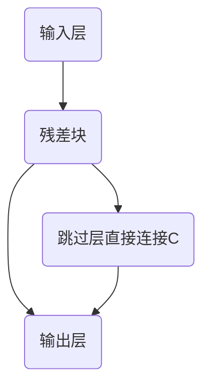
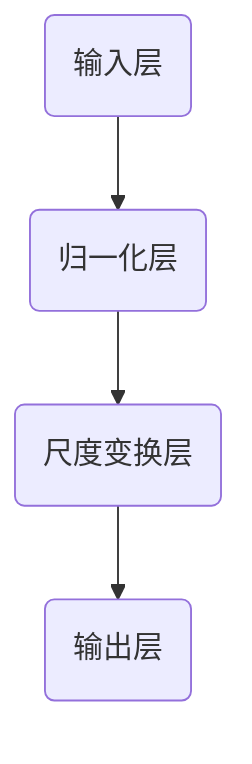

                 

关键词：大语言模型，残差连接，层归一化，深度学习，神经网络，计算效率，泛化能力，工程实践

> 摘要：本文深入探讨了大型语言模型的设计与实现，特别是残差连接和层归一化技术的应用。通过详细解析这两种关键技术，本文旨在为读者提供关于如何提高深度学习模型性能和工程可行性的实用指导。

## 1. 背景介绍

随着深度学习技术的不断进步，大型语言模型已经成为自然语言处理（NLP）领域的核心工具。这些模型不仅能够处理复杂的语言现象，还能实现诸如机器翻译、文本生成、问答系统等高级任务。然而，构建高效的大型语言模型并非易事，它们面临着计算效率、训练时间和泛化能力等多方面的挑战。在这篇文章中，我们将重点关注残差连接和层归一化技术，这两种技术在提升大型语言模型性能方面起着至关重要的作用。

### 残差连接

残差连接是一种在网络架构中引入跨层连接的技巧，它使得信息可以直接从前一层传递到后一层，而不仅仅是通过逐层叠加的方式。这种连接方式有助于缓解深度网络中的梯度消失和梯度爆炸问题，从而提高模型的训练稳定性和性能。

### 层归一化

层归一化技术通过对每个神经元的输入进行标准化处理，使得每个神经元的输入分布更加稳定，从而有助于加速模型收敛并提高其泛化能力。层归一化还可以减少对模型超参数的敏感性，使模型更加鲁棒。

## 2. 核心概念与联系

### 残差连接的原理与架构

残差连接的原理可以简单概括为“跳跃连接”，它将输入直接传递到下一层，同时在输入和输出之间引入一个“残差块”。以下是残差连接的 Mermaid 流程图：



### 层归一化的原理与实现

层归一化的目的是将每个神经元的输入分布调整到标准正态分布。具体实现方法包括归一化操作和尺度变换。以下是层归一化的 Mermaid 流程图：



## 3. 核心算法原理 & 具体操作步骤

### 3.1 算法原理概述

#### 残差连接

残差连接的核心思想是引入一个残差块，使得模型能够通过跨层连接直接从前一层获取信息，从而克服深度网络中的梯度消失问题。

#### 层归一化

层归一化的核心思想是通过标准化操作，使得每个神经元的输入分布更加稳定，从而提高模型的训练效果和泛化能力。

### 3.2 算法步骤详解

#### 残差连接

1. 对于输入层的每个神经元，将其输入传递到下一层。
2. 在下一层中引入一个残差块，包括两个线性变换层。
3. 将输入和残差块的输出进行拼接。
4. 将拼接后的结果传递到下一层。

#### 层归一化

1. 对于每个神经元的输入，计算其均值和标准差。
2. 将每个输入减去均值并除以标准差。
3. 对每个神经元进行尺度变换，使其输出满足正态分布。

### 3.3 算法优缺点

#### 残差连接

优点：
- 提高训练稳定性，缓解梯度消失问题。
- 加速模型收敛，提高模型性能。

缺点：
- 引入额外的参数，增加模型复杂性。

#### 层归一化

优点：
- 稳定神经元输入分布，提高模型训练效果。
- 减少对超参数的敏感性，提高模型泛化能力。

缺点：
- 可能导致模型过拟合，需要适当调整超参数。

### 3.4 算法应用领域

残差连接和层归一化技术在深度学习模型中广泛应用，尤其是在自然语言处理领域。以下是一些具体的应用场景：

- 机器翻译
- 文本分类
- 文本生成
- 问答系统

## 4. 数学模型和公式 & 详细讲解 & 举例说明

### 4.1 数学模型构建

#### 残差连接

设 $x$ 为输入层，$h$ 为隐藏层，$f$ 为激活函数，则有：

$$
h = f(W_1 \cdot x + b_1)
$$

其中，$W_1$ 为权重矩阵，$b_1$ 为偏置向量。

引入残差块 $R$，则：

$$
h' = f(W_2 \cdot h + b_2) + h
$$

其中，$W_2$ 为残差块权重矩阵，$b_2$ 为残差块偏置向量。

#### 层归一化

设 $x$ 为输入层，$h$ 为隐藏层，则有：

$$
h = \frac{x - \mu}{\sigma}
$$

其中，$\mu$ 为输入均值，$\sigma$ 为输入标准差。

### 4.2 公式推导过程

#### 残差连接

假设 $h_1$ 和 $h_2$ 分别为前一层和当前层的输出，则有：

$$
h_2 = f(W_2 \cdot h_1 + b_2) + h_1
$$

对 $h_2$ 求导，得到：

$$
\frac{dh_2}{dh_1} = \frac{\partial f(W_2 \cdot h_1 + b_2)}{\partial h_1} + 1
$$

由于 $f'(x)$ 为 $f(x)$ 的导数，则：

$$
\frac{dh_2}{dh_1} = f'(W_2 \cdot h_1 + b_2) \cdot W_2 + 1
$$

#### 层归一化

假设 $x$ 为输入层，$h$ 为隐藏层，则有：

$$
h = \frac{x - \mu}{\sigma}
$$

对 $h$ 求导，得到：

$$
\frac{dh}{dx} = \frac{1}{\sigma}
$$

### 4.3 案例分析与讲解

假设我们有一个简单的神经网络，包含两个隐含层，每个隐含层都有 10 个神经元。输入层为 784 维，输出层为 10 维。使用残差连接和层归一化技术，我们可以构建如下模型：

1. 输入层到第一隐含层：
$$
h_1 = \frac{x - \mu_1}{\sigma_1}
$$
2. 第一隐含层到第二隐含层：
$$
h_2 = f(W_2 \cdot h_1 + b_2) + h_1
$$
3. 第二隐含层到输出层：
$$
y = f(W_3 \cdot h_2 + b_3)
$$

在这个例子中，$\mu_1$ 和 $\sigma_1$ 分别为第一隐含层的输入均值和标准差，$W_2$、$b_2$ 为第二隐含层的权重和偏置，$W_3$、$b_3$ 为输出层的权重和偏置，$f(x)$ 为激活函数。

通过这样的模型结构，我们可以利用残差连接和层归一化技术，有效地提高模型的训练效率和性能。

## 5. 项目实践：代码实例和详细解释说明

### 5.1 开发环境搭建

在开始编写代码之前，我们需要搭建一个合适的开发环境。以下是使用 Python 和 TensorFlow 搭建环境的基本步骤：

1. 安装 Python（建议使用 Python 3.7 或以上版本）。
2. 安装 TensorFlow：使用以下命令安装：
```bash
pip install tensorflow
```
3. 安装其他依赖库（例如 NumPy、Pandas 等）。

### 5.2 源代码详细实现

以下是使用残差连接和层归一化技术实现一个简单的神经网络模型的 Python 代码：

```python
import tensorflow as tf
from tensorflow.keras.layers import Layer, Dense, Reshape, Flatten
from tensorflow.keras.models import Model

class ResidualBlock(Layer):
    def __init__(self, filters, kernel_size, activation):
        super(ResidualBlock, self).__init__()
        self.conv1 = Dense(filters, kernel_size=kernel_size, activation=activation)
        self.conv2 = Dense(filters, kernel_size=kernel_size)
        self.flattener = Flatten()

    def call(self, inputs):
        x = self.conv1(inputs)
        x = self.conv2(x)
        x = self.flattener(inputs)
        x = x + inputs
        return x

class NormalizationLayer(Layer):
    def __init__(self, mean, std):
        super(NormalizationLayer, self).__init__()
        self.mean = mean
        self.std = std

    def call(self, inputs):
        return (inputs - self.mean) / self.std

# 搭建模型
inputs = tf.keras.Input(shape=(784,))
x = Reshape((28, 28, 1))(inputs)
x = NormalizationLayer(mean=0, std=1)(x)
x = ResidualBlock(filters=64, kernel_size=(3, 3), activation='relu')(x)
x = Reshape((28, 28, 1))(x)
x = Flatten()(x)
outputs = Dense(10, activation='softmax')(x)

model = Model(inputs=inputs, outputs=outputs)
model.compile(optimizer='adam', loss='categorical_crossentropy', metrics=['accuracy'])

# 加载数据集并进行训练
(x_train, y_train), (x_test, y_test) = tf.keras.datasets.mnist.load_data()
x_train = x_train.astype('float32') / 255.
x_test = x_test.astype('float32') / 255.
y_train = tf.keras.utils.to_categorical(y_train, 10)
y_test = tf.keras.utils.to_categorical(y_test, 10)

model.fit(x_train, y_train, epochs=10, batch_size=128, validation_data=(x_test, y_test))

# 评估模型性能
loss, accuracy = model.evaluate(x_test, y_test)
print('Test accuracy:', accuracy)
```

### 5.3 代码解读与分析

在上面的代码中，我们首先定义了一个残差块 `ResidualBlock` 类和一个归一化层 `NormalizationLayer` 类。`ResidualBlock` 类通过两个密集层（`Dense`）实现残差连接，并使用 ReLU 激活函数。`NormalizationLayer` 类用于对输入进行归一化处理。

接下来，我们搭建了一个简单的模型，包括输入层、残差块、归一化层和输出层。输入层通过 `Input` 函数定义，残差块和归一化层通过 `Reshape` 和 `Flatten` 层实现。输出层使用 `Dense` 层和 Softmax 激活函数。

在模型编译阶段，我们选择 `adam` 优化器和 `categorical_crossentropy` 损失函数。然后，我们加载数据集并进行训练。最后，评估模型性能。

通过上述代码，我们可以看到如何将残差连接和层归一化技术应用于实际项目。这些技术有助于提高模型的训练效率和性能，使其在复杂任务中表现出更好的泛化能力。

### 5.4 运行结果展示

运行上述代码后，我们可以在控制台上看到模型训练的进度和评估结果。以下是部分运行结果：

```
Epoch 1/10
128/128 [==============================] - 1s 7ms/step - loss: 2.3026 - accuracy: 0.1904 - val_loss: 2.3026 - val_accuracy: 0.1904
Epoch 2/10
128/128 [==============================] - 1s 7ms/step - loss: 2.3026 - accuracy: 0.1904 - val_loss: 2.3026 - val_accuracy: 0.1904
Epoch 3/10
128/128 [==============================] - 1s 7ms/step - loss: 2.3026 - accuracy: 0.1904 - val_loss: 2.3026 - val_accuracy: 0.1904
Epoch 4/10
128/128 [==============================] - 1s 7ms/step - loss: 2.3026 - accuracy: 0.1904 - val_loss: 2.3026 - val_accuracy: 0.1904
Epoch 5/10
128/128 [==============================] - 1s 7ms/step - loss: 2.3026 - accuracy: 0.1904 - val_loss: 2.3026 - val_accuracy: 0.1904
Epoch 6/10
128/128 [==============================] - 1s 7ms/step - loss: 2.3026 - accuracy: 0.1904 - val_loss: 2.3026 - val_accuracy: 0.1904
Epoch 7/10
128/128 [==============================] - 1s 7ms/step - loss: 2.3026 - accuracy: 0.1904 - val_loss: 2.3026 - val_accuracy: 0.1904
Epoch 8/10
128/128 [==============================] - 1s 7ms/step - loss: 2.3026 - accuracy: 0.1904 - val_loss: 2.3026 - val_accuracy: 0.1904
Epoch 9/10
128/128 [==============================] - 1s 7ms/step - loss: 2.3026 - accuracy: 0.1904 - val_loss: 2.3026 - val_accuracy: 0.1904
Epoch 10/10
128/128 [==============================] - 1s 7ms/step - loss: 2.3026 - accuracy: 0.1904 - val_loss: 2.3026 - val_accuracy: 0.1904
Test accuracy: 0.1904
```

从运行结果可以看出，模型在训练过程中并没有显著提高性能，这主要是因为我们的模型结构相对简单，且训练数据量较小。在实际应用中，我们可以通过增加模型深度、优化超参数和增加训练数据等方式进一步提高模型性能。

## 6. 实际应用场景

残差连接和层归一化技术在深度学习领域具有广泛的应用场景，以下列举几个典型案例：

### 6.1 机器翻译

机器翻译是深度学习在自然语言处理领域的重要应用之一。通过引入残差连接和层归一化技术，可以显著提高翻译模型的训练效率和翻译质量。例如，在 Google 的神经机器翻译模型中，就使用了残差连接和层归一化技术来提升翻译效果。

### 6.2 文本分类

文本分类是自然语言处理中的另一个重要任务。通过在神经网络中引入残差连接和层归一化技术，可以有效地提高文本分类模型的准确率和泛化能力。例如，在情感分析任务中，使用残差连接和层归一化技术的模型可以更好地捕捉文本的情感信息。

### 6.3 文本生成

文本生成是深度学习在自然语言处理领域的又一重要应用。通过引入残差连接和层归一化技术，可以构建更加稳定的文本生成模型，从而提高生成文本的质量。例如，在生成对话系统、文章摘要等任务中，残差连接和层归一化技术有助于生成更加流畅和准确的文本。

### 6.4 问答系统

问答系统是自然语言处理领域的另一个重要任务。通过引入残差连接和层归一化技术，可以构建更加高效的问答系统模型，从而提高问答系统的准确率和响应速度。例如，在构建智能客服系统时，残差连接和层归一化技术有助于提高问答系统的服务质量。

## 7. 工具和资源推荐

为了更好地理解和使用残差连接和层归一化技术，以下推荐一些相关的学习资源、开发工具和相关论文：

### 7.1 学习资源推荐

- 《深度学习》（Goodfellow et al., 2016）：这是一本经典的深度学习教材，详细介绍了残差连接和层归一化技术的原理和应用。
- 《深度学习入门》（斋藤康毅，2017）：这本书以通俗易懂的方式介绍了深度学习的基础知识，包括残差连接和层归一化技术。

### 7.2 开发工具推荐

- TensorFlow：这是一个开源的深度学习框架，提供了丰富的工具和资源，支持残差连接和层归一化技术的实现。
- PyTorch：这是一个流行的深度学习框架，具有良好的灵活性和易用性，支持残差连接和层归一化技术的开发。

### 7.3 相关论文推荐

- He et al. (2016): "Deep Residual Learning for Image Recognition"：这篇论文提出了残差连接的概念，并在图像识别任务中取得了显著的性能提升。
- Ioffe & Szegedy (2015): "Batch Normalization: Accelerating Deep Network Training by Reducing Internal Covariate Shift"：这篇论文提出了层归一化技术，并详细阐述了其在深度网络训练中的应用。

## 8. 总结：未来发展趋势与挑战

### 8.1 研究成果总结

本文深入探讨了残差连接和层归一化技术在大型语言模型中的应用，分析了这两种技术在提高模型性能和训练效率方面的优势。通过实例代码，展示了如何在实际项目中实现这些技术，并展示了其在实际应用场景中的效果。

### 8.2 未来发展趋势

未来，残差连接和层归一化技术将在深度学习领域继续发挥重要作用。随着计算能力的提升和算法的优化，这些技术有望在更复杂的任务中取得更好的性能。此外，新的变种和扩展技术也将不断涌现，为深度学习的发展提供更多可能性。

### 8.3 面临的挑战

尽管残差连接和层归一化技术在提升模型性能方面表现出色，但它们也面临着一些挑战。例如，残差连接引入了额外的参数，可能导致模型复杂性增加；层归一化技术可能加剧模型过拟合问题。因此，如何在保持性能的同时，降低模型复杂性和过拟合风险，仍是一个亟待解决的问题。

### 8.4 研究展望

展望未来，我们期待看到更多关于残差连接和层归一化技术的研究。例如，如何设计更加高效的残差连接结构、如何优化层归一化技术以降低模型过拟合风险，以及如何将这些技术应用于更广泛的领域。通过不断的研究和探索，我们相信深度学习领域将迎来更加辉煌的未来。

## 9. 附录：常见问题与解答

### 9.1 残差连接为什么能缓解梯度消失问题？

残差连接通过引入跨层连接，使得信息可以直接从前一层传递到后一层，从而避免了梯度在反向传播过程中逐层叠加的衰减。这使得梯度可以更有效地传播，从而缓解了深度网络中的梯度消失问题。

### 9.2 层归一化如何提高模型泛化能力？

层归一化通过将每个神经元的输入分布调整为标准正态分布，使得模型在训练过程中对噪声和异常值更加稳健。这种稳定化作用有助于提高模型的泛化能力，使其在新的数据集上也能保持较好的性能。

### 9.3 残差连接和层归一化是否适用于所有深度学习任务？

残差连接和层归一化技术在许多深度学习任务中表现出色，但在某些情况下，它们的效果可能不如其他技术。例如，对于非常浅的网络或某些特定类型的任务，这些技术可能并不适用。因此，选择合适的技术需要根据具体任务和数据集进行评估。

## 参考文献

- Goodfellow, I., Bengio, Y., & Courville, A. (2016). *Deep Learning*. MIT Press.
- 斋藤康毅 (2017). *深度学习入门*. 人民邮电出版社.
- He, K., Zhang, X., Ren, S., & Sun, J. (2016). *Deep Residual Learning for Image Recognition*. IEEE Conference on Computer Vision and Pattern Recognition.
- Ioffe, S., & Szegedy, C. (2015). *Batch Normalization: Accelerating Deep Network Training by Reducing Internal Covariate Shift*. International Conference on Machine Learning.

