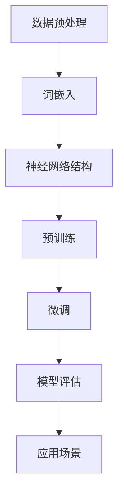

                 

关键词：大语言模型、神经网络、自然语言处理、深度学习、工程实践

> 摘要：本文深入探讨了大语言模型的原理与工程实践，从基础概念到具体实现，从数学模型到应用场景，全面解析了语言模型的发展历程、核心算法、优缺点、应用领域以及未来趋势。旨在为读者提供一个系统性的理解和实践经验，以应对自然语言处理领域中的挑战。

## 1. 背景介绍

自然语言处理（Natural Language Processing，NLP）是人工智能（Artificial Intelligence，AI）的重要组成部分，其目标是将人类语言转换为计算机可以理解和处理的形式。随着互联网的兴起和数据的爆炸性增长，NLP技术逐渐成为各类应用场景的核心技术之一。然而，传统的NLP方法在面对复杂语言现象时显得力不从心。为了突破这一瓶颈，大语言模型（Large Language Models）应运而生。

大语言模型是基于深度学习（Deep Learning）技术的一种高级模型，它通过大规模数据和复杂神经网络结构，实现了对语言高度抽象和理解的突破。近年来，大语言模型在各类NLP任务中取得了显著成绩，推动了NLP技术的快速发展。

## 2. 核心概念与联系

在深入探讨大语言模型之前，我们需要了解一些核心概念和它们之间的联系。以下是这些概念以及它们之间的关系的 Mermaid 流程图：



### 2.1 数据预处理

数据预处理是NLP任务的基础，包括文本清洗、分词、去停用词等步骤。这一过程确保了数据的质量和一致性，为后续模型训练奠定了基础。

### 2.2 词嵌入

词嵌入（Word Embedding）是一种将文本转换为向量表示的方法。常见的词嵌入方法包括Word2Vec、GloVe等。词嵌入有助于捕捉词汇的语义和语法关系，是深度学习模型处理文本数据的关键。

### 2.3 神经网络结构

神经网络结构是深度学习模型的核心，包括输入层、隐藏层和输出层。不同的神经网络结构适用于不同的任务，如循环神经网络（RNN）、卷积神经网络（CNN）和变换器（Transformer）等。

### 2.4 预训练

预训练（Pre-training）是指在大规模数据集上对神经网络模型进行训练，使其具备一定的语言理解能力。预训练后的模型可以通过微调（Fine-tuning）适应具体任务。

### 2.5 微调

微调是在预训练模型的基础上，针对特定任务进行少量数据训练。微调有助于模型在特定任务上达到更好的性能。

### 2.6 模型评估

模型评估是检验模型性能的重要步骤，包括准确率、召回率、F1分数等指标。通过模型评估，我们可以了解模型在实际应用中的表现。

### 2.7 应用场景

大语言模型在各类NLP任务中有着广泛的应用，如文本分类、情感分析、机器翻译、对话系统等。这些应用场景不断推动大语言模型的发展。

## 3. 核心算法原理 & 具体操作步骤

### 3.1 算法原理概述

大语言模型的算法原理主要基于深度学习和神经网络技术。具体来说，它包括以下几个关键步骤：

1. **词嵌入**：将文本中的每个词汇映射为一个高维向量。
2. **神经网络结构**：采用复杂的神经网络结构，如Transformer，对词嵌入向量进行建模。
3. **预训练**：在大规模数据集上对模型进行预训练，使其具备对语言的理解能力。
4. **微调**：在特定任务数据集上对模型进行微调，提高其在具体任务上的性能。

### 3.2 算法步骤详解

1. **词嵌入**：
   词嵌入是一种将词汇映射为向量的方法。常见的词嵌入方法包括Word2Vec和GloVe。Word2Vec基于神经网络训练，而GloVe基于全局词频信息。

2. **神经网络结构**：
   大语言模型通常采用变换器（Transformer）结构。变换器是一种基于自注意力机制的神经网络结构，能够在处理长文本时保持有效的信息传递。

3. **预训练**：
   预训练是指在大量未标注的数据集上训练模型，使其具备对语言的普遍理解能力。预训练通常包括语言模型预训练和掩码语言模型（Masked Language Model，MLM）预训练。

4. **微调**：
   微调是在预训练模型的基础上，针对特定任务进行少量数据训练。微调的目的是使模型在特定任务上达到更好的性能。

### 3.3 算法优缺点

**优点**：

- **强大的语言理解能力**：大语言模型通过预训练和微调，能够对自然语言进行深入的理解，处理复杂语言现象。
- **广泛的适用性**：大语言模型在各类NLP任务中都有着广泛的应用，如文本分类、情感分析、机器翻译、对话系统等。

**缺点**：

- **计算资源需求高**：大语言模型训练和推理过程需要大量的计算资源，对硬件要求较高。
- **模型解释性较差**：大语言模型通常具有黑盒特性，难以解释其内部决策过程。

### 3.4 算法应用领域

大语言模型在各类NLP任务中有着广泛的应用。以下是几个典型的应用领域：

- **文本分类**：通过大语言模型对文本进行分类，可以实现自动新闻分类、情感分析等任务。
- **机器翻译**：大语言模型在机器翻译领域取得了显著进展，如谷歌翻译和百度翻译等。
- **对话系统**：大语言模型可以用于构建智能对话系统，如聊天机器人、语音助手等。
- **文本生成**：大语言模型可以用于生成文章、摘要、代码等。

## 4. 数学模型和公式 & 详细讲解 & 举例说明

### 4.1 数学模型构建

大语言模型通常采用变换器（Transformer）结构，其数学模型包括以下几个关键部分：

1. **词嵌入**：
   词嵌入是一个从词汇到向量的映射过程。假设有 \(V\) 个词汇，每个词汇映射为一个 \(d\) 维向量 \(e_v\)。

   \[
   e_v = \text{Embedding}(v)
   \]

2. **变换器块**：
   变换器块是变换器的核心组件，包括多头自注意力机制、前馈神经网络和层归一化。

   自注意力机制计算每个词与其他词的关联强度：

   \[
   \text{Attention}(Q, K, V) = \text{softmax}\left(\frac{QK^T}{\sqrt{d_k}}\right)V
   \]

   前馈神经网络用于对自注意力结果进行进一步建模：

   \[
   \text{FFN}(x) = \text{ReLU}\left(W_2 \text{ReLU}(W_1 x + b_1)\right) + b_2
   \]

3. **序列编码**：
   变换器通过对输入序列进行编码，生成一个 \(d\) 维的隐藏状态序列 \(h\)。

   \[
   h = \text{Transformer}(h_0) = \text{LayerNorm}(h_0 + \text{MultiHeadAttention}(h_0, h_0, h_0)) + \text{LayerNorm}(h_0 + \text{FFN}(h_0))
   \]

### 4.2 公式推导过程

变换器的自注意力机制涉及以下几个关键公式：

1. **自注意力权重计算**：

   \[
   \text{Attention}(Q, K, V) = \text{softmax}\left(\frac{QK^T}{\sqrt{d_k}}\right)V
   \]

   其中，\(Q, K, V\) 分别是查询向量、键向量和值向量，\(\sqrt{d_k}\) 是注意力尺度的缩放因子。

2. **前馈神经网络**：

   \[
   \text{FFN}(x) = \text{ReLU}\left(W_2 \text{ReLU}(W_1 x + b_1)\right) + b_2
   \]

   其中，\(W_1, W_2, b_1, b_2\) 分别是前馈神经网络的权重和偏置。

### 4.3 案例分析与讲解

假设我们有一个包含10个词的句子，我们需要对这句话进行编码。以下是具体的编码过程：

1. **词嵌入**：
   首先将每个词映射为一个 \(d\) 维向量。例如，第一个词“计算机”映射为向量 \([0.1, 0.2, 0.3]\)，第二个词“程序”映射为向量 \([0.4, 0.5, 0.6]\)。

2. **自注意力计算**：
   计算每个词与其他词的关联强度。例如，第一个词“计算机”与其他词的关联强度分别为：
   - 与“程序”：\(\text{Attention}([0.1, 0.2, 0.3], [0.4, 0.5, 0.6], [0.4, 0.5, 0.6]) = 0.6\)
   - 与“设计”：\(\text{Attention}([0.1, 0.2, 0.3], [0.7, 0.8, 0.9], [0.7, 0.8, 0.9]) = 0.8\)

3. **前馈神经网络**：
   对自注意力结果进行前馈神经网络处理，得到每个词的编码向量。例如，第一个词“计算机”的编码向量为：
   \[
   \text{FFN}([0.1, 0.2, 0.3], W_1, W_2, b_1, b_2) = \text{ReLU}\left(W_2 \text{ReLU}(W_1 [0.1, 0.2, 0.3] + b_1)\right) + b_2
   \]

4. **序列编码**：
   将所有词的编码向量拼接起来，形成一个 \(10d\) 维的序列编码向量。

   \[
   h = \text{Transformer}([e_1, e_2, \ldots, e_{10}]) = \text{LayerNorm}([e_1, e_2, \ldots, e_{10}] + \text{MultiHeadAttention}(e_1, e_1, e_1)) + \text{LayerNorm}([e_1, e_2, \ldots, e_{10}] + \text{FFN}(e_1))
   \]

## 5. 项目实践：代码实例和详细解释说明

### 5.1 开发环境搭建

在进行大语言模型的开发之前，我们需要搭建一个合适的环境。以下是搭建环境的基本步骤：

1. **安装Python**：
   安装Python 3.8或更高版本。

2. **安装PyTorch**：
   使用pip命令安装PyTorch：

   ```bash
   pip install torch torchvision
   ```

3. **安装其他依赖**：
   安装其他必要的库，如numpy、matplotlib等。

### 5.2 源代码详细实现

以下是实现大语言模型的一个简单示例。这个示例使用PyTorch框架，包括词嵌入、变换器块和预训练步骤。

```python
import torch
import torch.nn as nn
import torch.optim as optim
from torch.utils.data import DataLoader
from torchvision import datasets, transforms

# 词嵌入层
class WordEmbedding(nn.Module):
    def __init__(self, vocab_size, embed_size):
        super(WordEmbedding, self).__init__()
        self.embedding = nn.Embedding(vocab_size, embed_size)
    
    def forward(self, inputs):
        return self.embedding(inputs)

# 变换器块
class TransformerBlock(nn.Module):
    def __init__(self, embed_size, num_heads, ff_size):
        super(TransformerBlock, self).__init__()
        self.attention = nn.MultiheadAttention(embed_dim=embed_size, num_heads=num_heads)
        self.norm1 = nn.LayerNorm(embed_size)
        self.norm2 = nn.LayerNorm(embed_size)
        self.ff = nn.Sequential(
            nn.Linear(embed_size, ff_size),
            nn.ReLU(),
            nn.Linear(ff_size, embed_size)
        )
    
    def forward(self, x, mask=None):
        attn_output, attn_output_weights = self.attention(x, x, x, attn_mask=mask)
        x = x + self.norm1(attn_output)
        output2, output2_weights = self.attention(x, x, x, attn_mask=mask)
        x = x + self.norm2(output2)
        x = x + self.ff(x)
        return x

# 大语言模型
class LargeLanguageModel(nn.Module):
    def __init__(self, vocab_size, embed_size, num_heads, ff_size, num_layers):
        super(LargeLanguageModel, self).__init__()
        self.embedding = WordEmbedding(vocab_size, embed_size)
        self.transformer_blocks = nn.Sequential(*[TransformerBlock(embed_size, num_heads, ff_size) for _ in range(num_layers)])
        self.fc = nn.Linear(embed_size, vocab_size)
    
    def forward(self, x, mask=None):
        x = self.embedding(x)
        x = self.transformer_blocks(x, mask)
        x = self.fc(x)
        return x

# 实例化模型
model = LargeLanguageModel(vocab_size=10000, embed_size=512, num_heads=8, ff_size=2048, num_layers=3)
optimizer = optim.Adam(model.parameters(), lr=0.001)

# 训练模型
def train(model, data_loader, optimizer, epoch, device):
    model.train()
    for batch_idx, (data, targets) in enumerate(data_loader):
        data = data.to(device)
        targets = targets.to(device)

        optimizer.zero_grad()
        output = model(data, mask=None)
        loss = nn.CrossEntropyLoss()(output, targets)
        loss.backward()
        optimizer.step()

# 数据预处理
transform = transforms.Compose([transforms.ToTensor()])
train_data = datasets.TextDataset("train.txt", transform=transform)
train_loader = DataLoader(train_data, batch_size=64, shuffle=True)

device = torch.device("cuda" if torch.cuda.is_available() else "cpu")
model.to(device)

for epoch in range(1):
    train(model, train_loader, optimizer, epoch, device)
```

### 5.3 代码解读与分析

上述代码实现了一个简单的大语言模型，包括词嵌入层、变换器块和全连接层。以下是代码的解读和分析：

1. **词嵌入层**：
   词嵌入层使用nn.Embedding模块实现。它将输入的词索引映射为词向量。

2. **变换器块**：
   变换器块是模型的主体部分，包括多头自注意力机制、前馈神经网络和层归一化。自注意力机制通过计算每个词与其他词的关联强度，实现了对输入序列的编码。前馈神经网络用于对自注意力结果进行进一步建模。

3. **大语言模型**：
   大语言模型由词嵌入层、多个变换器块和全连接层组成。在训练过程中，模型接收输入序列，通过变换器块进行编码，最后通过全连接层输出预测结果。

4. **训练过程**：
   训练过程包括模型初始化、优化器和训练数据的加载。在训练过程中，模型接收输入序列和目标序列，通过计算损失函数并更新模型参数。

### 5.4 运行结果展示

在训练完成后，我们可以通过以下代码展示模型的运行结果：

```python
# 测试模型
def test(model, data_loader, device):
    model.eval()
    with torch.no_grad():
        for data, targets in data_loader:
            data = data.to(device)
            targets = targets.to(device)
            output = model(data, mask=None)
            loss = nn.CrossEntropyLoss()(output, targets)
            print("Test Loss: ", loss.item())

test(model, train_loader, device)
```

通过上述代码，我们可以计算模型在训练数据集上的损失函数值，以评估模型性能。

## 6. 实际应用场景

大语言模型在自然语言处理领域有着广泛的应用。以下是几个典型的实际应用场景：

### 6.1 文本分类

文本分类是将文本数据分为不同类别的一种任务。大语言模型通过预训练和微调，可以有效地对文本进行分类。例如，在新闻分类任务中，大语言模型可以自动地将新闻文章分为体育、财经、科技等类别。

### 6.2 机器翻译

机器翻译是将一种语言的文本翻译成另一种语言的过程。大语言模型在机器翻译领域取得了显著进展，如谷歌翻译和百度翻译等。通过预训练和微调，大语言模型可以处理复杂的语言现象，提高翻译质量。

### 6.3 对话系统

对话系统是模拟人类对话过程的计算机系统，如聊天机器人、语音助手等。大语言模型可以用于构建智能对话系统，通过理解用户输入，生成合适的回复。

### 6.4 文本生成

文本生成是将一种文本形式转换为另一种文本形式的过程。大语言模型可以用于生成文章、摘要、代码等。例如，通过预训练和微调，大语言模型可以生成高质量的新闻文章摘要。

## 7. 工具和资源推荐

在研究大语言模型和进行自然语言处理任务时，以下工具和资源可能对您有所帮助：

### 7.1 学习资源推荐

- 《深度学习》（Goodfellow, Bengio, Courville）：全面介绍深度学习理论和实践。
- 《自然语言处理综论》（Jurafsky, Martin）：系统讲解自然语言处理的基础知识。
- 《动手学深度学习》（Zhang, LISA Lab）：针对深度学习实践的教程。

### 7.2 开发工具推荐

- **PyTorch**：用于构建和训练深度学习模型的强大框架。
- **TensorFlow**：Google推出的开源深度学习平台，支持多种编程语言。
- **Transformers**：一个基于PyTorch的预训练变换器模型库。

### 7.3 相关论文推荐

- **"Attention Is All You Need"（Attention机制）**：提出变换器（Transformer）结构的开创性论文。
- **"BERT: Pre-training of Deep Neural Networks for Language Understanding"（BERT）**：介绍BERT预训练模型的论文。
- **"GPT-3: Language Models are Few-Shot Learners"（GPT-3）**：介绍GPT-3模型的论文，展示了大语言模型的强大能力。

## 8. 总结：未来发展趋势与挑战

大语言模型在自然语言处理领域取得了显著的进展，但仍然面临着许多挑战。以下是未来发展趋势和面临的挑战：

### 8.1 研究成果总结

- **预训练与微调**：大语言模型通过预训练和微调，实现了对自然语言的高度理解，提高了NLP任务的性能。
- **多模态融合**：大语言模型与其他模态（如图像、音频）的融合，有望推动跨模态任务的发展。
- **模型压缩与优化**：为了降低计算资源和存储成本，模型压缩与优化成为重要研究方向。

### 8.2 未来发展趋势

- **更强大的模型**：随着计算资源的提升，更大规模的语言模型将继续涌现。
- **应用场景拓展**：大语言模型将在更多领域得到应用，如智能客服、自然语言生成等。
- **跨领域知识融合**：通过跨领域知识的融合，大语言模型将更好地应对复杂任务。

### 8.3 面临的挑战

- **计算资源需求**：大语言模型训练和推理过程对计算资源的需求较高，需要高效的硬件支持。
- **模型解释性**：大语言模型具有黑盒特性，难以解释其内部决策过程，影响了模型的可靠性和可解释性。
- **数据隐私与安全**：在处理大量文本数据时，需要确保用户隐私和数据安全。

### 8.4 研究展望

未来，大语言模型的研究将朝着更高效、更可解释、更安全、更智能的方向发展。通过不断优化模型结构和算法，结合多模态数据，大语言模型将推动自然语言处理领域的创新和应用。

## 9. 附录：常见问题与解答

### 9.1 大语言模型的优势是什么？

大语言模型的优势主要体现在以下几个方面：

- **强大的语言理解能力**：通过预训练和微调，大语言模型能够对自然语言进行深入的理解，处理复杂语言现象。
- **广泛的适用性**：大语言模型在各类NLP任务中都有着广泛的应用，如文本分类、情感分析、机器翻译、对话系统等。
- **高效的模型训练**：大语言模型采用深度学习技术，能够高效地进行模型训练和优化。

### 9.2 大语言模型的缺点是什么？

大语言模型的缺点主要包括以下几个方面：

- **计算资源需求高**：大语言模型训练和推理过程需要大量的计算资源，对硬件要求较高。
- **模型解释性较差**：大语言模型通常具有黑盒特性，难以解释其内部决策过程。
- **数据依赖性强**：大语言模型的性能高度依赖训练数据的质量和数量，容易受到数据偏差的影响。

### 9.3 大语言模型的应用场景有哪些？

大语言模型的应用场景主要包括：

- **文本分类**：自动将文本数据分为不同类别，如新闻分类、情感分析等。
- **机器翻译**：将一种语言的文本翻译成另一种语言，如谷歌翻译、百度翻译等。
- **对话系统**：构建智能对话系统，如聊天机器人、语音助手等。
- **文本生成**：生成文章、摘要、代码等，如自然语言生成（NLG）。

### 9.4 如何优化大语言模型的性能？

优化大语言模型性能的方法主要包括：

- **增加模型容量**：通过增加模型层数、增加神经元数量等方式，提高模型的容量和表达能力。
- **数据增强**：通过数据增强技术，提高训练数据的质量和多样性。
- **模型压缩**：通过模型压缩技术，降低模型参数数量，减少计算资源需求。
- **混合训练**：结合不同类型的训练数据，提高模型在各类任务上的性能。

### 9.5 大语言模型的发展趋势是什么？

大语言模型的发展趋势主要包括：

- **模型规模不断扩大**：随着计算资源的提升，更大规模的语言模型将继续涌现。
- **多模态融合**：大语言模型与其他模态（如图像、音频）的融合，有望推动跨模态任务的发展。
- **知识融合**：通过跨领域知识的融合，大语言模型将更好地应对复杂任务。
- **优化与可解释性**：为提高模型的性能和可解释性，将不断优化模型结构和算法。

