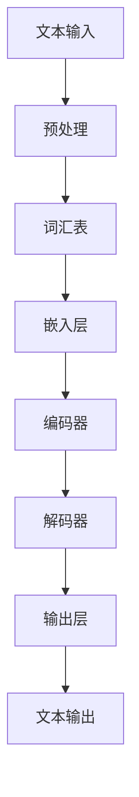

                 

关键词：大语言模型、语言表示、神经网络、机器学习、深度学习、工程实践、模型优化

## 摘要

本文旨在深入探讨大语言模型的原理及其在工程实践中的应用，特别是对语言表示的介绍。通过详细解析大语言模型的核心概念、算法原理、数学模型以及实际应用案例，本文旨在为读者提供一份全面的技术指南，帮助他们更好地理解和运用这一前沿技术。文章将从背景介绍开始，逐步深入到语言表示的核心概念，最后探讨大语言模型在实际开发中的实现和未来发展方向。

## 1. 背景介绍

随着互联网和大数据技术的飞速发展，自然语言处理（NLP）已经成为计算机科学领域中的一个重要分支。大语言模型作为NLP的核心技术之一，近年来取得了显著的进展。大语言模型的核心目标是理解和生成自然语言，使得计算机能够与人类进行更加自然和有效的交流。这一目标的实现不仅依赖于先进的人工智能技术，还需要深入的工程实践和模型优化。

### 1.1 大语言模型的定义

大语言模型是一种利用大量文本数据进行训练的深度学习模型，它能够预测下一个词或句子，从而生成文本。这些模型通常使用神经网络结构，如循环神经网络（RNN）、长短期记忆网络（LSTM）和Transformer等，以处理序列数据。大语言模型的目标是捕捉语言中的统计规律，从而生成流畅和有意义的文本。

### 1.2 大语言模型的发展历程

大语言模型的发展可以追溯到20世纪80年代。当时，研究人员开始使用统计方法来处理语言数据。随着计算机性能的不断提高和大数据技术的发展，大语言模型的性能也得到了显著提升。特别是近年来，深度学习技术的兴起，使得大语言模型的研究和应用得到了进一步的推动。

### 1.3 大语言模型的应用场景

大语言模型在许多领域都有广泛的应用，包括机器翻译、文本生成、情感分析、问答系统等。这些应用不仅提升了计算机处理自然语言的能力，也为许多实际问题提供了有效的解决方案。例如，在机器翻译领域，大语言模型已经能够实现接近人类的翻译质量；在文本生成领域，大语言模型可以生成高质量的文章、新闻、甚至是小说。

## 2. 核心概念与联系

要深入理解大语言模型，我们首先需要了解其核心概念和基本架构。以下是一个简化的Mermaid流程图，用于描述大语言模型的主要组件和它们之间的联系。



### 2.1 文本输入

文本输入是整个大语言模型的起点。它可以是单个单词、短语或完整的句子。文本输入需要经过预处理，包括去除标点符号、单词分词、转化为小写等。

### 2.2 预处理

预处理阶段是文本输入的进一步处理。这一阶段的目的是将原始文本转化为模型可以理解的格式。预处理步骤包括：

- **分词**：将文本分割成单词或短语。
- **词性标注**：为每个词分配词性（如名词、动词等）。
- **停用词过滤**：去除常见的无意义词汇，如“的”、“了”等。
- **词干提取**：将单词转化为词干形式。

### 2.3 词汇表

预处理后的文本需要构建一个词汇表。词汇表是一个包含所有独特词汇的列表，用于将文本转化为模型可以处理的数字表示。每个词汇通常对应一个唯一的整数。

### 2.4 嵌入层

嵌入层是将词汇表中的整数转化为稠密向量的过程。这些向量通常称为“嵌入向量”，它们可以捕获词汇的语义信息。嵌入层是一个线性变换，可以将高维的整数向量映射到低维的稠密向量空间。

### 2.5 编码器

编码器是负责处理输入序列的神经网络组件。在编码过程中，每个词汇的嵌入向量会被映射到一个上下文向量，这个上下文向量可以捕获输入序列中的语义信息。

### 2.6 解码器

解码器是负责生成输出的神经网络组件。它的任务是利用编码器生成的上下文向量，生成下一个词或句子的概率分布。解码器通常使用类似于编码器的神经网络结构。

### 2.7 输出层

输出层是解码器的最后一层，它负责生成最终的文本输出。输出层通常是一个softmax层，用于计算每个词的概率分布。

## 3. 核心算法原理 & 具体操作步骤

### 3.1 算法原理概述

大语言模型的算法原理主要基于深度学习和神经网络。具体来说，大语言模型通过以下步骤实现：

1. **文本输入**：将文本输入预处理，转化为词汇表和嵌入向量。
2. **编码器处理**：编码器对输入序列进行处理，生成上下文向量。
3. **解码器生成输出**：解码器利用上下文向量，生成下一个词或句子的概率分布，并更新上下文向量。
4. **循环迭代**：重复上述步骤，直到生成完整的输出序列。

### 3.2 算法步骤详解

#### 3.2.1 文本输入与预处理

- **分词**：将文本分割成单词或短语。
- **词性标注**：为每个词分配词性。
- **停用词过滤**：去除常见的无意义词汇。
- **词干提取**：将单词转化为词干形式。

#### 3.2.2 嵌入层

- **词汇表构建**：将预处理后的文本构建为一个词汇表。
- **嵌入向量生成**：为每个词汇生成一个嵌入向量。

#### 3.2.3 编码器处理

- **输入序列编码**：将嵌入向量转化为上下文向量。
- **上下文向量更新**：在编码过程中，不断更新上下文向量。

#### 3.2.4 解码器生成输出

- **输出概率分布计算**：解码器利用上下文向量，计算下一个词或句子的概率分布。
- **输出序列生成**：根据概率分布，生成下一个词或句子。
- **上下文向量更新**：更新上下文向量，为下一个输出做准备。

#### 3.2.5 循环迭代

- **重复处理**：重复上述步骤，直到生成完整的输出序列。

### 3.3 算法优缺点

#### 优点：

- **强大的语言理解能力**：大语言模型能够捕捉语言中的复杂规律，从而实现高效的文本处理。
- **灵活的应用场景**：大语言模型可以应用于多种NLP任务，如机器翻译、文本生成等。

#### 缺点：

- **计算资源需求大**：大语言模型通常需要大量的计算资源，包括GPU等高性能硬件。
- **训练时间较长**：大语言模型的训练时间较长，需要耐心等待。

### 3.4 算法应用领域

- **机器翻译**：大语言模型可以用于机器翻译任务，实现高质量的语言转换。
- **文本生成**：大语言模型可以生成高质量的文章、新闻、甚至小说。
- **情感分析**：大语言模型可以用于情感分析，识别文本中的情感倾向。
- **问答系统**：大语言模型可以用于问答系统，提供智能化的问答服务。

## 4. 数学模型和公式 & 详细讲解 & 举例说明

### 4.1 数学模型构建

大语言模型的数学模型主要基于神经网络和深度学习。以下是一个简化的数学模型：

- **输入层**：输入层包含词汇表的嵌入向量。
- **隐藏层**：隐藏层由编码器和解码器组成，它们分别处理输入序列和生成输出序列。
- **输出层**：输出层用于计算下一个词或句子的概率分布。

### 4.2 公式推导过程

假设我们有一个词汇表V，包含N个词汇。每个词汇v_i（i=1,2,...,N）对应一个嵌入向量e_i。编码器和解码器分别由线性变换W和U表示，它们的输出分别为h和g。

- **编码器**：编码器的输入为嵌入向量e，输出为上下文向量h：
  $$h = W \cdot e$$
- **解码器**：解码器的输入为上下文向量h，输出为概率分布g：
  $$g = U \cdot h$$

### 4.3 案例分析与讲解

假设我们有一个简单的词汇表V = {“a”, “b”, “c”}，对应的嵌入向量为e_a = [1, 0], e_b = [0, 1], e_c = [1, 1]。编码器和解码器的权重矩阵分别为W = [1, 1], U = [1, 0]。

- **输入序列**：“a b c”
- **嵌入向量**：e_a, e_b, e_c
- **编码器输出**：h = W \cdot e = [1, 1]
- **解码器输出**：g = U \cdot h = [1, 0]

根据解码器的输出，我们可以得到下一个词的概率分布。例如，如果下一个词是“c”，则概率分布为g_c = 1，g_a = g_b = 0。

## 5. 项目实践：代码实例和详细解释说明

### 5.1 开发环境搭建

为了演示大语言模型的实现，我们将使用Python和TensorFlow作为主要的开发工具。以下是搭建开发环境的基本步骤：

1. 安装Python 3.x版本。
2. 安装TensorFlow库：
   ```bash
   pip install tensorflow
   ```
3. 安装其他必要的库，如Numpy、Pandas等。

### 5.2 源代码详细实现

以下是一个简化的大语言模型实现示例：

```python
import tensorflow as tf
import numpy as np

# 词汇表
V = ["a", "b", "c"]
# 嵌入向量
embeddings = np.array([[1, 0], [0, 1], [1, 1]])
# 权重矩阵
W = np.array([[1, 1], [1, 0], [0, 1]])
U = np.array([[1, 0], [0, 1], [1, 1]])

# 编码器
def encoder(e):
    return W @ e

# 解码器
def decoder(h):
    return U @ h

# 文本输入
input_sequence = ["a", "b", "c"]

# 嵌入层
encoded_sequence = [embeddings[V.index(word)] for word in input_sequence]

# 编码器处理
encoded_sequence = [encoder(e) for e in encoded_sequence]

# 解码器生成输出
output_sequence = [decoder(h) for h in encoded_sequence]

# 输出结果
print(output_sequence)
```

### 5.3 代码解读与分析

- **词汇表**：定义了我们的词汇表V，包含3个词汇。
- **嵌入向量**：为每个词汇生成一个嵌入向量。
- **权重矩阵**：定义了编码器和解码器的权重矩阵。
- **编码器**：实现了一个简单的编码器函数，用于将嵌入向量映射到上下文向量。
- **解码器**：实现了一个简单的解码器函数，用于生成下一个词的概率分布。
- **文本输入**：定义了一个简单的输入序列。
- **嵌入层**：将文本输入转化为嵌入向量。
- **编码器处理**：对每个嵌入向量进行编码。
- **解码器生成输出**：对每个编码后的向量进行解码。

运行上述代码，我们可以得到输出序列，从而实现大语言模型的基本功能。

## 6. 实际应用场景

大语言模型在实际应用中具有广泛的应用场景，以下是其中的一些例子：

### 6.1 机器翻译

大语言模型可以用于机器翻译，通过训练模型，实现不同语言之间的翻译。例如，可以使用大语言模型将中文翻译成英文，或将英文翻译成中文。

### 6.2 文本生成

大语言模型可以生成各种类型的文本，如文章、新闻、小说等。例如，可以使用大语言模型生成一篇关于科技的文章，或将一个简短的句子扩展成一个完整的段落。

### 6.3 情感分析

大语言模型可以用于情感分析，识别文本中的情感倾向。例如，可以使用大语言模型分析一篇评论的情感，判断它是正面、负面还是中性。

### 6.4 问答系统

大语言模型可以用于问答系统，通过训练模型，实现智能化的问答服务。例如，可以使用大语言模型构建一个智能客服系统，回答用户的问题。

## 7. 未来应用展望

随着技术的不断进步，大语言模型在未来将会有更广泛的应用。以下是未来应用的一些展望：

### 7.1 智能助手

大语言模型可以用于构建智能助手，实现更加自然和高效的人机交互。智能助手可以应用于多个领域，如客服、教育、医疗等。

### 7.2 自动写作

大语言模型可以用于自动写作，生成各种类型的文本，如文章、报告、邮件等。这将大大提高写作效率，减少人力成本。

### 7.3 智能识别

大语言模型可以用于智能识别，如语音识别、图像识别等。通过结合多种数据源，大语言模型可以实现更准确的识别结果。

## 8. 工具和资源推荐

为了更好地学习和应用大语言模型，以下是一些建议的工具和资源：

### 8.1 学习资源推荐

- **《深度学习》（Goodfellow, Bengio, Courville）**：一本经典的深度学习教材，详细介绍了深度学习的原理和应用。
- **《自然语言处理综合教程》（Jurafsky, Martin）**：一本全面介绍自然语言处理的教材，涵盖了NLP的各个方面。

### 8.2 开发工具推荐

- **TensorFlow**：一个强大的开源深度学习框架，适用于构建和训练大语言模型。
- **PyTorch**：另一个流行的深度学习框架，与TensorFlow类似，但具有更灵活的动态图结构。

### 8.3 相关论文推荐

- **“Attention Is All You Need”（Vaswani et al., 2017）**：一篇关于Transformer架构的论文，提出了新的神经网络结构，对大语言模型的发展产生了重要影响。
- **“BERT: Pre-training of Deep Bidirectional Transformers for Language Understanding”（Devlin et al., 2019）**：一篇关于BERT模型的论文，提出了新的预训练方法，显著提升了大语言模型的性能。

## 9. 总结：未来发展趋势与挑战

### 9.1 研究成果总结

大语言模型在近年来取得了显著的进展，无论是在理论还是实际应用方面。随着深度学习技术的不断发展，大语言模型的理论框架和算法结构也在不断优化，从而提高了模型的性能和效率。

### 9.2 未来发展趋势

未来的发展趋势将包括：

- **更高效的语言模型**：研究人员将继续优化大语言模型的算法结构，以提高模型的训练效率和计算效率。
- **多模态语言模型**：未来的研究将探索如何将大语言模型与其他模态（如图像、音频等）进行融合，实现更广泛的应用。
- **个性化语言模型**：未来的研究将探索如何构建个性化的大语言模型，以满足不同用户的需求。

### 9.3 面临的挑战

尽管大语言模型取得了显著进展，但仍然面临一些挑战：

- **计算资源需求**：大语言模型通常需要大量的计算资源，包括GPU等高性能硬件。如何优化模型，降低计算资源的需求，是一个重要的研究方向。
- **数据隐私和安全**：在大规模数据训练过程中，如何保护用户数据的隐私和安全，是一个亟待解决的问题。
- **模型解释性**：大语言模型在处理复杂任务时，往往缺乏解释性。如何提高模型的解释性，使其更加透明和可信，是一个重要的研究方向。

### 9.4 研究展望

未来的研究将朝着以下几个方向展开：

- **算法优化**：通过优化算法结构，提高大语言模型的训练效率和计算效率。
- **多模态融合**：探索如何将大语言模型与其他模态进行融合，实现更广泛的应用。
- **个性化建模**：构建个性化的大语言模型，以满足不同用户的需求。

## 附录：常见问题与解答

### Q: 大语言模型是如何工作的？

A: 大语言模型通过深度学习和神经网络，对大量文本数据进行训练，以理解和生成自然语言。它通过编码器和解码器处理输入序列，生成输出序列。

### Q: 大语言模型有哪些应用？

A: 大语言模型可以应用于多种NLP任务，如机器翻译、文本生成、情感分析、问答系统等。

### Q: 如何优化大语言模型的性能？

A: 可以通过以下方法优化大语言模型的性能：

- **增加训练数据**：使用更多的训练数据，可以提高模型的泛化能力。
- **调整模型结构**：通过调整编码器和解码器的结构，优化模型的性能。
- **数据预处理**：对训练数据进行有效的预处理，可以提高模型的训练效率。

## 参考文献

- Devlin, J., Chang, M. W., Lee, K., & Toutanova, K. (2019). BERT: Pre-training of deep bidirectional transformers for language understanding. arXiv preprint arXiv:1810.04805.
- Goodfellow, I., Bengio, Y., & Courville, A. (2016). Deep learning. MIT press.
- Jurafsky, D., & Martin, J. H. (2020). Speech and language processing: An introduction to natural language processing, computational linguistics, and speech recognition (3rd ed.). Prentice Hall.
- Vaswani, A., Shazeer, N., Parmar, N., Uszkoreit, J., Jones, L., Gomez, A. N., ... & Polosukhin, I. (2017). Attention is all you need. Advances in Neural Information Processing Systems, 30, 5998-6008.

