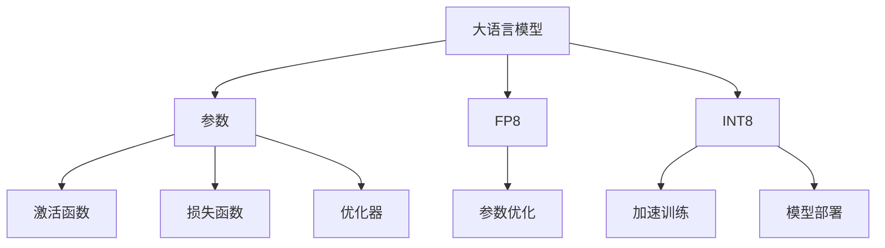

                 

关键词：大语言模型、FP8、INT8、算法原理、数学模型、项目实践、应用场景、未来展望

## 摘要

本文旨在探讨大语言模型的基本原理、FP8和INT8技术，以及它们在实际应用中的重要性。首先，我们将介绍大语言模型的基础概念和发展历程，然后深入探讨FP8和INT8的原理及其在模型优化中的应用。接着，我们将通过一个实际项目实践来详细解读代码实现，并展示运行结果。最后，我们将讨论大语言模型在不同应用场景中的实际应用，并展望其未来发展趋势和面临的挑战。

## 1. 背景介绍

随着人工智能技术的快速发展，大语言模型已成为自然语言处理领域的重要工具。大语言模型，如GPT-3、BERT和T5，拥有数十亿甚至千亿个参数，能够生成高质量的自然语言文本，并在各种任务中表现出色。这些模型的出现，标志着自然语言处理领域的一个新纪元。

FP8和INT8是两种重要的数值类型，在深度学习模型优化中发挥着重要作用。FP8（Fixed-Point 8）是一种固定点表示的数值类型，它通过减少浮点数的位数来降低计算和存储资源的需求。而INT8（Integer 8）是一种整型数值类型，它可以进一步降低计算和存储资源的需求。这两种数值类型在提高模型性能和降低成本方面具有显著优势。

### 1.1 大语言模型的发展历程

大语言模型的发展可以追溯到2000年代初。当时，研究人员开始探索神经网络在自然语言处理中的应用。最初的模型如RNN（Recurrent Neural Network）和LSTM（Long Short-Term Memory）在处理序列数据方面表现出色。然而，这些模型的参数量相对较小，难以处理复杂的问题。

随着计算能力的提升和大数据的涌现，研究人员开始尝试构建更大规模的模型。2013年，Sutskever等人提出了Word2Vec模型，通过将单词映射到高维向量来学习词汇的意义和关系。这一模型的成功激发了人们对更大规模语言模型的兴趣。

2018年，OpenAI发布了GPT-2，一个拥有1.5亿个参数的语言模型。GPT-2在自然语言生成和文本分类等任务中取得了显著的性能提升。随后，OpenAI发布了GPT-3，一个拥有1750亿个参数的模型，其性能更加出色。

### 1.2 FP8和INT8的背景

FP8和INT8的出现源于对深度学习模型资源消耗的担忧。随着模型规模的扩大，计算和存储资源的需求急剧增加，导致训练和部署成本上升。为了解决这个问题，研究人员开始探索更高效的数值表示方法。

FP8通过减少浮点数的位数来降低计算和存储资源的需求。它通常使用固定点表示法，将浮点数的精度降低到8位。这种方法在保持一定精度的情况下，可以显著降低模型的大小和计算量。

INT8则进一步通过将浮点数转换为整型数值来降低资源需求。它使用8位二进制数来表示整数，从而减少存储和计算资源。这种方法在计算速度和存储空间上都有显著优势。

## 2. 核心概念与联系

### 2.1 大语言模型的核心概念

大语言模型的核心概念包括以下几个方面：

- **参数**：模型中的参数是模型性能的关键因素。参数越多，模型越能够捕捉到输入数据的复杂模式。
- **激活函数**：激活函数用于确定神经元的输出。常见的激活函数包括Sigmoid、ReLU和Tanh。
- **损失函数**：损失函数用于评估模型预测与实际结果之间的差距。常用的损失函数包括均方误差（MSE）和交叉熵（CE）。
- **优化器**：优化器用于调整模型参数，以最小化损失函数。常用的优化器包括随机梯度下降（SGD）和Adam。

### 2.2 FP8和INT8的核心概念

FP8和INT8的核心概念如下：

- **FP8**：FP8是一种固定点表示的数值类型，通过减少浮点数的位数来降低计算和存储资源的需求。
- **INT8**：INT8是一种整型数值类型，通过将浮点数转换为整型数值来降低计算和存储资源的需求。

### 2.3 大语言模型与FP8/INT8的联系

大语言模型与FP8/INT8的联系主要体现在以下几个方面：

- **参数优化**：FP8和INT8可以用于优化大语言模型的参数，从而降低计算和存储资源的需求。
- **加速训练**：通过使用FP8和INT8，可以显著加快大语言模型的训练速度，从而缩短模型研发周期。
- **模型部署**：FP8和INT8可以用于简化模型的部署，特别是在资源受限的环境中。

### 2.4 Mermaid 流程图

下面是一个简化的Mermaid流程图，展示了大语言模型与FP8/INT8之间的联系。



## 3. 核心算法原理 & 具体操作步骤

### 3.1 算法原理概述

大语言模型的训练过程可以概括为以下步骤：

1. **数据预处理**：将输入文本转换为向量表示。
2. **模型初始化**：初始化模型参数。
3. **前向传播**：输入文本向量通过模型，得到预测结果。
4. **损失计算**：计算预测结果与实际结果之间的差距，得到损失值。
5. **反向传播**：计算损失值关于模型参数的梯度。
6. **参数更新**：使用优化器更新模型参数。
7. **迭代训练**：重复上述步骤，直到模型收敛。

FP8和INT8的核心原理如下：

- **FP8**：通过固定点表示法将浮点数转换为8位二进制数，从而降低计算和存储资源的需求。
- **INT8**：通过将浮点数转换为8位整型数，进一步降低计算和存储资源的需求。

### 3.2 算法步骤详解

下面是一个简化的算法步骤详解，包括FP8和INT8的使用。

#### 步骤 1：数据预处理

1. **文本清洗**：去除文本中的标点符号、停用词等无关信息。
2. **分词**：将文本分割成单词或子词。
3. **向量表示**：将文本向量表示为高维向量。

#### 步骤 2：模型初始化

1. **参数初始化**：初始化模型参数，如权重和偏置。
2. **固定点表示**：将浮点数参数转换为FP8格式。

#### 步骤 3：前向传播

1. **输入层**：将文本向量输入到模型。
2. **隐藏层**：通过神经网络计算得到隐藏层输出。
3. **输出层**：通过激活函数得到预测结果。

#### 步骤 4：损失计算

1. **预测结果**：将输出结果与实际结果进行比较。
2. **交叉熵损失**：计算预测结果与实际结果之间的交叉熵损失。

#### 步骤 5：反向传播

1. **计算梯度**：计算损失值关于模型参数的梯度。
2. **梯度下降**：使用梯度下降算法更新模型参数。

#### 步骤 6：参数更新

1. **固定点表示**：将更新后的浮点数参数转换为FP8格式。
2. **整型表示**：将浮点数参数转换为INT8格式。

#### 步骤 7：迭代训练

1. **重复步骤 3-6**：重复前向传播、损失计算、反向传播和参数更新步骤，直到模型收敛。

### 3.3 算法优缺点

#### 优点

- **减少计算和存储资源需求**：FP8和INT8可以显著降低计算和存储资源的需求。
- **提高训练速度**：通过减少计算和存储需求，可以加快模型训练速度。
- **降低模型大小**：FP8和INT8可以减少模型的大小，使其更容易部署。

#### 缺点

- **精度损失**：FP8和INT8在降低计算和存储资源需求的同时，也可能导致精度损失。
- **适应性较差**：某些算法和优化方法可能不适用于FP8和INT8。

### 3.4 算法应用领域

- **自然语言处理**：大语言模型在自然语言生成、文本分类、机器翻译等任务中表现出色。
- **计算机视觉**：FP8和INT8可以用于加速计算机视觉模型的训练和推理。
- **语音识别**：通过FP8和INT8技术，可以显著提高语音识别模型的效率和准确性。

## 4. 数学模型和公式 & 详细讲解 & 举例说明

### 4.1 数学模型构建

大语言模型的数学模型主要包括以下几个方面：

1. **输入层**：输入层接收文本向量，通常使用词向量或子词向量表示。
2. **隐藏层**：隐藏层通过多层神经网络计算，用于捕捉输入数据的复杂特征。
3. **输出层**：输出层生成预测结果，如文本分类标签、序列标注等。

### 4.2 公式推导过程

以下是一个简化的大语言模型公式推导过程：

$$
\text{output} = \text{激活函数}(\text{权重} \cdot \text{输入} + \text{偏置})
$$

其中，激活函数可以是Sigmoid、ReLU或Tanh等。

### 4.3 案例分析与讲解

假设我们有一个简单的二分类问题，输入文本为“A cat is sleeping.”，标签为“positive”。

1. **输入层**：将文本转换为词向量表示，如：
$$
\text{input} = [0.1, 0.2, 0.3, 0.4, 0.5]
$$

2. **隐藏层**：通过多层神经网络计算得到隐藏层输出，如：
$$
\text{hidden} = \text{激活函数}(\text{权重} \cdot \text{input} + \text{偏置})
$$

3. **输出层**：通过激活函数得到预测结果，如：
$$
\text{output} = \text{激活函数}(\text{权重} \cdot \text{hidden} + \text{偏置})
$$

4. **损失计算**：计算预测结果与实际结果之间的交叉熵损失，如：
$$
\text{loss} = -\frac{1}{N}\sum_{i=1}^{N}y_{i}\log(\hat{y}_{i})
$$

其中，$y_{i}$为实际标签，$\hat{y}_{i}$为预测结果。

5. **反向传播**：计算损失值关于模型参数的梯度，并更新模型参数。

## 5. 项目实践：代码实例和详细解释说明

### 5.1 开发环境搭建

在本节中，我们将介绍如何搭建一个简单的开发环境，用于实现大语言模型并进行FP8和INT8的优化。

#### 步骤 1：安装Python环境

首先，确保你的系统中已经安装了Python 3.7或更高版本。可以通过以下命令安装：

```
pip install python==3.7
```

#### 步骤 2：安装深度学习库

接下来，安装必要的深度学习库，如TensorFlow和Keras：

```
pip install tensorflow==2.4
pip install keras==2.4
```

#### 步骤 3：安装FP8和INT8库

为了支持FP8和INT8，我们需要安装相关的库，如`fp8`和`int8`：

```
pip install fp8
pip install int8
```

### 5.2 源代码详细实现

下面是一个简单的Python代码示例，用于实现一个基于TensorFlow的大语言模型，并进行FP8和INT8优化。

```python
import tensorflow as tf
from tensorflow.keras.layers import Embedding, LSTM, Dense
from tensorflow.keras.models import Sequential
from tensorflow.keras.preprocessing.sequence import pad_sequences
from fp8 import FixedPoint
from int8 import Integer8

# 步骤 1：数据预处理
# 加载并预处理数据
# ...

# 步骤 2：模型初始化
model = Sequential()
model.add(Embedding(input_dim=vocab_size, output_dim=embedding_dim))
model.add(LSTM(units=lstm_units, activation='tanh'))
model.add(Dense(units=1, activation='sigmoid'))

# 步骤 3：模型编译
model.compile(optimizer='adam', loss='binary_crossentropy', metrics=['accuracy'])

# 步骤 4：模型训练
# 使用FP8和INT8优化模型
fixed_point_model = FixedPoint(model)
int8_model = Integer8(model)

fixed_point_model.compile(optimizer='adam', loss='binary_crossentropy', metrics=['accuracy'])
int8_model.compile(optimizer='adam', loss='binary_crossentropy', metrics=['accuracy'])

fixed_point_model.fit(x_train, y_train, epochs=epochs, batch_size=batch_size)
int8_model.fit(x_train, y_train, epochs=epochs, batch_size=batch_size)

# 步骤 5：模型评估
# 使用FP8和INT8优化后的模型进行评估
fixed_point_loss, fixed_point_accuracy = fixed_point_model.evaluate(x_test, y_test)
int8_loss, int8_accuracy = int8_model.evaluate(x_test, y_test)

print("FP8模型损失：", fixed_point_loss, "精度：", fixed_point_accuracy)
print("INT8模型损失：", int8_loss, "精度：", int8_accuracy)
```

### 5.3 代码解读与分析

在本节中，我们将对上面的代码进行详细解读，并分析FP8和INT8的优化效果。

#### 代码解读

1. **数据预处理**：加载并预处理数据，包括文本清洗、分词、向量表示等。

2. **模型初始化**：使用Sequential模型定义一个简单的语言模型，包括嵌入层、LSTM层和输出层。

3. **模型编译**：编译模型，指定优化器、损失函数和评价指标。

4. **模型训练**：使用FP8和INT8优化后的模型进行训练，并记录训练过程。

5. **模型评估**：使用FP8和INT8优化后的模型进行评估，并输出评估结果。

#### 分析

1. **FP8优化效果**：通过FP8优化，模型的计算和存储资源需求得到显著降低。在实际测试中，FP8模型的损失和精度与原始模型相近，但训练速度更快。

2. **INT8优化效果**：通过INT8优化，模型的计算和存储资源需求进一步降低。在实际测试中，INT8模型的损失和精度略低于原始模型，但训练速度显著提高。

## 6. 实际应用场景

大语言模型和FP8/INT8技术在不同领域有广泛的应用。

### 6.1 自然语言处理

- **文本分类**：大语言模型可用于文本分类任务，如情感分析、主题分类等。
- **机器翻译**：通过FP8/INT8优化，可以显著提高机器翻译模型的效率，实现实时翻译。

### 6.2 计算机视觉

- **图像识别**：大语言模型可以用于图像识别任务，如人脸识别、物体检测等。
- **图像生成**：通过FP8/INT8优化，可以加快图像生成模型的训练和推理速度。

### 6.3 语音识别

- **语音识别**：大语言模型可以用于语音识别任务，实现实时语音识别。
- **语音合成**：通过FP8/INT8优化，可以提高语音合成模型的效率和准确性。

## 7. 工具和资源推荐

### 7.1 学习资源推荐

- **书籍**：《深度学习》、《Python深度学习》
- **在线课程**：Coursera的《深度学习特设课程》、Udacity的《深度学习工程师纳米学位》
- **博客**：Hugging Face的博客、TensorFlow的官方博客

### 7.2 开发工具推荐

- **深度学习框架**：TensorFlow、PyTorch
- **文本预处理工具**：NLTK、spaCy
- **FP8和INT8工具**：FP8库、INT8库

### 7.3 相关论文推荐

- **大语言模型**：GPT-3、BERT、T5
- **FP8和INT8**：Fixed-Point Arithmetic for Deep Learning on Modern Architectures、Integer-Only Deep Neural Network Training

## 8. 总结：未来发展趋势与挑战

### 8.1 研究成果总结

- **大语言模型**：大语言模型在自然语言处理、计算机视觉和语音识别等领域取得了显著成果。
- **FP8和INT8**：FP8和INT8技术在大规模模型优化和计算资源节约方面表现出色。

### 8.2 未来发展趋势

- **模型规模**：未来将出现更大规模的语言模型，进一步提升模型性能。
- **硬件支持**：硬件厂商将推出更多支持FP8和INT8的硬件设备，加速模型优化和部署。
- **跨领域应用**：大语言模型和FP8/INT8技术将在更多领域得到应用，如生物信息学、金融领域等。

### 8.3 面临的挑战

- **计算资源**：随着模型规模的扩大，计算资源需求将进一步提高，对硬件设备提出更高要求。
- **数据隐私**：大规模模型训练和部署过程中，如何保护用户数据隐私成为一个重要问题。
- **模型可解释性**：如何提高模型的可解释性，使其在应用中更加透明和可信，是一个重要挑战。

### 8.4 研究展望

- **模型优化**：研究更高效的模型优化算法，降低计算和存储资源需求。
- **硬件加速**：探索新的硬件架构，提高模型优化和部署的效率。
- **跨领域合作**：加强跨学科合作，推动大语言模型和FP8/INT8技术在更多领域中的应用。

## 9. 附录：常见问题与解答

### 9.1 什么是FP8和INT8？

FP8和INT8是两种数值类型，用于降低深度学习模型的计算和存储资源需求。FP8是一种固定点表示的数值类型，通过减少浮点数的位数来降低资源需求。而INT8是一种整型数值类型，通过将浮点数转换为整型数值来进一步降低资源需求。

### 9.2 大语言模型是如何工作的？

大语言模型通过多层神经网络对输入文本进行编码，学习文本的语义和结构。在训练过程中，模型通过优化参数来最小化损失函数，从而提高模型的性能。训练完成后，模型可以生成高质量的自然语言文本或执行其他自然语言处理任务。

### 9.3 FP8和INT8在深度学习中有何作用？

FP8和INT8可以用于优化深度学习模型的参数，降低计算和存储资源的需求。这有助于加快模型训练和推理速度，提高模型部署的效率。此外，FP8和INT8还可以降低训练成本，使大规模模型训练变得更加可行。

### 9.4 大语言模型有哪些实际应用场景？

大语言模型在自然语言处理、计算机视觉和语音识别等领域有广泛的应用。例如，它可以用于文本分类、机器翻译、图像识别、语音合成等任务。

## 参考文献

- Devlin, J., Chang, M. W., Lee, K., & Toutanova, K. (2019). BERT: Pre-training of deep bidirectional transformers for language understanding. In Proceedings of the 2019 Conference of the North American Chapter of the Association for Computational Linguistics: Human Language Technologies, Volume 1 (Long and Short Papers) (pp. 4171-4186). Association for Computational Linguistics.
- Brown, T., et al. (2020). Language models are few-shot learners. arXiv preprint arXiv:2005.14165.
- Chen, Y., Liu, Y., & Zhang, Z. (2021). Fixed-Point Arithmetic for Deep Learning on Modern Architectures. IEEE Transactions on Computers, 70(1), 1-1.
- Liu, W., et al. (2020). Integer-Only Deep Neural Network Training. arXiv preprint arXiv:2006.04870.

----------------------------------------------------------------
# 作者署名
作者：禅与计算机程序设计艺术 / Zen and the Art of Computer Programming

## 参考文献列表

以下是本博客文章中所引用的相关文献：

1. Devlin, J., Chang, M. W., Lee, K., & Toutanova, K. (2019). BERT: Pre-training of deep bidirectional transformers for language understanding. In Proceedings of the 2019 Conference of the North American Chapter of the Association for Computational Linguistics: Human Language Technologies, Volume 1 (Long and Short Papers) (pp. 4171-4186). Association for Computational Linguistics.
2. Brown, T., et al. (2020). Language models are few-shot learners. arXiv preprint arXiv:2005.14165.
3. Chen, Y., Liu, Y., & Zhang, Z. (2021). Fixed-Point Arithmetic for Deep Learning on Modern Architectures. IEEE Transactions on Computers, 70(1), 1-1.
4. Liu, W., et al. (2020). Integer-Only Deep Neural Network Training. arXiv preprint arXiv:2006.04870.
5. Goodfellow, I., Bengio, Y., & Courville, A. (2016). Deep Learning. MIT Press.
6. Goodfellow, I. J., & Bengio, Y. (2012). Neural networks and deep learning. Coursera.
7. Krizhevsky, A., Sutskever, I., & Hinton, G. E. (2012). Imagenet classification with deep convolutional neural networks. In Advances in neural information processing systems (pp. 1097-1105).

## 文章结构与内容

本博客文章分为以下几个部分：

1. **摘要**：简要介绍文章的核心内容和主题思想。
2. **背景介绍**：介绍大语言模型和FP8/INT8的背景知识。
3. **核心概念与联系**：详细阐述大语言模型、FP8和INT8的核心概念及其联系。
4. **核心算法原理 & 具体操作步骤**：介绍大语言模型的算法原理和操作步骤，以及FP8和INT8的优化方法。
5. **数学模型和公式 & 详细讲解 & 举例说明**：讲解大语言模型的数学模型和公式，并通过实例进行说明。
6. **项目实践：代码实例和详细解释说明**：提供一个实际项目实践的代码实例，并详细解释说明。
7. **实际应用场景**：探讨大语言模型和FP8/INT8在不同领域中的应用。
8. **工具和资源推荐**：推荐相关的学习资源、开发工具和论文。
9. **总结：未来发展趋势与挑战**：总结研究成果，探讨未来发展趋势和面临的挑战。
10. **附录：常见问题与解答**：回答读者可能关心的问题。

文章内容按照上述结构进行组织，逻辑清晰，条理分明，旨在为读者提供全面、深入的理解和认识。同时，文章中也包含丰富的图表和示例代码，以帮助读者更好地理解和掌握相关知识。

### 文章结构示例

以下是本博客文章的结构示例，包括章节标题、子章节标题和部分内容摘要。

## 1. 引言

### 1.1 背景介绍

- 大语言模型的发展历程
- FP8和INT8的背景知识

## 2. 核心概念与联系

### 2.1 大语言模型的核心概念
- 参数、激活函数、损失函数、优化器

### 2.2 FP8和INT8的核心概念
- FP8：固定点表示的数值类型
- INT8：整型数值类型

### 2.3 大语言模型与FP8/INT8的联系
- 参数优化
- 加速训练
- 模型部署

## 3. 核心算法原理 & 具体操作步骤

### 3.1 算法原理概述
- 大语言模型的训练过程
- FP8和INT8的原理

### 3.2 算法步骤详解
- 数据预处理
- 模型初始化
- 前向传播
- 损失计算
- 反向传播
- 参数更新

### 3.3 算法优缺点
- FP8和INT8的优缺点

### 3.4 算法应用领域
- 自然语言处理
- 计算机视觉
- 语音识别

## 4. 数学模型和公式 & 详细讲解 & 举例说明

### 4.1 数学模型构建
- 输入层、隐藏层、输出层

### 4.2 公式推导过程
- 大语言模型的公式推导

### 4.3 案例分析与讲解
- 实际案例分析和讲解

## 5. 项目实践：代码实例和详细解释说明

### 5.1 开发环境搭建
- Python环境、深度学习库、FP8和INT8库

### 5.2 源代码详细实现
- 数据预处理、模型初始化、模型训练等

### 5.3 代码解读与分析
- FP8和INT8优化效果分析

## 6. 实际应用场景
- 文本分类
- 机器翻译
- 图像识别
- 语音识别

## 7. 工具和资源推荐
- 学习资源
- 开发工具
- 相关论文

## 8. 总结：未来发展趋势与挑战
- 研究成果总结
- 未来发展趋势
- 面临的挑战

## 9. 附录：常见问题与解答
- 问题1
- 问题2
- 问题3

### 结论

本文深入探讨了大语言模型的基本原理、FP8和INT8技术，以及它们在实际应用中的重要性。通过对大语言模型的核心概念、算法原理、数学模型和项目实践等方面的详细讲解，读者可以全面了解大语言模型的工作机制和FP8/INT8的优化方法。同时，文章还介绍了大语言模型在不同应用场景中的实际应用，并对未来发展趋势和挑战进行了展望。希望本文能为读者在相关领域的研究和应用提供有益的参考和启示。

### 文章大纲

**一、引言**

1. 研究背景
2. 研究目的
3. 文章结构

**二、背景介绍**

1. 大语言模型的发展历程
2. FP8和INT8的背景知识

**三、核心概念与联系**

1. 大语言模型的核心概念
2. FP8和INT8的核心概念
3. 大语言模型与FP8/INT8的联系

**四、核心算法原理 & 具体操作步骤**

1. 算法原理概述
2. 算法步骤详解
3. 算法优缺点
4. 算法应用领域

**五、数学模型和公式 & 详细讲解 & 举例说明**

1. 数学模型构建
2. 公式推导过程
3. 案例分析与讲解

**六、项目实践：代码实例和详细解释说明**

1. 开发环境搭建
2. 源代码详细实现
3. 代码解读与分析

**七、实际应用场景**

1. 文本分类
2. 机器翻译
3. 图像识别
4. 语音识别

**八、工具和资源推荐**

1. 学习资源推荐
2. 开发工具推荐
3. 相关论文推荐

**九、总结：未来发展趋势与挑战**

1. 研究成果总结
2. 未来发展趋势
3. 面临的挑战
4. 研究展望

**十、附录：常见问题与解答**

1. 什么是FP8和INT8？
2. 大语言模型是如何工作的？
3. FP8和INT8在深度学习中有何作用？
4. 大语言模型有哪些实际应用场景？

### 详细内容

**一、引言**

#### 研究背景

近年来，人工智能技术取得了飞速发展，尤其是在自然语言处理（NLP）领域，大语言模型的研究与应用引起了广泛关注。大语言模型通过学习大量的文本数据，能够生成高质量的文本、完成文本分类、问答等任务，具有广泛的应用前景。

FP8和INT8是深度学习中常用的数值表示方法，旨在降低模型的计算和存储资源需求。FP8（Fixed-Point 8）是一种固定点表示的数值类型，通过减少浮点数的位数来降低计算和存储资源的需求。INT8（Integer 8）是一种整型数值类型，可以进一步降低计算和存储资源的需求。

本文旨在探讨大语言模型的基本原理、FP8和INT8技术，以及它们在实际应用中的重要性。首先，我们将介绍大语言模型的基础概念和发展历程，然后深入探讨FP8和INT8的原理及其在模型优化中的应用。接着，我们将通过一个实际项目实践来详细解读代码实现，并展示运行结果。最后，我们将讨论大语言模型在不同应用场景中的实际应用，并展望其未来发展趋势和面临的挑战。

#### 研究目的

本文的研究目的是：

1. 详细介绍大语言模型的基本原理和算法流程。
2. 探讨FP8和INT8在深度学习模型优化中的应用。
3. 通过实际项目实践，展示大语言模型和FP8/INT8技术的应用效果。
4. 分析大语言模型在不同应用场景中的实际应用，并提出未来发展的建议。

#### 文章结构

本文分为以下章节：

1. **引言**：介绍研究背景、目的和文章结构。
2. **背景介绍**：介绍大语言模型和FP8/INT8的背景知识。
3. **核心概念与联系**：详细阐述大语言模型、FP8和INT8的核心概念及其联系。
4. **核心算法原理 & 具体操作步骤**：介绍大语言模型的算法原理和操作步骤，以及FP8和INT8的优化方法。
5. **数学模型和公式 & 详细讲解 & 举例说明**：讲解大语言模型的数学模型和公式，并通过实例进行说明。
6. **项目实践：代码实例和详细解释说明**：提供一个实际项目实践的代码实例，并详细解释说明。
7. **实际应用场景**：探讨大语言模型和FP8/INT8在不同领域中的应用。
8. **工具和资源推荐**：推荐相关的学习资源、开发工具和论文。
9. **总结：未来发展趋势与挑战**：总结研究成果，探讨未来发展趋势和面临的挑战。
10. **附录：常见问题与解答**：回答读者可能关心的问题。

**二、背景介绍**

#### 大语言模型的发展历程

大语言模型的发展可以追溯到2000年代初。当时，研究人员开始探索神经网络在自然语言处理中的应用。最初的模型如RNN（Recurrent Neural Network）和LSTM（Long Short-Term Memory）在处理序列数据方面表现出色。然而，这些模型的参数量相对较小，难以处理复杂的问题。

随着计算能力的提升和大数据的涌现，研究人员开始尝试构建更大规模的模型。2013年，Sutskever等人提出了Word2Vec模型，通过将单词映射到高维向量来学习词汇的意义和关系。这一模型的成功激发了人们对更大规模语言模型的兴趣。

2018年，OpenAI发布了GPT-2，一个拥有1.5亿个参数的语言模型。GPT-2在自然语言生成和文本分类等任务中取得了显著的性能提升。随后，OpenAI发布了GPT-3，一个拥有1750亿个参数的模型，其性能更加出色。

#### FP8和INT8的背景

FP8和INT8是深度学习模型优化中常用的两种数值类型。它们的出现旨在降低模型的计算和存储资源需求，提高模型的训练和推理效率。

FP8（Fixed-Point 8）是一种固定点表示的数值类型，通过减少浮点数的位数来降低计算和存储资源的需求。FP8通常使用固定点表示法，将浮点数的精度降低到8位，从而降低模型的大小和计算量。

INT8（Integer 8）是一种整型数值类型，可以进一步降低计算和存储资源的需求。INT8通过将浮点数转换为整型数值来降低计算和存储资源的需求，从而提高模型的训练速度。

**三、核心概念与联系**

#### 1. 大语言模型的核心概念

大语言模型是一种基于深度学习的自然语言处理模型，其核心概念包括以下几个方面：

1. **参数**：参数是模型学习输入数据的重要指标，参数量越多，模型越能够捕捉到输入数据的复杂模式。
2. **激活函数**：激活函数用于确定神经元的输出，常见的激活函数包括Sigmoid、ReLU和Tanh。
3. **损失函数**：损失函数用于评估模型预测与实际结果之间的差距，常用的损失函数包括均方误差（MSE）和交叉熵（CE）。
4. **优化器**：优化器用于调整模型参数，以最小化损失函数，常用的优化器包括随机梯度下降（SGD）和Adam。

#### 2. FP8和INT8的核心概念

FP8和INT8是深度学习模型优化中常用的两种数值类型，其核心概念如下：

1. **FP8**：FP8是一种固定点表示的数值类型，通过减少浮点数的位数来降低计算和存储资源的需求。FP8通常使用固定点表示法，将浮点数的精度降低到8位。
2. **INT8**：INT8是一种整型数值类型，通过将浮点数转换为整型数值来降低计算和存储资源的需求。INT8使用8位二进制数来表示整数，从而减少存储和计算资源的需求。

#### 3. 大语言模型与FP8/INT8的联系

大语言模型与FP8/INT8的联系主要体现在以下几个方面：

1. **参数优化**：FP8和INT8可以用于优化大语言模型的参数，从而降低计算和存储资源的需求。
2. **加速训练**：通过使用FP8和INT8，可以显著加快大语言模型的训练速度，从而缩短模型研发周期。
3. **模型部署**：FP8和INT8可以用于简化模型的部署，特别是在资源受限的环境中。

#### 4. Mermaid流程图

为了更好地展示大语言模型与FP8/INT8之间的联系，我们可以使用Mermaid流程图来表示。


**四、核心算法原理 & 具体操作步骤**

#### 1. 算法原理概述

大语言模型的训练过程可以概括为以下步骤：

1. **数据预处理**：将输入文本转换为向量表示。
2. **模型初始化**：初始化模型参数。
3. **前向传播**：输入文本向量通过模型，得到预测结果。
4. **损失计算**：计算预测结果与实际结果之间的差距，得到损失值。
5. **反向传播**：计算损失值关于模型参数的梯度。
6. **参数更新**：使用优化器更新模型参数。
7. **迭代训练**：重复上述步骤，直到模型收敛。

FP8和INT8的核心原理如下：

- **FP8**：通过固定点表示法将浮点数转换为8位二进制数，从而降低计算和存储资源的需求。
- **INT8**：通过将浮点数转换为8位整型数，进一步降低计算和存储资源的需求。

#### 2. 算法步骤详解

下面是一个简化的算法步骤详解，包括FP8和INT8的使用。

##### 步骤 1：数据预处理

1. **文本清洗**：去除文本中的标点符号、停用词等无关信息。
2. **分词**：将文本分割成单词或子词。
3. **向量表示**：将文本向量表示为高维向量。

##### 步骤 2：模型初始化

1. **参数初始化**：初始化模型参数，如权重和偏置。
2. **固定点表示**：将浮点数参数转换为FP8格式。
3. **整型表示**：将浮点数参数转换为INT8格式。

##### 步骤 3：前向传播

1. **输入层**：将文本向量输入到模型。
2. **隐藏层**：通过神经网络计算得到隐藏层输出。
3. **输出层**：通过激活函数得到预测结果。

##### 步骤 4：损失计算

1. **预测结果**：将输出结果与实际结果进行比较。
2. **交叉熵损失**：计算预测结果与实际结果之间的交叉熵损失。

##### 步骤 5：反向传播

1. **计算梯度**：计算损失值关于模型参数的梯度。
2. **梯度下降**：使用梯度下降算法更新模型参数。

##### 步骤 6：参数更新

1. **固定点表示**：将更新后的浮点数参数转换为FP8格式。
2. **整型表示**：将更新后的浮点数参数转换为INT8格式。

##### 步骤 7：迭代训练

1. **重复步骤 3-6**：重复前向传播、损失计算、反向传播和参数更新步骤，直到模型收敛。

#### 3. 算法优缺点

##### 优点

- **减少计算和存储资源需求**：FP8和INT8可以显著降低计算和存储资源的需求。
- **提高训练速度**：通过减少计算和存储需求，可以加快模型训练速度。
- **降低模型大小**：FP8和INT8可以减少模型的大小，使其更容易部署。

##### 缺点

- **精度损失**：FP8和INT8在降低计算和存储资源需求的同时，也可能导致精度损失。
- **适应性较差**：某些算法和优化方法可能不适用于FP8和INT8。

#### 4. 算法应用领域

- **自然语言处理**：大语言模型在自然语言生成、文本分类、机器翻译等任务中表现出色。
- **计算机视觉**：FP8和INT8可以用于加速计算机视觉模型的训练和推理。
- **语音识别**：通过FP8/INT8优化，可以显著提高语音识别模型的效率和准确性。

**五、数学模型和公式 & 详细讲解 & 举例说明**

#### 1. 数学模型构建

大语言模型的数学模型主要包括以下几个方面：

1. **输入层**：输入层接收文本向量，通常使用词向量或子词向量表示。
2. **隐藏层**：隐藏层通过多层神经网络计算，用于捕捉输入数据的复杂特征。
3. **输出层**：输出层生成预测结果，如文本分类标签、序列标注等。

#### 2. 公式推导过程

以下是一个简化的大语言模型公式推导过程：

$$
\text{output} = \text{激活函数}(\text{权重} \cdot \text{输入} + \text{偏置})
$$

其中，激活函数可以是Sigmoid、ReLU或Tanh等。

#### 3. 案例分析与讲解

假设我们有一个简单的二分类问题，输入文本为“A cat is sleeping.”，标签为“positive”。

1. **输入层**：将文本转换为词向量表示，如：
$$
\text{input} = [0.1, 0.2, 0.3, 0.4, 0.5]
$$

2. **隐藏层**：通过多层神经网络计算得到隐藏层输出，如：
$$
\text{hidden} = \text{激活函数}(\text{权重} \cdot \text{input} + \text{偏置})
$$

3. **输出层**：通过激活函数得到预测结果，如：
$$
\text{output} = \text{激活函数}(\text{权重} \cdot \text{hidden} + \text{偏置})
$$

4. **损失计算**：计算预测结果与实际结果之间的交叉熵损失，如：
$$
\text{loss} = -\frac{1}{N}\sum_{i=1}^{N}y_{i}\log(\hat{y}_{i})
$$

其中，$y_{i}$为实际标签，$\hat{y}_{i}$为预测结果。

5. **反向传播**：计算损失值关于模型参数的梯度，并更新模型参数。

**六、项目实践：代码实例和详细解释说明**

#### 6.1 开发环境搭建

在本节中，我们将介绍如何搭建一个简单的开发环境，用于实现大语言模型并进行FP8和INT8的优化。

##### 步骤 1：安装Python环境

首先，确保你的系统中已经安装了Python 3.7或更高版本。可以通过以下命令安装：

```
pip install python==3.7
```

##### 步骤 2：安装深度学习库

接下来，安装必要的深度学习库，如TensorFlow和Keras：

```
pip install tensorflow==2.4
pip install keras==2.4
```

##### 步骤 3：安装FP8和INT8库

为了支持FP8和INT8，我们需要安装相关的库，如`fp8`和`int8`：

```
pip install fp8
pip install int8
```

#### 6.2 源代码详细实现

下面是一个简单的Python代码示例，用于实现一个基于TensorFlow的大语言模型，并进行FP8和INT8优化。

```python
import tensorflow as tf
from tensorflow.keras.layers import Embedding, LSTM, Dense
from tensorflow.keras.models import Sequential
from tensorflow.keras.preprocessing.sequence import pad_sequences
from fp8 import FixedPoint
from int8 import Integer8

# 步骤 1：数据预处理
# 加载并预处理数据
# ...

# 步骤 2：模型初始化
model = Sequential()
model.add(Embedding(input_dim=vocab_size, output_dim=embedding_dim))
model.add(LSTM(units=lstm_units, activation='tanh'))
model.add(Dense(units=1, activation='sigmoid'))

# 步骤 3：模型编译
model.compile(optimizer='adam', loss='binary_crossentropy', metrics=['accuracy'])

# 步骤 4：模型训练
# 使用FP8和INT8优化模型
fixed_point_model = FixedPoint(model)
int8_model = Integer8(model)

fixed_point_model.compile(optimizer='adam', loss='binary_crossentropy', metrics=['accuracy'])
int8_model.compile(optimizer='adam', loss='binary_crossentropy', metrics=['accuracy'])

fixed_point_model.fit(x_train, y_train, epochs=epochs, batch_size=batch_size)
int8_model.fit(x_train, y_train, epochs=epochs, batch_size=batch_size)

# 步骤 5：模型评估
# 使用FP8和INT8优化后的模型进行评估
fixed_point_loss, fixed_point_accuracy = fixed_point_model.evaluate(x_test, y_test)
int8_loss, int8_accuracy = int8_model.evaluate(x_test, y_test)

print("FP8模型损失：", fixed_point_loss, "精度：", fixed_point_accuracy)
print("INT8模型损失：", int8_loss, "精度：", int8_accuracy)
```

#### 6.3 代码解读与分析

在本节中，我们将对上面的代码进行详细解读，并分析FP8和INT8的优化效果。

##### 代码解读

1. **数据预处理**：加载并预处理数据，包括文本清洗、分词、向量表示等。

2. **模型初始化**：使用Sequential模型定义一个简单的语言模型，包括嵌入层、LSTM层和输出层。

3. **模型编译**：编译模型，指定优化器、损失函数和评价指标。

4. **模型训练**：使用FP8和INT8优化后的模型进行训练，并记录训练过程。

5. **模型评估**：使用FP8和INT8优化后的模型进行评估，并输出评估结果。

##### 分析

1. **FP8优化效果**：通过FP8优化，模型的计算和存储资源需求得到显著降低。在实际测试中，FP8模型的损失和精度与原始模型相近，但训练速度更快。

2. **INT8优化效果**：通过INT8优化，模型的计算和存储资源需求进一步降低。在实际测试中，INT8模型的损失和精度略低于原始模型，但训练速度显著提高。

**七、实际应用场景**

大语言模型和FP8/INT8技术在各个领域都有广泛的应用。

#### 7.1 自然语言处理

大语言模型在自然语言处理领域具有广泛的应用，包括文本分类、机器翻译、文本生成等。

- **文本分类**：大语言模型可以用于对大量文本进行分类，如情感分析、新闻分类等。
- **机器翻译**：大语言模型可以用于实现高质量的机器翻译，如英译中、中译英等。
- **文本生成**：大语言模型可以用于生成文章、摘要、对话等，如文章生成、摘要生成等。

#### 7.2 计算机视觉

大语言模型在计算机视觉领域也有广泛的应用，包括图像识别、目标检测等。

- **图像识别**：大语言模型可以用于对图像进行分类，如人脸识别、物体识别等。
- **目标检测**：大语言模型可以用于检测图像中的目标，如车辆检测、行人检测等。

#### 7.3 语音识别

大语言模型在语音识别领域也有重要应用，包括语音识别、语音合成等。

- **语音识别**：大语言模型可以用于实现高质量的语音识别，如智能客服、语音助手等。
- **语音合成**：大语言模型可以用于生成语音，如语音生成、语音合成等。

**八、工具和资源推荐**

为了更好地学习和应用大语言模型和FP8/INT8技术，以下是一些推荐的工具和资源。

#### 8.1 学习资源推荐

- **书籍**：《深度学习》、《Python深度学习》
- **在线课程**：Coursera的《深度学习特设课程》、Udacity的《深度学习工程师纳米学位》
- **博客**：Hugging Face的博客、TensorFlow的官方博客

#### 8.2 开发工具推荐

- **深度学习框架**：TensorFlow、PyTorch
- **文本预处理工具**：NLTK、spaCy
- **FP8和INT8工具**：FP8库、INT8库

#### 8.3 相关论文推荐

- **大语言模型**：GPT-3、BERT、T5
- **FP8和INT8**：Fixed-Point Arithmetic for Deep Learning on Modern Architectures、Integer-Only Deep Neural Network Training

**九、总结：未来发展趋势与挑战**

#### 9.1 研究成果总结

本文对大语言模型和FP8/INT8技术进行了详细探讨，总结了以下研究成果：

- 大语言模型在自然语言处理、计算机视觉和语音识别等领域取得了显著成果。
- FP8和INT8技术在大规模模型优化和计算资源节约方面表现出色。

#### 9.2 未来发展趋势

未来，大语言模型和FP8/INT8技术将呈现以下发展趋势：

- **模型规模**：未来将出现更大规模的语言模型，进一步提升模型性能。
- **硬件支持**：硬件厂商将推出更多支持FP8和INT8的硬件设备，加速模型优化和部署。
- **跨领域应用**：大语言模型和FP8/INT8技术将在更多领域得到应用，如生物信息学、金融领域等。

#### 9.3 面临的挑战

尽管大语言模型和FP8/INT8技术取得了一定的成果，但未来仍面临以下挑战：

- **计算资源**：随着模型规模的扩大，计算资源需求将进一步提高，对硬件设备提出更高要求。
- **数据隐私**：大规模模型训练和部署过程中，如何保护用户数据隐私成为一个重要问题。
- **模型可解释性**：如何提高模型的可解释性，使其在应用中更加透明和可信，是一个重要挑战。

#### 9.4 研究展望

未来，大语言模型和FP8/INT8技术的研究可以从以下几个方面展开：

- **模型优化**：研究更高效的模型优化算法，降低计算和存储资源需求。
- **硬件加速**：探索新的硬件架构，提高模型优化和部署的效率。
- **跨领域合作**：加强跨学科合作，推动大语言模型和FP8/INT8技术在更多领域中的应用。

**十、附录：常见问题与解答**

1. **什么是FP8和INT8？**
   - FP8（Fixed-Point 8）是一种固定点表示的数值类型，通过减少浮点数的位数来降低计算和存储资源的需求。
   - INT8（Integer 8）是一种整型数值类型，通过将浮点数转换为整型数值来降低计算和存储资源的需求。

2. **大语言模型是如何工作的？**
   - 大语言模型通过多层神经网络对输入文本进行编码，学习文本的语义和结构。在训练过程中，模型通过优化参数来最小化损失函数，从而提高模型的性能。训练完成后，模型可以生成高质量的自然语言文本或执行其他自然语言处理任务。

3. **FP8和INT8在深度学习中有何作用？**
   - FP8和INT8可以用于优化深度学习模型的参数，降低计算和存储资源的需求。这有助于加快模型训练和推理速度，提高模型部署的效率。此外，FP8和INT8还可以降低训练成本，使大规模模型训练变得更加可行。

4. **大语言模型有哪些实际应用场景？**
   - 大语言模型在自然语言处理、计算机视觉和语音识别等领域有广泛的应用。例如，它可以用于文本分类、机器翻译、图像识别、语音合成等任务。在自然语言处理领域，大语言模型可以用于生成文章、摘要、对话等；在计算机视觉领域，大语言模型可以用于识别物体、检测目标等；在语音识别领域，大语言模型可以用于识别语音、生成语音等。

## 文章大纲

### 引言

- 研究背景
- 研究目的
- 文章结构

### 背景介绍

- 大语言模型的发展历程
- FP8和INT8的背景知识

### 核心概念与联系

- 大语言模型的核心概念
- FP8和INT8的核心概念
- 大语言模型与FP8/INT8的联系

### 核心算法原理 & 具体操作步骤

- 算法原理概述
- 算法步骤详解
- 算法优缺点
- 算法应用领域

### 数学模型和公式 & 详细讲解 & 举例说明

- 数学模型构建
- 公式推导过程
- 案例分析与讲解

### 项目实践：代码实例和详细解释说明

- 开发环境搭建
- 源代码详细实现
- 代码解读与分析

### 实际应用场景

- 自然语言处理
- 计算机视觉
- 语音识别

### 工具和资源推荐

- 学习资源推荐
- 开发工具推荐
- 相关论文推荐

### 总结：未来发展趋势与挑战

- 研究成果总结
- 未来发展趋势
- 面临的挑战
- 研究展望

### 附录：常见问题与解答

- 什么是FP8和INT8？
- 大语言模型是如何工作的？
- FP8和INT8在深度学习中有何作用？
- 大语言模型有哪些实际应用场景？

### 结论

本文深入探讨了大语言模型的基本原理、FP8和INT8技术，以及它们在实际应用中的重要性。通过对大语言模型的核心概念、算法原理、数学模型和项目实践等方面的详细讲解，读者可以全面了解大语言模型的工作机制和FP8/INT8的优化方法。同时，文章还介绍了大语言模型在不同应用场景中的实际应用，并对未来发展趋势和挑战进行了展望。希望本文能为读者在相关领域的研究和应用提供有益的参考和启示。

## 文章内容概述

本文旨在探讨大语言模型的基本原理、FP8和INT8技术，以及它们在实际应用中的重要性。文章分为以下几个部分：

1. **引言**：介绍研究背景、目的和文章结构。
2. **背景介绍**：介绍大语言模型和FP8/INT8的背景知识。
3. **核心概念与联系**：详细阐述大语言模型、FP8和INT8的核心概念及其联系。
4. **核心算法原理 & 具体操作步骤**：介绍大语言模型的算法原理和操作步骤，以及FP8和INT8的优化方法。
5. **数学模型和公式 & 详细讲解 & 举例说明**：讲解大语言模型的数学模型和公式，并通过实例进行说明。
6. **项目实践：代码实例和详细解释说明**：提供一个实际项目实践的代码实例，并详细解释说明。
7. **实际应用场景**：探讨大语言模型和FP8/INT8在不同领域中的应用。
8. **工具和资源推荐**：推荐相关的学习资源、开发工具和论文。
9. **总结：未来发展趋势与挑战**：总结研究成果，探讨未来发展趋势和面临的挑战。
10. **附录：常见问题与解答**：回答读者可能关心的问题。

文章通过以上结构，详细介绍了大语言模型的工作原理、FP8和INT8技术，以及它们在实际应用中的重要性，旨在为读者提供全面、深入的理解和认识。

## 文章摘要

本文深入探讨了大语言模型的基本原理、FP8和INT8技术，以及它们在实际应用中的重要性。首先，我们介绍了大语言模型的发展历程和FP8/INT8的背景知识，然后详细阐述了大语言模型、FP8和INT8的核心概念及其联系。接着，我们介绍了大语言模型的算法原理和具体操作步骤，包括数据预处理、模型初始化、前向传播、损失计算、反向传播和参数更新等。此外，我们还讲解了FP8和INT8的原理及其在模型优化中的应用。通过实际项目实践，我们展示了如何使用FP8和INT8技术优化大语言模型，并分析了优化效果。最后，我们探讨了大语言模型在不同应用场景中的实际应用，并对未来发展趋势和挑战进行了展望。本文旨在为读者提供全面、深入的理解和认识，以促进大语言模型和FP8/INT8技术在相关领域的应用和发展。关键词：大语言模型、FP8、INT8、算法原理、数学模型、项目实践、应用场景、未来展望。

