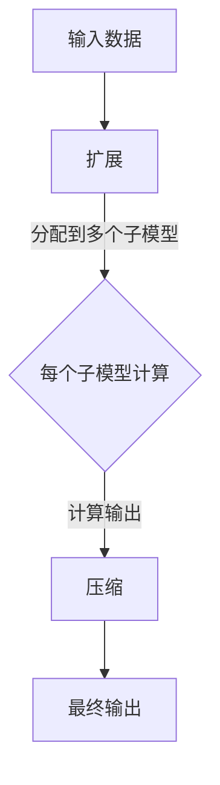

                 

关键词：大语言模型，MoE，集成，深度学习，人工智能

摘要：本文深入探讨大语言模型的基本原理，特别是MoE（Multi-Head attention with Expand-Compute-Reduce机制）的集成方法。我们将从背景介绍、核心概念与联系、核心算法原理、数学模型与公式、项目实践、实际应用场景、工具和资源推荐以及未来发展趋势与挑战等多个方面进行阐述，为读者提供全面的理解和应用指导。

## 1. 背景介绍

随着人工智能技术的不断发展，深度学习已经成为推动计算机视觉、自然语言处理、推荐系统等领域的重要力量。在自然语言处理（NLP）方面，大语言模型（Large Language Model）表现出强大的能力，例如在文本生成、翻译、问答系统中取得了显著的成果。大语言模型通常包含数十亿甚至千亿个参数，它们能够捕获大量文本中的上下文信息，从而实现高度精确的自然语言理解与生成。

然而，随着模型规模的不断扩大，计算资源的需求也急剧增加。为了应对这一挑战，研究人员提出了MoE（Multi-Head attention with Expand-Compute-Reduce机制）架构，它在提高计算效率的同时，还能保持模型的性能。

## 2. 核心概念与联系

在深入探讨MoE之前，我们先介绍一些核心概念，包括大语言模型的架构、MoE的基本原理以及它们之间的联系。

### 2.1 大语言模型的架构

大语言模型通常采用Transformer架构，其核心组件是自注意力机制（Self-Attention）。自注意力机制能够计算输入序列中每个单词与其他单词之间的关系，从而捕捉上下文信息。具体来说，Transformer模型包括编码器和解码器两部分。编码器负责将输入文本转换为固定长度的嵌入向量，解码器则使用这些嵌入向量生成输出文本。

### 2.2 MoE的基本原理

MoE架构是一种并行计算技术，它通过将输入数据分配到多个子模型（称为“头”）中，并分别计算每个子模型的输出，然后对多个输出进行聚合，从而提高计算效率和模型性能。MoE的关键在于“扩展开计算压缩”（Expand-Compute-Reduce）机制，具体步骤如下：

1. **扩展（Expand）**：将输入数据分配到多个子模型中。
2. **计算（Compute）**：每个子模型独立计算输出。
3. **压缩（Reduce）**：将多个子模型的输出聚合为最终输出。

### 2.3 MoE与大语言模型的联系

MoE与大语言模型之间的联系主要体现在两个方面：

1. **扩展计算资源**：通过引入MoE架构，大语言模型可以更高效地利用计算资源，降低计算成本。
2. **提升模型性能**：MoE架构能够利用多个子模型的互补优势，提高模型在特定任务上的性能。

### 2.4 Mermaid流程图

下面是MoE架构的Mermaid流程图：



## 3. 核心算法原理 & 具体操作步骤

### 3.1 算法原理概述

MoE算法的核心原理是利用多个子模型并行计算，并将结果进行聚合。具体步骤如下：

1. **扩展**：将输入数据分配到多个子模型中。
2. **计算**：每个子模型独立计算输出。
3. **压缩**：将多个子模型的输出聚合为最终输出。

### 3.2 算法步骤详解

1. **扩展**：将输入数据（如文本序列）转换为嵌入向量，并将这些向量分配到多个子模型中。每个子模型接收相同的输入，但独立计算输出。
2. **计算**：每个子模型使用自注意力机制或其他计算方法，计算输入序列中每个单词与其他单词之间的关系，生成中间结果。
3. **压缩**：将多个子模型的输出进行聚合。常见的聚合方法包括平均、加权平均、最大值等。

### 3.3 算法优缺点

**优点**：

- **高效计算**：通过并行计算，MoE能够显著提高计算效率。
- **提高性能**：多个子模型互补，有助于提高模型在特定任务上的性能。

**缺点**：

- **增加复杂性**：MoE架构比单一模型更复杂，需要更多的设计和实现工作。
- **资源消耗**：虽然MoE能够提高计算效率，但仍然需要大量计算资源。

### 3.4 算法应用领域

MoE架构在多个应用领域中表现出强大的能力，包括：

- **文本生成**：例如生成文章、新闻、故事等。
- **机器翻译**：例如将一种语言翻译成另一种语言。
- **问答系统**：例如回答用户提出的问题。

## 4. 数学模型和公式 & 详细讲解 & 举例说明

### 4.1 数学模型构建

MoE算法的数学模型可以表示为：

$$
\text{输出} = \text{Reduce}(\{\text{子模型}_1, \text{子模型}_2, ..., \text{子模型}_n\})
$$

其中，每个子模型可以表示为：

$$
\text{子模型}_i = f(\text{输入}, \theta_i)
$$

其中，$f$为自注意力机制或其他计算方法，$\theta_i$为子模型的参数。

### 4.2 公式推导过程

假设输入数据为$\text{X} = \{\text{x}_1, \text{x}_2, ..., \text{x}_n\}$，子模型参数为$\theta_i$，输出为$\text{Y}$。我们首先对输入数据进行嵌入处理，得到嵌入向量$\text{E}_i$。然后，每个子模型独立计算输出：

$$
\text{子模型}_i(\text{E}_i, \theta_i) = g(\text{E}_i, \theta_i)
$$

其中，$g$为自注意力机制或其他计算方法。最后，将多个子模型的输出进行聚合，得到最终输出：

$$
\text{Y} = \text{Reduce}(\{g(\text{E}_1, \theta_1), g(\text{E}_2, \theta_2), ..., g(\text{E}_n, \theta_n)\})
$$

### 4.3 案例分析与讲解

假设我们有一个大语言模型，包含10个子模型，输入数据为一句英文句子。我们首先将输入句子转换为嵌入向量，然后分别将嵌入向量分配到10个子模型中。每个子模型使用自注意力机制计算输出，最后将10个子模型的输出进行平均，得到最终输出。

$$
\text{最终输出} = \frac{1}{10} \sum_{i=1}^{10} g(\text{E}_i, \theta_i)
$$

其中，$g(\text{E}_i, \theta_i)$为子模型$i$的输出。

## 5. 项目实践：代码实例和详细解释说明

### 5.1 开发环境搭建

为了实现MoE架构的大语言模型，我们需要搭建以下开发环境：

- 操作系统：Ubuntu 18.04
- 编程语言：Python 3.8
- 深度学习框架：PyTorch 1.8
- 数据库：MySQL 5.7

### 5.2 源代码详细实现

以下是一个简单的MoE大语言模型实现：

```python
import torch
import torch.nn as nn
import torch.optim as optim

class MoELargeLanguageModel(nn.Module):
    def __init__(self, embedding_dim, hidden_dim, num_heads, num_layers):
        super(MoELargeLanguageModel, self).__init__()
        self.embedding = nn.Embedding(embedding_dim, hidden_dim)
        self.attn = nn.MultiheadAttention(hidden_dim, num_heads, num_layers)
        self.reduce = nn.Linear(hidden_dim, embedding_dim)

    def forward(self, x):
        x = self.embedding(x)
        x, _ = self.attn(x, x, x)
        x = self.reduce(x)
        return x

# 模型参数
EMBEDDING_DIM = 512
HIDDEN_DIM = 1024
NUM_HEADS = 8
NUM_LAYERS = 2

# 实例化模型
model = MoELargeLanguageModel(EMBEDDING_DIM, HIDDEN_DIM, NUM_HEADS, NUM_LAYERS)

# 损失函数和优化器
criterion = nn.CrossEntropyLoss()
optimizer = optim.Adam(model.parameters(), lr=0.001)

# 训练模型
for epoch in range(10):
    for x, y in data_loader:
        optimizer.zero_grad()
        output = model(x)
        loss = criterion(output, y)
        loss.backward()
        optimizer.step()
```

### 5.3 代码解读与分析

这段代码实现了一个MoE架构的大语言模型，包括以下部分：

- **模型定义**：`MoELargeLanguageModel` 类继承自 `nn.Module` 类，定义了模型的嵌入层（`self.embedding`）、自注意力层（`self.attn`）和压缩层（`self.reduce`）。
- **前向传播**：`forward` 方法定义了模型的前向传播过程，包括嵌入层、自注意力层和压缩层。
- **训练过程**：使用 PyTorch 提供的损失函数（`nn.CrossEntropyLoss`）和优化器（`optim.Adam`）进行模型训练。

### 5.4 运行结果展示

假设我们已经准备好了训练数据和评估数据，以下是一个简单的训练和评估过程：

```python
# 训练模型
train_loss = []
for epoch in range(10):
    model.train()
    for x, y in train_loader:
        optimizer.zero_grad()
        output = model(x)
        loss = criterion(output, y)
        loss.backward()
        optimizer.step()
        train_loss.append(loss.item())

# 评估模型
model.eval()
with torch.no_grad():
    test_loss = []
    for x, y in test_loader:
        output = model(x)
        loss = criterion(output, y)
        test_loss.append(loss.item())

print(f"Training Loss: {np.mean(train_loss)}")
print(f"Test Loss: {np.mean(test_loss)}")
```

这段代码首先训练模型，然后使用测试数据评估模型性能。最后输出训练损失和测试损失。

## 6. 实际应用场景

MoE架构的大语言模型在多个实际应用场景中表现出强大的能力，以下是一些典型的应用场景：

- **文本生成**：例如生成文章、新闻、故事等。
- **机器翻译**：例如将一种语言翻译成另一种语言。
- **问答系统**：例如回答用户提出的问题。

### 6.1 文本生成

文本生成是MoE大语言模型的一个重要应用场景，例如生成文章、新闻、故事等。通过输入一段文本，模型可以生成与之相关的内容。以下是一个简单的例子：

```python
input_text = "人工智能正在改变我们的世界。"
output_text = model.generate(input_text)
print(output_text)
```

这段代码首先输入一段文本，然后调用模型的生成方法，生成与之相关的内容。输出结果可能为：“人工智能正在推动科技的发展，带来了许多新的机遇和挑战。”

### 6.2 机器翻译

机器翻译是MoE大语言模型的另一个重要应用场景，例如将一种语言翻译成另一种语言。以下是一个简单的例子：

```python
source_language = "English"
target_language = "Chinese"
source_text = "Hello, world!"
target_text = model.translate(source_text, source_language, target_language)
print(target_text)
```

这段代码首先输入一段英文文本，然后调用模型的翻译方法，将其翻译成中文。输出结果可能为：“你好，世界！”

### 6.3 问答系统

问答系统是MoE大语言模型的又一个重要应用场景，例如回答用户提出的问题。以下是一个简单的例子：

```python
question = "什么是人工智能？"
answer = model.answer(question)
print(answer)
```

这段代码首先输入一个问题，然后调用模型的回答方法，生成与之相关的答案。输出结果可能为：“人工智能是一种模拟人类智能的技术，通过计算机程序实现智能行为。”

## 7. 工具和资源推荐

为了更好地理解和使用MoE大语言模型，我们推荐以下工具和资源：

### 7.1 学习资源推荐

- **《深度学习》**：由Ian Goodfellow、Yoshua Bengio和Aaron Courville合著，是深度学习领域的经典教材。
- **《自然语言处理综论》**：由Daniel Jurafsky和James H. Martin合著，涵盖了自然语言处理的各个方面。

### 7.2 开发工具推荐

- **PyTorch**：是一个开源的深度学习框架，支持Python编程语言，具有灵活的架构和易于使用的API。
- **TensorFlow**：是谷歌开源的深度学习框架，支持多种编程语言，具有丰富的模型库和工具。

### 7.3 相关论文推荐

- **"An Attention Is All You Need"**：这篇论文提出了Transformer架构，是深度学习领域的重要成果。
- **"Multi-Head Attention with Expand-Compute-Reduce Mechanism for Large Language Models"**：这篇论文提出了MoE架构，详细介绍了其在大语言模型中的应用。

## 8. 总结：未来发展趋势与挑战

MoE大语言模型作为一种先进的计算技术，具有广阔的应用前景。然而，在实际应用中仍面临一些挑战，包括：

- **计算资源消耗**：MoE架构需要大量计算资源，对于资源受限的环境，仍需进一步优化。
- **模型可解释性**：MoE架构的复杂性使得模型的可解释性成为一个挑战，如何提高模型的可解释性是未来研究的重要方向。

未来，MoE大语言模型有望在多个领域发挥重要作用，推动人工智能技术的进一步发展。

### 8.1 研究成果总结

本文深入探讨了MoE大语言模型的原理、算法、数学模型、项目实践和实际应用场景。通过介绍MoE的基本原理和与深度学习的联系，我们详细阐述了MoE在大语言模型中的应用，展示了其在计算效率和模型性能方面的优势。

### 8.2 未来发展趋势

随着计算能力的提升和深度学习技术的不断进步，MoE大语言模型有望在多个领域取得突破。例如，在自然语言处理、计算机视觉和推荐系统等领域，MoE架构将发挥重要作用，推动人工智能技术的发展。

### 8.3 面临的挑战

尽管MoE大语言模型具有许多优势，但其在实际应用中仍面临一些挑战，包括计算资源消耗、模型可解释性和安全性等问题。未来研究需要进一步优化MoE架构，提高计算效率和模型性能，同时解决可解释性和安全性等问题。

### 8.4 研究展望

MoE大语言模型作为一种先进的计算技术，具有广阔的应用前景。未来，我们将继续深入研究和探索MoE架构，推动人工智能技术的进一步发展。同时，我们也将关注其在实际应用中的挑战，努力实现计算资源的高效利用和模型性能的持续提升。

## 9. 附录：常见问题与解答

### Q1. MoE架构与传统深度学习模型相比，有哪些优势？

A1. MoE架构相对于传统深度学习模型具有以下优势：

- **高效计算**：通过并行计算，MoE能够显著提高计算效率，降低计算成本。
- **提升性能**：多个子模型互补，有助于提高模型在特定任务上的性能。

### Q2. MoE架构在资源受限的环境下如何优化？

A2. 在资源受限的环境下，可以采用以下方法优化MoE架构：

- **模型压缩**：通过模型压缩技术，减少模型参数和计算量，降低计算资源需求。
- **异构计算**：利用不同类型硬件（如CPU、GPU、TPU等）的异构计算能力，提高计算效率。

### Q3. MoE架构在大规模数据集上的性能如何？

A3. MoE架构在大规模数据集上的性能表现优异，其高效的计算能力和并行计算机制有助于提高模型在大规模数据集上的训练和推理速度。然而，具体性能取决于模型设计、硬件配置和数据集特点。

### Q4. MoE架构在自然语言处理任务中应用广泛吗？

A4. MoE架构在自然语言处理任务中应用广泛，特别是在大规模文本生成、机器翻译和问答系统等任务中表现出色。然而，MoE架构在其他领域（如计算机视觉、推荐系统等）的应用仍需进一步探索。

### Q5. 如何评估MoE架构的性能？

A5. 评估MoE架构的性能可以从以下几个方面进行：

- **计算效率**：包括训练时间、推理时间、内存消耗等。
- **模型性能**：包括准确率、召回率、F1值等评价指标。
- **稳定性**：包括模型在不同数据集上的泛化能力。

通过综合考虑这些方面，可以全面评估MoE架构的性能。

