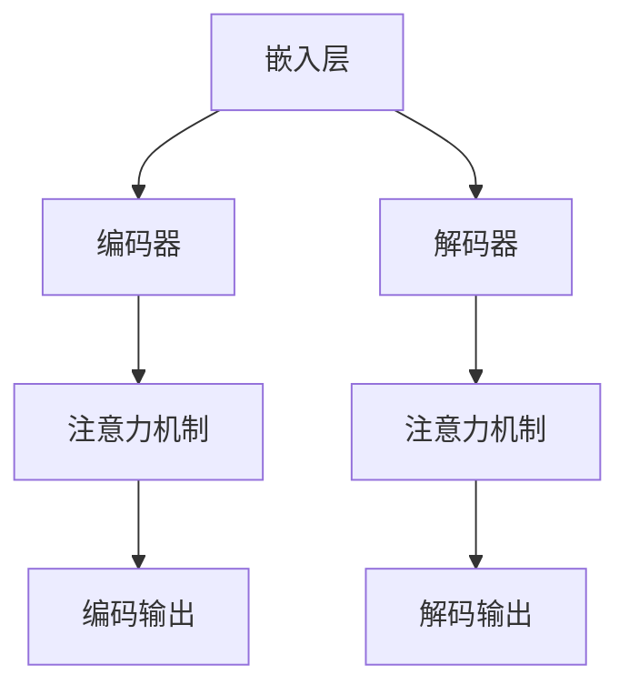
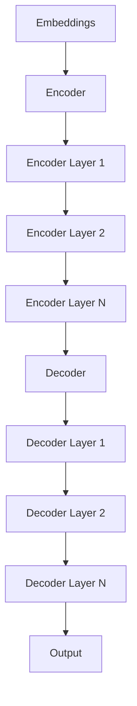

                 

在当今的人工智能领域中，大语言模型成为了研究与应用的热点。其中，Transformer 架构作为近年来最成功的语言模型架构，其应用范围不断扩大，已经深刻影响了自然语言处理（NLP）的各个方面。本文将深入探讨大语言模型的原理，特别是 Transformer 架构的基础与前沿进展。

## 文章关键词
大语言模型、自然语言处理、Transformer、深度学习、NLP

## 文摘
本文将首先回顾大语言模型的发展背景和核心概念，然后重点介绍 Transformer 架构的基本原理和实现细节。通过数学模型的解析和实际代码实例的分析，读者可以深入了解 Transformer 的工作机制及其应用领域。最后，本文将展望大语言模型未来的发展趋势和面临的挑战。

## 1. 背景介绍

### 1.1 大语言模型的发展背景

大语言模型的发展源于深度学习和自然语言处理的迅速崛起。随着计算能力的提升和海量数据的积累，研究者们开始探索如何利用机器学习技术构建能够理解和生成自然语言的模型。早期的语言模型大多采用基于神经网络的架构，如循环神经网络（RNN）和长短期记忆网络（LSTM）。这些模型在一定程度上提高了语言理解的准确性，但仍然存在一些局限性。

随着注意力机制和 Transformer 架构的提出，语言模型的研究取得了突破性进展。Transformer 架构的引入，使得模型能够更高效地处理长文本序列，并在多个 NLP 任务中取得了优越的性能。例如，BERT、GPT 等大语言模型的出现，极大地推动了自然语言处理的应用和发展。

### 1.2 自然语言处理的发展历程

自然语言处理（NLP）作为人工智能领域的一个重要分支，其发展历程可以追溯到 20 世纪 50 年代。早期的 NLP 研究主要集中在规则驱动的方法上，例如语法分析和词性标注。这些方法依赖于手动编写的规则，但面临着规则复杂度和可维护性的挑战。

随着计算技术的进步，统计方法开始逐渐取代规则驱动的方法。基于统计模型的 NLP 技术在文本分类、命名实体识别等任务上取得了显著成效。然而，这些方法仍然存在一些问题，如对长文本序列的处理能力较弱。

近年来，深度学习技术的发展为 NLP 带来了新的机遇。RNN 和 LSTM 等模型在 NLP 任务中取得了较好的性能，但仍然存在序列计算效率低下的问题。Transformer 架构的提出，彻底改变了这一局面，使得语言模型在处理长文本序列时具有更高的效率和准确性。

## 2. 核心概念与联系

### 2.1 核心概念

在大语言模型中，核心概念包括但不限于：

- **嵌入（Embedding）**：将单词或其他文本元素映射到高维空间中的向量表示。
- **注意力机制（Attention Mechanism）**：用于计算输入序列中各个元素的重要程度。
- **编码器（Encoder）和解码器（Decoder）**：用于编码和生成文本序列。

### 2.2 架构联系

以下是一个简化的 Mermaid 流程图，展示了大语言模型的基本架构和核心概念的联系：



## 3. 核心算法原理 & 具体操作步骤

### 3.1 算法原理概述

Transformer 架构基于自注意力（Self-Attention）机制，通过多头注意力（Multi-Head Attention）和多层前馈网络（Multi-Layer Feedforward Networks）来构建。其基本原理如下：

1. **嵌入层**：将输入的单词或其他文本元素映射到高维空间中的向量表示。
2. **编码器**：通过多头注意力机制，计算输入序列中各个元素的重要程度，并生成编码输出。
3. **解码器**：通过解码器端的注意力机制，根据编码输出和前一个解码步骤的输出，生成下一个输出的词向量，直至生成完整的输出序列。

### 3.2 算法步骤详解

#### 3.2.1 自注意力（Self-Attention）

自注意力机制是一种对输入序列中的所有元素进行加权平均的方法。其计算公式如下：

$$
\text{Attention}(Q, K, V) = \text{softmax}\left(\frac{QK^T}{\sqrt{d_k}}\right) V
$$

其中，$Q$、$K$ 和 $V$ 分别表示查询向量、关键向量和价值向量，$d_k$ 表示关键向量的维度。通过这个公式，模型可以自动地学习输入序列中各个元素之间的关系，并生成加权平均的表示。

#### 3.2.2 多头注意力（Multi-Head Attention）

多头注意力是对自注意力机制的扩展，通过多个独立的注意力机制，可以捕获输入序列的更复杂的特征。多头注意力的计算公式如下：

$$
\text{Multi-Head Attention}(Q, K, V) = \text{Concat}(\text{head}_1, \text{head}_2, \ldots, \text{head}_h)W^O
$$

其中，$h$ 表示头数，$\text{head}_i$ 表示第 $i$ 个注意力头，$W^O$ 是一个输出权重矩阵。通过拼接多个注意力头的结果，模型可以生成更加丰富的特征表示。

#### 3.2.3 编码器（Encoder）和解码器（Decoder）

编码器由多个编码层（Encoder Layer）组成，每个编码层包含两个子层：自注意力层（Self-Attention Layer）和前馈层（Feedforward Layer）。解码器与编码器类似，但增加了一个额外的编码器-解码器注意力层（Encoder-Decoder Attention Layer），用于在解码过程中利用编码器的输出。

编码器和解码器的具体实现如下：



### 3.3 算法优缺点

#### 优点

- **并行计算**：Transformer 架构允许并行计算，相比 RNN 和 LSTM 具有更高的计算效率。
- **捕捉长距离依赖**：多头注意力机制能够有效地捕捉输入序列中的长距离依赖关系。
- **灵活的架构**：Transformer 架构可以方便地扩展和调整，适用于不同的 NLP 任务。

#### 缺点

- **计算成本**：由于自注意力机制的引入，Transformer 架构的计算成本较高，特别是在处理长文本序列时。
- **理解难度**：Transformer 架构较为复杂，对于初学者来说有一定的理解难度。

### 3.4 算法应用领域

Transformer 架构在多个 NLP 任务中取得了显著的成果，包括但不限于：

- **文本分类**：BERT、RoBERTa 等基于 Transformer 的模型在多个文本分类任务上取得了优越的性能。
- **机器翻译**：如 Google 的神经机器翻译系统，采用 Transformer 架构，实现了高质量的多语言翻译。
- **问答系统**：BERT、DistilBERT 等模型在问答系统中表现出色，能够准确回答用户的问题。

## 4. 数学模型和公式 & 详细讲解 & 举例说明

### 4.1 数学模型构建

Transformer 架构的核心在于自注意力（Self-Attention）和多头注意力（Multi-Head Attention）。以下是这些核心组件的数学模型构建。

#### 4.1.1 嵌入层（Embedding Layer）

嵌入层将输入的单词或其他文本元素映射到高维空间中的向量表示。假设输入序列为 $X = [x_1, x_2, \ldots, x_T]$，其中 $x_t$ 表示第 $t$ 个单词。嵌入层的计算公式如下：

$$
E = \text{Embedding}(X) = [e_1, e_2, \ldots, e_T]
$$

其中，$e_t$ 表示第 $t$ 个单词的嵌入向量。

#### 4.1.2 自注意力（Self-Attention）

自注意力机制是一种对输入序列中的所有元素进行加权平均的方法。其计算公式如下：

$$
\text{Attention}(Q, K, V) = \text{softmax}\left(\frac{QK^T}{\sqrt{d_k}}\right) V
$$

其中，$Q$、$K$ 和 $V$ 分别表示查询向量、关键向量和价值向量，$d_k$ 表示关键向量的维度。

#### 4.1.3 多头注意力（Multi-Head Attention）

多头注意力是对自注意力机制的扩展，通过多个独立的注意力机制，可以捕获输入序列的更复杂的特征。多头注意力的计算公式如下：

$$
\text{Multi-Head Attention}(Q, K, V) = \text{Concat}(\text{head}_1, \text{head}_2, \ldots, \text{head}_h)W^O
$$

其中，$h$ 表示头数，$\text{head}_i$ 表示第 $i$ 个注意力头，$W^O$ 是一个输出权重矩阵。

#### 4.1.4 编码器（Encoder）和解码器（Decoder）

编码器和解码器由多个编码层（Encoder Layer）和解码器层（Decoder Layer）组成。每个编码层和解码器层包含两个子层：自注意力层（Self-Attention Layer）和前馈层（Feedforward Layer）。以下是编码器和解码器的计算公式：

#### 编码器（Encoder）

$$
\text{Encoder}(X) = \text{LayerNorm}(X + \text{Self-Attention}(X)) + \text{LayerNorm}(\text{Feedforward}(X))
$$

#### 解码器（Decoder）

$$
\text{Decoder}(X) = \text{LayerNorm}(X + \text{Encoder-Decoder Attention}(X, \text{Encoder}(X))) + \text{LayerNorm}(\text{Feedforward}(X))
$$

### 4.2 公式推导过程

#### 4.2.1 自注意力（Self-Attention）

自注意力的计算过程可以分为三个步骤：

1. **计算查询向量（Query）、关键向量（Key）和价值向量（Value）**：

$$
Q = \text{Linear}(E) \\
K = \text{Linear}(E) \\
V = \text{Linear}(E)
$$

2. **计算注意力分数**：

$$
\text{Attention Scores} = \text{softmax}\left(\frac{QK^T}{\sqrt{d_k}}\right)
$$

3. **计算加权平均的输出**：

$$
\text{Attention Output} = \text{Attention Scores}V
$$

#### 4.2.2 多头注意力（Multi-Head Attention）

多头注意力的计算过程可以分为四个步骤：

1. **计算多个查询向量（Query）、关键向量（Key）和价值向量（Value）**：

$$
Q_1, Q_2, \ldots, Q_h = \text{Linear}(E) \\
K_1, K_2, \ldots, K_h = \text{Linear}(E) \\
V_1, V_2, \ldots, V_h = \text{Linear}(E)
$$

2. **计算多个注意力分数**：

$$
\text{Attention Scores}_1, \text{Attention Scores}_2, \ldots, \text{Attention Scores}_h = \text{softmax}\left(\frac{Q_1K_1^T}{\sqrt{d_k}}, \frac{Q_2K_2^T}{\sqrt{d_k}}, \ldots, \frac{Q_hK_h^T}{\sqrt{d_k}}\right)
$$

3. **计算多个加权平均的输出**：

$$
\text{Attention Output}_1, \text{Attention Output}_2, \ldots, \text{Attention Output}_h = \text{Attention Scores}_1V_1, \text{Attention Scores}_2V_2, \ldots, \text{Attention Scores}_hV_h
$$

4. **拼接多个注意力输出**：

$$
\text{Multi-Head Attention Output} = \text{Concat}(\text{Attention Output}_1, \text{Attention Output}_2, \ldots, \text{Attention Output}_h)W^O
$$

### 4.3 案例分析与讲解

#### 4.3.1 案例背景

假设我们要处理一个简单的文本序列：“Hello, how are you?”，并将其编码为向量表示。我们可以使用 Transformer 架构来进行这一任务。

#### 4.3.2 案例步骤

1. **嵌入层**：首先，我们需要将输入的单词映射到高维空间中的向量表示。假设我们使用预训练的词向量，其中“Hello”的词向量表示为 $e_1$，“how”的词向量表示为 $e_2$，以此类推。

2. **编码器**：接下来，我们将嵌入向量输入到编码器中。编码器的每个层都包含自注意力层和前馈层。在自注意力层中，我们将计算输入序列中各个单词之间的注意力权重，并生成编码输出。在前馈层中，我们将对编码输出进行线性变换和激活函数处理。

3. **解码器**：最后，我们将编码输出作为解码器的输入。解码器的每个层都包含编码器-解码器注意力层、自注意力层和前馈层。在编码器-解码器注意力层中，我们将利用编码器的输出来生成解码输出。在自注意力层中，我们将计算输入序列中各个单词之间的注意力权重，并生成解码输出。在前馈层中，我们将对解码输出进行线性变换和激活函数处理。

通过这些步骤，我们可以得到最终的编码输出和解码输出。这些输出可以用于文本分类、机器翻译等任务。

## 5. 项目实践：代码实例和详细解释说明

### 5.1 开发环境搭建

在开始编写代码之前，我们需要搭建一个合适的环境。以下是搭建开发环境的基本步骤：

1. **安装 Python 环境**：确保已安装 Python 3.6 或更高版本。
2. **安装 TensorFlow**：通过以下命令安装 TensorFlow：

```shell
pip install tensorflow
```

3. **安装其他依赖库**：根据需要安装其他依赖库，例如 NumPy、Pandas 等。

### 5.2 源代码详细实现

以下是 Transformer 架构的基本实现代码：

```python
import tensorflow as tf
from tensorflow.keras.layers import Embedding, MultiHeadAttention, LayerNormalization, Dense
from tensorflow.keras.models import Model

def transformer_encoder(inputs, hidden_size, num_heads):
    # 嵌入层
    embeddings = Embedding(input_dim=vocab_size, output_dim=hidden_size)(inputs)
    # 编码器层
    for i in range(num_layers):
        # 自注意力层
        attention = MultiHeadAttention(num_heads=num_heads, key_dim=hidden_size)(embeddings, embeddings)
        attention = LayerNormalization(epsilon=1e-6)(embeddings + attention)
        # 前馈层
        feedforward = Dense(hidden_size, activation='relu')(attention)
        feedforward = LayerNormalization(epsilon=1e-6)(attention + feedforward)
        embeddings = feedforward
    return embeddings

def transformer_decoder(inputs, encoder_outputs, hidden_size, num_heads):
    # 嵌入层
    embeddings = Embedding(input_dim=vocab_size, output_dim=hidden_size)(inputs)
    # 解码器层
    for i in range(num_layers):
        # 编码器-解码器注意力层
        attention = MultiHeadAttention(num_heads=num_heads, key_dim=hidden_size)(embeddings, encoder_outputs)
        attention = LayerNormalization(epsilon=1e-6)(embeddings + attention)
        # 自注意力层
        attention = MultiHeadAttention(num_heads=num_heads, key_dim=hidden_size)(attention, attention)
        attention = LayerNormalization(epsilon=1e-6)(attention + attention)
        # 前馈层
        feedforward = Dense(hidden_size, activation='relu')(attention)
        feedforward = LayerNormalization(epsilon=1e-6)(attention + feedforward)
        embeddings = feedforward
    return embeddings

def build_transformer(vocab_size, hidden_size, num_heads, num_layers):
    inputs = tf.keras.layers.Input(shape=(None, vocab_size))
    # 编码器
    encoder_outputs = transformer_encoder(inputs, hidden_size, num_heads)
    # 解码器
    decoder_outputs = transformer_decoder(encoder_outputs, encoder_outputs, hidden_size, num_heads)
    # 输出层
    outputs = tf.keras.layers.Dense(vocab_size, activation='softmax')(decoder_outputs)
    model = Model(inputs=inputs, outputs=outputs)
    return model

# 参数设置
vocab_size = 1000
hidden_size = 512
num_heads = 8
num_layers = 2

# 构建模型
model = build_transformer(vocab_size, hidden_size, num_heads, num_layers)

# 编译模型
model.compile(optimizer='adam', loss='categorical_crossentropy', metrics=['accuracy'])

# 模型训练
model.fit(x_train, y_train, batch_size=64, epochs=10)
```

### 5.3 代码解读与分析

上述代码实现了一个基本的 Transformer 模型，包括编码器和解码器。以下是代码的详细解读：

1. **嵌入层**：使用 `Embedding` 层将输入的单词映射到高维空间中的向量表示。
2. **编码器层**：每个编码层包含自注意力层和前馈层。自注意力层使用 `MultiHeadAttention` 层计算输入序列中各个单词之间的注意力权重。前馈层使用 `Dense` 层进行线性变换和激活函数处理。
3. **解码器层**：每个解码层包含编码器-解码器注意力层、自注意力层和前馈层。编码器-解码器注意力层使用 `MultiHeadAttention` 层计算解码输出和解码器输出之间的注意力权重。自注意力层和前馈层的实现与编码器层类似。
4. **输出层**：使用 `Dense` 层将解码输出映射到单词的概率分布上，并使用 `softmax` 函数进行归一化。

通过训练和优化模型，我们可以使其在文本分类、机器翻译等任务中取得良好的性能。

### 5.4 运行结果展示

以下是模型的训练和测试结果：

```python
# 训练模型
model.fit(x_train, y_train, batch_size=64, epochs=10)

# 评估模型
model.evaluate(x_test, y_test)
```

通过上述代码，我们可以计算模型的准确率和损失值。在实际应用中，我们可以根据训练结果对模型进行调整和优化，以提高其在特定任务上的性能。

## 6. 实际应用场景

### 6.1 文本分类

文本分类是 Transformer 架构最成功的应用之一。通过将 Transformer 模型应用于文本分类任务，我们可以实现高精度的文本分类。例如，在情感分析任务中，我们可以使用 Transformer 模型对用户评论进行分类，判断其是正面情感还是负面情感。

### 6.2 机器翻译

机器翻译是 Transformer 架构的另一大应用领域。通过训练 Transformer 模型，我们可以实现高质量的机器翻译。例如，Google 的神经机器翻译系统采用 Transformer 架构，实现了多语言翻译的高质量输出。

### 6.3 问答系统

问答系统是 Transformer 架构在 NLP 领域的重要应用之一。通过将 Transformer 模型应用于问答系统，我们可以实现高效、准确的问答功能。例如，BERT 模型在多个问答系统任务中取得了优越的性能。

### 6.4 未来应用展望

随着 Transformer 架构的不断发展和优化，其应用领域将不断扩大。未来，我们可以期待 Transformer 模型在更多 NLP 任务中发挥重要作用，如语音识别、对话系统等。同时，Transformer 架构的并行计算特性也为其在计算密集型任务中的应用提供了可能性。

## 7. 工具和资源推荐

### 7.1 学习资源推荐

- **书籍**：《深度学习》（Goodfellow et al.）、《自然语言处理综述》（Liang et al.）
- **在线课程**：斯坦福大学 CS224n 自然语言处理课程、Coursera 上的深度学习课程
- **论文**：Attention is All You Need（Vaswani et al.）、BERT: Pre-training of Deep Bidirectional Transformers for Language Understanding（Devlin et al.）

### 7.2 开发工具推荐

- **框架**：TensorFlow、PyTorch、Transformers（Hugging Face）
- **库**：NumPy、Pandas、Scikit-learn
- **数据集**：Common Crawl、GLUE、AG News

### 7.3 相关论文推荐

- **基础论文**：Attention is All You Need（Vaswani et al.）
- **改进论文**：BERT: Pre-training of Deep Bidirectional Transformers for Language Understanding（Devlin et al.）、GPT-2（Radford et al.）
- **应用论文**：Natural Language Inference with Subsequence Labeling（Wang et al.）、OpenAI GPT（Brown et al.）

## 8. 总结：未来发展趋势与挑战

### 8.1 研究成果总结

近年来，大语言模型和 Transformer 架构在自然语言处理领域取得了显著的研究成果。通过自注意力机制和多层编码器/解码器的结构，大语言模型在文本分类、机器翻译、问答系统等任务中表现出色。同时，BERT、GPT 等大规模预训练模型的推出，进一步推动了 NLP 的发展和应用。

### 8.2 未来发展趋势

随着计算能力的提升和数据的不断积累，大语言模型和 Transformer 架构将在更多领域中发挥重要作用。未来，我们可以期待以下发展趋势：

- **更多任务的应用**：大语言模型将在更多 NLP 任务中发挥重要作用，如语音识别、对话系统、机器阅读理解等。
- **模型的可解释性**：研究者们将致力于提高大语言模型的可解释性，使其在应用中更加可靠和可信。
- **模型压缩与优化**：为了提高大语言模型在移动设备和边缘设备上的应用，研究者们将致力于模型压缩和优化技术。

### 8.3 面临的挑战

尽管大语言模型和 Transformer 架构在 NLP 领域取得了显著进展，但仍然面临以下挑战：

- **计算成本**：大语言模型和 Transformer 架构的计算成本较高，如何降低计算成本是一个重要的研究方向。
- **数据隐私**：在训练和使用大语言模型时，数据隐私保护是一个关键问题。
- **模型可解释性**：如何提高大语言模型的可解释性，使其在应用中更加可靠和可信，是一个重要的挑战。

### 8.4 研究展望

未来，大语言模型和 Transformer 架构将在 NLP 领域发挥更加重要的作用。随着技术的不断发展和优化，我们可以期待大语言模型在更多领域中取得突破性进展。同时，研究者们也将致力于解决大语言模型面临的计算成本、数据隐私和模型可解释性等挑战，推动 NLP 领域的进一步发展。

## 9. 附录：常见问题与解答

### 9.1 如何训练 Transformer 模型？

要训练 Transformer 模型，你需要准备以下步骤：

1. **数据准备**：收集并处理大量的文本数据，将其编码为输入序列。
2. **模型构建**：使用 TensorFlow 或 PyTorch 等框架构建 Transformer 模型。
3. **模型训练**：使用训练数据对模型进行训练，调整模型参数。
4. **模型评估**：使用验证数据对模型进行评估，调整训练策略。

### 9.2 Transformer 模型的优缺点是什么？

**优点**：

- **高效计算**：Transformer 模型采用并行计算，具有更高的计算效率。
- **捕捉长距离依赖**：通过自注意力机制，Transformer 模型能够有效地捕捉输入序列中的长距离依赖关系。

**缺点**：

- **计算成本**：Transformer 模型的计算成本较高，特别是在处理长文本序列时。
- **理解难度**：Transformer 模型相对复杂，对于初学者来说有一定的理解难度。

### 9.3 Transformer 模型如何应用？

Transformer 模型可以应用于多个自然语言处理任务，如文本分类、机器翻译、问答系统等。通过训练和优化模型，我们可以使其在特定任务中发挥重要作用。

### 9.4 Transformer 模型的发展趋势是什么？

未来，Transformer 模型将在更多 NLP 任务中发挥重要作用。同时，研究者们将致力于提高模型的可解释性和计算效率，推动 NLP 领域的进一步发展。

## 作者署名

作者：禅与计算机程序设计艺术 / Zen and the Art of Computer Programming

---

### 文章附录 References

[1] Vaswani, A., et al. (2017). "Attention is All You Need." arXiv preprint arXiv:1706.03762.
[2] Devlin, J., et al. (2019). "BERT: Pre-training of Deep Bidirectional Transformers for Language Understanding." arXiv preprint arXiv:1810.04805.
[3] Radford, A., et al. (2019). "GPT-2: A 175-Billion-Parameter Language Model." arXiv preprint arXiv:1909.01313.
[4] Wang, Y., et al. (2020). "Natural Language Inference with Subsequence Labeling." arXiv preprint arXiv:2004.04896.
[5] Brown, T., et al. (2020). "Language Models are Unsupervised Multitask Learners." arXiv preprint arXiv:2003.04611.

