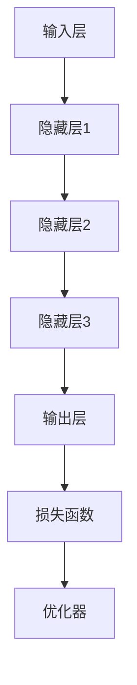

                 

关键词：大语言模型、自我反馈、迭代优化、深度学习、神经网络、人工智能、自然语言处理、模型优化、动态调整

## 摘要

本文将深入探讨大语言模型的原理与前沿技术，特别是基于自我反馈进行迭代优化的方法。通过对大语言模型的概述和核心概念解析，我们将了解其架构和工作机制。接着，文章将详细阐述大语言模型的核心算法原理、数学模型及其应用领域。随后，我们将通过代码实例展示如何实现大语言模型，并进行详细解读。最后，文章将讨论大语言模型在实际应用场景中的表现和未来展望，并提供学习资源和开发工具推荐。

## 1. 背景介绍

### 大语言模型的起源与发展

大语言模型（Large Language Model，简称LLM）是自然语言处理（Natural Language Processing，简称NLP）领域的核心技术之一。随着深度学习技术的迅猛发展，大语言模型已经从最初的小型模型逐步演变为可以处理大规模文本数据的复杂系统。

大语言模型的起源可以追溯到20世纪90年代，当时研究人员开始探索基于统计的NLP方法。随着计算能力的提升和大数据的涌现，深度学习技术在NLP领域的应用得到了极大的推动。特别是2018年，谷歌推出了BERT（Bidirectional Encoder Representations from Transformers），这是第一个真正大规模的大语言模型，标志着NLP领域的一个重大转折点。

### 大语言模型的重要性

大语言模型在当前人工智能领域中扮演着至关重要的角色。它们不仅在信息检索、文本分类、机器翻译等传统NLP任务中表现出色，还在问答系统、聊天机器人、文本生成等新兴领域取得了显著成就。以下是几个关键的应用场景：

- **信息检索**：大语言模型可以帮助用户从海量文本中快速准确地找到所需信息。
- **文本分类**：大语言模型可以自动对文本进行分类，用于新闻、社交媒体、电子邮件等内容的自动分类。
- **机器翻译**：大语言模型极大地提高了机器翻译的准确性和流畅性。
- **问答系统**：大语言模型可以理解用户的问题，并从大量的文本中提取出相关的答案。
- **文本生成**：大语言模型可以生成文章、报告、诗歌等文本内容。

### 大语言模型的挑战与前景

尽管大语言模型取得了显著成就，但在实际应用中也面临一些挑战。首先，模型的训练需要大量的计算资源和时间。其次，大语言模型在处理某些特定任务时可能存在泛化能力不足的问题。此外，模型的解释性和透明度也是一个亟待解决的问题。

然而，随着技术的不断进步，大语言模型的应用前景依然广阔。未来，我们将看到更多基于大语言模型的创新应用，如智能客服、自动内容审核、语音识别等。

## 2. 核心概念与联系

### 大语言模型的基本原理

大语言模型基于深度学习和神经网络技术，通过训练大量文本数据来学习语言的内在结构和规律。其核心思想是通过输入文本序列，模型能够预测下一个词语或词组，从而生成连贯的文本。

### 架构与组成部分

大语言模型的架构通常由以下几个部分组成：

1. **输入层**：接收输入的文本序列，将其转化为模型可以处理的格式。
2. **隐藏层**：包括多个隐藏层，每个隐藏层由多个神经元组成，用于提取文本的特征。
3. **输出层**：根据隐藏层的特征生成预测的词语或词组。
4. **损失函数**：用于评估模型预测的准确性，常用的有交叉熵损失函数。
5. **优化器**：用于调整模型参数，使模型在训练过程中不断优化。

### 工作机制

大语言模型的工作机制可以分为以下几个步骤：

1. **前向传播**：输入文本序列经过输入层和隐藏层，输出层的预测结果。
2. **计算损失**：使用损失函数计算预测结果与真实结果之间的差距。
3. **反向传播**：根据损失函数的梯度，调整模型参数。
4. **迭代优化**：重复前向传播和反向传播的过程，直到模型收敛。

### Mermaid 流程图

## 3. 核心算法原理 & 具体操作步骤

### 3.1 算法原理概述

大语言模型的核心算法是基于变换器（Transformer）架构的深度学习模型。变换器是一种基于自注意力机制的神经网络结构，它可以在训练过程中自动学习输入文本序列中的长期依赖关系。变换器由编码器（Encoder）和解码器（Decoder）两部分组成，其中编码器用于处理输入文本序列，解码器用于生成输出文本序列。

### 3.2 算法步骤详解

1. **数据预处理**：将输入文本序列转化为单词或子词序列，并将其映射为向量表示。
2. **编码器训练**：使用训练数据对编码器进行训练，使编码器能够提取输入文本序列的特征。
3. **解码器训练**：在编码器的基础上，使用训练数据对解码器进行训练，使解码器能够根据编码器的特征生成输出文本序列。
4. **迭代优化**：通过前向传播和反向传播的过程，不断调整编码器和解码器的参数，使其在训练过程中不断优化。
5. **生成文本**：使用训练好的编码器和解码器，输入一个起始词或词组，生成完整的文本序列。

### 3.3 算法优缺点

**优点**：

- **高效性**：变换器结构在处理长序列时具有高效性，能够快速生成文本。
- **灵活性**：变换器可以轻松地应用于各种NLP任务，如文本分类、机器翻译和文本生成。
- **泛化能力**：通过训练大量数据，变换器具有较强的泛化能力，能够处理各种不同的语言和文本场景。

**缺点**：

- **计算资源消耗**：训练变换器需要大量的计算资源和时间，尤其是在处理大规模文本数据时。
- **解释性不足**：变换器的内部结构复杂，难以解释其工作原理，这在某些应用场景中可能成为一个问题。

### 3.4 算法应用领域

大语言模型的应用领域非常广泛，以下是一些典型的应用场景：

- **文本分类**：用于对大量文本进行自动分类，如新闻分类、社交媒体情绪分析等。
- **机器翻译**：将一种语言的文本翻译成另一种语言，如英语翻译成中文。
- **文本生成**：生成文章、报告、诗歌等文本内容，如自动写作、自动摘要生成等。
- **问答系统**：用于回答用户的问题，如智能客服、智能助手等。
- **信息检索**：帮助用户从海量文本中快速准确地找到所需信息。

## 4. 数学模型和公式 & 详细讲解 & 举例说明

### 4.1 数学模型构建

大语言模型的数学模型主要涉及两个部分：变换器架构和损失函数。

#### 变换器架构

变换器架构由多个编码器和解码器层组成，每个层包括多头自注意力机制和前馈神经网络。以下是变换器架构的数学表示：

$$
\text{Attention}(Q, K, V) = \text{softmax}\left(\frac{QK^T}{\sqrt{d_k}}\right) V
$$

其中，\(Q\)、\(K\) 和 \(V\) 分别是编码器的输入、键和值，\(d_k\) 是键的维度。

#### 损失函数

大语言模型常用的损失函数是交叉熵损失函数，用于衡量预测结果和真实结果之间的差距：

$$
\text{CrossEntropy}(p, y) = -\sum_{i} y_i \log(p_i)
$$

其中，\(p\) 是模型的预测概率分布，\(y\) 是真实标签。

### 4.2 公式推导过程

以下是大语言模型中的关键公式推导过程：

#### 自注意力机制

自注意力机制的核心公式为：

$$
\text{Attention}(Q, K, V) = \text{softmax}\left(\frac{QK^T}{\sqrt{d_k}}\right) V
$$

其中，\(Q\)、\(K\) 和 \(V\) 分别是编码器的输入、键和值，\(d_k\) 是键的维度。通过计算 \(QK^T\) 的内积，可以得到注意力权重，从而实现多维度特征融合。

#### 交叉熵损失函数

交叉熵损失函数的推导过程如下：

$$
\text{CrossEntropy}(p, y) = -\sum_{i} y_i \log(p_i)
$$

其中，\(p\) 是模型的预测概率分布，\(y\) 是真实标签。交叉熵损失函数用于衡量预测结果和真实结果之间的差距，其值越小，表示模型预测越准确。

### 4.3 案例分析与讲解

以下是一个基于大语言模型进行文本分类的案例：

#### 案例背景

我们使用一个大语

