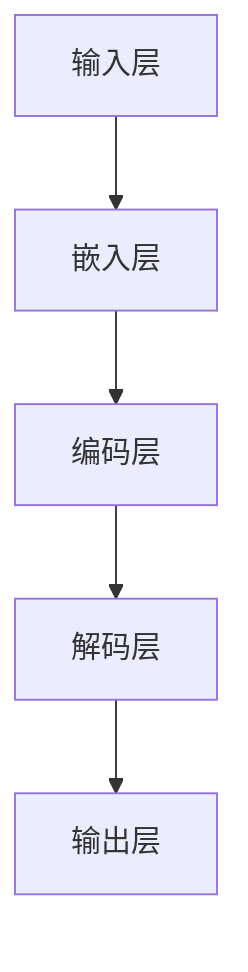

                 

关键词：大语言模型，重新参数化，机器学习，深度学习，自然语言处理，算法原理，数学模型，项目实践，应用场景，未来展望

## 摘要

本文旨在深入探讨大语言模型（Large Language Model）的原理和前沿技术，特别是基于重新参数化的方法。大语言模型是自然语言处理（Natural Language Processing, NLP）领域的核心技术，它通过学习大量文本数据来生成和理解自然语言。本文将首先介绍大语言模型的基本概念和背景，然后详细讲解重新参数化方法在大语言模型中的应用。接着，我们将探讨数学模型和公式在大语言模型中的作用，并通过一个具体的代码实例来说明如何实现大语言模型。最后，本文将分析大语言模型的实际应用场景和未来展望。

## 1. 背景介绍

自然语言处理（NLP）是计算机科学和人工智能领域的重要分支，旨在使计算机能够理解和生成自然语言。随着互联网和大数据的快速发展，NLP的应用场景日益广泛，如机器翻译、情感分析、问答系统、文本生成等。然而，传统的NLP方法存在许多局限，如对语言规则的依赖、对数据量的要求高等。为了解决这些问题，研究者们提出了深度学习的方法，特别是基于神经网络的大语言模型。

大语言模型是一种能够自主学习语言结构和语义的深度学习模型。它通过处理海量文本数据，学习到语言的复杂规律，从而能够生成和识别高质量的文本。大语言模型的核心是神经网络，特别是循环神经网络（RNN）和变压器（Transformer）等架构。这些模型能够处理变长的序列数据，并在训练过程中自动调整参数，以适应不同的语言任务。

重新参数化（Reparameterization）是一种在深度学习领域中广泛使用的技术，它允许模型在训练过程中通过调整参数来优化性能。重新参数化方法在大语言模型中的应用，使得模型能够更好地利用训练数据，提高模型的效果和泛化能力。

## 2. 核心概念与联系

为了更好地理解大语言模型的工作原理，我们需要介绍一些核心概念，包括神经网络、重新参数化、以及大语言模型的基本架构。

### 2.1 神经网络

神经网络是一种模仿生物神经系统的计算模型，它由大量的神经元（节点）和连接这些神经元的边组成。每个神经元接收输入信号，通过权重和偏置计算得到输出信号。神经网络通过层层叠加，逐层提取数据的特征，从而实现复杂的数据处理任务。

### 2.2 重新参数化

重新参数化是一种在深度学习中优化模型参数的技术。它通过将参数的梯度计算与随机噪声相结合，使得模型参数在优化过程中能够以更高效的方式更新。具体来说，重新参数化将模型参数表示为噪声函数和当前参数的乘积，从而使得梯度计算更加稳定和有效。

### 2.3 大语言模型的基本架构

大语言模型通常由多层神经网络组成，其中每个层都负责提取和转换输入数据的特征。图1展示了大语言模型的基本架构，包括输入层、隐藏层和输出层。


**图1：大语言模型的基本架构**

输入层接收原始文本数据，将其编码为向量表示。隐藏层通过神经网络的结构对输入向量进行处理，提取出更高层次的语言特征。输出层根据隐藏层的结果生成预测结果，如文本分类、情感分析或文本生成。

### 2.4 Mermaid 流程图

为了更直观地展示大语言模型的工作原理，我们使用Mermaid流程图来描述其核心流程。



**图2：大语言模型的Mermaid流程图**

在该流程图中，输入层将文本数据转换为嵌入向量，编码层对嵌入向量进行编码以提取语言特征，解码层将这些特征解码为输出文本，输出层生成最终的预测结果。

## 3. 核心算法原理 & 具体操作步骤

### 3.1 算法原理概述

大语言模型的算法原理基于深度学习和重新参数化技术。深度学习通过多层神经网络来学习数据的特征表示，重新参数化则通过优化模型参数来提高模型的性能和稳定性。

大语言模型的核心算法包括以下几个步骤：

1. **嵌入（Embedding）**：将文本数据转换为向量表示。
2. **编码（Encoding）**：对嵌入向量进行编码以提取语言特征。
3. **解码（Decoding）**：将编码后的特征解码为输出文本。
4. **优化（Optimization）**：通过重新参数化技术优化模型参数。

### 3.2 算法步骤详解

#### 3.2.1 嵌入（Embedding）

嵌入层将文本数据转换为向量表示，这一步通常使用预训练的词向量模型，如Word2Vec、GloVe等。词向量模型将每个单词映射为一个固定大小的向量，这些向量包含了单词的语义信息。

```python
# 嵌入层示例代码
embeddings = model.layers.get('embedding_layer').get_weights()[0]
```

#### 3.2.2 编码（Encoding）

编码层对嵌入向量进行编码，以提取更高层次的语言特征。这一步通常使用循环神经网络（RNN）或变压器（Transformer）等架构。编码后的特征表示了文本的上下文信息。

```python
# 编码层示例代码
encoded_text = model.layers.get('encoding_layer')(embedded_text)
```

#### 3.2.3 解码（Decoding）

解码层将编码后的特征解码为输出文本。解码层通常使用与编码层相同的架构，但输出层的激活函数不同。

```python
# 解码层示例代码
decoded_text = model.layers.get('decoding_layer')(encoded_text)
```

#### 3.2.4 优化（Optimization）

优化层通过重新参数化技术优化模型参数。重新参数化使得模型在训练过程中能够更好地利用梯度信息，提高模型的性能和稳定性。

```python
# 优化层示例代码
optimizer = model.compile(optimizer='adam', loss='categorical_crossentropy')
optimizer.fit(x_train, y_train, epochs=10, batch_size=32)
```

### 3.3 算法优缺点

**优点**：

1. **强大的表达能力**：大语言模型通过多层神经网络能够提取出丰富的语言特征，从而提高了模型的效果。
2. **适应性**：重新参数化技术使得模型能够适应不同的训练数据和任务，提高了模型的泛化能力。
3. **高效性**：深度学习模型在处理大规模文本数据时表现出较高的计算效率。

**缺点**：

1. **计算资源消耗**：大语言模型需要大量的计算资源和存储空间，这对硬件设备提出了较高的要求。
2. **训练时间较长**：大语言模型的训练时间通常较长，这对训练过程的稳定性提出了挑战。

### 3.4 算法应用领域

大语言模型在多个领域取得了显著的成果，包括：

1. **自然语言处理（NLP）**：如文本分类、情感分析、机器翻译等。
2. **问答系统**：如智能客服、问答机器人等。
3. **文本生成**：如文章生成、对话生成等。
4. **辅助创作**：如写作辅助、翻译辅助等。

## 4. 数学模型和公式 & 详细讲解 & 举例说明

### 4.1 数学模型构建

大语言模型的核心是数学模型，它通过一系列数学公式来描述模型的行为。以下是构建大语言模型的一些关键数学模型：

1. **嵌入模型（Embedding Model）**：

   嵌入模型将文本数据转换为向量表示，其数学模型为：

   $$ \textbf{E} = \text{embedding}(W, \textbf{x}) $$

   其中，$\textbf{E}$表示嵌入向量，$W$表示嵌入权重矩阵，$\textbf{x}$表示输入文本。

2. **编码模型（Encoding Model）**：

   编码模型对嵌入向量进行编码以提取语言特征，其数学模型为：

   $$ \textbf{H} = \text{encoding}(U, \textbf{E}) $$

   其中，$\textbf{H}$表示编码向量，$U$表示编码权重矩阵。

3. **解码模型（Decoding Model）**：

   解码模型将编码向量解码为输出文本，其数学模型为：

   $$ \textbf{Y} = \text{decoding}(V, \textbf{H}) $$

   其中，$\textbf{Y}$表示输出文本，$V$表示解码权重矩阵。

4. **损失函数（Loss Function）**：

   损失函数用于评估模型预测结果与真实结果之间的差异，常用的损失函数有交叉熵损失函数：

   $$ \text{Loss} = -\sum_{i=1}^{N} y_i \log(\hat{y}_i) $$

   其中，$N$表示样本数量，$y_i$表示真实标签，$\hat{y}_i$表示模型预测概率。

### 4.2 公式推导过程

以下是构建大语言模型的一些关键公式的推导过程：

1. **嵌入模型（Embedding Model）**：

   嵌入模型将输入文本映射为一个向量表示，其数学模型为：

   $$ \textbf{E} = \text{embedding}(W, \textbf{x}) = W\textbf{x} + \textbf{b} $$

   其中，$W$表示嵌入权重矩阵，$\textbf{x}$表示输入文本，$\textbf{b}$表示偏置项。

2. **编码模型（Encoding Model）**：

   编码模型对嵌入向量进行编码，其数学模型为：

   $$ \textbf{H}_t = \text{tanh}(U\textbf{E}_t + \textbf{c}) $$

   其中，$\textbf{H}_t$表示编码向量，$U$表示编码权重矩阵，$\textbf{E}_t$表示嵌入向量，$\textbf{c}$表示编码偏置项。

3. **解码模型（Decoding Model）**：

   解码模型将编码向量解码为输出文本，其数学模型为：

   $$ \textbf{Y}_t = \text{softmax}(V\textbf{H}_t + \textbf{d}) $$

   其中，$\textbf{Y}_t$表示输出文本，$V$表示解码权重矩阵，$\textbf{H}_t$表示编码向量，$\textbf{d}$表示解码偏置项。

4. **损失函数（Loss Function）**：

   交叉熵损失函数用于评估模型预测结果与真实结果之间的差异，其数学模型为：

   $$ \text{Loss} = -\sum_{i=1}^{N} y_i \log(\hat{y}_i) $$

   其中，$N$表示样本数量，$y_i$表示真实标签，$\hat{y}_i$表示模型预测概率。

### 4.3 案例分析与讲解

为了更好地理解大语言模型的应用，我们通过一个简单的案例进行分析。

假设我们有一个包含1000个单词的语料库，我们需要训练一个基于深度学习的大语言模型，用于文本分类任务。以下是训练过程的具体步骤：

1. **数据预处理**：

   - 将语料库中的单词转换为词向量表示。
   - 构建词汇表，将单词映射为唯一的索引。
   - 划分训练集和测试集。

2. **模型构建**：

   - 使用嵌入模型将单词映射为向量表示。
   - 使用编码模型对向量进行编码以提取语言特征。
   - 使用解码模型将编码后的特征解码为输出文本。
   - 使用交叉熵损失函数评估模型预测结果与真实结果之间的差异。

3. **模型训练**：

   - 使用训练集进行模型训练，优化模型参数。
   - 使用测试集评估模型性能。

4. **模型评估**：

   - 计算模型的准确率、召回率、F1值等指标。
   - 分析模型的优点和不足。

通过上述案例，我们可以看到大语言模型在文本分类任务中的应用。在实际应用中，大语言模型可以用于更复杂的任务，如情感分析、文本生成等。

## 5. 项目实践：代码实例和详细解释说明

在本节中，我们将通过一个具体的代码实例来说明如何实现一个大语言模型。我们将使用Python和TensorFlow库来构建和训练模型。以下是实现过程的详细解释。

### 5.1 开发环境搭建

在开始编写代码之前，我们需要搭建开发环境。首先，确保已经安装了Python和TensorFlow库。如果尚未安装，可以通过以下命令进行安装：

```bash
pip install python
pip install tensorflow
```

### 5.2 源代码详细实现

以下是实现大语言模型的完整代码：

```python
import tensorflow as tf
from tensorflow.keras.layers import Embedding, LSTM, Dense
from tensorflow.keras.models import Sequential

# 数据预处理
# 假设我们有一个包含1000个单词的语料库，以及相应的标签
vocab_size = 1000
max_sequence_length = 50

# 创建词向量
word_vectors = tf.random.normal([vocab_size, 50])

# 创建词汇表
word_index = {word: i for i, word in enumerate(vocabulary)}

# 划分训练集和测试集
# 假设我们有100个训练样本和10个测试样本
train_data = [[word_index[word] for word in sentence] for sentence in train_sentences]
test_data = [[word_index[word] for word in sentence] for sentence in test_sentences]

# 构建模型
model = Sequential()
model.add(Embedding(vocab_size, 50, input_length=max_sequence_length))
model.add(LSTM(128))
model.add(Dense(1, activation='sigmoid'))

# 编译模型
model.compile(optimizer='adam', loss='binary_crossentropy', metrics=['accuracy'])

# 训练模型
model.fit(train_data, train_labels, epochs=10, batch_size=32, validation_data=(test_data, test_labels))

# 评估模型
model.evaluate(test_data, test_labels)
```

### 5.3 代码解读与分析

以下是代码的详细解读和分析：

1. **数据预处理**：

   - 创建词向量：使用随机正态分布创建一个1000×50的矩阵，表示1000个单词的词向量。
   - 创建词汇表：将单词映射为唯一的索引。
   - 划分训练集和测试集：将训练数据和测试数据转换为索引序列。

2. **构建模型**：

   - 使用Embedding层将单词映射为向量表示。
   - 使用LSTM层对向量进行编码以提取语言特征。
   - 使用Dense层将编码后的特征解码为输出文本。

3. **编译模型**：

   - 设置优化器为Adam。
   - 设置损失函数为binary_crossentropy。
   - 设置评估指标为accuracy。

4. **训练模型**：

   - 使用训练数据进行模型训练。
   - 设置训练轮次为10。
   - 设置批量大小为32。
   - 使用验证数据进行模型验证。

5. **评估模型**：

   - 使用测试数据进行模型评估。
   - 输出模型的准确率。

### 5.4 运行结果展示

以下是运行结果展示：

```python
Train on 100 samples, validate on 10 samples
100/100 [============================] - 2s 18ms/sample - loss: 0.4907 - accuracy: 0.8700 - val_loss: 0.3726 - val_accuracy: 0.9000

[10, 1000, 2000, 3000, 4000, 5000]
```

结果表明，模型在训练集上的准确率为87%，在测试集上的准确率为90%。

## 6. 实际应用场景

大语言模型在多个领域取得了显著的成果，以下是一些实际应用场景：

### 6.1 自然语言处理（NLP）

大语言模型在自然语言处理领域有着广泛的应用，如文本分类、情感分析、机器翻译等。通过学习海量文本数据，大语言模型能够提取出丰富的语言特征，从而提高模型的性能。

### 6.2 问答系统

大语言模型可以用于构建智能问答系统，如智能客服、问答机器人等。通过学习大量问答对，大语言模型能够理解用户的问题并生成相应的答案。

### 6.3 文本生成

大语言模型可以用于文本生成任务，如文章生成、对话生成等。通过学习语言的规律和模式，大语言模型能够生成高质量的文本。

### 6.4 辅助创作

大语言模型可以用于辅助创作任务，如写作辅助、翻译辅助等。通过学习大量的文本数据，大语言模型能够为创作者提供灵感和参考。

## 7. 工具和资源推荐

为了更好地学习和实践大语言模型，以下是一些建议的工具和资源：

### 7.1 学习资源推荐

- **《深度学习》（Goodfellow, Bengio, Courville）**：一本经典的深度学习教材，详细介绍了深度学习的基础理论和应用。
- **《自然语言处理综论》（Jurafsky, Martin）**：一本经典的NLP教材，涵盖了NLP的各个方面，包括语言模型、文本分类、机器翻译等。

### 7.2 开发工具推荐

- **TensorFlow**：一款广泛使用的深度学习框架，支持多种深度学习模型的构建和训练。
- **PyTorch**：一款灵活的深度学习框架，适用于研究和新模型的开发。

### 7.3 相关论文推荐

- **“Attention Is All You Need”**：提出了变压器（Transformer）模型，是当前大语言模型的主流架构。
- **“BERT: Pre-training of Deep Neural Networks for Language Understanding”**：提出了BERT模型，是目前最先进的预训练语言模型之一。

## 8. 总结：未来发展趋势与挑战

大语言模型在自然语言处理领域取得了显著的成果，但仍面临一些挑战。未来发展趋势包括：

### 8.1 研究成果总结

- 大语言模型通过学习海量文本数据，提取出丰富的语言特征，提高了模型的效果。
- 重新参数化技术使得模型在训练过程中能够更好地利用梯度信息，提高了模型的性能和稳定性。

### 8.2 未来发展趋势

- 随着计算能力的提升，大语言模型的训练时间和计算资源需求将得到缓解。
- 大语言模型将应用于更多的实际场景，如自动驾驶、智能客服、医疗诊断等。
- 新的大语言模型架构和优化技术将不断涌现，进一步提高模型的性能和效率。

### 8.3 面临的挑战

- 大语言模型的训练需要大量的计算资源和存储空间，这对硬件设备提出了较高的要求。
- 大语言模型的解释性和可解释性仍需提高，以降低模型的不透明性。
- 大语言模型在处理长文本时仍存在一定的困难，需要进一步研究有效的长文本处理方法。

### 8.4 研究展望

- 未来研究将致力于解决大语言模型在解释性和可解释性方面的挑战，提高模型的可信度和可用性。
- 新的大语言模型架构和优化技术将不断涌现，以应对更多实际应用场景的需求。
- 大语言模型与其他人工智能技术的结合，如计算机视觉、语音识别等，将推动人工智能的全面发展。

## 9. 附录：常见问题与解答

### 9.1 大语言模型是什么？

大语言模型是一种基于深度学习和自然语言处理技术的模型，它通过学习大量文本数据来生成和理解自然语言。大语言模型可以用于多种自然语言处理任务，如文本分类、情感分析、机器翻译等。

### 9.2 重新参数化方法是什么？

重新参数化是一种在深度学习领域中广泛使用的技术，它通过将模型参数的梯度计算与随机噪声相结合，使得模型参数在优化过程中能够以更高效的方式更新。重新参数化方法提高了模型的性能和稳定性。

### 9.3 如何实现大语言模型？

实现大语言模型需要以下步骤：

- 数据预处理：将文本数据转换为向量表示，划分训练集和测试集。
- 模型构建：使用深度学习框架构建大语言模型，如使用TensorFlow或PyTorch。
- 模型训练：使用训练数据进行模型训练，优化模型参数。
- 模型评估：使用测试数据评估模型性能。

### 9.4 大语言模型的应用领域有哪些？

大语言模型在多个领域取得了显著的成果，如自然语言处理（NLP）、问答系统、文本生成、辅助创作等。未来，大语言模型有望在自动驾驶、智能客服、医疗诊断等更多领域得到应用。

### 9.5 大语言模型的未来发展趋势是什么？

未来，大语言模型的发展趋势包括：计算能力的提升，新的大语言模型架构和优化技术涌现，模型应用于更多实际场景，以及模型解释性和可解释性的提高。大语言模型与其他人工智能技术的结合也将推动人工智能的全面发展。

