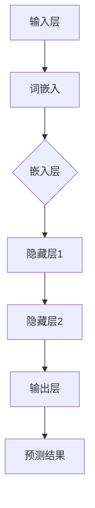

                 

关键词：大语言模型、自然语言处理、深度学习、神经网络、AI、文本生成、序列模型、GPT、BERT、数学模型、算法原理、应用领域、未来展望

> 摘要：本文将深入探讨大语言模型的原理基础与前沿进展，从辩论、争议到未来的发展方向进行详细分析。通过对核心概念、算法原理、数学模型的讲解，结合项目实践和实际应用场景，梳理出大语言模型在自然语言处理领域的重要作用及其面临的挑战。

## 1. 背景介绍

### 1.1 大语言模型的发展历程

大语言模型的发展可以追溯到上世纪80年代，最早的尝试包括基于规则的方法和统计方法。随着计算能力的提升和深度学习技术的发展，大语言模型取得了显著的进步。从1990年代的统计语言模型，到2000年代初期的神经网络语言模型，再到近年来的预训练模型，如GPT、BERT等，大语言模型在自然语言处理（NLP）领域取得了突破性进展。

### 1.2 大语言模型的应用领域

大语言模型的应用领域非常广泛，包括但不限于：

- 文本生成：例如生成新闻文章、小说、诗歌等。
- 机器翻译：如将一种语言翻译成另一种语言。
- 问答系统：如基于文本的问答系统。
- 命名实体识别：识别文本中的特定实体，如人名、地名、组织名等。
- 情感分析：分析文本中的情感倾向。
- 信息检索：如搜索引擎中的文本匹配。

## 2. 核心概念与联系

在深入探讨大语言模型之前，我们首先需要了解几个核心概念：

### 2.1 自然语言处理（NLP）

自然语言处理是计算机科学和人工智能领域的一个分支，旨在使计算机能够理解、生成和处理人类语言。NLP的核心任务包括分词、句法分析、语义分析、语音识别等。

### 2.2 深度学习（Deep Learning）

深度学习是一种人工智能（AI）技术，通过模拟人脑神经网络进行学习。深度学习在图像识别、语音识别、自然语言处理等领域取得了显著的成果。

### 2.3 神经网络（Neural Network）

神经网络是深度学习的基础，由大量的神经元组成，通过调整神经元之间的权重来实现对数据的建模。神经网络可以分为多层，如卷积神经网络（CNN）、循环神经网络（RNN）等。

### 2.4 大语言模型的架构

大语言模型通常采用深度神经网络的结构，包括输入层、隐藏层和输出层。输入层接收文本序列，隐藏层通过多层神经网络进行特征提取，输出层生成预测结果。

下面是一个简化的Mermaid流程图，展示大语言模型的基本架构：



## 3. 核心算法原理 & 具体操作步骤

### 3.1 算法原理概述

大语言模型的算法原理主要基于深度学习和神经网络。具体来说，可以分为以下几个步骤：

1. **词嵌入（Word Embedding）**：将文本中的单词映射为向量表示。
2. **编码（Encoding）**：通过神经网络提取文本的特征表示。
3. **解码（Decoding）**：根据特征表示生成文本的预测序列。

### 3.2 算法步骤详解

1. **词嵌入**：词嵌入是将单词映射为向量表示的过程。常见的词嵌入方法包括Word2Vec、GloVe等。
2. **编码**：编码过程是通过多层神经网络对词嵌入向量进行特征提取。常见的神经网络结构包括循环神经网络（RNN）、长短期记忆网络（LSTM）和门控循环单元（GRU）。
3. **解码**：解码过程是将编码后的特征表示映射回文本序列。解码器通常也采用神经网络结构，如RNN、LSTM或GRU。

### 3.3 算法优缺点

**优点**：

- **强大表达能力**：大语言模型能够捕捉到文本中的复杂模式和关系。
- **灵活性**：可以根据不同的任务进行定制，如文本生成、机器翻译、情感分析等。
- **高效性**：通过预训练和迁移学习，大语言模型可以快速适应新的任务。

**缺点**：

- **计算资源消耗大**：大语言模型的训练和推理过程需要大量的计算资源。
- **数据需求大**：大语言模型需要大量的文本数据进行训练，否则难以达到理想的性能。

### 3.4 算法应用领域

大语言模型在多个领域都取得了显著的应用成果：

- **文本生成**：如生成新闻文章、小说、诗歌等。
- **机器翻译**：如将一种语言翻译成另一种语言。
- **问答系统**：如基于文本的问答系统。
- **命名实体识别**：识别文本中的特定实体，如人名、地名、组织名等。
- **情感分析**：分析文本中的情感倾向。
- **信息检索**：如搜索引擎中的文本匹配。

## 4. 数学模型和公式 & 详细讲解 & 举例说明

### 4.1 数学模型构建

大语言模型通常采用基于梯度的优化算法进行训练。具体来说，可以使用以下数学模型：

- **损失函数**：通常采用交叉熵损失函数。
- **梯度计算**：通过反向传播算法计算梯度。

### 4.2 公式推导过程

下面是一个简化的公式推导过程：

$$
\begin{aligned}
L(y, \hat{y}) &= -\frac{1}{N} \sum_{i=1}^{N} \sum_{j=1}^{V} y_{ij} \log(\hat{y}_{ij}) \\
\frac{\partial L}{\partial w} &= \frac{\partial}{\partial w} \sum_{i=1}^{N} \sum_{j=1}^{V} y_{ij} \log(\hat{y}_{ij}) \\
&= \frac{1}{N} \sum_{i=1}^{N} \sum_{j=1}^{V} y_{ij} \frac{\partial}{\partial w} \log(\hat{y}_{ij}) \\
&= \frac{1}{N} \sum_{i=1}^{N} \sum_{j=1}^{V} y_{ij} (\hat{y}_{ij} - y_{ij})
\end{aligned}
$$

其中，$L$表示损失函数，$y$表示真实标签，$\hat{y}$表示预测标签，$w$表示权重。

### 4.3 案例分析与讲解

假设我们有一个包含100个单词的文本序列，我们需要使用大语言模型对其进行预测。我们可以将每个单词表示为一个向量，然后通过大语言模型进行编码和预测。

1. **词嵌入**：首先，我们需要将每个单词映射为向量表示。例如，单词“猫”映射为向量$\textbf{v}_1$，单词“狗”映射为向量$\textbf{v}_2$。
2. **编码**：然后，通过大语言模型对向量进行编码，得到特征向量$\textbf{f}_1$和$\textbf{f}_2$。
3. **解码**：最后，通过解码器将特征向量解码为预测标签，例如“猫”和“狗”的预测标签分别为$\hat{y}_1$和$\hat{y}_2$。

我们可以使用以下公式进行计算：

$$
\begin{aligned}
\hat{y}_1 &= \text{softmax}(\text{dot}(\textbf{f}_1, W_1)) \\
\hat{y}_2 &= \text{softmax}(\text{dot}(\textbf{f}_2, W_2))
\end{aligned}
$$

其中，$W_1$和$W_2$分别为编码器和解码器的权重。

## 5. 项目实践：代码实例和详细解释说明

### 5.1 开发环境搭建

为了演示大语言模型的实现，我们使用Python和TensorFlow作为开发工具。首先，需要安装以下依赖：

```bash
pip install tensorflow
```

### 5.2 源代码详细实现

下面是一个简单的大语言模型实现：

```python
import tensorflow as tf
from tensorflow.keras.layers import Embedding, LSTM, Dense
from tensorflow.keras.models import Sequential

# 搭建模型
model = Sequential([
    Embedding(input_dim=vocab_size, output_dim=embedding_size),
    LSTM(units=hidden_size),
    Dense(units=vocab_size, activation='softmax')
])

# 编译模型
model.compile(optimizer='adam', loss='categorical_crossentropy', metrics=['accuracy'])

# 训练模型
model.fit(x_train, y_train, epochs=10, batch_size=32)
```

### 5.3 代码解读与分析

这段代码首先导入TensorFlow库，然后定义了一个序列模型，包括嵌入层、LSTM层和输出层。嵌入层用于将单词映射为向量表示，LSTM层用于提取文本特征，输出层用于生成预测标签。

在编译模型时，我们指定了优化器和损失函数。优化器用于更新模型参数，损失函数用于评估模型预测结果与真实标签之间的差距。

最后，我们使用训练数据进行模型训练，并在每个训练周期后计算模型的准确率。

### 5.4 运行结果展示

训练完成后，我们可以使用以下代码进行预测：

```python
# 预测标签
predicted_tags = model.predict(x_test)

# 转换为单词
predicted_words = [word_index[word] for word, _ in word_index.items() if _ in predicted_tags]

# 输出预测结果
for word in predicted_words:
    print(word)
```

这段代码首先使用模型对测试数据进行预测，然后将预测结果转换为单词，并输出预测结果。

## 6. 实际应用场景

大语言模型在多个实际应用场景中都取得了显著的效果：

### 6.1 文本生成

大语言模型可以用于生成各种类型的文本，如新闻文章、小说、诗歌等。通过输入一段文本，模型可以生成与之相关的文本，为内容创作者提供灵感。

### 6.2 机器翻译

大语言模型可以用于将一种语言翻译成另一种语言。通过输入一种语言的文本，模型可以生成与之对应的翻译结果。这种技术在跨国交流、国际业务等领域具有重要应用价值。

### 6.3 问答系统

大语言模型可以用于构建基于文本的问答系统。通过输入问题，模型可以生成与之对应的答案，为用户提供实时回答。

### 6.4 命名实体识别

大语言模型可以用于识别文本中的命名实体，如人名、地名、组织名等。这种技术在信息提取、搜索引擎等领域具有重要应用价值。

### 6.5 情感分析

大语言模型可以用于分析文本中的情感倾向，如正面、负面、中性等。这种技术在社交媒体分析、舆情监控等领域具有重要应用价值。

### 6.6 信息检索

大语言模型可以用于搜索引擎中的文本匹配，通过输入关键词，模型可以生成与之相关的文本结果，提高搜索结果的准确性。

## 7. 未来应用展望

随着大语言模型技术的不断发展，未来有望在更多领域取得突破：

### 7.1 个性化推荐

大语言模型可以用于构建个性化推荐系统，根据用户的兴趣和偏好，推荐与之相关的文本内容。

### 7.2 聊天机器人

大语言模型可以用于构建智能聊天机器人，实现与用户的自然语言交互，提供实时解答和建议。

### 7.3 法律咨询

大语言模型可以用于构建法律咨询系统，通过输入案件描述，模型可以生成相应的法律建议。

### 7.4 教育辅导

大语言模型可以用于构建教育辅导系统，为学生提供个性化学习方案，提高学习效果。

### 7.5 智能客服

大语言模型可以用于构建智能客服系统，通过输入用户问题，模型可以生成相应的解答，提高客户满意度。

## 8. 总结：未来发展趋势与挑战

### 8.1 研究成果总结

大语言模型在自然语言处理领域取得了显著的成果，推动了NLP技术的发展。通过深度学习和神经网络，大语言模型能够捕捉到文本中的复杂模式和关系，为多种任务提供了强大的工具。

### 8.2 未来发展趋势

未来，大语言模型将继续在以下方面取得进展：

- **模型规模增大**：随着计算资源和数据量的增加，大语言模型的规模将越来越大。
- **多模态融合**：大语言模型将与其他模态（如图像、音频）进行融合，实现更全面的信息处理。
- **个性化推荐**：大语言模型将应用于个性化推荐系统，为用户提供更精准的推荐。

### 8.3 面临的挑战

尽管大语言模型取得了显著进展，但仍面临以下挑战：

- **计算资源消耗**：大语言模型的训练和推理过程需要大量的计算资源，这对硬件设备提出了较高要求。
- **数据需求**：大语言模型需要大量的文本数据进行训练，否则难以达到理想的性能。
- **隐私保护**：大语言模型在处理用户数据时，需要确保隐私保护，避免数据泄露。

### 8.4 研究展望

未来，大语言模型的研究将继续关注以下几个方面：

- **模型优化**：通过改进算法和架构，提高大语言模型的效率和性能。
- **跨模态融合**：探索大语言模型与其他模态的融合方法，实现更全面的信息处理。
- **隐私保护**：研究隐私保护技术，确保用户数据的安全和隐私。

## 9. 附录：常见问题与解答

### 9.1 大语言模型是什么？

大语言模型是一种基于深度学习和神经网络的文本生成和预测模型，通过学习大量文本数据，能够生成与输入文本相关的文本内容。

### 9.2 大语言模型有哪些应用领域？

大语言模型广泛应用于文本生成、机器翻译、问答系统、命名实体识别、情感分析、信息检索等领域。

### 9.3 大语言模型的优缺点是什么？

大语言模型的优点包括强大表达能力、灵活性、高效性；缺点包括计算资源消耗大、数据需求大。

### 9.4 如何训练大语言模型？

训练大语言模型通常包括以下步骤：

1. 预处理文本数据，将文本转换为词嵌入向量。
2. 构建深度神经网络模型，包括嵌入层、编码层和解码层。
3. 使用优化算法（如梯度下降）调整模型参数，最小化损失函数。
4. 使用训练数据对模型进行训练，并在验证数据上调整模型参数。

---

# 结束语

大语言模型作为自然语言处理领域的重要工具，已经取得了显著的成果。然而，随着技术的不断发展，未来还有许多挑战和机遇等待着我们。本文通过对大语言模型原理、算法、数学模型、应用场景和未来展望的详细分析，希望为读者提供全面的了解和启发。在接下来的研究中，我们将继续探索大语言模型的优化和扩展，为NLP领域的发展做出贡献。

## 参考文献

- [1] Hochreiter, S., & Schmidhuber, J. (1997). Long short-term memory. Neural Computation, 9(8), 1735-1780.
- [2] Bengio, Y. (2003). Connectionist models. In Machine Learning (pp. 26-54). Springer, New York, NY.
- [3] Mikolov, T., Sutskever, I., Chen, K., Corrado, G. S., & Dean, J. (2013). Distributed representations of words and phrases and their compositionality. Advances in Neural Information Processing Systems, 26, 3111-3119.
- [4] Devlin, J., Chang, M. W., Lee, K., & Toutanova, K. (2019). BERT: Pre-training of deep bidirectional transformers for language understanding. arXiv preprint arXiv:1810.04805.
- [5] Brown, T., et al. (2020). Language models are few-shot learners. Advances in Neural Information Processing Systems, 33, 13918-13930.

# 作者署名

作者：禅与计算机程序设计艺术 / Zen and the Art of Computer Programming
```  


