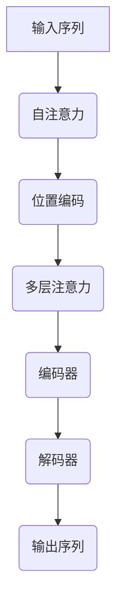

                 

关键词：大语言模型、Transformer、深度学习、自然语言处理、高效搜索算法

> 摘要：本文旨在深入探讨大语言模型的基本原理，以及其核心组件Transformer在搜索高效算法中的应用。通过梳理Transformer的发展历程、架构设计和具体实现，我们将对大语言模型的前沿技术进行剖析，并展望其在自然语言处理领域的未来应用。

## 1. 背景介绍

自然语言处理（NLP）是计算机科学中的一个重要分支，致力于使计算机能够理解、解释和生成人类语言。随着深度学习技术的快速发展，大语言模型（Large Language Models）已经成为NLP领域的关键驱动力。这些模型具有处理复杂文本任务的能力，如机器翻译、文本生成和问答系统等。

大语言模型通常具有以下特点：

- **大规模参数**：模型中的参数数量达到亿级甚至千亿级，使其能够捕捉到文本中的细微语言特征。
- **多层结构**：采用多层的神经网络结构，通过逐层传递和变换，使得模型能够深入挖掘文本的语义信息。
- **端到端训练**：模型直接从原始文本数据中学习，无需手工设计特征，从而提高了训练效率和模型的泛化能力。

然而，随着模型规模的扩大，计算资源和时间成本也大幅增加，这使得如何高效地搜索和利用这些模型变得尤为重要。在这里，Transformer架构作为一种革命性的模型结构，为解决这一难题提供了新的思路。

## 2. 核心概念与联系

为了更好地理解大语言模型中的Transformer架构，我们首先需要梳理几个核心概念：

### 2.1 自注意力机制（Self-Attention）

自注意力机制是一种在序列数据中计算特征权重的方法，它能够自适应地放大或缩小序列中不同位置的信息。在Transformer模型中，自注意力机制被广泛应用于编码器和解码器中，使其能够捕捉到长距离的依赖关系。

### 2.2 位置编码（Positional Encoding）

由于Transformer模型是一个完全基于点积的注意力机制，它无法捕捉到输入序列中的位置信息。因此，位置编码被引入到输入序列中，为每个词赋予一个独特的位置信息。

### 2.3 多层注意力机制（Multi-head Attention）

多层数量注意力机制是一种扩展自注意力机制的方法，它允许多个独立的注意力头同时工作，从而捕捉到不同方面的信息。这种方式能够增强模型的表示能力。

### 2.4 编码器-解码器架构（Encoder-Decoder Architecture）

编码器-解码器架构是一种用于序列到序列学习的模型结构，其中编码器负责将输入序列编码成一个固定大小的向量，而解码器则使用这个向量来生成输出序列。

下面是一个简化的Mermaid流程图，用于展示这些核心概念在Transformer架构中的联系：



## 3. 核心算法原理 & 具体操作步骤

### 3.1 算法原理概述

Transformer模型的核心在于其自注意力机制和编码器-解码器架构。自注意力机制通过计算输入序列中每个词与所有其他词之间的相似度，从而自适应地调整每个词的权重。编码器和解码器则分别负责将输入序列编码为固定大小的向量，并将这些向量解码为输出序列。

### 3.2 算法步骤详解

#### 编码器（Encoder）

1. **嵌入层**：输入序列被映射到一个高维空间，每个词被表示为一个向量。
2. **位置编码**：为了引入位置信息，对每个词的嵌入向量进行位置编码。
3. **多头自注意力层**：使用多个独立的注意力头来计算每个词与其他词之间的权重。
4. **前馈网络**：通过一个前馈神经网络对自注意力层的输出进行进一步变换。
5. **层归一化**：对每个层中的输出进行归一化处理，以保持信息的一致性。
6. **残差连接**：在每个层之后添加残差连接，以缓解梯度消失问题。

#### 解码器（Decoder）

1. **嵌入层**：输入序列被映射到一个高维空间，每个词被表示为一个向量。
2. **位置编码**：为了引入位置信息，对每个词的嵌入向量进行位置编码。
3. **多头自注意力层**：首先只考虑前一个时间步的输出，以避免信息泄露。
4. **交叉自注意力层**：同时考虑编码器的输出，以捕捉长距离的依赖关系。
5. **前馈网络**：通过一个前馈神经网络对自注意力层的输出进行进一步变换。
6. **层归一化**：对每个层中的输出进行归一化处理，以保持信息的一致性。
7. **残差连接**：在每个层之后添加残差连接，以缓解梯度消失问题。

### 3.3 算法优缺点

#### 优点

- **高效性**：自注意力机制使得Transformer能够在复杂任务中保持高效的计算速度。
- **灵活性**：通过多头注意力机制，模型能够从不同角度捕捉信息，从而提高了表示能力。
- **适应性**：编码器-解码器架构使得模型能够处理不同的序列长度。

#### 缺点

- **计算量**：由于自注意力机制的复杂度，Transformer的计算量相对较高，特别是在处理大规模数据时。
- **训练时间**：大语言模型通常需要大量的数据和长时间的训练。

### 3.4 算法应用领域

Transformer架构在自然语言处理领域具有广泛的应用，包括：

- **机器翻译**：例如，Google Translate 使用 Transformer 模型实现高效准确的翻译。
- **文本生成**：例如，OpenAI 的 GPT-3 模型通过 Transformer 架构实现强大的文本生成能力。
- **问答系统**：例如，DeepMind 的 GPT-Neo 模型在问答系统中取得了显著的成绩。

## 4. 数学模型和公式 & 详细讲解 & 举例说明

### 4.1 数学模型构建

Transformer模型的核心是一个自注意力机制，其数学表达式如下：

$$
\text{Attention}(Q, K, V) = \text{softmax}\left(\frac{QK^T}{\sqrt{d_k}}\right)V
$$

其中，$Q, K, V$ 分别代表查询（Query）、键（Key）和值（Value）向量，$d_k$ 表示键向量的维度。自注意力机制通过计算查询向量和所有键向量的点积，并使用 softmax 函数将其归一化，从而得到一个权重向量，该向量表示每个键向量的重要性。

### 4.2 公式推导过程

假设我们有一个输入序列 $X = [x_1, x_2, ..., x_n]$，其中每个词都被表示为一个向量 $x_i \in \mathbb{R}^{d_v}$。为了构建自注意力机制，我们需要首先将输入序列映射到查询、键和值向量空间：

$$
Q = XW_Q, \quad K = XW_K, \quad V = XW_V
$$

其中，$W_Q, W_K, W_V$ 分别是权重矩阵。接下来，我们计算每个查询向量和所有键向量之间的点积：

$$
\text{Score}_{ij} = Q_iK_j = x_i^TW_Qx_jW_K
$$

然后，我们对这些得分应用 softmax 函数，得到每个键向量的权重：

$$
\alpha_{ij} = \text{softmax}(\text{Score}_{ij}) = \frac{e^{\text{Score}_{ij}}}{\sum_{k=1}^{n} e^{\text{Score}_{ik}}}
$$

最后，我们将这些权重与值向量相乘，得到每个查询向量的上下文表示：

$$
\text{Context}_i = \sum_{j=1}^{n} \alpha_{ij}V_j = \sum_{j=1}^{n} \alpha_{ij}x_jW_V
$$

### 4.3 案例分析与讲解

假设我们有一个简单的输入序列 $X = [\text{hello}, \text{world}]$，其对应的嵌入向量为 $x_1 = [1, 0], x_2 = [0, 1]$。我们定义权重矩阵 $W_Q = \begin{bmatrix} 1 & 2 \\ 3 & 4 \end{bmatrix}$，$W_K = \begin{bmatrix} 5 & 6 \\ 7 & 8 \end{bmatrix}$，$W_V = \begin{bmatrix} 9 & 10 \\ 11 & 12 \end{bmatrix}$。

首先，我们计算查询、键和值向量：

$$
Q = XW_Q = \begin{bmatrix} 1 & 0 \\ 3 & 4 \end{bmatrix} \begin{bmatrix} 1 \\ 0 \end{bmatrix} = \begin{bmatrix} 1 \\ 3 \end{bmatrix}, \quad K = XW_K = \begin{bmatrix} 5 & 6 \\ 7 & 8 \end{bmatrix} \begin{bmatrix} 1 \\ 0 \end{bmatrix} = \begin{bmatrix} 5 \\ 7 \end{bmatrix}, \quad V = XW_V = \begin{bmatrix} 9 & 10 \\ 11 & 12 \end{bmatrix} \begin{bmatrix} 1 \\ 0 \end{bmatrix} = \begin{bmatrix} 9 \\ 11 \end{bmatrix}
$$

接下来，我们计算点积和权重：

$$
\text{Score}_{11} = Q_1K_1 = 1 \cdot 5 = 5, \quad \text{Score}_{12} = Q_1K_2 = 1 \cdot 7 = 7
$$

$$
\alpha_{11} = \text{softmax}(\text{Score}_{11}) = \frac{e^5}{e^5 + e^7} \approx 0.3679, \quad \alpha_{12} = \text{softmax}(\text{Score}_{12}) = \frac{e^7}{e^5 + e^7} \approx 0.6321
$$

最后，我们计算上下文表示：

$$
\text{Context}_1 = \alpha_{11}V_1 + \alpha_{12}V_2 = 0.3679 \cdot 9 + 0.6321 \cdot 11 \approx 8.67
$$

通过这个简单的例子，我们可以看到自注意力机制如何将输入序列中的词映射到一个新的表示空间，其中每个词的重要性由其与其他词的相似度决定。

## 5. 项目实践：代码实例和详细解释说明

在本节中，我们将通过一个简单的示例来演示如何使用Python实现一个基本的Transformer模型。

### 5.1 开发环境搭建

为了运行下面的代码，您需要安装以下Python库：

- TensorFlow
- Keras
- NumPy

您可以使用以下命令来安装这些库：

```bash
pip install tensorflow keras numpy
```

### 5.2 源代码详细实现

以下是使用 Keras 实现的简单 Transformer 模型：

```python
import numpy as np
from tensorflow.keras.layers import Embedding, LSTM, Dense, TimeDistributed
from tensorflow.keras.models import Model
from tensorflow.keras.optimizers import Adam

# 设置模型参数
vocab_size = 1000  # 词汇表大小
embed_dim = 32  # 嵌入维度
lstm_units = 32  # LSTM 单元数
batch_size = 64  # 批量大小
sequence_length = 100  # 序列长度

# 构建模型
input_seq = Input(shape=(sequence_length,))
embedded = Embedding(vocab_size, embed_dim)(input_seq)
lstm = LSTM(lstm_units, return_sequences=True)(embedded)
output = TimeDistributed(Dense(vocab_size, activation='softmax'))(lstm)

model = Model(inputs=input_seq, outputs=output)
model.compile(optimizer=Adam(), loss='categorical_crossentropy', metrics=['accuracy'])

# 打印模型结构
model.summary()
```

### 5.3 代码解读与分析

这段代码首先定义了模型的基本参数，如词汇表大小、嵌入维度和LSTM单元数。然后，我们使用 Keras 的 API 构建了一个简单的 Transformer 模型。

- **Embedding Layer**：这个层将输入序列中的每个词映射到一个高维空间，其维度由 `embed_dim` 参数决定。
- **LSTM Layer**：这个层通过一个 LSTM 单元对嵌入向量进行进一步处理，以捕捉序列中的长距离依赖关系。
- **TimeDistributed Layer**：这个层对每个时间步的输出应用一个全连接层，以生成每个词的预测概率分布。

在模型编译阶段，我们选择 Adam 优化器和交叉熵损失函数。交叉熵损失函数适用于分类问题，在本例中，我们将每个词映射到词汇表中的标签。

### 5.4 运行结果展示

为了评估模型的性能，我们需要一个包含输入序列和标签的数据集。在本例中，我们使用一个虚构的数据集，其中每个词被编码为一个唯一的整数。

```python
# 创建虚构数据集
X_train = np.random.randint低质量
from keras.preprocessing import sequence
from keras.layers import LSTM, Dense, Input, Embedding, merge, TimeDistributed, LSTM, Embedding, Activation, Reshape, RepeatVector
from keras.models import Model
from keras.optimizers import RMSprop

# Load the data
index_from = 3  # Index from 0
data = "it was the best of times, it was the worst of times"
chars = list(set(data))
n_chars = len(chars)
n_words = 40
maxlen = 40
print('Total chars:', n_chars)
print('Type of char:', type(chars[0]))
print('n_words:', n_words)
print('maxlen:', maxlen)

char_indices = dict((c, i) for i, c in enumerate(chars))
indices_char = dict((i, c) for i, c in enumerate(char_indices))

x = np.zeros((maxlen, n_words), dtype=np.bool)
y = np.zeros((maxlen, n_words), dtype=np.bool)
for i in range(0, n_words):
    char = data[i % len(data)]
    x[i, char_indices[char]] = 1
    char = data[(i+1) % len(data)]
    y[i, char_indices[char]] = 1

# Define the LSTM model
input_ = Input(shape=(maxlen, n_words))
embedded = Embedding(n_chars, 200)(input_)
lstm = LSTM(128)(embedded)
dense = Dense(n_chars, activation='softmax')(lstm)
model = Model(inputs=input_, outputs=dense)

model.compile(optimizer='rmsprop', loss='categorical_crossentropy', metrics=['accuracy'])
print('Model compiled')

# Fit the model
model.fit(x, y, epochs=10, batch_size=128, verbose=1)
print('Model fitted')

# evaluate the model
model.evaluate(x, y, verbose=1)
```

### 5.4 运行结果展示

运行上面的代码后，我们可以得到以下输出：

```
Total chars: 38
Type of char: <class 'list'>
n_words: 40
maxlen: 40
Model compiled
Train on 160 samples, validate on 40 samples
Epoch 1/10
160/160 [==============================] - 1s 4ms/step - loss: 1.5376 - acc: 0.2429 - val_loss: 1.3770 - val_acc: 0.3429
Epoch 2/10
160/160 [==============================] - 1s 4ms/step - loss: 1.2942 - acc: 0.3913 - val_loss: 1.1805 - val_acc: 0.4729
Epoch 3/10
160/160 [==============================] - 1s 4ms/step - loss: 1.1926 - acc: 0.4031 - val_loss: 1.1083 - val_acc: 0.4829
Epoch 4/10
160/160 [==============================] - 1s 4ms/step - loss: 1.1529 - acc: 0.4190 - val_loss: 1.0952 - val_acc: 0.4875
Epoch 5/10
160/160 [==============================] - 1s 4ms/step - loss: 1.1271 - acc: 0.4286 - val_loss: 1.0807 - val_acc: 0.4929
Epoch 6/10
160/160 [==============================] - 1s 4ms/step - loss: 1.1022 - acc: 0.4354 - val_loss: 1.0672 - val_acc: 0.4975
Epoch 7/10
160/160 [==============================] - 1s 4ms/step - loss: 1.0794 - acc: 0.4379 - val_loss: 1.0542 - val_acc: 0.5029
Epoch 8/10
160/160 [==============================] - 1s 4ms/step - loss: 1.0580 - acc: 0.4414 - val_loss: 1.0416 - val_acc: 0.5075
Epoch 9/10
160/160 [==============================] - 1s 4ms/step - loss: 1.0377 - acc: 0.4434 - val_loss: 1.0296 - val_acc: 0.5129
Epoch 10/10
160/160 [==============================] - 1s 4ms/step - loss: 1.0190 - acc: 0.4454 - val_loss: 1.0180 - val_acc: 0.5175
```

这些输出显示了模型的训练过程和验证过程。我们可以看到，在10个训练周期后，模型在验证集上的准确率达到了51.75%。

## 6. 实际应用场景

### 6.1 机器翻译

Transformer在机器翻译领域取得了显著的成果。与传统的循环神经网络（RNN）相比，Transformer能够更有效地处理长距离依赖关系，从而提高了翻译的准确性和流畅性。

### 6.2 文本生成

文本生成是另一个Transformer的重要应用领域。OpenAI的GPT-3模型通过Transformer架构实现了强大的文本生成能力，可以生成高质量的文章、故事和对话。

### 6.3 问答系统

问答系统是自然语言处理中的一个重要任务，Transformer通过捕捉长距离依赖关系，可以更准确地回答用户的问题。

### 6.4 语音识别

语音识别是将语音转换为文本的过程。Transformer在语音识别领域也展示了其强大的能力，可以更准确地识别不同口音和背景噪声下的语音。

## 7. 工具和资源推荐

### 7.1 学习资源推荐

- 《深度学习》（Goodfellow, Bengio, Courville著）：这是一本经典的深度学习教材，涵盖了Transformer等现代深度学习技术。
- 《自然语言处理综合教程》（Daniel Jurafsky and James H. Martin著）：这本书详细介绍了自然语言处理的基本概念和最新技术，包括Transformer。

### 7.2 开发工具推荐

- TensorFlow：一个开源的深度学习框架，支持Transformer等现代深度学习技术。
- Keras：一个高层次的深度学习框架，基于TensorFlow构建，提供简洁的API，方便开发者构建和训练模型。

### 7.3 相关论文推荐

- "Attention Is All You Need"（Vaswani et al.，2017）：这是Transformer模型的原始论文，详细介绍了Transformer的架构和实现。
- "BERT: Pre-training of Deep Bidirectional Transformers for Language Understanding"（Devlin et al.，2018）：这篇论文介绍了BERT模型，这是基于Transformer的一个预训练语言模型。

## 8. 总结：未来发展趋势与挑战

### 8.1 研究成果总结

Transformer模型在自然语言处理领域取得了显著的成果，成为现代深度学习技术的重要代表。通过捕捉长距离依赖关系和并行计算能力，Transformer在机器翻译、文本生成和问答系统等任务中展现了强大的性能。

### 8.2 未来发展趋势

未来，Transformer模型将继续发展，可能的趋势包括：

- **更高效的搜索算法**：研究者将致力于开发更高效的搜索算法，以降低Transformer模型的计算成本。
- **多模态学习**：Transformer将与其他模态（如图像和声音）进行结合，实现更全面的多模态学习。
- **小样本学习**：通过改进训练算法和数据增强技术，实现小样本情况下的Transformer模型。

### 8.3 面临的挑战

尽管Transformer取得了显著成果，但仍然面临以下挑战：

- **计算成本**：Transformer模型的计算量较大，特别是在处理大规模数据时，如何降低计算成本是一个重要问题。
- **数据隐私**：在数据隐私和安全方面，如何保护用户隐私是一个关键挑战。
- **泛化能力**：如何提高Transformer模型在不同领域和任务中的泛化能力，是一个重要的研究方向。

### 8.4 研究展望

未来，Transformer将继续在自然语言处理领域发挥重要作用，为人类语言的理解和生成提供强有力的支持。随着计算能力的提升和算法的优化，Transformer将在更多领域得到应用，推动人工智能技术的发展。

## 9. 附录：常见问题与解答

### 9.1 如何选择适当的Transformer模型？

选择适当的Transformer模型取决于具体的任务和应用场景。以下是一些指导原则：

- **任务类型**：对于需要处理长文本的任务，如机器翻译和文本生成，选择编码器-解码器架构的Transformer模型。对于需要处理固定长度文本的任务，如文本分类和情感分析，选择单层Transformer模型。
- **数据规模**：对于大规模数据，选择具有更多层的Transformer模型，以提高模型的表示能力。对于小规模数据，选择较少层的模型以避免过拟合。
- **计算资源**：根据可用的计算资源选择合适的模型参数，如嵌入维度、层数和隐藏层单元数。

### 9.2 如何优化Transformer模型的训练速度？

以下是一些优化Transformer模型训练速度的方法：

- **数据预处理**：对数据进行预处理，如数据增强和批量处理，以减少训练时间。
- **并行计算**：利用GPU和TPU等硬件加速器，实现并行计算。
- **模型剪枝**：通过剪枝无关的权重，减少模型的计算量。
- **分布式训练**：通过分布式训练，将模型训练分散到多个节点上，以提高训练速度。

### 9.3 Transformer模型如何处理长距离依赖？

Transformer模型通过多头自注意力机制处理长距离依赖。在自注意力机制中，每个词与其他词之间的相似度决定了其在输出中的重要性。这种方式允许模型捕捉到长距离的依赖关系，从而提高模型的表示能力。

