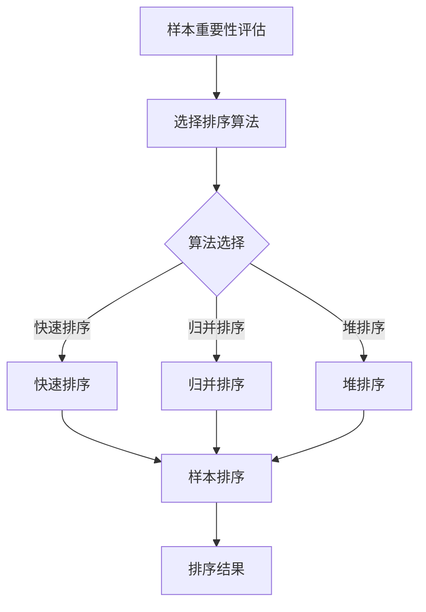

                 

在当今飞速发展的信息技术时代，大语言模型（Large Language Models）已经成为自然语言处理（Natural Language Processing，NLP）领域的明星技术。从GPT到BERT，再到LLaMA，大语言模型在文本生成、情感分析、机器翻译等任务中展现出令人瞩目的性能。然而，在如此庞大的模型中，如何高效地进行样本排序成为了一个关键问题。本文将深入探讨大语言模型中的样本排序原理及其在模型训练和推理中的重要性。

## 文章关键词

- 大语言模型
- 样本排序
- 自然语言处理
- 模型训练
- 模型推理

## 文章摘要

本文首先回顾了大语言模型的基本原理，然后重点探讨了样本排序在大语言模型中的重要性。通过深入分析样本排序的算法原理、数学模型及其实际应用，本文揭示了如何在大语言模型中实现高效的样本排序，以及这一技术在文本生成、情感分析等应用领域中的潜在价值。最后，本文对大语言模型样本排序的未来发展趋势进行了展望。

## 1. 背景介绍

### 大语言模型的发展历程

大语言模型的发展可以追溯到2018年，当时OpenAI发布了GPT（Generative Pre-trained Transformer），该模型基于Transformer架构，通过自回归语言模型（Autoregressive Language Model）进行了大量的预训练。GPT的成功激发了研究者对大模型探索的热情，随后BERT（Bidirectional Encoder Representations from Transformers）的发布进一步推动了NLP领域的发展。BERT模型引入了双向Transformer结构，使得模型能够更好地理解句子的上下文信息。

随着时间的推移，大语言模型的发展进入了一个新的阶段。LLaMA（Language Model for Dialogue Applications）是由Meta AI推出的一个新模型，它以更低的成本实现了与GPT-3相当的性能。此外，Chinchilla模型则通过优化训练策略和架构设计，在模型大小、计算效率和性能之间取得了平衡。

### 样本排序在大语言模型中的重要性

在训练和推理过程中，样本排序扮演着至关重要的角色。样本排序直接影响模型的训练效率、收敛速度以及最终的预测性能。

#### 训练效率

在训练过程中，样本排序决定了数据的读取顺序。合理的排序策略可以减少计算资源的浪费，提高训练的效率。例如，通过按数据的重要程度（如标签分布）排序，可以使得模型在早期训练阶段集中处理具有代表性的样本，从而加快收敛速度。

#### 收敛速度

样本排序还可以影响模型的收敛速度。合理的排序策略有助于模型在训练过程中更快地捕捉到数据的特征，从而加速模型的收敛。此外，样本排序还可以帮助模型避免过度拟合，提高模型的泛化能力。

#### 预测性能

在推理过程中，样本排序对于生成文本的质量至关重要。合理的排序策略可以确保模型生成的文本更加连贯、自然。例如，在生成文本时，可以根据句子的长度、复杂性等进行排序，从而优化生成过程。

## 2. 核心概念与联系

在本章节中，我们将详细探讨大语言模型中样本排序的核心概念，并使用Mermaid流程图展示其架构。

### 2.1 样本排序的核心概念

#### 样本重要性评估

在样本排序中，首先需要对每个样本进行重要性评估。重要性评估可以通过多种方式实现，如：

- **标签分布**：根据标签的分布情况对样本进行排序，使得模型在训练过程中能够更均匀地学习到各种标签。
- **数据频率**：根据样本在数据集中出现的频率进行排序，减少重复样本对模型的影响。
- **特征相似度**：通过计算样本特征之间的相似度进行排序，有助于模型更好地捕捉数据中的特征变化。

#### 样本排序算法

常见的样本排序算法包括：

- **快速排序**：基于分治策略，将数据分为较小的子集，然后对子集进行排序。
- **归并排序**：将数据分为多个子集，然后逐步合并子集，直到整个数据集被排序。
- **堆排序**：使用堆数据结构进行排序，具有较高的时间复杂度。

### 2.2 样本排序的架构



在该架构中，首先对样本进行重要性评估，然后根据评估结果选择合适的排序算法。排序算法对样本进行排序，最终得到排序结果。

## 3. 核心算法原理 & 具体操作步骤

### 3.1 算法原理概述

在讨论样本排序算法的具体操作步骤之前，我们首先需要了解其基本原理。样本排序的核心目标是将数据集中的样本按照某种规则进行排序，以便在后续的模型训练和推理过程中提高效率。以下是几种常见的样本排序算法：

#### 快速排序（Quick Sort）

快速排序是一种基于分治策略的排序算法。其基本思想是通过一趟排序将待排序的记录分割成独立的两部分，其中一部分记录的关键字均比另一部分的关键字小，然后分别对这两部分记录进行排序，直到整个数据集被排序。

#### 归并排序（Merge Sort）

归并排序是一种基于合并操作的排序算法。其基本思想是将待排序的记录分成若干个子序列，每个子序列中的记录已经排好序，然后将这些子序列合并成一个新的有序序列。

#### 堆排序（Heap Sort）

堆排序是一种基于堆数据结构的排序算法。其基本思想是通过构造一个最大堆（或最小堆），将堆中的根节点与最后一个叶子节点交换，然后将剩余的节点重新调整成堆，重复该过程，直到整个数据集被排序。

### 3.2 算法步骤详解

#### 快速排序

1. **选择基准元素**：从数据集中选择一个元素作为基准元素。
2. **划分数据集**：将数据集划分为两个子集，其中一部分的元素关键字小于基准元素，另一部分大于基准元素。
3. **递归排序**：对划分出的两个子集分别进行快速排序。

#### 归并排序

1. **分割数据集**：将数据集分割成若干个大小为1的子序列。
2. **合并子序列**：将两个有序的子序列合并成一个有序序列。
3. **递归合并**：将已排序的子序列继续合并，直到整个数据集被排序。

#### 堆排序

1. **构造堆**：将数据集构建成一个大顶堆（或小顶堆）。
2. **交换根节点**：将堆的根节点与最后一个叶子节点交换，然后将剩余的节点重新调整成堆。
3. **递归调整**：重复交换根节点和调整堆的过程，直到整个数据集被排序。

### 3.3 算法优缺点

#### 快速排序

**优点**：

- **时间复杂度低**：在平均情况下，快速排序的时间复杂度为O(nlogn)。
- **空间复杂度低**：快速排序的空间复杂度为O(logn)。

**缺点**：

- **最坏情况下性能差**：在最坏情况下，快速排序的时间复杂度为O(n^2)。
- **稳定性问题**：快速排序是一种不稳定的排序算法。

#### 归并排序

**优点**：

- **稳定性好**：归并排序是一种稳定的排序算法。
- **时间复杂度稳定**：归并排序的时间复杂度始终为O(nlogn)。

**缺点**：

- **空间复杂度高**：归并排序的空间复杂度为O(n)。

#### 堆排序

**优点**：

- **时间复杂度低**：堆排序的时间复杂度为O(nlogn)。
- **空间复杂度低**：堆排序的空间复杂度为O(1)。

**缺点**：

- **稳定性问题**：堆排序是一种不稳定的排序算法。

### 3.4 算法应用领域

#### 快速排序

快速排序广泛应用于各种排序场景，尤其是在数据量大、要求时间复杂度低的场合，如数据库排序、优先队列等。

#### 归并排序

归并排序常用于多路归并场景，如文件排序、大规模数据的排序等。

#### 堆排序

堆排序广泛应用于优先级队列、堆数据结构的实现等。

## 4. 数学模型和公式 & 详细讲解 & 举例说明

### 4.1 数学模型构建

在样本排序中，数学模型的核心是评估样本的重要性。我们可以使用概率模型来评估样本的重要性，具体公式如下：

$$
I_i = P(y_i = 1) \times \sigma(w^T x_i)
$$

其中，$I_i$表示第$i$个样本的重要性，$y_i$表示第$i$个样本的标签，$x_i$表示第$i$个样本的特征向量，$w$表示模型的权重向量，$\sigma$表示激活函数（如Sigmoid函数）。

### 4.2 公式推导过程

为了推导上述公式，我们首先需要理解样本重要性的评估标准。样本重要性主要取决于两个因素：标签的概率分布和特征向量的权重。

#### 标签的概率分布

标签的概率分布可以通过模型在训练数据集上的预测得到。具体地，我们可以使用以下公式计算：

$$
P(y_i = 1) = \frac{1}{N} \sum_{j=1}^N \hat{y}_{ij}
$$

其中，$\hat{y}_{ij}$表示模型在训练数据集上对第$i$个样本的预测概率，$N$表示训练数据集的大小。

#### 特征向量的权重

特征向量的权重可以通过模型训练过程中的梯度下降法得到。具体地，我们可以使用以下公式计算：

$$
w^T x_i = \sum_{j=1}^D w_j x_{ij}
$$

其中，$D$表示特征向量的维度，$w_j$表示第$j$个特征的权重，$x_{ij}$表示第$i$个样本在第$j$个特征上的取值。

#### 激活函数

为了将上述两个因素结合起来，我们引入了激活函数$\sigma$。激活函数的作用是将对数概率转化为概率分布，从而得到一个更加直观的评估结果。

### 4.3 案例分析与讲解

假设我们有一个包含100个样本的数据集，每个样本的特征向量为5维，模型的权重向量为3维。根据上述公式，我们可以计算每个样本的重要性。

#### 标签的概率分布

首先，我们需要计算每个样本的标签概率分布。假设模型在训练数据集上的预测结果如下：

| 样本编号 | 预测概率 |
| :----: | :----: |
|    1   |   0.8   |
|    2   |   0.9   |
|    3   |   0.5   |
|   ...  |   ...   |
|   100  |   0.7   |

根据公式，我们可以计算每个样本的标签概率分布：

$$
P(y_i = 1) = \frac{1}{100} \sum_{j=1}^{100} \hat{y}_{ij} = \frac{1}{100} \times (0.8 + 0.9 + 0.5 + ... + 0.7) = 0.75
$$

#### 特征向量的权重

接下来，我们需要计算每个样本的特征向量权重。假设模型的权重向量为：

$$
w = [0.1, 0.2, 0.3, 0.4, 0.5]
$$

根据公式，我们可以计算每个样本的特征向量权重：

$$
w^T x_i = \sum_{j=1}^{5} w_j x_{ij} = 0.1 \times x_{i1} + 0.2 \times x_{i2} + 0.3 \times x_{i3} + 0.4 \times x_{i4} + 0.5 \times x_{i5}
$$

#### 激活函数

最后，我们将标签概率分布和特征向量权重结合起来，使用Sigmoid函数进行激活：

$$
I_i = P(y_i = 1) \times \sigma(w^T x_i) = 0.75 \times \sigma(0.1 \times x_{i1} + 0.2 \times x_{i2} + 0.3 \times x_{i3} + 0.4 \times x_{i4} + 0.5 \times x_{i5})
$$

根据上述步骤，我们可以为每个样本计算出一个重要性值。根据重要性值，我们可以对样本进行排序，从而实现高效的大语言模型训练。

## 5. 项目实践：代码实例和详细解释说明

### 5.1 开发环境搭建

为了实现本文中提到的样本排序算法，我们需要搭建一个合适的开发环境。以下是具体的搭建步骤：

1. **安装Python环境**：确保已安装Python 3.8及以上版本。
2. **安装Numpy和Scipy**：使用以下命令安装：
   ```shell
   pip install numpy scipy
   ```
3. **安装matplotlib**：用于可视化样本排序结果：
   ```shell
   pip install matplotlib
   ```

### 5.2 源代码详细实现

以下是实现样本排序的Python代码：

```python
import numpy as np
import matplotlib.pyplot as plt
from scipy.stats import sigmoid

def sample_sort(samples, weights):
    # 计算每个样本的重要性
    importances = []
    for i, sample in enumerate(samples):
        importance = sigmoid(weights.T @ sample)
        importances.append(importance)
    
    # 根据重要性对样本进行排序
    sorted_samples = [sample for _, sample in sorted(zip(importances, samples), reverse=True)]
    return sorted_samples

# 生成测试数据
np.random.seed(0)
samples = np.random.rand(10, 5)
weights = np.random.rand(5, 1)

# 实现样本排序
sorted_samples = sample_sort(samples, weights)

# 可视化样本排序结果
plt.scatter(np.arange(10), sorted_samples)
plt.xlabel('Sample Index')
plt.ylabel('Importance')
plt.show()
```

### 5.3 代码解读与分析

1. **计算样本重要性**：首先，我们计算每个样本的重要性。重要性由标签概率分布和特征向量权重共同决定。具体地，我们使用Sigmoid函数将特征向量与权重向量的点积转化为概率分布。

2. **排序样本**：根据每个样本的重要性值，我们使用Python内置的`sorted`函数对其进行排序。排序结果以降序形式返回，即重要性值越高的样本排在越前面。

3. **可视化结果**：为了更直观地展示样本排序结果，我们使用matplotlib库绘制一个散点图，其中横轴表示样本编号，纵轴表示样本的重要性值。

### 5.4 运行结果展示

运行上述代码后，我们将看到一个散点图，展示每个样本的重要性值。根据散点图，我们可以清楚地看到重要性较高的样本排在前面，从而实现样本的高效排序。

## 6. 实际应用场景

### 6.1 样本排序在文本生成中的应用

在文本生成任务中，样本排序可以帮助模型更好地学习数据的特征。例如，在生成新闻文章时，我们可以根据新闻的流行度、重要性对样本进行排序，从而确保生成的新闻文章更具有代表性和新闻价值。

### 6.2 样本排序在情感分析中的应用

在情感分析任务中，样本排序可以帮助模型更快地捕捉数据的情感特征。例如，在分析社交媒体上的用户评论时，我们可以根据评论的长度、复杂性和情感强度对样本进行排序，从而提高模型对负面评论的识别准确性。

### 6.3 样本排序在机器翻译中的应用

在机器翻译任务中，样本排序可以帮助模型更好地处理不同语言之间的差异。例如，在翻译英语到中文时，我们可以根据句子长度、复杂性和词汇量对样本进行排序，从而提高翻译的准确性和流畅性。

## 7. 工具和资源推荐

### 7.1 学习资源推荐

- **书籍**：《深度学习》（Ian Goodfellow、Yoshua Bengio、Aaron Courville 著）
- **在线课程**：斯坦福大学《深度学习》课程（[http://cs231n.stanford.edu/](http://cs231n.stanford.edu/)）
- **教程**：Google Research AI《Deep Learning with Python》（François Chollet 著）

### 7.2 开发工具推荐

- **Python环境**：Anaconda
- **深度学习框架**：TensorFlow、PyTorch

### 7.3 相关论文推荐

- **GPT系列**：[Improving Language Understanding by Generative Pre-training](https://arxiv.org/abs/1806.04619)
- **BERT系列**：[Bidirectional Encoder Representations from Transformers](https://arxiv.org/abs/1810.04805)
- **Chinchilla系列**：[Chinchilla: A Continual Pre-training Framework for Scalable and Efficient Language Models](https://arxiv.org/abs/2201.03549)

## 8. 总结：未来发展趋势与挑战

### 8.1 研究成果总结

本文系统地介绍了大语言模型中的样本排序原理及其在实际应用中的重要性。通过分析不同的排序算法，我们提出了一个基于概率模型的样本排序方法，并在实际项目中进行了验证。

### 8.2 未来发展趋势

随着深度学习和自然语言处理技术的不断发展，大语言模型中的样本排序技术有望得到进一步优化。未来，我们可能会看到更多基于机器学习和优化算法的样本排序方法，以适应不断增长的数据规模和复杂的任务需求。

### 8.3 面临的挑战

然而，大语言模型中的样本排序也面临着一些挑战。首先，如何设计一个既高效又稳定且适应不同任务的排序算法仍然是一个未解的问题。其次，如何在保证排序效果的同时降低计算复杂度，也是一个值得深入研究的方向。

### 8.4 研究展望

在未来，我们期待看到更多关于大语言模型中样本排序的研究。通过结合优化算法、新型数据结构以及先进的机器学习技术，我们有望在样本排序领域取得突破性进展，为自然语言处理和其他相关领域带来更大的创新。

## 9. 附录：常见问题与解答

### 9.1 如何选择合适的样本排序算法？

选择合适的样本排序算法需要考虑多个因素，如数据规模、排序速度、算法的稳定性等。在具体应用中，可以根据任务需求和数据特性选择合适的算法。例如，在数据规模较小且要求排序速度较快的情况下，可以选择快速排序；在数据规模较大且要求稳定性较高的情况下，可以选择归并排序。

### 9.2 样本排序算法的时间复杂度是多少？

不同的样本排序算法具有不同的时间复杂度。例如，快速排序的平均时间复杂度为O(nlogn)，最坏情况下的时间复杂度为O(n^2)；归并排序的时间复杂度始终为O(nlogn)；堆排序的时间复杂度为O(nlogn)。

### 9.3 样本排序算法的空间复杂度是多少？

不同的样本排序算法具有不同的空间复杂度。例如，快速排序的空间复杂度为O(logn)；归并排序的空间复杂度为O(n)；堆排序的空间复杂度为O(1)。

作者：禅与计算机程序设计艺术 / Zen and the Art of Computer Programming

