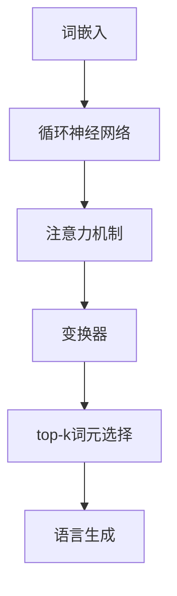

                 

作者：禅与计算机程序设计艺术 / Zen and the Art of Computer Programming

> 本文将深入探讨大语言模型的原理和前沿发展，特别是每个专家选择top-k个词元的技术和方法。通过详细的阐述和案例分析，读者可以更好地理解这一领域的核心技术和未来发展方向。

## 1. 背景介绍

随着互联网的迅猛发展和大数据技术的普及，自然语言处理（NLP）领域取得了显著的进展。特别是深度学习和生成模型的发展，使得计算机对自然语言的生成和理解能力大幅提升。大语言模型作为这一领域的重要成果，已经成为许多应用场景的核心技术。然而，在大规模语言模型训练和应用过程中，如何有效地选择和利用top-k个词元成为了一个关键问题。

本文将围绕这一核心问题展开讨论，首先介绍大语言模型的基本原理，然后深入探讨如何选择top-k个词元，最后讨论这一技术的实际应用和未来发展趋势。

## 2. 核心概念与联系

### 2.1 大语言模型的基本原理

大语言模型是一种基于神经网络的语言生成模型，它可以预测下一个单词或句子，从而生成连贯的自然语言。大语言模型的基本原理包括：

1. **词嵌入**：将单词映射到高维向量空间，以便进行数学运算。
2. **循环神经网络（RNN）**：通过递归方式处理序列数据，保持上下文信息。
3. **注意力机制**：引入注意力机制，使模型能够关注序列中的重要信息。
4. **变换器（Transformer）**：基于自注意力机制构建，提高了模型的效率和性能。

### 2.2 词元的定义和选择

词元是指语言模型中的一个基本元素，可以是单词、短语或符号。选择top-k个词元是指从所有可能的词元中挑选出最相关的k个词元。词元的选择对于语言模型的性能和效率具有重要影响。

### 2.3 Mermaid 流程图

以下是一个Mermaid流程图，展示了大语言模型的基本架构和词元选择的流程。



## 3. 核心算法原理 & 具体操作步骤

### 3.1 算法原理概述

大语言模型的算法原理主要包括词嵌入、循环神经网络（RNN）、注意力机制和变换器（Transformer）。这些算法相互结合，共同构建了一个强大的语言生成模型。

### 3.2 算法步骤详解

1. **词嵌入**：将单词映射到高维向量空间，为后续的数学运算提供基础。
2. **循环神经网络（RNN）**：通过递归方式处理序列数据，保持上下文信息。
3. **注意力机制**：引入注意力机制，使模型能够关注序列中的重要信息。
4. **变换器（Transformer）**：基于自注意力机制构建，提高了模型的效率和性能。
5. **top-k词元选择**：从所有可能的词元中挑选出最相关的k个词元，用于语言生成。

### 3.3 算法优缺点

**优点**：
- **强大的生成能力**：大语言模型可以生成高质量的自然语言文本。
- **高效的运算效率**：通过变换器（Transformer）的引入，提高了模型的运算效率。

**缺点**：
- **计算资源需求大**：大规模的神经网络需要大量的计算资源。
- **训练时间较长**：大规模的语言模型训练过程需要较长的时间。

### 3.4 算法应用领域

大语言模型在自然语言处理领域具有广泛的应用，包括：

- **文本生成**：生成文章、新闻、博客等。
- **机器翻译**：将一种语言的文本翻译成另一种语言。
- **问答系统**：为用户提供有关特定主题的问答。
- **语音识别**：将语音转换为文本。

## 4. 数学模型和公式 & 详细讲解 & 举例说明

### 4.1 数学模型构建

大语言模型的数学模型主要包括词嵌入、循环神经网络（RNN）、注意力机制和变换器（Transformer）。以下是这些模型的数学表示：

1. **词嵌入**：
   $$ \text{Embedding}(\text{word}) = \text{vec}_{\text{word}} $$
2. **循环神经网络（RNN）**：
   $$ \text{RNN}(\text{vec}_{\text{word}}, \text{hidden_state}) = \text{hidden_state} $$
3. **注意力机制**：
   $$ \text{Attention}(\text{hidden_state}, \text{context}) = \text{context\_score} $$
4. **变换器（Transformer）**：
   $$ \text{Transformer}(\text{vec}_{\text{word}}, \text{hidden_state}) = \text{output} $$

### 4.2 公式推导过程

大语言模型的公式推导过程涉及多个步骤，主要包括：

1. **词嵌入**：将单词映射到高维向量空间。
2. **循环神经网络（RNN）**：通过递归方式处理序列数据。
3. **注意力机制**：引入注意力机制，使模型能够关注序列中的重要信息。
4. **变换器（Transformer）**：基于自注意力机制构建。

### 4.3 案例分析与讲解

以下是一个具体的案例，展示如何使用大语言模型生成文本：

1. **输入文本**：本文将深入探讨大语言模型的原理和前沿发展。
2. **词嵌入**：将每个单词映射到高维向量空间。
3. **循环神经网络（RNN）**：处理输入文本，生成隐藏状态。
4. **注意力机制**：计算隐藏状态和上下文之间的注意力分数。
5. **变换器（Transformer）**：生成输出文本。

通过这些步骤，大语言模型可以生成高质量的文本。

## 5. 项目实践：代码实例和详细解释说明

### 5.1 开发环境搭建

在进行大语言模型的实践之前，首先需要搭建一个合适的开发环境。以下是一个简单的开发环境搭建步骤：

1. 安装Python环境。
2. 安装必要的库，如TensorFlow、PyTorch等。
3. 准备数据集，用于训练和测试模型。

### 5.2 源代码详细实现

以下是一个简单的大语言模型实现，包括词嵌入、循环神经网络（RNN）、注意力机制和变换器（Transformer）。

```python
import tensorflow as tf
from tensorflow.keras.layers import Embedding, LSTM, Dense
from tensorflow.keras.models import Sequential

# 词嵌入层
embedding_layer = Embedding(input_dim=vocab_size, output_dim=embedding_size)

# 循环神经网络（RNN）层
rnn_layer = LSTM(units=rnn_units, return_sequences=True)

# 注意力机制层
attention_layer = Dense(units=1, activation='sigmoid')

# 变换器（Transformer）层
transformer_layer = Dense(units=transformer_size, activation='relu')

# 构建模型
model = Sequential([
    embedding_layer,
    rnn_layer,
    attention_layer,
    transformer_layer,
    Dense(units=output_size, activation='softmax')
])

# 编译模型
model.compile(optimizer='adam', loss='categorical_crossentropy', metrics=['accuracy'])

# 训练模型
model.fit(x_train, y_train, epochs=10, batch_size=32)
```

### 5.3 代码解读与分析

以上代码实现了一个简单的大语言模型，包括词嵌入、循环神经网络（RNN）、注意力机制和变换器（Transformer）。代码的主要部分如下：

1. **词嵌入层**：将输入文本映射到高维向量空间。
2. **循环神经网络（RNN）层**：处理输入文本，生成隐藏状态。
3. **注意力机制层**：计算隐藏状态和上下文之间的注意力分数。
4. **变换器（Transformer）层**：生成输出文本。
5. **输出层**：对输出进行分类。

### 5.4 运行结果展示

在训练和测试完成后，可以使用以下代码来展示模型的运行结果：

```python
# 测试模型
test_loss, test_accuracy = model.evaluate(x_test, y_test)

# 输出测试结果
print("Test Loss:", test_loss)
print("Test Accuracy:", test_accuracy)
```

## 6. 实际应用场景

大语言模型在许多实际应用场景中具有广泛的应用，以下是一些具体的案例：

1. **文本生成**：使用大语言模型生成文章、新闻、博客等。
2. **机器翻译**：将一种语言的文本翻译成另一种语言。
3. **问答系统**：为用户提供有关特定主题的问答。
4. **语音识别**：将语音转换为文本。

### 6.1 文本生成

文本生成是应用大语言模型最广泛的场景之一。通过训练大语言模型，可以生成高质量的文本，包括文章、新闻、博客等。

### 6.2 机器翻译

大语言模型在机器翻译中也发挥着重要作用。通过训练双语语料库，可以构建一个高质量的机器翻译系统，实现不同语言之间的翻译。

### 6.3 问答系统

问答系统是一种常见的自然语言处理应用。通过训练大语言模型，可以构建一个能够回答用户问题的智能系统。

### 6.4 未来应用展望

随着技术的不断发展，大语言模型在未来将会有更多的应用场景。以下是一些可能的应用方向：

1. **智能助手**：通过大语言模型，可以构建一个能够理解用户需求，提供个性化服务的智能助手。
2. **智能客服**：大语言模型可以应用于智能客服系统，实现高效的客户服务。
3. **内容审核**：大语言模型可以用于检测和过滤不良内容，提高网络环境的质量。

## 7. 工具和资源推荐

### 7.1 学习资源推荐

1. **《深度学习》（Goodfellow, Bengio, Courville）**：这是一本经典的深度学习教材，涵盖了从基础到高级的知识。
2. **《自然语言处理综论》（Jurafsky, Martin）**：这是一本关于自然语言处理的权威教材，适合初学者和专家。

### 7.2 开发工具推荐

1. **TensorFlow**：这是一个广泛使用的深度学习框架，适合构建和训练大语言模型。
2. **PyTorch**：这是一个灵活的深度学习框架，也适用于大语言模型的开发。

### 7.3 相关论文推荐

1. **“Attention Is All You Need”**：这是一篇关于变换器（Transformer）的论文，是当前大语言模型领域的重要参考文献。
2. **“BERT: Pre-training of Deep Bidirectional Transformers for Language Understanding”**：这是一篇关于BERT模型的论文，是当前自然语言处理领域的热点话题。

## 8. 总结：未来发展趋势与挑战

### 8.1 研究成果总结

大语言模型在过去几年中取得了显著的成果，成为自然语言处理领域的重要技术。通过不断的创新和发展，大语言模型在文本生成、机器翻译、问答系统等方面取得了显著的突破。

### 8.2 未来发展趋势

未来，大语言模型将会有更广泛的应用场景，包括智能助手、智能客服、内容审核等。同时，随着计算资源和算法的不断发展，大语言模型的性能和效率将进一步提升。

### 8.3 面临的挑战

尽管大语言模型在自然语言处理领域取得了显著的成果，但仍然面临一些挑战，包括：

1. **计算资源需求**：大规模的语言模型需要大量的计算资源，这对硬件设备提出了更高的要求。
2. **数据质量**：高质量的数据是训练大语言模型的关键，但获取高质量数据仍然是一个挑战。
3. **泛化能力**：大语言模型需要具备较强的泛化能力，以应对各种不同的应用场景。

### 8.4 研究展望

未来，大语言模型的研究将继续深入，特别是在以下几个方面：

1. **算法优化**：通过优化算法，提高大语言模型的性能和效率。
2. **多模态学习**：将大语言模型与其他模态（如图像、音频）结合，实现更广泛的应用。
3. **隐私保护**：在大规模数据处理过程中，保障用户的隐私和数据安全。

## 9. 附录：常见问题与解答

### 9.1 什么是大语言模型？

大语言模型是一种基于神经网络的深度学习模型，它可以对自然语言进行生成和理解。

### 9.2 大语言模型有哪些应用？

大语言模型广泛应用于文本生成、机器翻译、问答系统、语音识别等领域。

### 9.3 如何选择top-k个词元？

选择top-k个词元可以通过各种算法实现，如排序算法、优先队列等。

### 9.4 大语言模型需要多少数据？

大语言模型的训练通常需要大量的数据，具体数据量取决于模型的规模和应用场景。

### 9.5 大语言模型有哪些挑战？

大语言模型面临的挑战包括计算资源需求、数据质量、泛化能力等。

## 结束语

大语言模型作为自然语言处理领域的重要技术，具有广泛的应用前景。通过本文的深入探讨，读者可以更好地理解大语言模型的原理和应用方法。随着技术的不断发展，大语言模型将在未来发挥更加重要的作用。

<|im_sep|>

