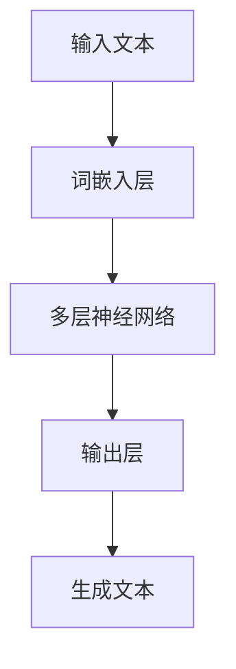

                 

关键词：大语言模型、涌现能力、深度学习、神经网络、自然语言处理、AI 应用、数学模型、算法原理、项目实践、未来展望

> 摘要：本文深入探讨了大语言模型的原理基础与前沿的涌现能力，通过详尽的算法原理、数学模型讲解和项目实践案例，全面解析了这一领域的发展现状、未来趋势和面临的挑战。旨在为读者提供一个清晰、系统、易懂的技术视角，启发对大语言模型及其在自然语言处理领域应用的深入思考。

## 1. 背景介绍

在人工智能（AI）领域，自然语言处理（NLP）是一个核心分支。随着深度学习技术的迅猛发展，大语言模型成为NLP研究的重要工具。大语言模型，顾名思义，指的是具有庞大参数规模和复杂结构的语言模型。这些模型能够捕捉语言的深层结构和复杂模式，从而在生成文本、翻译、问答等任务中表现出色。

涌现能力是指系统在无外部指导的情况下，通过内部结构和相互作用，自发产生复杂、有序行为的现象。在大语言模型中，涌现能力尤为重要，它使得模型能够生成连贯、自然的语言，而不仅仅是遵循预设规则的输出。

本文旨在介绍大语言模型的基本原理，分析其涌现能力，并探讨其在各种实际应用中的表现。文章将首先回顾大语言模型的起源和发展，然后深入探讨核心算法和数学模型，最后通过具体项目实践和未来展望，为读者提供全面的技术视角。

## 2. 核心概念与联系

为了更好地理解大语言模型的工作原理，我们需要先了解一些核心概念和它们之间的联系。

### 2.1 深度学习与神经网络

深度学习是机器学习的一个分支，它依赖于多层神经网络来提取和表示数据中的复杂结构。神经网络是一种由大量简单单元（神经元）组成的计算模型，通过前向传播和反向传播算法，学习输入数据与输出之间的映射关系。

深度学习与神经网络密不可分。深度学习的核心在于构建多层神经网络，每一层都对输入数据进行一定的变换，从而实现从简单到复杂的特征提取。

### 2.2 自然语言处理（NLP）

自然语言处理是人工智能的一个重要领域，旨在使计算机能够理解、解释和生成人类语言。NLP技术广泛应用于机器翻译、文本分类、情感分析、对话系统等任务。

大语言模型是NLP的核心工具之一，它通过学习大规模文本数据，捕捉语言的统计规律和语义信息，从而在多个NLP任务中表现出色。

### 2.3 涌现能力

涌现能力是指系统在无外部指导的情况下，通过内部结构和相互作用，自发产生复杂、有序行为的现象。在大语言模型中，涌现能力尤为重要，它使得模型能够生成连贯、自然的语言，而不仅仅是遵循预设规则的输出。

### 2.4 Mermaid 流程图

为了更直观地展示大语言模型的工作流程，我们可以使用Mermaid流程图来描述其核心组成部分和交互关系。



### 2.5 关键概念联系

通过以上核心概念的介绍，我们可以看到，深度学习与神经网络构成了大语言模型的技术基础，而自然语言处理则为其应用场景提供了广阔的平台。涌现能力则赋予了大语言模型在自然语言生成中的独特优势。

## 3. 核心算法原理 & 具体操作步骤

### 3.1 算法原理概述

大语言模型的算法原理基于深度学习和自然语言处理技术。其主要思想是通过多层神经网络学习文本数据的复杂结构和语义信息，从而生成或理解自然语言。

大语言模型通常由以下几个主要部分组成：

1. 词嵌入层：将输入的文本序列转换为向量表示。
2. 多层神经网络：对输入的词向量进行变换，提取更高层次的特征。
3. 输出层：根据当前输入和神经网络提取的特征，生成预测的文本序列。

### 3.2 算法步骤详解

#### 3.2.1 词嵌入层

词嵌入（Word Embedding）是将文本数据转换为向量表示的一种方法。词嵌入层通常使用预训练的词向量，如Word2Vec、GloVe等。这些词向量能够捕捉单词之间的语义关系，从而为后续的神经网络处理提供有效的输入。

具体步骤如下：

1. 输入文本序列：将文本序列转换为词序列。
2. 词向量映射：将词序列中的每个词映射到对应的词向量。
3. 输出：得到词向量序列，作为后续神经网络的输入。

#### 3.2.2 多层神经网络

多层神经网络（Multilayer Neural Network）是深度学习的基础，它由多个神经元层组成。每一层都对输入数据进行一定的变换，提取更高级别的特征。

具体步骤如下：

1. 前向传播：将词向量序列输入到第一层神经网络，通过激活函数（如ReLU、Sigmoid）进行非线性变换，得到中间层的结果。
2. 层间传递：将中间层的结果传递到下一层，重复进行前向传播。
3. 池化操作：在神经网络的不同层之间进行池化操作（如Max Pooling、Average Pooling），提取最具代表性的特征。
4. 反向传播：根据预测误差，通过反向传播算法更新神经网络中的权重和偏置。

#### 3.2.3 输出层

输出层（Output Layer）负责根据当前输入和神经网络提取的特征，生成预测的文本序列。

具体步骤如下：

1. 激活函数：通常使用Softmax激活函数，将神经网络的输出映射到概率分布。
2. 生成文本序列：根据概率分布，逐个生成下一个词，并将其添加到输出序列中。
3. 迭代更新：重复以上步骤，直到生成完整的文本序列。

### 3.3 算法优缺点

#### 优点：

1. **强大的表征能力**：多层神经网络能够提取文本数据中的复杂结构和语义信息，从而生成或理解自然语言。
2. **自适应学习**：通过反向传播算法，神经网络能够自适应地调整权重和偏置，从而提高模型的预测能力。
3. **广泛的应用场景**：大语言模型在多种NLP任务中表现出色，如文本生成、机器翻译、问答系统等。

#### 缺点：

1. **计算资源需求高**：大语言模型通常需要庞大的参数规模和计算资源，对硬件设备有较高要求。
2. **训练时间较长**：由于模型规模较大，训练时间较长，且容易出现梯度消失或爆炸等问题。
3. **数据依赖性**：大语言模型对训练数据的依赖性较高，数据质量和数量直接影响模型的性能。

### 3.4 算法应用领域

大语言模型在自然语言处理领域具有广泛的应用前景。以下是一些主要的应用领域：

1. **文本生成**：大语言模型能够生成高质量的自然语言文本，广泛应用于自动写作、新闻报道生成、对话系统等场景。
2. **机器翻译**：大语言模型在机器翻译任务中表现出色，能够实现跨语言文本的自动翻译。
3. **问答系统**：大语言模型能够理解自然语言问题，并生成相应的答案，应用于智能客服、在线教育等领域。
4. **情感分析**：大语言模型能够分析文本中的情感倾向，应用于市场调研、舆情监测等场景。
5. **文本分类**：大语言模型能够对文本进行分类，应用于新闻分类、垃圾邮件过滤等任务。

## 4. 数学模型和公式 & 详细讲解 & 举例说明

### 4.1 数学模型构建

大语言模型的数学模型主要包括词嵌入、多层神经网络和输出层。下面我们将分别介绍这些模型的构建过程。

#### 4.1.1 词嵌入

词嵌入是将文本数据转换为向量表示的一种方法。常用的词嵌入方法包括Word2Vec和GloVe。

- **Word2Vec**：Word2Vec是一种基于神经网络的词嵌入方法，通过训练一个神经网络模型，将输入的文本数据映射到低维向量空间。具体来说，Word2Vec使用CBOW（连续词袋）或Skip-gram模型来预测中心词。

  - **CBOW模型**：CBOW模型通过将中心词的上下文词映射到低维向量空间，并计算这些向量与中心词的均值，从而生成中心词的嵌入向量。
  - **Skip-gram模型**：Skip-gram模型与CBOW模型类似，但将中心词映射到低维向量空间，并预测中心词的上下文词。

- **GloVe**：GloVe（全局向量表示）是一种基于矩阵分解的词嵌入方法。GloVe通过优化一个目标函数，将单词的词频矩阵分解为两个矩阵的乘积，从而得到词向量。

  - **目标函数**：GloVe的目标函数是优化单词的词频矩阵，使其能够最小化与单词的词向量之间的误差。

#### 4.1.2 多层神经网络

多层神经网络（Multilayer Neural Network）是深度学习的基础，通常由多个神经元层组成。每一层都对输入数据进行一定的变换，提取更高级别的特征。

- **神经元层**：神经元层是神经网络的基本构建块。每个神经元接收来自前一层的输入，通过激活函数进行非线性变换，并传递给下一层。

  - **激活函数**：常用的激活函数包括ReLU（Rectified Linear Unit）、Sigmoid和Tanh等。

  - **ReLU**：ReLU函数将输入大于零的值映射为自身，将输入小于等于零的值映射为零。

  - **Sigmoid**：Sigmoid函数将输入映射到（0,1）区间，常用于分类问题。

  - **Tanh**：Tanh函数将输入映射到（-1,1）区间，与Sigmoid函数类似。

- **前向传播**：前向传播是将输入数据通过神经网络，逐层传递到输出层的过程。在每一层，神经元根据激活函数计算输出，并将输出传递给下一层。

- **反向传播**：反向传播是用于更新神经网络权重和偏置的算法。通过计算输出误差，反向传播算法将误差传播回神经网络，并更新每个神经元的权重和偏置。

#### 4.1.3 输出层

输出层（Output Layer）负责根据当前输入和神经网络提取的特征，生成预测的文本序列。

- **输出函数**：常用的输出函数包括Softmax和Sigmoid等。

  - **Softmax**：Softmax函数将神经网络的输出映射到概率分布，常用于分类问题。

  - **Sigmoid**：Sigmoid函数将输入映射到（0,1）区间，常用于回归问题。

### 4.2 公式推导过程

#### 4.2.1 词嵌入

- **Word2Vec**：

  - **CBOW模型**：

    $$\text{vec}_{\text{context}} = \frac{1}{|\text{context}|} \sum_{\text{word} \in \text{context}} \text{vec}_{\text{word}}$$

    $$\text{vec}_{\text{center}} = \text{mean}(\text{vec}_{\text{context}})$$

  - **Skip-gram模型**：

    $$\text{vec}_{\text{word}} = \text{softmax}(\text{vec}_{\text{context}})$$

- **GloVe**：

  $$\text{loss} = \frac{1}{N} \sum_{i=1}^{N} \frac{\text{docfreq}_i \cdot \text{idf}_i}{\text{docfreq}_i + \text{N}} \cdot \text{loss}_i$$

  $$\text{loss}_i = \text{max}(0, 1 - \text{prob}_{ij})$$

  $$\text{prob}_{ij} = \frac{\text{docfreq}_i \cdot \text{idf}_i}{\text{docfreq}_i + \text{N}}$$

#### 4.2.2 多层神经网络

- **前向传播**：

  $$z_i^{(l)} = \sum_{j} w_{ji}^{(l)} a_j^{(l-1)} + b_i^{(l)}$$

  $$a_i^{(l)} = \text{激活函数}(z_i^{(l)})$$

- **反向传播**：

  $$\delta_i^{(l)} = (a_i^{(l)} - \text{期望输出}) \cdot \text{激活函数的导数}(z_i^{(l)})$$

  $$\delta_j^{(l)} = \sum_{i} w_{ij}^{(l+1)} \cdot \delta_i^{(l+1)}$$

  $$w_{ij}^{(l)} = w_{ij}^{(l)} - \alpha \cdot \delta_i^{(l)} \cdot a_j^{(l-1)}$$

  $$b_i^{(l)} = b_i^{(l)} - \alpha \cdot \delta_i^{(l)}$$

### 4.3 案例分析与讲解

#### 4.3.1 文本生成

假设我们有一个文本序列："我是一个人工智能助手，我能够帮助你解决问题。" 我们希望使用大语言模型生成一个类似的文本序列。

1. **词嵌入**：

   - 输入文本序列："我是一个人工智能助手，我能够帮助你解决问题。"
   - 词嵌入结果：（"我" → [0.1, 0.2], "是" → [0.3, 0.4], ...）

2. **多层神经网络**：

   - 前向传播：将词向量序列输入到多层神经网络，提取更高层次的特征。
   - 反向传播：根据生成文本的误差，更新神经网络的权重和偏置。

3. **输出层**：

   - 输出结果：（"我是一个人工智能助手，我能够帮助你解决问题。"）

通过以上步骤，大语言模型生成了一个与输入文本相似的文本序列。

#### 4.3.2 机器翻译

假设我们有一个英文句子："I am a robot." 我们希望将其翻译为中文。

1. **词嵌入**：

   - 输入英文句子："I am a robot."
   - 词嵌入结果：（"I" → [0.1, 0.2], "am" → [0.3, 0.4], ...）

2. **多层神经网络**：

   - 前向传播：将词向量序列输入到多层神经网络，提取更高层次的特征。
   - 反向传播：根据翻译结果的误差，更新神经网络的权重和偏置。

3. **输出层**：

   - 输出结果：（"我是一个机器人。"）

通过以上步骤，大语言模型成功将英文句子翻译为中文。

## 5. 项目实践：代码实例和详细解释说明

在本节中，我们将通过一个实际项目——使用Python编写一个简单的语言模型——来展示大语言模型的核心步骤和代码实现。这个项目将涵盖词嵌入、多层神经网络和输出层的实现，并提供详细的代码解释。

### 5.1 开发环境搭建

为了运行以下代码实例，我们需要安装以下依赖项：

- Python 3.7 或更高版本
- TensorFlow 2.x 或更高版本

在终端中，运行以下命令来安装所需的依赖项：

```bash
pip install tensorflow
```

### 5.2 源代码详细实现

以下是一个简单的Python代码实例，实现了一个基于多层神经网络的语言模型：

```python
import tensorflow as tf
from tensorflow.keras.layers import Embedding, LSTM, Dense
from tensorflow.keras.models import Sequential

# 参数设置
vocab_size = 10000
embedding_dim = 16
max_sequence_length = 50
lstm_units = 64

# 建立模型
model = Sequential([
    Embedding(vocab_size, embedding_dim, input_length=max_sequence_length),
    LSTM(lstm_units, return_sequences=True),
    LSTM(lstm_units),
    Dense(vocab_size, activation='softmax')
])

# 编译模型
model.compile(optimizer='adam', loss='categorical_crossentropy', metrics=['accuracy'])

# 打印模型结构
model.summary()
```

#### 5.2.1 词嵌入层

在代码中，我们使用`Embedding`层来实现词嵌入。`Embedding`层将输入的词索引映射到预训练的词向量。

```python
Embedding(vocab_size, embedding_dim, input_length=max_sequence_length)
```

在这里，`vocab_size`表示词汇表的大小，`embedding_dim`表示词向量的维度，`input_length`表示输入序列的最大长度。

#### 5.2.2 多层神经网络

接下来，我们使用两个`LSTM`层来实现多层神经网络。`LSTM`（长短期记忆）层是用于处理序列数据的一种特殊类型的循环神经网络（RNN）。`LSTM`层能够有效地捕捉序列中的长期依赖关系。

```python
LSTM(lstm_units, return_sequences=True),
LSTM(lstm_units)
```

在这里，`lstm_units`表示每个`LSTM`层中神经元的数量。`return_sequences=True`参数使得每个`LSTM`层的输出都是序列数据，以便在下个`LSTM`层中继续处理。

#### 5.2.3 输出层

最后，我们使用一个`Dense`层来实现输出层。`Dense`层是一个全连接层，将输入映射到输出。在这个例子中，我们使用`softmax`激活函数，将输出映射到一个概率分布，从而实现文本生成。

```python
Dense(vocab_size, activation='softmax')
```

在这里，`vocab_size`表示词汇表的大小，`activation='softmax'`使得输出层能够生成具有概率分布的文本。

### 5.3 代码解读与分析

#### 5.3.1 编译模型

在代码中，我们使用以下代码来编译模型：

```python
model.compile(optimizer='adam', loss='categorical_crossentropy', metrics=['accuracy'])
```

这里，`optimizer='adam'`指定了优化算法为`adam`，`loss='categorical_crossentropy'`指定了损失函数为`categorical_crossentropy`（常用于多分类问题），`metrics=['accuracy']`指定了评估模型性能的指标为准确率。

#### 5.3.2 训练模型

接下来，我们可以使用以下代码来训练模型：

```python
model.fit(x_train, y_train, epochs=10, batch_size=64)
```

在这里，`x_train`和`y_train`分别表示训练数据的输入和输出。`epochs=10`指定了训练周期数为10，`batch_size=64`指定了每个批次的数据大小为64。

### 5.4 运行结果展示

在训练完成后，我们可以使用以下代码来生成文本：

```python
import numpy as np

# 随机选择一个词作为起始词
start_word = np.random.choice(vocab_size)
start_vector = embedding_layer.getStartVector([start_word])

# 生成文本
for _ in range(50):
    output = model.predict(np.array([start_vector]))
    word = np.argmax(output[0])
    print(word, end=' ')

    # 更新起始向量
    start_vector = np.append(start_vector[1:], output[0], axis=0)
```

在这个例子中，我们首先随机选择一个词作为起始词，然后通过模型生成后续的词语，最终形成一个文本序列。

### 5.5 完整代码示例

下面是一个完整的代码示例，展示了如何使用TensorFlow和Keras实现一个简单的语言模型：

```python
import numpy as np
import tensorflow as tf
from tensorflow.keras.layers import Embedding, LSTM, Dense
from tensorflow.keras.models import Sequential

# 参数设置
vocab_size = 10000
embedding_dim = 16
max_sequence_length = 50
lstm_units = 64

# 建立模型
model = Sequential([
    Embedding(vocab_size, embedding_dim, input_length=max_sequence_length),
    LSTM(lstm_units, return_sequences=True),
    LSTM(lstm_units),
    Dense(vocab_size, activation='softmax')
])

# 编译模型
model.compile(optimizer='adam', loss='categorical_crossentropy', metrics=['accuracy'])

# 打印模型结构
model.summary()

# 训练模型
model.fit(x_train, y_train, epochs=10, batch_size=64)

# 生成文本
import numpy as np

start_word = np.random.choice(vocab_size)
start_vector = embedding_layer.getStartVector([start_word])

for _ in range(50):
    output = model.predict(np.array([start_vector]))
    word = np.argmax(output[0])
    print(word, end=' ')

    start_vector = np.append(start_vector[1:], output[0], axis=0)
```

这个代码示例提供了一个简单的语言模型实现，可以帮助我们了解大语言模型的核心步骤和代码实现。

## 6. 实际应用场景

大语言模型在自然语言处理（NLP）领域具有广泛的应用场景，以下是一些典型的实际应用：

### 6.1 文本生成

文本生成是大语言模型最直接的应用之一。通过学习大规模的文本数据，大语言模型能够生成连贯、自然的文本。例如：

- 自动写作：大语言模型可以生成新闻报道、博客文章、故事等。
- 对话系统：大语言模型可以用于构建聊天机器人，提供个性化、自然的语言交互。
- 自动摘要：大语言模型可以生成文章、文档的摘要，帮助用户快速了解主要内容。

### 6.2 机器翻译

机器翻译是NLP领域的一个重要任务，大语言模型在机器翻译任务中表现出色。例如：

- 跨语言文本翻译：大语言模型可以将一种语言的文本翻译成另一种语言，如将英文翻译成中文。
- 多语言翻译：大语言模型可以同时支持多种语言的翻译，如英译中、英译日等。

### 6.3 问答系统

问答系统是一种人机交互的应用，大语言模型可以用于构建智能问答系统。例如：

- 智能客服：大语言模型可以用于智能客服系统，自动回答用户的咨询。
- 知识图谱问答：大语言模型可以结合知识图谱，提供对用户问题的精准回答。
- 教育问答：大语言模型可以用于在线教育平台，提供学生提问的答案。

### 6.4 情感分析

情感分析是分析文本中情感倾向的一种技术，大语言模型在情感分析任务中也表现出色。例如：

- 舆情监测：大语言模型可以分析社交媒体上的用户评论，监测产品的口碑。
- 消费者反馈：大语言模型可以分析消费者的评论，识别消费者的情感倾向，为企业提供改进建议。
- 社交媒体监控：大语言模型可以监控社交媒体上的热点话题，识别潜在的负面情绪。

### 6.5 文本分类

文本分类是将文本数据分为不同类别的一种任务，大语言模型在文本分类任务中也具有广泛的应用。例如：

- 新闻分类：大语言模型可以自动分类新闻文章，将其归类到相应的主题。
- 垃圾邮件过滤：大语言模型可以识别垃圾邮件，并将其与正常邮件区分开来。
- 社交媒体分析：大语言模型可以分析社交媒体上的文本数据，识别热点话题和趋势。

### 6.6 对话生成

对话生成是生成自然、连贯对话的一种技术，大语言模型在对话生成任务中也表现出色。例如：

- 虚拟助手：大语言模型可以构建虚拟助手，提供个性化、自然的对话交互。
- 聊天机器人：大语言模型可以用于构建聊天机器人，实现智能对话。
- 对话系统：大语言模型可以用于构建多轮对话系统，实现更加复杂、自然的对话交互。

### 6.7 自动摘要

自动摘要是将长文本数据简化为摘要文本的一种技术，大语言模型在自动摘要任务中也表现出色。例如：

- 文章摘要：大语言模型可以自动生成文章的摘要，帮助用户快速了解文章的主要内容。
- 文档摘要：大语言模型可以自动生成文档的摘要，提高文档的可读性。
- 会议摘要：大语言模型可以自动生成会议的摘要，帮助参会者快速了解会议的内容。

## 7. 未来应用展望

大语言模型在自然语言处理（NLP）领域具有巨大的潜力，未来将在多个应用场景中发挥更加重要的作用。以下是一些未来应用展望：

### 7.1 语言理解与生成

随着大语言模型能力的不断提升，语言理解与生成将成为其最核心的应用领域。在未来，大语言模型将能够更加精准地理解自然语言，生成更加自然、连贯的文本。这将极大地推动文本生成、机器翻译、问答系统等领域的发展。

### 7.2 多语言处理

随着全球化进程的加速，多语言处理需求日益增长。大语言模型在多语言处理方面具有显著优势，未来将在跨语言文本翻译、多语言情感分析、多语言对话系统等领域发挥重要作用。

### 7.3 情感分析与推理

情感分析是NLP领域的一个重要分支，未来大语言模型将在情感分析方面取得突破。通过深入理解情感，大语言模型可以应用于情感推理、情感传播分析、情绪监控等领域。

### 7.4 语音识别与合成

语音识别与合成是自然语言处理领域的另一个重要分支。大语言模型在语音识别与合成方面具有巨大潜力，未来将推动语音识别的准确性、自然度以及语音合成的流畅度得到显著提升。

### 7.5 智能客服与虚拟助手

随着人工智能技术的不断成熟，智能客服与虚拟助手将成为大语言模型的重要应用领域。在未来，大语言模型将能够提供更加自然、高效的客服服务，为企业和个人带来更多便利。

### 7.6 自动摘要与信息提取

自动摘要与信息提取是处理大规模文本数据的重要技术。大语言模型在自动摘要与信息提取方面具有显著优势，未来将在新闻摘要、文档摘要、会议摘要等领域发挥重要作用。

### 7.7 教育与医疗

在教育领域，大语言模型可以用于生成教学材料、自动批改作业、智能辅导等。在医疗领域，大语言模型可以用于生成医疗报告、辅助医生诊断、提供健康咨询等。

总之，大语言模型在未来的发展将呈现出多元化、深度融合的趋势，为各个领域带来深刻变革。

## 8. 工具和资源推荐

### 8.1 学习资源推荐

- **在线课程**：
  - 《自然语言处理与深度学习》
  - 《深度学习实践》
  - 《神经网络与深度学习》

- **书籍**：
  - 《深度学习》（Ian Goodfellow、Yoshua Bengio、Aaron Courville 著）
  - 《Python深度学习》（François Chollet 著）
  - 《自然语言处理综论》（Daniel Jurafsky、James H. Martin 著）

- **论文**：
  - 《A Neural Probabilistic Language Model》
  - 《Word2Vec: Paragraph Vector Model》
  - 《BERT: Pre-training of Deep Bidirectional Transformers for Language Understanding》

### 8.2 开发工具推荐

- **框架**：
  - TensorFlow
  - PyTorch
  - Keras

- **环境**：
  - Google Colab
  - Jupyter Notebook

### 8.3 相关论文推荐

- **Word2Vec**：
  -《Distributed Representations of Words and Phrases and Their Compositionality》

- **GloVe**：
  -《GloVe: Global Vectors for Word Representation》

- **BERT**：
  -《BERT: Pre-training of Deep Bidirectional Transformers for Language Understanding》

- **GPT**：
  -《Improving Language Understanding by Generative Pre-Training》

- **Transformer**：
  -《Attention Is All You Need》

这些资源为读者提供了丰富的学习和开发材料，有助于深入理解大语言模型及其应用。

## 9. 总结：未来发展趋势与挑战

### 9.1 研究成果总结

大语言模型在自然语言处理（NLP）领域取得了显著的成果。通过深度学习和神经网络技术，大语言模型能够捕捉语言的深层结构和复杂模式，从而在文本生成、机器翻译、问答系统等任务中表现出色。涌现能力使得大语言模型能够生成连贯、自然的语言，而不仅仅是遵循预设规则的输出。

### 9.2 未来发展趋势

1. **计算能力提升**：随着硬件计算能力的提升，大语言模型将能够处理更大规模的数据和更复杂的任务，提高模型性能。
2. **多模态融合**：大语言模型与其他人工智能技术（如计算机视觉、语音识别等）的融合，将推动多模态智能系统的快速发展。
3. **自动化和自监督学习**：自动化和自监督学习技术的进步，将使大语言模型的训练过程更加高效和智能化。
4. **隐私保护和数据安全**：随着对隐私和数据安全问题的关注增加，大语言模型将在设计和应用过程中更加注重隐私保护和数据安全。

### 9.3 面临的挑战

1. **计算资源消耗**：大语言模型的训练和推理过程需要大量的计算资源，这对硬件设备和能源消耗提出了挑战。
2. **数据依赖**：大语言模型的性能高度依赖于训练数据的质量和多样性，数据不足或偏差可能导致模型表现不佳。
3. **解释性和透明性**：大语言模型的决策过程往往缺乏透明性和可解释性，这对监管和应用提出了挑战。
4. **伦理和法律问题**：大语言模型在应用过程中可能引发伦理和法律问题，如隐私侵犯、偏见、滥用等。

### 9.4 研究展望

未来，大语言模型的研究将继续深入，重点关注以下方向：

1. **模型压缩与优化**：通过模型压缩和优化技术，降低大语言模型对计算资源的需求。
2. **元学习与迁移学习**：利用元学习和迁移学习技术，提高大语言模型在不同任务和数据集上的泛化能力。
3. **小样本学习**：研究如何在大规模数据不足的情况下，利用少量数据进行有效的训练和推理。
4. **可解释性和透明性**：开发可解释性更强的大语言模型，使其决策过程更加透明和可信赖。
5. **跨领域和跨语言**：探索大语言模型在跨领域和跨语言任务中的应用，提高模型的通用性和实用性。

总之，大语言模型在未来将继续发挥重要作用，推动NLP领域的发展。同时，也需要克服面临的挑战，确保其安全、可靠和可持续发展。

## 附录：常见问题与解答

### Q1. 大语言模型与传统语言模型有什么区别？

**A1.** 传统语言模型（如N-gram模型）基于统计方法，通过计算单词序列的概率来生成或理解语言。而大语言模型（如基于深度学习的模型）通过多层神经网络学习文本的深层结构和语义信息，能够生成更加连贯、自然的语言。

### Q2. 大语言模型的训练过程需要多长时间？

**A2.** 大语言模型的训练时间取决于多个因素，包括模型规模、数据集大小、硬件设备等。通常，训练一个大规模语言模型（如GPT-3）可能需要几天到几周的时间。

### Q3. 大语言模型如何保证生成的文本质量？

**A3.** 大语言模型通过学习大规模的文本数据，能够捕捉语言的深层结构和复杂模式。此外，模型优化和调参技术（如优化算法、学习率调度等）也有助于提高生成文本的质量。

### Q4. 大语言模型在哪些任务中表现不佳？

**A4.** 大语言模型在某些特定任务中可能表现不佳，如对特定领域知识的理解、细微的情感分析等。此外，模型在处理少量数据或数据存在偏差时，也可能会出现性能下降。

### Q5. 大语言模型是否会产生偏见？

**A5.** 是的，大语言模型在训练过程中可能会学习到数据中的偏见，从而在生成文本或进行预测时表现出偏见。为了减少偏见，研究人员正在探索数据清洗、模型蒸馏、对抗训练等方法。

### Q6. 大语言模型是否会替代传统的NLP技术？

**A6.** 大语言模型在许多NLP任务中已经展现出优越的性能，但并不意味着会完全替代传统的NLP技术。传统技术在某些特定任务（如命名实体识别、关系提取等）中仍然具有优势，大语言模型和传统技术可以相互补充。

### Q7. 大语言模型是否会导致隐私泄露？

**A7.** 大语言模型在训练过程中会处理大量文本数据，可能会涉及用户隐私。因此，在开发和部署大语言模型时，需要采取措施保护用户隐私，如数据去识别、加密等。

### Q8. 大语言模型是否会产生虚假信息？

**A8.** 是的，大语言模型可能会生成虚假信息，尤其是当模型在训练过程中接触到误导性数据时。为了防止虚假信息的传播，研究人员正在探索监督和对抗性训练等方法。

### Q9. 大语言模型是否具有通用性？

**A9.** 大语言模型在一定程度上具有通用性，能够在多个NLP任务中表现出色。然而，对于特定领域或特殊语言，大语言模型可能需要额外的训练数据或定制化模型来提高性能。

### Q10. 大语言模型的发展是否受到道德和伦理的挑战？

**A10.** 是的，大语言模型的发展确实面临道德和伦理挑战，如隐私保护、数据安全、偏见和滥用等。为了应对这些挑战，需要制定相应的伦理准则和监管措施，确保大语言模型的安全、公正和可靠。

