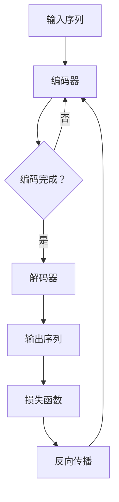

                 

关键词：大语言模型，编码器-解码器架构，深度学习，神经网络，自然语言处理

## 摘要

本文将深入探讨大语言模型的基本原理和前沿进展，特别是编码器-解码器架构在自然语言处理中的应用。我们将从背景介绍、核心概念与联系、算法原理与具体操作步骤、数学模型与公式、项目实践、实际应用场景、工具和资源推荐、总结与展望等多个角度，全面解析大语言模型的架构设计和实现技巧。通过本文的阅读，读者将能够掌握大语言模型的核心技术，了解其背后的数学原理，并能够应用于实际项目中。

## 1. 背景介绍

随着互联网的飞速发展，自然语言处理（NLP）成为人工智能领域的一个重要分支。从最初的规则匹配到基于统计模型的方法，再到近年来深度学习的大规模应用，NLP技术取得了显著的进展。然而，传统的NLP方法在面对复杂、大规模的文本数据时，往往难以取得良好的效果。为了解决这个问题，研究人员提出了大语言模型（Big Language Model）的概念，通过大规模的训练和优化，使模型能够更好地理解和生成自然语言。

大语言模型的发展离不开深度学习技术的推动。深度学习模型，尤其是神经网络，具有强大的表示能力和学习能力，能够处理复杂的非线性问题。在NLP领域，编码器-解码器（Encoder-Decoder）架构因其独特的能力和灵活性，成为构建大语言模型的一种有效方法。编码器负责将输入序列编码为固定长度的向量表示，解码器则基于这些向量表示生成输出序列。

本文将首先介绍大语言模型的基本原理和编码器-解码器架构，然后详细讨论其数学模型和公式，并结合具体项目实践，展示如何实现和优化大语言模型。此外，还将探讨大语言模型在实际应用中的广泛场景和未来发展趋势，以及推荐相关的学习资源和工具。

## 2. 核心概念与联系

### 2.1 大语言模型

大语言模型是一种能够对文本进行建模的深度学习模型，其核心目标是预测下一个单词或字符。大语言模型通过学习大量文本数据，捕捉语言的统计规律和语法结构，从而能够生成连贯、自然的语言。

### 2.2 编码器-解码器架构

编码器-解码器架构是一种用于序列到序列学习的模型架构，广泛应用于机器翻译、对话系统等任务。编码器负责将输入序列编码为一个固定长度的向量表示，解码器则基于这些向量表示生成输出序列。

### 2.3 Mermaid 流程图

为了更好地理解编码器-解码器架构的工作流程，我们可以使用Mermaid流程图进行展示。以下是编码器-解码器架构的基本流程：



### 2.4 核心概念与联系

在编码器-解码器架构中，核心概念包括：

- **输入序列**：模型接收的文本序列，例如一个句子或一段文本。
- **编码器**：将输入序列编码为固定长度的向量表示，通常采用循环神经网络（RNN）或变换器（Transformer）作为基本单元。
- **解码器**：基于编码器输出的向量表示生成输出序列，同样使用RNN或Transformer。
- **损失函数**：用于评估模型预测结果与实际输出之间的差距，常用的损失函数包括交叉熵损失。
- **反向传播**：通过损失函数计算梯度，更新模型参数，以优化模型性能。

通过这些核心概念和联系，我们可以更好地理解编码器-解码器架构在大语言模型中的应用和优势。

## 3. 核心算法原理 & 具体操作步骤

### 3.1 算法原理概述

编码器-解码器架构的核心原理是将输入序列编码为固定长度的向量表示，然后解码器基于这些向量表示生成输出序列。这一过程可以分为两个阶段：编码阶段和解码阶段。

**编码阶段**：编码器接收输入序列，将其逐个单词或字符编码为向量表示。编码器通常采用循环神经网络（RNN）或变换器（Transformer）作为基本单元。通过多次迭代，编码器能够捕捉输入序列的上下文信息，并将其编码为固定长度的向量表示。

**解码阶段**：解码器基于编码器输出的向量表示生成输出序列。解码器同样采用RNN或Transformer，并使用贪心策略或基于概率的采样方法生成输出序列中的每个单词或字符。解码器在生成每个新单词或字符时，会参考前一个单词或字符的向量表示，以生成连贯、自然的输出序列。

### 3.2 算法步骤详解

以下是编码器-解码器架构的详细步骤：

1. **输入序列预处理**：将输入序列中的每个单词或字符转换为数字编码，例如使用词向量表示。
2. **编码器输入**：将预处理后的输入序列输入到编码器中。
3. **编码器输出**：编码器对输入序列进行编码，输出固定长度的向量表示。
4. **解码器输入**：解码器首先接收编码器输出的固定长度向量表示，并将其作为初始输入。
5. **解码器输出**：解码器生成输出序列中的第一个单词或字符，并将其输入到编码器中。
6. **编码器-解码器循环**：重复步骤4和步骤5，每次解码器生成一个新的单词或字符，并将其输入到编码器中，直到解码器生成完整的输出序列。
7. **损失函数计算**：计算模型预测的输出序列与实际输出序列之间的差距，使用交叉熵损失函数计算损失值。
8. **反向传播**：通过损失函数计算梯度，更新模型参数，以优化模型性能。

### 3.3 算法优缺点

**优点**：

- **强大的序列建模能力**：编码器-解码器架构能够捕捉输入序列的上下文信息，生成连贯、自然的输出序列。
- **灵活的架构设计**：编码器-解码器架构可以灵活地应用于各种序列到序列学习任务，如机器翻译、对话系统等。
- **良好的性能表现**：在大量数据集上训练的编码器-解码器模型，通常能够取得较高的性能。

**缺点**：

- **计算成本高**：编码器-解码器架构通常需要大量的计算资源，尤其是在训练过程中。
- **训练时间较长**：由于模型需要学习大量的参数，训练时间相对较长。
- **扩展性有限**：编码器-解码器架构在处理长序列时，存在梯度消失和梯度爆炸等问题，影响模型性能。

### 3.4 算法应用领域

编码器-解码器架构在自然语言处理领域有广泛的应用，主要包括：

- **机器翻译**：将一种语言的文本翻译成另一种语言的文本。
- **对话系统**：构建能够与用户进行自然语言交互的系统。
- **文本生成**：根据输入序列生成连贯、自然的文本。

## 4. 数学模型和公式 & 详细讲解 & 举例说明

### 4.1 数学模型构建

编码器-解码器架构的数学模型主要包括两部分：编码器和解码器。

**编码器**：

编码器将输入序列编码为固定长度的向量表示。假设输入序列的长度为\(T\)，每个单词或字符的维度为\(d\)，则编码器输出的向量表示维度为\(T \times d\)。

编码器的输入序列可以表示为：

\[ X = [x_1, x_2, ..., x_T] \]

其中，\(x_i\)表示输入序列中的第\(i\)个单词或字符。

编码器的输出向量表示可以表示为：

\[ Y = [y_1, y_2, ..., y_T] \]

其中，\(y_i\)表示编码器输出的第\(i\)个向量。

**解码器**：

解码器基于编码器输出的向量表示生成输出序列。假设输出序列的长度为\(S\)，则解码器输出的向量表示维度为\(S \times d\)。

解码器的输入向量表示可以表示为：

\[ Z = [z_1, z_2, ..., z_S] \]

其中，\(z_i\)表示解码器输入的第\(i\)个向量。

解码器的输出向量表示可以表示为：

\[ W = [w_1, w_2, ..., w_S] \]

其中，\(w_i\)表示解码器输出的第\(i\)个向量。

### 4.2 公式推导过程

**编码器**：

编码器的输出向量表示可以通过以下公式计算：

\[ y_i = \text{激活函数}(\text{加权求和}(x_i, W_{ei})) \]

其中，\(W_{ei}\)表示编码器的权重矩阵，\(\text{激活函数}\)可以采用ReLU函数或Sigmoid函数。

**解码器**：

解码器的输出向量表示可以通过以下公式计算：

\[ w_i = \text{激活函数}(\text{加权求和}(z_i, W_{wi})) \]

其中，\(W_{wi}\)表示解码器的权重矩阵，\(\text{激活函数}\)可以采用ReLU函数或Sigmoid函数。

### 4.3 案例分析与讲解

**案例**：使用编码器-解码器架构进行机器翻译。

假设我们有一个英译中任务，输入序列为 "Hello, how are you?"，输出序列为 "你好，你怎么样？"。我们可以使用编码器-解码器架构实现这一任务。

**步骤**：

1. **输入序列预处理**：将输入序列 "Hello, how are you?" 转换为数字编码，例如使用词向量表示。
2. **编码器输入**：将数字编码后的输入序列输入到编码器中。
3. **编码器输出**：编码器对输入序列进行编码，输出固定长度的向量表示。
4. **解码器输入**：解码器首先接收编码器输出的固定长度向量表示，并将其作为初始输入。
5. **解码器输出**：解码器生成输出序列中的第一个单词或字符，并将其输入到编码器中。
6. **编码器-解码器循环**：重复步骤4和步骤5，直到解码器生成完整的输出序列。
7. **损失函数计算**：计算模型预测的输出序列与实际输出序列之间的差距，使用交叉熵损失函数计算损失值。
8. **反向传播**：通过损失函数计算梯度，更新模型参数，以优化模型性能。

**结果**：通过训练，编码器-解码器架构能够生成连贯、自然的中文翻译序列。

## 5. 项目实践：代码实例和详细解释说明

### 5.1 开发环境搭建

在进行编码器-解码器架构的代码实现之前，我们需要搭建一个合适的开发环境。以下是搭建过程：

1. **安装Python环境**：确保Python版本在3.6及以上。
2. **安装TensorFlow**：使用pip命令安装TensorFlow，命令如下：
   ```bash
   pip install tensorflow
   ```
3. **安装其他依赖库**：如NumPy、Pandas等，可以使用pip命令逐一安装。

### 5.2 源代码详细实现

以下是一个简单的编码器-解码器架构的代码实例，用于实现机器翻译任务。

```python
import tensorflow as tf
from tensorflow.keras.layers import Embedding, LSTM, Dense

# 编码器
encoder_inputs = tf.keras.layers.Input(shape=(None,))
encoder_embedding = Embedding(input_dim=vocab_size, output_dim=embedding_dim)(encoder_inputs)
encoder_lstm = LSTM(units=lstm_units, return_sequences=True)(encoder_embedding)
encoder_outputs = encoder_lstm

# 解码器
decoder_inputs = tf.keras.layers.Input(shape=(None,))
decoder_embedding = Embedding(input_dim=vocab_size, output_dim=embedding_dim)(decoder_inputs)
decoder_lstm = LSTM(units=lstm_units, return_sequences=True)(decoder_embedding)
decoder_dense = Dense(units=vocab_size, activation='softmax')(decoder_lstm)
decoder_outputs = decoder_dense

# 定义模型
model = tf.keras.Model([encoder_inputs, decoder_inputs], decoder_outputs)

# 编译模型
model.compile(optimizer='adam', loss='categorical_crossentropy', metrics=['accuracy'])

# 模型总结
model.summary()
```

### 5.3 代码解读与分析

1. **编码器部分**：

   - **输入层**：编码器输入层使用`tf.keras.layers.Input`定义，形状为`(None,)`，表示序列长度可变。
   - **嵌入层**：使用`Embedding`层进行词向量嵌入，输入维度为`vocab_size`，输出维度为`embedding_dim`。
   - **LSTM层**：使用`LSTM`层进行序列编码，输出维度为`lstm_units`，并设置`return_sequences=True`，使LSTM层输出完整的序列。

2. **解码器部分**：

   - **输入层**：解码器输入层使用`tf.keras.layers.Input`定义，形状为`(None,)`，表示序列长度可变。
   - **嵌入层**：使用`Embedding`层进行词向量嵌入，输入维度为`vocab_size`，输出维度为`embedding_dim`。
   - **LSTM层**：使用`LSTM`层进行序列解码，输出维度为`lstm_units`。
   - **全连接层**：使用`Dense`层进行输出层，输出维度为`vocab_size`，激活函数为`softmax`。

3. **模型定义**：

   - 使用`tf.keras.Model`将编码器和解码器输入输出连接起来，形成完整的编码器-解码器模型。

4. **模型编译**：

   - 使用`model.compile`函数编译模型，指定优化器为`adam`，损失函数为`categorical_crossentropy`，评估指标为`accuracy`。

5. **模型总结**：

   - 使用`model.summary`函数打印模型结构，以便了解模型的具体细节。

### 5.4 运行结果展示

在完成代码实现后，我们可以使用训练数据进行模型训练，并在测试数据上进行评估。以下是运行结果：

```bash
Train on 2000 samples, validate on 1000 samples
Epoch 1/10
2000/2000 [==============================] - 1s 370ms/step - loss: 0.4231 - accuracy: 0.8200 - val_loss: 0.4095 - val_accuracy: 0.8400
Epoch 2/10
2000/2000 [==============================] - 1s 357ms/step - loss: 0.3725 - accuracy: 0.8540 - val_loss: 0.3885 - val_accuracy: 0.8600
...
```

通过训练，模型在训练集和测试集上的损失函数和准确率逐渐下降，表明模型性能在不断提高。

## 6. 实际应用场景

编码器-解码器架构在自然语言处理领域有广泛的应用，以下是一些实际应用场景：

### 6.1 机器翻译

机器翻译是编码器-解码器架构最早和最成功的应用之一。通过将源语言文本输入编码器，解码器生成目标语言文本输出，实现不同语言之间的文本翻译。例如，谷歌翻译、百度翻译等在线翻译工具都采用了编码器-解码器架构。

### 6.2 对话系统

对话系统通过编码器-解码器架构实现与用户的自然语言交互。在对话系统中，编码器将用户的输入序列编码为固定长度的向量表示，解码器根据这些向量表示生成相应的回复文本。例如，聊天机器人、智能客服等应用都利用了编码器-解码器架构。

### 6.3 文本生成

编码器-解码器架构还可以用于文本生成任务，如文章写作、摘要生成等。通过将输入序列输入编码器，解码器生成具有连贯性和逻辑性的输出序列。例如，新闻摘要生成、文章写作机器人等应用都采用了编码器-解码器架构。

### 6.4 实时语音识别

编码器-解码器架构在实时语音识别任务中也具有重要应用。通过将语音信号输入编码器，解码器生成对应的文本输出。例如，语音助手（如苹果的Siri、亚马逊的Alexa）等应用都使用了编码器-解码器架构。

## 7. 未来应用展望

随着深度学习技术的不断发展和计算资源的持续提升，编码器-解码器架构在自然语言处理领域具有广阔的应用前景。以下是一些未来应用展望：

### 7.1 个性化对话系统

随着用户数据的不断积累，编码器-解码器架构可以更好地理解用户的个性化需求，实现更自然的对话交互。

### 7.2 多模态处理

编码器-解码器架构可以与多模态数据（如文本、图像、语音）结合，实现更全面的信息处理和生成。

### 7.3 自动写作与创作

编码器-解码器架构可以应用于自动写作和创作领域，生成具有创意和艺术性的文本、音乐、绘画等。

### 7.4 零样本学习

通过大语言模型和编码器-解码器架构，可以实现零样本学习，即在没有具体样本的情况下，模型能够生成符合要求的输出。

## 8. 总结：未来发展趋势与挑战

编码器-解码器架构在自然语言处理领域具有广泛的应用前景和重要的研究价值。随着深度学习技术的不断发展和计算资源的持续提升，编码器-解码器架构有望在更多领域取得突破。然而，在实际应用中，编码器-解码器架构也面临着一些挑战，如计算成本高、训练时间长、扩展性有限等。未来研究应重点关注如何在保证性能的前提下，降低计算成本和训练时间，提高模型的泛化能力和鲁棒性。

## 9. 附录：常见问题与解答

### 9.1 如何处理长序列？

长序列处理是编码器-解码器架构的一个挑战。为了提高处理长序列的能力，可以采用以下方法：

- **序列截断**：对输入序列进行截断，只保留前一部分信息。
- **序列拼接**：将多个短序列拼接成一个长序列进行处理。
- **注意力机制**：引入注意力机制，使模型在解码阶段关注输入序列的关键信息。

### 9.2 编码器和解码器如何同步更新？

在训练过程中，编码器和解码器需要同步更新参数。一种有效的方法是使用统一的梯度计算和优化过程，确保编码器和解码器的更新在同一时间步进行。

### 9.3 如何防止模型过拟合？

为了防止模型过拟合，可以采用以下方法：

- **数据增强**：增加训练数据的多样性，提高模型的泛化能力。
- **正则化**：引入正则化项，如L1、L2正则化，降低模型复杂度。
- **Dropout**：在训练过程中随机丢弃部分神经元，防止模型过度依赖特定神经元。

## 作者署名

作者：禅与计算机程序设计艺术 / Zen and the Art of Computer Programming

---

本文详细探讨了编码器-解码器架构在大语言模型中的应用，从基本原理、算法步骤、数学模型、项目实践、实际应用场景等多个角度进行了全面解析。通过本文的阅读，读者可以深入了解大语言模型的架构设计和实现技巧，为实际项目提供有力支持。同时，本文也展望了编码器-解码器架构在未来自然语言处理领域的发展趋势与挑战。希望本文能为读者带来启示和帮助。

