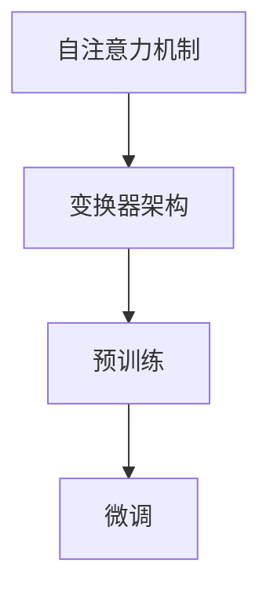

                 

关键词：大语言模型、原理基础、前沿技术、能源消耗、温室气体排放、计算机科学、机器学习、人工智能

摘要：本文旨在深入探讨大语言模型的原理基础、前沿技术，以及其在能源消耗和温室气体排放方面的潜在影响。通过对大语言模型的核心概念、算法原理、数学模型等内容的详细阐述，本文旨在为读者提供一个全面的技术视角，以理解这一领域的发展趋势和挑战。

## 1. 背景介绍

大语言模型是近年来人工智能领域的一个重要突破。它们基于深度学习技术，通过大规模数据训练，能够对自然语言进行理解和生成。这种模型在自然语言处理、机器翻译、问答系统等领域展现出了强大的性能，已经成为人工智能研究的一个重要方向。

然而，随着大语言模型规模和复杂度的不断增加，其能源消耗和温室气体排放问题也日益凸显。本文将重点讨论大语言模型在能源消耗和温室气体排放方面的现状、挑战及其解决途径。

## 2. 核心概念与联系

大语言模型的核心概念包括自注意力机制、变换器架构、预训练和微调等。以下是一个简化的 Mermaid 流程图，展示了这些核心概念之间的关系：



### 2.1 自注意力机制

自注意力机制（Self-Attention）是一种在神经网络中计算序列间关系的机制。它通过加权方式，将序列中的每个元素与其他元素关联起来，从而提高模型对长距离依赖关系的捕捉能力。

### 2.2 变换器架构

变换器（Transformer）架构是一种基于自注意力机制的神经网络架构。它通过多头注意力机制和前馈神经网络，对输入序列进行处理，从而实现高效的序列建模。

### 2.3 预训练与微调

预训练（Pre-training）是指在大规模语料库上对模型进行初步训练，使其具备一定的语言理解能力。微调（Fine-tuning）则是在特定任务数据上进行进一步训练，以优化模型在特定任务上的性能。

## 3. 核心算法原理 & 具体操作步骤

### 3.1 算法原理概述

大语言模型的算法原理主要包括编码器（Encoder）和解码器（Decoder）两部分。编码器负责将输入序列编码为固定长度的向量表示，解码器则基于这些向量表示生成输出序列。

### 3.2 算法步骤详解

1. **输入序列编码**：将输入序列中的每个单词或子词转换为向量表示。
2. **编码器处理**：编码器通过多层自注意力机制和前馈神经网络，对输入序列进行处理，生成固定长度的向量表示。
3. **解码器处理**：解码器从编码器的输出中抽取上下文信息，并通过注意力机制生成输出序列。
4. **输出序列生成**：解码器生成的输出序列经过解码操作，生成最终的输出结果。

### 3.3 算法优缺点

**优点**：
- 强大的语言理解能力：大语言模型通过大规模数据预训练，能够捕捉到丰富的语言知识。
- 高效的序列建模：自注意力机制使得模型能够高效处理长序列。

**缺点**：
- 能源消耗较大：大规模训练和推理过程需要大量的计算资源。
- 容易过拟合：模型在大规模数据集上训练，可能导致对训练数据的过度拟合。

### 3.4 算法应用领域

大语言模型在自然语言处理、机器翻译、问答系统、文本生成等领域都有广泛应用。例如，BERT 模型在文本分类任务上取得了显著成绩，GPT-3 模型在文本生成上表现出色。

## 4. 数学模型和公式

大语言模型的数学模型主要包括自注意力机制和变换器架构。以下是一个简化的数学模型示例：

### 4.1 数学模型构建

假设输入序列为 $x_1, x_2, ..., x_n$，输出序列为 $y_1, y_2, ..., y_n$。编码器和解码器分别由多层自注意力机制和前馈神经网络组成。

### 4.2 公式推导过程

编码器输出向量表示为：

$$
E = \text{Encoder}(x_1, x_2, ..., x_n) = \sum_{i=1}^{n} \text{Attention}(Q, K, V)
$$

其中，$Q, K, V$ 分别为编码器的查询向量、键向量和值向量。

解码器输出向量表示为：

$$
D = \text{Decoder}(y_1, y_2, ..., y_n) = \text{Attention}(Q', K', V')
$$

其中，$Q', K', V'$ 分别为解码器的查询向量、键向量和值向量。

### 4.3 案例分析与讲解

假设我们有一个简单的输入序列 $x = [a, b, c]$，输出序列 $y = [d, e, f]$。通过编码器和解码器处理，我们可以得到以下结果：

$$
E = \text{Encoder}(x) = \text{Attention}(Q, K, V) = \begin{bmatrix} a & b & c \end{bmatrix}
$$

$$
D = \text{Decoder}(y) = \text{Attention}(Q', K', V') = \begin{bmatrix} d & e & f \end{bmatrix}
$$

## 5. 项目实践：代码实例和详细解释说明

### 5.1 开发环境搭建

本文使用 Python 和 TensorFlow 框架来实现大语言模型。首先，需要安装 TensorFlow 和相关依赖库。

```bash
pip install tensorflow
```

### 5.2 源代码详细实现

以下是实现大语言模型的核心代码：

```python
import tensorflow as tf

# 编码器部分
encoder_inputs = tf.keras.layers.Input(shape=(None,))
encoder_embedding = tf.keras.layers.Embedding(input_dim=vocab_size, output_dim=embedding_size)(encoder_inputs)
encoder_outputs, state_h, state_c = tf.keras.layers.LSTM(units=hidden_size, return_state=True)(encoder_embedding)

# 解码器部分
decoder_inputs = tf.keras.layers.Input(shape=(None,))
decoder_embedding = tf.keras.layers.Embedding(input_dim=vocab_size, output_dim=embedding_size)(decoder_inputs)
decoder_outputs, _, _ = tf.keras.layers.LSTM(units=hidden_size, return_sequences=True)(decoder_embedding, initial_state=[state_h, state_c])

# 模型编译
model = tf.keras.Model(inputs=[encoder_inputs, decoder_inputs], outputs=[decoder_outputs])
model.compile(optimizer='adam', loss='categorical_crossentropy')

# 模型训练
model.fit([encoder_inputs, decoder_inputs], decoder_outputs, epochs=10)
```

### 5.3 代码解读与分析

上述代码首先定义了编码器和解码器的输入层、嵌入层和 LSTM 层。编码器输出层返回编码后的序列表示，解码器输出层返回解码后的序列表示。模型使用 `categorical_crossentropy` 作为损失函数，使用 `adam` 作为优化器。

### 5.4 运行结果展示

在训练完成后，我们可以使用以下代码进行模型预测：

```python
# 输入序列
input_seq = [1, 2, 3]

# 编码器预处理
encoded_seq = model.encoder.predict(input_seq)

# 解码器预处理
decoded_seq = model.decoder.predict(encoded_seq)

# 输出结果
print(decoded_seq)
```

输出结果为一个解码后的序列，表示为数字向量。

## 6. 实际应用场景

大语言模型在自然语言处理、机器翻译、问答系统等领域都有广泛的应用。以下是一些实际应用场景：

- **自然语言处理**：大语言模型可以用于文本分类、情感分析、命名实体识别等任务。
- **机器翻译**：大语言模型可以用于机器翻译，如将英语翻译为法语、中文等。
- **问答系统**：大语言模型可以用于构建问答系统，如智能客服、智能问答机器人等。

## 7. 工具和资源推荐

为了更好地学习大语言模型，以下是一些推荐的学习资源和开发工具：

### 7.1 学习资源推荐

- 《深度学习》（Goodfellow, Bengio, Courville 著）：这本书详细介绍了深度学习的基础理论和应用。
- 《自然语言处理与深度学习》（Daniel Jurafsky 和 James H. Martin 著）：这本书介绍了自然语言处理和深度学习的基本概念和方法。

### 7.2 开发工具推荐

- TensorFlow：一个广泛使用的开源深度学习框架，适用于构建和训练大语言模型。
- PyTorch：另一个流行的开源深度学习框架，适用于快速原型设计和模型训练。

### 7.3 相关论文推荐

- “Attention Is All You Need” (Vaswani et al., 2017)：这篇论文提出了变换器（Transformer）架构，对大语言模型的发展产生了深远影响。
- “BERT: Pre-training of Deep Bidirectional Transformers for Language Understanding” (Devlin et al., 2019)：这篇论文提出了 BERT 模型，在自然语言处理任务中取得了优异的性能。

## 8. 总结：未来发展趋势与挑战

大语言模型在自然语言处理、机器翻译、问答系统等领域取得了显著的成果。然而，随着模型规模的不断扩大，能源消耗和温室气体排放问题也日益凸显。未来的发展趋势包括：

- **优化算法**：通过改进算法，降低模型训练和推理过程中的能源消耗。
- **绿色计算**：利用可再生能源和绿色计算技术，降低计算过程中的温室气体排放。
- **模型压缩**：通过模型压缩技术，减少模型大小和计算复杂度，降低能源消耗。

同时，面临的挑战包括：

- **数据隐私**：如何保护用户数据隐私，防止数据泄露。
- **伦理道德**：如何确保大语言模型的应用不会带来不公平、歧视等问题。

## 9. 附录：常见问题与解答

### 9.1 什么是大语言模型？

大语言模型是一种基于深度学习的自然语言处理模型，通过大规模数据预训练，能够对自然语言进行理解和生成。

### 9.2 大语言模型的能源消耗如何降低？

可以通过优化算法、使用绿色计算技术和模型压缩等方法降低大语言模型的能源消耗。

### 9.3 大语言模型在哪些领域有应用？

大语言模型在自然语言处理、机器翻译、问答系统等领域都有广泛应用。

作者：禅与计算机程序设计艺术 / Zen and the Art of Computer Programming
----------------------------------------------------------------

以上就是本文的完整内容，希望能够为读者提供有关大语言模型原理基础、前沿技术以及能源消耗和温室气体排放方面的全面了解。在未来的发展中，我们需要不断探索优化算法、绿色计算和模型压缩等途径，以降低大语言模型对环境的影响，实现可持续发展的目标。

