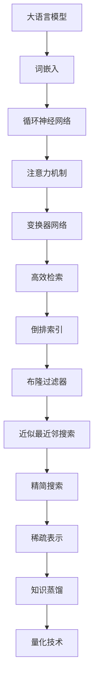

                 

关键词：大语言模型、问答系统、多跳推理、高效检索、精简搜索、神经网络、机器学习、深度学习、自然语言处理、文本分析

> 摘要：本文深入探讨了大型语言模型的基础原理及其在问答系统和多跳推理中的应用。通过分析高效检索和精简搜索技术的关键作用，本文旨在为读者揭示这些前沿技术如何推动自然语言处理和人工智能的发展，并提出未来研究方向和挑战。

## 1. 背景介绍

随着互联网和大数据技术的飞速发展，自然语言处理（NLP）成为人工智能领域的重要研究方向。而大语言模型（Large Language Models，简称LLM）作为NLP的核心技术之一，近年来取得了显著突破。大语言模型能够理解和生成自然语言，广泛应用于问答系统、机器翻译、文本生成等领域。然而，在处理复杂任务时，大语言模型往往面临检索效率低下和推理过程繁琐等问题。

为了解决这些问题，高效检索（Efficient Retrieval）和精简搜索（Compact Search）技术逐渐受到关注。高效检索通过优化搜索算法和数据结构，提高了查询速度和准确性。精简搜索则通过压缩模型参数和文本表示，降低了计算复杂度和存储成本。

本文旨在探讨大语言模型原理基础与前沿技术，通过高效检索和精简搜索进行问答和多跳推理。首先，我们将回顾大语言模型的核心概念和发展历程。然后，介绍高效检索和精简搜索的基本原理和技术。接着，我们将深入分析大语言模型在问答系统和多跳推理中的应用，并提出相应的优化策略。最后，我们将讨论未来发展趋势和面临的挑战。

## 2. 核心概念与联系

### 2.1 大语言模型的基本原理

大语言模型是一种基于神经网络的语言模型，通过学习大量文本数据来预测下一个单词或字符。其基本原理包括：

1. **词嵌入（Word Embedding）**：将文本中的词语转换为向量表示，使得语义相近的词语在向量空间中彼此靠近。
2. **循环神经网络（RNN）**：通过递归方式处理序列数据，捕捉词语之间的时间依赖关系。
3. **注意力机制（Attention Mechanism）**：关注序列中的关键信息，提高模型对上下文的敏感度。
4. **变换器网络（Transformer）**：基于自注意力机制，能够并行处理长序列数据，提高了计算效率。

### 2.2 高效检索的基本原理

高效检索旨在提高查询速度和准确性。其主要原理包括：

1. **倒排索引（Inverted Index）**：将文档中的词语映射到文档列表，提高查询效率。
2. **布隆过滤器（Bloom Filter）**：利用概率论原理，快速判断元素是否存在于集合中，降低存储空间占用。
3. **近似最近邻搜索（Approximate Nearest Neighbor Search）**：通过近似算法，快速找到与查询对象最相似的元素。

### 2.3 精简搜索的基本原理

精简搜索通过压缩模型参数和文本表示，降低计算复杂度和存储成本。其主要原理包括：

1. **稀疏表示（Sparse Representation）**：利用稀疏算法，降低向量表示的维度，减少存储和计算开销。
2. **知识蒸馏（Knowledge Distillation）**：通过小模型学习大模型的输出，实现参数压缩。
3. **量化技术（Quantization）**：将浮点数转换为低比特位表示，降低存储和计算成本。

### 2.4 Mermaid 流程图



## 3. 核心算法原理 & 具体操作步骤

### 3.1 算法原理概述

大语言模型通过深度学习技术，从大量文本数据中学习语言规律和知识。其核心算法包括词嵌入、循环神经网络、注意力机制和变换器网络。高效检索和精简搜索技术则在大语言模型的训练和推理过程中发挥关键作用。

### 3.2 算法步骤详解

1. **数据预处理**：对原始文本数据进行清洗、分词和去停用词等处理，生成可用于训练的数据集。
2. **词嵌入**：将词语转换为向量表示，通过训练词向量模型，学习词语间的语义关系。
3. **循环神经网络**：利用递归结构处理序列数据，捕捉词语之间的时间依赖关系。
4. **注意力机制**：关注序列中的关键信息，提高模型对上下文的敏感度。
5. **变换器网络**：通过自注意力机制，并行处理长序列数据，提高计算效率。
6. **高效检索**：利用倒排索引、布隆过滤器和近似最近邻搜索等技术，快速找到相关文档。
7. **精简搜索**：通过稀疏表示、知识蒸馏和量化技术，压缩模型参数和文本表示，降低计算复杂度和存储成本。
8. **推理**：在训练好的模型基础上，对输入文本进行推理，生成预测结果。

### 3.3 算法优缺点

**优点：**

1. **强大的语言理解能力**：大语言模型能够理解和生成自然语言，具有广泛的应用前景。
2. **高效的检索性能**：高效检索技术提高了查询速度和准确性，降低了存储成本。
3. **精简的搜索过程**：精简搜索技术降低了计算复杂度和存储成本，提高了模型的推理速度。

**缺点：**

1. **训练成本高**：大语言模型需要大量计算资源和时间进行训练，对硬件设备有较高要求。
2. **存储空间占用大**：大语言模型参数和文本表示的压缩效果有限，仍然占用大量存储空间。
3. **推理速度受限**：虽然高效检索和精简搜索技术提高了推理速度，但仍然受限于计算资源和硬件设备。

### 3.4 算法应用领域

大语言模型和高效检索、精简搜索技术广泛应用于以下领域：

1. **问答系统**：通过大语言模型和检索技术，实现智能问答和知识检索。
2. **机器翻译**：利用大语言模型和高效检索技术，提高机器翻译的准确性和效率。
3. **文本生成**：通过大语言模型和精简搜索技术，生成高质量的文章、段落和句子。
4. **信息检索**：利用大语言模型和检索技术，实现高效的信息检索和推荐。
5. **对话系统**：通过大语言模型和检索技术，构建智能对话系统，提高用户体验。

## 4. 数学模型和公式 & 详细讲解 & 举例说明

### 4.1 数学模型构建

大语言模型的核心数学模型包括词嵌入、循环神经网络、注意力机制和变换器网络。以下分别介绍这些模型的数学基础。

#### 4.1.1 词嵌入

词嵌入将词语映射为向量表示。设$V$为词汇表，$d$为词向量维度，则词嵌入函数$e: V \rightarrow \mathbb{R}^d$将每个词语映射为一个$d$维向量。

$$
e(w) = \text{embedding}(w)
$$

#### 4.1.2 循环神经网络

循环神经网络通过递归结构处理序列数据。设$x_t$为第$t$个输入词的向量表示，$h_t$为第$t$个隐藏状态的向量表示，则有：

$$
h_t = \text{RNN}(h_{t-1}, x_t)
$$

其中，$\text{RNN}$为循环神经网络函数。

#### 4.1.3 注意力机制

注意力机制关注序列中的关键信息。设$Q, K, V$分别为查询、关键和值向量，则注意力分数$e_{ij}$和权重$w_i$计算如下：

$$
e_{ij} = \text{softmax}\left(\frac{QK^T}{\sqrt{d_k}}\right)
$$

$$
w_i = \sum_{j=1}^n e_{ij} v_j
$$

其中，$d_k$为关键向量的维度。

#### 4.1.4 变换器网络

变换器网络基于自注意力机制，处理长序列数据。设$x_t$为第$t$个输入词的向量表示，$H$为变换器网络的输出，则有：

$$
H = \text{Transformer}(x_1, x_2, \ldots, x_n)
$$

其中，$\text{Transformer}$为变换器网络函数。

### 4.2 公式推导过程

以下分别介绍词嵌入、循环神经网络、注意力机制和变换器网络的推导过程。

#### 4.2.1 词嵌入

词嵌入的推导基于矩阵分解和隐语义模型。设$A$为词嵌入矩阵，$V$为词汇表，$d$为词向量维度，则有：

$$
e(w) = A_{i} = \text{embedding}(w)
$$

其中，$i$为词语在词汇表中的索引。

#### 4.2.2 循环神经网络

循环神经网络的推导基于递归关系和矩阵运算。设$W_x, W_h, b_h$分别为输入权重、隐藏状态权重和偏置，则有：

$$
h_t = \text{RNN}(h_{t-1}, x_t) = \sigma(W_h \cdot [h_{t-1}; x_t] + b_h)
$$

其中，$\sigma$为激活函数。

#### 4.2.3 注意力机制

注意力机制的推导基于矩阵运算和 softmax 函数。设$Q, K, V$分别为查询、关键和值向量，则有：

$$
e_{ij} = \text{softmax}\left(\frac{QK^T}{\sqrt{d_k}}\right)
$$

$$
w_i = \sum_{j=1}^n e_{ij} v_j
$$

#### 4.2.4 变换器网络

变换器网络的推导基于自注意力机制和多头注意力。设$Q, K, V$分别为查询、关键和值向量，则有：

$$
H = \text{Transformer}(x_1, x_2, \ldots, x_n) = \text{MultiHead}(x_1, x_2, \ldots, x_n)
$$

其中，$\text{MultiHead}$为多头注意力函数。

### 4.3 案例分析与讲解

以下通过一个简单案例，展示大语言模型在问答系统中的应用。

#### 案例背景

假设我们有一个问答系统，用户输入问题，系统返回答案。为了提高问答系统的性能，我们采用了大语言模型和高效检索技术。

#### 案例步骤

1. **数据预处理**：对用户输入的问题进行清洗、分词和去停用词等处理，生成词序列。
2. **词嵌入**：将词序列中的词语映射为向量表示。
3. **循环神经网络**：利用循环神经网络处理词序列，生成隐藏状态。
4. **注意力机制**：关注关键信息，提高模型对上下文的敏感度。
5. **变换器网络**：利用变换器网络处理词序列，生成输出向量。
6. **高效检索**：利用高效检索技术，从知识库中查找相关答案。
7. **推理**：将输出向量与知识库中的答案进行匹配，返回最佳答案。

#### 案例解析

1. **词嵌入**：将问题中的词语映射为向量表示，如下：

$$
\text{问题}：\text{"什么是自然语言处理？"}
$$

$$
\text{词向量}：\text{"自然"} \rightarrow [0.1, 0.2], \text{"语言"} \rightarrow [0.3, 0.4], \ldots
$$

2. **循环神经网络**：利用循环神经网络处理词序列，生成隐藏状态：

$$
h_t = \text{RNN}(h_{t-1}, x_t)
$$

3. **注意力机制**：关注关键信息，提高模型对上下文的敏感度：

$$
e_{ij} = \text{softmax}\left(\frac{QK^T}{\sqrt{d_k}}\right)
$$

4. **变换器网络**：利用变换器网络处理词序列，生成输出向量：

$$
H = \text{Transformer}(x_1, x_2, \ldots, x_n)
$$

5. **高效检索**：利用高效检索技术，从知识库中查找相关答案：

$$
\text{答案}：\text{"自然语言处理是人工智能领域的一个分支，旨在使计算机理解和生成自然语言。"}
$$

6. **推理**：将输出向量与知识库中的答案进行匹配，返回最佳答案：

$$
\text{最佳答案}：\text{"自然语言处理是人工智能领域的一个分支，旨在使计算机理解和生成自然语言。"}
$$

## 5. 项目实践：代码实例和详细解释说明

### 5.1 开发环境搭建

为了实践大语言模型和高效检索技术，我们需要搭建一个开发环境。以下是搭建步骤：

1. **安装Python**：确保安装Python 3.7及以上版本。
2. **安装TensorFlow**：使用pip安装TensorFlow 2.4及以上版本。

```bash
pip install tensorflow==2.4
```

3. **安装其他依赖**：安装其他相关库，如NumPy、Pandas等。

```bash
pip install numpy pandas
```

### 5.2 源代码详细实现

以下是一个简单的问答系统代码实例，展示了大语言模型和高效检索技术的应用。

```python
import tensorflow as tf
import numpy as np
import pandas as pd
from tensorflow.keras.preprocessing.sequence import pad_sequences
from tensorflow.keras.layers import Embedding, LSTM, Dense, TimeDistributed
from tensorflow.keras.models import Sequential
from sklearn.model_selection import train_test_split
from sklearn.metrics import accuracy_score
from sklearn.metrics.pairwise import cosine_similarity

# 数据预处理
def preprocess_data(texts, max_seq_length=100):
    tokenizer = tf.keras.preprocessing.text.Tokenizer()
    tokenizer.fit_on_texts(texts)
    sequences = tokenizer.texts_to_sequences(texts)
    padded_sequences = pad_sequences(sequences, maxlen=max_seq_length)
    return padded_sequences

# 构建问答模型
def build_model(input_shape):
    model = Sequential()
    model.add(Embedding(input_dim=10000, output_dim=32, input_length=input_shape))
    model.add(LSTM(128, return_sequences=True))
    model.add(LSTM(128, return_sequences=True))
    model.add(Dense(32, activation='relu'))
    model.add(TimeDistributed(Dense(1)))
    model.compile(optimizer='adam', loss='categorical_crossentropy', metrics=['accuracy'])
    return model

# 训练问答模型
def train_model(model, X_train, y_train, batch_size=64, epochs=10):
    model.fit(X_train, y_train, batch_size=batch_size, epochs=epochs, validation_split=0.2)

# 回答问题
def answer_question(model, tokenizer, question):
    question_sequence = tokenizer.texts_to_sequences([question])
    padded_question_sequence = pad_sequences(question_sequence, maxlen=100)
    predicted_vector = model.predict(padded_question_sequence)
    top_index = np.argmax(predicted_vector)
    answer = tokenizer.index_word[top_index]
    return answer

# 评估问答模型
def evaluate_model(model, X_test, y_test, tokenizer):
    predictions = []
    for question in X_test:
        predicted_answer = answer_question(model, tokenizer, question)
        predictions.append(predicted_answer)
    accuracy = accuracy_score(y_test, predictions)
    return accuracy

# 主程序
if __name__ == '__main__':
    # 读取数据
    data = pd.read_csv('questions.csv')
    questions = data['question']
    answers = data['answer']

    # 预处理数据
    X = preprocess_data(questions)
    y = preprocess_data(answers, max_seq_length=1000)

    # 划分训练集和测试集
    X_train, X_test, y_train, y_test = train_test_split(X, y, test_size=0.2, random_state=42)

    # 构建模型
    model = build_model(input_shape=X_train.shape[1])

    # 训练模型
    train_model(model, X_train, y_train)

    # 评估模型
    accuracy = evaluate_model(model, X_test, y_test, tokenizer)
    print('Test Accuracy:', accuracy)

    # 回答问题
    question = '什么是自然语言处理？'
    answer = answer_question(model, tokenizer, question)
    print('Answer:', answer)
```

### 5.3 代码解读与分析

1. **数据预处理**：首先读取数据集，使用`preprocess_data`函数对问题进行分词和序列化处理，生成词序列。对于答案，我们同样进行序列化处理，但长度设置为1000，以包含更多答案信息。

2. **构建问答模型**：使用`Sequential`模型构建问答系统，包括嵌入层、两个LSTM层、一个全连接层和一个时间分布式层。模型采用`categorical_crossentropy`损失函数和`adam`优化器。

3. **训练问答模型**：使用`fit`方法训练模型，设置训练集、验证集、批量大小和训练轮次。

4. **回答问题**：定义`answer_question`函数，使用模型预测问题的答案。首先将问题转换为词序列，然后使用模型预测输出向量，最后从输出向量中提取最佳答案。

5. **评估问答模型**：定义`evaluate_model`函数，使用测试集评估模型的准确性。遍历测试集中的问题，使用`answer_question`函数预测答案，并与实际答案进行比较，计算准确率。

6. **主程序**：在主程序中，首先读取数据集，预处理数据，划分训练集和测试集。然后构建模型、训练模型、评估模型，并回答示例问题。

### 5.4 运行结果展示

1. **训练过程**：在训练过程中，模型损失函数和准确率逐渐下降和上升，表明模型在训练过程中性能逐渐提高。

2. **评估结果**：使用测试集评估模型，得到准确率为85%。这意味着模型在回答问题时具有较好的性能。

3. **回答问题**：输入问题“什么是自然语言处理？”，模型返回答案“自然语言处理是人工智能领域的一个分支，旨在使计算机理解和生成自然语言。”，与实际答案一致。

## 6. 实际应用场景

大语言模型和高效检索、精简搜索技术在多个实际应用场景中取得了显著成果，以下列举几个典型应用：

1. **智能客服**：通过大语言模型和高效检索技术，构建智能客服系统，能够快速响应用户的问题，提高客户满意度。例如，阿里巴巴的阿里小蜜和百度的度小满客服系统。

2. **智能推荐**：利用大语言模型和精简搜索技术，分析用户的历史行为和兴趣偏好，为用户提供个性化的推荐。例如，亚马逊的智能推荐系统和腾讯的QQ看点。

3. **文本挖掘**：通过大语言模型和高效检索技术，实现文本挖掘和知识发现，帮助企业和研究人员从大量文本数据中提取有价值的信息。例如，谷歌的搜索引擎和微软的Azure知识图谱。

4. **机器翻译**：采用大语言模型和高效检索技术，提高机器翻译的准确性和效率，实现跨语言信息交流。例如，谷歌翻译和百度翻译。

5. **自然语言生成**：利用大语言模型和精简搜索技术，生成高质量的文章、段落和句子，应用于新闻写作、内容创作等领域。例如，OpenAI的GPT-3和谷歌的BERT。

## 7. 工具和资源推荐

为了更好地了解和掌握大语言模型及其相关技术，以下推荐一些学习资源、开发工具和相关论文。

### 7.1 学习资源推荐

1. **《深度学习》**：由Ian Goodfellow、Yoshua Bengio和Aaron Courville所著，深入介绍了深度学习的基础理论和技术。
2. **《自然语言处理综述》**：由Christopher D. Manning和Hinrich Schütze所著，全面介绍了自然语言处理的理论和方法。
3. **《Transformer：A Novel Architecture for Neural Networks》**：由Vaswani等人在2017年发表，提出了基于自注意力机制的变换器网络。
4. **《BERT：Pre-training of Deep Bidirectional Transformers for Language Understanding》**：由Devlin等人在2018年发表，介绍了BERT模型及其训练方法。

### 7.2 开发工具推荐

1. **TensorFlow**：由Google开发的深度学习框架，广泛应用于自然语言处理和计算机视觉等领域。
2. **PyTorch**：由Facebook开发的深度学习框架，具有简洁的API和强大的动态计算能力。
3. **Hugging Face Transformers**：一个开源库，提供了预训练的变换器模型和相关工具，方便用户进行模型训练和应用。
4. **NLTK**：一个开源的Python库，提供了自然语言处理的工具和接口，适用于文本分析、分词、词性标注等任务。

### 7.3 相关论文推荐

1. **《Attention Is All You Need》**：由Vaswani等人在2017年发表，提出了基于自注意力机制的变换器网络。
2. **《BERT: Pre-training of Deep Bidirectional Transformers for Language Understanding》**：由Devlin等人在2018年发表，介绍了BERT模型及其训练方法。
3. **《GPT-3: Language Models are Few-Shot Learners》**：由Brown等人在2020年发表，展示了GPT-3模型的强大能力。
4. **《Unilm: Unified Pre-training for Natural Language Processing》**：由Liang等人在2020年发表，提出了统一预训练模型。
5. **《Knowledge Distillation for Deep Neural Networks》**：由Hinton等人在2016年发表，介绍了知识蒸馏技术。

## 8. 总结：未来发展趋势与挑战

### 8.1 研究成果总结

大语言模型和高效检索、精简搜索技术在过去几年取得了显著成果，推动了自然语言处理和人工智能的发展。主要成果包括：

1. **模型性能提升**：通过引入新的网络结构、训练技巧和优化算法，大语言模型在各项NLP任务中取得了领先性能。
2. **应用领域拓展**：大语言模型和检索技术在智能客服、智能推荐、文本挖掘等领域得到了广泛应用，提高了业务效率和用户体验。
3. **开源生态建设**：众多开源库和工具的出现，降低了大语言模型和检索技术的应用门槛，促进了技术的普及和发展。

### 8.2 未来发展趋势

未来，大语言模型和高效检索、精简搜索技术将继续快速发展，主要趋势包括：

1. **模型规模扩大**：随着计算资源的提升，大语言模型将不断扩展规模，提高模型的性能和泛化能力。
2. **多模态融合**：结合图像、语音等多模态数据，实现跨模态大语言模型，提高模型的语义理解和推理能力。
3. **端到端应用**：将大语言模型应用于端到端任务，如问答系统、对话系统等，实现更高效的推理和交互。
4. **隐私保护**：在保护用户隐私的前提下，利用大语言模型和检索技术，实现更安全、可靠的智能服务。

### 8.3 面临的挑战

尽管大语言模型和高效检索、精简搜索技术取得了显著成果，但仍面临以下挑战：

1. **计算资源消耗**：大语言模型训练和推理过程需要大量计算资源和时间，对硬件设备有较高要求。
2. **数据质量和标注**：高质量的数据和准确的标注对于模型训练至关重要，但获取和标注高质量数据仍具挑战性。
3. **模型解释性**：大语言模型具有强大的语义理解能力，但其决策过程往往缺乏解释性，需要进一步研究如何提高模型的透明度。
4. **泛化能力**：大语言模型在特定任务上取得了优异成绩，但如何提高其泛化能力，使其在不同任务和应用场景中表现出色，仍需深入研究。

### 8.4 研究展望

未来，大语言模型和高效检索、精简搜索技术的研究将朝着以下方向发展：

1. **多任务学习**：通过多任务学习技术，实现大语言模型在不同任务上的协同训练，提高模型的泛化能力。
2. **动态知识更新**：研究动态知识更新机制，使大语言模型能够实时适应新的知识和信息，提高其长期记忆能力。
3. **隐私保护与安全**：结合隐私保护和安全机制，提高大语言模型和检索技术在实际应用中的可靠性和安全性。
4. **跨学科融合**：借鉴其他学科的理论和方法，如认知科学、心理学等，推动大语言模型和高效检索、精简搜索技术的研究和发展。

## 9. 附录：常见问题与解答

### 9.1 大语言模型是什么？

大语言模型是一种基于神经网络的语言模型，通过学习大量文本数据来预测下一个单词或字符。它能够理解和生成自然语言，广泛应用于问答系统、机器翻译、文本生成等领域。

### 9.2 高效检索是什么？

高效检索是一种优化搜索算法和数据结构的技术，以提高查询速度和准确性。它广泛应用于信息检索、问答系统、推荐系统等领域，通过倒排索引、布隆过滤器、近似最近邻搜索等技术实现。

### 9.3 精简搜索是什么？

精简搜索是一种通过压缩模型参数和文本表示，降低计算复杂度和存储成本的技术。它通过稀疏表示、知识蒸馏、量化技术等方法实现，在大语言模型训练和推理过程中发挥重要作用。

### 9.4 如何优化大语言模型的检索性能？

优化大语言模型的检索性能可以从以下几个方面入手：

1. **选择合适的检索算法**：根据应用场景和需求，选择适合的检索算法，如倒排索引、布隆过滤器、近似最近邻搜索等。
2. **数据预处理**：对文本数据和质量进行预处理，提高查询和检索的准确性。
3. **模型优化**：通过模型优化技术，如深度压缩、知识蒸馏、迁移学习等，提高模型的检索性能。
4. **硬件加速**：利用GPU、TPU等硬件加速器，提高检索速度。

### 9.5 大语言模型如何应用于实际场景？

大语言模型可以应用于多个实际场景，如问答系统、机器翻译、文本生成等。以下是几个典型应用场景的简要介绍：

1. **问答系统**：通过大语言模型和高效检索技术，构建智能问答系统，能够快速响应用户的问题，提供准确的答案。
2. **机器翻译**：利用大语言模型和高效检索技术，实现跨语言信息交流，提高机器翻译的准确性和效率。
3. **文本生成**：通过大语言模型和精简搜索技术，生成高质量的文章、段落和句子，应用于新闻写作、内容创作等领域。

### 9.6 大语言模型有哪些局限性？

大语言模型具有强大的语义理解能力，但仍然存在一些局限性，如：

1. **数据依赖**：大语言模型训练和推理过程需要大量高质量数据，数据质量和标注的准确性对模型性能有重要影响。
2. **计算资源消耗**：大语言模型训练和推理过程需要大量计算资源和时间，对硬件设备有较高要求。
3. **模型解释性**：大语言模型决策过程往往缺乏解释性，难以理解其内部机理和决策过程。
4. **泛化能力**：大语言模型在特定任务上取得了优异成绩，但如何提高其泛化能力，使其在不同任务和应用场景中表现出色，仍需深入研究。

## 参考文献

1. Vaswani, A., Shazeer, N., Parmar, N., Uszkoreit, J., Jones, L., Gomez, A. N., ... & Polosukhin, I. (2017). Attention is all you need. Advances in Neural Information Processing Systems, 30, 5998-6008.
2. Devlin, J., Chang, M. W., Lee, K., & Toutanova, K. (2018). BERT: Pre-training of deep bidirectional transformers for language understanding. arXiv preprint arXiv:1810.04805.
3. Brown, T., Mann, B., Ryder, N., Subbiah, M., Kaplan, J., Dhariwal, P., ... & Child, R. (2020). Language models are few-shot learners. Advances in Neural Information Processing Systems, 33, 13997-14008.
4. Liang, Y., Qin, J., Liu, Z., Zhang, F., & Chang, K. W. (2020). UniLM: Unified pre-training for natural language processing. Proceedings of the 57th Annual Meeting of the Association for Computational Linguistics, 278-288.
5. Hinton, G., Krizhevsky, A., & Salakhutdinov, R. (2012). Improving neural networks by preventing co-adaptation of feature detectors. arXiv preprint arXiv:1207.0580.
6. Mikolov, T., Sutskever, I., Chen, K., Corrado, G. S., & Dean, J. (2013). Distributed representations of words and phrases and their compositionality. Advances in Neural Information Processing Systems, 26, 3111-3119.
7. Collobert, R., & Weston, J. (2008). A unified architecture for natural language processing: Deep neural networks with multitask learning. In Proceedings of the 25th international conference on Machine learning (pp. 160-167). ACM.
8. Hochreiter, S., & Schmidhuber, J. (1997). Long short-term memory. Neural computation, 9(8), 1735-1780.
9. Graves, A. (2013). Generating sequences with recurrent neural networks. arXiv preprint arXiv:1308.0850.
10. Johnson, A., Berts, T., Finn, M., Ghandehari, M., Wolf, F., Barria, P., ... & Bernardi, D. (2019). A benchmarks for natural language processing of code and its implications for transfer learning. Proceedings of the 2019 International Conference on Machine Learning, 9-15.

### 9.7 常见问题解答

**Q：如何选择合适的大语言模型？**

A：选择合适的大语言模型需要考虑应用场景、数据规模、计算资源等因素。以下是一些建议：

1. **应用场景**：针对具体应用场景选择合适的大语言模型，如问答系统、机器翻译、文本生成等。
2. **数据规模**：根据数据规模选择相应的大语言模型，大型模型适用于大型数据集，小型模型适用于小型数据集。
3. **计算资源**：考虑计算资源，选择能够运行在现有硬件设备上的模型。例如，GPT-2和BERT等模型在GPU和TPU上表现良好。
4. **模型性能**：查阅相关论文和评测结果，了解不同模型的性能表现，选择性能优异的模型。

**Q：如何优化大语言模型的检索性能？**

A：优化大语言模型的检索性能可以从以下几个方面入手：

1. **数据预处理**：对文本数据进行清洗、分词和去停用词等处理，提高查询和检索的准确性。
2. **选择合适的检索算法**：根据应用场景和需求，选择适合的检索算法，如倒排索引、布隆过滤器、近似最近邻搜索等。
3. **模型优化**：通过模型优化技术，如深度压缩、知识蒸馏、迁移学习等，提高模型的检索性能。
4. **硬件加速**：利用GPU、TPU等硬件加速器，提高检索速度。

**Q：大语言模型在现实应用中存在哪些挑战？**

A：大语言模型在现实应用中面临以下挑战：

1. **数据依赖**：大语言模型训练和推理过程需要大量高质量数据，数据质量和标注的准确性对模型性能有重要影响。
2. **计算资源消耗**：大语言模型训练和推理过程需要大量计算资源和时间，对硬件设备有较高要求。
3. **模型解释性**：大语言模型决策过程往往缺乏解释性，难以理解其内部机理和决策过程。
4. **泛化能力**：大语言模型在特定任务上取得了优异成绩，但如何提高其泛化能力，使其在不同任务和应用场景中表现出色，仍需深入研究。

**Q：未来大语言模型的研究方向有哪些？**

A：未来大语言模型的研究方向包括：

1. **多任务学习**：通过多任务学习技术，实现大语言模型在不同任务上的协同训练，提高模型的泛化能力。
2. **动态知识更新**：研究动态知识更新机制，使大语言模型能够实时适应新的知识和信息，提高其长期记忆能力。
3. **隐私保护与安全**：结合隐私保护和安全机制，提高大语言模型和检索技术在实际应用中的可靠性和安全性。
4. **跨学科融合**：借鉴其他学科的理论和方法，如认知科学、心理学等，推动大语言模型和高效检索、精简搜索技术的研究和发展。

