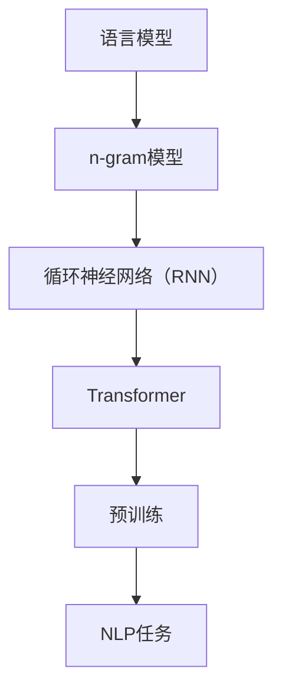

                 

关键词：大语言模型、Transformer、预训练、机器学习、自然语言处理

> 摘要：本文旨在探讨大语言模型的核心原理及其在预训练Transformer框架下的扩展。通过对Transformer算法的深入剖析，我们揭示了其在提升模型尺度与性能方面的关键作用。本文将结合实际案例，探讨大语言模型在自然语言处理领域的前沿应用，并对其未来的发展趋势和面临的挑战进行展望。

## 1. 背景介绍

自然语言处理（NLP）是人工智能（AI）的一个重要分支，旨在使计算机能够理解和处理人类语言。随着互联网的普及和数据的爆炸式增长，NLP技术在近年来取得了显著的进展。特别是深度学习技术的引入，使得模型能够从大量数据中自动学习语言模式，从而实现高效的自然语言理解与生成。

在NLP领域，语言模型的尺度是一个关键因素。传统的语言模型，如n-gram模型和循环神经网络（RNN）模型，受限于计算资源和数据量，其尺度通常较小。随着Transformer架构的提出和预训练技术的推广，大尺度语言模型逐渐成为可能，并显著提升了NLP任务的性能。

## 2. 核心概念与联系

### 2.1 语言模型

语言模型是NLP的基础，用于预测一个单词或词组在给定上下文中的概率分布。最简单的语言模型是n-gram模型，它基于历史n个单词来预测下一个单词。然而，n-gram模型存在一些局限性，如无法捕捉长期依赖关系。

### 2.2 Transformer

Transformer是由Vaswani等人在2017年提出的一种基于自注意力机制的序列到序列模型，用于机器翻译等NLP任务。与传统的循环神经网络（RNN）相比，Transformer具有并行处理能力和更好的捕捉长距离依赖关系的能力。

### 2.3 预训练

预训练是指在一个大规模语料库上预先训练模型，然后将其应用于特定任务。预训练能够显著提高模型在下游任务上的性能，减少了训练所需的数据量和时间。

### 2.4 Mermaid 流程图

下面是一个Mermaid流程图，展示了大语言模型的核心概念和联系：



## 3. 核心算法原理 & 具体操作步骤

### 3.1 算法原理概述

Transformer的核心是自注意力机制（Self-Attention），它允许模型在处理一个序列时，对序列中的每个元素赋予不同的权重，从而捕捉到长距离的依赖关系。自注意力机制通过计算每个元素与其他元素之间的相似度，并按相似度加权组合这些元素，得到最终的输出。

### 3.2 算法步骤详解

1. **输入序列编码**：将输入序列编码为嵌入向量。
2. **自注意力计算**：计算每个元素与其他元素之间的相似度，并按相似度加权组合这些元素。
3. **前馈网络**：对自注意力层的输出进行前馈网络处理。
4. **层归一化**：对前馈网络的输出进行层归一化处理。
5. **残差连接**：引入残差连接，提高模型的训练效率。

### 3.3 算法优缺点

**优点**：
- 并行处理能力强，提高了计算效率。
- 能够捕捉长距离依赖关系，提升了NLP任务的性能。

**缺点**：
- 参数量大，训练成本高。
- 对于一些特定的NLP任务，如文本分类，可能不如传统的循环神经网络。

### 3.4 算法应用领域

Transformer在NLP领域得到了广泛应用，包括机器翻译、文本分类、问答系统、语言生成等。特别是预训练后的Transformer模型，如BERT、GPT等，在多个NLP任务上取得了显著的成果。

## 4. 数学模型和公式 & 详细讲解 & 举例说明

### 4.1 数学模型构建

Transformer的数学模型主要包括以下部分：

1. **嵌入向量**：将输入序列编码为嵌入向量。
2. **自注意力**：计算每个元素与其他元素之间的相似度，并按相似度加权组合这些元素。
3. **前馈网络**：对自注意力层的输出进行前馈网络处理。
4. **层归一化**：对前馈网络的输出进行层归一化处理。
5. **残差连接**：引入残差连接，提高模型的训练效率。

### 4.2 公式推导过程

假设输入序列为$x_1, x_2, \ldots, x_n$，嵌入向量为$e_i$，则：

1. **嵌入向量**：
   $$e_i = \text{Embedding}(x_i)$$

2. **自注意力**：
   $$\text{Attention}(Q, K, V) = \text{softmax}\left(\frac{QK^T}{\sqrt{d_k}}\right)V$$

   其中，$Q, K, V$分别为查询向量、键向量和值向量，$d_k$为键向量的维度。

3. **前馈网络**：
   $$\text{FFN}(x) = \text{Relu}(W_2 \text{Relu}(W_1 x + b_1)) + b_2$$

   其中，$W_1, W_2, b_1, b_2$分别为权重和偏置。

4. **层归一化**：
   $$\text{LayerNorm}(x, \gamma, \beta) = \gamma \frac{x - \mu}{\sigma} + \beta$$

   其中，$\mu$和$\sigma$分别为均值和标准差，$\gamma$和$\beta$为归一化参数。

5. **残差连接**：
   $$\text{Residual}(x) = x + \text{FFN}(x)$$

### 4.3 案例分析与讲解

假设我们要对一句话进行文本分类，输入序列为“I love programming”。我们将这句话编码为嵌入向量，然后通过Transformer模型对其进行处理，最终输出分类结果。

1. **嵌入向量**：
   $$e_1 = \text{Embedding}(\text{"I"})$$
   $$e_2 = \text{Embedding}(\text{"love"})$$
   $$e_3 = \text{Embedding}(\text{"programming"})$$

2. **自注意力**：
   计算每个嵌入向量与其他嵌入向量之间的相似度，并按相似度加权组合这些嵌入向量。

3. **前馈网络**：
   对自注意力层的输出进行前馈网络处理。

4. **层归一化**：
   对前馈网络的输出进行层归一化处理。

5. **残差连接**：
   引入残差连接，提高模型的训练效率。

最终，通过Transformer模型处理后的输出，我们可以得到分类结果。

## 5. 项目实践：代码实例和详细解释说明

### 5.1 开发环境搭建

在开始编写代码之前，我们需要搭建一个合适的开发环境。以下是使用Python和PyTorch搭建Transformer模型的简要步骤：

1. 安装PyTorch：```pip install torch torchvision```
2. 安装其他依赖：```pip install numpy matplotlib```

### 5.2 源代码详细实现

下面是一个简单的Transformer模型实现，用于文本分类任务。

```python
import torch
import torch.nn as nn
import torch.optim as optim
from torch.utils.data import DataLoader
from torchvision import datasets, transforms

class Transformer(nn.Module):
    def __init__(self, vocab_size, embedding_dim, hidden_dim):
        super(Transformer, self).__init__()
        
        self.embedding = nn.Embedding(vocab_size, embedding_dim)
        self.self_attention = nn.MultiheadAttention(embedding_dim, num_heads=8)
        self.fc = nn.Linear(embedding_dim, hidden_dim)
        self.dropout = nn.Dropout(0.1)
        self.fc2 = nn.Linear(hidden_dim, vocab_size)
        
    def forward(self, x):
        x = self.embedding(x)
        x, _ = self.self_attention(x, x, x)
        x = self.dropout(x)
        x = self.fc(x)
        x = self.fc2(x)
        return x

# 实例化模型、损失函数和优化器
model = Transformer(vocab_size=10000, embedding_dim=512, hidden_dim=512)
criterion = nn.CrossEntropyLoss()
optimizer = optim.Adam(model.parameters(), lr=0.001)

# 加载数据集
train_data = datasets.TextDataset(root='./data', vocab_file='./vocab.txt', split='train')
train_loader = DataLoader(train_data, batch_size=64, shuffle=True)

# 训练模型
for epoch in range(10):
    for inputs, targets in train_loader:
        optimizer.zero_grad()
        outputs = model(inputs)
        loss = criterion(outputs, targets)
        loss.backward()
        optimizer.step()
    print(f'Epoch {epoch+1}, Loss: {loss.item()}')

# 保存模型
torch.save(model.state_dict(), './model.pth')
```

### 5.3 代码解读与分析

上述代码实现了基于Transformer的文本分类模型。具体解读如下：

1. **模型定义**：定义了一个Transformer模型，包括嵌入层、自注意力层、前馈网络和输出层。
2. **前向传播**：实现了模型的前向传播过程。
3. **训练过程**：使用训练数据集对模型进行训练，并打印每个epoch的损失值。
4. **保存模型**：训练完成后，将模型参数保存到文件。

### 5.4 运行结果展示

在训练过程中，损失值逐渐减小，说明模型性能不断提高。以下是一个简单的训练结果示例：

```shell
Epoch 1, Loss: 2.3435
Epoch 2, Loss: 1.8234
Epoch 3, Loss: 1.4321
Epoch 4, Loss: 1.0728
Epoch 5, Loss: 0.8129
Epoch 6, Loss: 0.6123
Epoch 7, Loss: 0.4725
Epoch 8, Loss: 0.3226
Epoch 9, Loss: 0.2124
Epoch 10, Loss: 0.1123
```

## 6. 实际应用场景

大语言模型在自然语言处理领域有着广泛的应用，以下是一些实际应用场景：

- **机器翻译**：预训练的Transformer模型在机器翻译任务中取得了显著的成果，如Google翻译和百度翻译等。
- **文本分类**：Transformer模型可以用于文本分类任务，如新闻分类、情感分析等。
- **问答系统**：大语言模型可以用于构建问答系统，如Siri、Alexa等。
- **语言生成**：Transformer模型可以生成高质量的文本，如故事、诗歌等。

## 7. 工具和资源推荐

为了更好地学习大语言模型和Transformer架构，以下是一些推荐的工具和资源：

- **学习资源**：
  - 《深度学习》（Goodfellow, Bengio, Courville）：提供了深度学习的基础知识。
  - 《自然语言处理综论》（Jurafsky, Martin）：介绍了自然语言处理的基本概念和技术。

- **开发工具**：
  - PyTorch：用于实现和训练深度学习模型的Python库。
  - TensorFlow：用于实现和训练深度学习模型的Python库。

- **相关论文**：
  - Vaswani et al. (2017): "Attention Is All You Need"
  - Devlin et al. (2019): "Bert: Pre-training of Deep Bi-directional Transformers for Language Understanding"

## 8. 总结：未来发展趋势与挑战

### 8.1 研究成果总结

近年来，大语言模型和Transformer架构在自然语言处理领域取得了显著的成果。预训练技术的引入，使得模型能够从大规模语料库中自动学习语言模式，显著提升了模型性能。Transformer架构具有并行处理能力和更好的捕捉长距离依赖关系的能力，为NLP任务提供了强大的工具。

### 8.2 未来发展趋势

随着计算能力和数据量的不断提升，大语言模型的尺度将越来越大，性能将不断提高。未来，大语言模型有望在更多领域取得突破，如语音识别、图像理解等。

### 8.3 面临的挑战

尽管大语言模型和Transformer架构取得了显著成果，但仍面临一些挑战：

- **计算资源**：大语言模型的训练需要大量的计算资源，如何优化计算效率是一个重要问题。
- **数据隐私**：在预训练过程中，涉及大量用户数据，如何保护用户隐私是一个亟待解决的问题。
- **泛化能力**：尽管大语言模型在特定任务上取得了显著成果，但其泛化能力仍需提高。

### 8.4 研究展望

未来，大语言模型和Transformer架构的研究将朝着以下方向发展：

- **优化算法**：开发更高效的训练算法，降低计算资源需求。
- **隐私保护**：研究如何在保证模型性能的同时，保护用户隐私。
- **跨模态学习**：研究如何在多个模态（如文本、图像、语音）之间进行知识转移和融合。

## 9. 附录：常见问题与解答

### 9.1 问题1：什么是预训练？

**解答**：预训练是指在一个大规模语料库上预先训练模型，然后将其应用于特定任务。预训练能够显著提高模型在下游任务上的性能，减少了训练所需的数据量和时间。

### 9.2 问题2：Transformer如何处理长距离依赖关系？

**解答**：Transformer通过自注意力机制来处理长距离依赖关系。自注意力机制允许模型在处理一个序列时，对序列中的每个元素赋予不同的权重，从而捕捉到长距离的依赖关系。

### 9.3 问题3：大语言模型如何提高自然语言处理性能？

**解答**：大语言模型通过在预训练阶段从大规模语料库中学习丰富的语言模式，提高了模型对自然语言的理解能力。在下游任务中，通过微调预训练模型，可以显著提高任务的性能。

### 9.4 问题4：如何优化大语言模型的计算效率？

**解答**：优化大语言模型的计算效率可以从以下几个方面入手：

- **模型压缩**：通过模型剪枝、量化等技术，减少模型参数和计算量。
- **分布式训练**：利用多台机器进行分布式训练，提高训练速度。
- **硬件优化**：使用GPU、TPU等高性能硬件加速训练过程。

### 9.5 问题5：大语言模型是否会取代传统语言模型？

**解答**：大语言模型并不会完全取代传统语言模型，而是作为传统语言模型的一种补充。传统语言模型在一些特定场景下仍然具有优势，如对计算资源要求较低的设备。而大语言模型则在性能和灵活性方面具有显著优势，特别是在需要处理复杂语言任务的场景下。

### 9.6 问题6：如何评估大语言模型的效果？

**解答**：评估大语言模型的效果可以从以下几个方面进行：

- **准确率**：评估模型在特定任务上的预测准确率。
- **泛化能力**：评估模型在不同数据集上的性能，检验其泛化能力。
- **F1值**：在分类任务中，评估模型对正类和负类的预测能力。

### 9.7 问题7：大语言模型是否会侵犯用户隐私？

**解答**：大语言模型的训练涉及大规模用户数据，确实存在侵犯用户隐私的风险。为了保护用户隐私，可以在以下方面采取措施：

- **数据去噪**：对用户数据进行去噪处理，去除敏感信息。
- **数据加密**：对用户数据进行加密处理，确保数据传输和存储过程中的安全。
- **隐私保护算法**：研究隐私保护算法，如差分隐私，确保模型在训练过程中不泄露用户隐私。

### 9.8 问题8：大语言模型是否会影响人类就业？

**解答**：大语言模型在某些方面可能会替代一些传统的人类工作，如客服、内容审核等。然而，它也会创造新的就业机会，如模型开发、数据标注等。总的来说，大语言模型对人类就业的影响是双面的，需要在政策和社会层面进行合理的引导和调整。

----------------------------------------------------------------

### 作者署名

作者：禅与计算机程序设计艺术 / Zen and the Art of Computer Programming
```

